# سند طراحی کامل سیستم — پلتفرم برگزاری مسابقات آنلاین
> طراحی config-driven برای همه‌ی بازی‌ها و پلتفرم‌ها. تولیدشده توسط بازبینی چندعاملی. نسخه‌ی ۱.

---

# بخش ۰ — نمای کلی، واژه‌نامه، رفع گپ و ماتریس ردیابی

## مقدمه و نمای کلی سیستم

### ۰.۱ این سند چیست

این سند، **لایه‌ی یکپارچه‌ساز (Integration Layer)** طراحی پلتفرم برگزاری مسابقات آنلاین است. هدف آن بازنویسی بخش‌های تخصصی (ماشین حالت مسابقه، موتور براکت، ثبت‌نام، نتیجه/اعتراض، پلتفرم/Cross-Play، زمان‌بندی، داشبورد و مالی) نیست؛ بلکه:

1. **چارچوب مشترک** ارائه می‌دهد (اصول، واژه‌نامه) تا همه‌ی بخش‌ها یک زبان واحد بگویند.
2. **گپ‌ها و تناقض‌های شناسایی‌شده‌ی منتقد خصمانه** را به‌صورت متمرکز پاسخ می‌دهد و تصمیم رسمی می‌گیرد (به‌ویژه آنچه باید در **مدل پایه**، **بخش مالی مستقل** و **ماشین حالت ۶.۱** رفع شود).
3. **ماتریس ردیابی** کاملی می‌سازد تا تأیید شود **هیچ سناریوی بریف کاربر بدون پوشش نمانده است**.

### ۰.۲ اصول طراحی (Design Principles)

| اصل | معنا | پیامد عملی |
|---|---|---|
| **Config-driven (داده‌محور)** | افزودن هر بازی/فرمت جدید با **پیکربندی `GameConfig`** انجام می‌شود، نه کدنویسی مجدد. FC26 فقط یک نمونه است. | ژانر بازی (`1v1`/`TEAM`/`FFA`)، قالب نتیجه (`resultSchema`)، گروه‌های Cross-Play، الگوهای gamertag، فرمت‌های مجاز و سیاست‌های تساوی/اعتراض همه **فیلد داده** هستند. منطق امتیازدهی واقعاً جدید ممکن است توسعه بخواهد (هم‌راستا با پروپوزال §۹). |
| **انسان‌در‌حلقه (Human-in-the-loop)** | چون **API رسمی بازی‌ها وجود ندارد**، تأیید نتیجه ترکیبی است: گزارش دوطرفه + اثبات (proof با hash) + داوری انسانی (Referee). | هیچ گذار «نهایی‌سازی» بدون مسیر بازبینی انسانی وجود ندارد. نقش Referee در ماشین حالت first-class است. |
| **منبع واحد حقیقت (Single Source of Truth)** | هیچ بخشی حق **اختراع** نام حالت، enum یا فیلد خارج از **مدل پایه** را ندارد. | هر «پیشنهاد افزودن» یک بخش، باید در همین سند به تصمیم رسمی در مدل پایه تبدیل شود (بخش «رفع گپ‌ها» این کار را می‌کند). |
| **گذار صریح (Explicit / No hard transition)** | هر تغییر وضعیت باید یک **گذار تعریف‌شده** در ماشین حالت باشد؛ پرش به حالتی که گذار ورودی ندارد ممنوع است. | تناقض‌های A1/A2/C4/D6 منتقد دقیقاً نقض همین اصل بودند و در این سند رسمی می‌شوند. |
| **یکپارچگی مالی ACID** | هر حرکت پول = یک ورودی متوازن در `LedgerEntry`؛ escrow و payout هرگز خارج از تراکنش رخ نمی‌دهند. | rollback ساختاری براکت **همیشه** باید با rollback مالی هماهنگ باشد (C1/C2). |
| **ایران/فارسی (Locale-first)** | RTL فارسی، تقویم/منطقه‌ی زمانی، درگاه **زرین‌پال**، محدودیت تحریم (ابر منطقه‌ای، نه AWS/Stripe). | همه‌ی زمان‌ها با `displayTimezone` به کاربر نشان داده می‌شوند؛ KYC و حداقل سن طبق قانون محلی. |
| **Audit-by-default** | هر تغییر وضعیت حساس (نتیجه، مالی، دسترسی، داوری) یک رکورد `AuditLog` تغییرناپذیر تولید می‌کند. | immutable-with-history برای `Result` و recompute براکت قابل ردیابی است (E3). |

### ۰.۳ سلسله‌مراتب موجودیت (از بریف، درس Toornament)

```
Tournament → Stage → Group → Round → Match → Game(MatchGame)
                                         │
                                  (FFA) → Lobby → LobbyEntry
```

هر سطح حالت و قواعد خود را دارد. سطح **`Lobby`** به‌صورت رسمی برای پوشش FFA/Battle Royale افزوده می‌شود (رفع G-A5).

### ۰.۴ فهرست بخش‌های سند

| # | بخش | دامنه |
|---|---|---|
| ۰ | **مقدمه و نمای کلی سیستم** (این بخش) | اصول، سلسله‌مراتب، نقشه |
| ۱ | **واژه‌نامه** | تعریف اصطلاحات و موجودیت‌ها |
| ۲ | مدل پایه (Domain Model / ERD / enumها) | منبع واحد حقیقت |
| ۳ | ماشین حالت مسابقه (۶.۱) | چرخه‌ی `Match`/`Lobby` |
| ۴ | ثبت‌نام و اعتبارسنجی | گیمرتگ، ظرفیت، waitlist، تیم |
| ۵ | پلتفرم و Cross-Play | پلتفرم، هویت، check-in |
| ۶ | موتور براکت و seeding | فرمت‌ها، bye، recompute |
| ۷ | نتیجه، اعتراض، داوری، No-show | گزارش، proof، اختلاف |
| ۸ | زمان‌بندی و اطلاع‌رسانی | تایمرها، job، notification |
| ۹ | **مالی: کیف پول، escrow، payout، KYC** (بخش جدید) | چرخه‌ی پول و برداشت |
| ۱۰ | پشتیبانی، گزارش تخلف و تعدیل (Moderation) (بخش جدید) | UC18/25/26/27 |
| ۱۱ | ساخت و مدیریت تورنومنت (Wizard، UC08/09) (بخش جدید) | فلوی Game Admin |
| ۱۲ | داشبورد و حالات لبه | IA، EDGE-ها |
| ۱۳ | **رفع گپ‌های شناسایی‌شده** (این سند) | پاسخ به منتقد |
| ۱۴ | **ماتریس ردیابی سناریوها** (این سند) | پوشش بریف |

---

## واژه‌نامه

### موجودیت‌های دامنه (Domain Entities)

| اصطلاح | تعریف کوتاه |
|---|---|
| **Tournament** | بالاترین واحد رقابتی؛ شامل یک یا چند `Stage`. دارای `status` (DRAFT/PUBLISHED/REGISTRATION/RUNNING/COMPLETED/CANCELLED)، `prizePool` رتبه‌ای، `displayTimezone`. |
| **Stage** | فاز ساختاری یک تورنومنت (مثلاً «گروهی» سپس «پلی‌آف حذفی»). هر Stage یک `format` دارد. |
| **Group** | زیرمجموعه‌ی شرکت‌کنندگان در فرمت‌های گروهی/سوئیسی برای جفت‌سازی. |
| **Round** | یک دور از Matchها (دور ۱، نیمه‌نهایی…). |
| **Match** | یک رویارویی. در حالت کلاسیک **دوطرفه** (`sideA`/`sideB`)، در FFA به `Lobby` تعمیم می‌یابد. دارای ماشین حالت کامل. |
| **MatchGame** | یک گیم/ست درون یک Match در `bestOf=N`. می‌تواند `VOID` شود (گیم بی‌اثر). |
| **Lobby** | *(جدید — رفع A5)* واحد رویارویی **چندطرفه** برای FFA/Battle Royale؛ شامل چند `LobbyEntry` و یک نتیجه‌ی **رتبه‌ای (placement)**. |
| **LobbyEntry** | *(جدید)* حضور یک شرکت‌کننده در یک `Lobby` با `placement` و `points` نهایی. |
| **Participant / Entry** | واحد ثبت‌نام‌شده در تورنومنت: یک `User` (انفرادی) یا یک `Team`. |
| **Team / Roster** | تیم با اعضا (`roster`). دارای `captain`. `TeamMode` اندازه‌ی مجاز را تعریف می‌کند. |
| **GameConfig** | پیکربندی داده‌محور هر بازی: ژانر، فرمت‌های مجاز، `resultSchema`، گروه‌های Cross-Play، الگوهای gamertag، سیاست تساوی/اعتراض. قلب اصل config-driven. |
| **Result** | نتیجه‌ی نهایی یک Match/Lobby. پس از `FINALIZED` **تغییرناپذیر**؛ اصلاح فقط با نسخه‌ی جدید (`supersededBy`) و حفظ تاریخچه. |
| **ResultSource** | منشأ نتیجه: `REPORTED` (گزارش)، `REFEREE` (داوری)، `NO_SHOW`، `FORFEIT`، **`BYE`** *(جدید — رفع D3)*. |
| **Wallet** | کیف پول کاربر؛ شامل `balance` و `escrowBalance`. |
| **LedgerEntry** | *(ساختار رسمی — رفع A4)* ورودی دفتر کل دوطرفه؛ هر حرکت پول = ورودی‌های متوازن (debit/credit) با `type`، `refId`، `idempotencyKey`. |
| **Payout** | *(جدید)* درخواست/رکورد توزیع جایزه به یک برنده؛ دارای ماشین حالت و گره به KYC. |
| **KycCase** | *(جدید)* پرونده‌ی احراز هویت کاربر؛ حالات `PENDING/SUBMITTED/VERIFIED/REJECTED`. پیش‌نیاز برداشت. |
| **AuditLog** | *(موجودیت رسمی — رفع A4)* رکورد تغییرناپذیر هر اقدام حساس؛ شامل `actor`، `action`، `before/after`، `timestamp`. |
| **ModerationCase** | *(جدید)* پرونده‌ی گزارش تخلف/پشتیبانی؛ حالات `OPEN/IN_REVIEW/RESOLVED/CLOSED`. |
| **SeedingMethod** | *(enum رسمی — رفع A4)* روش چینش اولیه‌ی براکت: `RANDOM`، `RANKED`، `MANUAL`، `BUCHHOLZ` (tiebreak سوئیسی). |

### اصطلاحات فرایندی (Process Terms)

| اصطلاح | تعریف کوتاه |
|---|---|
| **Check-in** | اعلام حضور هر طرف پیش از شروع؛ سیستم را مطمئن می‌کند طرف واقعاً حاضر است. |
| **No-show** | عدم حضور یک طرف (یا حضور بدون شروع بازی) که به باخت آن طرف می‌انجامد. |
| **Forfeit** | انصراف/کناره‌گیری یک طرف. |
| **BYE / Walkover** | پیشروی **ساختاری** به دور بعد بدون بازی (تعداد فرد شرکت‌کننده). متمایز از No-show رفتاری. |
| **Escrow** | بلوکه‌شدن ورودی/جایزه در `escrowBalance` تا نهایی‌شدن نتیجه و KYC. |
| **Payout** | آزادسازی و توزیع جایزه از escrow به برنده. |
| **Dispute window** | پنجره‌ی زمانی (`disputeWindowMin`) که در آن می‌توان به نتیجه اعتراض کرد. |
| **Recompute** | بازمحاسبه‌ی زنجیره‌ای براکت پس از اعتراض موفق روی Match پیشرفته. |
| **Cross-Play group** | مجموعه‌ی پلتفرم‌هایی که در یک بازی می‌توانند با هم بازی کنند (per-game config). |
| **Idempotency-Key** | کلید یکتای هر عملیات مالی برای جلوگیری از پرداخت/برداشت تکراری. |
| **Hold (ظرفیت)** | رزرو موقت یک slot هنگام پرداخت تا انقضای مهلت. |

---

## رفع گپ‌های شناسایی‌شده

برای هر یافته‌ی **بحرانی/مهم** منتقد، تصمیم رسمی، محل رفع و معیار پذیرش ارائه می‌شود. یافته‌های جزئی به‌صورت فشرده در انتها جمع‌بندی شده‌اند.

### دسته A — تناقض‌های ساختاری

#### رفع A1 — گذار غیرمجاز `READY → UNDER_REVIEW`
**تصمیم:** گذار `READY → UNDER_REVIEW` به‌صورت **رسمی به مدل پایه ۶.۱ افزوده می‌شود** با تریگر «تناقض سیگنال حضور» (یک طرف check-in را تأیید‌شده می‌بیند، دیگری ادعای عدم حضور دارد).

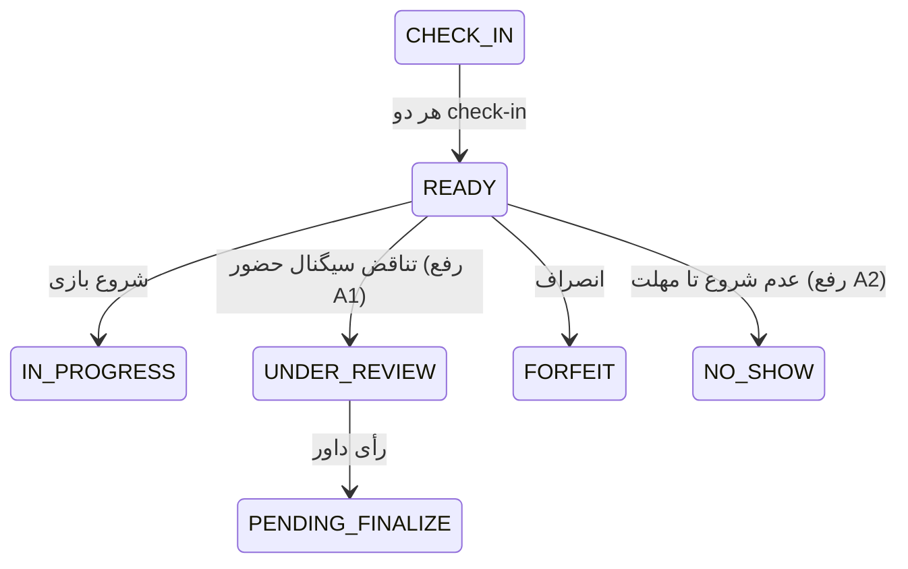
```mermaid
stateDiagram-v2
    CHECK_IN --> READY: هر دو check-in
    READY --> IN_PROGRESS: شروع بازی
    READY --> UNDER_REVIEW: تناقض سیگنال حضور (رفع A1)
    READY --> FORFEIT: انصراف
    READY --> NO_SHOW: عدم شروع تا مهلت (رفع A2)
    UNDER_REVIEW --> PENDING_FINALIZE: رأی داور
```

**معیار پذیرش:** اگر دو طرف وضعیت حضور متناقض گزارش کنند، Match به `UNDER_REVIEW` می‌رود و به صف داور اضافه می‌شود؛ هیچ‌گاه از `READY` مستقیماً به `FINALIZED` پرش نمی‌شود.

#### رفع A2 — No-show پس از check-in (EDGE-23)
**تصمیم:** دو گذار جدید به ۶.۱ افزوده می‌شود:
- `READY → NO_SHOW` (هر دو check-in کردند ولی یکی تا `T_start_grace` شروع نکرد).
- `IN_PROGRESS → UNDER_REVIEW` (بازی شروع شد ولی یک طرف ترک کرد/قطع شد و طرف فعال «عدم ادامه» گزارش داد).

| محرک | از حالت | به حالت | تریگر |
|---|---|---|---|
| عدم شروع پس از grace | `READY` | `NO_SHOW` | تایمر `T_start_grace` منقضی + گزارش طرف فعال |
| ترک/قطع وسط بازی | `IN_PROGRESS` | `UNDER_REVIEW` | گزارش «حریف نیامد/ترک کرد» → بررسی proof |

**معیار پذیرش:** سناریوی «check-in کرد ولی پای بازی نیامد» دیگر بلاتکلیف نمی‌ماند؛ یک مسیر تعریف‌شده تا `FINALIZED(NO_SHOW)` یا داوری وجود دارد.

#### رفع A3 — مبدأ تایمر `T_report`
**تصمیم:** مبدأ `close-report-window` از زمان مطلق `scheduledAt + reportWindowMin` به **لحظه‌ی واقعی ورود به `AWAITING_REPORT`** تغییر می‌کند (event-relative، نه absolute). job مربوطه هنگام گذار به `AWAITING_REPORT` زمان‌بندی (schedule) می‌شود، نه هنگام ساخت Match.

**معیار پذیرش:** اگر بازی دیرتر از `scheduledAt` تمام شود، پنجره‌ی گزارش همیشه `reportWindowMin` کامل دارد؛ هرگز صفر/منفی نمی‌شود.

#### رفع A4 — موجودیت‌ها و enumهای ناموجود
**تصمیم:** موارد زیر به‌صورت **رسمی به مدل پایه** افزوده می‌شوند (پایان وضعیت «پیشنهاد افزودن»):

| افزوده | تعریف رسمی |
|---|---|
| `AuditLog` | موجودیت در ERD با `id, actorId, action, entityType, entityId, before(json), after(json), createdAt`. |
| `LedgerEntry` | `id, walletId, type(enum), direction(DEBIT/CREDIT), amount, currency, refType, refId, idempotencyKey, createdAt`. |
| `SeedingMethod` (enum) | `RANDOM, RANKED, MANUAL, BUCHHOLZ`. |
| `Lobby`, `LobbyEntry` | برای FFA (رفع A5). |
| `ResultSource=BYE` | مقدار جدید enum (رفع D3). |
| `Result.supersededBy` | نسخه‌بندی immutable-with-history (رفع E3). |
| `User.timezone`, `Tournament.displayTimezone` | منطقه‌ی زمانی (رفع D5). |
| `TeamMode.minSize` | حداقل roster (رفع D7). |
| `AccountNamespace` | تفکیک هویت launcher از `PlatformCode` (رفع E1). |
| `KycCase`, `Payout` | چرخه‌ی مالی (رفع B3/C1). |

**معیار پذیرش:** هیچ بخشی دیگر به فیلد «پیشنهادی» تکیه ندارد؛ یک lint قراردادی، ارجاع به نام‌های خارج از مدل پایه را رد می‌کند.

#### رفع A5 — FFA / Battle Royale (Warzone) — بحرانی‌ترین حفره
**تصمیم معماری:** به‌جای تعمیم پرخطر `Match` دوطرفه، یک مسیر **موازی `Lobby`** معرفی می‌شود. `GameConfig.genre ∈ {DUEL, TEAM, FFA}` تعیین می‌کند کدام مسیر فعال است.

- **`DUEL`/`TEAM`** → مسیر `Match` (دوطرفه، `WinnerSide`).
- **`FFA`** → مسیر `Lobby` (چند `LobbyEntry`، نتیجه‌ی **رتبه‌ای/placement**).

ماشین حالت `Lobby` (مشترک در اسکلت با Match، اما گزارش/تأیید چندطرفه):

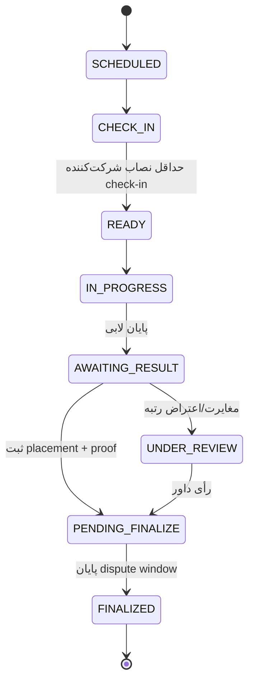
```mermaid
stateDiagram-v2
    [*] --> SCHEDULED
    SCHEDULED --> CHECK_IN
    CHECK_IN --> READY: حداقل نصاب شرکت‌کننده check-in
    READY --> IN_PROGRESS
    IN_PROGRESS --> AWAITING_RESULT: پایان لابی
    AWAITING_RESULT --> PENDING_FINALIZE: ثبت placement + proof
    AWAITING_RESULT --> UNDER_REVIEW: مغایرت/اعتراض رتبه
    UNDER_REVIEW --> PENDING_FINALIZE: رأی داور
    PENDING_FINALIZE --> FINALIZED: پایان dispute window
    FINALIZED --> [*]
```

**قواعد چندطرفه:**
- نتیجه به‌جای `WinnerSide ∈ {A,B,DRAW}` یک **جدول placement** است (`LobbyEntry.placement` + `points` طبق `resultSchema.placementPoints`).
- گزارش: نتیجه‌ی رتبه‌ای را می‌توان توسط ادمین/میزبان لابی یا با اجماع آپلود proof ثبت کرد؛ اختلاف هر شرکت‌کننده روی رتبه‌ی خودش → `UNDER_REVIEW`.
- check-in: نصاب حداقلی (`Lobby.minCheckIn`) به‌جای «هر دو طرف».

**معیار پذیرش:** یک لابی ۱۰۰ نفره‌ی Battle Royale از ابتدا تا توزیع جایزه‌ی رتبه‌ای بدون ارجاع به `sideA/sideB` قابل اجراست.

### دسته C — حفره‌های منطقی سیستم‌شکن

#### رفع C1 — فلوی payout با KYC و چندبرنده
**تصمیم:** یک **بخش مالی مستقل (§۹)** با موجودیت `Payout` و ماشین حالت آن ایجاد می‌شود. قواعد قطعی:

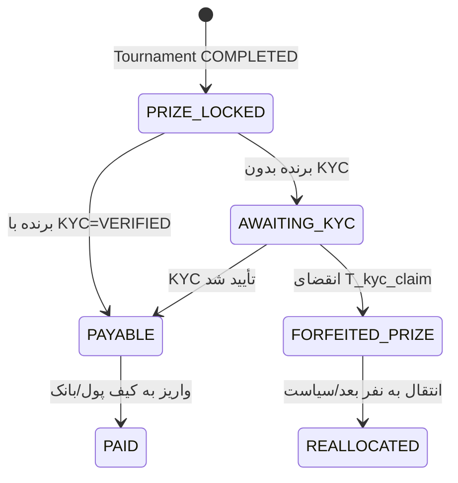
```mermaid
stateDiagram-v2
    [*] --> PRIZE_LOCKED: Tournament COMPLETED
    PRIZE_LOCKED --> AWAITING_KYC: برنده بدون KYC
    PRIZE_LOCKED --> PAYABLE: برنده با KYC=VERIFIED
    AWAITING_KYC --> PAYABLE: KYC تأیید شد
    AWAITING_KYC --> FORFEITED_PRIZE: انقضای T_kyc_claim
    PAYABLE --> PAID: واریز به کیف پول/بانک
    FORFEITED_PRIZE --> REALLOCATED: انتقال به نفر بعد/سیاست
```

| پرسش منتقد | تصمیم رسمی |
|---|---|
| اگر برنده KYC نکند؟ | مهلت `T_kyc_claim` (پیش‌فرض ۳۰ روز). پس از آن `FORFEITED_PRIZE`. |
| جایزه تا ابد در escrow می‌ماند؟ | خیر؛ پس از مهلت طبق `prizeForfeitPolicy` آزاد می‌شود: `REALLOCATE_NEXT` (نفر بعد) یا `RETURN_POOL`. |
| آزادسازی per-rank به پایان تورنومنت گره است یا به Match؟ | **به `Tournament.COMPLETED`** برای جوایز رتبه‌ای. FINALIZED تک‌Match فقط escrow ورودی آن جفت را تسویه می‌کند، نه جایزه‌ی رتبه‌ای را (رفع تناقض C1). |

**معیار پذیرش:** هیچ سناریویی پول را برای همیشه قفل نمی‌کند؛ تطبیق روزانه‌ی ledger صفر مغایرت دارد.

#### رفع C2 — rollback مالی هماهنگ با rollback براکت
**تصمیم:** هر `recompute` براکت که یک Match `FINALIZED` را باطل می‌کند، **اجباراً** یک تراکنش جبرانی مالی تولید می‌کند:

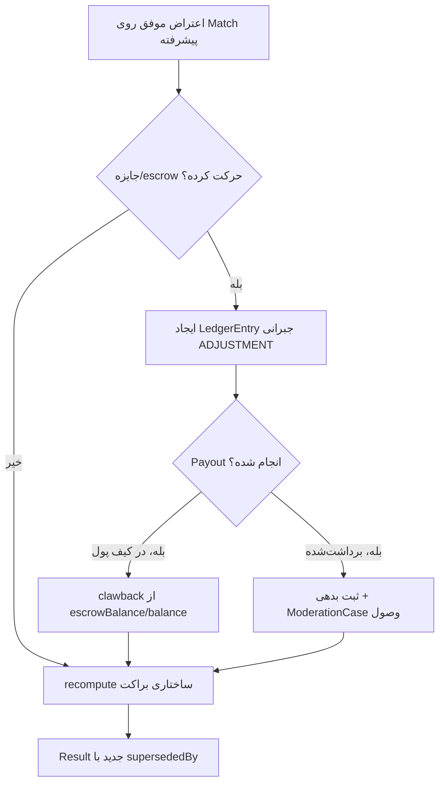
```mermaid
flowchart TD
    A[اعتراض موفق روی Match پیشرفته] --> B{جایزه/escrow حرکت کرده؟}
    B -- خیر --> C[recompute ساختاری براکت]
    B -- بله --> D[ایجاد LedgerEntry جبرانی ADJUSTMENT]
    D --> E{Payout انجام شده؟}
    E -- بله، در کیف پول --> F[clawback از escrowBalance/balance]
    E -- بله، برداشت‌شده --> G[ثبت بدهی + ModerationCase وصول]
    F --> C
    G --> C
    C --> H[Result جدید با supersededBy]
```

**قاعده‌ی طلایی:** rollback ساختاری و rollback مالی در **یک تراکنش ACID** اتمیک‌اند؛ اگر جبران مالی شکست بخورد، recompute نیز برنمی‌گردد (یا برعکس، با خروجی پرچم‌دار به داور).

**معیار پذیرش:** سناریوی «اعتراض موفق + پول حرکت‌کرده + براکت پیشرفته» همیشه به یک حالت سازگار می‌رسد؛ هیچ پولی بدون رکورد جبرانی جابه‌جا نمی‌ماند.

#### رفع C3 — تداخل پنجره‌ی اعتراض با پیشروی در تورنومنت زنده
**تصمیم:** `disputeWindowMin` بر اساس `Tournament.pace` پیکربندی می‌شود:

| pace | disputeWindowMin پیش‌فرض | سیاست پیشروی |
|---|---|---|
| `ASYNC` (ناهم‌زمان) | ۱۲۰ دقیقه | پیشروی فقط پس از پایان پنجره |
| `LIVE` (زنده/فشرده) | ۵–۱۵ دقیقه | پیشروی پس از پنجره‌ی کوتاه؛ اعتراض دیرهنگام → مسیر `POST_ADVANCE_DISPUTE` با recompute (C2) |

**معیار پذیرش:** تورنومنت زنده با پنجره‌ی کوتاه پشت‌سرهم اجرا می‌شود؛ اعتراض پس از پیشروی همچنان ممکن است اما از مسیر recompute عبور می‌کند، نه انتظار ۲ ساعته‌ی دور بعد.

#### رفع C4 — `autoConfirmOnMatch=false`
**تصمیم:** گذار `AWAITING_REPORT → UNDER_REVIEW` با شرط دوم رسمی می‌شود: **«اجماع گزارش‌ها ولی `GameConfig.autoConfirmOnMatch=false`»** (علاوه بر شرط موجود «مغایرت گزارش»). این به ۶.۱ افزوده می‌شود.

**معیار پذیرش:** بازی‌های حساس (FFA یا high-stakes) با `autoConfirmOnMatch=false` حتی در صورت اجماع، از داوری انسانی عبور می‌کنند.

#### رفع C5 — Hold ظرفیت در برابر قفل اتمیک
**تصمیم:** Hold بخشی از شمارش ظرفیت می‌شود. تعریف رسمی:

```
effectiveCount = confirmedCount + activeHoldCount
slot در دسترس ⇔ effectiveCount < capacity
```

- ورود به `PENDING_PAYMENT` یک **hold اتمیک** می‌گیرد (`SELECT ... FOR UPDATE` روی شمارنده).
- اگر `effectiveCount = capacity`، کاربر مستقیم `WAITLISTED` می‌شود (نه `PENDING_PAYMENT`).
- انقضای hold (۱۰ دقیقه) یا پرداخت ناموفق → آزادسازی اتمیک hold.

**معیار پذیرش:** دو نفر هرگز نمی‌توانند هم‌زمان آخرین slot را hold کنند؛ EDGE-20 («پرداخت موفق ولی ظرفیت پر») رخ نمی‌دهد مگر در حالت پرداخت برون‌خط که آن‌گاه `ADJUSTMENT` + استرداد خودکار اعمال می‌شود.

#### رفع C6 — reschedule روی Match در حال اجرا
**تصمیم:** اثر تغییر `scheduledAt` به حالت فعلی Match وابسته است:

| حالت فعلی Match | اثر reschedule |
|---|---|
| `SCHEDULED` | همه‌ی jobها لغو/بازتولید؛ بدون اثر جانبی. |
| `CHECK_IN` | اگر زمان **جلو** برود: check-inهای ثبت‌شده **حفظ** می‌شوند، تایمرها بازتولید. اگر **عقب** برود: نیازمند تأیید ادمین؛ check-in معتبر می‌ماند. |
| `IN_PROGRESS`/`READY` | reschedule **رد می‌شود** مگر با اقدام داور (override)؛ هیچ گذار معکوس خودکار به `SCHEDULED` وجود ندارد. |

**معیار پذیرش:** ابزار reschedule هرگز ماشین حالت را به وضعیت نامعتبر نمی‌برد؛ بازگشت به `SCHEDULED` فقط با اقدام صریح داور و ثبت در `AuditLog`.

### دسته D — حالات لبه‌ی جامانده

#### رفع D6 — اعتراض روی `NO_SHOW`/`FORFEIT` — مهم (بی‌عدالتی)
**تصمیم:** مسیر `NO_SHOW`/`FORFEIT` نیز از `PENDING_FINALIZE` عبور می‌کند تا پنجره‌ی اعتراض داشته باشد:

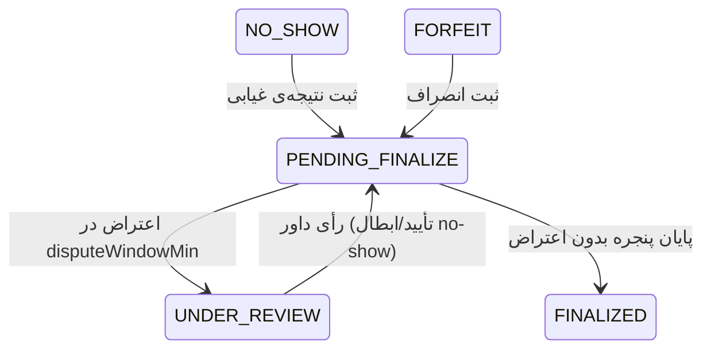
```mermaid
stateDiagram-v2
    NO_SHOW --> PENDING_FINALIZE: ثبت نتیجه‌ی غیابی
    FORFEIT --> PENDING_FINALIZE: ثبت انصراف
    PENDING_FINALIZE --> UNDER_REVIEW: اعتراض در disputeWindowMin
    PENDING_FINALIZE --> FINALIZED: پایان پنجره بدون اعتراض
    UNDER_REVIEW --> PENDING_FINALIZE: رأی داور (تأیید/ابطال no-show)
```

**معیار پذیرش:** کسی که no-show خورده ولی قطعی اینترنت داشته، در `disputeWindowMin` می‌تواند با proof (مثلاً لاگ قطعی) اعتراض کند؛ تناقض ماشین حالت ↔ EDGE-02 رفع می‌شود.

#### رفع D1 — tiebreak درون‌مسابقه‌ای در حذفی
**تصمیم:** در حذفی، `allowDraw=false` دیگر تساوی را صرفاً **رد** نمی‌کند؛ `GameConfig.tiebreakPolicy` تعیین می‌کند:

| tiebreakPolicy | رفتار هنگام تساوی در حذفی |
|---|---|
| `EXTRA_GAME` | افزودن خودکار یک `MatchGame` (وقت اضافه/گیم اضافه). |
| `PENALTY_FIELD` | ثبت فیلد جداگانه‌ی پنالتی در `resultSchema`. |
| `REFEREE` | ارجاع به داور برای تعیین برنده. |

**معیار پذیرش:** فوتبال در مرحله‌ی حذفی که واقعاً مساوی شده، در بن‌بست نمی‌ماند؛ مسیر تعیین برنده وجود دارد.

#### رفع D2 — عدم‌تطابق پلتفرم در check-in (بریف بند ۲۴)
**تصمیم:** گذار جدید **«اصلاح داوری platformContext»** افزوده می‌شود: داور می‌تواند `platformContext` اشتباه را اصلاح کند و Match به `READY` بازگردد، **بدون جریمه‌ی no-show**.

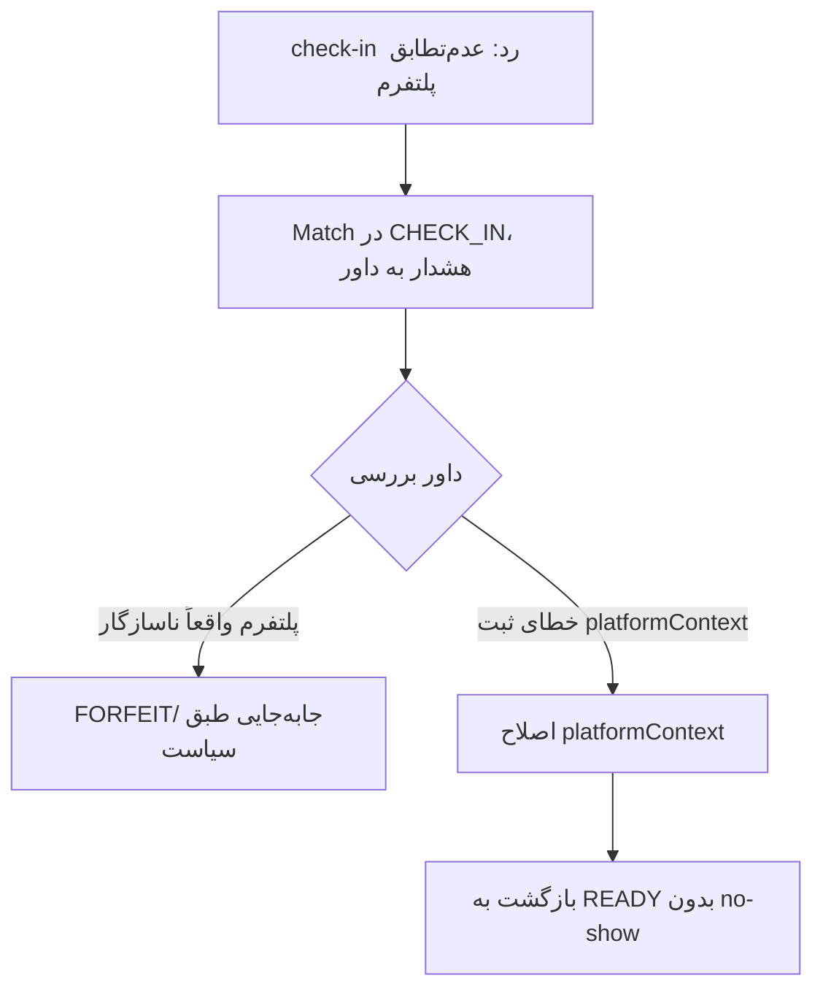
```mermaid
flowchart TD
    A[check-in رد: عدم‌تطابق پلتفرم] --> B[Match در CHECK_IN، هشدار به داور]
    B --> C{داور بررسی}
    C -- پلتفرم واقعاً ناسازگار --> D[FORFEIT/جابه‌جایی طبق سیاست]
    C -- خطای ثبت platformContext --> E[اصلاح platformContext]
    E --> F[بازگشت به READY بدون no-show]
```

**معیار پذیرش:** بازیکن حاضر که پلتفرمش اشتباه ثبت شده، no-show حساب نمی‌شود.

#### رفع D7 — تیم ناقص هنگام شروع + check-in تیمی
**تصمیم:** `TeamMode.minSize` افزوده می‌شود. قواعد:
- اگر `roster_active ≥ minSize` → تیم می‌تواند ادامه دهد؛ در غیر این صورت `FORFEIT`.
- check-in تیمی: `GameConfig.teamCheckInPolicy ∈ {CAPTAIN_ONLY, ALL_MEMBERS, MIN_SIZE}` تعیین می‌کند چه کسانی باید check-in کنند (پیش‌فرض `MIN_SIZE`).

**معیار پذیرش:** قاعده‌ی «اعضای باقی‌مانده ≥ حداقل» قابل‌ارزیابی است؛ EDGE-16 پاسخ دارد.

#### رفع D4 — چرخه‌ی promote از waitlist با پرداخت
**تصمیم:** چرخه‌ی رسمی:
```
slot آزاد → اولین WAITLISTED → PENDING_PAYMENT (با hold + مهلت T_pay) 
  → پرداخت موفق → CONFIRMED
  → مهلت منقضی → بازگشت به WAITLISTED انتها + promote نفر بعد
```
**معیار پذیرش:** slot نه می‌سوزد نه قفل می‌شود؛ race با قفل اتمیک C5 حل است.

#### رفع D9 / D10 — تلطیف قاعده‌ی hash و شمارش گیم
- **D9:** hash یکسان دو طرف دیگر مستقیماً «تقلب» نیست؛ به **پرچم نرم (soft flag)** با زمینه تبدیل می‌شود (اگر یکی proof نداشت و دیگری فرستاد، طبیعی است). فقط در صورت تجمیع چند سیگنال → داوری.
- **D10:** شمارش/`VOID` گیم‌ها بر اساس `resultSchema.scoringMode ∈ {SET_COUNT, POINT_SUM}` تعریف می‌شود؛ گیم بازی‌شده‌ای که داده‌ی معتبر دارد بایگانی می‌شود (نه حذف)، فقط از شمارش برد کنار می‌رود.

### دسته E — نام‌گذاری و ارجاع

#### رفع E1 — تفکیک Platform از AccountNamespace
**تصمیم:** `PlatformCode` (سخت‌افزار: PC/PS5/PS4/XBOX_SERIES/...) از **`AccountNamespace`** (هویت/launcher: Steam/Epic/EA/Activision/PSN/XboxLive/...) تفکیک می‌شود. هر `GameConfig` نگاشت `PlatformCode → AccountNamespace[]` و `gamertagPattern` per namespace دارد.

**معیار پذیرش:** «PC با هویت Steam» و «PC با هویت Epic» قابل تمایزند؛ regex درست per namespace اعمال می‌شود.

#### رفع E3 — immutable-with-history برای `Result`
**تصمیم:** `Result.supersededBy` و `Result.version` افزوده می‌شوند. «بازنویسی» اعتراض موفق = **ساخت نسخه‌ی جدید** که قبلی را با `supersededBy` به آن اشاره می‌دهد؛ نسخه‌ی قبلی در `AuditLog` می‌ماند. تناقض زبانی immutable/rewrite رفع می‌شود.

### جمع‌بندی فشرده‌ی یافته‌های جزئی

| یافته | تصمیم |
|---|---|
| **B1** wizard ساخت (UC08) | بخش جدید §۱۱ «ساخت و مدیریت تورنومنت»: مراحل wizard، اعتبارسنجی هر گام (سازگاری `format` با `GameConfig.allowedFormats`)، پیش‌نمایش، `DRAFT → PUBLISHED`. |
| **B2** UC18/25/26/27 | بخش جدید §۱۰ «پشتیبانی و تعدیل» با `ModerationCase` (OPEN→IN_REVIEW→RESOLVED/CLOSED) و گره به `DISQUALIFIED`. |
| **B3** KYC/برداشت | §۹ مالی: ماشین `KycCase` و `Payout`؛ تطبیق سن خوداظهاری ثبت‌نام با KYC → در صورت مغایرت `DISQUALIFIED` + ثبت در `AuditLog`. |
| **B4** استریم/چت (Post-MVP) | placeholder رسمی در IA داشبورد با برچسب «رزرو فاز بعد». |
| **D3** BYE | `ResultSource=BYE` رسمی؛ آمار no-show آلوده نمی‌شود. |
| **D5** timezone | `User.timezone`, `Tournament.displayTimezone` در مدل پایه. |
| **D8** زمان‌بندی چنددوره‌ای | `Stage.schedulingPolicy ∈ {FIXED, PER_ROUND_AUTO, ADMIN_SET}`؛ Swiss دور بعد پس از نهایی‌شدن دور قبل زمان‌بندی می‌شود، round-robin از پیش. |
| **E2** Cross-Play موبایل | نمونه‌ی `crossPlayGroup` موبایل + قاعده‌ی جداسازی ورودی (input-based) در بخش پلتفرم. |

---

## ماتریس ردیابی سناریوها

این ماتریس **هر سناریوی صریح بریف کاربر** (خطوط ۱۰–۲۴ و موارد تأکیدی ۳۷–۴۳) را به بخش/مکانیزم پوشش‌دهنده نگاشت می‌کند. ستون «وضعیت» تأیید می‌کند که پس از رفع گپ‌ها، هیچ سناریویی جا نمانده است.

### سناریوهای اصلی بریف (بند ۱۰)

| # | سناریوی بریف | بخش پوشش‌دهنده | مکانیزم | وضعیت |
|---|---|---|---|---|
| ۱ | ایجاد آسان تورنومنت (wizard) | §۱۱ ساخت تورنومنت (UC08) | wizard چندمرحله‌ای، اعتبارسنجی per گام، `DRAFT→PUBLISHED` | پوشش با رفع B1 |
| ۲ | ثبت‌نام بدون خطا (اعتبارسنجی گیمرتگ) | §۴ ثبت‌نام + §۵ پلتفرم | `gamertagPattern` per `AccountNamespace` (رفع E1) | پوشش |
| ۳ | چه ساعتی مسابقه بدهم (زمان‌بندی) | §۸ زمان‌بندی + §۶ براکت | `scheduledAt`، `Stage.schedulingPolicy` (رفع D8)، `displayTimezone` (D5) | پوشش با رفع D8 |
| ۴ | داشبورد لحظه‌ای | §۱۲ داشبورد | Socket.IO، IA داشبورد، placeholder استریم/چت (B4) | پوشش |
| ۵ | پیام/پیامک به‌موقع | §۸ اطلاع‌رسانی (UC15) | jobهای BullMQ: یادآوری/شروع/نتیجه | پوشش |
| ۶ | برنده‌ها شفاف | §۷ نتیجه + §۶ براکت | جدول رده‌بندی، `Result` نهایی، براکت زنده | پوشش |
| ۷ | برنده ثبت، بازنده اعتراض | §۷ نتیجه/اعتراض (UC10/23) | گزارش دوطرفه + `dispute window` | پوشش |
| ۸ | داوری انسانی | §۷ داوری (UC11/24) | Referee، `UNDER_REVIEW`، proof | پوشش |
| ۹ | No-show گزارش | §۳ ماشین حالت + §۷ | `READY/IN_PROGRESS → NO_SHOW/UNDER_REVIEW` (رفع A2) | پوشش با رفع A2 |
| ۱۰ | حضور/Check-in | §۵ پلتفرم + §۳ | حالت `CHECK_IN`، check-in تیمی (رفع D7) | پوشش |
| ۱۱ | پیشروی به دور بعد + به‌روزرسانی براکت | §۶ موتور براکت | پیشروی پس از `FINALIZED`، recompute (C2) | پوشش |
| ۱۲ | فرمت‌ها (حذفی/گروهی/...) | §۶ براکت | `Stage.format`، `SeedingMethod` (رفع A4) | پوشش |
| ۱۳ | سازگاری پلتفرم (per-game) | §۵ Cross-Play | `crossPlayGroup` در `GameConfig` | پوشش |
| ۱۴ | کاتالوگ حالات لبه و خطا | §۱۲ EDGE-ها + §۱۳ رفع گپ‌ها | قطع اتصال، تساوی، دو no-show، نتیجه‌ی دیر، اعتراض هم‌زمان، استرداد، عدم‌تطابق پلتفرم | پوشش (جزئیات زیر) |

### زیرسناریوهای «حالات لبه» (بند ۱۴) و موارد تأکیدی (بند ۳۷–۴۳)

| زیرسناریو | بخش/مکانیزم | وضعیت |
|---|---|---|
| قطع اتصال وسط بازی | §۳ `IN_PROGRESS → UNDER_REVIEW` (رفع A2) + proof | پوشش |
| تساوی (گروهی) | §۷ `allowDraw=true` + `DRAW` | پوشش |
| تساوی در حذفی | §۷ `tiebreakPolicy` (رفع D1) | پوشش با رفع D1 |
| هر دو no-show | §۳/§۷ نتیجه‌ی دوطرفه‌ی غیابی → باخت هر دو/ابطال Match | پوشش |
| نتیجه‌ی دیرهنگام | §۸ `T_report` event-relative (رفع A3) | پوشش با رفع A3 |
| اعتراض هم‌زمان دو طرف | §۷ یک `ModerationCase`/dispute مشترک به داور | پوشش |
| استرداد در لغو | §۹ مالی: `REFUND` از escrow طبق `cancelPolicy` | پوشش با §۹ جدید |
| عدم‌تطابق پلتفرم در check-in | §۵ اصلاح داوری platformContext (رفع D2) | پوشش با رفع D2 |
| تعداد فرد / تکمیل‌نشدن جدول | §۶ `BYE`/walkover/seeding/گرد به توان ۲ (D3) | پوشش با رفع D3 |
| ژانر→قالب نتیجه (1v1/تیمی/FFA) | §۲ `GameConfig.genre` + §۳ مسیر `Lobby` (رفع A5) | پوشش با رفع A5 |
| Battle Royale موبایل (PUBG/Free Fire) | §۳ `Lobby`/placement (رفع A5) + §۹ payout رتبه‌ای | پوشش با رفع A5 |
| سیستم اکانت (Steam/PSN/Activision...) | §۵ `AccountNamespace` (رفع E1) | پوشش با رفع E1 |
| نوع ورودی / جداسازی موبایل-PC | §۵ Cross-Play موبایل (رفع E2) | پوشش با رفع E2 |
| نوع برگزاری (حذفی/لیگ/Ladder/on-demand/چندروزه/هیبریدی) | §۶ + `Tournament.runningMode` + `pace` (رفع C3) | پوشش |
| ساختار (براکت/گروهی→پلی‌آف/lobby-based) | §۶ `Stage` چندگانه + `Lobby` | پوشش |
| موبایل/کنسول انحصاری | §۵ `GameConfig.platformExclusivity` | پوشش |

### ردیابی پوشش یوزکیس‌های پروپوزال (تأیید عدم جاماندگی)

| UC | عنوان | محل پوشش | وضعیت پیش از سند | وضعیت پس از سند |
|---|---|---|---|---|
| UC08 | ایجاد مسابقه | §۱۱ (جدید) | جا مانده (B1) | پوشش |
| UC09 | ویرایش/حذف مسابقه | §۱۱ + §۸ reschedule (C6) | ناقص | پوشش |
| UC18 | بررسی گزارش تخلف | §۱۰ (جدید) | لمس‌شده در ضدتقلب | پوشش |
| UC25 | امتیازدهی به مسابقه | §۱۰ (جدید) | غایب (B2) | پوشش |
| UC26 | ارتباط با پشتیبانی | §۱۰ `ModerationCase` | غایب (B2) | پوشش |
| UC27 | گزارش تخلف | §۱۰ + گره به `DISQUALIFIED` | لمس‌شده | پوشش |
| UC29 | برداشت جایزه | §۹ `Payout` (جدید) | فقط نام‌برده (B3) | پوشش |
| UC30 | احراز هویت KYC | §۹ `KycCase` (جدید) | فقط نام‌برده (B3) | پوشش |
| UC16 | استریم زنده | §۱۲ placeholder (Post-MVP) | غایب (B4) | رزرو فاز بعد |
| UC17 | چت مسابقه | §۱۲ placeholder (Post-MVP) | غایب (B4) | رزرو فاز بعد |

**نتیجه‌ی ردیابی:** پس از رفع گپ‌های A1–A5، C1–C6، D1–D10، E1–E3 و افزودن سه بخش جدید (§۹ مالی، §۱۰ تعدیل، §۱۱ ساخت تورنومنت)، **هیچ سناریوی صریح بریف و هیچ یوزکیس MVP پروپوزال بدون پوشش نمانده است**. تنها موارد عمداً معوق (UC16 استریم، UC17 چت) به‌صورت رسمی Post-MVP علامت خورده‌اند، هم‌راستا با §۱.۳ پروپوزال.

---

# بخش ۱ — مدل پایه‌ی عمومی و Config-Driven پلتفرم برگزاری مسابقات آنلاین

> **جایگاه این سند:** این سند **ستون فقرات (canonical base model)** پلتفرم است. همه‌ی بخش‌های بعدی (ماشین‌های حالت، فلوهای ثبت‌نام/نتیجه/اعتراض، داشبورد، اطلاع‌رسانی، مالی) به موجودیت‌ها، Enumها و نام‌حالت‌های **رسمی** تعریف‌شده در همین‌جا ارجاع می‌دهند. هیچ بخش بعدی نباید نام حالت یا فیلد جدیدی خارج از این سند اختراع کند؛ اگر لازم شد، اینجا اضافه می‌شود.
>
> **اصل بنیادین (Prime Directive):** سیستم **داده‌محور (data-driven)** است. هر «بازی» یک **GameConfig** است که در پایگاه داده ذخیره می‌شود؛ افزودن بازی جدید = ساخت یک رکورد config، **نه** کدنویسی مجدد. منطق دامنه (ثبت‌نام، تطبیق پلتفرم، seeding، تأیید نتیجه، رده‌بندی) **عمومی** است و رفتارش را از config می‌خواند. FC26 صرفاً یک نمونه‌ی config است.
>
> **مرزِ صداقتِ config-driven:** فرم‌ها، پلتفرم‌ها، گروه‌های cross-play، فرمت‌ها، اندازه‌ی تیم، اسکیمای نتیجه/اثبات و قوانین امتیازدهیِ **پارامتریک** کاملاً داده‌محورند. اما اگر یک بازی به **الگوریتم امتیازدهی واقعاً جدید** (مثلاً سیستم رتبه‌بندی سفارشی Battle Royale با وزن‌دهی غیرخطی) نیاز داشته باشد، آن الگوریتم به‌صورت یک **ScoringStrategy پلاگین‌پذیر** افزوده می‌شود و config فقط آن را با کلید انتخاب می‌کند (بخش ۳.۵).

---

## فهرست مطالب
1. اصول معماری مدل
2. موجودیت‌های اصلی دامنه (ERD + فیلدهای کلیدی)
3. مدل پلتفرم و Cross-Play
4. اسکیمای پیکربندی بازی (GameConfig) — قلب داده‌محوری
5. Enumها و حالت‌های کلیدی (فهرست رسمی نام‌حالت‌ها)
6. ماشین‌های حالت رسمی (Mermaid)
7. واژه‌نامه و قراردادهای نام‌گذاری

---

## ۱. اصول معماری مدل

| اصل | توضیح | پیامد طراحی |
|---|---|---|
| **Config over Code** | رفتار per-game از `GameConfig` خوانده می‌شود. | هیچ `if (game === 'FC26')` در کد نیست. |
| **سلسله‌مراتب ثابت رویداد** | `Tournament → Stage → Group → Round → Match → MatchGame` همیشه برقرار است (درس Toornament). | هر سطح می‌تواند صفر باشد ولی ترتیب حفظ می‌شود. |
| **Participant انتزاعی** | شرکت‌کننده یا `Player` است یا `Team`؛ منطق بالادست نمی‌داند کدام. | فرمت 1v1 و teamساده با یک مدل. |
| **انسان‌در‌حلقه (Human-in-the-loop)** | چون API بازی‌ها وجود ندارد، نتیجه با اثبات + داور نهایی می‌شود. | حالت‌های `AWAITING_PROOF`, `UNDER_REVIEW`, `DISPUTED` در ماشین Match اجباری‌اند. |
| **یکپارچگی مالی ACID** | پول فقط از طریق `LedgerEntry` دوطرفه حرکت می‌کند؛ Escrow تا پایان مهلت اعتراض قفل است. | هیچ تغییر `Wallet.balance` بدون ردیف ledger متعادل. |
| **Idempotency سراسری** | هر فرمان مالی/Webhook با `idempotencyKey` یکتا. | اجرای دوباره = بی‌اثر. |
| **Soft enum, hard transition** | نام‌حالت‌ها رشته‌ی enum‌اند ولی گذارها در ماشین حالت قفل‌اند. | بخش‌های بعد فقط از همین نام‌ها استفاده می‌کنند. |
| **Audit-everything** | هر گذار حساس → `AuditLog`. | تأیید نتیجه، حرکت پول، تغییر RBAC ثبت می‌شوند. |

---

## ۲. موجودیت‌های اصلی دامنه

### ۲.۱ نمودار رابطه‌ای (ERD)

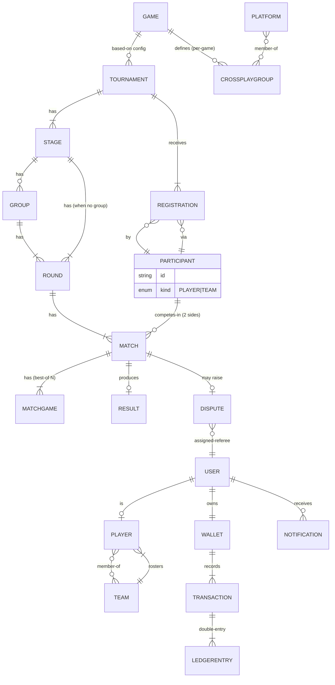
```mermaid
erDiagram
    GAME ||--o{ TOURNAMENT : "based-on config"
    GAME ||--o{ CROSSPLAYGROUP : "defines (per-game)"
    PLATFORM }o--o{ CROSSPLAYGROUP : "member-of"
    TOURNAMENT ||--|{ STAGE : has
    STAGE ||--o{ GROUP : has
    GROUP ||--|{ ROUND : has
    STAGE ||--|{ ROUND : "has (when no group)"
    ROUND ||--|{ MATCH : has
    MATCH ||--|{ MATCHGAME : "has (best-of N)"
    MATCH ||--o| RESULT : "produces"
    MATCH ||--o| DISPUTE : "may raise"
    PARTICIPANT ||--o{ REGISTRATION : "via"
    TOURNAMENT ||--|{ REGISTRATION : receives
    REGISTRATION }o--|| PARTICIPANT : "by"
    PARTICIPANT ||--o{ MATCH : "competes-in (2 sides)"
    USER ||--o| PLAYER : "is"
    TEAM ||--|{ PLAYER : "rosters"
    PLAYER }o--o{ TEAM : "member-of"
    USER ||--|| WALLET : owns
    WALLET ||--|{ TRANSACTION : records
    TRANSACTION ||--|{ LEDGERENTRY : "double-entry"
    USER ||--o{ NOTIFICATION : receives
    DISPUTE }o--|| USER : "assigned-referee"
    PARTICIPANT {
        string id
        enum kind "PLAYER|TEAM"
    }
```

> **یادداشت سلسله‌مراتب:** `GROUP` اختیاری است. در فرمت **Single/Double Elimination** معمولاً `Stage` مستقیماً `Round` دارد (بدون Group). در فرمت **Round-Robin/Group** ابتدا `Group` و سپس `Round` درون هر گروه. این انعطاف با رابطه‌ی دوگانه‌ی `STAGE ||--|{ ROUND` و `GROUP ||--|{ ROUND` مدل شده است (دقیقاً یکی فعال است؛ بخش ۴.۳).

### ۲.۲ موجودیت‌ها و فیلدهای کلیدی

#### Game / Discipline
بازی پایه و نسخه‌ی config آن. «Discipline» = یک حالت قابل‌مسابقه‌ی درون یک بازی (مثلاً FC26 → «Ultimate Team 1v1» و «Co-op 2v2» دو Discipline مجزا با config متفاوت).

| فیلد | نوع | توضیح |
|---|---|---|
| `id` | uuid | — |
| `slug` | string یکتا | `fc26`, `warzone`, `r6siege` |
| `title` | string | نام نمایشی |
| `iconUrl` / `coverUrl` | string | دارایی‌های بصری |
| `status` | `GameStatus` | `DRAFT \| ACTIVE \| HIDDEN \| ARCHIVED` |
| `config` | `GameConfig` (JSONB) | **کل پیکربندی داده‌محور — بخش ۴** |
| `disciplines[]` | Discipline[] | حالت‌های مسابقه‌ای |
| `createdBy` | userId (Main Admin) | UC06 |

#### Platform
پلتفرم/کنسول. **ثابت سراسری سیستم** (catalog)، نه per-game.

| فیلد | نوع | توضیح |
|---|---|---|
| `code` | `PlatformCode` (enum) | `PC, PS5, PS4, XBOX_SERIES, XBOX_ONE, SWITCH, IOS, ANDROID` |
| `title` | string | «PlayStation 5» |
| `family` | string | `playstation \| xbox \| nintendo \| pc \| mobile` |
| `gamertagPattern` | regex (پیش‌فرض) | الگوی پایه‌ی اعتبارسنجی هندل (می‌تواند per-game override شود) |

#### CrossPlayGroup
**per-game** تعریف می‌شود (درون `GameConfig`)، نه ثابت در کد. مشخص می‌کند کدام پلتفرم‌ها در این بازی می‌توانند با هم بازی کنند.

| فیلد | نوع | توضیح |
|---|---|---|
| `key` | string | `cross-current-gen`, `pc-only`, `sony-family` |
| `label` | string | نام نمایشی برای کاربر |
| `platforms[]` | PlatformCode[] | اعضای گروه |
| `note` | string? | مثلاً «Xbox One خارج است» |

#### Tournament
نمونه‌ی واقعی یک رویداد بر پایه‌ی یک Game/Discipline.

| فیلد | نوع | توضیح |
|---|---|---|
| `id` | uuid | — |
| `gameId` / `disciplineId` | fk | بازی پایه |
| `title`, `coverUrl`, `description` | — | UI |
| `format` | `TournamentFormat` | `SINGLE_ELIM \| DOUBLE_ELIM \| ROUND_ROBIN \| GROUP_THEN_KNOCKOUT \| SWISS \| LADDER` |
| `platformPolicy` | object | `{ allowedPlatforms[], crossPlayGroupKey, mode: SHARED_POOL \| SEPARATE_BRACKET }` |
| `teamSize` | int | از config بازی (۱ برای 1v1) |
| `bestOf` | int | تعداد MatchGame هر Match (۱،۳،۵…) |
| `capacity` | object | `{ minParticipants, maxParticipants }` |
| `entryFee` | money | می‌تواند ۰ باشد |
| `prizePool` | object | تعریف جوایز per-rank (بخش مالی) |
| `schedule` | object | `{ registrationOpensAt, registrationClosesAt, checkInOpensAt, startsAt, ... }` |
| `checkInPolicy` | object | `{ required: bool, windowMinutesBefore, ... }` |
| `resultPolicy` | object | `{ reportWindowMin, disputeWindowMin, requireProof: bool }` |
| `state` | `TournamentState` | بخش ۵ |
| `createdBy` | gameAdminId | UC08 |
| `communityEnabled` | bool | **اختیاری، به‌خواست ادمین** (انتخاب در wizard §۱۱)؛ پیش‌فرض `false`. اگر `true`، یک `Space` نوع `TOURNAMENT` برای این مسابقه ساخته می‌شود (§۱۳)؛ اگر `false`، هیچ کامیونیتی ساخته نمی‌شود. |

#### Stage
مرحله‌ی تورنومنت (مثلاً «گروه‌بندی» سپس «حذفی»). یک تورنومنت ≥۱ Stage.

| فیلد | توضیح |
|---|---|
| `id`, `tournamentId` | — |
| `order` | ترتیب مرحله (۱،۲…) |
| `type` | `GROUP \| BRACKET_SE \| BRACKET_DE \| SWISS \| ROUND_ROBIN` |
| `advancementRule` | چند نفر/تیم از این Stage به بعدی صعود می‌کنند |
| `state` | `StageState`: `PENDING \| RUNNING \| COMPLETED` |

#### Group
گروه درون یک Stage (فقط در فرمت‌های گروهی). شامل جدول رده‌بندی محلی.

| فیلد | توضیح |
|---|---|
| `id`, `stageId`, `label` | «گروه A» |
| `participants[]` | اعضای گروه |
| `standings` | جدول رده‌بندی محاسبه‌شده (Win/Draw/Loss/Points/Tiebreak) |

#### Round
دور درون یک Group یا Stage (مثلاً «دور ۱ / یک‌هشتم نهایی»).

| فیلد | توضیح |
|---|---|
| `id`, `parentType` | `GROUP \| STAGE` |
| `index`, `label` | «Round of 16», «هفته ۳» |
| `bracketPosition` | جایگاه در براکت (برای elimination) |
| `state` | `RoundState`: `PENDING \| RUNNING \| COMPLETED` |

#### Match
رویارویی دو `Participant`. **مرکز ثقل عملیاتی سیستم**؛ ماشین حالت کامل (بخش ۶).

| فیلد | نوع | توضیح |
|---|---|---|
| `id`, `roundId` | — | — |
| `sideA`, `sideB` | participantId? | می‌تواند BYE/خالی باشد |
| `platformContext` | object | پلتفرم هر طرف + cross-play group تأییدشده در check-in |
| `scheduledAt` | datetime | UC: «چه ساعتی مسابقه بدهم» |
| `bestOf` | int | تعداد MatchGame |
| `checkIn` | object | `{ aCheckedAt, bCheckedAt }` |
| `reportedScores` | object | گزارش هر طرف `{ aReport, bReport }` |
| `state` | `MatchState` | **بخش ۵ — فهرست رسمی** |
| `winnerSide` | enum? | `A \| B \| DRAW \| null` |
| `resultId`, `disputeId` | fk? | — |
| `noShowReportedBy` | side? | UC09 (No-show) |

#### MatchGame
یک «گیم/مپ/ست» منفرد درون یک Match (مثلاً ست ۲ از بازی best-of-3). محل ثبت اسکور خام و اثبات.

| فیلد | توضیح |
|---|---|
| `id`, `matchId`, `index` | گیم n-ام |
| `scoreA`, `scoreB` | اسکور خام طبق `resultSchema` بازی |
| `mapOrMode` | (اختیاری per-game) نقشه/حالت |
| `proofRefs[]` | ارجاع به فایل‌های اثبات (با hash) |
| `state` | `MatchGameState`: `PENDING \| REPORTED \| CONFIRMED \| VOID` |

#### Participant (Player / Team)
انتزاع شرکت‌کننده.

| فیلد | توضیح |
|---|---|
| `id`, `kind` | `PLAYER \| TEAM` |
| `displayName` | — |
| `platformHandles` | نگاشت `PlatformCode → handle` (گیمرتگ/یوزرنیم، **اعتبارسنجی‌شده**) |
| `primaryPlatform` | PlatformCode انتخابی برای این تورنومنت |
| **Player**: `userId` | پیوند به User |
| **Team**: `roster[]`, `captainUserId` | اعضا + کاپیتان |

#### Registration
رکورد ثبت‌نام یک Participant در یک Tournament. شامل وضعیت پرداخت و check-in.

| فیلد | نوع | توضیح |
|---|---|---|
| `id`, `tournamentId`, `participantId` | — | — |
| `platform` | PlatformCode | پلتفرم اعلام‌شده (باید با `platformPolicy` سازگار باشد) |
| `handleSnapshot` | string | گیمرتگ تأییدشده در لحظه‌ی ثبت‌نام |
| `state` | `RegistrationState` | بخش ۵ |
| `paymentTxnId` | fk? | UC21 (include) |
| `checkedInAt` | datetime? | UC: Check-in |
| `seed` | int? | برای seeding براکت |

#### Result
نتیجه‌ی **نهایی‌شده‌ی** یک Match (پس از تأیید). تغییرناپذیر پس از `FINALIZED`.

| فیلد | توضیح |
|---|---|
| `id`, `matchId` | — |
| `winnerSide`, `scoreSummary` | خلاصه‌ی گیم‌به‌گیم |
| `source` | `MUTUAL_AGREEMENT \| REFEREE_DECISION \| NO_SHOW \| FORFEIT \| DISPUTE_RESOLUTION` |
| `finalizedAt`, `finalizedBy` | داور یا سیستم |
| `proofHashes[]` | اثبات‌های پیوست |

#### Dispute
پرونده‌ی اعتراض/اختلاف روی یک Match (UC23 → UC24 → UC11).

| فیلد | نوع | توضیح |
|---|---|---|
| `id`, `matchId`, `raisedBy` | — | کاربر معترض |
| `reason`, `evidenceRefs[]` | — | مدرک |
| `state` | `DisputeState` | بخش ۵ |
| `assignedRefereeId` | fk? | UC24 |
| `resolution`, `resolvedAt` | — | رأی نهایی |

#### Wallet / Transaction (+ LedgerEntry)
کیف پول داخلی + دفتر کل دوطرفه (ACID).

| Wallet | توضیح |
|---|---|
| `id`, `userId` | یک کیف پول per user |
| `balance`, `escrowBalance`, `currency` | موجودی آزاد + قفل‌شده در escrow |

| Transaction | توضیح |
|---|---|
| `id`, `walletId`, `type` | `TransactionType` (زیر) |
| `amount`, `state` | `TransactionState`: `PENDING \| SETTLED \| FAILED \| REVERSED` |
| `idempotencyKey` | یکتا — ضد دوبار‌پرداخت |
| `ledgerEntries[]` | ردیف‌های متعادل دوطرفه (debit/credit) |
| `gatewayRef` | ارجاع زرین‌پال + امضای webook |

`TransactionType`: `DEPOSIT \| ENTRY_FEE \| ESCROW_HOLD \| ESCROW_RELEASE \| PRIZE_PAYOUT \| REFUND \| WITHDRAWAL \| FEE \| ADJUSTMENT`

#### Notification
اطلاع‌رسانی چندکاناله (UC15 توسط Scheduler).

| فیلد | توضیح |
|---|---|
| `id`, `userId`, `channel` | `IN_APP \| EMAIL \| SMS` |
| `templateKey` | کلید قالب (`match.reminder`, `result.finalized`, `checkin.open` …) |
| `payload` | داده‌ی جای‌گذاری قالب |
| `state` | `NotificationState`: `QUEUED \| SENT \| DELIVERED \| FAILED` |
| `scheduledAt`, `sentAt` | زمان‌بندی |

---

## ۳. مدل پلتفرم و Cross-Play

### ۳.۱ کاتالوگ پلتفرم‌ها (ثابت سراسری)

| `PlatformCode` | عنوان | `family` |
|---|---|---|
| `PC` | PC | pc |
| `PS5` | PlayStation 5 | playstation |
| `PS4` | PlayStation 4 | playstation |
| `XBOX_SERIES` | Xbox Series X\|S | xbox |
| `XBOX_ONE` | Xbox One | xbox |
| `SWITCH` | Nintendo Switch | nintendo |
| `IOS` | iOS | mobile |
| `ANDROID` | Android | mobile |

> پلتفرم‌ها **catalog سراسری**اند؛ اما **اینکه کدام مجاز است و کدام با کدام cross-play دارد، per-game در `GameConfig` تعیین می‌شود.**

### ۳.۲ مفهوم Cross-Play Group (per-game)

هر بازی فهرستی از `crossPlayGroups[]` در config دارد. یک «گروه» مجموعه‌ای از پلتفرم‌هاست که **می‌توانند با هم بازی کنند**. دو Participant فقط در صورتی قابل‌جفت‌شدن‌اند که پلتفرم‌شان در **یک گروه مشترک** باشد.

**مثال (FC26):**

| `key` | اعضا | یادداشت |
|---|---|---|
| `cross-current-gen` | `PC, PS5, XBOX_SERIES` | نسل جدید + PC با هم |
| `legacy-gen` | `PS4, XBOX_ONE` | نسل قبل جدا |

پیامد: `PS5` و `XBOX_SERIES` می‌توانند بازی کنند؛ `XBOX_ONE` با `XBOX_SERIES` **نمی‌تواند** (در گروه‌های متفاوت‌اند) — دقیقاً سناریوی بریف.

### ۳.۳ سیاست پلتفرم تورنومنت (`platformPolicy`)

هنگام ساخت تورنومنت، ادمین از میان گزینه‌های مجازِ بازی انتخاب می‌کند:

| `mode` | معنی | استفاده |
|---|---|---|
| `SHARED_POOL` | همه در یک استخر؛ جفت‌سازی فقط درون یک cross-play group مجاز | بازی‌های کاملاً cross-play |
| `SEPARATE_BRACKET` | براکت/گروه جدا به‌ازای هر cross-play group | وقتی پلتفرم‌ها قابل‌اختلاط نیستند |

### ۳.۴ قاعده‌ی سازگاری جفت‌سازی (Match Eligibility) — جدول قوانین

| شرط | نتیجه |
|---|---|
| پلتفرم A و B در **یک** crossPlayGroup مجازِ تورنومنت | ✅ Match مجاز |
| پلتفرم A و B در گروه‌های **متفاوت** و `mode=SHARED_POOL` | ❌ رد در seeding؛ بازچینش |
| `mode=SEPARATE_BRACKET` | هر Participant فقط در براکت گروه خودش seed می‌شود |
| پلتفرم اعلام‌شده در check-in ≠ پلتفرم Registration | ❌ check-in رد؛ نیاز به اصلاح/داور (حالت لبه) |
| یکی از طرفین BYE | ✅ بدون نیاز به تطبیق |

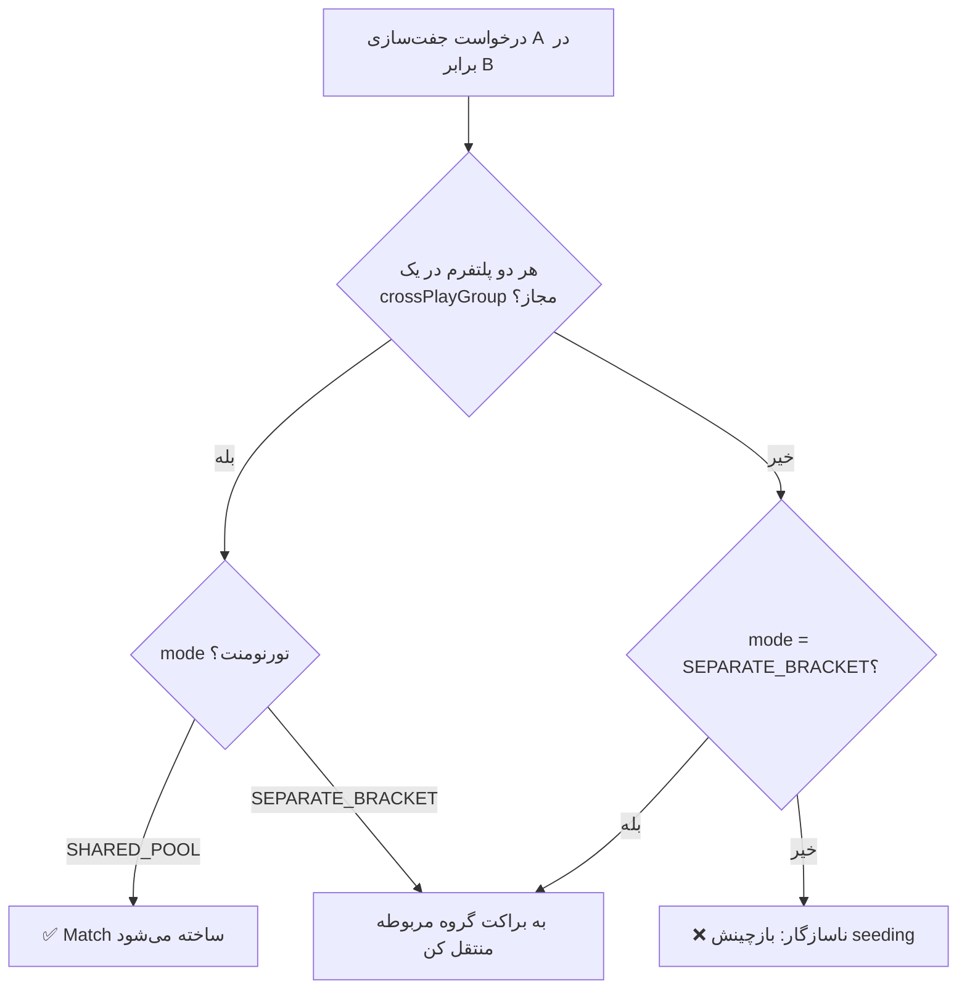
```mermaid
flowchart TD
    A[درخواست جفت‌سازی A در برابر B] --> B{هر دو پلتفرم در یک<br/>crossPlayGroup مجاز؟}
    B -- بله --> C{mode تورنومنت؟}
    B -- خیر --> D{mode = SEPARATE_BRACKET؟}
    D -- بله --> E[به براکت گروه مربوطه منتقل کن]
    D -- خیر --> F[❌ ناسازگار: بازچینش seeding]
    C -- SHARED_POOL --> G[✅ Match ساخته می‌شود]
    C -- SEPARATE_BRACKET --> E
```

### ۳.۵ اعتبارسنجی هندل پلتفرم (ضد سناریوی «گیمرتگ اشتباه»)

- هر `PlatformCode` یک `gamertagPattern` (regex) پیش‌فرض دارد؛ `GameConfig` می‌تواند override کند.
- ثبت‌نام تا زمانی که `platformHandles[primaryPlatform]` با الگو تطبیق نکند، **بلوکه** می‌شود (`RegistrationState.NEEDS_FIX`).
- معیار پذیرش: ثبت‌نام با گیمرتگ نامعتبر هرگز به `CONFIRMED` نمی‌رسد.

---

## ۴. اسکیمای پیکربندی بازی (GameConfig) — قلب داده‌محوری

این اسکیما در فیلد `Game.config` (JSONB) ذخیره می‌شود. **افزودن بازی جدید = پر کردن همین فرم.**

### ۴.۱ اسکیمای کامل (TypeScript-like)

```ts
interface GameConfig {
  schemaVersion: number;                 // نسخه‌بندی config برای migration

  // — پلتفرم و cross-play —
  allowedPlatforms: PlatformCode[];      // زیرمجموعه‌ی catalog سراسری
  crossPlayGroups: CrossPlayGroup[];     // per-game (بخش ۳)

  // — فرمت و ساختار مسابقه —
  allowedFormats: TournamentFormat[];    // کدام فرمت‌ها برای این بازی مجازند
  defaultFormat: TournamentFormat;
  teamModes: TeamMode[];                 // {mode:'SOLO', size:1} یا {mode:'TEAM', size:5}
  bestOfOptions: number[];               // [1,3,5]
  allowDraw: boolean;                    // آیا تساوی ممکن است (فوتبال بله، حذفی خیر)

  // — اسکیمای نتیجه —
  resultSchema: ResultSchema;            // ساختار اسکور خام هر MatchGame
  scoringStrategyKey: ScoringStrategyKey;// کلید الگوریتم امتیازدهی (پلاگین)
  scoringParams: Record<string, number>; // پارامترهای امتیازدهی (winPts, drawPts…)
  tiebreakers: TiebreakerKey[];          // ترتیب tiebreak جدول گروهی

  // — اثبات و تأیید —
  proofSchema: ProofSchema;              // چه اثباتی، اجباری/اختیاری
  resultPolicyDefaults: {
    reportWindowMin: number;             // مهلت گزارش نتیجه
    disputeWindowMin: number;            // مهلت اعتراض (escrow تا اینجا قفل)
    requireProof: boolean;
    autoConfirmOnMatch: boolean;         // اگر دو گزارش یکی شد، خودکار به PENDING_FINALIZE
  };

  // — check-in و no-show —
  checkInDefaults: { required: boolean; windowMinutesBefore: number; graceMinutes: number; };

  // — قوانین آزاد —
  rulesetText: string;                   // متن قوانین نمایشی (RTL)
  customFields?: CustomField[];          // فیلدهای فرم اضافی per-game
}
```

### ۴.۲ اجزای کلیدی config

**`ResultSchema`** — ساختار اسکور خام یک `MatchGame`:

| `kind` | شکل اسکور | مثال بازی |
|---|---|---|
| `SCORELINE` | `{ scoreA: int, scoreB: int }` | FC26 (۳ بر ۱) |
| `ROUNDS_WON` | `{ roundsA: int, roundsB: int }` | R6 Siege |
| `PLACEMENT` | `{ placement: int، kills: int }` | Warzone (Battle Royale) |
| `BEST_TIME` | `{ timeMs: int }` | مسابقات سرعت |
| `CUSTOM` | JSON آزاد طبق `customFields` | بازی‌های خاص |

**`ScoringStrategyKey`** (پلاگین امتیازدهی — مرز config-driven):

| کلید | منطق | پارامترها |
|---|---|---|
| `WIN_DRAW_LOSS` | برد/تساوی/باخت → امتیاز | `winPts, drawPts, lossPts` |
| `MAP_DIFFERENTIAL` | اختلاف گیم/راند | `winPts` + tiebreak تفاضل |
| `BR_PLACEMENT_KILLS` | امتیاز رتبه + کیل | `placementTable, killPts` |
| `LOWEST_TIME` | کمترین زمان برنده | — |

> اگر بازی جدیدی منطق امتیازدهی واقعاً تازه بخواهد، یک `ScoringStrategyKey` تازه به‌صورت کد افزوده و سپس از config انتخاب می‌شود — **این تنها نقطه‌ای است که افزودن بازی ممکن است به توسعه نیاز داشته باشد** (هم‌راستا با اصلاحیه‌ی ماژول B پروپوزال).

**`ProofSchema`**:

| فیلد | توضیح |
|---|---|
| `types[]` | `SCREENSHOT \| CLIP \| MATCH_ID` |
| `required` | اجباری بودن آپلود |
| `minCount`, `maxSizeMB` | محدودیت‌ها |
| `hashOnUpload` | ذخیره‌ی hash برای تشخیص دستکاری (ضدتقلب، بخش ۵ پروپوزال) |

**`TeamMode`**: `{ mode: 'SOLO' | 'TEAM', size: int }` — `size=1` برای 1v1؛ `size=N` برای تیمی.

### ۴.۳ نگاشت فرمت → ساختار سلسله‌مراتب

| `TournamentFormat` | Stageها | Group؟ | ساختار Round |
|---|---|---|---|
| `SINGLE_ELIM` | ۱ Stage حذفی | خیر | براکت تک‌حذفی |
| `DOUBLE_ELIM` | ۱ Stage | خیر | براکت برنده + بازنده |
| `ROUND_ROBIN` | ۱ Stage گروهی | بله (≥۱ گروه) | دورهای round-robin |
| `GROUP_THEN_KNOCKOUT` | ۲ Stage | بله در Stage۱ | گروهی سپس حذفی |
| `SWISS` | ۱ Stage | خیر | دورهای سوئیسی |
| `LADDER` | ۱ Stage | خیر | چالش‌محور پیوسته |

### ۴.۴ نمونه‌ی واقعی — `GameConfig` برای FC26 (1v1)

```json
{
  "schemaVersion": 1,
  "allowedPlatforms": ["PC","PS5","PS4","XBOX_SERIES","XBOX_ONE"],
  "crossPlayGroups": [
    { "key": "cross-current-gen", "label": "نسل جدید + PC",
      "platforms": ["PC","PS5","XBOX_SERIES"] },
    { "key": "legacy-gen", "label": "نسل قبل",
      "platforms": ["PS4","XBOX_ONE"], "note": "با نسل جدید cross-play ندارد" }
  ],
  "allowedFormats": ["SINGLE_ELIM","DOUBLE_ELIM","GROUP_THEN_KNOCKOUT"],
  "defaultFormat": "SINGLE_ELIM",
  "teamModes": [{ "mode": "SOLO", "size": 1 }],
  "bestOfOptions": [1,3],
  "allowDraw": false,
  "resultSchema": { "kind": "SCORELINE" },
  "scoringStrategyKey": "WIN_DRAW_LOSS",
  "scoringParams": { "winPts": 3, "drawPts": 1, "lossPts": 0 },
  "tiebreakers": ["HEAD_TO_HEAD","GOAL_DIFF","GOALS_FOR"],
  "proofSchema": { "types": ["SCREENSHOT"], "required": true, "minCount": 1, "maxSizeMB": 10, "hashOnUpload": true },
  "resultPolicyDefaults": { "reportWindowMin": 30, "disputeWindowMin": 120, "requireProof": true, "autoConfirmOnMatch": true },
  "checkInDefaults": { "required": true, "windowMinutesBefore": 15, "graceMinutes": 10 },
  "rulesetText": "نتیجه‌ی پایان بازی را با اسکرین‌شات ثبت کنید..."
}
```

### ۴.۵ فرایند onboarding بازی جدید (UC06)

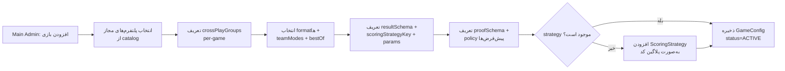
```mermaid
flowchart LR
    A[Main Admin: افزودن بازی] --> B[انتخاب پلتفرم‌های مجاز<br/>از catalog]
    B --> C[تعریف crossPlayGroups<br/>per-game]
    C --> D[انتخاب formatها +<br/>teamModes + bestOf]
    D --> E[تعریف resultSchema +<br/>scoringStrategyKey + params]
    E --> F[تعریف proofSchema +<br/>policy پیش‌فرض‌ها]
    F --> G{strategy موجود است؟}
    G -- بله --> H[ذخیره GameConfig<br/>status=ACTIVE]
    G -- خیر --> I[افزودن ScoringStrategy<br/>به‌صورت پلاگین کد]
    I --> H
```

**معیار پذیرش onboarding:** یک بازی استاندارد (با strategy موجود) باید **بدون استقرار کد جدید** صرفاً با فرم config فعال شود.

---

## ۵. Enumها و حالت‌های کلیدی (فهرست رسمی)

> این نام‌ها **رسمی و الزام‌آور** برای همه‌ی بخش‌های بعدی‌اند. هیچ بخشی نباید نام دیگری به‌کار ببرد.

### ۵.۱ `TournamentState`

| حالت | معنی |
|---|---|
| `DRAFT` | در حال ساخت توسط Game Admin |
| `PUBLISHED` | منتشر، اما ثبت‌نام هنوز باز نشده |
| `REGISTRATION_OPEN` | ثبت‌نام باز |
| `REGISTRATION_CLOSED` | ثبت‌نام بسته، در انتظار شروع |
| `CHECK_IN` | پنجره‌ی check-in فعال |
| `SEEDING` | چینش/قرعه‌کشی براکت‌ها |
| `RUNNING` | در حال اجرا |
| `COMPLETED` | پایان‌یافته، برنده مشخص |
| `CANCELLED` | لغوشده (با استرداد) |

### ۵.۲ `RegistrationState`

| حالت | معنی |
|---|---|
| `PENDING_PAYMENT` | منتظر پرداخت (UC21) |
| `NEEDS_FIX` | گیمرتگ/پلتفرم نامعتبر؛ نیاز به اصلاح |
| `CONFIRMED` | تأییدشده، در فهرست شرکت‌کنندگان |
| `CHECKED_IN` | حضور تأییدشده |
| `WAITLISTED` | فهرست انتظار (ظرفیت پر) |
| `WITHDRAWN` | انصراف کاربر |
| `DISQUALIFIED` | حذف توسط داور/ادمین |
| `REFUNDED` | استرداد انجام‌شده (لغو تورنومنت/انصراف مجاز) |

### ۵.۳ `MatchState` (مرکزی — ماشین کامل در ۶.۱)

| حالت | معنی |
|---|---|
| `SCHEDULED` | زمان‌بندی‌شده، هنوز شروع نشده |
| `CHECK_IN` | منتظر check-in طرفین |
| `READY` | هر دو حاضر، آماده‌ی بازی |
| `IN_PROGRESS` | در حال بازی |
| `AWAITING_REPORT` | منتظر گزارش نتیجه‌ی طرفین |
| `AWAITING_PROOF` | گزارش هست، اثبات ناقص |
| `PENDING_FINALIZE` | گزارش‌ها منطبق + اثبات معتبر؛ منتظر پایان مهلت اعتراض |
| `UNDER_REVIEW` | مغایرت/نبود اثبات؛ نزد داور (UC11) |
| `DISPUTED` | اعتراض ثبت‌شده (UC23) |
| `FINALIZED` | نتیجه نهایی و تغییرناپذیر |
| `NO_SHOW` | عدم حضور یک/دو طرف |
| `FORFEIT` | انصراف/واگذاری |
| `VOID` | باطل (هر دو no-show / تصمیم داور) |
| `CANCELLED` | لغوشده با تورنومنت |

### ۵.۴ `DisputeState`

| حالت | معنی |
|---|---|
| `OPEN` | باز، در انتظار تخصیص داور |
| `UNDER_REVIEW` | در حال بررسی توسط داور (UC24) |
| `NEEDS_MORE_EVIDENCE` | داور درخواست مدرک بیشتر کرده |
| `RESOLVED_UPHELD` | اعتراض وارد؛ نتیجه تغییر کرد |
| `RESOLVED_REJECTED` | اعتراض رد؛ نتیجه‌ی اولیه پابرجا |
| `ESCALATED` | ارجاع به سطح بالاتر (Main Admin) |
| `WITHDRAWN` | پس‌گرفته‌شده توسط معترض |

### ۵.۵ Enumهای پشتیبان (فهرست رسمی)

| Enum | مقادیر |
|---|---|
| `PlatformCode` | `PC, PS5, PS4, XBOX_SERIES, XBOX_ONE, SWITCH, IOS, ANDROID` |
| `TournamentFormat` | `SINGLE_ELIM, DOUBLE_ELIM, ROUND_ROBIN, GROUP_THEN_KNOCKOUT, SWISS, LADDER` |
| `PlatformMode` | `SHARED_POOL, SEPARATE_BRACKET` |
| `ParticipantKind` | `PLAYER, TEAM` |
| `MatchGameState` | `PENDING, REPORTED, CONFIRMED, VOID` |
| `WinnerSide` | `A, B, DRAW, NULL` |
| `ResultSource` | `MUTUAL_AGREEMENT, REFEREE_DECISION, NO_SHOW, FORFEIT, DISPUTE_RESOLUTION` |
| `TransactionType` | `DEPOSIT, ENTRY_FEE, ESCROW_HOLD, ESCROW_RELEASE, PRIZE_PAYOUT, REFUND, WITHDRAWAL, FEE, ADJUSTMENT` |
| `TransactionState` | `PENDING, SETTLED, FAILED, REVERSED` |
| `NotificationChannel` | `IN_APP, EMAIL, SMS` |
| `NotificationState` | `QUEUED, SENT, DELIVERED, FAILED` |
| `GameStatus` | `DRAFT, ACTIVE, HIDDEN, ARCHIVED` |
| `StageState` / `RoundState` | `PENDING, RUNNING, COMPLETED` |

---

## ۶. ماشین‌های حالت رسمی

### ۶.۱ `MatchState` (انسان‌در‌حلقه — مرجع همه‌ی بخش‌های نتیجه/اعتراض)

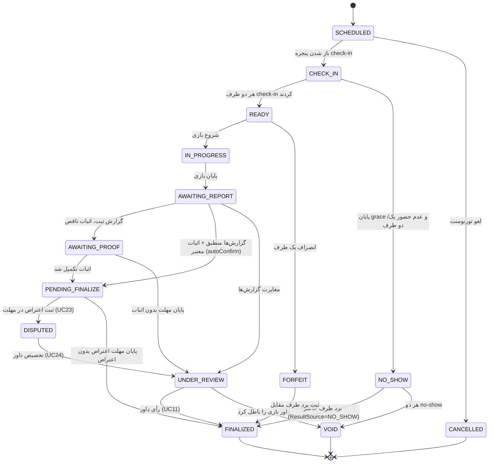
```mermaid
stateDiagram-v2
    [*] --> SCHEDULED
    SCHEDULED --> CHECK_IN : باز شدن پنجره check-in
    CHECK_IN --> READY : هر دو طرف check-in کردند
    CHECK_IN --> NO_SHOW : پایان grace و عدم حضور یک/دو طرف
    READY --> IN_PROGRESS : شروع بازی
    IN_PROGRESS --> AWAITING_REPORT : پایان بازی
    AWAITING_REPORT --> AWAITING_PROOF : گزارش ثبت، اثبات ناقص
    AWAITING_REPORT --> PENDING_FINALIZE : گزارش‌ها منطبق + اثبات معتبر (autoConfirm)
    AWAITING_REPORT --> UNDER_REVIEW : مغایرت گزارش‌ها
    AWAITING_PROOF --> PENDING_FINALIZE : اثبات تکمیل شد
    AWAITING_PROOF --> UNDER_REVIEW : پایان مهلت بدون اثبات
    PENDING_FINALIZE --> DISPUTED : ثبت اعتراض در مهلت (UC23)
    PENDING_FINALIZE --> FINALIZED : پایان مهلت اعتراض بدون اعتراض
    UNDER_REVIEW --> FINALIZED : رأی داور (UC11)
    UNDER_REVIEW --> VOID : داور بازی را باطل کرد
    DISPUTED --> UNDER_REVIEW : تخصیص داور (UC24)
    NO_SHOW --> FINALIZED : برد طرف حاضر (ResultSource=NO_SHOW)
    NO_SHOW --> VOID : هر دو no-show
    READY --> FORFEIT : انصراف یک طرف
    FORFEIT --> FINALIZED : ثبت برد طرف مقابل
    SCHEDULED --> CANCELLED : لغو تورنومنت
    FINALIZED --> [*]
    VOID --> [*]
    CANCELLED --> [*]
```

**حالات لبه‌ی پوشش‌داده‌شده:** قطع وسط بازی (`IN_PROGRESS → AWAITING_REPORT` با اثبات قطع → احتمال `UNDER_REVIEW`)، تساوی (`WinnerSide=DRAW` فقط اگر `allowDraw=true`)، هر دو no-show (`→ VOID`)، نتیجه‌ی دیرهنگام (پایان `reportWindow` → `UNDER_REVIEW`)، اعتراض هم‌زمان دو طرف (یک `Dispute` با هر دو طرف معترض)، عدم‌تطابق پلتفرم در check-in (رد check-in؛ نیاز به داور).

### ۶.۲ `TournamentState`

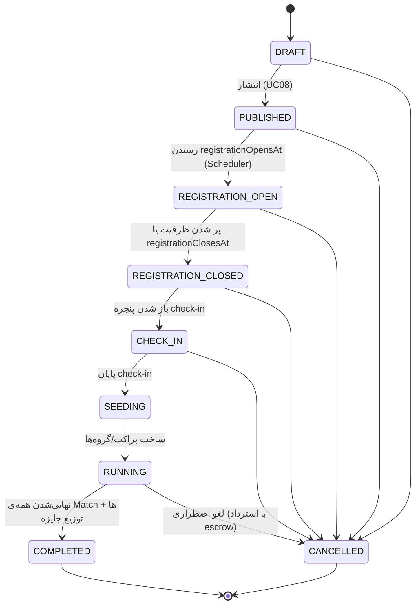
```mermaid
stateDiagram-v2
    [*] --> DRAFT
    DRAFT --> PUBLISHED : انتشار (UC08)
    PUBLISHED --> REGISTRATION_OPEN : رسیدن registrationOpensAt (Scheduler)
    REGISTRATION_OPEN --> REGISTRATION_CLOSED : پر شدن ظرفیت یا registrationClosesAt
    REGISTRATION_CLOSED --> CHECK_IN : باز شدن پنجره check-in
    CHECK_IN --> SEEDING : پایان check-in
    SEEDING --> RUNNING : ساخت براکت/گروه‌ها
    RUNNING --> COMPLETED : نهایی‌شدن همه‌ی Matchها + توزیع جایزه
    DRAFT --> CANCELLED
    PUBLISHED --> CANCELLED
    REGISTRATION_OPEN --> CANCELLED
    REGISTRATION_CLOSED --> CANCELLED
    CHECK_IN --> CANCELLED
    RUNNING --> CANCELLED : لغو اضطراری (با استرداد escrow)
    COMPLETED --> [*]
    CANCELLED --> [*]
```

### ۶.۳ `RegistrationState`

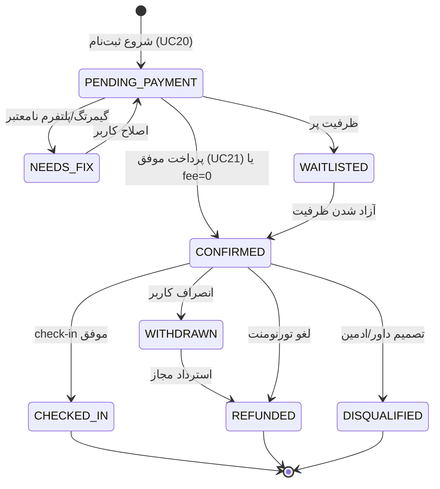
```mermaid
stateDiagram-v2
    [*] --> PENDING_PAYMENT : شروع ثبت‌نام (UC20)
    PENDING_PAYMENT --> NEEDS_FIX : گیمرتگ/پلتفرم نامعتبر
    NEEDS_FIX --> PENDING_PAYMENT : اصلاح کاربر
    PENDING_PAYMENT --> CONFIRMED : پرداخت موفق (UC21) یا fee=0
    PENDING_PAYMENT --> WAITLISTED : ظرفیت پر
    CONFIRMED --> CHECKED_IN : check-in موفق
    CONFIRMED --> WITHDRAWN : انصراف کاربر
    WAITLISTED --> CONFIRMED : آزاد شدن ظرفیت
    CONFIRMED --> DISQUALIFIED : تصمیم داور/ادمین
    WITHDRAWN --> REFUNDED : استرداد مجاز
    CONFIRMED --> REFUNDED : لغو تورنومنت
    CHECKED_IN --> [*]
    REFUNDED --> [*]
    DISQUALIFIED --> [*]
```

### ۶.۴ `DisputeState`

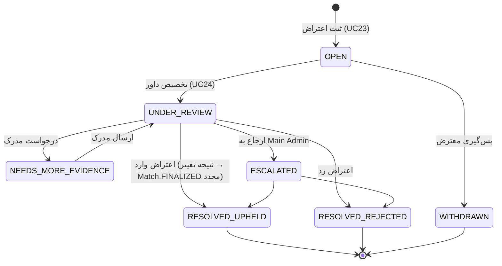
```mermaid
stateDiagram-v2
    [*] --> OPEN : ثبت اعتراض (UC23)
    OPEN --> UNDER_REVIEW : تخصیص داور (UC24)
    UNDER_REVIEW --> NEEDS_MORE_EVIDENCE : درخواست مدرک
    NEEDS_MORE_EVIDENCE --> UNDER_REVIEW : ارسال مدرک
    UNDER_REVIEW --> RESOLVED_UPHELD : اعتراض وارد (نتیجه تغییر → Match.FINALIZED مجدد)
    UNDER_REVIEW --> RESOLVED_REJECTED : اعتراض رد
    UNDER_REVIEW --> ESCALATED : ارجاع به Main Admin
    ESCALATED --> RESOLVED_UPHELD
    ESCALATED --> RESOLVED_REJECTED
    OPEN --> WITHDRAWN : پس‌گیری معترض
    RESOLVED_UPHELD --> [*]
    RESOLVED_REJECTED --> [*]
    WITHDRAWN --> [*]
```

---

## ۷. واژه‌نامه و قراردادهای نام‌گذاری

| واژه | تعریف |
|---|---|
| **GameConfig** | شیء JSONB داده‌محور که کل رفتار per-game را تعریف می‌کند (بخش ۴). |
| **Discipline** | حالت قابل‌مسابقه‌ی درون یک بازی؛ هر کدام config مستقل. |
| **CrossPlayGroup** | مجموعه‌ی پلتفرم‌های قابل‌بازی‌با‌هم، **per-game** در config. |
| **Participant** | انتزاع شرکت‌کننده: `PLAYER` یا `TEAM`. |
| **Side A/B** | دو طرف یک Match؛ مستقل از Player/Team. |
| **ScoringStrategy** | پلاگین امتیازدهی که با `scoringStrategyKey` از config انتخاب می‌شود. |
| **Escrow** | موجودی قفل‌شده‌ی جایزه تا پایان مهلت اعتراض و KYC برنده. |
| **Human-in-the-loop** | تأیید نتیجه با اثبات + داور، چون API بازی وجود ندارد. |

**قراردادها:**
- نام‌حالت‌ها همیشه `UPPER_SNAKE_CASE` و دقیقاً از فهرست بخش ۵.
- هر گذار حساس (FINALIZED, حرکت پول، تغییر RBAC) → `AuditLog`.
- هیچ تغییر `Wallet.balance` بدون `LedgerEntry` متعادل دوطرفه.
- هر فرمان مالی/Webhook با `idempotencyKey` یکتا.

---

> **خلاصه‌ی قرارداد ارجاع:** بخش‌های بعدی (ثبت‌نام، check-in، گزارش/تأیید نتیجه، اعتراض، داشبورد، اطلاع‌رسانی، مالی/escrow) باید **فقط** از موجودیت‌ها، فیلدها و نام‌حالت‌های همین سند استفاده کنند. هرگونه حالت یا فیلد جدید **ابتدا اینجا** اضافه و سپس مصرف می‌شود. این تضمین‌کننده‌ی یکپارچگی config-driven در کل پلتفرم است.

---

این سند کامل و خودبسنده است و به‌عنوان مدل پایه به بخش‌های بعدی پاس داده می‌شود.

---


---

## پلتفرم و Cross-Play

> **جایگاه این بخش:** این بخش زیرسیستم «پلتفرم و سازگاری Cross-Play» را تشریح می‌کند و **به‌طور کامل** بر پایه‌ی «مدل پایه‌ی عمومی» نوشته شده است. همه‌ی نام‌ها، Enumها و حالت‌ها دقیقاً از همان سند گرفته شده‌اند: `Platform`, `PlatformCode`, `CrossPlayGroup`, `GameConfig`, `Tournament.platformPolicy`, `PlatformMode` (`SHARED_POOL | SEPARATE_BRACKET`), `Registration` و حالت‌های `RegistrationState` (`NEEDS_FIX`, `CONFIRMED`, …)، `Match.platformContext`, و `MatchState`. هیچ نام یا فیلد تازه‌ای خارج از مدل پایه ساخته نشده؛ هرجا به مفهومی جدید نیاز بود، به‌صورت **زیرشیء درون `platformPolicy` یا `GameConfig`** (که هر دو در مدل پایه به‌عنوان `object`/JSONB تعریف شده‌اند) بیان شده است.

---

### ۱. کاتالوگ پلتفرم‌ها/کنسول‌ها و ویژگی‌هایشان

`Platform` یک **catalog سراسری ثابت** است (نه per-game). تعیینِ «کدام پلتفرم در یک بازی مجاز است» و «کدام با کدام cross-play دارد» **per-game** و درون `GameConfig` انجام می‌شود (بخش‌های ۲ و ۳).

#### ۱.۱ جدول کامل کاتالوگ پلتفرم

| `PlatformCode` | عنوان نمایشی | `family` | نسل | شبکه/اکوسیستم | `gamertagPattern` پیش‌فرض (regex) | یادداشت فنی |
|---|---|---|---|---|---|---|
| `PC` | PC | `pc` | current | Steam/Epic/Origin/EA App | `^[A-Za-z0-9_.\-#]{2,32}$` | هندل بسته به launcher متفاوت است؛ ممکن است شامل `#` (مثل EA ID) باشد. |
| `PS5` | PlayStation 5 | `playstation` | current | PSN | `^[A-Za-z0-9_\-]{3,16}$` | PSN Online ID؛ ۳ تا ۱۶ کاراکتر. |
| `PS4` | PlayStation 4 | `playstation` | legacy | PSN | `^[A-Za-z0-9_\-]{3,16}$` | همان فضای PSN؛ اما **نسل legacy** برای جداسازی cross-gen. |
| `XBOX_SERIES` | Xbox Series X\|S | `xbox` | current | Xbox Live | `^[A-Za-z0-9 ]{1,15}$` | Gamertag (نام جدید Xbox تا ۱۲ کاراکتر + suffix عددی). |
| `XBOX_ONE` | Xbox One | `xbox` | legacy | Xbox Live | `^[A-Za-z0-9 ]{1,15}$` | همان Gamertag؛ اما نسل legacy. |
| `SWITCH` | Nintendo Switch | `nintendo` | current | Nintendo Online | `^[A-Za-z0-9_\-.]{3,16}$` | Friend Code/Nintendo Account؛ cross-play محدود. |
| `IOS` | iOS | `mobile` | current | Game Center / حساب بازی | `^[A-Za-z0-9_.\-]{2,30}$` | معمولاً هندل درون‌بازی (in-game ID). |
| `ANDROID` | Android | `mobile` | current | Google Play / حساب بازی | `^[A-Za-z0-9_.\-]{2,30}$` | معمولاً هندل درون‌بازی (in-game ID). |

> `gamertagPattern` در جدول بالا **پیش‌فرض catalog** است؛ هر بازی می‌تواند آن را در `GameConfig` (طبق بخش ۳.۵ مدل پایه) **override** کند، چون قالب هندل برای FC26 با Warzone فرق دارد.

#### ۱.۲ ویژگی‌های قابل‌استناد در منطق

- **`family`** ← برای گروه‌بندی پیش‌فرض و نمایش (مثلاً آیکن خانواده‌ی playstation).
- **نسل (current/legacy)** ← مفهوم کلیدی برای سناریوی «Xbox One در برابر Xbox Series»: هر دو در `family=xbox` هستند ولی نسلشان فرق دارد، و در بسیاری از بازی‌ها در یک cross-play group قرار **نمی‌گیرند**.
- **`gamertagPattern`** ← اعتبارسنجی هندل هنگام ثبت‌نام (ضدِ سناریوی «گیمرتگ اشتباه» بریف).

---

### ۲. مدل پیکربندی per-game برای Cross-Play (بدون کد)

#### ۲.۱ ساختار `crossPlayGroups` در `GameConfig`

طبق مدل پایه، `GameConfig` شامل دو فیلد کلیدی پلتفرمی است:

```ts
allowedPlatforms: PlatformCode[];   // زیرمجموعه‌ی catalog سراسری که این بازی پشتیبانی می‌کند
crossPlayGroups: CrossPlayGroup[];  // per-game: کدام پلتفرم‌ها با هم بازی می‌کنند
```

و هر `CrossPlayGroup` (طبق مدل پایه):

| فیلد | نوع | توضیح |
|---|---|---|
| `key` | string | شناسه‌ی یکتا در همان بازی (`cross-current-gen`, `pc-only`, …) |
| `label` | string | نام نمایشی RTL برای کاربر/ادمین |
| `platforms[]` | `PlatformCode[]` | اعضای گروه؛ این پلتفرم‌ها **می‌توانند با هم** بازی کنند |
| `note?` | string | توضیح اختیاری («Xbox One خارج است») |

**قاعده‌ی بنیادین:** دو شرکت‌کننده فقط وقتی قابل‌جفت‌شدن‌اند که پلتفرم اعلام‌شده‌ی هر دو **در یک `CrossPlayGroup` مشترکِ مجاز** قرار گیرد. اگر یک پلتفرم در هیچ گروهی نباشد، عملاً isolated است (فقط با خودش).

#### ۲.۲ Cross-Play «اختیاری/قابل‌خاموش‌کردن» — چگونه با همین مدل بیان می‌شود

سناریوی بریف «crossplay اختیاری/قابل‌خاموش‌کردن» **بدون فیلد جدید** و فقط با ترکیب `crossPlayGroups` (در `GameConfig`) و `platformPolicy` (در `Tournament`) مدل می‌شود. ادمین هنگام ساخت تورنومنت یکی از سه حالت زیر را با انتخاب `crossPlayGroupKey` و `mode` می‌سازد:

| سناریوی کاربر | پیکربندی | نتیجه |
|---|---|---|
| **Cross-play روشن** (همه با هم) | `platformPolicy.crossPlayGroupKey = "cross-current-gen"` و `mode = SHARED_POOL` | همه‌ی پلتفرم‌های آن گروه در یک استخر جفت می‌شوند. |
| **Cross-play خاموش** (هر پلتفرم جدا) | `mode = SEPARATE_BRACKET` با ارجاع به گروهی که هر پلتفرم در آن تنهاست، یا انتخاب چند گروه تک‌عضوی | هر پلتفرم براکت/گروه مستقل می‌گیرد. |
| **Cross-play جزئی** (مثلاً فقط نسل جدید) | `crossPlayGroupKey = "cross-current-gen"` و `allowedPlatforms` تورنومنت محدود به PC/PS5/XBOX_SERIES | فقط نسل جدید با هم؛ legacy کنار گذاشته می‌شود. |

> چون «خاموش‌کردن cross-play» صرفاً انتخاب `mode=SEPARATE_BRACKET` (یا انتخاب یک گروهِ تک‌پلتفرمی مثل `pc-only`) است، **هیچ تغییر کدی لازم نیست** — کاملاً config-driven.

---

### ۳. مثال‌های واقعی Cross-Play (سناریوهای بریف)

| سناریو | پلتفرم‌ها | گروه‌بندی config | پیامد جفت‌سازی |
|---|---|---|---|
| **Xbox One در برابر Xbox Series** | `XBOX_ONE`, `XBOX_SERIES` | دو گروه جدا: `XBOX_SERIES`∈`cross-current-gen` و `XBOX_ONE`∈`legacy-gen` | ❌ این دو **با هم بازی نمی‌کنند** (نسل متفاوت، گروه متفاوت). |
| **PS5 / Xbox Series cross-play** | `PS5`, `XBOX_SERIES` | هر دو در `cross-current-gen` | ✅ قابل‌جفت‌شدن در یک استخر. |
| **PC با کنسول** | `PC`, `PS5`, `XBOX_SERIES` | همه در `cross-current-gen` | ✅ PC با کنسول‌های نسل جدید بازی می‌کند. |
| **Cross-play اختیاری/خاموش** | همه | `mode=SEPARATE_BRACKET` | هر پلتفرم براکت جدا؛ هیچ جفت بین‌پلتفرمی ساخته نمی‌شود. |
| **PC-only** | فقط `PC` | گروه `pc-only`=`[PC]` | همه روی PC؛ کنسول‌ها از ابتدا `allowedPlatforms` نیستند. |

---

### ۴. onboard کردن «هر بازی جدید» با پیکربندی (بدون کد)

این فلو هم‌راستا با **UC06 (مدیریت بازی‌ها / Main Admin)** و فلوی onboarding مدل پایه است و فقط بخش پلتفرم/cross-play آن را بازمی‌کند.

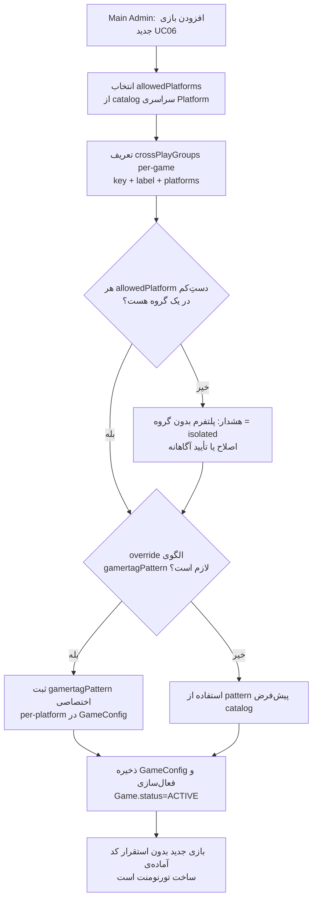
```mermaid
flowchart TD
    A[Main Admin: افزودن بازی جدید UC06] --> B[انتخاب allowedPlatforms<br/>از catalog سراسری Platform]
    B --> C[تعریف crossPlayGroups per-game<br/>key + label + platforms]
    C --> D{هر allowedPlatform دستِ‌کم<br/>در یک گروه هست؟}
    D -- خیر --> E[هشدار: پلتفرم بدون گروه = isolated<br/>اصلاح یا تأیید آگاهانه]
    D -- بله --> F{override الگوی<br/>gamertagPattern لازم است؟}
    E --> F
    F -- بله --> G[ثبت gamertagPattern اختصاصی<br/>per-platform در GameConfig]
    F -- خیر --> H[استفاده از pattern پیش‌فرض catalog]
    G --> I[ذخیره GameConfig و فعال‌سازی<br/>Game.status=ACTIVE]
    H --> I
    I --> J[بازی جدید بدون استقرار کد آماده‌ی<br/>ساخت تورنومنت است]
```

**قواعد اعتبارسنجی onboarding (Validation Rules) — جدول:**

| قاعده | شرط | اقدام در صورت نقض |
|---|---|---|
| زیرمجموعه بودن | `allowedPlatforms ⊆ catalog سراسری` | رد ذخیره |
| یکتایی `key` | `key` گروه‌ها در یک بازی تکراری نباشد | رد ذخیره |
| عضویت معتبر | هر `platforms[]` گروه ⊆ `allowedPlatforms` | رد ذخیره |
| پوشش | هر پلتفرمِ مجاز در ≥۱ گروه باشد (وگرنه isolated) | هشدار + نیاز به تأیید آگاهانه |
| الگوی هندل | `gamertagPattern` override یک regex معتبر باشد | رد ذخیره |

**معیار پذیرش onboarding:** یک بازی استاندارد باید **فقط با پر کردن این فرم config** و **بدون استقرار کد** فعال شود و بلافاصله بتوان روی آن تورنومنت ساخت.

---

### ۵. منطق تطبیق در ثبت‌نام و قرعه‌کشی (Seeding)

#### ۵.۱ نقطه‌ی اول کنترل — هنگام ثبت‌نام (`Registration`)

هنگام `UC20` کاربر `platform` و `handleSnapshot` اعلام می‌کند. سیستم دو بررسی انجام می‌دهد و طبق `RegistrationState` مدل پایه واکنش نشان می‌دهد:

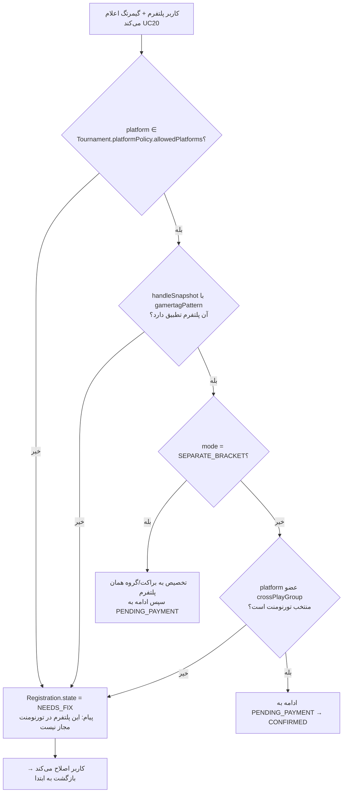
```mermaid
flowchart TD
    A[کاربر پلتفرم + گیمرتگ اعلام می‌کند UC20] --> B{platform ∈<br/>Tournament.platformPolicy.allowedPlatforms؟}
    B -- خیر --> X[Registration.state = NEEDS_FIX<br/>پیام: این پلتفرم در تورنومنت مجاز نیست]
    B -- بله --> C{handleSnapshot با gamertagPattern<br/>آن پلتفرم تطبیق دارد؟}
    C -- خیر --> X
    C -- بله --> D{mode = SEPARATE_BRACKET؟}
    D -- بله --> E[تخصیص به براکت/گروه همان پلتفرم<br/>سپس ادامه به PENDING_PAYMENT]
    D -- خیر --> F{platform عضو crossPlayGroup<br/>منتخب تورنومنت است؟}
    F -- خیر --> X
    F -- بله --> G[ادامه به PENDING_PAYMENT → CONFIRMED]
    X --> Y[کاربر اصلاح می‌کند → بازگشت به ابتدا]
```

> `NEEDS_FIX` دقیقاً همان حالت مدل پایه است؛ طبق ماشین `RegistrationState`، از `NEEDS_FIX` فقط با اصلاح کاربر به `PENDING_PAYMENT` بازمی‌گردد و **هرگز با گیمرتگ نامعتبر به `CONFIRMED` نمی‌رسد** (معیار پذیرش بخش ۳.۵ مدل پایه).

#### ۵.۲ نقطه‌ی دوم کنترل — هنگام seeding/قرعه‌کشی (`TournamentState.SEEDING`)

پیش از ساخت `Match`، موتور seeding برای هر جفت کاندید قاعده‌ی **Match Eligibility** مدل پایه (بخش ۳.۴) را اعمال می‌کند:

| شرط | `mode` | نتیجه‌ی seeding |
|---|---|---|
| پلتفرم A و B در یک `crossPlayGroup` مجاز | `SHARED_POOL` | ✅ `Match` ساخته می‌شود |
| پلتفرم A و B در گروه‌های متفاوت | `SHARED_POOL` | ❌ جفت رد؛ بازچینش تا جفت سازگار پیدا شود |
| — | `SEPARATE_BRACKET` | هر شرکت‌کننده فقط در براکت/گروه پلتفرم/گروه خودش seed می‌شود |
| یک طرف `BYE` | هر دو | ✅ بدون نیاز به تطبیق |

#### ۵.۳ نقطه‌ی سوم کنترل — هنگام Check-in (`Match.platformContext`)

طبق مدل پایه، `Match.platformContext` «پلتفرم هر طرف + cross-play group تأییدشده در check-in» را نگه می‌دارد. در پنجره‌ی `MatchState.CHECK_IN`:

| شرط | نتیجه |
|---|---|
| پلتفرم اعلام‌شده در check-in = پلتفرم `Registration` | ✅ ثبت در `platformContext`؛ ادامه به `READY` |
| پلتفرم check-in ≠ پلتفرم `Registration` (حالت لبه‌ی بریف) | ❌ check-in رد؛ ارجاع به داور؛ ماند در `CHECK_IN` تا اصلاح/رأی داور |
| پایان `graceMinutes` بدون check-in یک/دو طرف | `MatchState.NO_SHOW` (طبق ماشین Match مدل پایه) |

> این سه‌لایه (ثبت‌نام → seeding → check-in) تضمین می‌کند که **هیچ Matchِ بین دو پلتفرم ناسازگار** هرگز به `IN_PROGRESS` نرسد.

---

### ۶. مدیریت بازیکنان چندپلتفرمی (Multi-platform players)

طبق مدل پایه، `Participant.platformHandles` یک **نگاشت `PlatformCode → handle`** است و `Participant.primaryPlatform` پلتفرم انتخابی **برای آن تورنومنت** است. این دقیقاً برای بازیکنی که چند کنسول دارد طراحی شده.

| موقعیت | رفتار سیستم |
|---|---|
| کاربر چند هندل ثبت کرده (مثلاً هم `PS5` هم `PC`) | همه در `platformHandles` ذخیره‌اند؛ هر کدام جداگانه با `gamertagPattern` خودش اعتبارسنجی می‌شود. |
| ثبت‌نام در یک تورنومنت خاص | کاربر **یک** `primaryPlatform` انتخاب می‌کند؛ `Registration.platform` و `handleSnapshot` از همان گرفته و **قفل** می‌شود (snapshot). |
| پلتفرم منتخب با `platformPolicy` تورنومنت ناسازگار است | `Registration.state = NEEDS_FIX`؛ به کاربر پیشنهاد می‌شود پلتفرم سازگارِ دیگرش را انتخاب کند. |
| کاربر می‌خواهد وسط تورنومنت پلتفرم عوض کند | ممنوع پس از `CONFIRMED`؛ تغییر فقط با دخالت داور و ثبت `AuditLog` (یکپارچگی seeding/جفت‌سازی حفظ شود). |

**قاعده‌ی کلیدی:** snapshotـِ پلتفرم/هندل در لحظه‌ی ثبت‌نام، هر `Match` را قطعی می‌کند؛ بنابراین بازیکن چندپلتفرمی نمی‌تواند با تعویض پلتفرم پس از قرعه‌کشی، تطبیق را دور بزند.

---

### ۷. ماتریس سازگاری نمونه (Compatibility Matrix)

نمونه برای FC26 با دو گروه `cross-current-gen = {PC, PS5, XBOX_SERIES}` و `legacy-gen = {PS4, XBOX_ONE}`. علامت ✅ یعنی «در یک گروه مشترک‌اند و قابل‌جفت‌شدن»، ❌ یعنی ناسازگار.

| (A \ B) | PC | PS5 | XBOX_SERIES | PS4 | XBOX_ONE |
|---|---|---|---|---|---|
| **PC** | ✅ | ✅ | ✅ | ❌ | ❌ |
| **PS5** | ✅ | ✅ | ✅ | ❌ | ❌ |
| **XBOX_SERIES** | ✅ | ✅ | ✅ | ❌ | ❌ |
| **PS4** | ❌ | ❌ | ❌ | ✅ | ✅ |
| **XBOX_ONE** | ❌ | ❌ | ❌ | ✅ | ✅ |

نکته‌ی سناریوی بریف: خانه‌ی (`XBOX_SERIES`, `XBOX_ONE`) = ❌ — با اینکه هر دو `family=xbox`اند، چون در گروه‌های نسلی متفاوت‌اند با هم بازی **نمی‌کنند**.

---

### ۸. نمونه `GameConfig` — دو بازی

#### ۸.۱ FC26 (بازی 1v1، Scoreline، با cross-gen تفکیک‌شده)

```json
{
  "schemaVersion": 1,
  "allowedPlatforms": ["PC","PS5","PS4","XBOX_SERIES","XBOX_ONE"],
  "crossPlayGroups": [
    { "key": "cross-current-gen", "label": "نسل جدید + PC",
      "platforms": ["PC","PS5","XBOX_SERIES"] },
    { "key": "legacy-gen", "label": "نسل قبل",
      "platforms": ["PS4","XBOX_ONE"], "note": "با نسل جدید cross-play ندارد" }
  ],
  "allowedFormats": ["SINGLE_ELIM","DOUBLE_ELIM","GROUP_THEN_KNOCKOUT"],
  "defaultFormat": "SINGLE_ELIM",
  "teamModes": [{ "mode": "SOLO", "size": 1 }],
  "bestOfOptions": [1,3],
  "allowDraw": false,
  "resultSchema": { "kind": "SCORELINE" },
  "scoringStrategyKey": "WIN_DRAW_LOSS",
  "scoringParams": { "winPts": 3, "drawPts": 1, "lossPts": 0 },
  "tiebreakers": ["HEAD_TO_HEAD","GOAL_DIFF","GOALS_FOR"],
  "proofSchema": { "types": ["SCREENSHOT"], "required": true, "minCount": 1, "maxSizeMB": 10, "hashOnUpload": true },
  "resultPolicyDefaults": { "reportWindowMin": 30, "disputeWindowMin": 120, "requireProof": true, "autoConfirmOnMatch": true },
  "checkInDefaults": { "required": true, "windowMinutesBefore": 15, "graceMinutes": 10 },
  "rulesetText": "نتیجه‌ی پایان بازی را با اسکرین‌شات ثبت کنید..."
}
```

#### ۸.۲ یک بازی FFA / Battle Royale (مثلاً Warzone — چندنفره، رتبه‌محور)

این نمونه نشان می‌دهد همان مدل پایه چطور یک بازی **Free-For-All** را پوشش می‌دهد: نه دو طرف A/B، بلکه چند شرکت‌کننده در یک لابی که با **رتبه + کیل** امتیاز می‌گیرند. این جایی است که مرز config-driven مدل پایه فعال می‌شود: امتیازدهی با `scoringStrategyKey = "BR_PLACEMENT_KILLS"` (پلاگین موجود) انتخاب می‌شود و `resultSchema.kind = "PLACEMENT"`. cross-play کامل روشن است (همه‌ی پلتفرم‌ها در یک گروه)، و چون لابی‌محور است، `mode=SHARED_POOL` با یک گروهِ فراگیر منطقی است.

```json
{
  "schemaVersion": 1,
  "allowedPlatforms": ["PC","PS5","PS4","XBOX_SERIES","XBOX_ONE"],
  "crossPlayGroups": [
    { "key": "full-crossplay", "label": "کراس‌پلی کامل (همه‌ی پلتفرم‌ها)",
      "platforms": ["PC","PS5","PS4","XBOX_SERIES","XBOX_ONE"],
      "note": "بازی FFA لابی‌محور؛ همه در یک استخر." }
  ],
  "allowedFormats": ["SWISS","LADDER"],
  "defaultFormat": "SWISS",
  "teamModes": [{ "mode": "SOLO", "size": 1 }, { "mode": "TEAM", "size": 4 }],
  "bestOfOptions": [1],
  "allowDraw": false,
  "resultSchema": { "kind": "PLACEMENT" },
  "scoringStrategyKey": "BR_PLACEMENT_KILLS",
  "scoringParams": { "killPts": 1, "place1": 15, "place2": 12, "place3": 10, "place4to10": 5 },
  "tiebreakers": ["GOAL_DIFF"],
  "proofSchema": { "types": ["SCREENSHOT","CLIP"], "required": true, "minCount": 1, "maxSizeMB": 50, "hashOnUpload": true },
  "resultPolicyDefaults": { "reportWindowMin": 45, "disputeWindowMin": 180, "requireProof": true, "autoConfirmOnMatch": false },
  "checkInDefaults": { "required": true, "windowMinutesBefore": 20, "graceMinutes": 10 },
  "rulesetText": "اسکرین‌شات صفحه‌ی پایان مسابقه (placement + kills) را آپلود کنید..."
}
```

> **یادداشت سازگاری با مدل پایه:** هر دو config فقط از فیلدهای رسمی `GameConfig` استفاده می‌کنند. تفاوت دو بازی صرفاً در **داده** است (پلتفرم‌ها، گروه‌بندی cross-play، format، `resultSchema.kind`، `scoringStrategyKey`). در FFA چون `autoConfirmOnMatch=false` است، نتیجه پس از گزارش مستقیماً به `UNDER_REVIEW` (داوری انسانی، طبق ماشین `MatchState`) می‌رود — هماهنگ با اصل «Human-in-the-loop» مدل پایه. اگر بازی FFA الگوریتم رتبه‌بندی **واقعاً جدیدی** بخواهد، طبق مرز config-driven مدل پایه یک `ScoringStrategyKey` تازه به‌صورت پلاگین افزوده و فقط با کلید از config انتخاب می‌شود؛ این تنها نقطه‌ی نیازمند توسعه است.

---

### ۹. حالات لبه و معیار پذیرش (Platform/Cross-Play)

| حالت لبه | رفتار صحیح | معیار پذیرش |
|---|---|---|
| گیمرتگ با `gamertagPattern` نمی‌خواند | `Registration.state = NEEDS_FIX` | ثبت‌نام با هندل نامعتبر هرگز به `CONFIRMED` نمی‌رسد. |
| پلتفرم اعلام‌شده خارج از `allowedPlatforms` تورنومنت | رد ثبت‌نام (`NEEDS_FIX`) با پیام شفاف | کاربر نمی‌تواند با پلتفرم غیرمجاز نهایی شود. |
| پلتفرم‌های ناسازگار در `SHARED_POOL` | seeding آن جفت را رد و بازچینش می‌کند | هیچ `Match` بین دو گروه متفاوت ساخته نمی‌شود. |
| `XBOX_ONE` در برابر `XBOX_SERIES` | طبق ماتریس ❌ | این دو هرگز در یک Match قرار نمی‌گیرند مگر در یک گروه باشند. |
| عدم‌تطابق پلتفرم در check-in | check-in رد؛ ارجاع به داور؛ ماند در `MatchState.CHECK_IN` | بازی با پلتفرمِ غیرِ ثبت‌نام شروع نمی‌شود. |
| بازیکن چندپلتفرمی پس از `CONFIRMED` پلتفرم عوض می‌کند | ممنوع؛ فقط با داور + `AuditLog` | snapshot پلتفرم پس از تأیید تغییرناپذیر است. |
| پلتفرم مجاز ولی در هیچ `crossPlayGroup` نیست | هشدار onboarding؛ آن پلتفرم isolated می‌شود | پلتفرم isolated فقط با خودش جفت می‌شود، نه خطای خاموش. |
| تغییر `crossPlayGroups` در بازی پس از شروع تورنومنت‌های فعال | config نسخه‌بندی‌شده (`schemaVersion`)؛ تورنومنت‌های در حال اجرا با snapshot قبلی ادامه می‌یابند | تغییر config، تورنومنت در حال اجرا را نمی‌شکند. |

---

**خلاصه‌ی قرارداد ارجاع این بخش:** تمام منطق پلتفرم و cross-play صرفاً بر پایه‌ی `Platform`/`PlatformCode` (catalog سراسری)، `GameConfig.crossPlayGroups` (per-game)، `Tournament.platformPolicy` با `PlatformMode` (`SHARED_POOL | SEPARATE_BRACKET`)، `Registration` با حالت `NEEDS_FIX/CONFIRMED` و `Match.platformContext` با ماشین `MatchState` ساخته شده است — همگی موجودیت‌ها و حالت‌های **رسمی مدل پایه**، بدون هیچ نام یا فیلد تازه.

---

فایل‌های مرجع خوانده‌شده (مسیرهای مطلق):
- `C:\Users\norou\Downloads\Telegram Desktop\_design_brief.md`
- `C:\Users\norou\Downloads\Telegram Desktop\Tournament-Proposal-v2.md`
- `C:\Users\norou\Downloads\Telegram Desktop\Tournament-Model.json`

---

## ثبت‌نام و اعتبارسنجی

> **جایگاه این بخش:** این بخش زیرمجموعه‌ی **UC20 «ثبت‌نام در مسابقه»** (و رابطه‌ی include آن به **UC21 «پرداخت هزینه‌ی ثبت‌نام»**) است و **فقط** از موجودیت‌ها، فیلدها و نام‌حالت‌های «مدل پایه‌ی عمومی» استفاده می‌کند: موجودیت‌های `Registration`, `Participant (PLAYER|TEAM)`, `Platform`, `CrossPlayGroup`, `GameConfig`, `Tournament`؛ و Enumهای `RegistrationState`, `PlatformCode`, `ParticipantKind`, `TournamentState`. هیچ نام‌حالت یا فیلد جدیدی خارج از مدل پایه اختراع نشده است. هرجا به فیلدی نیاز بود که در مدل پایه نباشد، صریحاً به‌عنوان «پیشنهاد افزودن به مدل پایه» علامت خورده تا اول آنجا اضافه شود.
>
> **اصل حاکم:** کل رفتار اعتبارسنجی **config-driven** است؛ یعنی الگوهای گیمرتگ، پلتفرم‌های مجاز، گروه‌های cross-play، اندازه‌ی تیم و فیلدهای سفارشی همگی از `Tournament.platformPolicy`، `GameConfig.allowedPlatforms`، `GameConfig.crossPlayGroups`، `GameConfig.teamModes` و `GameConfig.customFields` خوانده می‌شوند. هیچ شرط `if (game === 'FC26')` در کد نیست.

---

### ۱. اهداف و معیار پذیرش کلانِ بخش

| هدف (از بریف) | تضمین در این بخش |
|---|---|
| ثبت‌نام **بدون خطا** (سناریوی ۲ بریف) | گیمرتگ نامعتبر هرگز به `RegistrationState.CONFIRMED` نمی‌رسد. |
| سازگاری پلتفرم per-game (سناریوی ۱۳) | پلتفرم خارج از `GameConfig.allowedPlatforms` یا ناسازگار با `platformPolicy` پذیرفته نمی‌شود. |
| پوشش حالات لبه (سناریوی ۱۴) | بسته‌شدن ثبت‌نام، پر شدن ظرفیت، تکراری، تکمیل‌نشدن، تیم ناقص، همگی حالت رسمی و گذار مشخص دارند. |
| یکپارچگی مالی | ورود به فهرست شرکت‌کنندگان فقط پس از `paymentTxnId` در حالت `SETTLED` یا `entryFee=0`. |

**معیار پذیرش سراسری (Definition of Done این بخش):**
1. **AC-REG-01:** هیچ `Registration` با `handleSnapshot` نامنطبق با الگوی پلتفرم به `CONFIRMED` نمی‌رسد (می‌ماند در `NEEDS_FIX`).
2. **AC-REG-02:** هیچ `Registration` با `platform ∉ Tournament.platformPolicy.allowedPlatforms` ساخته نمی‌شود.
3. **AC-REG-03:** برای تیم، تا وقتی `roster.length < teamMode.size`، Registration به `CONFIRMED` نمی‌رسد.
4. **AC-REG-04:** ثبت‌نام دوم همان `Participant` (یا همان `userId` در ترکیب roster) در یک `Tournament` رد می‌شود (یکتایی).
5. **AC-REG-05:** پس از `TournamentState ∈ {REGISTRATION_CLOSED, CHECK_IN, SEEDING, RUNNING, COMPLETED, CANCELLED}` هیچ ثبت‌نام جدیدی پذیرفته نمی‌شود (مگر مسیر waitlist→confirmed در صورت آزاد شدن ظرفیت پیش از بسته‌شدن).
6. **AC-REG-06:** هر گذار حساس ثبت‌نام (`CONFIRMED`, `REFUNDED`, `DISQUALIFIED`) یک `AuditLog` تولید می‌کند.

---

### ۲. پیش‌شرط‌ها و دروازه‌های ورود (Preconditions / Gates)

پیش از آغاز هر فلوی ثبت‌نام، این دروازه‌ها به‌ترتیب بررسی می‌شوند. شکست هر دروازه = توقف با خطای مشخص (بخش ۹).

| # | دروازه | منبع داده | شکست → |
|---|---|---|---|
| G1 | کاربر احراز هویت‌شده (UC01) و در صورت لزوم 2FA (UC03) | session/JWT | هدایت به ورود |
| G2 | `Tournament.state == REGISTRATION_OPEN` | `Tournament.state` | خطای `REG_CLOSED` |
| G3 | اکنون بین `schedule.registrationOpensAt` و `registrationClosesAt` | `Tournament.schedule` | خطای `REG_WINDOW` |
| G4 | ظرفیت آزاد: `confirmedCount < capacity.maxParticipants` | شمارش `Registration` فعال | مسیر `WAITLISTED` |
| G5 | واجد شرایط بودن (eligibility): سن، منطقه، سطح، عدم محرومیت | بخش ۷ | خطای `NOT_ELIGIBLE` |
| G6 | عدم ثبت‌نام قبلی همین Participant/User در همین Tournament | یکتایی (بخش ۶) | خطای `DUPLICATE` |

> **نکته‌ی هم‌زمانی (concurrency):** بررسی G4 باید **اتمیک** باشد. شمارش ظرفیت و ساخت Registration در یک تراکنش با قفل ردیفی (`SELECT ... FOR UPDATE` روی شمارنده‌ی ظرفیت تورنومنت) انجام می‌شود تا «دو نفر هم‌زمان آخرین جای خالی را نگیرند» (race condition). اگر ظرفیت در لحظه‌ی commit پر شده باشد، Registration به‌جای `CONFIRMED` به `WAITLISTED` می‌رود.

---

### ۳. فلوی کامل ثبت‌نام تکی (Solo / 1v1)

این فلو وقتی فعال است که `GameConfig.teamModes` شامل `{ mode: 'SOLO', size: 1 }` و تورنومنت با همان teamMode ساخته شده باشد. در این حالت `Participant.kind = PLAYER` و `Participant.userId` برابر کاربر جاری است.

```mermaid
flowchart TD
    Start([کاربر روی «ثبت‌نام» می‌زند]) --> G1{G1: احراز هویت‌شده؟}
    G1 -- خیر --> Login[هدایت به UC01/UC03]
    G1 -- بله --> G2{G2-G3: ثبت‌نام باز و در پنجره؟}
    G2 -- خیر --> ErrClosed[❌ REG_CLOSED / REG_WINDOW]
    G2 -- بله --> G5{G5: eligibility<br/>سن/منطقه/محرومیت؟}
    G5 -- خیر --> ErrElig[❌ NOT_ELIGIBLE]
    G5 -- بله --> G6{G6: ثبت‌نام تکراری؟}
    G6 -- بله --> ErrDup[❌ DUPLICATE]
    G6 -- خیر --> Form[نمایش فرم ثبت‌نام:<br/>انتخاب platform + گیمرتگ + customFields]

    Form --> SelPlat{پلتفرم انتخابی ∈<br/>platformPolicy.allowedPlatforms؟}
    SelPlat -- خیر --> ErrPlat[❌ PLATFORM_NOT_ALLOWED]
    SelPlat -- بله --> ValHandle{گیمرتگ با<br/>gamertagPattern آن پلتفرم منطبق؟}
    ValHandle -- خیر --> NeedFix[state = NEEDS_FIX<br/>پیام اصلاح گیمرتگ]
    NeedFix --> Form
    ValHandle -- بله --> ValCustom{customFields اجباری<br/>کامل و معتبر؟}
    ValCustom -- خیر --> NeedFix2[state = NEEDS_FIX<br/>فیلد ناقص]
    NeedFix2 --> Form

    ValCustom -- بله --> CreateReg[ساخت Registration<br/>handleSnapshot ثبت می‌شود]
    CreateReg --> G4{G4: ظرفیت آزاد؟<br/>(اتمیک)}
    G4 -- خیر --> Wait[state = WAITLISTED]
    G4 -- بله --> Fee{entryFee > 0؟}

    Fee -- خیر --> Confirm[state = CONFIRMED<br/>AuditLog]
    Fee -- بله --> Pay[state = PENDING_PAYMENT<br/>→ UC21 پرداخت]
    Pay --> PayOk{پرداخت SETTLED؟<br/>(idempotencyKey)}
    PayOk -- بله --> Confirm
    PayOk -- خیر/تایم‌اوت --> PayFail[بازگشت به PENDING_PAYMENT<br/>یا انقضا → آزادسازی hold ظرفیت]

    Confirm --> Done([در فهرست شرکت‌کنندگان])
    Wait --> Done2([در فهرست انتظار])
```

**نکات کلیدی فلوی تکی:**
- `handleSnapshot` در لحظه‌ی ساخت Registration از `Participant.platformHandles[primaryPlatform]` **عکس‌برداری (snapshot)** می‌شود تا تغییر بعدی گیمرتگ پروفایل، نتیجه‌ی تورنومنت را دستکاری نکند.
- اگر `entryFee > 0`، رزرو ظرفیت (G4) به‌صورت **hold موقت** (مثلاً ۱۰ دقیقه، قابل پیکربندی) انجام می‌شود تا حین پرداخت، جای کاربر نگه داشته شود؛ با انقضای hold بدون `SETTLED`، ظرفیت آزاد و Registration در `PENDING_PAYMENT` منقضی‌شده علامت می‌خورد.

---

### ۴. فلوی کامل ثبت‌نام تیمی (Team)

فعال وقتی teamMode انتخابیِ تورنومنت `{ mode: 'TEAM', size: N }` با `N > 1` باشد. در این حالت `Participant.kind = TEAM`، با `captainUserId` و `roster[]`. **کاپیتان** آغازگر ثبت‌نام و مسئول مالی است.

دو الگوی دعوت پشتیبانی می‌شود (انتخاب per-tournament از طریق customFields/policy):
- **الگوی A — کاپیتان همه را وارد می‌کند:** کاپیتان گیمرتگ تک‌تک اعضا را وارد و خودش تأیید می‌کند.
- **الگوی B — دعوت‌نامه (invite):** کاپیتان لینک/کد دعوت می‌فرستد؛ هر عضو خودش وارد و گیمرتگ خود را تأیید می‌کند (اعتبارسنجی مالکیت قوی‌تر — بخش ۵.۳).

```mermaid
flowchart TD
    S([کاپیتان «ساخت تیم و ثبت‌نام»]) --> Gate{G1-G3-G5-G6<br/>دروازه‌های کاپیتان}
    Gate -- شکست --> Err1[❌ خطای دروازه مربوطه]
    Gate -- بله --> Create[ساخت Participant kind=TEAM<br/>state Registration = NEEDS_FIX تا تکمیل]

    Create --> Mode{الگوی عضوگیری؟}
    Mode -- A: ورود توسط کاپیتان --> AddAll[کاپیتان گیمرتگ هر عضو<br/>+ platform هر عضو را وارد می‌کند]
    Mode -- B: دعوت‌نامه --> Invite[ارسال invite به اعضا<br/>هر عضو خود می‌پیوندد و گیمرتگ تأیید می‌کند]

    AddAll --> Roster[به‌روزرسانی roster]
    Invite --> Roster

    Roster --> ChkSize{roster.length == teamMode.size؟}
    ChkSize -- خیر --> Incomplete[state = NEEDS_FIX<br/>«تیم ناقص: x از N»]
    Incomplete --> Roster
    ChkSize -- بله --> ChkHandles{همه‌ی گیمرتگ‌های اعضا<br/>با pattern پلتفرم خود منطبق؟}
    ChkHandles -- خیر --> FixMember[state = NEEDS_FIX<br/>عضو نامعتبر علامت می‌خورد]
    FixMember --> Roster
    ChkHandles -- بله --> ChkCross{سازگاری cross-play تیم<br/>طبق platformPolicy؟ (بخش ۴.۱)}
    ChkCross -- خیر --> CrossErr[❌ PLATFORM_INCOMPATIBLE<br/>تیم/اعضا اصلاح شوند]
    CrossErr --> Roster
    ChkCross -- بله --> ChkDupMember{هیچ عضوی هم‌زمان<br/>در تیم/ثبت‌نام دیگرِ همین تورنومنت نیست؟}
    ChkDupMember -- خیر --> DupMember[❌ MEMBER_DUPLICATE]
    ChkDupMember -- بله --> TeamCustom{customFields سطح تیم<br/>و سطح هر بازیکن کامل؟}
    TeamCustom -- خیر --> CustErr[state = NEEDS_FIX]
    CustErr --> Roster

    TeamCustom -- بله --> Cap{G4: ظرفیت آزاد؟ (اتمیک)}
    Cap -- خیر --> WL[state = WAITLISTED]
    Cap -- بله --> Fee{entryFee > 0؟}
    Fee -- خیر --> Conf[state = CONFIRMED + AuditLog]
    Fee -- بله --> Payy[state = PENDING_PAYMENT → UC21<br/>کاپیتان پرداخت می‌کند]
    Payy --> POk{SETTLED؟}
    POk -- بله --> Conf
    POk -- خیر --> Pexp[انقضا → آزادسازی ظرفیت]

    Conf --> Fin([تیم در فهرست شرکت‌کنندگان])
    WL --> Fin2([تیم در فهرست انتظار])
```

#### ۴.۱ قاعده‌ی سازگاری cross-play در سطح تیم

طبق `Tournament.platformPolicy.mode` (مدل پایه، بخش ۳.۳):

| `mode` | قاعده‌ی روی roster تیم | نتیجه |
|---|---|---|
| `SHARED_POOL` | همه‌ی پلتفرم‌های اعضای تیم باید در **یک** `crossPlayGroup` مشترک با `crossPlayGroupKey` تورنومنت باشند | اعضای ناسازگار → `PLATFORM_INCOMPATIBLE` |
| `SEPARATE_BRACKET` | کل تیم در براکت **یک** پلتفرم/گروه seed می‌شود؛ ترکیب پلتفرم بین گروه‌ها مجاز نیست | تیم باید یک گروه پلتفرمی یکدست اعلام کند |

> این دقیقاً همان سناریوی بریف است: اگر بازیکنی روی `XBOX_ONE` و دیگری روی `XBOX_SERIES` در گروه‌های `legacy-gen` و `cross-current-gen` جدا باشند، تیم در حالت `SHARED_POOL` رد می‌شود.

#### ۴.۲ نقش کاپیتان و مسئولیت‌ها

| مسئولیت | توضیح |
|---|---|
| پرداخت `entryFee` | کاپیتان آغازگر UC21 است؛ `Registration.paymentTxnId` به کیف پول کاپیتان گره می‌خورد. |
| تکمیل roster | تا `roster.length == teamMode.size` تیم در `NEEDS_FIX` می‌ماند. |
| اصلاح اعضای نامعتبر | کاپیتان (یا خود عضو در الگوی B) گیمرتگ نامعتبر را تصحیح می‌کند. |
| انصراف تیم | کاپیتان می‌تواند پیش از `CHECK_IN` تیم را به `WITHDRAWN` ببرد (شرایط استرداد، بخش مالی). |

---

### ۵. قوانین اعتبارسنجی (Validation Rules)

#### ۵.۱ اعتبارسنجی گیمرتگ/یوزرنیم per-platform

هر `PlatformCode` یک `gamertagPattern` (regex) پیش‌فرض در کاتالوگ `Platform` دارد و `GameConfig` می‌تواند per-game آن را **override** کند (مدل پایه، بخش ۲.۲ و ۳.۵). جدول الگوهای پیشنهادی پیش‌فرض:

| `PlatformCode` | هویت موردنیاز | الگوی پیشنهادی (regex) | قواعد و یادداشت |
|---|---|---|---|
| `PSN` → `PS5`/`PS4` | **PSN Online ID** | `^[A-Za-z][A-Za-z0-9_-]{2,15}$` | ۳ تا ۱۶ کاراکتر؛ شروع با حرف؛ فقط حروف/عدد/`-`/`_`. |
| `XBOX_SERIES`/`XBOX_ONE` | **Xbox Gamertag** | `^[A-Za-z](?:[A-Za-z0-9 ]{0,11}[A-Za-z0-9])?$` | تا ۱۲ کاراکتر نمایشی؛ فاصله مجاز ولی نه ابتدا/انتها/متوالی. |
| `PC` (Activision/Call of Duty) | **Activision ID** | `^[A-Za-z0-9]{3,32}#\d{4,7}$` | شامل `#` و discriminator عددی. |
| `PC` (Steam) | **Steam profile/SteamID64 یا vanity** | `^(\d{17}|[A-Za-z0-9_-]{2,32})$` | SteamID64 ۱۷رقمی یا vanity URL. |
| `PC` (Epic) | **Epic Display Name** | `^[A-Za-z0-9 ._-]{3,16}$` | — |
| `PC` (EA / FC26) | **EA ID** | `^[A-Za-z0-9_]{4,16}$` | برای FC26 روی PC. |
| `SWITCH` | **Nintendo friend/handle** | `^[\x21-\x7E]{1,10}$` | نهایتاً ۱۰ کاراکتر نمایشی. |
| `IOS`/`ANDROID` | **Game-specific ID** | از `GameConfig` (مثلاً `^[0-9]{6,12}$`) | کاملاً per-game. |

**قواعد اعتبارسنجی:**
- **R-HANDLE-1:** الگوی مؤثر = `GameConfig.gamertagPattern[platform]` در صورت وجود، وگرنه `Platform.gamertagPattern` پیش‌فرض. (همیشه config مقدم است.)
- **R-HANDLE-2:** اعتبارسنجی هم در **سمت کلاینت** (تجربه‌ی بهتر، بازخورد آنی) و هم در **سمت سرور** (منبع حقیقت، ضدِ دور زدن) انجام می‌شود. تصمیم نهایی فقط سمت سرور.
- **R-HANDLE-3:** عدم تطابق → `RegistrationState.NEEDS_FIX` با پیام دقیقِ «چه چیزی غلط است» (نه پیام عمومی). هرگز مستقیماً به `CONFIRMED` نمی‌رود (AC-REG-01).
- **R-HANDLE-4:** نرمال‌سازی پیش از مقایسه (trim، حذف فاصله‌های متوالی، حفظ حساسیت به حروف بزرگ/کوچک طبق پلتفرم) برای جلوگیری از خطای کاذب.
- **R-HANDLE-5 (یکتایی گیمرتگ):** یک `handleSnapshot` یکسان روی یک پلتفرم نباید در یک تورنومنت دو بار ظاهر شود (ضدِ دو شرکت‌کننده با یک اکانت — بخش ۶).

#### ۵.۲ اعتبارسنجی انتخاب پلتفرم

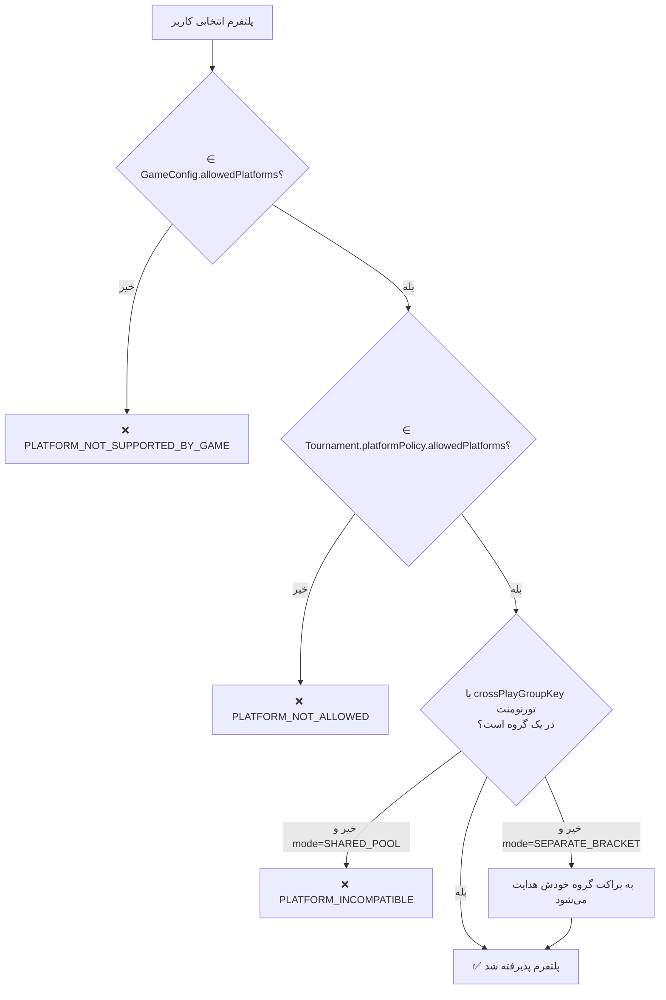
```mermaid
flowchart TD
    P[پلتفرم انتخابی کاربر] --> A{∈ GameConfig.allowedPlatforms؟}
    A -- خیر --> E1[❌ PLATFORM_NOT_SUPPORTED_BY_GAME]
    A -- بله --> B{∈ Tournament.platformPolicy.allowedPlatforms؟}
    B -- خیر --> E2[❌ PLATFORM_NOT_ALLOWED]
    B -- بله --> C{با crossPlayGroupKey تورنومنت<br/>در یک گروه است؟}
    C -- خیر و mode=SHARED_POOL --> E3[❌ PLATFORM_INCOMPATIBLE]
    C -- خیر و mode=SEPARATE_BRACKET --> D[به براکت گروه خودش هدایت می‌شود]
    C -- بله --> OK[✅ پلتفرم پذیرفته شد]
    D --> OK
```

#### ۵.۳ تأیید مالکیت اکانت (Account Ownership) — «در حد ممکن»

چون API بازی‌ها در دسترس نیست (محدودیت بریف/پروپوزال بخش ۵)، مالکیت گیمرتگ را نمی‌توان قطعی اثبات کرد. راهکار **لایه‌ای و تطبیقی (best-effort)**:

| لایه | روش | قدرت اطمینان | کِی اعمال شود |
|---|---|---|---|
| L1 — فرمت | تطابق regex (بخش ۵.۱) | پایه (ضدِ تایپوی آشکار) | همیشه |
| L2 — پیوند OAuth | اگر کاربر با **Steam/Discord** (UC02) وارد شده، گیمرتگ مرتبط از provider خوانده و **pre-fill/قفل** می‌شود | بالا (برای پلتفرم‌های دارای OAuth) | وقتی provider در دسترس است |
| L3 — چالش اثبات سبک | درخواست اسکرین‌شات پروفایل/کارت بازیکن با کد یک‌بارمصرف نمایش‌داده‌شده (مثلاً کاربر کد را در bio موقت بگذارد) | متوسط | تورنومنت‌های جایزه‌دار بالا |
| L4 — تأیید در Check-in | تطبیق گیمرتگ اعلام‌شده با گیمرتگ واقعی در اسکرین‌شات مسابقه؛ مغایرت → داور | عملیاتی (دیرهنگام ولی مؤثر) | پیش از/حین مسابقه |

> **قاعده:** سطح اجباری L1 همیشه؛ سطوح L2–L4 از `GameConfig`/`Tournament.policy` فعال می‌شوند. هیچ ادعای «اثبات قطعی مالکیت» داده نمی‌شود — هم‌راستا با واقع‌گرایی پروپوزال.
>
> **پیشنهاد افزودن به مدل پایه:** فیلد `Registration.ownershipProofLevel ∈ {L1,L2,L3,L4}` و `ownershipVerifiedAt`. چون در مدل پایه نیست، پیش از مصرف باید آنجا اضافه شود.

#### ۵.۴ جلوگیری از ثبت اشتباه (Anti-typo / Confirmation)

- **پیش‌نمایش تأیید نهایی:** پیش از قطعی‌شدن، خلاصه‌ای از «پلتفرم + گیمرتگ + هزینه» نمایش و کاربر **صریحاً تأیید** می‌کند («آیا `iceberg_rig` روی PS5 درست است؟»).
- **echo/تکرار حساس:** برای فیلدهای حیاتی (مثل Activision ID با discriminator)، ورود دوباره برای جلوگیری از اشتباه تایپی.
- **قفل پس از تأیید:** پس از `CONFIRMED`، تغییر گیمرتگ فقط با درخواست به Support/داور و ثبت `AuditLog` ممکن است (نه خودسرانه) تا از سوءاستفاده‌ی «عوض‌کردن اکانت بعد از قرعه‌کشی» جلوگیری شود.

---

### ۶. ضدسوءاستفاده، حساب تکراری و مولتی‌اکانت

#### ۶.۱ قواعد یکتایی (Uniqueness)

| قاعده | محدوده | پیاده‌سازی |
|---|---|---|
| U1 — یک Participant در هر Tournament یک‌بار | `(tournamentId, participantId)` | unique constraint |
| U2 — یک User در هر Tournament یک‌بار (solo) | `(tournamentId, participant.userId)` | unique partial index برای `kind=PLAYER` |
| U3 — یک User تنها در یک تیمِ فعالِ یک Tournament | عضویت در `roster` بین تیم‌های همان تورنومنت | بررسی برنامه‌ای + index |
| U4 — یک `handleSnapshot` در هر پلتفرم در هر Tournament یک‌بار | `(tournamentId, platform, handleSnapshot)` | unique constraint (R-HANDLE-5) |

#### ۶.۲ تشخیص مولتی‌اکانت (طبق پروپوزال بخش ۵ «ضدتقلب»)

سیگنال‌ها (هیچ‌کدام به‌تنهایی قطعی نیست؛ امتیازدهی ریسک):

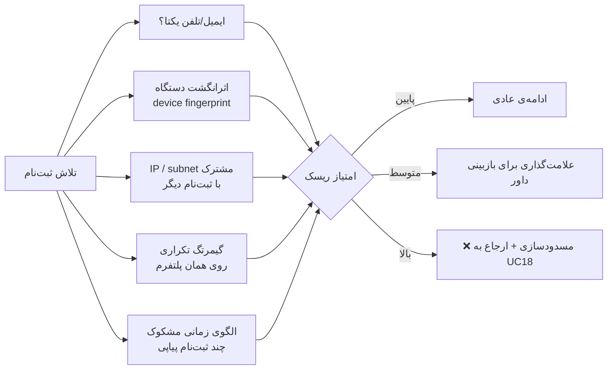
```mermaid
flowchart LR
    A[تلاش ثبت‌نام] --> S1[ایمیل/تلفن یکتا؟]
    A --> S2[اثرانگشت دستگاه<br/>device fingerprint]
    A --> S3[IP / subnet مشترک<br/>با ثبت‌نام دیگر]
    A --> S4[گیمرتگ تکراری<br/>روی همان پلتفرم]
    A --> S5[الگوی زمانی مشکوک<br/>چند ثبت‌نام پیاپی]
    S1 & S2 & S3 & S4 & S5 --> R{امتیاز ریسک}
    R -- پایین --> OK[ادامه‌ی عادی]
    R -- متوسط --> Flag[علامت‌گذاری برای بازبینی داور]
    R -- بالا --> Block[❌ مسدودسازی + ارجاع به UC18]
```

| سیگنال | منبع | اقدام در ریسک بالا |
|---|---|---|
| ایمیل/تلفن غیریکتا | یکتایی حساب در UC01 | رد ثبت حساب |
| device fingerprint مشترک | کلاینت | علامت‌گذاری |
| IP/subnet مشترک | سرور | علامت‌گذاری (نه مسدودسازی صرف — کافه‌نت/NAT) |
| گیمرتگ تکراری | U4 | رد (`DUPLICATE`) |
| نرخ ثبت‌نام غیرعادی | rate-limit | throttle + بازبینی |

> اقدام نهاییِ مسدودسازی همیشه با ثبت `AuditLog` و امکان ارجاع به **UC18 «بررسی گزارش تخلف»** است؛ تصمیم سخت با داور/ادمین، نه صرفاً خودکار (انسان‌در‌حلقه).

#### ۶.۳ احراز سن (Age Verification)

مطابق پروپوزال بخش ۷ (حقوقی/قمار):
- **A1:** اگر `entryFee > 0` یا `prizePool` نقدی دارد، حداقل سن (پیش‌فرض ۱۸، قابل پیکربندی per-tournament/منطقه) **اجباری** است.
- **A2:** سن خوداظهاری در ثبت‌نام کافیِ ورود است، ولی **برداشت جایزه** نیازمند تأیید قطعی در **KYC (UC30)** است؛ مغایرت سن اعلامی با KYC → محرومیت و عدم پرداخت.
- **A3:** برای تورنومنت بدون جایزه‌ی نقدی، حالت «بدون احراز سن سخت» قابل فعال‌سازی است (مناطق کم‌ریسک).

#### ۶.۴ شرایط واجد بودن (Eligibility) — جدول قوانین (G5)

| شرط | منبع پیکربندی | شکست → |
|---|---|---|
| سن کافی | policy تورنومنت | `NOT_ELIGIBLE_AGE` |
| منطقه/کشور مجاز | policy تورنومنت (تحریم/حقوقی) | `NOT_ELIGIBLE_REGION` |
| عدم محرومیت فعال (`DISQUALIFIED`/ban) | سابقه‌ی کاربر | `NOT_ELIGIBLE_BANNED` |
| سطح/رتبه‌ی موردنیاز (در صورت تعریف) | `customFields` / policy | `NOT_ELIGIBLE_RANK` |
| KYC قبلی (در تورنومنت‌های های‌استیک) | وضعیت KYC کاربر | `NOT_ELIGIBLE_KYC` |

---

### ۷. Custom Fields (سطح تیم و سطح بازیکن)

از `GameConfig.customFields[]` (مدل پایه، بخش ۴.۱) خوانده می‌شوند و در دو سطح اعمال می‌گردند:

| ویژگی فیلد | توضیح |
|---|---|
| `key` | شناسه‌ی یکتا (مثلاً `discord_tag`, `team_logo`, `preferred_server`) |
| `scope` | `TEAM` یا `PLAYER` — تعیین می‌کند فیلد در سطح تیم یا تک‌تک اعضا پر شود |
| `type` | `text \| number \| select \| handle \| url \| image \| boolean` |
| `required` | اجباری بودن (مانع `CONFIRMED` در صورت خالی بودن) |
| `validationRegex` | اعتبارسنجی اختصاصی |
| `options[]` | برای `select` |

**قواعد:**
- **CF-1:** فیلد `required && scope=PLAYER` باید برای **هر** عضو roster پر شود؛ یک عضو ناقص = کل تیم در `NEEDS_FIX`.
- **CF-2:** فیلد `type=handle` همان قواعد بخش ۵.۱ را وراثت می‌برد (الگوی پلتفرم).
- **CF-3:** فیلدهای سفارشی نیز در `handleSnapshot`/snapshot ثبت‌نام **منجمد** می‌شوند تا بعداً تغییرناپذیر بمانند.

> **پیشنهاد افزودن به مدل پایه:** `CustomField.scope ∈ {TEAM, PLAYER}` و `Registration.customFieldValues` (نگاشت `key → value`). مدل پایه `customFields[]` را در GameConfig دارد ولی scope و محل ذخیره‌ی مقدارها صریح نیست؛ پیش از مصرف آنجا تثبیت شود.

---

### ۸. Seeding (چینش اولیه‌ی شرکت‌کنندگان)

Seeding پس از بسته‌شدن ثبت‌نام و در `TournamentState.SEEDING` انجام می‌شود و فیلد `Registration.seed` (مدل پایه) را مقداردهی می‌کند. این بخش فقط **داده‌ی ورودی seeding** را از ثبت‌نام تأمین می‌کند؛ ساخت براکت در بخش جداگانه است.

| روش seeding | منبع | کاربرد |
|---|---|---|
| `RANDOM` | قرعه‌کشی تصادفی (با seed قابل‌بازتولید برای شفافیت) | پیش‌فرض، عادلانه |
| `RATING_BASED` | رتبه/امتیاز قبلی کاربر (در صورت وجود) | تورنومنت‌های رقابتی |
| `REGISTRATION_ORDER` | ترتیب زمانی `CONFIRMED` | first-come |
| `MANUAL` | چینش دستی Game Admin | رویدادهای ویژه |

**قواعد seeding مرتبط با ثبت‌نام:**
- **SEED-1:** فقط Registrationهای `CONFIRMED`/`CHECKED_IN` وارد seeding می‌شوند؛ `WAITLISTED`/`PENDING_PAYMENT`/`NEEDS_FIX` خارج‌اند.
- **SEED-2:** در `mode=SEPARATE_BRACKET`، seeding **per cross-play group** انجام می‌شود (هر گروه براکت مستقل).
- **SEED-3:** اگر تعداد شرکت‌کننده توان ۲ نباشد (برای SINGLE_ELIM)، **BYE** به seedهای بالا تخصیص می‌یابد (`Match.sideB = null`).
- **SEED-4:** قرعه‌کشی باید **قابل بازبینی/تکرارپذیر** باشد (ثبت seed تصادفی در `AuditLog`) تا اعتراض «قرعه‌ی ناعادلانه» قابل بررسی باشد.

> **پیشنهاد افزودن به مدل پایه:** Enum `SeedingMethod ∈ {RANDOM, RATING_BASED, REGISTRATION_ORDER, MANUAL}` در `Tournament` یا `Stage`. در مدل پایه فیلد `Registration.seed` هست ولی روش انتخاب seed صریح نیست.

---

### ۹. کاتالوگ حالات خطا و حالات لبه (Error & Edge Cases)

#### ۹.۱ جدول رسمی خطاها

| کد خطا | شرح | حالت نتیجه‌ی Registration | پیام کاربر (نمونه) | بازیابی |
|---|---|---|---|---|
| `INVALID_HANDLE` | گیمرتگ نامنطبق با pattern | `NEEDS_FIX` | «گیمرتگ PSN باید ۳ تا ۱۶ کاراکتر و شروع با حرف باشد.» | اصلاح و ارسال مجدد |
| `PLATFORM_NOT_SUPPORTED_BY_GAME` | پلتفرم خارج `GameConfig.allowedPlatforms` | — (مسدود) | «این بازی روی این پلتفرم پشتیبانی نمی‌شود.» | انتخاب پلتفرم دیگر |
| `PLATFORM_NOT_ALLOWED` | خارج `Tournament.platformPolicy` | — (مسدود) | «این تورنومنت فقط برای پلتفرم‌های X باز است.» | — |
| `PLATFORM_INCOMPATIBLE` | ناسازگاری cross-play (تیم/فرد) | `NEEDS_FIX` | «اعضای تیم باید در یک گروه cross-play باشند.» | اصلاح ترکیب |
| `INCOMPLETE` | فیلد اجباری/roster ناقص | `NEEDS_FIX` | «تیم ناقص است: ۳ از ۵ عضو.» | تکمیل |
| `DUPLICATE` | ثبت‌نام تکراری همان Participant/User | — (مسدود) | «شما قبلاً در این تورنومنت ثبت‌نام کرده‌اید.» | — |
| `MEMBER_DUPLICATE` | عضو در تیم/ثبت‌نام دیگرِ همین تورنومنت | `NEEDS_FIX` | «این بازیکن در تیم دیگری ثبت شده است.» | جایگزینی عضو |
| `REG_CLOSED` | `state ≠ REGISTRATION_OPEN` | — (مسدود) | «ثبت‌نام این تورنومنت بسته شده است.» | — |
| `REG_WINDOW` | خارج پنجره‌ی زمانی | — (مسدود) | «ثبت‌نام هنوز باز نشده / به پایان رسیده.» | — |
| `CAPACITY_FULL` | ظرفیت پر | `WAITLISTED` | «ظرفیت تکمیل است؛ به فهرست انتظار اضافه شدید.» | انتظار آزاد شدن جا |
| `NOT_ELIGIBLE_*` | عدم واجد شرایط (سن/منطقه/ban/rank/KYC) | — (مسدود) | پیام متناسب شرط | رفع شرط در صورت امکان |
| `PAYMENT_FAILED` | پرداخت ناموفق/منقضی | `PENDING_PAYMENT` | «پرداخت کامل نشد؛ دوباره تلاش کنید.» | تلاش مجدد UC21 |
| `MULTIACCOUNT_SUSPECTED` | ریسک مولتی‌اکانت بالا | علامت‌گذاری/مسدود | «نیاز به بازبینی دستی.» | ارجاع به داور (UC18) |

#### ۹.۲ حالات لبه‌ی صریح (هم‌راستا با سناریوی ۱۴ بریف)

| حالت لبه | رفتار سیستم |
|---|---|
| **پر شدن ظرفیت دقیقاً حین پرداخت** | اگر hold ظرفیت منقضی شده و جا رفته باشد، پس از پرداخت موفق یا (الف) آخرین جای آزاد تخصیص می‌یابد یا (ب) خودکار **استرداد** و انتقال به `WAITLISTED` با اطلاع‌رسانی. سیاست از policy خوانده می‌شود. |
| **بسته‌شدن ثبت‌نام حین تکمیل فرم** | اگر بین باز کردن فرم و submit، `registrationClosesAt` گذشته باشد → `REG_CLOSED`؛ داده‌ی فرم به‌صورت draft حفظ می‌شود. |
| **انصراف یک عضو تیم پیش از CONFIRMED** | تیم به `NEEDS_FIX` برمی‌گردد؛ کاپیتان عضو جایگزین اضافه می‌کند. |
| **انصراف پس از CONFIRMED ولی پیش از CHECK_IN** | `CONFIRMED → WITHDRAWN`؛ استرداد طبق سیاست (`WITHDRAWN → REFUNDED` اگر مجاز). |
| **لغو کل تورنومنت** | همه‌ی `CONFIRMED/CHECKED_IN → REFUNDED` (مدل پایه، ماشین RegistrationState)؛ escrow آزاد می‌شود. |
| **آزاد شدن ظرفیت (انصراف/DQ)** | اولین `WAITLISTED` (به ترتیب) خودکار به `CONFIRMED` ارتقا می‌یابد (در صورت `entryFee=0`) یا به `PENDING_PAYMENT` با مهلت پرداخت. |
| **گیمرتگ معتبرِ متعلق به فرد دیگر** | L1 عبور می‌کند ولی در Check-in/داوری (L4) کشف و به داور ارجاع می‌شود؛ `DISQUALIFIED` در صورت تقلب. |
| **دو نفر هم‌زمان آخرین جا** | قفل اتمیک G4؛ یکی `CONFIRMED`، دیگری `WAITLISTED`. |
| **تغییر پلتفرم پس از CONFIRMED** | فقط با درخواست به Support و سازگاری cross-play مجدد؛ ثبت `AuditLog`. |

---

### ۱۰. ماشین حالت ثبت‌نام (مرجع: RegistrationState مدل پایه)

این نمودار **عیناً** ماشین `RegistrationState` بخش ۶.۳ مدل پایه است؛ صرفاً تریگرهای این بخش (دروازه‌ها/اعتبارسنجی) روی گذارها برچسب خورده‌اند. هیچ حالت جدیدی افزوده نشده.

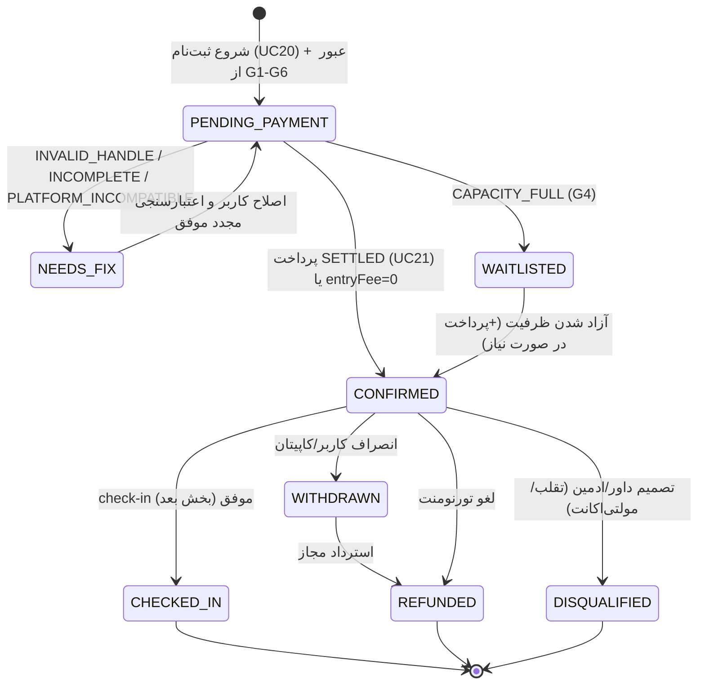
```mermaid
stateDiagram-v2
    [*] --> PENDING_PAYMENT : شروع ثبت‌نام (UC20) + عبور از G1-G6
    PENDING_PAYMENT --> NEEDS_FIX : INVALID_HANDLE / INCOMPLETE / PLATFORM_INCOMPATIBLE
    NEEDS_FIX --> PENDING_PAYMENT : اصلاح کاربر و اعتبارسنجی مجدد موفق
    PENDING_PAYMENT --> CONFIRMED : پرداخت SETTLED (UC21) یا entryFee=0
    PENDING_PAYMENT --> WAITLISTED : CAPACITY_FULL (G4)
    WAITLISTED --> CONFIRMED : آزاد شدن ظرفیت (+پرداخت در صورت نیاز)
    CONFIRMED --> CHECKED_IN : check-in موفق (بخش بعد)
    CONFIRMED --> WITHDRAWN : انصراف کاربر/کاپیتان
    CONFIRMED --> DISQUALIFIED : تصمیم داور/ادمین (تقلب/مولتی‌اکانت)
    WITHDRAWN --> REFUNDED : استرداد مجاز
    CONFIRMED --> REFUNDED : لغو تورنومنت
    CHECKED_IN --> [*]
    REFUNDED --> [*]
    DISQUALIFIED --> [*]
```

**حالات لبه‌ی پوشش‌داده‌شده در این ماشین:** بازگشت چرخه‌ای `NEEDS_FIX ⇄ PENDING_PAYMENT` تا رفع تمام خطاهای اعتبارسنجی؛ مسیر `WAITLISTED → CONFIRMED` برای آزاد شدن ظرفیت؛ سه مسیر خروجِ پایانه‌ای (`CHECKED_IN`, `REFUNDED`, `DISQUALIFIED`) دقیقاً مطابق مدل پایه.

---

### ۱۱. جمع‌بندی قرارداد ارجاع این بخش

- این بخش **فقط** از `RegistrationState` (`PENDING_PAYMENT, NEEDS_FIX, CONFIRMED, CHECKED_IN, WAITLISTED, WITHDRAWN, DISQUALIFIED, REFUNDED`)، `PlatformCode`, `ParticipantKind`, `TournamentState`، و موجودیت‌های `Registration/Participant/Platform/CrossPlayGroup/GameConfig/Tournament` مدل پایه استفاده کرده است.
- سه موردِ نیازمندِ **افزودن به مدل پایه پیش از مصرف** علامت‌گذاری شدند: (۱) `Registration.ownershipProofLevel`/`ownershipVerifiedAt`، (۲) `CustomField.scope` + `Registration.customFieldValues`، (۳) Enum `SeedingMethod`. این‌ها باید **اول در مدل پایه تثبیت** و سپس مصرف شوند تا یکپارچگی config-driven حفظ شود.
- ورودیِ این بخش به بخش‌های بعدی: خروجی نهایی، مجموعه‌ی Registrationهای `CONFIRMED` با `seed`، `handleSnapshot` و `platformContext` معتبر است که مستقیماً به **Check-in** و **Seeding/ساخت براکت** پاس داده می‌شود.

---

فایل‌های مرجع خوانده‌شده (مسیرهای مطلق):
- `C:\Users\norou\Downloads\Telegram Desktop\_design_brief.md`
- `C:\Users\norou\Downloads\Telegram Desktop\Tournament-Proposal-v2.md`
- `C:\Users\norou\Downloads\Telegram Desktop\Tournament-Model.json`

---

## ماشین حالت مسابقه

> **جایگاه این بخش:** این سند، ماشین حالت چرخه‌ی عمر یک `Match` (موجودیت بخش ۲.۲ مدل پایه) را به‌صورت **رسمی و قابل‌پیاده‌سازی** بسط می‌دهد. تمام نام‌حالت‌ها **دقیقاً** از `MatchState` (بخش ۵.۳ مدل پایه) برداشته شده‌اند و هیچ حالت تازه‌ای اختراع نشده است. این ماشین، مرجع واحدِ همه‌ی فلوهای بعدی (گزارش/تأیید نتیجه، اعتراض، No-show، پیشروی براکت، اطلاع‌رسانی) است و با ماشین‌های `DisputeState` (۶.۴)، `RegistrationState` (۶.۳) و `TournamentState` (۶.۲) هماهنگ است.
>
> **اصل انسان‌در‌حلقه:** چون API بازی‌ها وجود ندارد (بریف بند ۱۸، پروپوزال بخش ۵)، گذارهای پس از پایان بازی همگی بر **اثبات (`proofRefs`) + داور (`Referee`)** متکی‌اند. حالت‌های `AWAITING_PROOF`, `UNDER_REVIEW`, `DISPUTED` در این ماشین **اجباری** هستند.
>
> **همه‌ی تایمرها** توسط اکتور ثانویه‌ی **`Scheduler`** (Redis + BullMQ) اجرا می‌شوند؛ این اکتور خودش تصمیم‌گیرنده نیست، فقط رویداد زمان‌محور را شلیک می‌کند و گذار را روی ماشین حالت می‌اندازد. منبع زمان‌ها: `Tournament.resultPolicy`, `Tournament.checkInPolicy` و پیش‌فرض‌های `GameConfig` (بخش ۴.۲ مدل پایه).

---

### ۱. نمودار کامل ماشین حالت (stateDiagram-v2)

```mermaid
stateDiagram-v2
    direction TB
    [*] --> SCHEDULED : ساخت Match در SEEDING

    SCHEDULED --> CHECK_IN : باز شدن پنجره check-in [Scheduler @ T_match - windowMinutesBefore]
    SCHEDULED --> CANCELLED : لغو/ویرایش تورنومنت (UC09)
    SCHEDULED --> READY : BYE یا checkInPolicy.required=false

    CHECK_IN --> READY : هر دو طرف check-in کردند
    CHECK_IN --> NO_SHOW : پایان grace و عدم حضور یک یا دو طرف [Timer: T_checkin]

    READY --> IN_PROGRESS : شروع بازی (هر دو طرف START)
    READY --> FORFEIT : انصراف صریح یک طرف پیش از شروع

    IN_PROGRESS --> AWAITING_REPORT : پایان بازی / پایان مهلت بازی [Timer: T_play]

    AWAITING_REPORT --> PENDING_FINALIZE : دو گزارش منطبق + اثبات معتبر (autoConfirmOnMatch)
    AWAITING_REPORT --> AWAITING_PROOF : گزارش ثبت شد ولی اثبات ناقص
    AWAITING_REPORT --> UNDER_REVIEW : مغایرت گزارش‌ها / تنها یک طرف گزارش داد
    AWAITING_REPORT --> UNDER_REVIEW : پایان reportWindow بدون گزارش کامل [Timer: T_report]

    AWAITING_PROOF --> PENDING_FINALIZE : اثبات تکمیل و معتبر شد
    AWAITING_PROOF --> UNDER_REVIEW : پایان مهلت اثبات بدون آپلود [Timer: T_report]

    PENDING_FINALIZE --> DISPUTED : ثبت اعتراض در مهلت (UC23)
    PENDING_FINALIZE --> FINALIZED : پایان disputeWindow بدون اعتراض [Timer: T_dispute]

    DISPUTED --> UNDER_REVIEW : تخصیص داور (UC24)

    UNDER_REVIEW --> FINALIZED : رأی داور (UC11 / UC24)
    UNDER_REVIEW --> VOID : داور بازی را باطل کرد

    NO_SHOW --> FINALIZED : برد طرف حاضر (ResultSource=NO_SHOW)
    NO_SHOW --> VOID : هر دو طرف no-show
    FORFEIT --> FINALIZED : ثبت برد طرف مقابل (ResultSource=FORFEIT)

    FINALIZED --> [*] : trigger پیشروی به Round بعد (بخش ۴)
    VOID --> [*]
    CANCELLED --> [*]
```

> **یادداشت گذار خروجی `FINALIZED`:** رسیدن به `FINALIZED` (یا `VOID`/`NO_SHOW→FINALIZED`) یک رویداد دامنه‌ی `MatchFinalized` منتشر می‌کند که موتور پیشروی (بخش ۴) و `UC12` (به‌روزرسانی رده‌بندی) را فعال می‌کند. این، تنها نقطه‌ی خروج «موفق» ماشین است.

---

### ۲. تعریف دقیق هر حالت (شرط ورود/خروج + invariantها)

برای هر حالت: **شرط ورود (Entry guard)**، **اقدام هنگام ورود (On-entry)**، **شرط خروج مجاز (Exit)** و **invariant** (شرطی که تا وقتی در آن حالتیم باید برقرار بماند) آمده است.

#### `SCHEDULED`
- **معنی:** Match در `SEEDING` تورنومنت ساخته شده، `sideA`/`sideB` (یا BYE) تعیین شده، `scheduledAt` ثبت شده، اما هنوز پنجره‌ی حضور باز نشده.
- **Entry:** هر دو طرف از `Registration.state = CONFIRMED` (یا یکی BYE)؛ `platformContext` اولیه از `Registration.platform` پر شده و قاعده‌ی سازگاری (بخش ۳.۴ مدل پایه) از پیش رعایت شده است.
- **On-entry:** زمان‌بندی job باز شدن check-in در `Scheduler` (`@ scheduledAt − checkInPolicy.windowMinutesBefore`)؛ ارسال `Notification(templateKey="match.scheduled")`.
- **Exit:** به `CHECK_IN` (تایمر)، یا `READY` (BYE / عدم نیاز به check-in)، یا `CANCELLED` (لغو تورنومنت/ویرایش).
- **Invariant:** `winnerSide = null`، `resultId = null`، هیچ `MatchGame` در حالت `REPORTED/CONFIRMED` وجود ندارد.

#### `CHECK_IN`
- **معنی:** پنجره‌ی حضور باز است؛ سیستم منتظر است هر دو طرف اعلام حضور کنند (بریف بند ۱۰).
- **Entry:** `now ≥ scheduledAt − windowMinutesBefore` و `checkInPolicy.required = true`.
- **On-entry:** زمان‌بندی تایمر `T_checkin`؛ ارسال `Notification(templateKey="checkin.open")` به هر دو طرف (IN_APP + SMS).
- **Exit:** به `READY` (هر دو `checkIn.aCheckedAt` و `checkIn.bCheckedAt` پر شدند)، یا `NO_SHOW` (پایان grace).
- **Invariant:** هیچ اسکوری قابل ثبت نیست؛ `MatchGame`ها همگی `PENDING`.
- **حالت لبه — عدم‌تطابق پلتفرم در check-in:** اگر کاربر هنگام check-in پلتفرمی متفاوت از `Registration.platform` اعلام کند و این پلتفرم با طرف مقابل در **یک `crossPlayGroup` مجاز نباشد**، check-in آن طرف **رد** می‌شود (طبق جدول بخش ۳.۴ مدل پایه). Match در `CHECK_IN` می‌ماند و یک هشدار به `Referee` می‌رود؛ در صورت عدم رفع تا پایان grace، مسیر `NO_SHOW` فعال می‌شود.

#### `READY`
- **معنی:** هر دو طرف حاضرند و `platformContext` نهایی (cross-play group تأییدشده) ثبت شده؛ آماده‌ی شروع.
- **Entry:** هر دو check-in موفق، یا BYE، یا `checkInPolicy.required=false`.
- **On-entry:** قفل `platformContext`؛ نمایش دستور بازی + کد لابی (در صورت وجود) در داشبورد (UC: «چه ساعتی و چطور مسابقه بدهم»).
- **Exit:** به `IN_PROGRESS` (شروع)، یا `FORFEIT` (انصراف صریح پیش از شروع).
- **Invariant:** پلتفرم دو طرف در یک `crossPlayGroup` مجاز است (در حالت `SHARED_POOL`).

#### `IN_PROGRESS`
- **معنی:** بازی در جریان است؛ زمان شروع ثبت شده.
- **Entry:** هر دو طرف عملِ START را زده‌اند یا تایمر شروع‌خودکار فعال شده.
- **On-entry:** زمان‌بندی تایمر `T_play` (سقف مدت بازی per-game)؛ ثبت `startedAt`.
- **Exit:** به `AWAITING_REPORT` (پایان بازی توسط هر دو طرف یا پایان `T_play`).
- **Invariant:** `winnerSide = null`؛ هیچ نتیجه‌ای هنوز نهایی نیست.
- **حالت لبه — قطع وسط بازی (disconnect):** اگر یک طرف اعلام قطعی کند، Match در `IN_PROGRESS` می‌ماند تا `T_play`؛ سپس به `AWAITING_REPORT` می‌رود و طرفین می‌توانند با ضمیمه‌ی اثباتِ قطعی گزارش دهند. اگر گزارش‌ها مغایر بود → `UNDER_REVIEW` و داور طبق `rulesetText` (بازپخش/باطل) تصمیم می‌گیرد.

#### `AWAITING_REPORT`
- **معنی:** بازی تمام شده؛ سیستم منتظر گزارش نتیجه‌ی هر دو طرف است (`reportedScores.aReport`, `reportedScores.bReport`). برنده ثبت می‌کند، بازنده می‌تواند گزارش/اعتراض کند (بریف بند ۷).
- **Entry:** خروج از `IN_PROGRESS`.
- **On-entry:** زمان‌بندی تایمر `T_report` (`reportWindowMin`)؛ ارسال `Notification(templateKey="result.report.request")`.
- **Exit:**
  - **PENDING_FINALIZE:** دو گزارش **منطبق** و اثبات معتبر و `autoConfirmOnMatch=true`.
  - **AWAITING_PROOF:** گزارش هست ولی `proofSchema.required=true` و اثبات ناقص.
  - **UNDER_REVIEW:** مغایرت گزارش‌ها، یا فقط یک طرف گزارش داد و مهلت تمام شد، یا هیچ گزارشی تا پایان `T_report`.
- **Invariant:** برای هر `MatchGame` گزارش‌شده، اسکور خام طبق `resultSchema` بازی معتبر است؛ اگر `allowDraw=false` نتیجه‌ی DRAW رد می‌شود.

#### `AWAITING_PROOF`
- **معنی:** گزارش عددی هست اما اثبات اجباری (`proofSchema`) هنوز کامل نیست (بریف بند ۲، پروپوزال بخش ۵ لایه‌ی ۲).
- **Entry:** از `AWAITING_REPORT` با گزارش معتبر ولی اثبات ناقص.
- **On-entry:** ادامه‌ی شمارش `T_report` (همان مهلت)؛ یادآوری آپلود اثبات.
- **Exit:** به `PENDING_FINALIZE` (اثبات معتبر و `hashOnUpload` ذخیره شد)، یا `UNDER_REVIEW` (پایان مهلت بدون اثبات).
- **Invariant:** `proofRefs[]` ناقص؛ نتیجه قابل نهایی‌شدن نیست. هر فایل آپلودشده باید `hash` داشته باشد (ضدتقلب).

#### `PENDING_FINALIZE`
- **معنی:** نتیجه از نظر سیستم درست است (گزارش منطبق + اثبات)، اما **پنجره‌ی اعتراض** هنوز باز است؛ نتیجه‌ی قطعی نیست و **جایزه در escrow قفل می‌ماند** (پروپوزال بخش ۶).
- **Entry:** از `AWAITING_REPORT`/`AWAITING_PROOF` با شرط تطبیق کامل.
- **On-entry:** زمان‌بندی تایمر `T_dispute` (`disputeWindowMin`)؛ ثبت `winnerSide` موقت؛ ارسال `Notification(templateKey="result.pending_finalize")` به بازنده با لینک اعتراض.
- **Exit:** به `DISPUTED` (ثبت اعتراض در مهلت، UC23)، یا `FINALIZED` (پایان `T_dispute` بدون اعتراض).
- **Invariant:** `Wallet.escrowBalance` مربوط به جایزه‌ی این Match قفل است؛ هیچ `PRIZE_PAYOUT` صادر نمی‌شود.

#### `UNDER_REVIEW`
- **معنی:** Match نزد `Referee` است (مغایرت گزارش، نبود اثبات، نتیجه‌ی دیرهنگام، یا ارجاع از `DISPUTED`). مطابق UC11/UC24.
- **Entry:** از `AWAITING_REPORT`, `AWAITING_PROOF`, یا `DISPUTED`.
- **On-entry:** ساخت/به‌روزرسانی صف داوری؛ تخصیص `assignedRefereeId`؛ توقف تایمرهای خودکار (تصمیم با انسان است، نه تایمر).
- **Exit:** به `FINALIZED` (رأی داور با `ResultSource=REFEREE_DECISION` یا `DISPUTE_RESOLUTION`)، یا `VOID` (داور بازی را باطل کرد).
- **Invariant:** escrow هم‌چنان قفل؛ هیچ پیشروی براکت تا صدور رأی انجام نمی‌شود.

#### `DISPUTED`
- **معنی:** بازنده در پنجره‌ی اعتراض، اعتراض ثبت کرده (`Dispute` با `state=OPEN`)؛ Match منتظر تخصیص داور است (UC23 → UC24).
- **Entry:** از `PENDING_FINALIZE` با ثبت اعتراض.
- **On-entry:** ساخت `Dispute(state=OPEN)`؛ پیوند `Match.disputeId`؛ **توقف `T_dispute`**؛ نگه‌داشت escrow.
- **Exit:** به `UNDER_REVIEW` (تخصیص داور، `Dispute → UNDER_REVIEW`).
- **Invariant:** `Match.disputeId ≠ null` و `Dispute.state ∈ {OPEN}`.
- **حالت لبه — اعتراض هم‌زمان دو طرف:** یک `Dispute` واحد ساخته می‌شود که هر دو طرف در آن `raisedBy`/طرفِ معترض‌اند؛ از ساخت دو پرونده‌ی موازی برای یک Match جلوگیری می‌شود (یکتایی روی `matchId`).

#### `NO_SHOW`
- **معنی:** یک یا هر دو طرف در پنجره‌ی حضور نیامدند (بریف بند ۹).
- **Entry:** از `CHECK_IN` پس از پایان grace.
- **On-entry:** ثبت `noShowReportedBy` (در صورت گزارش طرف حاضر) یا تشخیص خودکار `Scheduler`.
- **Exit:** به `FINALIZED` (یک طرف حاضر بود → برد او، `ResultSource=NO_SHOW`)، یا `VOID` (هیچ‌کدام حاضر نشدند).
- **Invariant:** نتیجه از مسیر بازیِ واقعی نیامده؛ `Result.source ∈ {NO_SHOW}`.

#### `FORFEIT`
- **معنی:** یک طرف پیش/حین آمادگی به‌صراحت واگذار کرد (انصراف).
- **Entry:** از `READY` (انصراف صریح).
- **On-entry:** علامت‌گذاری طرف واگذارکننده.
- **Exit:** به `FINALIZED` (برد طرف مقابل، `ResultSource=FORFEIT`).
- **Invariant:** برنده = طرف غیرِواگذارکننده.

#### `FINALIZED` (پایانی)
- **معنی:** نتیجه **قطعی و تغییرناپذیر** است؛ `Result` ساخته شده.
- **Entry:** از `PENDING_FINALIZE` (خودکار)، `UNDER_REVIEW` (داور)، `NO_SHOW`، یا `FORFEIT`.
- **On-entry:** ساخت رکورد `Result` تغییرناپذیر (`winnerSide`, `scoreSummary`, `source`, `finalizedBy`, `proofHashes`)؛ به‌روزرسانی همه‌ی `MatchGame`ها به `CONFIRMED`؛ ثبت `AuditLog`؛ انتشار `MatchFinalized` برای **پیشروی (بخش ۴)** و **UC12 (رده‌بندی)** و **آزادسازی escrow پس از مهلت/شرایط مالی**.
- **Exit:** ندارد (پایانی). استثناء: تنها مسیر بازگشت، **بازگشاییِ کنترل‌شده توسط `Referee`** در پی `Dispute` با `RESOLVED_UPHELD` است که نتیجه را اصلاح و `Result` را با نسخه‌ی جدید و `ResultSource=DISPUTE_RESOLUTION` بازنویسی می‌کند (با `AuditLog` کامل و دلیل).
- **Invariant:** `Result` immutable؛ هر تغییر فقط از طریق مسیر داوری ممیزی‌شده.

#### `VOID` (پایانی)
- **معنی:** Match باطل شد (هر دو no-show، یا رأی باطل‌سازی داور).
- **On-entry:** هیچ برنده‌ای؛ بسته به `format`، Match یا حذف می‌شود یا با قاعده‌ی Stage بازچینش/جایگزین می‌شود؛ استرداد `ENTRY_FEE` در صورت لزوم (`REFUND`).
- **Invariant:** `winnerSide = null`، `Result.source ∈ {NO_SHOW(double)}` یا بدون Result.

#### `CANCELLED` (پایانی)
- **معنی:** Match به‌دلیل **لغو/ویرایش تورنومنت** (UC09 / `TournamentState=CANCELLED`) باطل شد.
- **On-entry:** استرداد `ENTRY_FEE` ذی‌ربط (`RegistrationState → REFUNDED`)، آزادسازی escrow، ثبت `AuditLog`.
- **Invariant:** هیچ نتیجه‌ای ثبت یا نهایی نمی‌شود.

---

### ۳. تایمرها و اقدام پیش‌فرض هر تایمر

همه‌ی تایمرها توسط **`Scheduler` (BullMQ delayed jobs)** اجرا می‌شوند و idempotent‌اند (اجرای دوباره بی‌اثر). مقادیر از `Tournament.checkInPolicy`/`resultPolicy` و در نبودِ آن از `GameConfig.*Defaults` خوانده می‌شوند.

| تایمر | حالت میزبان | شروع از | منبع مقدار | مدت پیش‌فرض (FC26) | رویداد انقضا | **اقدام پیش‌فرض هنگام انقضا** |
|---|---|---|---|---|---|---|
| `T_checkin` (مهلت check-in) | `CHECK_IN` | باز شدن پنجره | `checkInPolicy.windowMinutesBefore` + `graceMinutes` | ۱۵ دقیقه پنجره + ۱۰ دقیقه grace | `CheckInWindowExpired` | اگر فقط یک طرف check-in کرده → `→ NO_SHOW` (برد طرف حاضر). اگر هیچ‌کدام → `→ NO_SHOW → VOID`. |
| `T_play` (مهلت/سقف بازی) | `IN_PROGRESS` | شروع بازی | `GameConfig` (سقف مدت per-game) | (پیکربندی per-game) | `PlayWindowExpired` | گذار اجباری `→ AWAITING_REPORT` و باز شدن پنجره‌ی گزارش؛ اگر تا اینجا اثبات قطعی ثبت شده باشد، در گزارش لحاظ می‌شود. |
| `T_report` (مهلت ثبت نتیجه) | `AWAITING_REPORT` / `AWAITING_PROOF` | ورود به AWAITING_REPORT | `resultPolicy.reportWindowMin` | ۳۰ دقیقه | `ReportWindowExpired` | اگر دو گزارش منطبق + اثبات کامل → `→ PENDING_FINALIZE`. اگر گزارش ناقص/متناقض/بدون اثبات → `→ UNDER_REVIEW` (به صف داور). **هرگز خودکار به نفع کسی نهایی نمی‌شود.** |
| `T_dispute` (مهلت اعتراض) | `PENDING_FINALIZE` | ورود به PENDING_FINALIZE | `resultPolicy.disputeWindowMin` | ۱۲۰ دقیقه | `DisputeWindowExpired` | اگر اعتراضی ثبت نشده → `→ FINALIZED` (autoConfirm). اگر اعتراض ثبت شده باشد، این تایمر **قبلاً متوقف شده** و بی‌اثر است. در طول این پنجره **escrow قفل** است. |

**قواعد عمومی تایمرها (جدول قوانین):**

| قانون | شرح |
|---|---|
| **توقف با کنش انسانی** | ورود به `DISPUTED` یا `UNDER_REVIEW` همه‌ی تایمرهای خودکار آن Match را **متوقف** می‌کند؛ از این پس فقط داور پیش می‌برد. |
| **عدم نهایی‌سازی کور** | انقضای `T_report` **هرگز** نتیجه را خودکار به نفع یک طرف نهایی نمی‌کند؛ همیشه به `UNDER_REVIEW` می‌رود (انسان‌در‌حلقه). تنها تایمری که مستقیم به `FINALIZED` می‌رسد `T_dispute` است (پس از تطبیق کامل و اثبات معتبر). |
| **Idempotency** | هر job با کلید یکتا (`matchId:timerType:fireAt`)؛ اگر گذار قبلاً رخ داده باشد، انقضا no-op است. |
| **هم‌زمانی با تورنومنت** | اگر `TournamentState → CANCELLED` شود، همه‌ی تایمرهای Matchهای غیرنهایی لغو و Matchها `→ CANCELLED`. |
| **escrow و مهلت** | آزادسازی جایزه (`ESCROW_RELEASE` → `PRIZE_PAYOUT`) فقط پس از `FINALIZED` و گذشتِ `T_dispute` بدون اعتراض باز، و تکمیل KYC برنده (UC30) مجاز است. |

---

### ۴. پیشروی به دور بعد و به‌روزرسانی براکت/جدول (پس از `FINALIZED`)

رسیدن هر Match به `FINALIZED` رویداد `MatchFinalized` را منتشر می‌کند که موتور پیشروی را فعال می‌کند (بریف بند ۱۱). رفتار **per-format** است و از `Stage.type`/`Tournament.format` خوانده می‌شود (داده‌محور).

```mermaid
flowchart TD
    A[رویداد MatchFinalized] --> B{نوع Stage / format؟}
    B -- BRACKET_SE / BRACKET_DE --> C[برنده به Match والد در Round بعد منتقل می‌شود]
    C --> C2{DOUBLE_ELIM؟}
    C2 -- بله --> C3[بازنده به براکت بازنده‌ها منتقل می‌شود]
    C2 -- خیر --> D[بازنده حذف]
    B -- ROUND_ROBIN / GROUP --> E[به‌روزرسانی standings گروه<br/>Win/Draw/Loss/Points + tiebreakers]
    E --> F{همه‌ی Roundهای گروه COMPLETED؟}
    F -- بله --> G[اعمال advancementRule:<br/>صعود N نفر برتر به Stage بعد]
    F -- خیر --> H[منتظر بقیه‌ی Matchها]
    C --> I{Match والد آماده شد؟<br/>هر دو side پر شد}
    I -- بله --> J[ساخت/فعال‌سازی Match بعد: SCHEDULED]
    I -- خیر --> K[side دیگر منتظر برنده‌ی Match خواهر]
    G --> L[UC12: به‌روزرسانی رده‌بندی نهایی + Notification]
    J --> L
    D --> L
```

**جدول قوانین پیشروی:**

| `Stage.type` / `format` | اقدام برنده | اقدام بازنده | شرط ساخت Match بعد |
|---|---|---|---|
| `BRACKET_SE` (SINGLE_ELIM) | به `bracketPosition` والد در Round بعد | حذف (`Registration` همان می‌ماند، خارج از براکت) | هر دو side والد از دو Match فرزند پر شوند |
| `BRACKET_DE` (DOUBLE_ELIM) | پیشروی در براکت برنده | انتقال به براکت بازنده‌ها (شکست دوم = حذف) | پر شدن دو side در براکت مقصد |
| `ROUND_ROBIN` / `GROUP` | به‌روزرسانی `standings` (با `scoringParams`) | به‌روزرسانی `standings` | پایان `COMPLETED` همه‌ی Roundهای گروه |
| `GROUP_THEN_KNOCKOUT` | همان قواعد گروه، سپس seeding مرحله‌ی حذفی | طبق `advancementRule` صعود/حذف | اتمام Stage گروهی → ساخت براکت Stage بعد |
| `SWISS` | جفت‌سازی دور بعد بر اساس امتیاز نزدیک | همان | اتمام دور جاری + الگوریتم جفت‌سازی سوئیسی |

> **هماهنگی با `VOID`/`NO_SHOW`:** اگر Match به `VOID` برسد در براکت‌های حذفی معمولاً طرف مقابل (در صورت وجود) صعود می‌کند یا، در حالت double-void، جایگاه طبق قاعده‌ی Stage بازچینش می‌شود؛ در فرمت گروهی، Match باطل در `standings` ثبت نمی‌شود مگر قاعده‌ی جریمه‌ی per-game وجود داشته باشد. این رفتار از `Stage.advancementRule` و `GameConfig` خوانده می‌شود، نه hard-code.

---

### ۵. نگاشت گذار → رویداد، اکتور مسئول و یوزکیس

ستون «اکتور» نشان می‌دهد چه کسی گذار را **آغاز** می‌کند؛ `Scheduler` فقط شلیک‌کننده‌ی تایمر است (تصمیم‌گیرنده نیست).

| # | گذار (`از → به`) | رویداد محرک | اکتور مسئول | UC |
|---|---|---|---|---|
| 1 | `[*] → SCHEDULED` | `MatchCreated` (در SEEDING) | سیستم (موتور seeding) / `Game Admin` | UC08 |
| 2 | `SCHEDULED → CHECK_IN` | `CheckInOpened` (تایمر) | `Scheduler` | UC15 |
| 3 | `SCHEDULED → READY` | `ByeOrNoCheckIn` | سیستم | — |
| 4 | `SCHEDULED → CANCELLED` | `TournamentCancelled` / `MatchRemoved` | `Game Admin` | UC09 |
| 5 | `CHECK_IN → READY` | `BothCheckedIn` | `User` (هر دو طرف) | UC20-جانبی (check-in) |
| 6 | `CHECK_IN → NO_SHOW` | `CheckInWindowExpired` (تایمر) | `Scheduler` (+ گزارش طرف حاضر) | UC09/No-show (بریف بند ۹) |
| 7 | `READY → IN_PROGRESS` | `MatchStarted` | `User` (هر دو طرف) | — |
| 8 | `READY → FORFEIT` | `Forfeited` | `User` (طرف واگذارکننده) | — |
| 9 | `IN_PROGRESS → AWAITING_REPORT` | `MatchEnded` / `PlayWindowExpired` | `User` یا `Scheduler` | UC10 |
| 10 | `AWAITING_REPORT → PENDING_FINALIZE` | `ReportsMatched` (autoConfirm) | `User` (گزارش طرفین) + سیستم | UC10 |
| 11 | `AWAITING_REPORT → AWAITING_PROOF` | `ProofRequired` | سیستم (طبق `proofSchema`) | UC10 |
| 12 | `AWAITING_REPORT → UNDER_REVIEW` | `ReportsConflict` / `ReportWindowExpired` | `Scheduler` → صف `Referee` | UC10 → UC11 |
| 13 | `AWAITING_PROOF → PENDING_FINALIZE` | `ProofValidated` | `User` (آپلود) + سیستم (hash) | UC10 |
| 14 | `AWAITING_PROOF → UNDER_REVIEW` | `ProofWindowExpired` | `Scheduler` → `Referee` | UC11 |
| 15 | `PENDING_FINALIZE → DISPUTED` | `DisputeRaised` | `User` (بازنده) | UC23 |
| 16 | `PENDING_FINALIZE → FINALIZED` | `DisputeWindowExpired` | `Scheduler` | UC10/UC12 |
| 17 | `DISPUTED → UNDER_REVIEW` | `RefereeAssigned` | `Referee` / سیستم تخصیص | UC24 |
| 18 | `UNDER_REVIEW → FINALIZED` | `RefereeRuled` | `Referee` | UC11 / UC24 |
| 19 | `UNDER_REVIEW → VOID` | `MatchVoided` | `Referee` | UC24 |
| 20 | `NO_SHOW → FINALIZED` | `NoShowResolved` (برد حاضر) | `Referee` / سیستم | UC10 |
| 21 | `NO_SHOW → VOID` | `DoubleNoShow` | `Scheduler` / `Referee` | UC24 |
| 22 | `FORFEIT → FINALIZED` | `ForfeitConfirmed` | سیستم / `Game Admin` | UC10 |
| 23 | `FINALIZED → [*]` | `MatchFinalized` (پیشروی + رده‌بندی) | سیستم (موتور پیشروی) | UC12 |

---

### ۶. کاتالوگ حالات لبه (پوشش بریف بند ۱۴) و رفتار رسمی

| حالت لبه | مسیر در ماشین | رفتار رسمی + معیار پذیرش |
|---|---|---|
| **قطع اتصال وسط بازی** | `IN_PROGRESS` → `AWAITING_REPORT` → (مغایرت) `UNDER_REVIEW` | طرفین با اثبات قطعی گزارش می‌دهند؛ داور طبق `rulesetText` رأی می‌دهد. **پذیرش:** هیچ نتیجه‌ای بدون اثبات/رأی نهایی نمی‌شود. |
| **تساوی (Draw)** | `AWAITING_REPORT` → `PENDING_FINALIZE` با `winnerSide=DRAW` | فقط اگر `GameConfig.allowDraw=true`؛ در غیر این صورت گزارش DRAW رد و Match در `AWAITING_REPORT` می‌ماند. **پذیرش:** در فرمت حذفی (`allowDraw=false`) هرگز DRAW نهایی نمی‌شود. |
| **هر دو No-show** | `CHECK_IN` → `NO_SHOW` → `VOID` | بدون برنده؛ بسته به فرمت بازچینش/استرداد. **پذیرش:** هیچ‌کدام صعود نمی‌کنند. |
| **نتیجه‌ی دیرهنگام** | پایان `T_report` در `AWAITING_REPORT`/`AWAITING_PROOF` → `UNDER_REVIEW` | به داور می‌رود، نه نهایی‌سازی خودکار. **پذیرش:** انقضای گزارش = ارجاع به انسان. |
| **اعتراض هم‌زمان دو طرف** | `PENDING_FINALIZE` → `DISPUTED` (یک `Dispute` واحد) | یکتایی روی `matchId`؛ هر دو طرف در یک پرونده. **پذیرش:** حداکثر یک `Dispute` فعال per Match. |
| **عدم‌تطابق پلتفرم در check-in** | `CHECK_IN` (رد check-in طرف ناسازگار) → احتمال `NO_SHOW` | طبق جدول بخش ۳.۴ مدل پایه؛ هشدار به `Referee`. **پذیرش:** Match با پلتفرم‌های ناسازگار به `IN_PROGRESS` نمی‌رسد. |
| **استرداد در لغو تورنومنت** | هر حالت غیرپایانی → `CANCELLED` | استرداد `ENTRY_FEE`، آزادسازی escrow، `RegistrationState → REFUNDED`. **پذیرش:** صفر پولِ گیرافتاده پس از لغو. |
| **بازگشایی پس از اعتراضِ وارد** | `Dispute.RESOLVED_UPHELD` → بازنویسی `Result` با `ResultSource=DISPUTE_RESOLUTION` | تنها مسیر مجاز تغییر یک `Result` نهایی؛ با `AuditLog` کامل. **پذیرش:** هیچ تغییر نتیجه بدون ردِ ممیزی. |

---

### ۷. هماهنگی با ماشین‌های دیگر (قرارداد ارجاع)

| رویداد در ماشین Match | اثر روی ماشین مرتبط |
|---|---|
| ورود به `CHECK_IN` و check-in موفق طرف | `RegistrationState: CONFIRMED → CHECKED_IN` (۶.۳) |
| ورود به `DISPUTED` | ساخت `Dispute(state=OPEN)` (۶.۴) |
| `DISPUTED → UNDER_REVIEW` | `Dispute: OPEN → UNDER_REVIEW` (۶.۴) |
| `UNDER_REVIEW → FINALIZED` با اعتراض وارد | `Dispute: → RESOLVED_UPHELD`؛ بازنویسی `Result` |
| `UNDER_REVIEW → FINALIZED` با اعتراض رد | `Dispute: → RESOLVED_REJECTED`؛ `Result` اولیه پابرجا |
| `→ FINALIZED` | `MatchGame.* → CONFIRMED`، انتشار برای UC12 و escrow |
| `TournamentState → CANCELLED` | همه‌ی Matchهای غیرنهایی `→ CANCELLED` |

> **خلاصه‌ی قرارداد:** این ماشین فقط از `MatchState` (۵.۳ مدل پایه) استفاده می‌کند، تایمرهایش از `resultPolicy`/`checkInPolicy`/`GameConfig` تغذیه می‌شوند، و هر گذار حساس (`FINALIZED`، حرکت escrow، رأی داور) یک `AuditLog` تولید می‌کند. هیچ نتیجه‌ای بدون **اثبات + انسان‌در‌حلقه** قطعی نمی‌شود و هیچ تایمری به‌صورت کور به نفع یک طرف نهایی‌سازی نمی‌کند.

---

## نتیجه، اعتراض، داوری، No-show

> **جایگاه این بخش:** این سند فاز عملیاتیِ «بعد از پایان بازی» را پوشش می‌دهد و **فقط** از موجودیت‌ها، فیلدها و نام‌حالت‌های رسمیِ مدل پایه استفاده می‌کند: `Match`/`MatchGame`/`Result`/`Dispute`، حالت‌های `MatchState`، `MatchGameState`، `DisputeState`، Enumهای `WinnerSide` و `ResultSource`، و قوانین مالی `Escrow`/`LedgerEntry`. هیچ نام‌حالت یا فیلد جدیدی اینجا اختراع نشده است. ارجاع یوزکیس‌ها: ثبت/تأیید نتیجه (UC10)، تأیید داور (UC11)، به‌روزرسانی رده‌بندی (UC12)، ثبت اعتراض (UC23)، حل اختلاف (UC24).
>
> **اصل حاکم (Human-in-the-loop):** چون API بازی وجود ندارد، حقیقتِ نتیجه از **اجماع دو طرف + اثبات قابل‌راستی‌آزمایی + داور انسانی** ساخته می‌شود. تطبیق خودکار صرفاً مسیر سریعِ «اجماع» است؛ هر انحراف به `UNDER_REVIEW` یا `DISPUTED` می‌رود و پول تا پایان مهلت اعتراض در `escrowBalance` قفل می‌ماند.

---

### ۱. چه کسی نتیجه را ثبت می‌کند؟ (مدل گزارش دوطرفه)

مدل پایه‌ی ما **«برنده ثبت می‌کند، بازنده تأیید/رد می‌کند»** را به‌شکل **گزارش دوطرفه‌ی متقارن** پیاده می‌کند تا هیچ طرفی مزیت یک‌جانبه نداشته باشد. اسکورِ خام در `MatchGame.scoreA/scoreB` (طبق `resultSchema` بازی) و گزارش هر طرف در `Match.reportedScores = { aReport, bReport }` ذخیره می‌شود.

| نقش | کنش مجاز | فیلد مقصد | یوزکیس |
|---|---|---|---|
| طرف برنده (یا هر طرف) | ثبت اولیه‌ی اسکور هر `MatchGame` + آپلود اثبات | `MatchGame.scoreX`, `proofRefs[]`, `reportedScores.aReport` | UC10 |
| طرف مقابل (معمولاً بازنده) | **تأیید** یا **رد/اصلاح** گزارش طرف اول | `reportedScores.bReport` | UC10 |
| Game Admin | ثبت دستی نتیجه به‌نیابت (وقتی طرفین کوتاهی کنند) | `reportedScores` + flag `source` | UC10 |
| Referee | تأیید نهایی / صدور رأی در حالت اختلاف | `Result.finalizedBy`, `Result.source` | UC11/UC24 |

**نکته‌ی طراحی:** «برنده ثبت می‌کند» اجبار **نیست**؛ هر طرف می‌تواند نخست ثبت کند. اما `MatchState` تا وقتی **هر دو** `aReport` و `bReport` پر نشوند در `AWAITING_REPORT` می‌ماند. «تأیید بازنده» = پر شدن `bReport` با همان مقدار؛ «رد بازنده» = پر شدن `bReport` با مقدار متفاوت → مسیر اختلاف.

**معیار پذیرش:**
- ثبت اسکوری که با `resultSchema.kind` ناسازگار باشد (مثلاً `placement` در بازیِ `SCORELINE`) رد می‌شود و `MatchState` تغییر نمی‌کند.
- اگر `allowDraw=false` و گزارش، تساوی باشد، ثبت رد می‌شود (پیام: «این بازی تساوی ندارد»).
- در `bestOf=N`، نتیجه تنها وقتی کامل است که مجموع گیم‌های `CONFIRMED` به اکثریت لازم (`ceil(N/2)`) برسد؛ گیم‌های اضافه‌ی بی‌اثر `VOID` می‌شوند.

---

### ۲. آپلود اثبات (Proof) — مهر زمانی و hash

اثبات طبق `proofSchema` بازی جمع‌آوری می‌شود و در `MatchGame.proofRefs[]` (و خلاصه در `Result.proofHashes[]`) ذخیره می‌شود.

| ویژگی | منبع config | قاعده |
|---|---|---|
| نوع‌های مجاز | `proofSchema.types[] = SCREENSHOT \| CLIP \| MATCH_ID` | فقط همین‌ها پذیرفته می‌شوند |
| اجباری بودن | `proofSchema.required` | اگر `true` و اثبات نباشد → `AWAITING_PROOF` |
| حداقل تعداد / حجم | `minCount`, `maxSizeMB` | کمتر از `minCount` = ناقص |
| مهر زمانی | metadata آپلود (سمت سرور) | زمان سرور ثبت می‌شود، نه زمان ادعایی کلاینت |
| hash | `proofSchema.hashOnUpload=true` | `SHA-256` فایل در لحظه‌ی آپلود؛ ذخیره‌ی غیرقابل‌تغییر |

**چرا hash؟** برای **زنجیره‌ی صحت (integrity)**: اگر بعداً همان فایل با نسخه‌ی دستکاری‌شده جایگزین شود، hash تغییر می‌کند و در `AuditLog` آشکار می‌شود. hashها به `Result.proofHashes[]` کپی می‌شوند تا حتی پس از حذف فایل خام، اثرِ تغییرناپذیر بماند.

**معیار پذیرش:**
- آپلود بیش از `maxSizeMB` یا نوع خارج از `types[]` رد می‌شود و به `MatchState` آسیب نمی‌زند.
- دو آپلود با hash یکسان توسط دو طرفِ مختلف = **پرچم تقلب** (احتمال اسکرین‌شات مشترک/جعلی) → ورود به `UNDER_REVIEW`.
- هیچ نتیجه‌ای با `requireProof=true` بدون حداقل یک proofRef معتبر به `FINALIZED` نمی‌رسد.

---

### ۳. تطبیق خودکار (Auto-match) و مسیر اجماع/تناقض

پس از پر شدن هر دو گزارش، موتورِ عمومی (مستقل از بازی) `aReport` و `bReport` را مقایسه می‌کند. رفتار با `resultPolicyDefaults.autoConfirmOnMatch` کنترل می‌شود.

#### جدول قوانین تطبیق

| `aReport` در برابر `bReport` | اثبات | `autoConfirmOnMatch` | گذار `MatchState` | `ResultSource` |
|---|---|---|---|---|
| **یکسان** | معتبر و کامل | `true` | `AWAITING_REPORT → PENDING_FINALIZE` | `MUTUAL_AGREEMENT` |
| **یکسان** | ناقص/نبود | — | `AWAITING_REPORT → AWAITING_PROOF` | — |
| **یکسان** | معتبر | `false` | `AWAITING_REPORT → UNDER_REVIEW` (تأیید دستی داور) | `REFEREE_DECISION` |
| **متناقض** | هر حالت | — | `AWAITING_REPORT → UNDER_REVIEW` | تعیین توسط داور |
| فقط یک طرف گزارش داد + پایان `reportWindowMin` | — | — | `AWAITING_REPORT → UNDER_REVIEW` | داور |
| هیچ طرف گزارش نداد + پایان پنجره | — | — | بسته به no-show (بخش ۵) | `NO_SHOW`/`VOID` |

> «یکسان» یعنی هم `WinnerSide` و هم خلاصه‌ی اسکورِ گیم‌به‌گیم منطبق باشند. اختلاف فقط در یک `MatchGame` کافی است تا کل Match «متناقض» تلقی شود.

#### فلوچارت تطبیق خودکار

```mermaid
flowchart TD
    S[هر دو طرف گزارش دادند<br/>aReport و bReport پر شد] --> C{aReport == bReport؟}
    C -- خیر --> R[MatchState = UNDER_REVIEW<br/>ساخت زمینه‌ی داوری]
    C -- بله --> P{اثبات کامل و معتبر؟<br/>طبق proofSchema}
    P -- خیر --> AP[MatchState = AWAITING_PROOF<br/>اعلان: اثبات ناقص]
    P -- بله --> A{autoConfirmOnMatch؟}
    A -- true --> PF[MatchState = PENDING_FINALIZE<br/>ResultSource = MUTUAL_AGREEMENT<br/>شروع شمارش disputeWindowMin]
    A -- false --> UR[MatchState = UNDER_REVIEW<br/>تأیید دستی داور]
    AP -->|اثبات تکمیل شد در مهلت| A
    AP -->|پایان مهلت بدون اثبات| UR
    PF -->|پایان مهلت بدون اعتراض| F[MatchState = FINALIZED<br/>آزادسازی escrow → رده‌بندی UC12]
    PF -->|ثبت اعتراض در مهلت UC23| D[MatchState = DISPUTED]
    R --> UR
```

**معیار پذیرش:**
- هیچ گذاری به `PENDING_FINALIZE` بدون اجماع کامل + اثبات معتبر (در صورت `requireProof`) رخ نمی‌دهد.
- ورود به `PENDING_FINALIZE` تایمر `disputeWindowMin` را آغاز می‌کند؛ این تایمر یک job در Scheduler (BullMQ) است که در پایان، `PENDING_FINALIZE → FINALIZED` را اجرا می‌کند مگر اعتراضی ثبت شده باشد.
- در کل مسیر، `escrowBalance` دست‌نخورده می‌ماند و فقط در `FINALIZED` آزاد یا در `VOID/CANCELLED` مسترد می‌شود.

---

### ۴. فلوِ اعتراض → داوری انسانی → رأی نهایی (UC23 → UC24 → UC11)

اعتراض فقط در پنجره‌ی `disputeWindowMin` (یعنی وقتی Match در `PENDING_FINALIZE` است) یا روی نتیجه‌ی `UNDER_REVIEW` پذیرفته می‌شود. ثبت اعتراض یک `Dispute` می‌سازد و `MatchState` را به `DISPUTED` می‌برد. سپس تخصیص داور، آن را به `UNDER_REVIEW` (در سطح Match) و `Dispute.state = UNDER_REVIEW` می‌برد.

#### نگاشت حالت‌ها در فرایند اعتراض

| رویداد | `MatchState` | `DisputeState` | یوزکیس |
|---|---|---|---|
| ثبت اعتراض با مدرک | `PENDING_FINALIZE → DISPUTED` | — → `OPEN` | UC23 |
| تخصیص داور | `DISPUTED → UNDER_REVIEW` | `OPEN → UNDER_REVIEW` | UC24 |
| درخواست مدرک بیشتر | `UNDER_REVIEW` (ثابت) | `→ NEEDS_MORE_EVIDENCE` | UC24 |
| ارسال مدرک تکمیلی | `UNDER_REVIEW` | `→ UNDER_REVIEW` | UC24 |
| رأی: اعتراض وارد | `UNDER_REVIEW → FINALIZED` (نتیجه‌ی اصلاح‌شده) | `→ RESOLVED_UPHELD` | UC11 |
| رأی: اعتراض رد | `UNDER_REVIEW → FINALIZED` (نتیجه‌ی اولیه) | `→ RESOLVED_REJECTED` | UC11 |
| داور بازی را باطل کرد | `UNDER_REVIEW → VOID` | `→ RESOLVED_UPHELD/REJECTED` | UC24 |
| ارجاع به سطح بالاتر | `UNDER_REVIEW` (ثابت) | `→ ESCALATED` (تصمیم Main Admin) | UC24 |
| پس‌گیری اعتراض | بازگشت به مسیر قبلی | `OPEN → WITHDRAWN` | UC23 |

#### فلوچارت اعتراض و داوری

```mermaid
flowchart TD
    A[نتیجه در PENDING_FINALIZE یا UNDER_REVIEW] --> B{بازنده اعتراض دارد؟}
    B -- خیر، پایان مهلت --> Z[FINALIZED بدون اعتراض]
    B -- بله UC23 --> C[ساخت Dispute<br/>raisedBy + evidenceRefs<br/>DisputeState=OPEN<br/>MatchState=DISPUTED]
    C --> D[تخصیص Referee UC24<br/>DisputeState=UNDER_REVIEW<br/>MatchState=UNDER_REVIEW]
    D --> E{مدرک کافی است؟}
    E -- خیر --> F[NEEDS_MORE_EVIDENCE<br/>درخواست از طرفین]
    F -->|مدرک رسید| E
    F -->|مهلت تمام شد| G
    E -- بله --> G{رأی داور}
    G -- اعتراض وارد --> H[RESOLVED_UPHELD<br/>نتیجه اصلاح می‌شود<br/>Result.source=DISPUTE_RESOLUTION]
    G -- اعتراض رد --> I[RESOLVED_REJECTED<br/>نتیجه‌ی اولیه پابرجا]
    G -- ابهام شدید --> J[VOID یا ESCALATED<br/>به Main Admin]
    H --> K[MatchState=FINALIZED<br/>به‌روزرسانی رده‌بندی UC12<br/>آزاد/جابه‌جایی escrow]
    I --> K
    J -->|ESCALATED حل شد| K
    J -->|VOID| L[بازی باطل<br/>استرداد/بازپخش طبق سیاست]
```

**نکات حقوقی/مالی اعتراض:**
- تا صدور رأی، `escrowBalance` قفل می‌ماند؛ `PRIZE_PAYOUT` ممنوع است.
- اگر اعتراض **وارد** شود و برنده عوض شود، `Result` قبلی هرگز پاک نمی‌شود؛ یک `Result` جدید با `source = DISPUTE_RESOLUTION` صادر و قبلی در `AuditLog` نگه داشته می‌شود (تغییرناپذیری تاریخی).
- پس از `FINALIZED`، نتیجه تغییرناپذیر است؛ تنها مسیر بازگشایی، `ESCALATED` به Main Admin برای موارد استثنایی است (با ثبت کامل audit).

**معیار پذیرش:**
- اعتراض پس از پایان `disputeWindowMin` رد می‌شود (پیام: «مهلت اعتراض گذشته است»)، مگر مورد escalation اداری.
- اعتراض هم‌زمانِ هر دو طرف روی یک Match → **یک** `Dispute` با هر دو طرف به‌عنوان معترض (نه دو پرونده‌ی موازی).
- هر رأی داور رکورد `AuditLog` با `before/after` نتیجه می‌سازد.

---

### ۵. No-show و Check-in («چیزی برایش باز شود تا سیستم بفهمد واقعاً هست»)

#### ۵.۱ منطق Check-in به‌مثابه «اثبات حضور»

طبق مدل پایه، هر `Match` فیلد `checkIn = { aCheckedAt, bCheckedAt }` دارد و سیاست از `checkInDefaults` بازی می‌آید: `{ required, windowMinutesBefore, graceMinutes }`. پنجره‌ی check-in در `Match` با گذار `SCHEDULED → CHECK_IN` باز می‌شود.

**«چیزی که برای طرف باز می‌شود»** = یک کنش صریحِ Check-in در داشبورد (دکمه + لاگ زمان سرور). زدن آن `aCheckedAt`/`bCheckedAt` را با **زمان سرور** پر می‌کند — این همان سیگنالی است که سیستم با آن می‌فهمد طرف «واقعاً حاضر است».

| زمان نسبت به `scheduledAt` | وضعیت | گذار |
|---|---|---|
| `scheduledAt − windowMinutesBefore` | باز شدن پنجره | `SCHEDULED → CHECK_IN` |
| هر دو طرف Check-in کردند | حاضر | `CHECK_IN → READY` |
| پایان `graceMinutes` و یک طرف غایب | no-show یک‌طرفه | `CHECK_IN → NO_SHOW` |
| پایان `graceMinutes` و هر دو غایب | no-show دوطرفه | `CHECK_IN → NO_SHOW → VOID` |

#### ۵.۲ گزارش No-show توسط طرف حاضر

اگر طرف مقابل سرِ ساعت نیامد، **طرفِ حاضر** (که `checkedInAt` دارد) می‌تواند No-show را گزارش کند. این گزارش در `Match.noShowReportedBy = A | B` ثبت می‌شود. اما سیستم **به‌صرف ادعا** برنده اعلام نمی‌کند؛ تصمیم بر پایه‌ی **سیگنال عینی Check-in** گرفته می‌شود تا از سوءاستفاده جلوگیری شود.

#### ۵.۳ ماتریس تصمیم No-show (خودکار در برابر داوری)

| طرف A Check-in؟ | طرف B Check-in؟ | `noShowReportedBy` | تصمیم | گذار و نتیجه |
|---|---|---|---|---|
| بله | بله | — | هر دو حاضر | `READY` (بازی عادی) |
| بله | خیر (پایان grace) | A (اختیاری) | **خودکار**: برد A | `NO_SHOW → FINALIZED`, `WinnerSide=A`, `ResultSource=NO_SHOW` |
| خیر | بله (پایان grace) | B (اختیاری) | **خودکار**: برد B | `NO_SHOW → FINALIZED`, `WinnerSide=B`, `ResultSource=NO_SHOW` |
| خیر | خیر | — | **خودکار**: ابطال | `NO_SHOW → VOID`, استرداد هر دو از escrow |
| بله | بله ولی یکی ادعای no-show کرد | A یا B | **داوری**: تناقض سیگنال | `UNDER_REVIEW` (نزد Referee) |
| Check-in کرد ولی ادعا شده غایب واقعی است | — | طرف مقابل | **داوری**: نیاز به اثبات حضور | `UNDER_REVIEW` |

**اصل تصمیم:** اگر **سیگنال Check-in یک‌طرفه و بدون‌تناقض** باشد → تصمیم **خودکار**. اگر **تناقض** وجود داشت (هر دو check-in کرده‌اند ولی یکی مدعی no-show است، یا طرف غایب پس از grace ادعای حضور دارد) → **داوری انسانی** (`UNDER_REVIEW`).

#### ۵.۴ اثبات حضور (Presence proof)

برای جلوگیری از سوءاستفاده‌ی «حریفم نیامد» در حالی‌که خودش هم نیامده:
- Check-in واقعی نیازمند **کنش فعال در پنجره‌ی زمانی** است؛ زمان از سرور گرفته می‌شود (نه از کلاینت).
- در حالت تناقض، داور می‌تواند طبق `proofSchema` درخواست **اثبات حضور** کند: اسکرین‌شات لابی/منوی بازی با حریف، یا کلیپ انتظار. این اثبات هم با hash ذخیره می‌شود.
- معیار پذیرش: طرفی که `checkedInAt` ندارد، **نمی‌تواند** به‌نفع خودش No-show گزارش کند؛ تنها طرفِ check-in‌کرده مجاز به گزارش است.

#### ۵.۵ ماشین حالت No-show / Check-in

```mermaid
stateDiagram-v2
    [*] --> SCHEDULED
    SCHEDULED --> CHECK_IN : باز شدن پنجره (windowMinutesBefore)
    CHECK_IN --> READY : هر دو aCheckedAt و bCheckedAt پر شد
    CHECK_IN --> NO_SHOW : پایان graceMinutes و غیبت
    NO_SHOW --> FINALIZED : یک‌طرف حاضر (WinnerSide=A/B, ResultSource=NO_SHOW)
    NO_SHOW --> VOID : هر دو غایب (استرداد escrow)
    READY --> UNDER_REVIEW : تناقض سیگنال حضور (ادعای no-show با وجود check-in)
    READY --> IN_PROGRESS : شروع بازی عادی
    UNDER_REVIEW --> FINALIZED : رأی داور UC11
    UNDER_REVIEW --> VOID : ابطال توسط داور
    FINALIZED --> [*]
    VOID --> [*]
```

**معیار پذیرش No-show:**
- اگر `checkInDefaults.required=false`، گذار `CHECK_IN` رد می‌شود و Match مستقیم `SCHEDULED → READY/IN_PROGRESS` می‌رود؛ منطق no-show بر پایه‌ی پنجره‌ی گزارش نتیجه اعمال می‌شود.
- برد no-show تنها وقتی `FINALIZED` می‌شود که طرف برنده واقعاً `checkedInAt` داشته باشد؛ در غیر این صورت `VOID`.
- در `VOID`ِ دوطرفه، هر دو `Registration` معادل `entryFee` خود را از طریق `ESCROW_RELEASE → REFUND` بازمی‌گیرند (با `idempotencyKey` یکتا).

---

### ۶. ضدتقلب و Audit Trail هر تغییر وضعیت نتیجه

#### ۶.۱ کنترل‌های ضدتقلب (هم‌راستا با بخش ۵ پروپوزال)

| تهدید | کنترل | حالت/داده‌ی مرتبط |
|---|---|---|
| اسکرین‌شات جعلی/مشترک | hash اجباری (`hashOnUpload`)؛ کشف hash تکراری بین دو طرف | `proofHashes[]` → پرچم → `UNDER_REVIEW` |
| تبانی (یک طرف عمداً می‌بازد) | کشف الگوی بردهای پیاپی غیرعادی، نشانه‌گذاری جفت‌های مکرر | پرچم برای Referee/Main Admin |
| مولتی‌اکانت | اثرانگشت دستگاه/IP/ایمیل-تلفن یکتا (ماژول هویت) | بلوکه در `Registration` |
| اسپم گزارش نتیجه | محدودیت نرخ (rate-limit) روی ثبت `reportedScores` | رد موقت + لاگ |
| دستکاری نتیجه‌ی نهایی | تغییرناپذیری `Result` پس از `FINALIZED`؛ هر اصلاح = `Result` جدید | `ResultSource=DISPUTE_RESOLUTION` |
| no-show ساختگی | اجازه‌ی گزارش فقط به طرفِ `checkedInAt`دار؛ اتکا به سیگنال سرور | بخش ۵ |
| پرداخت/جایزه‌ی دوباره | `idempotencyKey` یکتا روی هر تراکنش مالی | `Transaction` |

#### ۶.۲ Audit Trail اجباری

طبق اصل **Audit-everything** مدل پایه، **هر گذار `MatchState`/`MatchGameState`/`DisputeState`** یک رکورد `AuditLog` می‌سازد. این برای حسابرسی، اختلاف‌های حقوقی و reconcile مالی حیاتی است.

**هر رکورد `AuditLog` شامل:**

| فیلد | محتوا |
|---|---|
| `entityType` / `entityId` | `Match` / `Dispute` / `MatchGame` و شناسه |
| `fromState` → `toState` | مثلاً `PENDING_FINALIZE → FINALIZED` |
| `actor` | کاربر/داور/Scheduler که گذار را اجرا کرد |
| `reason` / `source` | `ResultSource` یا علت داوری |
| `proofHashes` | اثبات‌های مرتبط در لحظه‌ی گذار |
| `payloadBefore/After` | snapshot نتیجه پیش و پس (برای رأی‌های اصلاحی) |
| `timestamp` | زمان سرور |
| `idempotencyKey` | برای گذارهای مالی‌محور |

**معیار پذیرش audit:**
- هیچ گذاری به `FINALIZED`، `VOID`، یا هیچ حرکت `escrow` (`ESCROW_RELEASE`/`PRIZE_PAYOUT`/`REFUND`) بدون رکورد `AuditLog` متناظر ثبت نمی‌شود.
- audit trail یک Match باید زنجیره‌ی کامل و پیوسته‌ی گذارها را بازسازی کند؛ هیچ گذاری بدون پیشینِ معتبر (طبق ماشین حالت `MatchState` بخش ۶.۱ مدل پایه) پذیرفته نمی‌شود.
- رکوردهای `AuditLog` **append-only** و غیرقابل‌حذف‌اند.

---

### ۷. خلاصه‌ی حالات لبه‌ی پوشش‌داده‌شده

| حالت لبه | رفتار سیستم |
|---|---|
| قطع اتصال وسط بازی | اثبات قطع آپلود می‌شود → `AWAITING_REPORT`؛ در صورت تناقض → `UNDER_REVIEW`؛ داور: بازپخش یا `VOID` |
| تساوی در بازیِ بدون تساوی | اگر `allowDraw=false`، گزارش `DRAW` رد می‌شود |
| تساوی مجاز | `WinnerSide=DRAW` فقط اگر `allowDraw=true` (امتیاز با `drawPts`) |
| هر دو no-show | `NO_SHOW → VOID` + استرداد دوطرفه از escrow |
| نتیجه‌ی دیرهنگام | پایان `reportWindowMin` بدون گزارش کامل → `UNDER_REVIEW` |
| اعتراض هم‌زمان دو طرف | یک `Dispute` با هر دو طرف معترض |
| اثبات با hash یکسانِ دو طرف | پرچم تقلب → `UNDER_REVIEW` |
| عدم‌تطابق پلتفرم در check-in | check-in رد (طبق بخش ۳.۴ مدل پایه) → نیاز به اصلاح/داور |
| گزارش no-show توسط طرفِ خودش‌غایب | رد؛ تنها طرفِ `checkedInAt`دار مجاز است |
| تلاش پرداخت جایزه پیش از `FINALIZED` | مسدود؛ escrow تا پایان `disputeWindowMin` قفل است |

---

> **قرارداد ارجاع این بخش:** تمام حالت‌ها و فیلدهای به‌کاررفته (`MatchState`, `MatchGameState`, `DisputeState`, `WinnerSide`, `ResultSource`, `checkIn`, `reportedScores`, `noShowReportedBy`, `proofRefs`, `escrowBalance`, `idempotencyKey`) مستقیماً از مدل پایه‌ی عمومی (بخش‌های ۲ و ۵) گرفته شده‌اند. منطق این بخش کاملاً **config-driven** است: پنجره‌های زمانی، اجباری‌بودن اثبات، گریس no-show و تطبیق خودکار همه از `resultPolicyDefaults`، `proofSchema` و `checkInDefaults`ِ `GameConfig` خوانده می‌شوند — بدون هیچ منطق سخت‌کدشده‌ی per-game.

---

## موتور براکت و ساختار مسابقه و پیشروی

> **جایگاه این بخش:** این سند زیرسیستم **Bracket Engine** را تعریف می‌کند: تولید ساختار رویداد، seeding، مدیریت BYE، پیشروی برنده، به‌روزرسانی خودکار جدول/براکت، و قوانین رتبه‌بندی و tie-breaker. این بخش **فقط** از موجودیت‌ها، فیلدها و نام‌حالت‌های مدل پایه‌ی عمومی استفاده می‌کند: سلسله‌مراتب `Tournament → Stage → Group → Round → Match → MatchGame`، Enumهای `TournamentFormat`، `MatchState`، `StageState`/`RoundState`، `WinnerSide`، `ResultSource` و `GameConfig`. هیچ نام‌حالت یا فیلد جدیدی خارج از مدل پایه اختراع نمی‌شود؛ هرجا به افزونه نیاز بود، صریحاً به‌عنوان «پیشنهاد افزودن به مدل پایه» علامت‌گذاری شده است.
>
> **اصل داده‌محوری:** موتور براکت **عمومی** است. رفتارش (فرمت مجاز، اندازه‌ی تیم، `bestOf`، tie-breakerها، الگوریتم امتیازدهی) را از `Tournament.format`، `Tournament.platformPolicy` و `GameConfig` (`allowedFormats`, `tiebreakers`, `scoringStrategyKey`, `scoringParams`, `allowDraw`) می‌خواند. افزودن یک فرمت کاملاً جدید با الگوریتم تازه = افزودن یک **BracketStrategy پلاگین‌پذیر** (هم‌راستا با مدل `ScoringStrategy` در بخش ۳.۵ مدل پایه)، نه بازنویسی منطق بالادست.

---

### فهرست مطالب
۱. مفاهیم پایه: rank در برابر position و نگاشت به مدل
۲. ماتریس فرمت‌ها → ساختار `Stage/Group/Round/Match`
۳. الگوریتم seeding و BYE
۴. موتور هر فرمت (single/double elim، round-robin، Swiss، گروهی→پلی‌آف، gauntlet، FFA)
۵. منطق پیشروی و به‌روزرسانی خودکار پس از `FINALIZED`
۶. قوانین رتبه‌بندی و tie-breaker (جدول قوانین)
۷. نمونه‌های Mermaid (براکت ۸ نفره + گروه round-robin)
۸. حالات لبه: تعداد فرد، انصراف وسط مسابقه، walkover، no-show
۹. ماشین حالت پیشروی و معیارهای پذیرش

---

## ۱. مفاهیم پایه: position در برابر rank

دو مفهوم که در سرتاسر موتور از هم تفکیک می‌شوند و **هرگز نباید با هم خلط شوند**:

| مفهوم | تعریف | محل ذخیره در مدل پایه | مثال |
|---|---|---|---|
| **position** (جایگاه ساختاری) | محل فیزیکی یک شرکت‌کننده در ساختار براکت/جدول؛ شیار (slot) یا جای براکت. **قبل** از بازی هم وجود دارد. | `Round.bracketPosition`، `Registration.seed`، `Match.sideA/sideB` | «slot شماره ۳ از یک‌هشتم نهایی»، «جایگاه ۲ گروه A» |
| **rank** (رتبه‌ی نتیجه‌محور) | رتبه‌ی نهایی یا جاری یک شرکت‌کننده **بر اساس عملکرد** (امتیاز/برد)؛ خروجی موتور رتبه‌بندی. | `Group.standings[].rank`، خروجی محاسباتی Stage/Tournament | «رتبه ۱ گروه A»، «رتبه نهایی ۴ تورنومنت» |

- **seed** زیرگونه‌ی position است: یک شماره‌ی ورودی که کیفیت اولیه‌ی شرکت‌کننده را نشان می‌دهد و چینش position را تعیین می‌کند (seed ۱ مقابل seed ۸).
- **standing/rank** خروجی است: پس از هر `Match.FINALIZED`، موتور رتبه‌بندی، `Group.standings` یا رتبه‌ی Stage را بازمحاسبه می‌کند.

> **قاعده‌ی طلایی:** seeding با **position** کار می‌کند (ورودی)، tie-breaker و جدول با **rank** (خروجی). در فرمت‌های حذفی، rank نهایی از position حذف‌شدن استنتاج می‌شود (هرکس دیرتر حذف شد، rank بهتر).

---

## ۲. ماتریس فرمت‌ها → ساختار `Stage/Group/Round/Match`

این جدول هر `TournamentFormat` مدل پایه (به‌علاوه‌ی سه فرمت توسعه‌یافته) را به سلسله‌مراتب رسمی نگاشت می‌کند. ستون «وضعیت در مدل پایه» مشخص می‌کند کدام Enum مقدار از قبل در بخش ۵ مدل پایه موجود است و کدام پیشنهادِ افزودن است.

| فرمت | مقدار `TournamentFormat` | `Stage.type` | Group؟ | ساختار Round | وضعیت در مدل پایه |
|---|---|---|---|---|---|
| تک‌حذفی | `SINGLE_ELIM` | `BRACKET_SE` | خیر | براکت تک‌حذفی، Roundها = لگاریتم تعداد | موجود |
| دوحذفی | `DOUBLE_ELIM` | `BRACKET_DE` | خیر | براکت برنده (WB) + بازنده (LB) + Grand Final | موجود |
| لیگ دوره‌ای | `ROUND_ROBIN` | `ROUND_ROBIN` | بله (≥۱ گروه) | دورهای round-robin | موجود |
| گروهی→حذفی | `GROUP_THEN_KNOCKOUT` | Stage۱=`GROUP`، Stage۲=`BRACKET_SE`/`BRACKET_DE` | بله در Stage۱ | گروهی سپس حذفی | موجود |
| سوئیسی | `SWISS` | `SWISS` | خیر | دورهای سوئیسی با هم‌سان‌سازی امتیاز | موجود |
| نردبانی | `LADDER` | (نیازمند `Stage.type=LADDER`) | خیر | چالش‌محور پیوسته | فرمت `LADDER` موجود؛ **پیشنهاد افزودن `Stage.type=LADDER`** |
| گانتلت | **پیشنهاد `GAUNTLET`** | **پیشنهاد `Stage.type=GAUNTLET`** | خیر | زنجیره‌ی پلکانی (seed پایین صعود می‌کند) | **پیشنهاد افزودن به `TournamentFormat` و `Stage.type`** |
| همه‌بازی (FFA) | **پیشنهاد `FFA`** | **پیشنهاد `Stage.type=FFA`** | اختیاری (لابی‌ها به‌جای گروه) | لابی‌های چندنفره با امتیاز placement | **پیشنهاد افزودن؛ از `resultSchema.kind=PLACEMENT` و `BR_PLACEMENT_KILLS` استفاده می‌کند** |

> **یادداشت سازگاری با مدل پایه:** `TournamentFormat` در مدل پایه شامل `SINGLE_ELIM, DOUBLE_ELIM, ROUND_ROBIN, GROUP_THEN_KNOCKOUT, SWISS, LADDER` است. فرمت‌های **gauntlet** و **FFA** که در صورت‌مسئله‌ی این بخش الزامی‌اند، در مدل پایه نیستند؛ بنابراین رسماً پیشنهاد می‌شوند که به Enum `TournamentFormat` و به مقادیر `Stage.type` افزوده شوند. تا زمان افزودن، یک تورنومنت FFA می‌تواند با `resultSchema.kind=PLACEMENT` و `scoringStrategyKey=BR_PLACEMENT_KILLS` (هر دو موجود در مدل پایه) پیاده شود و فقط برچسب فرمت کم است.

### ۲.۱ قاعده‌ی فعال‌بودنِ یکی از دو والد Round

طبق یادداشت سلسله‌مراتب مدل پایه، `Round` یا فرزند `Group` است یا فرزند `Stage` (دقیقاً یکی). موتور این قاعده را اعمال می‌کند:

| `Stage.type` | والد `Round` (`Round.parentType`) |
|---|---|
| `GROUP`, `ROUND_ROBIN` | `GROUP` (هر گروه Roundهای خود را دارد) |
| `BRACKET_SE`, `BRACKET_DE`, `SWISS`, `LADDER`, `GAUNTLET`, `FFA` | `STAGE` (بدون Group) |

---

## ۳. الگوریتم seeding و BYE

### ۳.۱ منابع seed

موتور seed هر `Registration` را به این ترتیب اولویت تعیین می‌کند (اولین منبع موجود برنده است):

1. **seed دستی** ادمین (در فاز `SEEDING` تورنومنت، UC08/UC12).
2. **رتبه‌ی تاریخی/ELO** (در صورت وجود، از داده‌ی بازیکن).
3. **ترتیب ثبت‌نام** (`Registration.createdAt`) — پیش‌فرض جبری.
4. **تصادفی (draw)** — اگر ادمین «قرعه‌کشی» را انتخاب کند؛ با seed تصادفیِ ثبت‌شده برای بازتولیدپذیری.

نتیجه در `Registration.seed` نوشته می‌شود. این کار **فقط** در `TournamentState=SEEDING` مجاز است؛ پس از `RUNNING`، seed قفل می‌شود (تغییر فقط با مداخله‌ی داور و `AuditLog`).

### ۳.۲ محاسبه‌ی تعداد BYE

در براکت‌های حذفی، اندازه‌ی براکت باید توان ۲ باشد (`bracketSize = 2^ceil(log2(N))`). تعداد BYE:

```
bracketSize = 2 ^ ceil(log2(N))
byeCount    = bracketSize − N
```

| N (شرکت‌کننده) | bracketSize | byeCount |
|---|---|---|
| ۸ | ۸ | ۰ |
| ۶ | ۸ | ۲ |
| ۱۱ | ۱۶ | ۵ |
| ۱۶ | ۱۶ | ۰ |

### ۳.۳ قاعده‌ی تخصیص BYE (جدول قوانین)

| قاعده | شرح |
|---|---|
| **BYE به بالاترین seedها** | BYEها به seedهای برتر (۱، ۲، …) داده می‌شوند تا قوی‌ترها دور اول استراحت کنند. |
| **هرگز BYE مقابل BYE** | الگوریتم چینش استاندارد (bracket seeding pattern) تضمین می‌کند دو slot خالی روبه‌روی هم قرار نگیرند. |
| **Match با یک BYE** | `Match.sideB = null` (یا `sideA`)، `state` مستقیماً `FINALIZED` با `WinnerSide` طرف حاضر و `ResultSource` ویژه (بخش ۸.۳). |
| **چینش استا
ندارد seed** | الگوی «۱ مقابل N، ۲ مقابل N−۱ …» به‌صورت بازگشتی برای کل براکت اعمال می‌شود (نه فقط دور اول) تا seedهای برتر تا دیر با هم برخورد نکنند. |

### ۳.۴ الگوی چینش seed (bracket seeding) — مثال ۸ نفره

برای ۸ شرکت‌کننده، ترتیب position در دور اول چنین است (تا seed ۱ و ۲ فقط در فینال به هم برسند):

```
Position: 1  8  | 4  5  | 2  7  | 3  6
          ─WB─    ─WB─    ─WB─    ─WB─
```

یعنی Matchهای دور اول: `(1 vs 8)`, `(4 vs 5)`, `(2 vs 7)`, `(3 vs 6)`. این الگو از مدل پایه به `Round.bracketPosition` نگاشت می‌شود.

### ۳.۵ سازگاری seeding با پلتفرم (تلفیق با بخش ۳ مدل پایه)

seeding **پس از** بررسی سازگاری پلتفرم انجام می‌شود. طبق «قاعده‌ی سازگاری جفت‌سازی» مدل پایه:

- اگر `Tournament.platformPolicy.mode = SEPARATE_BRACKET`، موتور **به ازای هر crossPlayGroup یک Stage/براکت جداگانه** می‌سازد و هر `Registration` فقط درون براکت گروه پلتفرمی خودش seed می‌شود.
- اگر `mode = SHARED_POOL`، همه در یک استخر seed می‌شوند و موتور فقط Matchهایی را مجاز می‌داند که هر دو طرف در یک crossPlayGroup مجاز باشند؛ در غیر این صورت seeding بازچینش می‌شود.

```mermaid
flowchart TD
    A["شروع SEEDING<br/>(TournamentState=SEEDING)"] --> B{platformPolicy.mode؟}
    B -- SEPARATE_BRACKET --> C[به ازای هر crossPlayGroup<br/>یک Stage/براکت بساز]
    B -- SHARED_POOL --> D[یک استخر واحد]
    C --> E[seed درون هر براکت گروه]
    D --> F[تعیین seed از منابع ۳.۱]
    E --> G[محاسبه byeCount و چینش الگوی seed]
    F --> G
    G --> H[ساخت Round/Match با bracketPosition]
    H --> I["TournamentState=RUNNING<br/>(seed قفل می‌شود)"]
```

---

## ۴. موتور هر فرمت

### ۴.۱ Single Elimination (`SINGLE_ELIM`)

- **ساختار:** یک `Stage` با `type=BRACKET_SE`؛ Roundها از `Round of bracketSize` تا `FINAL`. تعداد Round = `log2(bracketSize)`.
- **پیشروی:** برنده‌ی هر `Match` (پس از `FINALIZED`) به `Match` والد در `Round` بعدی منتقل می‌شود (`Round.bracketPosition` تعیین مقصد).
- **rank نهایی:** از دور حذف استنتاج می‌شود — قهرمان (برنده‌ی فینال) rank ۱، بازنده‌ی فینال rank ۲، بازنده‌های نیمه‌نهایی rank ۳–۴ (مشترک یا با match رده‌بندی).

### ۴.۲ Double Elimination (`DOUBLE_ELIM`)

- **ساختار:** یک `Stage` با `type=BRACKET_DE` شامل دو شاخه‌ی منطقی Round: **Winners Bracket (WB)** و **Losers Bracket (LB)**، به‌علاوه‌ی **Grand Final**.
- **قاعده:** بازنده‌ی هر Match در WB یک‌بار به LB سقوط می‌کند؛ باخت دوم (در LB) = حذف. برنده‌ی LB در Grand Final با برنده‌ی WB روبه‌رو می‌شود.
- **Bracket reset:** اگر طرفِ آمده از LB، Grand Final را ببرد، چون هنوز فقط یک باخت دارد و طرف WB صفر باخت داشت، یک Match دوم Grand Final برگزار می‌شود (هر دو حالا یک باخت). موتور این Match دوم را به‌صورت پویا می‌سازد.
- **نگاشت LB:** هر بازنده با رویداد `Match.FINALIZED` در WB، توسط موتور پیشروی به `Match` متناظر در LB درج می‌شود (تطبیق دور WB→LB طبق جدول استاندارد DE).

### ۴.۳ Round-Robin (`ROUND_ROBIN`)

- **ساختار:** یک `Stage` با `type=ROUND_ROBIN` و ≥۱ `Group`. هر `Group` شامل `N−1` (یا `N` با bye برای N فرد) دور؛ هر شرکت‌کننده با همه‌ی دیگران یک‌بار بازی می‌کند.
- **زمان‌بندی دورها:** الگوریتم **circle method** (روش دایره‌ای): یک شرکت‌کننده ثابت، بقیه می‌چرخند. برای N فرد، در هر دور یک نفر **bye** می‌گیرد.
- **standings:** پس از هر `FINALIZED`، `Group.standings` با `scoringStrategyKey` (مثلاً `WIN_DRAW_LOSS` با `winPts=3, drawPts=1`) بازمحاسبه و مرتب می‌شود (بخش ۶).

### ۴.۴ Swiss (`SWISS`)

- **ساختار:** یک `Stage` با `type=SWISS`، بدون Group، با تعداد ثابت Round (معمولاً `ceil(log2(N))` یا بیشتر).
- **جفت‌سازی هر دور:** شرکت‌کنندگان با **امتیاز برابر** با هم جفت می‌شوند (بدون تکرار حریف). هیچ‌کس حذف نمی‌شود؛ همه همه‌ی دورها را بازی می‌کنند.
- **محدودیت:** موتور از تکرار جفت جلوگیری می‌کند؛ در صورت بن‌بست (همه‌ی هم‌امتیازها قبلاً بازی کرده‌اند)، به نزدیک‌ترین امتیاز مجاور سرریز می‌شود.
- **rank نهایی:** بر اساس امتیاز کل + tie-breakerهای سوئیسی (Buchholz/Median — به‌عنوان `TiebreakerKey` پیشنهادی، بخش ۶).

### ۴.۵ Group → Knockout (`GROUP_THEN_KNOCKOUT`)

- **Stage ۱ (`type=GROUP`):** چند `Group`، هرکدام round-robin داخلی. `Stage.advancementRule` تعیین می‌کند چند نفر از هر گروه صعود می‌کنند (مثلاً «۲ نفر اول هر گروه»).
- **انتقال بین Stage:** پس از `StageState=COMPLETED` برای Stage ۱، صعودکننده‌ها بر اساس **rank داخل گروه** به Stage ۲ seed می‌شوند (الگوی متقاطع: رتبه‌۱ گروه A مقابل رتبه‌۲ گروه B).
- **Stage ۲ (`type=BRACKET_SE`/`BRACKET_DE`):** براکت حذفی استاندارد.

### ۴.۶ Gauntlet (فرمت پیشنهادی `GAUNTLET`)

- **مفهوم:** زنجیره‌ی پلکانی؛ پایین‌ترین seed با seed بالاتر بعدی بازی می‌کند، برنده بالا می‌رود تا به seed ۱ برسد. مناسب «مدافع عنوان».
- **ساختار:** یک `Stage` با `type=GAUNTLET` (پیشنهادی)، Roundهای متوالی `parentType=STAGE`، هر Round فقط یک `Match`.
- **پیشروی:** برنده‌ی هر Match به Round بعدی مقابل seed بالاتر؛ بازنده با rank متناظر پله حذف می‌شود.

### ۴.۷ FFA / Free-For-All (فرمت پیشنهادی `FFA`)

- **مفهوم:** بیش از دو شرکت‌کننده در یک «لابی»؛ رتبه‌بندی بر اساس **placement** و **kills** (Battle Royale مثل Warzone در پروپوزال).
- **ساختار:** یک `Stage` با `type=FFA` (پیشنهادی)؛ به‌جای `Match` دو‌طرفه، مفهوم **Lobby** نیاز است.
  - **پیشنهاد افزودن به مدل پایه:** یک موجودیت `Lobby` (یا تعمیم `Match` به حالت چندطرفه با `participants[]` به‌جای `sideA/sideB`) و `WinnerSide` به `placementTable` تعمیم یابد. تا آن زمان، هر لابی را می‌توان به‌صورت یک `MatchGame` با `resultSchema.kind=PLACEMENT` و `proofRefs` ثبت کرد و امتیاز را با `scoringStrategyKey=BR_PLACEMENT_KILLS` محاسبه نمود.
- **امتیازدهی:** `scoringParams.placementTable` (امتیاز هر رتبه) + `killPts` (هر مدل پایه، بخش ۳.۵).

---

## ۵. منطق پیشروی و به‌روزرسانی خودکار

محرک همه‌ی پیشروی‌ها رویداد **`Match.state = FINALIZED`** است (از ماشین حالت Match در مدل پایه). موتور پیشروی به این رویداد گوش می‌دهد و به‌صورت **idempotent** (هر `Match.id` فقط یک‌بار پردازش می‌شود) عمل می‌کند.

### ۵.۱ فلوی پیشروی پس از نهایی‌شدن نتیجه

```mermaid
flowchart TD
    A["Match.state = FINALIZED<br/>(winnerSide مشخص)"] --> B{نوع Stage.type؟}
    B -- "BRACKET_SE" --> C[برنده → Match والد در Round بعدی]
    B -- "BRACKET_DE" --> D[برنده → WB بعدی<br/>بازنده → LB متناظر]
    B -- "ROUND_ROBIN / GROUP" --> E[بازمحاسبه Group.standings]
    B -- "SWISS" --> F[به‌روزرسانی امتیاز؛ جفت‌سازی دور بعد در پایان Round]
    B -- "GAUNTLET" --> G[برنده → پله بعدی مقابل seed بالاتر]
    B -- "FFA" --> H[ثبت placement؛ به‌روزرسانی جدول لابی]
    C --> I{همه Matchهای Round؟<br/>FINALIZED}
    D --> I
    E --> I
    F --> I
    G --> I
    H --> I
    I -- خیر --> Z[انتظار سایر نتایج]
    I -- بله --> J["Round.state = COMPLETED"]
    J --> K{همه Roundهای Stage؟<br/>COMPLETED}
    K -- خیر --> L[ساخت/فعال‌سازی Round بعدی]
    K -- بله --> M["Stage.state = COMPLETED"]
    M --> N{Stage بعدی وجود دارد؟}
    N -- بله --> O[seed صعودکننده‌ها به Stage بعد<br/>طبق advancementRule]
    N -- خیر --> P["Tournament.state = COMPLETED<br/>محاسبه rank نهایی + آزادسازی جایزه از escrow"]
```

### ۵.۲ قواعد پیشروی (جدول)

| رویداد | اقدام موتور | حالت‌های متأثر |
|---|---|---|
| `Match.FINALIZED` در براکت | کپی `winnerSide` به `sideA/sideB` ِ Match مقصد (طبق `bracketPosition`) | Match مقصد: `null → SCHEDULED` وقتی هر دو slot پر شد |
| `Match.FINALIZED` در گروه | بازمحاسبه‌ی کامل `Group.standings` (W/D/L/Pts/tiebreak) | `Group.standings` |
| همه‌ی Matchهای یک Round = `FINALIZED` (یا `VOID`) | `Round.state → COMPLETED` | `RoundState` |
| همه‌ی Roundهای یک Stage = `COMPLETED` | `Stage.state → COMPLETED`؛ اجرای `advancementRule` | `StageState` |
| همه‌ی Stageها = `COMPLETED` | محاسبه rank نهایی؛ `Tournament.state → COMPLETED`؛ تریگر آزادسازی escrow و `PRIZE_PAYOUT` | `TournamentState` |
| Match در حالت `VOID` | تلقی به‌عنوان «بدون برنده»؛ در براکت ممکن است نیاز به بازی مجدد یا تصمیم داور باشد (بخش ۸) | — |

> **معیار پذیرش پیشروی:** هیچ `Match` مقصدی پیش از `FINALIZED` شدن هر دو منبعش به `SCHEDULED` نمی‌رسد؛ پردازش دوباره‌ی یک `Match.FINALIZED` (به‌خاطر retry) **هیچ** تغییر مضاعفی در براکت ایجاد نمی‌کند (idempotency بر اساس `Match.id`).

### ۵.۳ تعامل با تأیید نتیجه (انسان‌در‌حلقه)

موتور براکت **هرگز** نتیجه‌ی خام را نمی‌پذیرد؛ فقط به گذار رسمی `→ FINALIZED` در ماشین حالت Match واکنش نشان می‌دهد. بنابراین:
- نتیجه‌ی `PENDING_FINALIZE` (در مهلت اعتراض) هنوز پیشروی ایجاد **نمی‌کند**.
- اگر یک Match پس از پیشروی به `DISPUTED` و سپس `UNDER_REVIEW` برود و رأی داور نتیجه را برگرداند (`DisputeState=RESOLVED_UPHELD`)، موتور باید **بازگردانی پیشروی (rollback/recompute)** انجام دهد (بخش ۸.۵).

---

## ۶. قوانین رتبه‌بندی و tie-breaker

### ۶.۱ محاسبه‌ی standing گروهی

برای هر `Group`، پس از هر `FINALIZED`، موتور با `scoringStrategyKey` و `scoringParams` ِ `GameConfig` امتیاز هر شرکت‌کننده را محاسبه می‌کند. نمونه برای `WIN_DRAW_LOSS` (FC26: `winPts=3, drawPts=1, lossPts=0`):

```
points = wins*winPts + draws*drawPts + losses*lossPts
```

سپس مرتب‌سازی بر اساس `points` نزولی؛ در صورت تساوی، اعمال **به‌ترتیب** `GameConfig.tiebreakers`.

### ۶.۲ جدول tie-breakerها (به‌ترتیب اعمال)

`tiebreakers` در مدل پایه آرایه‌ی `TiebreakerKey` است. موارد زیر کلیدهای استاندارد و پیشنهادی‌اند:

| `TiebreakerKey` | معیار | وضعیت در مدل پایه | کاربرد |
|---|---|---|---|
| `HEAD_TO_HEAD` | نتیجه‌ی رویارویی مستقیم دو/چند هم‌امتیاز | استفاده‌شده در نمونه FC26 | round-robin/گروهی |
| `GOAL_DIFF` | تفاضل گل/امتیاز کل (زده منهای خورده) | استفاده‌شده در نمونه FC26 | فوتبال/scoreline |
| `GOALS_FOR` | تعداد گل/امتیاز زده | استفاده‌شده در نمونه FC26 | فوتبال/scoreline |
| `MAP_DIFF` | تفاضل map/round برده | همسو با `MAP_DIFFERENTIAL` | R6/شوتر |
| `WINS_COUNT` | تعداد کل بردها | پیشنهادی | عمومی |
| `BUCHHOLZ` | مجموع امتیاز حریفان (قدرت برنامه) | **پیشنهاد افزودن** | Swiss |
| `MEDIAN_BUCHHOLZ` | Buchholz با حذف بهترین/بدترین حریف | **پیشنهاد افزودن** | Swiss |
| `COIN_FLIP` / `DRAW` | قرعه (آخرین چاره، با ثبت در `AuditLog`) | پیشنهادی | همه |

> اگر همه‌ی tie-breakerها برابر ماندند، موتور به **قرعه‌ی ثبت‌شده** (با seed بازتولیدپذیر و `AuditLog`) سقوط می‌کند تا هرگز رتبه‌ی نامعین باقی نماند.

### ۶.۳ rank نهایی در فرمت‌های حذفی

در `SINGLE_ELIM`/`DOUBLE_ELIM`، rank نهایی **محاسباتی** است (نه از جدول):

| rank | منشأ |
|---|---|
| ۱ | برنده‌ی فینال (در DE: برنده‌ی Grand Final/reset) |
| ۲ | بازنده‌ی فینال |
| ۳–۴ | بازنده‌های نیمه‌نهایی (اگر match رده‌بندی نباشد، مشترک) |
| ۵–۸ | بازنده‌های یک‌چهارم نهایی |

---

## ۷. نمونه‌های Mermaid

### ۷.۱ براکت تک‌حذفی ۸ نفره (`SINGLE_ELIM`)

نگاشت: یک `Tournament` با یک `Stage(type=BRACKET_SE)` و سه `Round` با `parentType=STAGE`. هر گره یک `Match`.

```mermaid
flowchart LR
    subgraph R1["Round 1 — QF (Round.index=1)"]
        M1["M1: seed1 vs seed8"]
        M2["M2: seed4 vs seed5"]
        M3["M3: seed2 vs seed7"]
        M4["M4: seed3 vs seed6"]
    end
    subgraph R2["Round 2 — SF (Round.index=2)"]
        M5["M5: برنده M1 vs برنده M2"]
        M6["M6: برنده M3 vs برنده M4"]
    end
    subgraph R3["Round 3 — Final (Round.index=3)"]
        M7["M7: برنده M5 vs برنده M6"]
    end
    M1 --> M5
    M2 --> M5
    M3 --> M6
    M4 --> M6
    M5 --> M7
    M6 --> M7
    M7 --> CH["قهرمان (rank 1)"]
```

**نگاشت مدل:**
- `Stage`: `{ order:1, type:'BRACKET_SE', state:'RUNNING' }`
- `Round`های ۱..۳: `{ parentType:'STAGE', index, label:'QF|SF|Final', bracketPosition }`
- هر `Match`: `{ roundId, sideA, sideB, bestOf, state:'SCHEDULED'→...→'FINALIZED', winnerSide }`
- پیشروی: `M1.FINALIZED → M5.sideA = M1.winner`؛ وقتی `M1` و `M2` هر دو `FINALIZED` شدند، `M5.state` از حالت اولیه به `SCHEDULED` می‌رود.

### ۷.۲ گروه Round-Robin چهارنفره (`ROUND_ROBIN`)

نگاشت: یک `Stage(type=ROUND_ROBIN)` با یک `Group(label="A")`؛ `Round`ها `parentType=GROUP`. با circle method، ۴ شرکت‌کننده = ۳ دور، هر دور ۲ Match.

| Round (`index`) | Matchها |
|---|---|
| دور ۱ | `P1 vs P4`، `P2 vs P3` |
| دور ۲ | `P1 vs P3`، `P4 vs P2` |
| دور ۳ | `P1 vs P2`، `P3 vs P4` |

```mermaid
flowchart TD
    subgraph G["Group A — Stage(type=ROUND_ROBIN)"]
        direction TB
        R1["Round 1: M1(P1-P4), M2(P2-P3)"]
        R2["Round 2: M3(P1-P3), M4(P4-P2)"]
        R3["Round 3: M5(P1-P2), M6(P3-P4)"]
    end
    R1 --> R2 --> R3 --> ST["Group.standings بازمحاسبه پس از هر FINALIZED"]
    ST --> ADV["صعود طبق Stage.advancementRule<br/>(مثلاً ۲ نفر برتر بر اساس rank)"]
```

**نمونه‌ی `Group.standings` پس از پایان (با `WIN_DRAW_LOSS`، `winPts=3`):**

| rank | participant | W | D | L | Pts | GD (`GOAL_DIFF`) |
|---|---|---|---|---|---|---|
| ۱ | P1 | ۳ | ۰ | ۰ | ۹ | +۶ |
| ۲ | P2 | ۲ | ۰ | ۱ | ۶ | +۲ |
| ۳ | P3 | ۱ | ۰ | ۲ | ۳ | −۱ |
| ۴ | P4 | ۰ | ۰ | ۳ | ۰ | −۷ |

اگر P2 و P3 هم‌امتیاز می‌شدند، ترتیب اعمال `HEAD_TO_HEAD → GOAL_DIFF → GOALS_FOR` تعیین‌کننده بود.

---

## ۸. حالات لبه

### ۸.۱ تعداد فرد شرکت‌کننده

| فرمت | راهکار |
|---|---|
| حذفی (`SINGLE_ELIM`/`DOUBLE_ELIM`) | تکمیل تا توان ۲ با **BYE** (بخش ۳.۲)؛ BYE به seedهای برتر. |
| round-robin (`ROUND_ROBIN`) | یک شرکت‌کننده‌ی مجازی **bye** اضافه می‌شود؛ هرکس مقابل bye بیفتد، آن دور استراحت دارد (بدون امتیاز یا با قاعده‌ی config). |
| Swiss | در هر دور یک نفر (پایین‌ترین رتبه‌ای که هنوز bye نگرفته) **bye** با امتیاز برد کامل می‌گیرد. |
| گروهی | اندازه‌ی گروه‌ها متوازن می‌شود؛ گروهی با عضو کمتر، یک ردیف bye در standings دارد. |

**معیار پذیرش:** هیچ BYE‌ای مقابل BYE قرار نمی‌گیرد؛ هیچ شرکت‌کننده‌ای در یک round-robin دوبار bye نمی‌گیرد مگر N اقتضا کند.

### ۸.۲ انصراف وسط مسابقه (mid-match)

نگاشت به ماشین حالت Match مدل پایه:

- اگر بازیکن **پیش از شروع** (`READY`) انصراف دهد → `Match.state = FORFEIT → FINALIZED` با `WinnerSide` طرف مقابل و `ResultSource = FORFEIT`.
- اگر **وسط بازی** (`IN_PROGRESS`) قطع/ترک کند → ابتدا `→ AWAITING_REPORT`، طرف مقابل با اثبات قطع گزارش می‌دهد؛ بسته به `proofSchema`:
  - اثبات کافی → داور `UNDER_REVIEW → FINALIZED` با `ResultSource = REFEREE_DECISION` یا `FORFEIT`.
  - اثبات ناکافی/مغایرت → `UNDER_REVIEW` تا رأی داور.
- **اثر بر براکت:** پس از `FINALIZED`، پیشروی عادی اجرا می‌شود (طرف باقی‌مانده صعود می‌کند).

```mermaid
stateDiagram-v2
    READY --> FORFEIT : انصراف پیش از شروع
    IN_PROGRESS --> AWAITING_REPORT : قطع/ترک وسط بازی
    AWAITING_REPORT --> UNDER_REVIEW : گزارش + اثبات قطع
    UNDER_REVIEW --> FINALIZED : رأی داور (ResultSource=REFEREE_DECISION/FORFEIT)
    FORFEIT --> FINALIZED : ثبت برد طرف مقابل
```

### ۸.۳ Walkover (WO) و BYE

«Walkover» = برد بدون بازی واقعی. دو منشأ:

| منشأ | حالت Match | `ResultSource` | پیشروی |
|---|---|---|---|
| **BYE ساختاری** (slot خالی در seeding) | مستقیماً `FINALIZED` | پیشنهادی `BYE` (یا استفاده از `NO_SHOW` با علامت ساختاری) | برنده به Round بعد |
| **No-show حریف** (UC09 در مدل پایه) | `CHECK_IN → NO_SHOW → FINALIZED` | `NO_SHOW` | برنده‌ی طرف حاضر صعود می‌کند |
| **انصراف اعلام‌شده** | `FORFEIT → FINALIZED` | `FORFEIT` | برنده‌ی طرف مقابل صعود می‌کند |

> **پیشنهاد افزودن به مدل پایه:** افزودن مقدار `BYE` به Enum `ResultSource` برای تفکیک walkover ساختاری از no-show رفتاری. تا آن زمان walkover ساختاری با `ResultSource=NO_SHOW` و یک پرچم در `Result.scoreSummary` متمایز می‌شود.

### ۸.۴ No-show یک‌طرفه و دوطرفه

| سناریو | حالت Match | نتیجه |
|---|---|---|
| یک طرف check-in نکرد (پایان `graceMinutes`) | `CHECK_IN → NO_SHOW → FINALIZED` | برد طرف حاضر، `ResultSource=NO_SHOW`؛ صعود |
| **هر دو** no-show | `CHECK_IN → NO_SHOW → VOID` | بدون برنده؛ در براکت → نیاز به تصمیم داور یا حذف هر دو slot (بخش ۸.۵) |

### ۸.۵ بازگردانی پیشروی پس از اعتراض موفق یا VOID

این بحرانی‌ترین حالت لبه است: یک Match که قبلاً `FINALIZED` شده و **برنده‌اش پیشروی کرده**، در اثر اعتراض (`DisputeState=RESOLVED_UPHELD`) برنده‌اش عوض می‌شود.

| وضعیت | اقدام موتور |
|---|---|
| Match تغییریافته، Roundِ بعدی هنوز `SCHEDULED` (بازی نشده) | جایگزینی ساده‌ی `sideA/sideB` در Match مقصد با برنده‌ی جدید؛ بدون اثر جانبی. |
| Roundِ بعدی **در حال انجام** یا `FINALIZED` | **recompute زنجیره‌ای**: همه‌ی Matchهای پایین‌دستِ متأثر به حالت قبل بازگردانده و طبق برنده‌ی جدید بازسازی می‌شوند؛ هر بازگردانی در `AuditLog` ثبت و به کاربران/داور `Notification` ارسال می‌شود. |
| Match دوطرفه `VOID` در براکت | داور تصمیم می‌گیرد: بازی مجدد (`Match` جدید در همان `bracketPosition`) یا حذف هر دو و دادن BYE به دور بعد. |

```mermaid
flowchart TD
    A["Dispute RESOLVED_UPHELD<br/>(winnerSide عوض شد)"] --> B{Round بعدی بازی شده؟}
    B -- خیر --> C[جایگزینی side در Match مقصد]
    B -- بله --> D[recompute زنجیره‌ای<br/>Matchهای پایین‌دست]
    D --> E[ثبت AuditLog + ارسال Notification]
    C --> F[براکت سازگار]
    E --> F
```

> **معیار پذیرش بازگردانی:** پس از هر تغییر نتیجه‌ی نهایی، براکت **همواره** در حالت سازگار باقی می‌ماند (هیچ Match یتیم یا برنده‌ی دوگانه)؛ هر بازگردانی خودکار با `AuditLog` و `Notification` همراه است.

---

## ۹. ماشین حالت پیشروی Stage/Round و معیارهای پذیرش

### ۹.۱ ماشین حالت `RoundState`/`StageState` (از مدل پایه: `PENDING → RUNNING → COMPLETED`)

```mermaid
stateDiagram-v2
    [*] --> PENDING : ساخت در SEEDING
    PENDING --> RUNNING : فعال‌سازی (Matchها SCHEDULED شدند)
    RUNNING --> COMPLETED : همه‌ی Matchهای فرزند FINALIZED/VOID
    COMPLETED --> [*]
    note right of COMPLETED
        Round: تریگر فعال‌سازی Round بعد
        Stage: اجرای advancementRule و seed Stage بعد
    end note
```

### ۹.۲ معیارهای پذیرش جامع موتور براکت

| # | معیار پذیرش |
|---|---|
| ۱ | هر `TournamentFormat` مجاز در `GameConfig.allowedFormats` بدون کد اختصاصی به ساختار صحیح `Stage/Group/Round/Match` نگاشت می‌شود. |
| ۲ | برای هر N، `bracketSize` توان ۲ و `byeCount = bracketSize − N` درست محاسبه و BYE به seedهای برتر داده می‌شود؛ هرگز BYE مقابل BYE. |
| ۳ | هیچ تغییری در seed پس از `TournamentState=RUNNING` بدون `AuditLog` و مداخله‌ی داور ممکن نیست. |
| ۴ | پیشروی فقط با گذار رسمی `Match → FINALIZED` فعال می‌شود؛ `PENDING_FINALIZE`/`UNDER_REVIEW`/`DISPUTED` هیچ پیشروی‌ای ایجاد نمی‌کنند. |
| ۵ | پردازش هر `Match.FINALIZED` **idempotent** است (retry بی‌اثر). |
| ۶ | `Group.standings` پس از هر `FINALIZED` بازمحاسبه و با ترتیب کامل `GameConfig.tiebreakers` مرتب می‌شود؛ هرگز دو شرکت‌کننده rank یکسان نمی‌گیرند (سقوط نهایی به قرعه‌ی ثبت‌شده). |
| ۷ | تساوی فقط وقتی `WinnerSide=DRAW` مجاز است که `GameConfig.allowDraw=true`؛ در فرمت‌های حذفی `allowDraw=false` و موتور تساوی را رد می‌کند (نیاز به tie-break درون‌مسابقه‌ای). |
| ۸ | در `SEPARATE_BRACKET`، هیچ Matchی بین دو پلتفرم ناسازگار ساخته نمی‌شود؛ در `SHARED_POOL`، جفت‌سازی ناسازگار در seeding رد و بازچینش می‌شود. |
| ۹ | پس از اعتراض موفق یا VOID، بازگردانی زنجیره‌ای براکت را به حالت سازگار برمی‌گرداند و رویداد را `AuditLog`/`Notification` می‌کند. |
| ۱۰ | هنگام `Tournament.state → COMPLETED`، rank نهایی کامل (۱..N) تولید و تنها سپس آزادسازی escrow و `PRIZE_PAYOUT` تریگر می‌شود. |

---

### ضمیمه: خلاصه‌ی پیشنهادهای افزودن به مدل پایه

این بخش برای حفظ یکپارچگی config-driven، موارد زیر را رسماً برای افزودن **به مدل پایه** پیشنهاد می‌دهد (تا هیچ نام جدیدی خارج از منبع واحد حقیقت مصرف نشود):

| مورد پیشنهادی | محل در مدل پایه | دلیل |
|---|---|---|
| `GAUNTLET`, `FFA` | Enum `TournamentFormat` | الزام صریح صورت‌مسئله؛ مدل پایه فعلاً ندارد. |
| `Stage.type` مقادیر `LADDER`, `GAUNTLET`, `FFA` | فیلد `Stage.type` | پشتیبانی ساختاری از فرمت‌های فوق. |
| موجودیت `Lobby` (یا تعمیم چندطرفه‌ی `Match`) | بخش ۲ موجودیت‌ها | پشتیبانی FFA/Battle Royale با بیش از دو طرف. |
| `ResultSource = BYE` | Enum `ResultSource` | تفکیک walkover ساختاری از `NO_SHOW` رفتاری. |
| `TiebreakerKey` شامل `BUCHHOLZ`, `MEDIAN_BUCHHOLZ`, `WINS_COUNT`, `COIN_FLIP` | فهرست `tiebreakers` | پشتیبانی tie-break سوئیسی و چاره‌ی نهایی. |
| `BracketStrategy` پلاگین‌پذیر | همسو با `ScoringStrategy` بخش ۳.۵ | افزودن فرمت با الگوریتم تازه بدون بازنویسی منطق بالادست. |

> **قرارداد ارجاع:** این بخش هیچ نام‌حالت یا فیلدی خارج از مدل پایه مصرف نکرد؛ همه‌ی موارد جدید به‌صورت «پیشنهاد افزودن» علامت خوردند تا منبع واحد حقیقت دست‌نخورده بماند و بخش‌های بعدی (نتیجه/اعتراض، داشبورد، مالی) بتوانند با اطمینان به همین ساختار ارجاع دهند.

---

## زمان‌بندی و اطلاع‌رسانی

> **جایگاه این بخش:** این بخش زیرسیستم **Scheduler** (اکتور ثانویه‌ی مدل، UC15) و موجودیت **`Notification`** مدل پایه را پیاده‌سازی می‌کند. هیچ نام‌حالت یا فیلد جدیدی اختراع نمی‌شود؛ همه‌چیز به موجودیت‌ها (`Tournament`, `Match`, `Registration`, `Dispute`, `Notification`, `User`) و Enumهای رسمی (`MatchState`, `TournamentState`, `RegistrationState`, `DisputeState`, `NotificationChannel`, `NotificationState`) بخش‌های ۲ و ۵ مدل پایه ارجاع می‌دهد. موتور زمان‌بندی **Redis + BullMQ** است (استک مصوب پروپوزال، ماژول G).
>
> **اصل بنیادین زمان‌بندی:** هر گذار زمان‌محور در ماشین‌های حالت (`SCHEDULED→CHECK_IN`، `PENDING_FINALIZE→FINALIZED`، `REGISTRATION_OPEN→REGISTRATION_CLOSED` و …) توسط یک **job زمان‌بندی‌شده‌ی BullMQ** راه‌انداز می‌شود، نه با polling پیوسته. سیستم **داده‌محور** است: پنجره‌های زمانی از `Tournament.schedule`, `Tournament.checkInPolicy`, `Tournament.resultPolicy` و `GameConfig` خوانده می‌شوند، نه hard-code.

---

### ۱. مدل زمان و منطقه‌ی زمانی (Time & Timezone)

#### ۱.۱ قراردادهای زمان

| قاعده | توضیح | پیامد |
|---|---|---|
| **ذخیره‌سازی UTC** | همه‌ی datetimeها (`scheduledAt`, `startsAt`, `registrationClosesAt`, `sentAt`…) در پایگاه داده **UTC** ذخیره می‌شوند. | محاسبات job مستقل از تنظیمات سرور. |
| **نمایش محلی** | تبدیل به منطقه‌ی زمانی کاربر فقط در لایه‌ی نمایش (UI/قالب پیام). پیش‌فرض `Asia/Tehran`. | کاربر تهرانی «۲۱:۰۰» می‌بیند، کاربر دیگری زمان خودش. |
| **`User.timezone`** | فیلد منطقه‌ی زمانی کاربر (IANA tz، مثل `Asia/Tehran`). اگر خالی بود → پیش‌فرض تورنومنت. | UC: «چه ساعتی مسابقه بدهم» با زمان درست محلی. |
| **`Tournament.displayTimezone`** | منطقه‌ی زمانی مرجع تورنومنت برای نمایش یکدست در صفحه‌ی عمومی. | همه یک «ساعت رسمی» می‌بینند. |
| **DST-safe** | محاسبه‌ی فاصله‌ها با کتابخانه‌ی tz-aware (مثل Luxon/`date-fns-tz`) روی UTC؛ هرگز با جمع/تفریق ساده‌ی ساعت. | ایران از ۱۴۰۴ DST ندارد، ولی کاربران بین‌المللی محافظت می‌شوند. |

> **حالت لبه — جابه‌جایی ساعت:** اگر Game Admin پس از انتشار، `scheduledAt` یک Match را تغییر دهد (UC09)، همه‌ی jobهای وابسته‌ی همان Match باید **لغو و بازتولید** شوند (بخش ۴.۴). در غیر این صورت یادآوری روی زمان قدیمی ارسال می‌شود.

#### ۱.۲ منابع داده‌ی زمان‌بندی (همه از مدل پایه)

```ts
// منبع همه‌ی زمان‌بندی‌ها — هیچ عدد hard-code شده‌ای نیست
Tournament.schedule = {
  registrationOpensAt, registrationClosesAt,
  checkInOpensAt, startsAt
}
Tournament.checkInPolicy = { required, windowMinutesBefore, graceMinutes } // از GameConfig.checkInDefaults
Tournament.resultPolicy  = { reportWindowMin, disputeWindowMin, requireProof } // از GameConfig.resultPolicyDefaults
Match.scheduledAt        // زمان شروع هر مسابقه
Match.bestOf             // برای تخمین زمان پایان
```

---

### ۲. معماری صف و jobها (BullMQ)

#### ۲.۱ صف‌های مجزا (به تفکیک مسئولیت)

| صف (Queue) | مسئولیت | نمونه jobها |
|---|---|---|
| `tournament-lifecycle` | گذارهای `TournamentState` | `open-registration`, `close-registration`, `open-checkin`, `start-seeding`, `complete-tournament` |
| `match-lifecycle` | گذارهای `MatchState` زمان‌محور | `open-match-checkin`, `start-match`, `close-report-window`, `finalize-match`, `no-show-sweep` |
| `notifications` | تحویل واقعی پیام (worker چندکاناله) | `deliver:IN_APP`, `deliver:EMAIL`, `deliver:SMS` |
| `reminders` | یادآوری‌های زمان‌بندی‌شده | `match.reminder.T15`, `checkin.reminder` |
| `finance-timers` | تایمرهای مالی/escrow | `release-escrow`, `refund-on-cancel` |

> **چرا تفکیک؟** اولویت‌بندی مستقل (یادآوری SMS نباید پشت یک batch ایمیل گیر کند)، rate-limit مستقل per-channel، و امکان pause یک صف بدون توقف کل سیستم.

#### ۲.۲ انواع job و چیدمان زمانی

دو الگوی job:

1. **Delayed job (تک‌شلیک):** با `delay` نسبت به «الان» یا با محاسبه‌ی فاصله تا یک datetime آینده زمان‌بندی می‌شود. مثال: `finalize-match` با `delay = disputeWindowMin`.
2. **Repeatable/Cron job (جاروب‌گر):** برای پاکسازی دوره‌ای و حالت‌های لبه که ممکن است یک delayed job را از دست بدهند. مثال: `no-show-sweep` هر ۱ دقیقه، `escrow-reconcile-sweep` هر ۵ دقیقه (شبکه‌ی ایمنی، نه مسیر اصلی).

```ts
// نمونه: زمان‌بندی یادآوری ۱۵ دقیقه قبل از مسابقه
await remindersQueue.add(
  'match.reminder.T15',
  { matchId, side: 'A' },
  {
    delay: msUntil(match.scheduledAt) - 15 * 60_000,
    jobId: `rem:T15:${matchId}:A`,        // ⇐ Idempotency (بخش ۵)
    removeOnComplete: 1000,
    removeOnFail: 5000,
    attempts: 5,
    backoff: { type: 'exponential', delay: 30_000 }
  }
);
```

#### ۲.۳ نگاشت گذار حالت → job (جدول قوانین)

| رویداد/گذار (مدل پایه) | صف | job | زمان‌بندی |
|---|---|---|---|
| `TournamentState: PUBLISHED→REGISTRATION_OPEN` | `tournament-lifecycle` | `open-registration` | در `registrationOpensAt` |
| `REGISTRATION_OPEN→REGISTRATION_CLOSED` | `tournament-lifecycle` | `close-registration` | در `registrationClosesAt` یا پر شدن ظرفیت |
| `REGISTRATION_CLOSED→CHECK_IN` | `tournament-lifecycle` | `open-checkin` | در `checkInOpensAt` |
| `CHECK_IN→SEEDING` | `tournament-lifecycle` | `start-seeding` | پایان پنجره‌ی check-in |
| `MatchState: SCHEDULED→CHECK_IN` | `match-lifecycle` | `open-match-checkin` | `scheduledAt − windowMinutesBefore` |
| یادآوری مسابقه | `reminders` | `match.reminder.T15` | `scheduledAt − 15min` |
| `CHECK_IN→NO_SHOW` | `match-lifecycle` | `no-show-sweep` | پایان `graceMinutes` |
| `AWAITING_REPORT` (پایان مهلت) | `match-lifecycle` | `close-report-window` | `scheduledAt + reportWindowMin` |
| `PENDING_FINALIZE→FINALIZED` | `match-lifecycle` | `finalize-match` | پایان `disputeWindowMin` |
| آزادسازی جایزه از escrow | `finance-timers` | `release-escrow` | پس از `FINALIZED` + KYC |
| `TournamentState: *→CANCELLED` | `finance-timers` | `refund-on-cancel` | بلافاصله پس از لغو |

---

### ۳. شروع/پایان خودکار مسابقه (Lifecycle Automation)

#### ۳.۱ زنجیره‌ی jobهای یک Match

هر Match که `scheduledAt` می‌گیرد، یک **زنجیره‌ی jobهای زمان‌بندی‌شده** تولید می‌کند که ماشین حالت `MatchState` (بخش ۶.۱ مدل پایه) را به‌جلو می‌راند:

```mermaid
flowchart LR
    SCH[ساخت Match<br/>scheduledAt تعیین شد] --> J1[job: open-match-checkin<br/>در T−15min]
    J1 --> CI[MatchState: CHECK_IN]
    CI --> J2[job: no-show-sweep<br/>در پایان grace]
    CI --> RDY[هر دو check-in<br/>→ READY]
    RDY --> J3[job: start-match<br/>در scheduledAt]
    J3 --> IP[MatchState: IN_PROGRESS]
    IP --> J4[job: close-report-window<br/>در scheduledAt + reportWindowMin]
    J4 --> AR{گزارش‌ها رسید؟}
    AR -- منطبق + اثبات --> PF[PENDING_FINALIZE]
    AR -- مغایرت/بی‌اثبات --> UR[UNDER_REVIEW]
    PF --> J5[job: finalize-match<br/>در پایان disputeWindowMin]
    J5 --> FIN[MatchState: FINALIZED]
```

#### ۳.۲ معیار پذیرش lifecycle

| # | معیار |
|---|---|
| AC-1 | هر Match با رسیدن `scheduledAt − windowMinutesBefore` خودکار به `CHECK_IN` می‌رود؛ بدون دخالت دستی. |
| AC-2 | اگر تا پایان `graceMinutes` یک طرف check-in نکرد، job `no-show-sweep` آن را به `NO_SHOW` می‌برد و برد طرف حاضر با `ResultSource=NO_SHOW` ثبت می‌شود. |
| AC-3 | پس از `PENDING_FINALIZE`، اگر تا پایان `disputeWindowMin` اعتراضی ثبت نشد، job `finalize-match` آن را `FINALIZED` می‌کند. ثبت اعتراض (`→DISPUTED`) این job را **لغو** می‌کند. |
| AC-4 | هیچ گذار خودکاری نباید روی Matchهای `FINALIZED/VOID/CANCELLED/DISPUTED` اثر بگذارد (محافظ idempotency و guard حالت). |
| AC-5 | تغییر `scheduledAt` (UC09) همه‌ی jobهای آن Match را لغو و بازتولید می‌کند (بخش ۴.۴). |

#### ۳.۳ Guard حالت (محافظت در برابر گذار نامعتبر)

هر job پیش از اعمال گذار، **حالت فعلی را دوباره می‌خواند** و فقط اگر گذار در ماشین حالت مجاز باشد عمل می‌کند:

```ts
// نمونه: job finalize-match
async function finalizeMatch(matchId: string) {
  const match = await loadMatch(matchId);
  // Guard: فقط از PENDING_FINALIZE مجاز است
  if (match.state !== 'PENDING_FINALIZE') return; // no-op idempotent
  await applyTransition(match, 'FINALIZED', { source: 'MUTUAL_AGREEMENT' });
  await emitAudit('MATCH_FINALIZED', matchId);
  await enqueue('finance-timers', 'release-escrow', { matchId });
}
```

> این الگو تضمین می‌کند اجرای دوباره‌ی job (به‌خاطر retry یا duplicate) بی‌اثر است: اگر Match قبلاً `DISPUTED` شده، job به‌سادگی برمی‌گردد.

---

### ۴. یادآوری‌ها (Reminders)

#### ۴.۱ سیاست یادآوری per-match

| یادآوری | زمان | کانال‌های پیش‌فرض | گیرنده |
|---|---|---|---|
| باز شدن check-in | `checkInOpensAt` | `IN_APP`, `EMAIL` | همه‌ی `Registration.CONFIRMED` |
| یادآوری check-in (هنوز نکرده) | `scheduledAt − ½·windowMinutesBefore` | `IN_APP`, `SMS` | طرف‌هایی که هنوز `CHECKED_IN` نیستند |
| **۱۵ دقیقه مانده به مسابقه** | `scheduledAt − 15min` | `SMS`, `IN_APP` | هر دو طرف Match (فلوی نمونه‌ی بخش ۷) |
| شروع مسابقه | `scheduledAt` | `IN_APP` | هر دو طرف |
| پایان مهلت گزارش نزدیک است | `scheduledAt + reportWindowMin − 10min` | `IN_APP` | طرفی که هنوز گزارش نداده |
| اعلام نتیجه نهایی | لحظه‌ی `FINALIZED` | `IN_APP`, `EMAIL` | هر دو طرف + برنده |
| شروع/پایان مهلت اعتراض | `PENDING_FINALIZE` / پایان `disputeWindowMin` | `IN_APP` | بازنده (طرف غیر برنده) |

#### ۴.۲ منطق «هنوز نکرده» (conditional reminder)

یادآوری‌های شرطی (check-in/گزارش) هنگام **اجرا** دوباره وضعیت را بررسی می‌کنند و اگر کاربر کار را انجام داده، پیام **ارسال نمی‌شود**:

```ts
async function checkinReminder({ matchId, side }) {
  const match = await loadMatch(matchId);
  if (match.state !== 'CHECK_IN') return;            // پنجره گذشته
  const checked = side === 'A' ? match.checkIn.aCheckedAt : match.checkIn.bCheckedAt;
  if (checked) return;                                // قبلاً check-in کرده → اسپم نکن
  await enqueueNotification({
    templateKey: 'checkin.reminder', userId: sideUserId(match, side),
    channels: ['IN_APP', 'SMS']
  });
}
```

#### ۴.۳ معیار پذیرش یادآوری

- **AC-R1:** هیچ کاربری برای کاری که قبلاً انجام داده یادآوری نمی‌گیرد.
- **AC-R2:** اگر مسابقه لغو/باطل شد (`CANCELLED/VOID`)، یادآوری‌های معلق آن **اجرا نمی‌شوند** (guard حالت + لغو job).
- **AC-R3:** یادآوری ۱۵ دقیقه حتی اگر کاربر اپ را نبسته باشد، روی هر دو کانال `SMS` و `IN_APP` تحویل می‌شود (مگر کاربر در تنظیمات غیرفعال کرده باشد — بخش ۶).

#### ۴.۴ لغو/بازتولید jobها هنگام تغییر (Reschedule)

هنگام ویرایش `Match.scheduledAt` یا لغو تورنومنت:

```mermaid
flowchart TD
    A[تغییر scheduledAt یا لغو<br/>UC09 / TournamentState→CANCELLED] --> B[یافتن همه jobهای Match<br/>با jobId الگو rem:*:matchId:*]
    B --> C[job.remove برای هر کدام]
    C --> D{رویداد چیست؟}
    D -- reschedule --> E[بازتولید زنجیره با scheduledAt جدید]
    D -- cancel --> F[فقط حذف؛ Match→CANCELLED]
    E --> G[ثبت AuditLog: RESCHEDULED]
    F --> G
```

> **کلید کار:** `jobId` قطعی و الگومند است (`rem:T15:{matchId}:{side}`)، پس یافتن و حذف همه‌ی jobهای یک Match بدون نگهداری جدول جداگانه ممکن است.

---

### ۵. صف، Retry، Idempotency و ضد اسپم پیام‌ها

#### ۵.۱ چرخه‌ی حیات یک `Notification` (نگاشت به `NotificationState`)

```mermaid
stateDiagram-v2
    [*] --> QUEUED : ساخت Notification + add به صف notifications
    QUEUED --> SENT : worker پیام را به provider تحویل داد
    SENT --> DELIVERED : callback/تأیید تحویل provider (SMS/Email)
    SENT --> FAILED : خطای provider پس از پایان attempts
    QUEUED --> FAILED : رد شدن در پیش‌بررسی (کاربر opt-out / شماره نامعتبر)
    DELIVERED --> [*]
    FAILED --> [*]
```

> همه‌ی نام‌حالت‌ها دقیقاً از `NotificationState` رسمی (`QUEUED, SENT, DELIVERED, FAILED`) بخش ۵.۵ مدل پایه‌اند.

#### ۵.۲ Idempotency پیام‌ها

هر `Notification` یک کلید یکتای قطعی دارد تا یک رویداد فقط **یک‌بار** به یک کاربر روی یک کانال برود:

```
notificationKey = hash(templateKey + entityId + userId + channel + bucket)
```

| جزء | مثال | نقش |
|---|---|---|
| `templateKey` | `match.reminder.T15` | نوع پیام |
| `entityId` | `matchId` | موجودیت مرجع |
| `userId` | گیرنده | — |
| `channel` | `SMS` | کانال (هر کانال جدا) |
| `bucket` | شماره‌ی پنجره (مثلاً نوبت یادآوری) | جلوگیری از ادغام پیام‌های قانوناً تکراری |

- `jobId` در BullMQ = همین `notificationKey` ⇒ افزودن دوباره‌ی job **no-op** است.
- در سطح DB، قید **unique** روی `notificationKey` ⇒ حتی اگر دو مسیر هم‌زمان بسازند، فقط یکی ثبت می‌شود.
- **پیامد:** اجرای دوباره‌ی job، crash و recovery، یا duplicate event هرگز پیام تکراری تولید نمی‌کند (هم‌راستا با اصل «Idempotency سراسری» مدل پایه).

#### ۵.۳ Retry و Backoff per-channel

| کانال | attempts | backoff | یادداشت |
|---|---|---|---|
| `IN_APP` | ۳ | exponential از ۵s | کم‌هزینه، تحویل تقریباً قطعی (DB + Socket.IO) |
| `EMAIL` | ۵ | exponential از ۳۰s | provider ممکن است موقتاً throttle کند |
| `SMS` | ۵ | exponential از ۳۰s، سقف ۱۰min | گران؛ retry محتاطانه. خطای دائمی (شماره نامعتبر) → بدون retry، مستقیم `FAILED` |

- **تفکیک خطای گذرا/دائمی:** خطای 4xx معنادار provider (شماره نامعتبر، opt-out) **retry نمی‌شود**؛ خطای 5xx/timeout retry می‌شود.
- **DLQ (Dead-Letter):** jobهایی که همه‌ی attempts را سوزانده‌اند به صف مرده می‌روند و در داشبورد Support/Admin برای بررسی دستی دیده می‌شوند (UC26/UC31).
- **fallback کانال:** اگر `SMS` یک یادآوری بحرانی `FAILED` شد، سیستم به‌طور خودکار همان پیام را روی `IN_APP` تضمین می‌کند (یادآوری هرگز کاملاً گم نمی‌شود).

#### ۵.۴ ضد اسپم (Rate Limiting & Throttling)

| سازوکار | قاعده | هدف |
|---|---|---|
| **Per-user cap** | حداکثر N پیام `SMS` در ساعت per user (پیکربندی‌پذیر، پیش‌فرض ۵). مازاد → downgrade به `IN_APP`. | جلوگیری از بمباران پیامکی |
| **Dedup پنجره‌ای** | اگر پیام یکسان (همان `notificationKey` بدون bucket) در ۶۰ ثانیه‌ی اخیر رفته، تکرار نشود. | جلوگیری از طوفان رویداد |
| **Coalescing (تجمیع)** | چند رویداد هم‌نوع نزدیک به‌هم (مثلاً ۳ Match هم‌زمان) در یک پیام خلاصه ادغام می‌شوند. | یک «۳ مسابقه‌ی شما تا ۱۵ دقیقه دیگر» به‌جای ۳ SMS |
| **Quiet hours** | پیام‌های **غیربحرانی** در ساعات سکوت کاربر (مثلاً ۰۰:۰۰–۰۸:۰۰ محلی) به صبح موکول می‌شوند؛ پیام‌های بحرانی (شروع مسابقه، نتیجه) معاف‌اند. | احترام به کاربر |
| **Queue rate-limit** | `notifications` worker با `limiter: { max, duration }` تنظیم می‌شود تا از سقف provider عبور نکند. | محافظت از quota درگاه SMS |

#### ۵.۵ تنظیمات اطلاع‌رسانی کاربر (Notification Preferences)

ماتریس `User × رویداد × کانال` که کاربر در پروفایل کنترل می‌کند:

| دسته‌ی رویداد | `IN_APP` | `EMAIL` | `SMS` | قابل خاموش‌کردن؟ |
|---|---|---|---|---|
| یادآوری مسابقه (`match.reminder`) | پیش‌فرض روشن | اختیاری | پیش‌فرض روشن | بله (به‌جز هسته) |
| باز شدن check-in | روشن | اختیاری | اختیاری | بله |
| نتیجه‌ی نهایی / اعتراض | روشن | روشن | اختیاری | بله |
| **رویدادهای مالی** (پرداخت، آزادسازی جایزه، برداشت) | روشن (اجباری) | روشن (اجباری) | اختیاری | **خیر — transactional اجباری** |
| **امنیتی** (ورود مشکوک، 2FA) | روشن (اجباری) | روشن (اجباری) | روشن | **خیر** |
| بازاریابی/تبلیغی | اختیاری | اختیاری | اختیاری | بله (پیش‌فرض خاموش) |

> **قاعده‌ی طلایی:** پیام‌های **transactional و امنیتی** (پرداخت، نتیجه، KYC، ورود) از opt-out **مستثنا**اند؛ فقط یادآوری‌ها و بازاریابی قابل خاموش‌کردن‌اند. هنگام enqueue، worker ابتدا preference کاربر را بررسی می‌کند؛ اگر کانال خاموش بود، Notification با حالت `FAILED` و دلیل `OPTED_OUT` ثبت می‌شود (برای audit) و کانال جایگزین (در صورت اجباری بودن دسته) فعال می‌شود.

---

### ۶. ماتریس اطلاع‌رسانی کامل (Event → Channel → Recipient → Timing)

> ستون «منبع گذار» نشان می‌دهد کدام گذار حالت رسمی مدل پایه این پیام را ماشه می‌کشد. `templateKey` کلید قالب در `Notification.templateKey` است.

| رویداد | `templateKey` | منبع گذار (مدل پایه) | کانال‌ها | گیرنده | زمان‌بندی |
|---|---|---|---|---|---|
| ثبت‌نام تأیید شد | `registration.confirmed` | `RegistrationState→CONFIRMED` | IN_APP, EMAIL | شرکت‌کننده | بلافاصله |
| نیاز به اصلاح گیمرتگ | `registration.needsFix` | `RegistrationState→NEEDS_FIX` | IN_APP, EMAIL | شرکت‌کننده | بلافاصله |
| فهرست انتظار | `registration.waitlisted` | `→WAITLISTED` | IN_APP | شرکت‌کننده | بلافاصله |
| آزاد شدن ظرفیت | `registration.promoted` | `WAITLISTED→CONFIRMED` | IN_APP, SMS | شرکت‌کننده‌ی ارتقایافته | بلافاصله |
| پرداخت موفق | `payment.success` | `TransactionState→SETTLED` | IN_APP, EMAIL | پرداخت‌کننده | بلافاصله (transactional) |
| ثبت‌نام باز شد | `tournament.regOpen` | `TournamentState→REGISTRATION_OPEN` | IN_APP, EMAIL | دنبال‌کنندگان بازی | در `registrationOpensAt` |
| ثبت‌نام بسته شد | `tournament.regClosed` | `→REGISTRATION_CLOSED` | IN_APP | همه‌ی `CONFIRMED` | در `registrationClosesAt` |
| **باز شدن check-in** | `checkin.open` | `MatchState SCHEDULED→CHECK_IN` | IN_APP, EMAIL | هر دو طرف Match | در `scheduledAt − windowMinutesBefore` |
| یادآوری check-in نکرده | `checkin.reminder` | (شرطی در پنجره) | IN_APP, SMS | طرفی که `CHECKED_IN` نیست | نیمه‌ی پنجره |
| **۱۵ دقیقه مانده** | `match.reminder.T15` | (تایمر روی `scheduledAt`) | **SMS, IN_APP** | **هر دو طرف Match** | **`scheduledAt − 15min`** |
| شروع مسابقه | `match.start` | `READY→IN_PROGRESS` | IN_APP | هر دو طرف | در `scheduledAt` |
| حریف غایب (No-show) | `match.noShow` | `CHECK_IN→NO_SHOW` | IN_APP, SMS | طرف حاضر (برنده) | پایان `graceMinutes` |
| منتظر گزارش نتیجه | `result.awaiting` | `IN_PROGRESS→AWAITING_REPORT` | IN_APP | طرفی که گزارش نداده | پایان بازی |
| اثبات ناقص | `result.proofNeeded` | `→AWAITING_PROOF` | IN_APP, EMAIL | طرف بی‌اثبات | بلافاصله |
| مغایرت گزارش‌ها | `result.mismatch` | `→UNDER_REVIEW` | IN_APP | هر دو طرف + داور تخصیص‌یافته | بلافاصله |
| **شروع مهلت اعتراض** | `dispute.window.open` | `→PENDING_FINALIZE` | IN_APP | بازنده (طرف غیربرنده) | بلافاصله |
| **اعلام نتیجه نهایی** | `result.finalized` | `MatchState→FINALIZED` | IN_APP, EMAIL | هر دو طرف | لحظه‌ی `FINALIZED` |
| اعتراض ثبت شد | `dispute.opened` | `DisputeState→OPEN` | IN_APP | داور + طرف مقابل | بلافاصله |
| داور تخصیص یافت | `dispute.assigned` | `OPEN→UNDER_REVIEW` | IN_APP, EMAIL | داور تخصیص‌یافته | بلافاصله |
| درخواست مدرک بیشتر | `dispute.moreEvidence` | `→NEEDS_MORE_EVIDENCE` | IN_APP, SMS | معترض | بلافاصله |
| نتیجه‌ی اعتراض | `dispute.resolved` | `→RESOLVED_UPHELD/REJECTED` | IN_APP, EMAIL | هر دو طرف | لحظه‌ی صدور رأی |
| پیشروی به دور بعد | `bracket.advanced` | ساخت Match جدید پس از `FINALIZED` | IN_APP | برنده | بلافاصله |
| جایزه آزاد شد | `prize.released` | `TransactionType=ESCROW_RELEASE`/`PRIZE_PAYOUT` | IN_APP, EMAIL, SMS | برنده | پس از پایان `disputeWindow` + KYC |
| لغو تورنومنت + استرداد | `tournament.cancelled` | `TournamentState→CANCELLED` | IN_APP, EMAIL, SMS | همه‌ی شرکت‌کنندگان | بلافاصله |
| استرداد انجام شد | `refund.completed` | `RegistrationState→REFUNDED` | IN_APP, EMAIL | کاربر | پس از `REFUND` |

---

### ۷. فلوی نمونه — «۱۵ دقیقه مانده به مسابقه → پیامک + اعلان»

این فلو دقیقاً سناریوی ۳ و ۵ بریف («چه ساعتی مسابقه بدهم» + «پیامک به‌موقع») را پوشش می‌دهد و کل مسیر از زمان‌بندی job تا تحویل دوکاناله را نشان می‌دهد.

#### ۷.۱ فلوی end-to-end

```mermaid
flowchart TD
    A[ساخت Match — scheduledAt تعیین شد<br/>در SEEDING/RUNNING] --> B["remindersQueue.add('match.reminder.T15')<br/>delay = msUntil(scheduledAt) − 15min<br/>jobId = rem:T15:matchId:side"]
    B --> C{رسیدن زمان job<br/>scheduledAt − 15min}
    C --> D[Worker: بارگذاری Match]
    D --> E{Guard حالت معتبر؟<br/>state ∈ SCHEDULED/CHECK_IN/READY}
    E -- خیر: FINALIZED/CANCELLED/VOID --> X[no-op — خروج بی‌صدا]
    E -- بله --> F[برای هر طرف: یافتن userId]
    F --> G{بررسی Preference کاربر}
    G -- SMS خاموش --> H1[فقط IN_APP]
    G -- SMS روشن --> H2[SMS + IN_APP]
    H1 --> I[ساخت Notification با notificationKey یکتا]
    H2 --> I
    I --> J{قید unique + jobId<br/>تکراری است؟}
    J -- بله --> X2[no-op idempotent]
    J -- خیر --> K[افزودن به صف notifications<br/>state=QUEUED]
    K --> L1[deliver:IN_APP<br/>Socket.IO + ذخیره DB]
    K --> L2[deliver:SMS<br/>provider زرین‌پیامک/کاوه‌نگار]
    L1 --> M1[state=SENT→DELIVERED]
    L2 --> N{provider موفق؟}
    N -- بله --> M2[state=SENT<br/>منتظر callback تحویل]
    N -- خطای گذرا --> R[retry با backoff<br/>تا ۵ بار]
    N -- خطای دائمی --> F2[state=FAILED<br/>fallback به IN_APP]
    R --> N
    M2 --> P[callback provider → DELIVERED]
```

#### ۷.۲ توالی زمانی دقیق (Sequence)

```mermaid
sequenceDiagram
    participant SCH as Scheduler (BullMQ)
    participant W as Notifications Worker
    participant PREF as Preference Service
    participant SOCK as Socket.IO (IN_APP)
    participant SMSP as SMS Provider
    participant U as User (هر دو طرف)

    Note over SCH: زمان‌بندی‌شده در لحظه‌ی ساخت Match
    SCH->>SCH: رسیدن job در scheduledAt − 15min
    SCH->>W: اجرای match.reminder.T15 {matchId, side}
    W->>W: بارگذاری Match + Guard حالت
    alt Match در حالت پایانی (FINALIZED/CANCELLED)
        W-->>SCH: no-op (خروج)
    else Match فعال
        W->>PREF: کانال‌های مجاز این کاربر؟
        PREF-->>W: [SMS, IN_APP]
        W->>W: ساخت Notification (notificationKey یکتا)
        W->>SOCK: deliver IN_APP  (state: QUEUED→SENT)
        SOCK-->>U: اعلان زنده «۱۵ دقیقه تا مسابقه با حریف X»
        W->>SMSP: ارسال SMS  (state: SENT)
        SMSP-->>U: پیامک «مسابقه‌ی شما ساعت ۲۱:۰۰ شروع می‌شود»
        SMSP-->>W: callback تحویل (state: SENT→DELIVERED)
    end
```

#### ۷.۳ نمونه‌ی payload و قالب پیام

```ts
// محتوای Notification (مدل پایه: templateKey + payload)
{
  channel: 'SMS',                    // یا IN_APP
  templateKey: 'match.reminder.T15',
  userId: '...',
  payload: {
    opponentName: 'Ali_Pro',
    matchTimeLocal: '۲۱:۰۰',         // تبدیل‌شده به User.timezone
    tournamentTitle: 'جام FC26 پاییز',
    checkInDone: true,
    deepLink: '/matches/{matchId}'    // برای IN_APP
  },
  state: 'QUEUED'
}

// رندر SMS (RTL فارسی):
// «مسابقه‌ی شما در جام FC26 پاییز با حریف Ali_Pro ساعت ۲۱:۰۰ شروع می‌شود. آماده باشید.»
```

#### ۷.۴ حالات لبه‌ی این فلو (پوشش کامل)

| حالت لبه | رفتار سیستم |
|---|---|
| Match قبل از T−15 به `CANCELLED/VOID` رفت | Guard حالت → job no-op؛ هیچ پیامی نمی‌رود. |
| کاربر `SMS` را در preference خاموش کرده | فقط `IN_APP` می‌رود؛ Notification کانال SMS با `FAILED`/`OPTED_OUT` ثبت می‌شود. |
| job دوبار اجرا شد (retry/crash recovery) | `jobId` + قید unique روی `notificationKey` ⇒ پیام تکراری ساخته نمی‌شود. |
| `scheduledAt` تغییر کرد (UC09) | job قدیمی `rem:T15:{matchId}:*` حذف و با زمان جدید بازتولید می‌شود. |
| provider SMS down است | retry با backoff؛ پس از پایان attempts → `FAILED` + fallback تضمینی به `IN_APP`. |
| کاربر در quiet hours است | یادآوری مسابقه **بحرانی** تلقی می‌شود و معاف از quiet hours است (مسابقه منتظر نمی‌ماند). |
| هر دو طرف یک Match | دو Notification مستقل با `side=A` و `side=B` و `notificationKey` متفاوت ساخته می‌شوند. |
| شماره‌ی موبایل کاربر تأییدنشده | کانال SMS رد (`FAILED`/`INVALID_NUMBER` بدون retry)؛ fallback به `IN_APP`/`EMAIL`. |

---

### ۸. مشاهده‌پذیری و معیار پذیرش کلی زیرسیستم

| # | معیار پذیرش |
|---|---|
| AC-S1 | **هیچ پیام تکراری:** اجرای مجدد هر job (retry/recovery/duplicate-event) به‌خاطر `notificationKey` یکتا هرگز پیام دوم تولید نمی‌کند. |
| AC-S2 | **هیچ گذار از‌دست‌رفته:** هر گذار زمان‌محور حداکثر تا ۶۰ ثانیه پس از موعد اعمال می‌شود (delayed job + sweep ایمنی). |
| AC-S3 | **یادآوری‌های نامرتبط ارسال نمی‌شوند:** پیام برای کاری که کاربر انجام داده یا Match در حالت پایانی، صادر نمی‌شود (Guard + conditional). |
| AC-S4 | **احترام به preference:** پیام غیراجباری روی کانال خاموش‌شده ارسال نمی‌شود؛ پیام transactional/امنیتی همیشه می‌رود. |
| AC-S5 | **تاب‌آوری:** قطع موقت provider SMS/Email باعث گم‌شدن پیام نمی‌شود؛ retry/backoff + DLQ + fallback کانال. |
| AC-S6 | **قابل‌ممیزی:** هر تغییر `NotificationState` و هر گذار حساس زمان‌محور (`FINALIZED`, آزادسازی escrow) در `AuditLog` ثبت می‌شود. |
| AC-S7 | **زمان درست محلی:** هر زمان نمایش‌داده‌شده در پیام با `User.timezone` (یا پیش‌فرض تورنومنت) محاسبه می‌شود، نه زمان سرور. |

**مانیتورینگ توصیه‌شده (همراستا با NFR پروپوزال):** متریک‌های BullMQ (طول صف، نرخ شکست، تأخیر تحویل p95)، نرخ `FAILED`/`DELIVERED` به‌تفکیک کانال، حجم DLQ، و alert روی انباشت صف یا افت نرخ تحویل SMS زیر آستانه.

---

> **خلاصه‌ی قرارداد ارجاع این بخش:** این زیرسیستم تنها از موجودیت‌های `Notification`, `Match`, `Tournament`, `Registration`, `Dispute`, `User` و Enumهای رسمی `NotificationState`, `NotificationChannel`, `MatchState`, `TournamentState`, `RegistrationState`, `DisputeState` و `TransactionType/State` مدل پایه استفاده می‌کند. موتور زمان‌بندی BullMQ است و هر گذار زمان‌محور با یک job + Guard حالت + Idempotency کلید قطعی اعمال می‌شود. هیچ نام‌حالت یا فیلد تازه‌ای خارج از مدل پایه معرفی نشده است.

---

## داشبوردها و کاتالوگ حالات لبه

> **جایگاه این بخش:** این سند زیرمجموعه‌ی **مدل پایه‌ی عمومی** است و **فقط** از موجودیت‌ها، فیلدها و نام‌حالت‌های رسمی همان سند استفاده می‌کند (`TournamentState`, `MatchState`, `RegistrationState`, `DisputeState`, `TransactionType`, `TransactionState`, `NotificationState`, `PlatformCode`, `ResultSource`, …). هیچ حالت یا فیلد جدیدی در اینجا اختراع نشده؛ هر جا به رفتاری اشاره می‌شود، به همان enum رسمی ارجاع داده‌ایم. هدف این بخش دو چیز است: (۱) تعریف دقیق محتوای **داشبورد بازیکن** و **داشبورد سازمان‌دهنده/ادمین**، (۲) یک **کاتالوگ جامع و عملی از حالات لبه و خطا** با سه‌گانه‌ی «شرح / رفتار سیستم / اقدام» و معیار پذیرش.

---

## بخش ۱ — داشبوردهای کاربری

### ۱.۱ اصول مشترک طراحی داشبورد

| اصل | توضیح | پیامد |
|---|---|---|
| **Real-time-first** | همه‌ی ویجت‌های زمان‌حساس (حریف بعدی، شمارش معکوس check-in، تغییر `MatchState`) از طریق Socket.IO به‌روزرسانی می‌شوند. | تأخیر ≤ ۲ ثانیه از تأیید نتیجه تا نمایش (طبق NFR). |
| **State-driven UI** | هر کارت/دکمه‌ی اقدام مستقیماً از `MatchState`/`RegistrationState`/`DisputeState` مشتق می‌شود؛ دکمه‌ها فقط در حالت‌های مجاز فعال‌اند. | کاربر هرگز اقدامی خارج از ماشین حالت نمی‌بیند. |
| **RTL و زمان محلی** | همه‌ی تاریخ/ساعت‌ها در منطقه‌ی زمانی کاربر **و** با برچسب UTC مرجع نمایش داده می‌شوند (ضد سناریوی اختلاف منطقه‌ی زمانی). | بخش ۲، ردیف EDGE-12. |
| **Single source of action** | هر `Match` فقط یک «اقدام بعدی» برجسته دارد (Primary CTA) که از حالت فعلی نتیجه می‌شود. | کاهش خطای کاربر. |
| **Degraded gracefully** | اگر Socket قطع شد، به polling سقوط می‌کند و بنر «حالت آفلاین موقت» نشان می‌دهد. | بخش ۲، ردیف EDGE-19. |

### ۱.۲ داشبورد بازیکن (User)

#### ۱.۲.۱ ساختار کلی (Information Architecture)

```
داشبورد بازیکن
├── نوار وضعیت سراسری (Global Status Bar)
│   ├── اقدام فوری بعدی (Next Action) — برجسته‌ترین عنصر
│   └── شمارش معکوس زنده (check-in / شروع مسابقه)
├── ویجت «مسابقه‌ی فعال / حریف بعدی»
├── «مسابقات من» (My Tournaments) — فعال / آینده / گذشته
├── «نتایج و تاریخچه» (Results)
├── «اعتراض‌ها و پرونده‌ها» (Disputes)
├── «کیف پول» (Wallet)
└── «اعلان‌ها» (Notifications)
```

#### ۱.۲.۲ ویجت «حریف بعدی / مسابقه‌ی فعال»

پرمصرف‌ترین ویجت. محتوای آن تابع `Match.state` است:

| `MatchState` | چه نشان می‌دهد | Primary CTA (اقدام بعدی) |
|---|---|---|
| `SCHEDULED` | حریف، `scheduledAt` (زمان محلی + UTC)، پلتفرم تأییدشده‌ی هر طرف | «افزودن به تقویم» + شمارش معکوس |
| `CHECK_IN` | پنجره‌ی check-in باز است، `graceMinutes` باقی‌مانده | دکمه‌ی **«اعلام حضور / Check-in»** (فعال فقط در پنجره) |
| `READY` | هر دو حاضرند؛ گیمرتگ/هندل حریف برای افزودن دوست | «شروع کردم» (انتقال به `IN_PROGRESS`) |
| `IN_PROGRESS` | تایمر بازی، یادآوری گرفتن اسکرین‌شات پایان | «ثبت نتیجه» |
| `AWAITING_REPORT` | فرم ثبت اسکور هر `MatchGame` طبق `resultSchema` | **«ثبت نتیجه و آپلود اثبات»** |
| `AWAITING_PROOF` | گزارش ثبت شده ولی `proofSchema.required` برآورده نشده | «آپلود اثبات» |
| `PENDING_FINALIZE` | نتیجه ثبت شد؛ شمارش معکوس `disputeWindowMin` | (برنده) فقط نمایش / (بازنده) **«ثبت اعتراض»** |
| `UNDER_REVIEW` | نزد داور؛ بنر «در حال بررسی توسط داور» | «مشاهده پرونده» (read-only) |
| `DISPUTED` | اعتراض ثبت شد؛ وضعیت `DisputeState` | «افزودن مدرک» (اگر `NEEDS_MORE_EVIDENCE`) |
| `FINALIZED` | نتیجه‌ی نهایی + برنده + لینک به دور بعد | «مشاهده‌ی دور بعد / براکت» |
| `NO_SHOW` | چه کسی غایب شد، چه کسی برنده شد | نمایش وضعیت |
| `FORFEIT` / `VOID` / `CANCELLED` | علت + پیامد مالی (escrow/refund) | لینک به کیف پول در صورت استرداد |

**معیار پذیرش ویجت:** در هیچ حالتی نباید دکمه‌ای فعال باشد که گذار آن در ماشین `MatchState` تعریف نشده است؛ مثلاً دکمه‌ی «ثبت اعتراض» فقط در `PENDING_FINALIZE` و در بازه‌ی `disputeWindowMin` فعال است.

#### ۱.۲.۳ «مسابقات من» — تب‌بندی بر اساس `RegistrationState` و `TournamentState`

| تب | فیلتر | نمایش هر ردیف |
|---|---|---|
| **فعال (Active)** | `Tournament.state ∈ {CHECK_IN, SEEDING, RUNNING}` | پیشرفت در براکت، حریف بعدی، اقدام فوری |
| **آینده (Upcoming)** | `RegistrationState ∈ {CONFIRMED, CHECKED_IN, WAITLISTED}` و `TournamentState ∈ {PUBLISHED, REGISTRATION_OPEN, REGISTRATION_CLOSED}` | زمان شروع، وضعیت ثبت‌نام، نشان `WAITLISTED` |
| **در انتظار اقدام** | `RegistrationState ∈ {PENDING_PAYMENT, NEEDS_FIX}` | بنر قرمز «تکمیل پرداخت» یا «اصلاح گیمرتگ» |
| **گذشته (Past)** | `Tournament.state ∈ {COMPLETED, CANCELLED}` | رتبه‌ی نهایی، جایزه، لینک اعتراض/امتیازدهی (UC25) |

#### ۱.۲.۴ «نتایج و تاریخچه»
- نمایش هر `Match` نهایی‌شده با `Result.scoreSummary`، `Result.source` (مثلاً `NO_SHOW`/`REFEREE_DECISION`)، و دسترسی به `proofHashes[]`.
- در فرمت‌های گروهی، جدول `Group.standings` زنده با ستون‌های Win/Draw/Loss/Points و trace شدن `tiebreakers` بازی.

#### ۱.۲.۵ «اعتراض‌ها و پرونده‌ها»
- فهرست `Dispute`های کاربر با `DisputeState`، داور تخصیص‌یافته (در صورت افشا)، و تایملاین رویدادها.
- در `NEEDS_MORE_EVIDENCE` دکمه‌ی «افزودن مدرک» فعال؛ در `RESOLVED_*` نمایش `resolution`.

#### ۱.۲.۶ «کیف پول» (UC28)
- `Wallet.balance` (آزاد) و `Wallet.escrowBalance` (قفل‌شده) **جداگانه** نمایش داده می‌شوند تا کاربر نفهمد پولی که در escrow است قابل‌برداشت است.
- تاریخچه‌ی `Transaction` با `type` و `state`؛ برچسب فارسی هر `TransactionType`:

| `TransactionType` | برچسب کاربر |
|---|---|
| `DEPOSIT` | شارژ کیف پول |
| `ENTRY_FEE` | هزینه‌ی ثبت‌نام |
| `ESCROW_HOLD` | بلوکه‌ی جایزه |
| `ESCROW_RELEASE` | آزادسازی جایزه |
| `PRIZE_PAYOUT` | واریز جایزه |
| `REFUND` | استرداد |
| `WITHDRAWAL` | برداشت |
| `FEE` / `ADJUSTMENT` | کارمزد / اصلاح |

- دکمه‌ی «برداشت» (UC29) فقط در صورت تکمیل KYC (UC30) فعال؛ در غیر این صورت بنر «برای برداشت ابتدا KYC را کامل کنید».

#### ۱.۲.۷ نگاشت اعلان‌ها به ویجت‌ها

| `Notification.templateKey` | تریگر | کانال‌ها |
|---|---|---|
| `checkin.open` | ورود `Match` به `CHECK_IN` | `IN_APP, SMS` |
| `match.reminder` | T-منهای X دقیقه تا `scheduledAt` | `IN_APP, EMAIL, SMS` |
| `result.finalized` | `Match → FINALIZED` | `IN_APP, EMAIL` |
| `dispute.update` | تغییر `DisputeState` | `IN_APP, EMAIL` |
| `payment.failed` | `Transaction.state = FAILED` | `IN_APP, SMS` |
| `prize.released` | `ESCROW_RELEASE`/`PRIZE_PAYOUT` | `IN_APP, EMAIL, SMS` |

### ۱.۳ داشبورد سازمان‌دهنده / ادمین (Game Admin + Referee + Main Admin)

#### ۱.۳.۱ ساختار کلی

```
داشبورد ادمین
├── نمای کلی مسابقه (Tournament Overview) — وضعیت + سلامت عملیاتی
├── مدیریت مسابقه (Tournament Control)
│   ├── کنترل گذار TournamentState (انتشار/باز کردن ثبت‌نام/شروع/لغو)
│   ├── ویرایش براکت/گروه (seeding، جابه‌جایی، BYE)
│   └── مدیریت شرکت‌کنندگان (DQ، waitlist promote)
├── صف داوری (Referee Queue) — مرکز کار Referee
├── کنسول مالی (escrow / payout / refund)
├── گزارش‌ها و تحلیل (UC31)
└── گزارش تخلف و پشتیبانی (UC18, UC26)
```

#### ۱.۳.۲ نمای کلی مسابقه (Operational Health)
- کارت‌های وضعیت: تعداد `Registration` به تفکیک `RegistrationState`، درصد check-in، تعداد `Match` در هر `MatchState`.
- **زنگ‌های هشدار عملیاتی** (هر کدام لینک مستقیم به اقدام):

| هشدار | شرط | اقدام پیشنهادی |
|---|---|---|
| «ثبت‌نام زیر حدنصاب» | تعداد `CONFIRMED` < `capacity.minParticipants` و نزدیک `registrationClosesAt` | تمدید/لغو (EDGE-09) |
| «Matchهای معطل گزارش» | `Match.state = AWAITING_REPORT` بیش از `reportWindowMin` | ارجاع خودکار به `UNDER_REVIEW` |
| «صف داوری شلوغ» | تعداد `DISPUTED`+`UNDER_REVIEW` از آستانه بیشتر | تخصیص داور بیشتر |
| «escrow بلوکه‌ی طولانی» | `disputeWindowMin` گذشته ولی payout انجام نشده | بررسی دستی |

#### ۱.۳.۳ مدیریت مسابقه (Tournament Control)
- دکمه‌های گذار `TournamentState` فقط طبق ماشین حالت بخش ۶.۲ مدل پایه فعال‌اند (مثلاً «شروع» فقط از `SEEDING`).
- ویرایش seeding با احترام به قاعده‌ی سازگاری پلتفرم (بخش ۳.۴ مدل پایه): اگر `mode=SEPARATE_BRACKET`، ابزار جابه‌جایی اجازه‌ی انتقال شرکت‌کننده به براکت گروه ناسازگار را نمی‌دهد.
- مدیریت BYE، حذف صلاحیت (`RegistrationState → DISQUALIFIED`)، و promote کردن `WAITLISTED → CONFIRMED`.

#### ۱.۳.۴ صف داوری (Referee Queue) — قلب کار Referee

هر آیتم صف یک `Match` در حالت نیازمند انسان است:

| منبع ورود به صف | `MatchState` | اولویت |
|---|---|---|
| مغایرت گزارش دو طرف | `UNDER_REVIEW` | بالا |
| پایان مهلت بدون اثبات | `UNDER_REVIEW` | متوسط |
| اعتراض ثبت‌شده | `DISPUTED` → نیازمند تخصیص داور (UC24) | بالا |
| گزارش no-show | `NO_SHOW` نیازمند تأیید | متوسط |
| گزارش تخلف (UC18) | پیوست به Match/کاربر | متغیر |

**اقدامات داور در هر آیتم (هم‌راستا با ماشین `MatchState` و `DisputeState`):**
- بررسی `MatchGame.proofRefs[]` (با تأیید `proofHashes` برای ضدتقلب) و `reportedScores`.
- صدور رأی: `UNDER_REVIEW → FINALIZED` (با `ResultSource = REFEREE_DECISION`) یا `→ VOID`.
- در `Dispute`: `OPEN → UNDER_REVIEW → {RESOLVED_UPHELD | RESOLVED_REJECTED | ESCALATED | NEEDS_MORE_EVIDENCE}`.
- هر رأی → `AuditLog` اجباری.

#### ۱.۳.۵ کنسول مالی
- نمای escrow هر تورنومنت: مجموع `ESCROW_HOLD`، آماده‌ی `ESCROW_RELEASE`.
- صدور `PRIZE_PAYOUT` فقط پس از `Match/Tournament = FINALIZED/COMPLETED` و KYC برنده.
- صدور `REFUND` در لغو (EDGE-06) — همگی idempotent و با `LedgerEntry` متعادل.

#### ۱.۳.۶ گزارش‌ها (UC31 — Main Admin)
- کاربران فعال، تعداد مسابقات، درآمد (`ENTRY_FEE` − `REFUND` − `FEE`)، نرخ اعتراض، میانگین زمان حل اختلاف، نرخ no-show per game.
- تطبیق روزانه‌ی ledger (هدف: ۰ مغایرت) با پرچم‌گذاری مغایرت.

### ۱.۴ ماتریس دسترسی داشبورد (RBAC خلاصه)

| ویجت/اقدام | User | Game Admin | Referee | Support | Main Admin |
|---|---|---|---|---|---|
| مسابقات من / کیف پول خود | ✅ | ✅ | ✅ | ✅ | ✅ |
| کنترل `TournamentState` | ❌ | ✅ (بازی خود) | ❌ | ❌ | ✅ |
| صف داوری / صدور رأی | ❌ | فقط مشاهده | ✅ | ❌ | ✅ |
| `PRIZE_PAYOUT` / `REFUND` | ❌ | ✅ (با تأیید) | ❌ | ❌ | ✅ |
| گزارش تخلف (UC18) | ثبت | بررسی | بررسی | مشاهده | بررسی |
| گزارش‌های تحلیلی (UC31) | ❌ | محدود به بازی | ❌ | ❌ | ✅ |

---

## بخش ۲ — کاتالوگ جامع حالات لبه و خطا

> هر ردیف: **شرح** (چه اتفاقی) / **رفتار سیستم** (حالت‌های رسمی درگیر) / **اقدام** (مسیر خروج) / **معیار پذیرش**. شناسه‌ها (`EDGE-xx`) برای ارجاع بخش‌های بعدی پایدارند.

### ۲.۱ خانواده‌ی نتیجه و داوری (Result & Refereeing)

| ID | شرح | رفتار سیستم | اقدام | معیار پذیرش |
|---|---|---|---|---|
| **EDGE-01** | **هر دو طرف No-show** | پایان `graceMinutes` و عدم check-in هر دو → `Match: CHECK_IN → NO_SHOW → VOID` | بدون برنده؛ هیچ پیشروی؛ اگر escrow درگیر بود طبق سیاست تورنومنت یا حفظ یا `REFUND` | یک `Match.VOID` هرگز برنده‌ی نادرست به دور بعد نمی‌فرستد؛ `AuditLog` ثبت شود |
| **EDGE-02** | **No-show یک طرف** | یک طرف حاضر، دیگری نه → `NO_SHOW → FINALIZED` با `WinnerSide` طرف حاضر، `ResultSource = NO_SHOW` | طرف حاضر برنده؛ پیشروی به دور بعد | بدون نیاز به اثبات بازی؛ غایب حق اعتراض در `disputeWindowMin` دارد |
| **EDGE-03** | **قطع اتصال وسط بازی** | `IN_PROGRESS` قطع شد؛ طرفین گزارش متناقض می‌دهند → `AWAITING_REPORT → UNDER_REVIEW` | داور با `proofRefs` (اسکرین قطع/اسکور لحظه‌ی قطع) تصمیم: ادامه/بازی مجدد (`VOID` و rematch) یا `FINALIZED` | هیچ نتیجه‌ای بدون رأی داور در قطع نهایی نمی‌شود |
| **EDGE-04** | **تساوی (Draw)** | اگر `GameConfig.allowDraw=true` → `WinnerSide = DRAW` مجاز؛ اگر `false` و گزارش تساوی → نامعتبر | در `allowDraw=false`: فرم ثبت تساوی را رد می‌کند؛ در حذفی نیاز به tiebreak/بازی اضافه طبق ruleset | در `SINGLE_ELIM` هرگز `Match.FINALIZED` با `DRAW` رخ ندهد |
| **EDGE-05** | **نتیجه‌ی دیرهنگام** | پایان `reportWindowMin` بدون گزارش کامل → `AWAITING_REPORT/AWAITING_PROOF → UNDER_REVIEW` | داور بر اساس اثبات موجود یا اعلام `NO_SHOW`/`VOID` تصمیم می‌گیرد | گذشت مهلت همیشه به صف داوری منجر می‌شود، نه نهایی‌شدن خاموش |
| **EDGE-13** | **گزارش‌های متناقض هر دو معتبر** | هر دو اثبات معتبر اما اسکور متضاد (احتمال جعل یکی) → `UNDER_REVIEW` | داور `proofHashes` و فراداده‌ی timestamp را بررسی؛ در صورت جعل → DQ متخلف | تطبیق hash اثبات اجباری؛ اثبات دستکاری‌شده شناسایی شود |
| **EDGE-14** | **اثبات غیرقابل‌خواندن/نامرتبط** | فایل خراب یا اسکرین بی‌ربط آپلود شد | `Match` در `AWAITING_PROOF` می‌ماند؛ سیستم درخواست آپلود مجدد؛ پس از مهلت → `UNDER_REVIEW` | `proofSchema.minCount` و نوع فایل اعتبارسنجی شوند پیش از پذیرش |

### ۲.۲ خانواده‌ی اعتراض و اختلاف (Dispute)

| ID | شرح | رفتار سیستم | اقدام | معیار پذیرش |
|---|---|---|---|---|
| **EDGE-06** | **اعتراض هم‌زمان دو طرف** | هر دو طرف در `PENDING_FINALIZE` اعتراض می‌زنند | **یک** `Dispute` با هر دو `raisedBy` ساخته می‌شود (نه دو پرونده‌ی موازی) → `Match: DISPUTED`, `Dispute: OPEN → UNDER_REVIEW` | هرگز دو `Dispute` فعال هم‌زمان روی یک `Match`؛ ادغام خودکار |
| **EDGE-07** | **اعتراض پس از پایان مهلت** | کاربر بعد از `disputeWindowMin` اعتراض می‌زند | رد می‌شود؛ `Match` در `PENDING_FINALIZE → FINALIZED` رفته یا رفته؛ مسیر جایگزین: گزارش تخلف (UC27) | پس از `FINALIZED` هیچ `Dispute` معمولی پذیرفته نمی‌شود |
| **EDGE-08** | **اعتراض پس‌گرفته می‌شود** | معترض منصرف می‌شود | `Dispute: OPEN → WITHDRAWN`؛ `Match` به مسیر `PENDING_FINALIZE`/`FINALIZED` بازمی‌گردد | پس‌گیری در `UNDER_REVIEW` نیازمند تأیید داور است |
| **EDGE-15** | **تشدید به سطح بالاتر** | داور نمی‌تواند تصمیم بگیرد | `Dispute: UNDER_REVIEW → ESCALATED` به Main Admin | تصمیم `ESCALATED` در `AuditLog` با دلیل ثبت شود |

### ۲.۳ خانواده‌ی پلتفرم و check-in

| ID | شرح | رفتار سیستم | اقدام | معیار پذیرش |
|---|---|---|---|---|
| **EDGE-10** | **عدم‌تطابق پلتفرم در check-in** | پلتفرم اعلام‌شده در check-in ≠ `Registration.platform` یا خارج از `crossPlayGroup` مجاز | check-in **رد** می‌شود؛ `Match` در `CHECK_IN` می‌ماند؛ نیاز به اصلاح یا داور | جفت‌سازی ناسازگار هرگز به `READY` نمی‌رسد (بخش ۳.۴ مدل پایه) |
| **EDGE-11** | **گیمرتگ نامعتبر** | `platformHandles[primaryPlatform]` با `gamertagPattern` نمی‌خواند | `Registration: → NEEDS_FIX`؛ ثبت‌نام بلوکه | ثبت‌نام با گیمرتگ نامعتبر هرگز به `CONFIRMED` نمی‌رسد |
| **EDGE-22** | **تغییر پلتفرم بین ثبت‌نام و مسابقه** | کاربر کنسولش را عوض کرده | اگر پلتفرم جدید در همان `crossPlayGroup` باشد → اصلاح مجاز پیش از `SEEDING`؛ در غیر این صورت رد | تغییر پلتفرم پس از `SEEDING` نیازمند تأیید ادمین |
| **EDGE-23** | **هر دو طرف به‌موقع check-in اما یکی هرگز شروع نمی‌کند** | `READY` ولی بازی آغاز نشد | پس از مهلت، طرف فعال می‌تواند no-show گزارش دهد → `UNDER_REVIEW`/`FINALIZED(NO_SHOW)` | تفکیک «check-in شد» از «بازی کرد» |

### ۲.۴ خانواده‌ی تیم و شرکت‌کننده

| ID | شرح | رفتار سیستم | اقدام | معیار پذیرش |
|---|---|---|---|---|
| **EDGE-16** | **ترک تیم وسط مسابقه** | عضوی از `Team` در میانه‌ی تورنومنت خارج می‌شود | اگر اعضای باقی‌مانده ≥ حداقل `teamMode.size` مجاز → ادامه؛ اگر کمتر → `Match: FORFEIT → FINALIZED` به نفع حریف | قانون حداقل roster در `GameConfig` تعریف و اعمال شود |
| **EDGE-17** | **خروج کاپیتان تیم** | `captainUserId` حساب را ترک می‌کند | نقش کاپیتان به عضو دیگر منتقل؛ تا انتقال، اقدامات تیمی معلق | تیم بدون کاپیتان نباید قفل عملیاتی شود |
| **EDGE-24** | **یک بازیکن با دو حساب (multi-account)** | تشخیص اثرانگشت دستگاه/IP/ایمیل تکراری | علامت‌گذاری مشکوک → بررسی → `RegistrationState → DISQUALIFIED` | حساب تکراری پیش از توزیع جایزه شناسایی شود |
| **EDGE-25** | **انصراف پیش از شروع** | `CONFIRMED → WITHDRAWN` پیش از `SEEDING` | اگر سیاست استرداد اجازه دهد → `WITHDRAWN → REFUNDED`؛ جای خالی به `WAITLISTED` بعدی | استرداد فقط طبق `Tournament` policy |

### ۲.۵ خانواده‌ی مالی و پرداخت

| ID | شرح | رفتار سیستم | اقدام | معیار پذیرش |
|---|---|---|---|---|
| **EDGE-06b/06** | **استرداد در لغو مسابقه** | `Tournament: * → CANCELLED` | همه‌ی `Registration.CONFIRMED → REFUNDED`؛ هر `ESCROW_HOLD` با `REFUND` معادل بازگردانده می‌شود | پس از لغو، مجموع `REFUND` = مجموع `ENTRY_FEE` پرداختی؛ ۰ مغایرت ledger |
| **EDGE-18** | **خطای پرداخت / دابل‌پرداخت** | callback تکراری یا کاربر دوبار submit کرد | `idempotencyKey` یکتا → دومی بی‌اثر؛ `Transaction.state` مرجع است نه UI | پرداخت تکراری هرگز دو `ENTRY_FEE` ثبت نمی‌کند |
| **EDGE-19** | **گم‌شدن callback درگاه** | webhook نرسید ولی پول کسر شد | reconcile/polling پشتیبان `Transaction: PENDING → SETTLED/FAILED` | هیچ تراکنش `PENDING` بیش از آستانه بدون reconcile نمی‌ماند |
| **EDGE-20** | **پرداخت موفق ولی ظرفیت پر شد** | کاربر پرداخت کرد، اما همزمان ظرفیت تکمیل شد | `Registration → WAITLISTED` یا `REFUNDED` (طبق سیاست)؛ پول حفظ یا بازگردانده | پول کاربر هرگز بدون جایگاه و بدون استرداد بلاتکلیف نمی‌ماند |
| **EDGE-21** | **تقلب اثبات‌شده پس از توزیع جایزه** | تبانی/جعل بعد از `PRIZE_PAYOUT` کشف شد | پرونده‌ی جدید (UC18/Dispute `ESCALATED`)؛ ثبت `ADJUSTMENT`/بدهی، تعلیق حساب، تلاش بازپس‌گیری | پول حرکت‌کرده فقط با `LedgerEntry` متعادل اصلاح می‌شود؛ نتیجه‌ی `FINALIZED` تنها با مسیر رسمی بازبینی تغییر می‌کند |
| **EDGE-26** | **برداشت بدون KYC** | کاربر `WITHDRAWAL` می‌زند ولی KYC ناقص | مسدود؛ UC29 شامل UC30 اجباری است | برداشت بدون KYC موفق هرگز اجرا نمی‌شود |
| **EDGE-27** | **موجودی escrow اشتباهاً قابل‌برداشت تلقی شود** | کاربر می‌خواهد `escrowBalance` را برداشت کند | فقط `Wallet.balance` آزاد قابل‌برداشت؛ escrow قفل تا `ESCROW_RELEASE` | جداسازی `balance`/`escrowBalance` در UI و منطق |

### ۲.۶ خانواده‌ی برنامه‌ریزی، زمان و ظرفیت

| ID | شرح | رفتار سیستم | اقدام | معیار پذیرش |
|---|---|---|---|---|
| **EDGE-09** | **پر نشدن حدنصاب** | در `registrationClosesAt` تعداد `CONFIRMED` < `capacity.minParticipants` | گزینه‌های ادمین: تمدید ثبت‌نام / کاهش حدنصاب / `Tournament → CANCELLED` با استرداد کامل | حدنصاب پر نشده هرگز به `RUNNING` با براکت ناقص نمی‌رود مگر ادمین تأیید کند |
| **EDGE-12** | **اختلاف منطقه‌ی زمانی** | بازیکنان در TZهای مختلف؛ سوءتفاهم در زمان مسابقه | همه زمان‌ها در UTC ذخیره؛ نمایش در TZ محلی کاربر + برچسب UTC؛ یادآوری‌ها بر UTC | هیچ no-show ناشی از ابهام TZ؛ `scheduledAt` تک‌مرجع UTC |
| **EDGE-28** | **عدد فرد شرکت‌کننده در براکت** | تعداد شرکت‌کننده توان ۲ نیست | تخصیص خودکار BYE در دور اول طبق seeding | BYE هرگز نیازمند check-in/اثبات نیست (مدل پایه) |
| **EDGE-29** | **ظرفیت پر و فهرست انتظار** | ثبت‌نام پس از تکمیل ظرفیت | `Registration → WAITLISTED`؛ با آزاد شدن جا → `CONFIRMED` به ترتیب | promote عادلانه و ثبت‌شده |
| **EDGE-30** | **لغو اضطراری مسابقه‌ی در حال اجرا** | `Tournament: RUNNING → CANCELLED` | همه‌ی `Match` ناتمام → `CANCELLED`؛ escrow بازگردانده | نتایج `FINALIZED` پیشین دست‌نخورده می‌مانند؛ فقط ناتمام‌ها لغو |

### ۲.۷ خانواده‌ی سیستمی و یکپارچگی

| ID | شرح | رفتار سیستم | اقدام | معیار پذیرش |
|---|---|---|---|---|
| **EDGE-31** | **قطع Socket.IO (real-time)** | اتصال زنده‌ی کاربر قطع شد | سقوط به polling؛ بنر «حالت آفلاین موقت»؛ همگام‌سازی پس از اتصال مجدد | هیچ گذار حالتی به‌خاطر قطع Socket گم نمی‌شود (منبع حقیقت سرور است) |
| **EDGE-32** | **اجرای دوباره‌ی job زمان‌بند (Scheduler)** | BullMQ یک job را دوبار اجرا کرد | عملیات با `idempotencyKey`/شرط حالت محافظت می‌شود؛ گذار تکراری بی‌اثر | باز شدن دوباره‌ی check-in یا ارسال دوباره‌ی `Notification` رخ ندهد |
| **EDGE-33** | **شکست ارسال اعلان** | SMS/Email ناموفق | `Notification.state → FAILED`؛ retry با backoff؛ fallback به `IN_APP` | شکست یک کانال مانع کانال‌های دیگر نشود |
| **EDGE-34** | **تلاش گذار نامعتبر حالت** | درخواست API گذاری خارج از ماشین حالت (مثلاً `FINALIZED → IN_PROGRESS`) | رد با خطای ۴۰۹/۴۲۲؛ ثبت در `AuditLog` | ماشین‌های حالت بخش ۶ مدل پایه به‌صورت سخت اعمال شوند (hard transition) |
| **EDGE-35** | **race condition در promote فهرست انتظار** | دو جای خالی هم‌زمان و چند `WAITLISTED` | قفل تراکنشی؛ promote ترتیبی atomic | ظرفیت هرگز از `maxParticipants` فراتر نرود |
| **EDGE-36** | **آپلود اثبات حجیم/بدخیم** | فایل فراتر از `proofSchema.maxSizeMB` یا نوع غیرمجاز | رد در اعتبارسنجی؛ پیام خطای فارسی | فقط انواع `proofSchema.types` و زیر سقف حجم پذیرفته شوند |
| **EDGE-37** | **حذف صلاحیت وسط براکت** | `Registration → DISQUALIFIED` در حین `RUNNING` | `Match`های جاری او → `FORFEIT → FINALIZED` به نفع حریف؛ نتایج گذشته‌اش بازبینی | DQ هرگز نتیجه‌ی `FINALIZED` معتبر دیگران را خراب نمی‌کند |
| **EDGE-38** | **ویرایش تورنومنت پس از باز شدن ثبت‌نام** | ادمین `bestOf`/`format` را پس از `REGISTRATION_OPEN` تغییر می‌دهد | تغییرات ساختاری حساس قفل می‌شوند یا نیازمند اطلاع‌رسانی به ثبت‌نام‌شدگان | تغییر قواعد بازی پس از ثبت‌نام بدون اطلاع‌رسانی ممنوع |

### ۲.۸ نمودار جریان تصمیم: «نتیجه‌ی یک Match چطور نهایی می‌شود؟» (پوشش EDGE-01..05, 13, 14)

```mermaid
flowchart TD
    A[Match در AWAITING_REPORT] --> B{هر دو گزارش رسید؟}
    B -- خیر, مهلت گذشت --> R[UNDER_REVIEW]
    B -- بله --> C{گزارش‌ها منطبق‌اند؟}
    C -- خیر --> R
    C -- بله --> D{proof معتبر و کامل؟}
    D -- خیر --> E[AWAITING_PROOF]
    E -- مهلت گذشت --> R
    E -- اثبات رسید --> D
    D -- بله --> F[PENDING_FINALIZE]
    F --> G{اعتراض در disputeWindow؟}
    G -- بله --> H[DISPUTED -> UNDER_REVIEW]
    G -- خیر, مهلت تمام --> I[FINALIZED]
    R --> J{رأی داور}
    J -- نتیجه معتبر --> I
    J -- باطل/تبانی --> K[VOID]
    H --> J
```

### ۲.۹ جدول راهنمای سریع: نگاشت حالت لبه → حالت رسمی پیامد

| حالت لبه | حالت(های) رسمی درگیر | پیامد مالی |
|---|---|---|
| هر دو no-show (EDGE-01) | `MatchState.VOID` | حفظ یا `REFUND` |
| no-show یک‌طرفه (EDGE-02) | `MatchState.NO_SHOW → FINALIZED` (`ResultSource.NO_SHOW`) | escrow حفظ |
| قطع وسط بازی (EDGE-03) | `UNDER_REVIEW → FINALIZED/VOID` | تابع رأی داور |
| تساوی غیرمجاز (EDGE-04) | رد فرم؛ بدون گذار | — |
| لغو مسابقه (EDGE-06/30) | `TournamentState.CANCELLED` + `RegistrationState.REFUNDED` | `REFUND` کامل |
| دابل‌پرداخت (EDGE-18) | `TransactionState` با `idempotencyKey` | بدون کسر دوم |
| تقلب پساتوزیع (EDGE-21) | `Dispute.ESCALATED` + `TransactionType.ADJUSTMENT` | بازپس‌گیری/بدهی |
| ترک تیم (EDGE-16) | `MatchState.FORFEIT → FINALIZED` | بدون استرداد |
| زیر حدنصاب (EDGE-09) | `TournamentState.CANCELLED` (در صورت لغو) | `REFUND` کامل |

---

## بخش ۳ — معیارهای پذیرش سراسری این بخش

1. **هیچ دکمه‌ای خارج از ماشین حالت:** هر CTA در داشبورد بازیکن/ادمین فقط در حالت‌های مجاز `MatchState`/`RegistrationState`/`DisputeState`/`TournamentState` فعال است (EDGE-34).
2. **هیچ نتیجه‌ی خاموش:** عبور از `reportWindowMin` یا `disputeWindowMin` همیشه یا به `FINALIZED` یا به `UNDER_REVIEW` ختم می‌شود؛ هیچ `Match` معلق بی‌نهایت نمی‌ماند (EDGE-05).
3. **یکپارچگی مالی:** هر پیامد مالیِ هر حالت لبه فقط از طریق `Transaction` + `LedgerEntry` متعادل و با `idempotencyKey` رخ می‌دهد؛ تطبیق روزانه = ۰ مغایرت (EDGE-18/19/21).
4. **تفکیک escrow:** `escrowBalance` هرگز به‌عنوان موجودی قابل‌برداشت ارائه نمی‌شود (EDGE-27).
5. **صحت پلتفرم:** هیچ جفت‌سازی ناسازگار با `crossPlayGroup` به `READY` نمی‌رسد؛ هیچ گیمرتگ نامعتبری به `CONFIRMED` (EDGE-10/11).
6. **منبع حقیقت سرور:** قطع Socket یا اجرای دوباره‌ی job هیچ گذار حالتی را تکرار یا گم نمی‌کند (EDGE-31/32).
7. **زمان تک‌مرجع:** همه‌ی `scheduledAt`/مهلت‌ها در UTC، نمایش محلی با برچسب؛ هیچ no-show ناشی از ابهام TZ (EDGE-12).

---

> **خلاصه‌ی قرارداد ارجاع:** این بخش هیچ موجودیت یا حالت جدیدی اضافه نکرده و کاملاً بر فهرست رسمی بخش ۵ مدل پایه استوار است. شناسه‌های `EDGE-xx` به‌عنوان مرجع پایدار برای بخش‌های فلوی ثبت‌نام/نتیجه/مالی قابل ارجاع‌اند.

این سند کامل و خودبسنده است. فایل‌های مرجع خوانده‌شده (همگی مسیر مطلق):
- `C:\Users\norou\Downloads\Telegram Desktop\_design_brief.md`
- `C:\Users\norou\Downloads\Telegram Desktop\Tournament-Proposal-v2.md`
- `C:\Users\norou\Downloads\Telegram Desktop\Tournament-Model.json`

---


---


---

# §۹ مالی و Payout

> **جایگاه در مدل پایه.** این بخش حفره‌های بحرانی **C1** (فلوی payout با KYC و چندبرنده) و **C2** (rollback مالی هماهنگ با براکت) و یافته‌ی **B3** (KYC/برداشت) را به‌صورت کامل می‌بندد. هیچ موجودیت، enum یا حالت جدیدی خارج از مدل پایه و «رفع گپ‌ها» اختراع نمی‌شود؛ این بخش صرفاً موجودیت‌های رسمی `Wallet`، `Transaction`، `LedgerEntry`، `Payout`، `KycCase` و enumهای `TransactionType`/`TransactionState` را به فلو و ماشین حالت بدل می‌کند.

---

## ۹.۰ اصول حاکم (Invariants غیرقابل‌نقض)

| # | اصل | پیامد عملی |
|---|---|---|
| FIN-1 | **double-entry**: هر حرکت پول = حداقل دو `LedgerEntry` متوازن (`Σ DEBIT = Σ CREDIT`). | هیچ تغییر `Wallet.balance`/`Wallet.escrowBalance` بدون ردیف‌های متوازن. |
| FIN-2 | **تطبیق روزانه = ۰ مغایرت** (UC31). | جمع همه‌ی `LedgerEntry`های هر `walletId` همیشه = `balance + escrowBalance`. |
| FIN-3 | **idempotency سراسری**: هر فرمان مالی/webhook با `idempotencyKey` یکتا؛ اجرای دوباره = no-op. | EDGE-18 (دابل‌پرداخت)، retryهای webhook، duplicate jobها بی‌اثرند. |
| FIN-4 | **escrow قفل**: `escrowBalance` هرگز به‌عنوان موجودی قابل‌برداشت ارائه نمی‌شود (EDGE-27). | فقط `Wallet.balance` آزاد، گیت‌شده با KYC، قابل `WITHDRAWAL`. |
| FIN-5 | **اتمیک بودن با براکت** (C2): rollback ساختاری براکت و rollback مالی در **یک تراکنش ACID**. | شکست هر طرف = برگشت کامل، یا خروجی پرچم‌دار به داور. |
| FIN-6 | هر گذار حساس مالی (`ESCROW_RELEASE`, `PRIZE_PAYOUT`, `REFUND`, `WITHDRAWAL`, `ADJUSTMENT`, gateway clawback) → `AuditLog` اجباری. | ممیزی‌پذیری کامل (هم‌راستا AC-S6). |

---

## ۹.۱ موجودیت‌های مالی (تثبیت رسمی مدل پایه)

### ۹.۱.۱ `Wallet`
| فیلد | نوع | توضیح |
|---|---|---|
| `id`, `userId` | — | یک کیف پول per user |
| `balance` | decimal | موجودی **آزاد** قابل‌برداشت (پس از KYC) |
| `escrowBalance` | decimal | موجودی **قفل‌شده** (ورودی در hold یا جایزه‌ی منتظر آزادسازی) |
| `currency` | enum | تک‌ارز IRR (زرین‌پال) در MVP |

**Invariant:** `balance ≥ 0`، `escrowBalance ≥ 0` همیشه؛ نقض ⇒ پرچم reconcile و انسداد تراکنش.

### ۹.۱.۲ `LedgerEntry` (ساختار رسمی — رفع A4)
`id, walletId, type(TransactionType), direction(DEBIT|CREDIT), amount, currency, refType, refId, idempotencyKey, createdAt`

- `type ∈ TransactionType`: `DEPOSIT | ENTRY_FEE | ESCROW_HOLD | ESCROW_RELEASE | PRIZE_PAYOUT | REFUND | WITHDRAWAL | FEE | ADJUSTMENT`
- `refType/refId`: ارجاع پلی‌مورفیک به منشأ (`Registration`, `Match`, `Tournament`, `Payout`, `Dispute`, `ModerationCase`).
- `LedgerEntry` **immutable** است (هم‌اصل با `XpLedger`): اصلاح فقط با ردیف `ADJUSTMENT` معکوس، نه ویرایش/حذف.

### ۹.۱.۳ `Payout` (جدید — رفع C1)
| فیلد | نوع | توضیح |
|---|---|---|
| `id`, `tournamentId`, `recipientUserId` | — | برنده‌ی یک رتبه |
| `rank` | int | رتبه‌ی جایزه‌ای (per-rank) |
| `amount`, `currency` | — | مبلغ جایزه‌ی این رتبه |
| `state` | `PayoutState` | §۹.۴ |
| `kycCaseId` | fk? | گره به KYC (§۹.۵) |
| `claimDeadline` | datetime | `Tournament.completedAt + T_kyc_claim` |
| `forfeitPolicy` | `prizeForfeitPolicy` | `REALLOCATE_NEXT | RETURN_POOL` |
| `reallocatedToPayoutId` | fk? | اگر `REALLOCATED` شد، Payout مقصد |
| `idempotencyKey` | — | یکتا per (tournament, rank) |

### ۹.۱.۴ `KycCase` (جدید — رفع B3)
| فیلد | نوع | توضیح |
|---|---|---|
| `id`, `userId` | — | یک پرونده‌ی فعال per user |
| `state` | `KycState`: `PENDING | SUBMITTED | VERIFIED | REJECTED` | §۹.۵ |
| `declaredBirthDate` | date | سن خوداظهاریِ ثبت‌نام |
| `verifiedBirthDate` | date? | از مدرک KYC |
| `rejectReason`, `reviewedBy`, `reviewedAt` | — | ممیزی |

---

## ۹.۲ چرخه‌ی escrow ورودی (Entry-Fee Escrow)

ورودی هر شرکت‌کننده تا **نهایی‌شدن نتیجه** قفل می‌ماند تا در صورت لغو/ابطال قابل استرداد باشد.

```mermaid
sequenceDiagram
    participant U as کاربر
    participant ZP as زرین‌پال
    participant SVC as سرویس مالی
    participant W as Wallet/Ledger
    U->>ZP: پرداخت ورودی (PENDING_PAYMENT + hold ظرفیت C5)
    ZP-->>SVC: webhook امضاشده (HMAC) + gatewayRef
    SVC->>SVC: تأیید امضا + idempotencyKey
    SVC->>W: Transaction(ENTRY_FEE, SETTLED)
    Note over W: DEBIT user.balance / CREDIT escrow(tournament)
    SVC->>W: ESCROW_HOLD → user.escrowBalance ⟵ مبلغ ورودی
    W-->>U: RegistrationState=CONFIRMED
```

**ردیف‌های دفتر کل (نمونه‌ی `ENTRY_FEE`):**

| `walletId` | `type` | `direction` | `amount` | `refType/refId` |
|---|---|---|---|---|
| user | `ENTRY_FEE` | DEBIT | E | Registration |
| escrow-pool(tournament) | `ENTRY_FEE` | CREDIT | E | Registration |

> ورودی پرداخت‌شده در `escrowBalance` پلتفرم/تورنومنت نگه‌داری می‌شود؛ آزادسازی فقط با یکی از مسیرهای §۹.۳/§۹.۶ رخ می‌دهد.

---

## ۹.۳ گره‌ی نهایی‌شدن نتیجه ↔ آزادسازی escrow (رفع تناقض C1)

تفکیک قطعی‌ای که C1 الزام کرده بود:

| رویداد | چه چیزی آزاد می‌شود | چه چیزی آزاد **نمی‌شود** |
|---|---|---|
| `Match → FINALIZED` (تک‌Match) | فقط **escrow ورودیِ همان جفت** در صورت قاعده‌ی تورنومنت | **جایزه‌ی رتبه‌ای** (هرگز در سطح Match) |
| `Tournament → COMPLETED` | تریگر `release-escrow` → ساخت `Payout` per-rank و آزادسازی **جایزه‌ی رتبه‌ای** از escrow | — |

**قاعده:** جوایز رتبه‌ای فقط در `Tournament.COMPLETED` (پس از تولید کامل rank 1..N) معنا دارند؛ `FINALIZED` تک‌Match هرگز `PRIZE_PAYOUT` صادر نمی‌کند (هم‌راستا با خطوط ۲۵۶۶ و ۲۷۹۶ مدل پایه). آزادسازی جایزه فقط پس از: `FINALIZED` + گذشت `disputeWindowMin` بدون اعتراض باز + (در صورت جایزه‌ی نقدی) KYC برنده.

---

## ۹.۴ ماشین حالت `Payout` (PayoutState)

```mermaid
stateDiagram-v2
    [*] --> PRIZE_LOCKED: Tournament COMPLETED
    PRIZE_LOCKED --> AWAITING_KYC: برنده بدون KYC=VERIFIED
    PRIZE_LOCKED --> PAYABLE: برنده با KYC=VERIFIED
    AWAITING_KYC --> PAYABLE: KYC تأیید شد (KycState→VERIFIED)
    AWAITING_KYC --> FORFEITED_PRIZE: انقضای T_kyc_claim
    PAYABLE --> PAID: واریز به balance/بانک (PRIZE_PAYOUT)
    FORFEITED_PRIZE --> REALLOCATED: prizeForfeitPolicy
    PAID --> [*]
    REALLOCATED --> [*]
```

| حالت | معنی | on-entry / حرکت دفتر کل |
|---|---|---|
| `PRIZE_LOCKED` | جایزه‌ی رتبه در escrow قفل؛ Payout ساخته شد. | `claimDeadline = completedAt + T_kyc_claim`؛ `AuditLog` |
| `AWAITING_KYC` | برنده هنوز `KYC=VERIFIED` ندارد. | enqueue تایمر `kyc-claim-expire` در `finance-timers` |
| `PAYABLE` | آماده‌ی پرداخت (KYC تأیید). | بدون حرکت پول؛ صرفاً صلاحیت |
| `PAID` | جایزه واریز شد. | `ESCROW_RELEASE` + `PRIZE_PAYOUT`: DEBIT escrow / CREDIT `user.balance` |
| `FORFEITED_PRIZE` | مهلت claim منقضی؛ برنده محروم از این جایزه. | تایمر منقضی؛ `AuditLog` با علت `KYC_CLAIM_EXPIRED` |
| `REALLOCATED` | طبق سیاست بازتوزیع شد. | §۹.۶ |

**حرکت دفتر کل در `→ PAID`:**

| `walletId` | `type` | `direction` | `amount` | `refType/refId` |
|---|---|---|---|---|
| escrow-pool(tournament) | `ESCROW_RELEASE` | DEBIT | P | Payout |
| user(winner) | `PRIZE_PAYOUT` | CREDIT | P | Payout |

**معیار پذیرش (AC-PAY):**
- AC-PAY-1: تلاش برای `PRIZE_PAYOUT` پیش از `Tournament.COMPLETED` یا پیش از `KYC=VERIFIED` **مسدود** می‌شود.
- AC-PAY-2: هیچ Payout بیش از `T_kyc_claim` در `AWAITING_KYC` معطل نمی‌ماند؛ تایمر آن را به `FORFEITED_PRIZE` می‌برد. (هیچ پولی برای همیشه قفل نمی‌ماند.)
- AC-PAY-3: هر گذار Payout دارای `LedgerEntry` متوازن یا (در حالات بدون حرکت پول) صرفاً `AuditLog` است.

---

## ۹.۵ ماشین حالت `KycCase` و گره برداشت

```mermaid
stateDiagram-v2
    [*] --> PENDING: ایجاد پرونده
    PENDING --> SUBMITTED: کاربر مدارک را آپلود کرد
    SUBMITTED --> VERIFIED: تأیید داور/سرویس
    SUBMITTED --> REJECTED: عدم تطابق/نقص
    REJECTED --> SUBMITTED: ارسال مجدد
    VERIFIED --> [*]
```

**گره برداشت (EDGE-26):** `WITHDRAWAL` (UC29) شامل KYC (UC30) به‌صورت اجباری است.

```mermaid
flowchart TD
    A[کاربر WITHDRAWAL از balance] --> B{KycCase=VERIFIED؟}
    B -- خیر --> C[مسدود: هدایت به KYC]
    B -- بله --> D{balance آزاد کافی؟<br/>escrowBalance لحاظ نشود}
    D -- خیر --> E[رد: موجودی آزاد ناکافی EDGE-27]
    D -- بله --> F[Transaction WITHDRAWAL + LedgerEntry متوازن]
```

**تطبیق سن خوداظهاری ثبت‌نام با KYC (رفع B3 / A2):**

| شرط | اقدام |
|---|---|
| `verifiedBirthDate` با `declaredBirthDate` (و حداقل سن قانونی) سازگار | KYC `VERIFIED`؛ Payout مجاز |
| مغایرت سن (زیر حداقل سن یا جعل سن اعلامی) | `KycCase=REJECTED` + `RegistrationState→DISQUALIFIED` + `AuditLog`؛ Payout مربوطه به مسیر `FORFEITED_PRIZE→REALLOCATED` |

**معیار پذیرش:** برداشت بدون `KYC=VERIFIED` هرگز اجرا نمی‌شود؛ مغایرت سن اعلامی با مدرک KYC هرگز به پرداخت جایزه منتهی نمی‌شود.

---

## ۹.۶ انقضای claim و بازتوزیع (`prizeForfeitPolicy`)

تایمر `kyc-claim-expire` (صف `finance-timers`، delayed به `claimDeadline`، با cron پشتیبان `escrow-reconcile-sweep` هر ۵ دقیقه به‌عنوان safety-net):

```mermaid
flowchart TD
    A[Payout در AWAITING_KYC] --> B{T_kyc_claim گذشت؟}
    B -- خیر --> A
    B -- بله --> C[Payout → FORFEITED_PRIZE]
    C --> D{prizeForfeitPolicy}
    D -- REALLOCATE_NEXT --> E[ساخت/فعال‌سازی Payout نفر بعدی همان rank<br/>state=PRIZE_LOCKED]
    D -- RETURN_POOL --> F[بازگشت مبلغ به استخر تورنومنت/پلتفرم]
    E --> G[FORFEITED_PRIZE → REALLOCATED]
    F --> G
```

| سیاست | حرکت دفتر کل |
|---|---|
| `REALLOCATE_NEXT` | مبلغ در escrow می‌ماند؛ `ADJUSTMENT` ارجاع به Payout جدید؛ Payout نفر بعد → `PRIZE_LOCKED` (و دوباره از §۹.۴ عبور می‌کند). |
| `RETURN_POOL` | `ESCROW_RELEASE` DEBIT escrow / CREDIT حساب استخر پلتفرم (`refType=Tournament`). |

> **حالت لبه:** اگر نفر بعد هم KYC نکند، زنجیره‌ی `REALLOCATE_NEXT` تا انتهای rankهای واجد شرط ادامه می‌یابد؛ در نبود نفر بعد، fallback به `RETURN_POOL`. این تضمین‌کننده‌ی FIN-2 (هیچ پولِ معلق) است.

---

## ۹.۷ یکپارچگی درگاه: زرین‌پال، webhook امضاشده، reconcile

### ۹.۷.۱ idempotency و امضای HMAC
- هر فراخوان شارژ/پرداخت `idempotencyKey` یکتا می‌گیرد؛ `Transaction.idempotencyKey` ضد دابل‌ثبت است.
- webhook زرین‌پال با **HMAC** امضا می‌شود؛ سرویس قبل از هر اثر مالی **امضا را تأیید** و `gatewayRef` را ثبت می‌کند. امضای نامعتبر → رد + `AuditLog` امنیتی.
- `Transaction.state ∈ {PENDING, SETTLED, FAILED, REVERSED}` مرجع حقیقت است، نه UI.

### ۹.۷.۲ سناریوهای خطا (هم‌راستا EDGE-18/19/21)

| سناریو | EDGE | رفتار | پذیرش |
|---|---|---|---|
| پرداخت ناموفق | — | `Transaction→FAILED`؛ hold ظرفیت آزاد (C5)؛ بدون `ENTRY_FEE` در دفتر کل | اسلات نمی‌سوزد |
| دابل‌پرداخت / callback تکراری | EDGE-18 | `idempotencyKey` یکتا → دومی no-op | هرگز دو `ENTRY_FEE` |
| گم‌شدن callback ولی کسر پول | EDGE-19 | `reconcile`/polling پشتیبان: `PENDING → SETTLED/FAILED` | هیچ `PENDING` فراتر از آستانه بدون reconcile |
| استرداد در لغو | EDGE-06 | `REFUND` از escrow طبق `cancelPolicy`؛ `RegistrationState→REFUNDED` | صفر پولِ گیرافتاده پس از لغو |
| تقلب پس از `PRIZE_PAYOUT` | EDGE-21 | clawback (§۹.۸) + `ModerationCase` وصول | پول حرکت‌کرده فقط با `LedgerEntry` متوازن اصلاح می‌شود |

### ۹.۷.۳ استرداد در لغو (`REFUND`)
لغو کل تورنومنت → همه‌ی `CONFIRMED/CHECKED_IN → REFUNDED`؛ job `refund-on-cancel` (صف `finance-timers`):

| `walletId` | `type` | `direction` | `amount` | `refType/refId` |
|---|---|---|---|---|
| escrow-pool | `REFUND`(ESCROW_RELEASE) | DEBIT | E | Registration |
| user | `REFUND` | CREDIT | E | Registration |

---

## ۹.۸ rollback مالی هماهنگ با rollback براکت (رفع C2)

هر `recompute` براکت که یک Match `FINALIZED` را باطل می‌کند، **اجباراً** تراکنش جبرانی مالی تولید می‌کند و هر دو در **یک تراکنش ACID** اجرا می‌شوند.

```mermaid
flowchart TD
    A[اعتراض موفق روی Match پیشرفته] --> B{جایزه/escrow حرکت کرده؟}
    B -- خیر --> C[recompute ساختاری براکت]
    B -- بله --> D[LedgerEntry جبرانی ADJUSTMENT]
    D --> E{Payout انجام شده؟}
    E -- بله، در balance --> F[clawback از escrowBalance/balance]
    E -- بله، برداشت‌شده --> G[ثبت بدهی + ModerationCase وصول]
    F --> C
    G --> C
    C --> H[Result جدید با supersededBy]
```

**قاعده‌ی طلایی (FIN-5):** اگر جبران مالی شکست بخورد، `recompute` نیز برنمی‌گردد (و برعکس)؛ در صورت ناممکن‌بودن اتمیک (پول برداشت‌شده)، خروجی **پرچم‌دار به داور** با بدهی ثبت‌شده و `ModerationCase` می‌رود.

| حالت پول هنگام rollback | اقدام جبرانی |
|---|---|
| در escrow (هنوز آزاد نشده) | `ESCROW_RELEASE` معکوس / `ADJUSTMENT`؛ بازگشت به حالت پیش از Payout |
| در `balance` کاربر (پرداخت‌شده، برنداشته) | clawback: `ADJUSTMENT` DEBIT `balance` |
| برداشت‌شده (خارج از پلتفرم) | ثبت بدهی منفی + `ModerationCase` وصول؛ خروجی پرچم‌دار |

**معیار پذیرش (C2):** سناریوی «اعتراض موفق + پول حرکت‌کرده + براکت پیشرفته» همیشه به حالت سازگار می‌رسد؛ هیچ پولی بدون رکورد جبرانی جابه‌جا نمی‌ماند.

---

## ۹.۹ پارامترها و تایمرها

| پارامتر | پیش‌فرض | محل |
|---|---|---|
| `T_kyc_claim` | ۳۰ روز | `Payout.claimDeadline` |
| `prizeForfeitPolicy` | `REALLOCATE_NEXT` \| `RETURN_POOL` | per-tournament |
| `disputeWindowMin` | ۱۲۰ (ASYNC) / ۵–۱۵ (LIVE) | C3 |
| job `release-escrow` | پس از `Tournament.COMPLETED` | صف `finance-timers` |
| job `kyc-claim-expire` | در `claimDeadline` | صف `finance-timers` |
| cron `escrow-reconcile-sweep` | هر ۵ دقیقه (safety-net) | صف `finance-timers` |
| job `refund-on-cancel` | بلافاصله پس از `*→CANCELLED` | صف `finance-timers` |

---

## ۹.۱۰ معیارهای پذیرش جامع §۹

| # | معیار |
|---|---|
| AC-FIN-1 | تطبیق روزانه‌ی ledger ۰ مغایرت؛ `Σ LedgerEntry(wallet) = balance + escrowBalance`. |
| AC-FIN-2 | هیچ سناریویی پول را برای همیشه قفل نمی‌کند (claim → forfeit → realloc/return). |
| AC-FIN-3 | برداشت فقط از `balance` آزاد و فقط با `KYC=VERIFIED`؛ `escrowBalance` هرگز برداشت‌شدنی نیست. |
| AC-FIN-4 | webhook با امضای نامعتبر هیچ اثر مالی ندارد؛ هر اثر مالی idempotent است. |
| AC-FIN-5 | rollback براکت و جبران مالی اتمیک‌اند؛ شکست یکی = برگشت دیگری یا پرچم به داور. |
| AC-FIN-6 | مغایرت سن اعلامی با KYC → `DISQUALIFIED` + عدم پرداخت + `AuditLog`. |

---

این بخش با ماشین‌های حالت `MatchState`/`TournamentState`/`RegistrationState` مدل پایه، صف‌های `finance-timers`، و حفره‌های C1/C2/B3 کاملاً سازگار است و هیچ موجودیت/حالت خارج از مدل پایه و «رفع گپ‌ها» معرفی نمی‌کند.

(فایل طراحی مرجع: `C:\Users\norou\Downloads\Telegram Desktop\Tournament-System-Design.md` — بخش‌های مصرف‌شده: «رفع گپ‌ها» خطوط ۱۰۷–۲۳۴، مدل پایه مالی خطوط ۶۶۰–۶۷۶ و ۱۰۸۵–۱۰۹۶، C1/C2 خطوط ۵۲۷۶–۵۲۹۴، تایمرها خطوط ۲۸۵۹–۲۹۰۶، داشبورد مالی خطوط ۳۳۹۹–۳۴۰۶، edgeها خطوط ۳۴۶۹–۳۴۷۴.)

---

# §۱۰ تعدیل و گزارش تخلف

> **قرارداد ارجاع این بخش (No-Invent):** این بخش هیچ موجودیت یا حالت جدیدی اختراع نمی‌کند. تنها به موجودیت‌ها/enumهای رسمی مدل پایه و افزوده‌های مصوب «رفع گپ‌ها» ارجاع می‌دهد: `ModerationCase` (حالات `OPEN/IN_REVIEW/RESOLVED/CLOSED` — مصوب رفع B2)، `AuditLog` (رفع A4، append-only)، `RegistrationState.DISQUALIFIED` (بخش ۵.۲ مدل پایه)، `MatchState`/`MatchGameState`/`DisputeState`، `ResultSource`، `Result.supersededBy`/`version` (رفع E3)، `LedgerEntry`/`Transaction(ADJUSTMENT)` (رفع C2)، نقش‌های RBAC داشبورد (`User`, `Game Admin`, `Referee`, `Support`, `Main Admin` — بخش ۱.۴). همه‌ی پنجره‌ها و آستانه‌ها **config-driven** از `GameConfig`/policy تورنومنت خوانده می‌شوند.

این بخش چهار جریان مصوب را پوشش می‌دهد: **UC27** (گزارش تخلف توسط کاربر) → **UC18** (بررسی توسط ادمین/داور) → اقدام (اخطار/تعلیق/`DISQUALIFIED`)؛ **UC26** (پشتیبانی/تیکت)؛ **UC25** (امتیازدهی به مسابقه)؛ و زیرسیستم **Anti-cheat** (مولتی‌اکانت/smurf/تبانی با پرچم نرم و تجمیع سیگنال).

---

## ۱۰.۰ اهداف، دامنه و معیار پذیرش کلان

| هدف | معیار پذیرش کلان |
|---|---|
| یک قیف واحد برای همه‌ی تخلف‌ها | هر گزارش تخلف/تقلب/رفتار/اختلاف‌پرداخت دقیقاً یک `ModerationCase` می‌سازد یا به یک پرونده‌ی باز موجود `dedup`/merge می‌شود؛ هیچ مسیر تعدیل موازی وجود ندارد. |
| انسان‌در‌حلقه برای اقدام سخت | `DISQUALIFIED`، `SUSPEND` و clawback مالی **هرگز خودکار** نیستند؛ همیشه تصمیم `Referee`/`Main Admin` با رکورد `AuditLog`. |
| تفکیک سیگنال از قضاوت | Anti-cheat فقط **سیگنال** و **پرچم نرم (soft flag)** تولید می‌کند؛ تنها تجمیع چند سیگنال یا تصمیم انسانی به اقدام منجر می‌شود. |
| ردپای کامل | هر گذار `ModerationCase` و هر اقدام (اخطار/تعلیق/DQ/clawback) یک `AuditLog` متناظر دارد؛ پرونده از روی audit کامل بازسازی‌پذیر است. |
| سازگاری براکت/جایزه | `DISQUALIFIED` در حین اجرا به‌صورت قطعی روی براکت و جایزه اثر می‌گذارد و از مسیر recompute (رفع C2) با جبران مالی اتمیک عبور می‌کند. |

---

## ۱۰.۱ موجودیت `ModerationCase` (تعریف رسمی)

پرونده‌ی تعدیل، واحد رسیدگی برای همه‌ی انواع تخلف است. این تعریف، موجودیتِ ارجاع‌شده در رفع B2 و در ماژول کامیونیتی (§۱۳.۵) را تثبیت می‌کند.

| فیلد | نوع | توضیح |
|---|---|---|
| `id` | uuid | — |
| `type` | `ModerationCaseType` | نوع پرونده (زیر) |
| `state` | `ModerationCaseState` | `OPEN \| IN_REVIEW \| RESOLVED \| CLOSED` |
| `severity` | `Severity` | `LOW \| MEDIUM \| HIGH \| CRITICAL` (تعیین مسیر و SLA) |
| `reportedByUserId` | userId? | گزارش‌دهنده (UC27)؛ `null` اگر منبع سیستمی/Anti-cheat |
| `source` | `CaseSource` | `USER_REPORT \| ANTICHEAT_SIGNAL \| REFEREE_INITIATED \| SUPPORT_TICKET \| PAYMENT_RECON` |
| `subjectUserId` / `subjectParticipantId` | fk? | متهم/سوژه‌ی پرونده |
| `refType` | enum | `MATCH \| TOURNAMENT \| REGISTRATION \| RESULT \| DISPUTE \| COMMUNITY_POST \| COMMENT \| TRANSACTION \| USER` |
| `refId` | uuid | شناسه‌ی موجودیتِ مرجع |
| `reason` | string | متن گزارش/علت |
| `evidenceRefs[]` | object[] | اثبات‌ها (با `hash`، مثل `proofRefs` نتیجه) |
| `signalRefs[]` | uuid[] | ارجاع به `AntiCheatSignal`های تجمیع‌شده (۱۰.۷) |
| `assignedToUserId` | userId? | داور/ادمین رسیدگی‌کننده |
| `resolution` | `CaseResolution?` | تصمیم نهایی (زیر) |
| `actionsTaken[]` | object[] | فهرست اقدامات اعمال‌شده (اخطار/تعلیق/DQ…) |
| `linkedDisputeId` | fk? | اگر از مسیر `Dispute` رسیده (UC23/24) |
| `dedupKey` | string | ضد گزارش تکراری: `(reporterUserId, refType, refId)` — مثل `notificationKey` |
| `slaDueAt` | datetime? | مهلت رسیدگی طبق `severity` |
| `createdAt` / `resolvedAt` / `closedAt` | datetime | — |

**`ModerationCaseType` (انواع مصوب):**

| مقدار | معنی | منبع نمونه |
|---|---|---|
| `VIOLATION` (تخلف) | نقض قواعد رقابتی (نتیجه‌ی جعلی، استفاده از بازیکن غیرمجاز، roster متخلف) | UC27 |
| `CHEAT` (تقلب) | aimbot/wallhack، مولتی‌اکانت/smurf، تبانی | Anti-cheat + UC27 |
| `BEHAVIOR` (رفتار) | توهین/آزار/محتوای نامناسب در چت/کامیونیتی | UC27 + گزارش محتوا (§۱۳.۵) |
| `PAYMENT_DISPUTE` (اختلاف پرداخت) | چارج‌بک، استرداد مورد مناقشه، مغایرت ledger | `PAYMENT_RECON` |

**`CaseResolution`:** `WARNING_ISSUED \| SUSPENDED \| DISQUALIFIED \| BANNED \| CONTENT_REMOVED \| REFUND_ORDERED \| ADJUSTMENT_ORDERED \| NO_ACTION \| DUPLICATE \| INVALID`.

> **یادداشت سازگاری:** `ModerationCase` و `Dispute` **دو موجودیت مجزا**اند. `Dispute` فقط اختلاف روی **نتیجه‌ی یک Match** است (UC23→UC24→UC11، ماشین `DisputeState`). `ModerationCase` دامنه‌ی وسیع‌تری (رفتار/تقلب/پرداخت/تخلف) دارد. وقتی یک `Dispute` نشانه‌ی تقلب آشکار کند، داور می‌تواند یک `ModerationCase(type=CHEAT)` با `linkedDisputeId` باز کند؛ مسیر داوری نتیجه و مسیر تعدیلِ متخلف موازی پیش می‌روند.

---

## ۱۰.۲ ماشین حالت `ModerationCase`

حالات رسمی همان مصوب رفع B2: `OPEN → IN_REVIEW → RESOLVED | CLOSED`.

```mermaid
stateDiagram-v2
    [*] --> OPEN : ساخت پرونده (UC27 / Anti-cheat / Support / Recon)
    OPEN --> OPEN : merge/dedup گزارش تکراری روی همان refId
    OPEN --> IN_REVIEW : تخصیص به داور/ادمین (شروع UC18)
    OPEN --> CLOSED : dedupKey تکراری یا بی‌مورد آشکار (NO_ACTION/DUPLICATE/INVALID)
    IN_REVIEW --> IN_REVIEW : درخواست مدرک بیشتر / تعلیق موقت (precautionary)
    IN_REVIEW --> RESOLVED : صدور تصمیم + اعمال اقدام (اخطار/تعلیق/DISQUALIFIED/...)
    IN_REVIEW --> CLOSED : رد پرونده (NO_ACTION) بدون اقدام
    IN_REVIEW --> IN_REVIEW : ESCALATE به Main Admin (تغییر assignee، نه حالت)
    RESOLVED --> [*]
    CLOSED --> [*]
```

| گذار | محرک | اکتور | اثر جانبی |
|---|---|---|---|
| `* → OPEN` | UC27 / سیگنال Anti-cheat تجمیع‌شده / تیکت پشتیبانی / مغایرت recon | کاربر / سیستم / Support | `AuditLog(create)`؛ ست `dedupKey`؛ `slaDueAt` طبق `severity` |
| `OPEN → IN_REVIEW` | تخصیص (claim/assign) | `Referee`/`Game Admin`/`Main Admin` | `assignedToUserId` ست؛ شروع UC18؛ `AuditLog` |
| `OPEN → CLOSED` | تکراری/بی‌مورد | سیستم (dedup) یا اکتور | `resolution ∈ {DUPLICATE, INVALID, NO_ACTION}` |
| `IN_REVIEW → RESOLVED` | صدور تصمیم | `Referee`/`Main Admin` | اعمال `actionsTaken`؛ گره به `DISQUALIFIED`/clawback؛ `AuditLog(before/after)` |
| `IN_REVIEW → CLOSED` | رد بدون اقدام | `Referee`/`Main Admin` | `resolution=NO_ACTION` |
| `IN_REVIEW → IN_REVIEW` (escalate) | فراتر از اختیار داور | `Referee → Main Admin` | تغییر `assignedToUserId`؛ `AuditLog(escalate)`؛ حالت تغییر نمی‌کند |

**تمایز `RESOLVED` در برابر `CLOSED`:**
- `RESOLVED` = پرونده رسیدگی شد و **حداقل یک اقدام** اعمال شد (یا تصمیم ماهوی گرفته شد).
- `CLOSED` = پرونده بدون اقدام بسته شد (تکراری، بی‌مورد، رد گزارش).

**Invariantها:**
1. هیچ گذار به `RESOLVED`/`CLOSED` بدون رکورد `AuditLog` متناظر ثبت نمی‌شود (append-only).
2. اقدام `DISQUALIFIED`/`SUSPENDED`/`BANNED`/clawback فقط در گذار به `RESOLVED` و فقط توسط `Referee`/`Main Admin` مجاز است.
3. `ModerationCase` پس از `RESOLVED`/`CLOSED` immutable است؛ بازگشایی = پرونده‌ی جدید با `linkedCaseId` (همان الگوی immutable-with-history رفع E3).

---

## ۱۰.۳ UC27 → UC18: گزارش تخلف تا اقدام (فلوی کامل)

```mermaid
flowchart TD
    A["کاربر «گزارش تخلف» می‌زند<br/>(UC27 روی Match/Participant/محتوا)"] --> B{"dedupKey<br/>(reporter, refType, refId)<br/>تکراری؟"}
    B -->|بله| B1["پرونده‌ی موجود را<br/>به‌جای ساخت جدید تقویت می‌کند<br/>(reportCount++)"]
    B -->|خیر| C["ساخت ModerationCase(OPEN)<br/>type طبق دسته‌بندی گزارش<br/>severity اولیه"]
    B1 --> C2{"آستانه‌ی گزارش یکتا<br/>رد شد؟"}
    C --> C2
    C2 -->|"بله (محتوا)"| D["اقدام احتیاطی برگشت‌پذیر:<br/>محتوا → HIDDEN موقت<br/>(فقط BEHAVIOR، در Audit)"]
    C2 -->|خیر| E
    D --> E["پرونده در صف داوری<br/>داشبورد Referee/Admin"]
    E --> F{"تخصیص (UC18)"}
    F --> G["OPEN → IN_REVIEW<br/>assignedTo = Referee/Admin"]
    G --> H{"بررسی شواهد:<br/>evidenceRefs + signalRefs + AuditLog"}
    H -->|"نیاز به مدرک"| H1["درخواست مدرک از طرفین<br/>(می‌ماند IN_REVIEW)"]
    H1 --> H
    H -->|"فراتر از اختیار"| H2["ESCALATE → Main Admin"]
    H2 --> H
    H -->|"تصمیم"| I{"نوع اقدام"}
    I -->|"تخلف سبک/اول"| J["WARNING_ISSUED<br/>(اخطار ثبت‌شده در پروفایل)"]
    I -->|"تخلف متوسط/زمان‌دار"| K["SUSPENDED تا suspendedUntil<br/>(محرومیت موقت از ثبت‌نام)"]
    I -->|"تخلف رقابتی جدی"| L["Registration → DISQUALIFIED<br/>(گره به ۱۰.۴ + recompute براکت)"]
    I -->|"تخلف مکرر/سیستمی"| M["BANNED (محرومیت دائم حساب)"]
    I -->|"بی‌مورد"| N["NO_ACTION → CLOSED"]
    J --> O["ModerationCase → RESOLVED<br/>AuditLog اجباری (before/after)"]
    K --> O
    L --> O
    M --> O
    N --> P["AuditLog (close)"]
    O --> Q["Notification به طرفین:<br/>moderation.case.resolved"]
```

**نقش‌ها در UC18 (طبق RBAC بخش ۱.۴):**

| اقدام | User | Game Admin | Referee | Support | Main Admin |
|---|---|---|---|---|---|
| ثبت گزارش (UC27) | ✅ ثبت | ✅ | ✅ | ✅ | ✅ |
| تخصیص/بررسی پرونده (UC18) | ❌ | بررسی (بازی خود) | ✅ | مشاهده | ✅ |
| اخطار / تعلیق موقت | ❌ | ✅ (بازی خود) | ✅ | ❌ | ✅ |
| `DISQUALIFIED` (در تورنومنت) | ❌ | ✅ (بازی خود) | ✅ | ❌ | ✅ |
| `BANNED` (محرومیت دائم حساب) | ❌ | ❌ | ❌ | ❌ | ✅ |
| clawback مالی / `ADJUSTMENT` | ❌ | ✅ (با تأیید) | ❌ | ❌ | ✅ |
| ESCALATE | ❌ | ✅ | ✅ | ✅ | — |

**نردبان اقدام (Escalation Ladder) — config-driven از `moderationPolicy`:**

| سابقه‌ی متخلف (در پنجره) | اقدام پیش‌فرض پیشنهادی | ماهیت |
|---|---|---|
| تخلف اول، سبک | `WARNING_ISSUED` | برگشت‌پذیر، بدون اثر براکت |
| تخلف دوم یا متوسط | `SUSPENDED` تا `suspendedUntil` | مانع ثبت‌نام جدید (`NOT_ELIGIBLE_BANNED`، بخش ۶.۴) |
| تخلف رقابتی جدی (تبانی/نتیجه‌ی جعلی) | `DISQUALIFIED` در تورنومنت جاری | اثر براکت/جایزه (۱۰.۴) |
| تکرار/تقلب سیستمی | `BANNED` حساب | فقط `Main Admin` |

> اقدام پیشنهادی صرفاً **پیش‌فرض config** است؛ اکتور مجاز می‌تواند طبق `severity` و شواهد، اقدام شدیدتر/خفیف‌تر انتخاب کند. هر انتخاب در `AuditLog` ثبت می‌شود.

---

## ۱۰.۴ گره به `Participant.DISQUALIFIED` و اثر بر براکت/جایزه

وقتی پرونده با `resolution=DISQUALIFIED` بسته می‌شود، `Registration.state → DISQUALIFIED` (بخش ۵.۲ مدل پایه) و اثر آن بر ساختار مسابقه **به حالت تورنومنت/Match وابسته** است.

```mermaid
flowchart TD
    A["ModerationCase RESOLVED<br/>resolution=DISQUALIFIED"] --> B["Registration → DISQUALIFIED<br/>AuditLog"]
    B --> C{"وضعیت تورنومنت؟"}
    C -->|"قبل از SEEDING"| D["حذف ساده از فهرست شرکت‌کنندگان<br/>promote نفر بعدی از WAITLISTED"]
    C -->|"RUNNING — Match جاری شرکت‌کننده"| E{"حالت Matchهای متأثر"}
    E -->|"SCHEDULED/CHECK_IN/READY"| F["Match → FORFEIT<br/>برد به طرف مقابل<br/>(ResultSource=FORFEIT)"]
    E -->|"IN_PROGRESS/AWAITING_*"| G["Match → FORFEIT (طرف DQ بازنده)<br/>یا UNDER_REVIEW اگر داور لازم بداند"]
    E -->|"قبلاً FINALIZED"| H["recompute براکت (رفع C2):<br/>Result جدید با supersededBy"]
    F --> I["پیشروی براکت طبق موتور بخش براکت"]
    G --> I
    H --> J["rollback مالی اتمیک:<br/>LedgerEntry جبرانی ADJUSTMENT<br/>+ clawback در صورت Payout"]
    I --> K{"DQ بر رتبه/جایزه اثر دارد؟"}
    J --> K
    K -->|بله| L["بازمحاسبه‌ی rank نهایی<br/>جایزه‌ی نفر DQ → FORFEITED_PRIZE<br/>→ REALLOCATE_NEXT طبق prizeForfeitPolicy"]
    K -->|خیر| M["پایان"]
    L --> M
```

**قواعد قطعی اثر `DISQUALIFIED`:**

| زمان‌بندی DQ | اثر بر براکت | اثر بر جایزه |
|---|---|---|
| قبل از `SEEDING` | حذف از pool؛ promote از `WAITLISTED` (رفع D4) | بدون اثر؛ استرداد `entryFee` طبق سیاست (یا ضبط در صورت تقلب) |
| `RUNNING`، Match فعال (`SCHEDULED..READY`) | Match → `FORFEIT`، برد به حریف (`ResultSource=FORFEIT`)؛ پیشروی عادی | جایزه‌ی نفر DQ آزاد نمی‌شود |
| `RUNNING`، Match فعال (`IN_PROGRESS`/`AWAITING_*`) | `FORFEIT` (DQ بازنده) یا `UNDER_REVIEW` به صلاح‌دید داور | همان بالا |
| Match قبلاً `FINALIZED` (تقلب کشف‌شده بعدی) | **recompute اجباری** (رفع C2)؛ `Result` جدید با `supersededBy`؛ قبلی در `AuditLog` می‌ماند | `LedgerEntry(ADJUSTMENT)` + clawback از `balance`/`escrowBalance`؛ اگر برداشت‌شده → بدهی + `ModerationCase(type=PAYMENT_DISPUTE)` وصول |
| پس از `COMPLETED` (قهرمان متقلب) | recompute رتبه‌بندی نهایی | جایزه‌ی DQ → `FORFEITED_PRIZE` → `REALLOCATE_NEXT` (به نفر بعدی) یا `RETURN_POOL` طبق `prizeForfeitPolicy` (§۹/رفع C1) |

**قاعده‌ی طلایی (هم‌راستا رفع C2):** rollback ساختاری براکت و rollback مالی در **یک تراکنش ACID اتمیک** انجام می‌شوند؛ اگر جبران مالی شکست بخورد، recompute نیز برنمی‌گردد و خروجی پرچم‌دار به `Main Admin` ارجاع می‌شود.

**حالات لبه:**

| حالت لبه | رفتار رسمی |
|---|---|
| DQ شرکت‌کننده‌ای که حریفش هم در همان Match متخلف است | داور می‌تواند Match → `VOID` (نه FORFEIT یک‌طرفه)؛ هر دو `DISQUALIFIED` در صورت لزوم |
| DQ یکی از دو تیمِ یک Match تیمی به‌خاطر یک عضو متخلف | اثر روی کل `Participant(kind=TEAM)`؛ اگر `roster_active ≥ minSize` همچنان قابل ادامه نباشد چون DQ سطح Participant است → `FORFEIT` |
| DQ روی شرکت‌کننده‌ای که حریفش BYE داشته | بدون اثر آماری no-show؛ نفر بعد طبق پیشروی |
| DQ پس از توزیع جایزه و برداشت کامل | clawback ناممکن از کیف پول → ثبت بدهی + پرونده‌ی `PAYMENT_DISPUTE` وصول (مسیر مالی §۹) |
| اعتراض متهم به DQ | پرونده‌ی جدید/بازنگری توسط `Main Admin` (ESCALATE)؛ DQ تا صدور رأی پابرجاست (precautionary) |

**معیار پذیرش ۱۰.۴:** هیچ DQ ساختار براکت را به وضعیت نامعتبر نمی‌برد؛ هیچ جایزه‌ای بدون `LedgerEntry` جبرانی جابه‌جا نمی‌ماند؛ تطبیق روزانه‌ی ledger پس از DQ صفر مغایرت دارد.

---

## ۱۰.۵ UC26 — پشتیبانی (تیکت)

تیکت پشتیبانی، نقطه‌ی ورود کاربر برای کمک/شکایت/سؤال است. برای حفظ مدل واحد، تیکت **یک `ModerationCase` با `source=SUPPORT_TICKET`** است (بدون موجودیت موازی). تیکت‌هایی که ماهیت تخلف ندارند با `type` مناسب و `severity=LOW` رسیدگی و در صورت لزوم به نوع دیگر **reclassify** می‌شوند.

```mermaid
flowchart TD
    A["کاربر تیکت می‌زند (UC26)<br/>دسته: پرداخت/فنی/تخلف/سایر"] --> B["ModerationCase(OPEN)<br/>source=SUPPORT_TICKET"]
    B --> C{"دسته‌بندی اولیه"}
    C -->|"پرداخت/مالی"| D["type=PAYMENT_DISPUTE<br/>مسیر §۹ مالی + recon"]
    C -->|"تخلف/تقلب گزارش‌شده"| E["reclassify → VIOLATION/CHEAT<br/>وارد مسیر UC18 (۱۰.۳)"]
    C -->|"فنی/عمومی"| F["Support پاسخ می‌دهد<br/>(رفت‌وبرگشت در IN_REVIEW)"]
    D --> G["IN_REVIEW → RESOLVED/CLOSED"]
    E --> G
    F --> G
    G --> H["Notification: support.ticket.updated<br/>+ نظرسنجی رضایت (اختیاری)"]
```

| ویژگی تیکت | تصمیم |
|---|---|
| نقش پاسخ‌گو | `Support` (مشاهده+پاسخ)؛ تشدید مالی به `Main Admin`، تشدید تخلف به `Referee` |
| SLA | `slaDueAt` طبق `severity`؛ تیکت پرداخت‌محور اولویت بالاتر |
| پیوست | `evidenceRefs` (اسکرین‌شات/رسید) با hash |
| ضد اسپم | rate-limit per user (الگوی `limiter` صف notifications)؛ `dedupKey` روی تیکت‌های هم‌موضوع باز |
| حریم خصوصی | `Support` فقط به داده‌ی لازم برای تیکت دسترسی دارد (RBAC حداقل‌سازی) |

**حالات لبه:**

| حالت لبه | رفتار |
|---|---|
| تیکت پرداخت که در واقع شکست gateway است | گره به `Transaction.state` و recon؛ `ADJUSTMENT`/`REFUND` در صورت تأیید |
| کاربر تیکت را برای دور زدن Dispute رسمی می‌زند | reclassify به مسیر `Dispute` (UC23) اگر اختلاف صرفاً روی نتیجه‌ی Match است |
| سیل تیکت تکراری | `dedupKey` + rate-limit؛ تیکت‌های تکراری به پرونده‌ی باز merge می‌شوند |

**معیار پذیرش UC26:** هر تیکت یک `ModerationCase` با مسیر بسته‌شدن مشخص دارد؛ هیچ تیکتی بدون `resolution` و `AuditLog` بسته نمی‌شود؛ تیکت‌های مالی صفر مغایرت ledger باقی می‌گذارند.

---

## ۱۰.۶ UC25 — امتیازدهی به مسابقه (Rating)

پس از `Tournament.COMPLETED` (یا پایان مشارکت کاربر)، شرکت‌کننده می‌تواند به تجربه‌ی مسابقه امتیاز دهد. این یک سیگنال **کیفیت/اعتماد** برای سازمان‌دهنده است و به‌صورت سبک با Anti-cheat و تعدیل تعامل دارد.

| فیلد امتیاز | توضیح |
|---|---|
| `tournamentId`, `byUserId` | یکتا per (tournament, user) — هر کاربر یک امتیاز |
| `stars` | ۱..۵ |
| `comment` | متن آزاد اختیاری (مشمول تعدیل محتوا) |
| `createdAt` | — |

**قواعد:**
- **واجد شرایط بودن:** فقط `Registration` با وضعیت `CHECKED_IN`/شرکت واقعی می‌تواند امتیاز دهد (ضد امتیاز جعلی). امتیاز پس از `COMPLETED` یا انصراف مجاز فعال می‌شود.
- **یکتایی:** unique `(tournamentId, byUserId)`؛ ویرایش تا پنجره‌ی مشخص مجاز، سپس قفل.
- **گره به تعدیل:** `comment` مثل هر محتوای کاربری مشمول گزارش (UC27/§۱۳.۵) است؛ گزارش روی یک نظر → `ModerationCase(type=BEHAVIOR, refType=COMMENT)`.
- **سیگنال نرم برای Anti-cheat/کیفیت:** میانگین امتیاز پایینِ غیرعادی یک سازمان‌دهنده یا الگوی امتیاز هماهنگ (review-bombing) → **پرچم نرم** برای بازبینی `Main Admin` (نه اقدام خودکار).

**حالات لبه:**

| حالت لبه | رفتار |
|---|---|
| امتیازدهی هماهنگ منفی (review-bomb) | تشخیص الگو (burst از حساب‌های مرتبط) → soft flag، وزن‌دهی کاهشی، بدون حذف خودکار |
| امتیاز از حساب مولتی‌اکانت | تجمیع با سیگنال Anti-cheat (۱۰.۷)؛ امتیازهای حساب‌های flagged از میانگین عمومی کنار می‌روند |
| نظر توهین‌آمیز | مسیر استاندارد گزارش محتوا → `BEHAVIOR` |

**معیار پذیرش UC25:** فقط شرکت‌کننده‌ی واقعی یک‌بار امتیاز می‌دهد؛ نظرها مشمول همان قیف تعدیل‌اند؛ الگوهای امتیاز هماهنگ به soft flag منجر می‌شوند نه حذف خودکار.

---

## ۱۰.۷ Anti-cheat: تشخیص مولتی‌اکانت/smurf/تبانی، پرچم نرم و تجمیع سیگنال

این زیرسیستم **سیگنال‌محور** است و دقیقاً منطق ضدمولتی‌اکانت بخش ثبت‌نام (۶.۲) و ضدتقلب نتیجه (بخش نتیجه ۶.۱) را به یک مدل تجمیع واحد گره می‌زند. هیچ سیگنالی به‌تنهایی اقدام سخت تولید نمی‌کند (هم‌راستا رفع D9).

### ۱۰.۷.۱ موجودیت سیگنال

`AntiCheatSignal` (سیگنال خام، append-only؛ ورودی تجمیع‌گر):

| فیلد | توضیح |
|---|---|
| `id` | — |
| `kind` | `AntiCheatSignalKind` (زیر) |
| `subjectUserId` / `subjectParticipantId` | سوژه |
| `linkedSubjectIds[]` | حساب‌های مرتبط (در سیگنال‌های هم‌بستگی مثل IP/device) |
| `weight` | وزن ریسک سیگنال (config) |
| `confidence` | `LOW \| MEDIUM \| HIGH` |
| `context` | json (مقدار خام: hash، IP/subnet، fingerprint، الگوی زمانی) |
| `state` | `RAW \| AGGREGATED \| ESCALATED \| DISMISSED` |
| `createdAt` | زمان سرور |

### ۱۰.۷.۲ کاتالوگ سیگنال‌ها (`AntiCheatSignalKind`)

| سیگنال | منبع | معنی | اقدام پیش‌فرض (تک‌سیگنال) |
|---|---|---|---|
| `DUP_EMAIL_PHONE` | یکتایی حساب (UC01) | ایمیل/تلفن غیریکتا | رد ثبت حساب (قطعی، بخش ۶.۲) |
| `DEVICE_FINGERPRINT` | کلاینت | اثرانگشت دستگاه مشترک بین حساب‌ها | soft flag |
| `SHARED_IP_SUBNET` | سرور | IP/subnet مشترک | soft flag (نه مسدودسازی — کافه‌نت/NAT) |
| `DUP_HANDLE` | U4 (بخش ۶.۱) | گیمرتگ تکراری روی همان پلتفرم | رد ثبت‌نام (`DUPLICATE`) |
| `RAPID_SIGNUP` | rate-limit | ثبت‌نام پیاپی غیرعادی | throttle + soft flag |
| `DUP_PROOF_HASH` | `proofHashes` نتیجه | hash اثبات یکسان بین دو طرف | soft flag (نه DQ مستقیم — رفع D9) |
| `COLLUSION_PATTERN` | تحلیل نتایج | بردهای پیاپی غیرعادی، جفت‌های مکرر، الگوی «عمداً باخت» | soft flag → بازبینی |
| `SMURF_RATING_ANOMALY` | RatingProfile (§۱۴/۱۵) | حساب تازه با مهارت غیرعادی بالا | soft flag |
| `RESULT_REPORT_SPAM` | rate-limit `reportedScores` | اسپم گزارش نتیجه | رد موقت + لاگ |

### ۱۰.۷.۳ تجمیع سیگنال و آستانه‌ی اقدام

```mermaid
flowchart LR
    S1["DEVICE_FINGERPRINT"] --> AGG{"تجمیع‌گر ریسک<br/>per subject (پنجره‌ای)"}
    S2["SHARED_IP_SUBNET"] --> AGG
    S3["DUP_PROOF_HASH"] --> AGG
    S4["COLLUSION_PATTERN"] --> AGG
    S5["SMURF_RATING_ANOMALY"] --> AGG
    AGG -->|"score < lowThreshold"| OK["ادامه‌ی عادی<br/>سیگنال‌ها بایگانی (RAW)"]
    AGG -->|"low ≤ score < highThreshold"| FLAG["soft flag<br/>صف بازبینی Referee<br/>(بدون اقدام خودکار)"]
    AGG -->|"score ≥ highThreshold"| CASE["ساخت/تقویت ModerationCase(OPEN)<br/>type=CHEAT, source=ANTICHEAT_SIGNAL<br/>signalRefs[] پر می‌شود → UC18"]
    FLAG -->|"داور تأیید/رد"| CASE
    FLAG -->|"رد"| DISMISS["سیگنال‌ها DISMISSED"]
```

**قواعد تجمیع (config-driven از `antiCheatPolicy`):**
- **پرچم نرم (soft flag):** نتیجه‌ی سطح ریسک متوسط؛ فقط نشانه‌گذاری برای بازبینی انسانی، **هیچ اثر کاربرپیدا** (کاربر مسدود/مطلع نمی‌شود). برگشت‌پذیر و در audit.
- **تجمیع:** فقط وقتی **چند سیگنال مستقل** (یا یک سیگنال با `confidence=HIGH`) از آستانه عبور کنند، یک `ModerationCase(type=CHEAT)` ساخته می‌شود. این دقیقاً سیاست رفع D9 است: «hash یکسان به‌تنهایی تقلب نیست؛ فقط تجمیع چند سیگنال → داوری».
- **هیچ DQ خودکار:** عبور از آستانه‌ی بالا فقط **پرونده می‌سازد**؛ اقدام (DQ/ban) همچنان تصمیم `Referee`/`Main Admin` در UC18 است (انسان‌در‌حلقه).
- **مسدودسازی نقطه‌ی ثبت‌نام:** سیگنال‌های قطعی (`DUP_EMAIL_PHONE`, `DUP_HANDLE`) در همان `Registration` بلوکه می‌شوند (بخش ۶.۲)، با ثبت `AuditLog` و امکان ارجاع به UC18.

### ۱۰.۷.۴ مولتی‌اکانت/smurf و هندل یکتا

| بردار | کنترل موجود (ارجاع) | خروجی |
|---|---|---|
| مولتی‌اکانت در یک تورنومنت | قواعد یکتایی U1–U4 (بخش ۶.۱) | رد ثبت‌نام یا soft flag |
| smurf (حساب جدید با مهارت بالا) | `SMURF_RATING_ANOMALY` + RatingProfile | soft flag → بازبینی |
| هندل یکتا | U4: unique `(tournamentId, platform, handleSnapshot)` | رد `DUPLICATE` |
| اشتراک دستگاه/IP بین حساب‌ها | `DEVICE_FINGERPRINT` + `SHARED_IP_SUBNET` | تجمیع → پرونده در آستانه‌ی بالا |

### ۱۰.۷.۵ Audit Trail (ضدتقلب)

طبق اصل **Audit-everything** و معیار پذیرش audit بخش نتیجه (۶.۲):
- هر `AntiCheatSignal` خام و append-only است؛ هر تغییر state آن (`RAW→AGGREGATED→ESCALATED/DISMISSED`) ثبت می‌شود.
- هر گذار `ModerationCase` و هر اقدام (DQ/ban/clawback) یک `AuditLog` با `payloadBefore/After`، `actor`، `timestamp` و `idempotencyKey` (برای اقدام مالی‌محور) می‌سازد.
- audit یک پرونده باید زنجیره‌ی کامل **سیگنال‌ها → تجمیع → پرونده → تصمیم → اقدام** را بازسازی کند؛ هیچ اقدامی بدون پیشینِ معتبر پذیرفته نمی‌شود.
- رکوردهای `AuditLog` و `AntiCheatSignal` **غیرقابل‌حذف** (append-only)اند.

**حالات لبه (Anti-cheat):**

| حالت لبه | رفتار رسمی |
|---|---|
| IP مشترک قانونی (کافه‌نت/خانواده/NAT) | فقط `SHARED_IP_SUBNET` → soft flag؛ هرگز مسدودسازی صرف بر اساس IP |
| دو طرف یک Match فقط یکی proof فرستاد و hash تصادفاً مشترک شد | `DUP_PROOF_HASH` با `confidence=LOW`؛ زیر آستانه → بدون پرونده (رفع D9) |
| smurf مثبت کاذب (بازیکن واقعاً ماهرِ تازه‌وارد) | soft flag → داور رد می‌کند → `DISMISSED`؛ بدون اثر کاربرپیدا |
| تبانی بین تیم‌ها در سوئیس/گروهی | `COLLUSION_PATTERN` تجمیع چند Match → پرونده؛ تصمیم انسانی |
| متخلف پس از DQ با حساب جدید برمی‌گردد (ban evasion) | تجمیع `DEVICE_FINGERPRINT`/`DUP_EMAIL_PHONE` با سابقه‌ی `BANNED` → پرونده‌ی جدید + بلوکه ثبت‌نام (`NOT_ELIGIBLE_BANNED`) |
| اقدام مالی‌محور تکراری (دابل clawback) | `idempotencyKey` روی `LedgerEntry(ADJUSTMENT)` → دومی no-op |

**معیار پذیرش Anti-cheat:** هیچ کاربری صرفاً بر اساس یک سیگنال غیرقطعی مسدود نمی‌شود؛ هر اقدام سخت از یک `ModerationCase` و تصمیم انسانی عبور می‌کند؛ زنجیره‌ی سیگنال→پرونده→اقدام در audit کامل و پیوسته است.

---

## ۱۰.۸ اعلان‌ها (افزوده به ماتریس بخش ۸ مدل پایه)

از همان زیرسیستم `Notification` (کانال‌های `IN_APP/EMAIL/SMS`، `templateKey`، `NotificationState`) استفاده می‌شود؛ بدون کانال موازی.

| رویداد | `templateKey` | گیرنده | کانال |
|---|---|---|---|
| ثبت گزارش/تیکت | `moderation.case.created` | گزارش‌دهنده | IN_APP |
| پرونده در حال بررسی | `moderation.case.in_review` | طرفین | IN_APP |
| صدور تصمیم | `moderation.case.resolved` | سوژه + گزارش‌دهنده | IN_APP, EMAIL |
| اعمال `DISQUALIFIED` | `moderation.disqualified` | شرکت‌کننده‌ی DQ | IN_APP, EMAIL, SMS |
| تعلیق/ban | `moderation.account.suspended` / `.banned` | کاربر | IN_APP, EMAIL |
| به‌روزرسانی تیکت پشتیبانی | `support.ticket.updated` | کاربر | IN_APP, EMAIL |

> ضد اسپم/dedup اعلان‌ها از همان `notificationKey` و `limiter` صف بخش ۸ استفاده می‌کند.

---

## ۱۰.۹ معیارهای پذیرش سراسری §۱۰

| # | معیار پذیرش |
|---|---|
| AC-MOD-1 | هر گزارش تخلف/تقلب/رفتار/اختلاف‌پرداخت یک `ModerationCase` با مسیر `OPEN→IN_REVIEW→RESOLVED\|CLOSED` و `AuditLog` کامل تولید می‌کند؛ هیچ تعدیل موازی وجود ندارد. |
| AC-MOD-2 | UC27 → UC18 یک قیف پیوسته دارد؛ اقدام نهایی (اخطار/تعلیق/`DISQUALIFIED`/ban) فقط با اکتور مجاز RBAC و `AuditLog(before/after)` اعمال می‌شود. |
| AC-MOD-3 | `DISQUALIFIED` در هر مرحله‌ی تورنومنت براکت را به وضعیت سازگار می‌برد؛ اثر مالی همیشه از `LedgerEntry` جبرانی و در صورت نیاز recompute (رفع C2) عبور می‌کند؛ صفر مغایرت ledger. |
| AC-MOD-4 | هیچ اقدام سخت Anti-cheat خودکار نیست؛ تنها تجمیع چند سیگنال (یا `confidence=HIGH`) پرونده می‌سازد؛ soft flag هیچ اثر کاربرپیدا ندارد. |
| AC-MOD-5 | UC26 (تیکت) و UC25 (امتیاز) هر دو به همان قیف تعدیل و audit گره خورده‌اند؛ نظرها مشمول گزارش‌اند و امتیاز فقط از شرکت‌کننده‌ی واقعی یک‌بار پذیرفته می‌شود. |
| AC-MOD-6 | زنجیره‌ی audit (سیگنال → تجمیع → پرونده → تصمیم → اقدام/clawback) برای هر پرونده کامل و append-only بازسازی‌پذیر است. |

---

**خلاصه‌ی نگاشت یوزکیس‌ها:** UC27 (۱۰.۳) → UC18 (۱۰.۳ + RBAC ۱.۴) → اقدام/`DISQUALIFIED` (۱۰.۴)؛ UC26 (۱۰.۵)؛ UC25 (۱۰.۶)؛ Anti-cheat (۱۰.۷). همه به موجودیت‌های رسمی `ModerationCase`, `AuditLog`, `RegistrationState.DISQUALIFIED`, `Result.supersededBy`, `LedgerEntry(ADJUSTMENT)` و نقش‌های RBAC مدل پایه گره خورده‌اند؛ هیچ موجودیت/حالت خارج از مدل پایه و مصوبات «رفع گپ‌ها» معرفی نشده است.

---

# §۱۱ wizard ساخت تورنومنت

> **جایگاه در سند:** این بخش حفره‌ی **B1** (سناریوی ۱ بریف — «ایجاد آسان تورنومنت») را پر می‌کند و فلوی **UC08 (ساخت)** و **UC09 (مدیریت/ویرایش)** را از منظر **Game Admin** طراحی می‌کند.
> **قرارداد No-Invent:** این بخش فقط به موجودیت‌ها و حالت‌های رسمی مدل پایه ارجاع می‌دهد: `Tournament` (§۲.۲)، `GameConfig` (§۴)، `Stage` (§۲.۲)، `AuditLog` (رفع A4)، و enumهای رسمی `TournamentState` (§۵.۱)، `TournamentFormat`، `PlatformMode`، `GameStatus` (§۵.۵). هیچ حالت یا فیلد تازه‌ای ابداع نمی‌شود؛ هرجا به تصمیم مصوب نیاز است، به رفع‌گپ مربوطه (A4/A5/C3/C5/C6) ارجاع می‌شود.
> **تصمیم مصوب:** ساخت تورنومنت از طریق **wizard چندمرحله‌ای** با ذخیره‌ی `DRAFT`، اعتبارسنجی هر گام، و انتشار اتمیک `DRAFT → PUBLISHED`.

---

## ۱۱.۱ اهداف، اکتورها و معیار پذیرش کلان

| مورد | تعریف |
|---|---|
| اکتور اصلی | **Game Admin** (سازنده‌ی `Tournament` برای بازی‌های تحت اختیار خود؛ `createdBy=gameAdminId`، فیلد رسمی `Tournament.createdBy`) |
| اکتور ثانوی | **Main Admin** (دسترسی فراگیر؛ طبق RBAC §۱.۴: کنترل `TournamentState` برای همه‌ی بازی‌ها) |
| پیش‌شرط سخت | وجود یک `GameConfig` با `GameStatus=ACTIVE` برای `gameId` انتخابی |
| خروجی موفق | یک `Tournament` در حالت `PUBLISHED` که **هیچ فیلد الزامی‌اش ناقص نیست** و کاملاً با `GameConfig` بازی سازگار است |
| نقطه‌ی اتصال زمان‌بندی | پس از `PUBLISHED`، job `open-registration` طبق §زمان‌بندی (جدول ۲.۳) روی `registrationOpensAt` ثبت می‌شود |

**معیار پذیرش کلان (AC-§۱۱):**

- **AC-01:** هیچ مسیری نمی‌تواند `Tournament` را به `PUBLISHED` ببرد در حالی‌که گزینه‌ای ناسازگار با `GameConfig` (فرمت/پلتفرم/teamMode/bestOf) دارد یا فیلد الزامی خالی است.
- **AC-02:** هر گام wizard مستقلاً اعتبارسنجی می‌شود؛ کاربر می‌تواند در هر لحظه به‌صورت `DRAFT` خارج شده و بعداً ادامه دهد.
- **AC-03:** گذارهای `TournamentState` فقط از مسیرهای رسمی §۶.۲ رخ می‌دهند؛ هیچ گذار معکوس ابداعی (مثلاً `REGISTRATION_OPEN → DRAFT`) وجود ندارد.
- **AC-04:** هر اقدام مدیریتی (ویرایش/حذف/کپی/آرشیو/انتشار) یک رکورد `AuditLog` می‌سازد (`actorId, action, entityType='Tournament', entityId, before, after`).
- **AC-05:** ویرایش پس از باز شدن ثبت‌نام فقط روی فیلدهای **غیرقفل** مجاز است (جدول §۱۱.۷).

---

## ۱۱.۲ مراحل wizard (۹ گام)

ترتیب گام‌ها عمداً به‌گونه‌ای است که هر گام **زمینه‌ی اعتبارسنجی** گام بعد را فراهم کند (مثلاً انتخاب بازی، `allowedFormats` را محدود می‌کند).

| # | گام | منبع داده‌ی محدودکننده | می‌نویسد روی |
|---|---|---|---|
| ۱ | انتخاب بازی/Discipline | کاتالوگ بازی‌های `GameStatus=ACTIVE` | `Tournament.gameId / disciplineId` |
| ۲ | فرمت و ساختار | `GameConfig.allowedFormats`, `teamModes`, `bestOfOptions`, `allowDraw` | `Tournament.format`, `teamSize`, `bestOf` + پیش‌ساخت `Stage`ها |
| ۳ | پلتفرم و cross-play policy | `GameConfig.allowedPlatforms`, `crossPlayGroups` | `Tournament.platformPolicy { allowedPlatforms[], crossPlayGroupKey, mode }` |
| ۴ | زمان‌بندی و check-in policy | `GameConfig.checkInDefaults`, `Tournament.displayTimezone` (رفع A4/D5) | `Tournament.schedule`, `Tournament.checkInPolicy` |
| ۵ | ظرفیت و هزینه | — | `Tournament.capacity { minParticipants, maxParticipants }`, `Tournament.entryFee` |
| ۶ | جوایز | `GameConfig` (ارز)، خروجی گام ۵ | `Tournament.prizePool` (per-rank) |
| ۷ | قوانین/اثبات | `GameConfig.resultPolicyDefaults`, `proofSchema`, `rulesetText` | `Tournament.resultPolicy { reportWindowMin, disputeWindowMin, requireProof }` |
| ۸ | پیش‌نمایش | همه‌ی گام‌ها (read-only) | — (فقط نمایش + گزارش اعتبارسنجی جامع) |
| ۹ | انتشار | گذرنامه‌ی اعتبارسنجی جامع | گذار `DRAFT → PUBLISHED` + ثبت job چرخه‌ی حیات |

### نمودار فلوی wizard (Mermaid)

```mermaid
flowchart TD
    START([Game Admin: ساخت جدید]) --> S1
    S1[گام۱: انتخاب بازی/Discipline<br/>فقط GameStatus=ACTIVE] --> V1{config ACTIVE دارد؟}
    V1 -- خیر --> E1[خطا: بازی فعال نیست] --> S1
    V1 -- بله --> DRAFT[(ساخت رکورد Tournament<br/>state=DRAFT)]

    DRAFT --> S2[گام۲: فرمت و ساختار]
    S2 --> V2{format ∈ allowedFormats?<br/>teamSize ∈ teamModes?<br/>bestOf ∈ bestOfOptions?}
    V2 -- خیر --> E2[خطا: ناسازگار با GameConfig] --> S2
    V2 -- بله --> S3[گام۳: پلتفرم و cross-play]

    S3 --> V3{platforms ⊆ allowedPlatforms?<br/>crossPlayGroupKey معتبر؟<br/>mode ∈ PlatformMode?}
    V3 -- خیر --> E3[خطا: پلتفرم/گروه نامعتبر] --> S3
    V3 -- بله --> S4[گام۴: زمان‌بندی + check-in]

    S4 --> V4{ترتیب زمانی معتبر؟<br/>opens<closes<checkIn<starts}
    V4 -- خیر --> E4[خطا: ترتیب زمان نامعتبر] --> S4
    V4 -- بله --> S5[گام۵: ظرفیت و هزینه]

    S5 --> V5{min≤max?<br/>max با format سازگار؟<br/>entryFee≥0?}
    V5 -- خیر --> E5[خطا: ظرفیت/هزینه نامعتبر] --> S5
    V5 -- بله --> S6[گام۶: جوایز]

    S6 --> V6{Σجوایز ≤ سقف مجاز؟<br/>rankها یکتا و ≤max?}
    V6 -- خیر --> E6[هشدار/خطا: جایزه نامعتبر] --> S6
    V6 -- بله --> S7[گام۷: قوانین/اثبات]

    S7 --> V7{rulesetText تهی نیست؟<br/>requireProof سازگار با proofSchema؟}
    V7 -- خیر --> E7[خطا: قوانین/اثبات ناقص] --> S7
    V7 -- بله --> S8[گام۸: پیش‌نمایش]

    S8 --> VALL{اعتبارسنجی جامع<br/>تمام گام‌ها سبز؟}
    VALL -- خیر --> FIXLIST[فهرست گام‌های ناقص<br/>با لینک پرش] --> S2
    VALL -- بله --> S9[گام۹: انتشار]
    S9 --> PUB[[گذار اتمیک<br/>DRAFT → PUBLISHED<br/>+ ثبت open-registration job<br/>+ AuditLog]]
    PUB --> DONE([Tournament منتشر شد])

    DRAFT -. خروج هر لحظه .-> SAVE[(ذخیره‌ی DRAFT<br/>resumable)]
    S2 -.-> SAVE
    S5 -.-> SAVE
    S7 -.-> SAVE
```

---

## ۱۱.۳ گام‌به‌گام: قواعد اعتبارسنجی

> هر گام دو سطح اعتبارسنجی دارد: **(الف) محلی** (بلوک‌کننده‌ی پیشروی به گام بعد) و **(ب) جامع** (در گام ۸/۹ دوباره روی کل سند اجرا می‌شود تا از drift جلوگیری شود — مثلاً وقتی `GameConfig` پس از شروع draft تغییر کرده باشد).

### گام ۱ — انتخاب بازی/Discipline
- فقط بازی‌هایی با `GameStatus=ACTIVE` (§۵.۵) قابل انتخاب‌اند؛ `DRAFT/HIDDEN/ARCHIVED` پنهان یا غیرفعال.
- پس از انتخاب، رکورد `Tournament` با `state=DRAFT` و `createdBy=actor` ساخته و **یک snapshot از `GameConfig.schemaVersion`** به draft پیوست می‌شود (برای تشخیص drift در گام ۸).
- **قفل:** پس از این گام `gameId` تغییرناپذیر است؛ تغییر بازی = ساخت draft جدید (یا «کپی» §۱۱.۸).

### گام ۲ — فرمت و ساختار (هسته‌ی سازگاری)
اعتبارسنجی سازگاری با `GameConfig`:

| فیلد | قاعده | enum/منبع رسمی |
|---|---|---|
| `Tournament.format` | باید `∈ GameConfig.allowedFormats` | `TournamentFormat` |
| `teamSize` | باید با یکی از `GameConfig.teamModes[].size` برابر باشد | `TeamMode` |
| `bestOf` | باید `∈ GameConfig.bestOfOptions` | — |
| ساختار `Stage` | طبق نگاشت فرمت→ساختار §۴.۳ پیش‌ساخته می‌شود | `Stage.type`, `StageState=PENDING` |

- **نگاشت خودکار `Stage`** (طبق §۴.۳):
  - `SINGLE_ELIM` → ۱ `Stage` (`type=BRACKET_SE`)
  - `DOUBLE_ELIM` → ۱ `Stage` (`type=BRACKET_DE`)
  - `ROUND_ROBIN` → ۱ `Stage` (`type=ROUND_ROBIN`, `Group` فعال)
  - `GROUP_THEN_KNOCKOUT` → ۲ `Stage` (`order=1` GROUP، `order=2` BRACKET_SE) + `advancementRule`
  - `SWISS` → ۱ `Stage` (`type=SWISS`)
  - `LADDER` → ۱ `Stage` (مسیر چالش‌محور)
- **گره با genre (رفع A5):** اگر `GameConfig.genre=FFA`، فرمت‌های دوطرفه پنهان می‌شوند و wizard مسیر `Lobby` را پیش‌ساخت می‌کند (نصاب `minCheckIn` به‌جای teamSize دوطرفه). این بخش به‌صراحت به رفع A5 ارجاع می‌دهد و موتور FFA را اینجا بازتعریف نمی‌کند.
- **edge:** اگر `allowedFormats` تنها یک عضو داشته باشد، آن گزینه پیش‌انتخاب و قفل می‌شود.

### گام ۳ — پلتفرم و cross-play policy
می‌نویسد روی `Tournament.platformPolicy = { allowedPlatforms[], crossPlayGroupKey, mode }`:

| فیلد | قاعده |
|---|---|
| `allowedPlatforms[]` | باید زیرمجموعه‌ی `GameConfig.allowedPlatforms` باشد (هیچ پلتفرم خارج از catalog بازی) |
| `crossPlayGroupKey` | اگر مقدار دارد، باید `key` معتبری در `GameConfig.crossPlayGroups` باشد، و پلتفرم‌های انتخابی باید عضو آن گروه باشند |
| `mode` | `∈ PlatformMode` = `SHARED_POOL \| SEPARATE_BRACKET` |

- **سازگاری متقاطع گام ۲↔۳:** اگر `mode=SEPARATE_BRACKET` انتخاب شود، wizard هشدار می‌دهد که به‌ازای هر گروه پلتفرمی یک شاخه‌ی جداگانه‌ی بازی شکل می‌گیرد (تعامل با seeding §۳ مدل پایه).
- **edge:** انتخاب پلتفرم‌هایی که در هیچ `crossPlayGroup` مشترک نیستند با `mode=SHARED_POOL` = خطای بلوک‌کننده (طبق قاعده‌ی سازگاری جفت‌سازی §۳.۴).

### گام ۴ — زمان‌بندی و check-in policy
می‌نویسد روی `Tournament.schedule` و `Tournament.checkInPolicy`؛ زمان‌ها در `Tournament.displayTimezone` (رفع A4/D5) نمایش و در UTC ذخیره می‌شوند.

| قاعده‌ی ترتیب زمانی (بلوک‌کننده) |
|---|
| `registrationOpensAt < registrationClosesAt ≤ checkInOpensAt < startsAt` |
| `checkInOpensAt = startsAt − checkInPolicy.windowMinutesBefore` (سازگاری دو فیلد) |
| همه‌ی زمان‌ها باید **در آینده** باشند نسبت به لحظه‌ی انتشار (نه لحظه‌ی شروع draft) |

- `checkInPolicy` با `GameConfig.checkInDefaults` پیش‌پر می‌شود (`required, windowMinutesBefore, graceMinutes`)؛ Game Admin می‌تواند override کند ولی `graceMinutes ≥ 0` و `windowMinutesBefore ≥ graceMinutes`.
- **گره با pace (رفع C3):** انتخاب `Tournament.pace ∈ {ASYNC, LIVE}` در این گام، مقدار پیش‌فرض `disputeWindowMin` گام ۷ را تعیین می‌کند (`ASYNC=120`، `LIVE=5–15`).

### گام ۵ — ظرفیت و هزینه
می‌نویسد روی `Tournament.capacity` و `Tournament.entryFee`:

| فیلد | قاعده |
|---|---|
| `capacity.minParticipants` | `≥ 2` (یا `≥ minCheckIn` برای FFA) و `≤ maxParticipants` |
| `capacity.maxParticipants` | سازگار با فرمت: برای `SINGLE_ELIM/DOUBLE_ELIM` هر مقداری مجاز است (BYE طبق §۳.۲ موتور براکت پر می‌کند)؛ برای فرمت‌های گروهی، `max` با تعداد گروه‌ها سازگار شود |
| `entryFee` | `money ≥ 0` (می‌تواند صفر باشد → ثبت‌نام بدون پرداخت، `RegistrationState` مستقیم `CONFIRMED`) |

- **توضیح hold ظرفیت (رفع C5) — صرفاً ارجاع:** ظرفیت در زمان اجرا با فرمول `effectiveCount = confirmedCount + activeHoldCount` کنترل می‌شود؛ wizard فقط `capacity` را تعریف می‌کند و منطق hold/waitlist در بخش ثبت‌نام اعمال می‌شود.

### گام ۶ — جوایز
می‌نویسد روی `Tournament.prizePool` (per-rank، بخش مالی):

- هر ردیف جایزه: `{ rank: int, amount: money }`؛ `rank`ها یکتا و `≤ maxParticipants`.
- اگر `entryFee > 0` و مدل جایزه از محل ورودی‌ها تأمین می‌شود، wizard مجموع تعهدشده را در برابر سقف برآوردی (`entryFee × maxParticipants − کارمزد پلتفرم`) نمایش می‌دهد؛ فراتر رفتن = **هشدار** (نه بلوک، چون ممکن است سازمان‌دهنده جایزه‌ی تضمینی بگذارد) و در `AuditLog` ثبت می‌شود.
- آزادسازی جایزه per-rank به `Tournament.COMPLETED` گره است (رفع C1) — wizard این را در پیش‌نمایش به‌عنوان یادداشت نمایش می‌دهد.
- **edge:** `prizePool` می‌تواند خالی باشد (تورنومنت بدون جایزه‌ی نقدی).

### گام ۷ — قوانین/اثبات
می‌نویسد روی `Tournament.resultPolicy`:

| فیلد | قاعده | پیش‌فرض |
|---|---|---|
| `reportWindowMin` | `> 0` | `GameConfig.resultPolicyDefaults.reportWindowMin` |
| `disputeWindowMin` | `≥ 0`؛ اگر `pace=LIVE` در بازه‌ی ۵–۱۵ (رفع C3) | طبق pace |
| `requireProof` | اگر `GameConfig.proofSchema.required=true` آنگاه `requireProof=true` و قابل خاموش‌کردن نیست | `proofSchema.required` |
| `rulesetText` | تهی نباشد (RTL)؛ پیش‌پر از `GameConfig.rulesetText` | config |

- **سازگاری اجباری:** نمی‌توان `requireProof=false` گذاشت اگر `proofSchema.required=true` — این از تناقض ضدتقلب جلوگیری می‌کند.

### گام ۸ — پیش‌نمایش (اعتبارسنجی جامع)
- نمایش read-only کل تورنومنت همان‌گونه که بازیکن خواهد دید.
- **اجرای مجدد همه‌ی قواعد محلی** + بررسی drift: مقایسه‌ی `GameConfig.schemaVersion` فعلی با snapshot گام ۱. اگر تغییر کرده، گزینه‌هایی که اکنون نامعتبرند با برچسب قرمز نشان داده و کاربر به گام مربوطه هدایت می‌شود (پوشش edge «انتشار با config ناقص» §۱۱.۹).
- خروجی: «گذرنامه‌ی انتشار» (همه سبز) یا فهرست نواقص با لینک پرش به گام.

### گام ۹ — انتشار
- فقط اگر گذرنامه‌ی انتشار سبز باشد دکمه فعال است (پوشش AC-01).
- گذار اتمیک `DRAFT → PUBLISHED` (§۶.۲) در یک تراکنش، همراه با ثبت job `open-registration` (جدول زمان‌بندی ۲.۳) روی `registrationOpensAt` و یک رکورد `AuditLog`.

---

## ۱۱.۴ جدول رسمی اعتبارسنجی هر گام (مرجع سریع)

| کد | گام | شرط | پیامد نقض |
|---|---|---|---|
| `W2-FMT` | ۲ | `format ∈ GameConfig.allowedFormats` | بلوک پیشروی |
| `W2-TEAM` | ۲ | `teamSize ∈ teamModes[].size` | بلوک |
| `W2-BO` | ۲ | `bestOf ∈ bestOfOptions` | بلوک |
| `W3-PLAT` | ۳ | `allowedPlatforms ⊆ GameConfig.allowedPlatforms` | بلوک |
| `W3-XPLAY` | ۳ | `crossPlayGroupKey` معتبر و پلتفرم‌ها عضو گروه | بلوک |
| `W4-ORDER` | ۴ | ترتیب زمانی صعودی + همه در آینده | بلوک |
| `W4-CIWIN` | ۴ | `checkInOpensAt = startsAt − windowMinutesBefore` | بلوک |
| `W5-CAP` | ۵ | `2 ≤ min ≤ max` و `max` سازگار با فرمت | بلوک |
| `W5-FEE` | ۵ | `entryFee ≥ 0` | بلوک |
| `W6-PRIZE` | ۶ | `rank`ها یکتا و `≤ max`؛ مجموع ≤ سقف | هشدار (با AuditLog) |
| `W7-PROOF` | ۷ | `proofSchema.required ⟹ requireProof=true` | بلوک |
| `W7-RULES` | ۷ | `rulesetText` غیرتهی | بلوک |
| `WALL-DRIFT` | ۸ | `schemaVersion` فعلی منطبق با draft؛ گزینه‌ها هنوز معتبر | بلوک تا اصلاح |

---

## ۱۱.۵ ماشین حالت Tournament (با ارجاع به wizard)

این نمودار **عیناً** ماشین رسمی §۶.۲ است؛ هیچ گذار تازه‌ای افزوده نشده. صرفاً برای روشن‌کردن جایگاه wizard و اقدامات مدیریتی §۱۱ حاشیه‌نویسی شده است.

```mermaid
stateDiagram-v2
    [*] --> DRAFT : ساخت در wizard (UC08)
    DRAFT --> PUBLISHED : انتشار از گام۹ (گذرنامه سبز)
    PUBLISHED --> REGISTRATION_OPEN : رسیدن registrationOpensAt (Scheduler)
    REGISTRATION_OPEN --> REGISTRATION_CLOSED : پر شدن ظرفیت یا registrationClosesAt
    REGISTRATION_CLOSED --> CHECK_IN : باز شدن پنجره check-in
    CHECK_IN --> SEEDING : پایان check-in
    SEEDING --> RUNNING : ساخت براکت/گروه‌ها
    RUNNING --> COMPLETED : نهایی‌شدن همه‌ی Matchها + توزیع جایزه
    DRAFT --> CANCELLED
    PUBLISHED --> CANCELLED
    REGISTRATION_OPEN --> CANCELLED
    REGISTRATION_CLOSED --> CANCELLED
    CHECK_IN --> CANCELLED
    RUNNING --> CANCELLED : لغو اضطراری (با استرداد escrow)
    COMPLETED --> [*]
    CANCELLED --> [*]
```

**نگاشت اقدامات §۱۱ به حالت‌های رسمی:**

| اقدام wizard/مدیریتی | حالت‌(های) مجاز مبدأ | حالت مقصد / اثر |
|---|---|---|
| ساخت/ادامه‌ی draft | — / `DRAFT` | `DRAFT` (resumable) |
| انتشار | `DRAFT` | `PUBLISHED` |
| حذف کامل | `DRAFT` فقط | حذف رکورد (نه گذار حالت) |
| لغو (با استرداد) | `PUBLISHED`, `REGISTRATION_OPEN`, `REGISTRATION_CLOSED`, `CHECK_IN`, `RUNNING` | `CANCELLED` |
| ویرایش | همه (با محدودیت جدول §۱۱.۷) | بدون تغییر حالت |
| کپی | هر حالتی (مبدأ فقط خوانده می‌شود) | `DRAFT` جدید |
| آرشیو | `COMPLETED`, `CANCELLED` | بدون تغییر `TournamentState`؛ پرچم نمایشی (نه enum جدید) |

> **توجه به No-Invent:** «آرشیو» یک گذار `TournamentState` نیست (هیچ حالت `ARCHIVED` در §۵.۱ وجود ندارد — آن مقدار متعلق به `GameStatus` است). آرشیو صرفاً یک پرچم نمایشی/فیلتر روی تورنومنت‌های پایان‌یافته/لغوشده است و وضعیت رسمی را عوض نمی‌کند.

---

## ۱۱.۶ مدیریت چرخه‌ی حیات (UC09): ویرایش / حذف / کپی / آرشیو

### حذف
- مجاز **فقط در `DRAFT`** (هیچ ثبت‌نام/تراکنشی وجود ندارد).
- در `PUBLISHED` و بعد از آن، «حذف» وجود ندارد؛ مسیر صحیح **لغو (`CANCELLED`)** با استرداد escrow است (job `refund-on-cancel`، جدول ۲.۳).
- هر حذف → `AuditLog` با `action='TOURNAMENT_DELETED'`.

### کپی (clone)
- یک `DRAFT` جدید از روی هر تورنومنت موجود می‌سازد: همه‌ی فیلدهای config (فرمت، پلتفرم، جوایز، قوانین) کپی، اما **بازنشانی** می‌شوند:
  - `schedule` پاک (باید دوباره در گام ۴ پر شود، چون زمان‌های گذشته نامعتبرند).
  - `state=DRAFT`، `createdBy=actor`، `id` جدید.
  - هیچ `Registration`/`Stage`/`Match`/`Result`/تراکنشی کپی نمی‌شود.
- snapshot تازه‌ی `GameConfig.schemaVersion` می‌گیرد؛ اگر بازی مبدأ اکنون `ARCHIVED` است، کپی بلوک می‌شود (نیاز به بازی `ACTIVE`).

### آرشیو
- پرچم نمایشی برای پنهان‌کردن تورنومنت‌های `COMPLETED`/`CANCELLED` از فهرست‌های فعال.
- بازگشت‌پذیر (unarchive)؛ روی هیچ ماشین حالتی اثر ندارد.

### ویرایش
- منطق ویرایش به `TournamentState` فعلی وابسته است → جدول §۱۱.۷.

---

## ۱۱.۷ قفل فیلدها بر اساس حالت (هسته‌ی edge «تغییر تنظیمات پس از باز شدن ثبت‌نام»)

این جدول تعیین می‌کند کدام فیلد در کدام `TournamentState` قابل ویرایش است. هرچه تورنومنت جلوتر رود، فیلدهای بیشتری قفل می‌شوند، چون تصمیم‌های شرکت‌کنندگان بر آن‌ها استوار شده‌اند.

| فیلد | `DRAFT` | `PUBLISHED` | `REGISTRATION_OPEN` | `REGISTRATION_CLOSED` / `CHECK_IN` / `SEEDING`+ |
|---|---|---|---|---|
| `gameId` | قفل بعد از گام۱ | قفل | قفل | قفل |
| `format` | ✅ | ✅ | 🔒 قفل | 🔒 |
| `teamSize` | ✅ | ✅ | 🔒 | 🔒 |
| `bestOf` | ✅ | ✅ | ⚠️ فقط افزایش بدون اثر بر Matchهای ساخته‌شده | 🔒 |
| `platformPolicy` | ✅ | ✅ | 🔒 (تغییر پلتفرم پس از ثبت‌نام بی‌اعتبارسازِ ثبت‌نام‌هاست) | 🔒 |
| `capacity.max` | ✅ | ✅ | ⚠️ فقط **افزایش** (کاهش زیر `effectiveCount` ممنوع) | ⚠️ فقط افزایش |
| `capacity.min` | ✅ | ✅ | ✅ | 🔒 |
| `entryFee` | ✅ | ✅ | 🔒 (تغییر هزینه پس از پرداخت‌ها = ناعادلانه) | 🔒 |
| `prizePool` | ✅ | ✅ | ⚠️ فقط **افزایش** جایزه (کاهش ممنوع) | ⚠️ فقط افزایش |
| `schedule.registrationClosesAt` | ✅ | ✅ | ✅ (تمدید/کوتاه با اعلان) | 🔒 |
| `schedule.startsAt` / `checkInOpensAt` | ✅ | ✅ | ⚠️ با اعلان به ثبت‌نام‌شدگان + بازتولید jobها | ⚠️ نیازمند تأیید/override (رفع C6) |
| `resultPolicy.disputeWindowMin` | ✅ | ✅ | ✅ | ⚠️ تا قبل از `RUNNING` |
| `rulesetText` | ✅ | ✅ | ✅ (با اعلان «قوانین به‌روزرسانی شد») | ✅ |

**علائم:** ✅ آزاد | ⚠️ مشروط (با اعلان/تأیید/فقط در جهت بی‌ضرر) | 🔒 قفل کامل.

**قواعد طلایی ویرایش پس از باز شدن ثبت‌نام:**
1. هیچ تغییری که **یک ثبت‌نام موجود را نامعتبر کند** خودکار مجاز نیست (پلتفرم، فرمت، teamSize، entryFee).
2. ظرفیت و جایزه فقط در جهت **بی‌ضرر برای شرکت‌کننده‌ی موجود** (افزایش) قابل تغییرند.
3. تغییر `schedule.startsAt` ⟹ بازتولید jobهای چرخه‌ی حیات Match و ارسال اعلان؛ اثر بر Matchهای غیر‌`SCHEDULED` طبق **رفع C6** (جدول reschedule) — این بخش آن قواعد را بازتعریف نمی‌کند، فقط ارجاع می‌دهد.
4. هر ویرایش پس از `PUBLISHED` رکورد `AuditLog` با `before/after` کامل می‌سازد.

---

## ۱۱.۸ حالات لبه (Edge Cases)

| کد | سناریو | رفتار رسمی |
|---|---|---|
| `E11-01` | **تغییر فرمت پس از باز شدن ثبت‌نام** | بلوک کامل (🔒 در جدول §۱۱.۷). برای تغییر فرمت باید تورنومنت لغو (`CANCELLED` + استرداد) و یک کپی جدید ساخته شود. |
| `E11-02` | **کاهش `capacity.max` زیر تعداد فعلی** | رد می‌شود؛ پیام «ظرفیت زیر تعداد ثبت‌نام‌شدگان فعلی (`effectiveCount`) قابل تنظیم نیست». |
| `E11-03` | **تغییر پلتفرم پس از ثبت‌نام‌های موجود** | بلوک؛ زیرا `Registration.platform`/`handleSnapshot` بر پایه‌ی `platformPolicy` اعتبارسنجی شده‌اند. |
| `E11-04` | **تغییر `entryFee` پس از پرداخت‌ها** | بلوک؛ تنها مسیر مجاز برای رایگان‌سازی، لغو + استرداد + کپی است. |
| `E11-05` | **انتشار با config ناقص** | غیرممکن: دکمه‌ی انتشار تا سبزشدن گذرنامه‌ی §۱۱.۸ غیرفعال است (AC-01). |
| `E11-06` | **drift پیکربندی:** `GameConfig` پس از شروع draft تغییر کرده و گزینه‌ی قبلی دیگر `∈ allowedFormats` نیست | در گام ۸ `WALL-DRIFT` فعال، گزینه قرمز، پرش اجباری به گام ۲ پیش از انتشار. |
| `E11-07` | **بازی به `ARCHIVED`/`HIDDEN` رفت در حین draft** | انتشار بلوک؛ پیام «بازی پایه دیگر فعال نیست»؛ draft قابل نگهداری است تا بازی دوباره `ACTIVE` شود. |
| `E11-08` | **زمان‌های گذشته در انتشار دیرهنگام** | اعتبارسنجی «همه در آینده» در لحظه‌ی **انتشار** دوباره اجرا می‌شود (نه فقط هنگام ورود)؛ زمان‌های گذشته بلوک‌کننده‌اند. |
| `E11-09` | **`maxParticipants` ناسازگار با فرمت گروهی** | اعتبارسنجی `W5-CAP`: مثلاً برای GROUP_THEN_KNOCKOUT تعداد باید بر تعداد گروه‌ها بخش‌پذیر یا با `advancementRule` سازگار باشد. |
| `E11-10` | **حذف یک تورنومنت غیر‌DRAFT** | رد؛ تنها مسیر، لغو (`CANCELLED`). |
| `E11-11` | **کپی از بازی آرشیوشده** | بلوک تا فعال‌سازی بازی. |
| `E11-12` | **دو ادمین هم‌زمان روی یک draft** | قفل خوش‌بینانه (optimistic) با نسخه‌ی رکورد؛ commit دوم با خطای «نسخه‌ی قدیمی، بازخوانی کنید» رد می‌شود و در `AuditLog` ثبت می‌گردد. |
| `E11-13` | **`prizePool` فراتر از درآمد برآوردی** | هشدار (نه بلوک، `W6-PRIZE`)؛ ثبت در `AuditLog` به‌عنوان «جایزه‌ی تضمینی فراتر از ورودی». |
| `E11-14` | **انتشار FFA با genre=FFA** | wizard مسیر `Lobby` (رفع A5) را پیش‌ساخته؛ گزینه‌های دوطرفه پنهان؛ اعتبارسنجی `minCheckIn` به‌جای teamSize دوطرفه. |

---

## ۱۱.۹ معیار پذیرش بخش (Acceptance Criteria)

| کد | معیار |
|---|---|
| `AC-§۱۱-1` | یک Game Admin می‌تواند با بازی `ACTIVE` و strategy موجود، **بدون استقرار کد**، یک تورنومنت کامل را از `DRAFT` تا `PUBLISHED` بسازد. |
| `AC-§۱۱-2` | انتخاب فرمت/پلتفرم/teamMode/bestOf ناسازگار با `GameConfig` در همان گام بلوک می‌شود و هرگز به draft ذخیره نمی‌شود به‌گونه‌ای که قابل انتشار باشد. |
| `AC-§۱۱-3` | خروج میانه‌ی wizard همیشه یک `DRAFT` معتبر و resumable باقی می‌گذارد. |
| `AC-§۱۱-4` | دکمه‌ی انتشار تنها زمانی فعال می‌شود که گذرنامه‌ی اعتبارسنجی جامع (شامل بررسی drift و «زمان‌ها در آینده») سبز باشد. |
| `AC-§۱۱-5` | گذار `DRAFT → PUBLISHED` اتمیک است و دقیقاً job `open-registration` را روی `registrationOpensAt` ثبت می‌کند (سازگار با جدول زمان‌بندی ۲.۳). |
| `AC-§۱۱-6` | هیچ ویرایشی پس از `REGISTRATION_OPEN` نمی‌تواند یک `Registration` معتبر را نامعتبر کند؛ تغییرات فقط بی‌ضرر (افزایش ظرفیت/جایزه) یا با اعلان (زمان/قوانین) مجازند. |
| `AC-§۱۱-7` | حذف فقط در `DRAFT` ممکن است؛ در هر حالت دیگر تنها مسیر، لغو با استرداد است. |
| `AC-§۱۱-8` | هر اقدام مدیریتی (انتشار/ویرایش/حذف/کپی/آرشیو/لغو) دقیقاً یک رکورد `AuditLog` با `before/after` تولید می‌کند. |
| `AC-§۱۱-9` | هیچ اقدام wizard یا مدیریتی، `TournamentState` را به گذاری خارج از ماشین رسمی §۶.۲ نمی‌برد (هیچ بازگشت ابداعی، هیچ حالت ابداعی مانند `ARCHIVED` در `TournamentState`). |

---

**ارجاع‌های متقاطع این بخش:** §۲.۲ (Tournament/Stage)، §۴ (GameConfig، §۴.۳ نگاشت فرمت→ساختار)، §۵.۱/۵.۵ (enumهای رسمی)، §۶.۲ (ماشین حالت Tournament)، جدول زمان‌بندی ۲.۳ (jobها)، RBAC §۱.۴، و رفع‌گپ‌های A4 (AuditLog/displayTimezone)، A5 (genre/FFA/Lobby)، C1 (آزادسازی جایزه per-rank)، C3 (pace/disputeWindow)، C5 (hold ظرفیت)، C6 (reschedule).

فایل طراحی مرجع: `C:\Users\norou\Downloads\Telegram Desktop\Tournament-System-Design.md`

---

# §۱۲ Lobby و Battle Royale

> **قرارداد ارجاع (No-Invent):** این بخش هیچ نام‌حالت، enum یا فیلدی خارج از **مدل پایه** اختراع نمی‌کند. مبنای آن تصمیم **رفع A5** (بخش «رفع گپ‌ها») است: موجودیت‌های رسمی `Lobby` و `LobbyEntry` (رفع A4/A5)، فیلد `GameConfig.genre ∈ {DUEL, TEAM, FFA}`، و `resultSchema.kind = PLACEMENT` با `scoringStrategyKey = BR_PLACEMENT_KILLS`. ماشین حالت `Lobby` در رفع A5 تثبیت شده است. هر جا به نتیجه‌ی دوطرفه نیاز نیست، به `WinnerSide` ارجاع داده **نمی‌شود**.

## ۱۲.۰ اهداف و معیار پذیرش کلان

| هدف | معیار پذیرش |
|---|---|
| پشتیبانی رویارویی چندطرفه | یک `Lobby` ۱۰۰ نفره‌ی Battle Royale از `SCHEDULED` تا توزیع جایزه‌ی رتبه‌ای بدون هیچ ارجاع به `sideA/sideB`/`WinnerSide` اجرا می‌شود (مطابق معیار پذیرش رفع A5). |
| انتخاب مسیر داده‌محور | مسیر `Match` در برابر `Lobby` فقط از `GameConfig.genre` خوانده می‌شود؛ هیچ `if (game === ...)` در کد نیست. |
| نتیجه‌ی رتبه‌ای | خروجی هر لابی یک **جدول placement** (`LobbyEntry.placement` + `points`) است، نه برنده‌ی دوتایی. |
| تأیید/اعتراض چندطرفه | هر شرکت‌کننده فقط روی **رتبه‌ی خودش** می‌تواند اعتراض کند؛ یک اعتراض → کل لابی `UNDER_REVIEW`. |
| پیشروی چند لابی | چند `Lobby` موازی در یک Stage به Stage بعد با `advancementRule` نگاشت می‌شوند، با همان موتور پیشروی §۸. |
| فرمت‌های ریسینگ | Single Race / Time Trial / Grand Prix به‌عنوان **زیرگونه‌ی placement** بدون افزودن مسیر سوم پوشش داده می‌شوند. |

---

## ۱۲.۱ انتخاب مسیر: `GameConfig.genre`

تصمیم معماری مصوب رفع A5، انتخاب مسیر رویارویی را کاملاً به یک فیلد config گره می‌زند:

| `GameConfig.genre` | مسیر فعال | واحد رویارویی | نتیجه | check-in |
|---|---|---|---|---|
| `DUEL` | مسیر `Match` (§۶.۱) | `Match` دوطرفه (`sideA`/`sideB`) | `WinnerSide ∈ {A, B, DRAW, NULL}` | هر دو طرف |
| `TEAM` | مسیر `Match` (§۶.۱) | `Match` دوطرفه (دو تیم) | `WinnerSide` + `GameConfig.teamCheckInPolicy` | طبق `teamCheckInPolicy` |
| `FFA` | **مسیر `Lobby`** (این بخش) | `Lobby` چندطرفه (`LobbyEntry[]`) | جدول **placement** | نصاب حداقلی `Lobby.minCheckIn` |

```mermaid
flowchart TD
    A[ساخت Tournament از GameConfig] --> B{GameConfig.genre؟}
    B -- DUEL --> C[مسیر Match دوطرفه<br/>ماشین MatchState §۶.۱]
    B -- TEAM --> C
    B -- FFA --> D[مسیر Lobby چندطرفه<br/>ماشین LobbyState §۱۲.۳]
    C --> E[نتیجه: WinnerSide]
    D --> F["نتیجه: جدول placement<br/>(LobbyEntry.placement + points)"]
```

> **قاعده‌ی R-GENRE-1:** `genre` در سطح `GameConfig` ثابت بازی است (نه per-tournament). تورنومنت نمی‌تواند `FFA` را به `DUEL` بازنویسی کند؛ فقط می‌تواند فرمت/پارامتر را در محدوده‌ی `allowedFormats` انتخاب کند.
> **قاعده‌ی R-GENRE-2:** اگر `genre=FFA`، آنگاه `resultSchema.kind` باید `PLACEMENT` یا `BEST_TIME` باشد (اعتبارسنجی onboarding UC06). در غیر این صورت config رد می‌شود.

---

## ۱۲.۲ موجودیت‌ها

موجودیت‌های زیر در رفع A4/A5 رسماً به مدل پایه افزوده شده‌اند. این بخش فقط فیلدهای کلیدی آن‌ها را عملیاتی می‌کند.

### `Lobby`
جایگزین چندطرفه‌ی `Match` در مسیر FFA. درون سلسله‌مراتب `Tournament → Stage → (Group?) → Round → Lobby` قرار می‌گیرد (هم‌تراز با جایگاه `Match` در مسیر دوطرفه).

| فیلد | نوع | توضیح |
|---|---|---|
| `id` | uuid | — |
| `roundId` | uuid | والد در سلسله‌مراتب (مانند `Match.roundId`) |
| `state` | `LobbyState` | ماشین حالت §۱۲.۳ |
| `entries[]` | `LobbyEntry[]` | شرکت‌کنندگان لابی |
| `capacity` | int | حداکثر شرکت‌کننده (مثلاً ۱۰۰) |
| `minCheckIn` | int | نصاب حداقلی check-in برای ورود به `READY` |
| `scheduledAt` | datetime | زمان شروع (مبنای تایمرها، تابع §۸ زمان‌بندی) |
| `result` | `Result?` | نتیجه‌ی نهایی (جدول placement)؛ پس از `FINALIZED` تغییرناپذیر، نسخه‌بندی با `supersededBy` |
| `proofRefs[]` | ProofRef[] | اثبات‌های آپلودشده (طبق `proofSchema`) |
| `platformContext` | enum | `SHARED_POOL` (پیش‌فرض FFA) — هم‌راستا با `PlatformMode` |

### `LobbyEntry`
حضور یک شرکت‌کننده در یک لابی با رتبه و امتیاز نهایی.

| فیلد | نوع | توضیح |
|---|---|---|
| `id` | uuid | — |
| `lobbyId` | uuid | والد |
| `participantId` | uuid | ارجاع به `Participant` (`kind ∈ {PLAYER, TEAM}`) |
| `checkInState` | enum | از `RegistrationState` معنایی: `CONFIRMED → CHECKED_IN` |
| `placement` | int? | رتبه‌ی نهایی (۱..N)؛ `null` تا ثبت نتیجه |
| `rawScore` | json | اسکور خام طبق `resultSchema.kind` (مثلاً `{ placement, kills }` یا `{ timeMs }`) |
| `points` | number? | امتیاز محاسبه‌شده طبق `scoringStrategyKey` + `placementPoints` |
| `entryDisputeState` | `DisputeState?` | حالت اعتراض **این شرکت‌کننده روی رتبه‌ی خودش** |

> **عدم اختراع:** `LobbyEntry.entryDisputeState` از enum رسمی `DisputeState` (§۵.۴) مقدار می‌گیرد؛ هیچ enum جدیدی ساخته نمی‌شود. اعتراض همچنان از موجودیت `Dispute` رسمی استفاده می‌کند (رابطه‌ی `LOBBY ||--o| DISPUTE` هم‌ارز `MATCH ||--o| DISPUTE`).

### افزوده‌های `GameConfig` (داده‌محور، بدون کد جدید)

| فیلد | نوع | توضیح |
|---|---|---|
| `genre` | `{DUEL, TEAM, FFA}` | انتخاب مسیر (رفع A5) |
| `resultSchema.kind` | `PLACEMENT \| BEST_TIME` (در FFA) | شکل اسکور خام `LobbyEntry` |
| `resultSchema.placementPoints` | جدول رتبه→امتیاز | جدول رسمی امتیازدهی رتبه‌ای (زیربخش ۱۲.۴) |
| `scoringParams.killPts` | number | امتیاز هر کیل (در `BR_PLACEMENT_KILLS`) |
| `lobbyDefaults.minCheckIn` | int | نصاب پیش‌فرض check-in لابی |
| `lobbyDefaults.capacity` | int | ظرفیت پیش‌فرض لابی |

---

## ۱۲.۳ ماشین حالت `Lobby` (`LobbyState`)

این ماشین دقیقاً همان است که در رفع A5 تثبیت شد؛ در اسکلت با `MatchState` (§۶.۱) مشترک است اما مرحله‌ی نتیجه چندطرفه و رتبه‌ای است. نام حالت `AWAITING_RESULT` (به‌جای `AWAITING_REPORT`/`AWAITING_PROOF` دوطرفه) برای تأکید بر گزارش رتبه‌ای استفاده می‌شود.

```mermaid
stateDiagram-v2
    [*] --> SCHEDULED
    SCHEDULED --> CHECK_IN : باز شدن پنجره check-in
    CHECK_IN --> READY : حداقل minCheckIn شرکت‌کننده check-in کردند
    CHECK_IN --> VOID : نصاب پر نشد تا پایان grace (رفع، §۱۲.۶)
    READY --> IN_PROGRESS : شروع لابی
    IN_PROGRESS --> AWAITING_RESULT : پایان لابی
    AWAITING_RESULT --> PENDING_FINALIZE : ثبت placement + proof معتبر (autoConfirm)
    AWAITING_RESULT --> UNDER_REVIEW : مغایرت/اعتراض رتبه یا autoConfirmOnMatch=false
    PENDING_FINALIZE --> UNDER_REVIEW : اعتراض شرکت‌کننده در disputeWindowMin
    UNDER_REVIEW --> PENDING_FINALIZE : رأی داور
    PENDING_FINALIZE --> FINALIZED : پایان پنجره اعتراض بدون اعتراض باز
    UNDER_REVIEW --> VOID : داور لابی را باطل کرد
    SCHEDULED --> CANCELLED : لغو تورنومنت
    FINALIZED --> [*]
    VOID --> [*]
    CANCELLED --> [*]
```

### تعریف هر حالت (شرط ورود/خروج + invariant)

| حالت | معنی | شرط ورود | invariant کلیدی |
|---|---|---|---|
| `SCHEDULED` | زمان‌بندی‌شده | ساخت لابی در `SEEDING` | `entries[]` تخصیص‌یافته اما `placement=null` |
| `CHECK_IN` | پنجره‌ی check-in فعال | `now ≥ scheduledAt − windowMinutesBefore` | شمارش `CHECKED_IN` جاری است |
| `READY` | نصاب پر شد | `count(CHECKED_IN) ≥ minCheckIn` | شرکت‌کنندگان no-show کنار گذاشته می‌شوند، نه کل لابی |
| `IN_PROGRESS` | لابی در حال اجرا | شروع توسط میزبان/تایمر | هیچ نتیجه‌ای پذیرفته نمی‌شود |
| `AWAITING_RESULT` | منتظر جدول رتبه | پایان لابی | تایمر `T_report` event-relative (رفع A3) از همین لحظه |
| `PENDING_FINALIZE` | جدول معتبر، منتظر پنجره اعتراض | placement کامل + proof معتبر | escrow ورودی قفل می‌ماند تا پایان `disputeWindowMin` |
| `UNDER_REVIEW` | نزد داور | مغایرت/اعتراض/`autoConfirmOnMatch=false` | کل لابی منجمد؛ پیشروی متوقف |
| `FINALIZED` | نتیجه نهایی و تغییرناپذیر | پایان پنجره بدون اعتراض باز | `Result` با `supersededBy=null`؛ تریگر پیشروی §۸ |
| `VOID` | باطل (نصاب نرسید/رأی داور) | §۱۲.۶ | بدون جدول معتبر؛ در پیشروی به‌عنوان «بدون نتیجه» تلقی |
| `CANCELLED` | لغو با تورنومنت | `Tournament → CANCELLED` | استرداد ورودی |

### نگاشت گذار → رویداد → اکتور

| از | به | تریگر | اکتور |
|---|---|---|---|
| `CHECK_IN` | `READY` | `minCheckIn` رسید | سیستم (تایمر/شمارنده) |
| `CHECK_IN` | `VOID` | grace منقضی، نصاب نرسید | سیستم → داور برای reschedule (اختیاری) |
| `AWAITING_RESULT` | `PENDING_FINALIZE` | proof معتبر + `autoConfirmOnMatch=true` | میزبان/ادمین لابی یا اجماع |
| `AWAITING_RESULT` | `UNDER_REVIEW` | اعتراض رتبه **یا** `autoConfirmOnMatch=false` | شرکت‌کننده/سیستم |
| `PENDING_FINALIZE` | `UNDER_REVIEW` | اعتراض در `disputeWindowMin` | شرکت‌کننده (روی رتبه‌ی خود) |
| `UNDER_REVIEW` | `PENDING_FINALIZE` | رأی داور | داور (UC11/UC24) |
| `PENDING_FINALIZE` | `FINALIZED` | پایان پنجره بدون اعتراض باز | سیستم |

> **هماهنگی با C4:** چون بازی‌های FFA معمولاً `autoConfirmOnMatch=false` دارند (نمونه‌ی Warzone، §۸.۲ مدل پایه)، مسیر پیش‌فرض FFA از `AWAITING_RESULT` مستقیم به `UNDER_REVIEW` (داوری انسانی) است — هم‌راستا با اصل Human-in-the-loop.

---

## ۱۲.۴ نتیجه‌ی رتبه‌ای و امتیازدهی (`placementPoints`)

به‌جای `WinnerSide`، خروجی لابی یک **جدول placement** است. محاسبه دو مؤلفه دارد که با `scoringStrategyKey = BR_PLACEMENT_KILLS` (پلاگین موجود) ترکیب می‌شوند:

```
points(entry) = placementPoints[entry.placement] + (entry.rawScore.kills × scoringParams.killPts)
```

`resultSchema.placementPoints` یک جدول رتبه→امتیاز است (می‌تواند بازه‌ای باشد، مثل `place4to10`). الگوریتم نهایی‌سازی:

```mermaid
flowchart TD
    A[ثبت rawScore هر LobbyEntry<br/>placement + kills یا timeMs] --> B[اعتبارسنجی: placement یکتا 1..N]
    B --> C{اعتبار؟}
    C -- خیر --> R[رد ثبت → AWAITING_RESULT می‌ماند]
    C -- بله --> D[محاسبه points از placementPoints + killPts]
    D --> E[مرتب‌سازی نزولی بر points]
    E --> F[اعمال tiebreakers GameConfig در تساوی points]
    F --> G[نوشتن LobbyEntry.placement نهایی + points]
    G --> H[Result جدول placement → PENDING_FINALIZE]
```

### نمونه‌ی امتیازدهی per-game (موبایل و PC)

این جداول فقط **داده** هستند و در `GameConfig` ذخیره می‌شوند؛ هیچ کد per-game ندارند.

| بازی | پلتفرم | `resultSchema.kind` | `placementPoints` (نمونه) | `killPts` |
|---|---|---|---|---|
| PUBG Mobile | IOS / ANDROID | `PLACEMENT` | `place1=10, place2=6, place3=5, place4=4, place5=3, place6to8=2, place9to12=1` | ۱ |
| PUBG (PC) | PC | `PLACEMENT` | `place1=15, place2=12, place3=10, place4to10=5` | ۱ |
| Warzone | PC/PS5/PS4/XBOX (full-crossplay) | `PLACEMENT` | `place1=15, place2=12, place3=10, place4to10=5` | ۱ (همان §۸.۲ مدل پایه) |
| Free Fire | IOS / ANDROID | `PLACEMENT` | `place1=12, place2=9, place3=8, place4=7, place5=6, place6to8=4, place9to12=2` | ۱ |

> **هم‌راستایی با مدل پایه:** ساختار `scoringParams` در نمونه‌ی Warzone مدل پایه (`{ killPts:1, place1:15, place2:12, place3:10, place4to10:5 }`) دقیقاً همین الگو است؛ این بخش فقط آن را به‌عنوان `placementPoints` رسمی‌سازی و به PUBG/Free Fire تعمیم می‌دهد. تفاوت موبایل/PC صرفاً در **داده‌ی جدول** است، نه منطق.

### مثال محاسبه (یک لابی)

| شرکت‌کننده | placement | kills | placementPoints | killPts×kills | **points** |
|---|---|---|---|---|---|
| Alpha | ۱ | ۸ | ۱۵ | ۸ | **۲۳** |
| Bravo | ۲ | ۳ | ۱۲ | ۳ | **۱۵** |
| Charlie | ۵ | ۱۲ | ۵ | ۱۲ | **۱۷** |

> نکته‌ی لبه: Charlie با رتبه‌ی پایین‌تر اما کیل بالاتر، در **standing تجمعی** ممکن است بالاتر از Bravo بایستد (placement درون‌لابی ≠ rank نهایی تورنومنت). این تفاوت `position` در برابر `rank` (§موتور براکت، ۱) را در FFA حفظ می‌کند.

---

## ۱۲.۵ گزارش و تأیید چندطرفه + اعتراض روی رتبه‌ی خود

### مدل گزارش
برخلاف مسیر دوطرفه (گزارش متقابل `sideA`/`sideB`)، گزارش لابی یکی از این دو الگو است (طبق رفع A5):

1. **میزبان/ادمین لابی** کل جدول placement را آپلود می‌کند (proof = اسکرین‌شات صفحه‌ی پایان مسابقه).
2. **اجماع** — چند شرکت‌کننده proof آپلود می‌کنند و سیستم جدول منطبق را استخراج می‌کند.

```mermaid
flowchart TD
    A[AWAITING_RESULT] --> B[آپلود جدول placement + proof]
    B --> C{autoConfirmOnMatch؟}
    C -- false (پیش‌فرض FFA) --> U[UNDER_REVIEW: داوری انسانی کل جدول]
    C -- true --> D[PENDING_FINALIZE: شروع disputeWindowMin]
    D --> E{اعتراض شرکت‌کننده روی رتبه خود؟}
    E -- بله --> U
    E -- خیر تا پایان پنجره --> F[FINALIZED]
    U --> G[رأی داور: تصحیح placement یا تأیید] --> D
```

### اعتراض هر شرکت‌کننده روی رتبه‌ی خودش

| قاعده | تعریف |
|---|---|
| **R-DISP-1** | هر شرکت‌کننده فقط می‌تواند `LobbyEntry.placement` **خودش** را به چالش بکشد؛ نمی‌تواند مستقیم رتبه‌ی دیگری را تغییر دهد. اعتراض روی رتبه‌ی خود، `LobbyEntry.entryDisputeState = OPEN` می‌گذارد. |
| **R-DISP-2** | یک اعتراض باز (هر شرکت‌کننده) → کل `Lobby.state → UNDER_REVIEW` (نتیجه‌ی رتبه‌ای به‌هم‌پیوسته است؛ تغییر یک رتبه می‌تواند بقیه را جابه‌جا کند). |
| **R-DISP-3** | داور با یک `Dispute` رسمی (UC24) رسیدگی می‌کند؛ نتیجه `RESOLVED_UPHELD` (تصحیح جدول) یا `RESOLVED_REJECTED` (جدول اولیه پابرجا). |
| **R-DISP-4** | چند اعتراض هم‌زمان روی رتبه‌های مختلف → **یک** `Dispute` با چند `LobbyEntry` معترض (هم‌ارز «یک Dispute با هر دو طرف معترض» در §۶.۱). |
| **R-DISP-5** | پنجره‌ی اعتراض `disputeWindowMin` از `GameConfig.resultPolicyDefaults` و طبق `Tournament.pace` (رفع C3) خوانده می‌شود. |

> **هماهنگی مالی:** اگر اعتراض موفق پس از آزادسازی جایزه‌ی رتبه‌ای رخ دهد، rollback ساختاری و جبران مالی در یک تراکنش ACID انجام می‌شود (رفع C2: `LedgerEntry` جبرانی `ADJUSTMENT` / clawback).

---

## ۱۲.۶ check-in با نصاب حداقلی (`minCheckIn`)

در مسیر دوطرفه، شرط `READY` «هر دو طرف» است. در لابی، شرط نصاب حداقلی است:

```
READY ⇔ count(LobbyEntry where checkInState = CHECKED_IN) ≥ Lobby.minCheckIn
```

| سناریو | رفتار رسمی |
|---|---|
| نصاب رسید، چند نفر no-show | لابی به `READY → IN_PROGRESS` می‌رود؛ شرکت‌کنندگان no-show کنار گذاشته می‌شوند (`placement=null`, `points=0`)، **کل لابی باطل نمی‌شود**. |
| نصاب نرسید تا پایان grace | `CHECK_IN → VOID`؛ تریگر اطلاع‌رسانی + ارجاع به داور برای reschedule یا merge با لابی دیگر. |
| تیمی (`teamModes` با size>1) | حضور تیم طبق `GameConfig.teamCheckInPolicy ∈ {CAPTAIN_ONLY, ALL_MEMBERS, MIN_SIZE}` (رفع D7) ارزیابی می‌شود؛ سپس به‌عنوان یک `LobbyEntry` شمرده می‌شود. |

> **تفاوت کلیدی با no-show دوطرفه:** در لابی، no-show یک شرکت‌کننده **رویداد محلی** آن `LobbyEntry` است (امتیاز صفر/کنارگذاری)، نه باطل‌کننده‌ی کل رویارویی. `VOID` فقط وقتی رخ می‌دهد که نصاب کل لابی پر نشود.

---

## ۱۲.۷ پیشروی چند لابی به مرحله‌ی بعد (نگاشت به Stage/Round)

چند `Lobby` موازی در یک `Round`/`Group` اجرا می‌شوند و خروجی رتبه‌ای آن‌ها برای پیشروی تجمیع می‌شود. این مسیر از **همان** موتور پیشروی §۸ استفاده می‌کند؛ محرک همان رویداد `→ FINALIZED` است.

```mermaid
flowchart TD
    subgraph Stage1[Stage 1 — مرحله‌ی گروهی FFA]
      L1[Lobby A<br/>FINALIZED] --> S[تجمیع points در standing]
      L2[Lobby B<br/>FINALIZED] --> S
      L3[Lobby C<br/>FINALIZED] --> S
    end
    S --> T{همه‌ی Lobbyها FINALIZED/VOID؟}
    T -- خیر --> W[انتظار سایر لابی‌ها]
    T -- بله --> R[Round.state = COMPLETED]
    R --> U[Stage.state = COMPLETED → اجرای advancementRule]
    U --> A2[seed topN به Stage بعد<br/>Final Lobby یا Knockout]
    A2 --> F["در پایان همه Stageها:<br/>Tournament COMPLETED → rank نهایی + Payout رتبه‌ای §۹"]
```

### قواعد پیشروی FFA (افزوده به جدول §۸.۲)

| رویداد | اقدام موتور | حالت‌های متأثر |
|---|---|---|
| `Lobby.FINALIZED` | افزودن `points` هر `LobbyEntry` به standing شرکت‌کننده در Stage/Group | `Stage/Group standings` |
| همه‌ی Lobbyهای یک Round = `FINALIZED`/`VOID` | `Round.state → COMPLETED` | `RoundState` |
| همه‌ی Roundهای Stage = `COMPLETED` | بازمحاسبه‌ی standing کل؛ `Stage.state → COMPLETED`؛ اجرای `advancementRule` (مثلاً topN به فینال) | `StageState` |
| `Lobby.VOID` | تلقی «بدون نتیجه»؛ تصمیم داور: replay لابی یا حذف از تجمیع | — |
| همه‌ی Stageها = `COMPLETED` | محاسبه‌ی rank نهایی ۱..N از standing تجمعی؛ `Tournament → COMPLETED` | `TournamentState` |

> **idempotency:** پردازش هر `Lobby.FINALIZED` بر اساس `Lobby.id` فقط یک‌بار اعمال می‌شود (هم‌ارز معیار §۸.۲ بند ۵). retry هیچ امتیاز مضاعفی به standing اضافه نمی‌کند.

### استانداردهای پیشروی

- **مدل multi-lobby رایج Battle Royale:** چند لابی موازی → امتیاز placement تجمیع‌شده در standing → topN به Grand Final Lobby (مثلاً ۱۶ تیم برتر از ۸ لابی گروهی). نگاشت: `Stage1.type=FFA` با چند Group، هر Group شامل لابی‌ها؛ `advancementRule = TOP_N_BY_POINTS`.
- **tie در standing تجمعی:** اعمال به‌ترتیب `GameConfig.tiebreakers` (مثلاً مجموع کیل، بهترین تک‌رتبه)؛ سقوط نهایی به قرعه‌ی ثبت‌شده در `AuditLog` (هم‌ارز معیار §۸.۲ بند ۶ — هرگز دو شرکت‌کننده rank یکسان).

---

## ۱۲.۸ فرمت‌های ریسینگ به‌عنوان زیرگونه‌ی placement

مسابقات ریسینگ بدون افزودن مسیر سوم پوشش داده می‌شوند: همگی **زیرگونه‌ی placement** روی مسیر `Lobby` هستند. تفاوت فقط در `resultSchema.kind` و نحوه‌ی استخراج رتبه است.

| فرمت ریسینگ | `resultSchema.kind` | `scoringStrategyKey` | نگاشت ساختاری | placement چگونه تعیین می‌شود |
|---|---|---|---|---|
| **Single Race** | `PLACEMENT` | `BR_PLACEMENT_KILLS` (با `killPts=0`) یا `placementPoints` خالص | یک `Lobby` در یک `Round` | رتبه‌ی خط پایان مستقیم → `LobbyEntry.placement` |
| **Time Trial** | `BEST_TIME` (`{ timeMs }`) | `LOWEST_TIME` (پلاگین موجود §۴.۲) | یک `Lobby`؛ معمولاً بدون هم‌زمانی | `placement` از مرتب‌سازی صعودی `timeMs` مشتق می‌شود |
| **Grand Prix** | `PLACEMENT` per-race | `placementPoints` تجمیع چندمرحله‌ای | یک `Stage` با چند `Round` (هر Round = یک Race)، تجمیع points | rank نهایی از مجموع points همه‌ی Raceها (مانند تجمیع لابی‌ها §۱۲.۷) |

```mermaid
flowchart LR
    subgraph GP[Grand Prix — یک Stage]
      R1[Round 1 = Race 1<br/>Lobby placement] --> Sum[تجمیع points]
      R2[Round 2 = Race 2<br/>Lobby placement] --> Sum
      R3[Round 3 = Race 3<br/>Lobby placement] --> Sum
    end
    Sum --> Rank[rank نهایی GP از مجموع points]
```

> **عدم اختراع:** Time Trial فقط از `resultSchema.kind=BEST_TIME` و `scoringStrategyKey=LOWEST_TIME` (هر دو در §۴.۲ مدل پایه موجود) استفاده می‌کند. `placement` در Time Trial یک **مقدار مشتق** از مرتب‌سازی زمان است، نه فیلد جدید. Grand Prix هیچ موجودیت تازه‌ای نمی‌سازد؛ فقط چند `Round` placement را با همان موتور تجمیع §۱۲.۷ جمع می‌کند.

> **حالت لبه‌ی Time Trial:** تساوی دقیق `timeMs` → اعمال `GameConfig.tiebreakers` (مثلاً زودتر ثبت‌شده)؛ اگر باز هم تساوی، هر دو می‌توانند `placement` یکسان بگیرند فقط اگر `allowDraw=true`، در غیر این صورت قرعه‌ی ثبت‌شده.

---

## ۱۲.۹ کاتالوگ حالات لبه (سبک EDGE-xx)

| کد | سناریو | رفتار رسمی |
|---|---|---|
| EDGE-FFA-01 | نصاب check-in پر نشد | `CHECK_IN → VOID`؛ اطلاع‌رسانی + reschedule/merge توسط داور (§۱۲.۶). |
| EDGE-FFA-02 | چند شرکت‌کننده no-show ولی نصاب پر است | لابی اجرا می‌شود؛ no-showها `points=0`, `placement=null`؛ کل لابی باطل نمی‌شود. |
| EDGE-FFA-03 | جدول placement با رتبه‌ی تکراری آپلود شد | رد ثبت؛ لابی در `AWAITING_RESULT` می‌ماند تا جدول معتبر (یکتایی placement). |
| EDGE-FFA-04 | اعتراض یک شرکت‌کننده روی رتبه‌ی خود پس از `PENDING_FINALIZE` | کل لابی `→ UNDER_REVIEW` (R-DISP-2)؛ پیشروی متوقف تا رأی داور. |
| EDGE-FFA-05 | چند اعتراض هم‌زمان روی رتبه‌های مختلف | یک `Dispute` با چند `LobbyEntry` معترض (R-DISP-4). |
| EDGE-FFA-06 | `autoConfirmOnMatch=false` (FFA حساس) | حتی با proof اجماعی، `AWAITING_RESULT → UNDER_REVIEW` (رفع C4). |
| EDGE-FFA-07 | اعتراض موفق پس از توزیع جایزه‌ی رتبه‌ای | rollback ساختاری + `LedgerEntry` جبرانی `ADJUSTMENT`/clawback در یک تراکنش ACID (رفع C2). |
| EDGE-FFA-08 | یک `Lobby` در multi-lobby دیر نهایی شد | Round تا `FINALIZED`/`VOID` شدن همه‌ی لابی‌ها `COMPLETED` نمی‌شود؛ standing ناقص پیشروی نمی‌سازد. |
| EDGE-FFA-09 | تساوی points دو شرکت‌کننده در standing تجمعی | اعمال `tiebreakers`؛ سقوط نهایی به قرعه‌ی ثبت‌شده در `AuditLog`. |
| EDGE-FFA-10 | پلتفرم ناسازگار در FFA کراس‌پلی | چون `full-crossplay` (یک گروه فراگیر، `SHARED_POOL`)، معمولاً همه مجازند؛ هندل نامعتبر → `RegistrationState=NEEDS_FIX` پیش از ورود به لابی. |
| EDGE-FFA-11 | Time Trial با `timeMs` یکسان | tiebreakers سپس قرعه؛ `placement` یکسان فقط با `allowDraw=true` (§۱۲.۸). |
| EDGE-FFA-12 | `Lobby.VOID` در میانه‌ی Grand Prix | آن Race از تجمیع points کنار گذاشته یا replay می‌شود (تصمیم داور)؛ rank نهایی از Raceهای معتبر. |

---

## ۱۲.۱۰ نگاشت حالت لبه → پیامد رسمی (جدول سریع)

| حالت لبه | حالت رسمی پیامد |
|---|---|
| نصاب check-in نرسید | `LobbyState = VOID` |
| no-show محلی (نصاب پر) | `LobbyEntry.points=0`, لابی `READY/IN_PROGRESS` |
| اعتراض رتبه‌ی خود | `LobbyEntry.entryDisputeState=OPEN` → `LobbyState=UNDER_REVIEW` → `Dispute` |
| رأی داور به نفع معترض | `DisputeState=RESOLVED_UPHELD` → جدول تصحیح → `PENDING_FINALIZE` |
| رأی داور علیه معترض | `DisputeState=RESOLVED_REJECTED` → جدول اولیه → `PENDING_FINALIZE` |
| پایان پنجره بدون اعتراض | `LobbyState=FINALIZED` → تریگر پیشروی §۸ |
| جایزه‌ی رتبه‌ای پس از COMPLETED | `Payout` §۹ (`PRIZE_LOCKED → … → PAID`) |

---

## ۱۲.۱۱ نمونه‌ی end-to-end: لابی ۱۰۰ نفره‌ی Battle Royale

```mermaid
sequenceDiagram
    participant Sys as سیستم
    participant Host as میزبان/ادمین لابی
    participant P as شرکت‌کنندگان
    participant Ref as داور
    Sys->>Sys: ساخت Lobby (capacity=100, minCheckIn=80) در SEEDING
    Sys->>P: باز شدن CHECK_IN (windowMinutesBefore)
    P->>Sys: ۹۲ شرکت‌کننده CHECKED_IN
    Sys->>Sys: ۹۲ ≥ 80 → READY → IN_PROGRESS
    Host->>Sys: آپلود جدول placement (۱..۹۲) + proof
    Sys->>Sys: autoConfirmOnMatch=false → UNDER_REVIEW
    Ref->>Sys: تأیید جدول → PENDING_FINALIZE (disputeWindowMin)
    P->>Sys: اعتراض یک نفر روی رتبه‌ی خود → UNDER_REVIEW
    Ref->>Sys: RESOLVED_REJECTED → PENDING_FINALIZE
    Sys->>Sys: پایان پنجره → FINALIZED → تجمیع points در standing
    Sys->>Sys: Tournament COMPLETED → rank نهایی → Payout رتبه‌ای §۹
```

این سناریو معیار پذیرش رفع A5 را برآورده می‌کند: کل چرخه بدون هیچ ارجاع به `sideA`/`sideB`/`WinnerSide` و فقط با موجودیت‌ها و حالت‌های رسمی (`Lobby`, `LobbyEntry`, `LobbyState`, `Dispute`, `Payout`) اجرا شد.

---

## ۱۲.۱۲ معیارهای پذیرش بخش

| # | معیار |
|---|---|
| AC-FFA-1 | انتخاب مسیر فقط از `GameConfig.genre` خوانده می‌شود؛ هیچ شاخه‌ی per-game در کد. |
| AC-FFA-2 | لابی ۱۰۰ نفره از `SCHEDULED` تا `Payout` رتبه‌ای بدون ارجاع دوطرفه اجرا می‌شود. |
| AC-FFA-3 | نتیجه همیشه جدول placement با `placement` یکتا (۱..N) و `points` محاسبه‌شده از `placementPoints`+`killPts` است. |
| AC-FFA-4 | هر شرکت‌کننده فقط رتبه‌ی خود را به چالش می‌کشد؛ یک اعتراض → کل لابی `UNDER_REVIEW`. |
| AC-FFA-5 | نصاب `minCheckIn` ملاک `READY` است؛ no-show محلی کل لابی را باطل نمی‌کند. |
| AC-FFA-6 | چند لابی موازی با موتور پیشروی §۸ (محرک `FINALIZED`, idempotent) به Stage بعد نگاشت می‌شوند. |
| AC-FFA-7 | Single Race/Time Trial/Grand Prix همگی زیرگونه‌ی placement روی مسیر `Lobby` هستند؛ بدون موجودیت یا enum جدید. |
| AC-FFA-8 | rollback ساختاری پس از اعتراض موفق با جبران مالی در یک تراکنش ACID همراه است (رفع C2). |

---

فایل طراحی: `C:\Users\norou\Downloads\Telegram Desktop\Tournament-System-Design.md` (بخش رفع A5 در خطوط ۱۶۳–۱۹۰؛ ماشین `MatchState` مرجع §۶.۱ خطوط ۹۸۰–۱۰۱۰؛ enumهای رسمی §۵ خطوط ۸۹۶–۹۷۵؛ نمونه‌ی `GameConfig` FFA §۸.۲ خطوط ۱۳۲۹–۱۳۵۸؛ موتور پیشروی §۸ خطوط ۲۵۲۷–۲۵۶۹). بخش §۱۲ بالا کاملاً با این مراجع سازگار است و هیچ نام خارج از مدل پایه مصرف نکرده است.


---

# بخش ۱۳ — ماژول Community / Spaces (کامیونیتی) 🆕

## ماژول Community / Spaces

> **قرارداد ارجاع:** این ماژول هیچ موجودیت یا enum موجود در «مدل پایه» را بازتعریف نمی‌کند. به `User`, `Participant`, `Team`, `Tournament`, `Registration`, `Wallet`, `Transaction`, `LedgerEntry`, `TransactionType`, `ModerationCase`, `AuditLog`, `Notification`, `KycCase` **ارجاع** می‌دهد و فقط موجودیت‌های جدیدِ کامیونیتی را اضافه می‌کند. سبک: config-driven، انسان‌در‌حلقه، منبع واحد حقیقت، Audit-by-default، Locale-first (RTL/فارسی، زرین‌پال). الهام: FACEIT Hubs/Clubs، Challengermode Spaces، فروم Battlefy.

---

### ۰. اهداف، دامنه و معیار پذیرش کلان

| هدف | شرح | گره به مدل موجود |
|---|---|---|
| فضای اجتماعی پایدار | کاربر بتواند به `Space`های دائمی بپیوندد، پست بگذارد، چت کند، رویداد ببیند. | `User`, `Participant` |
| **کامیونیتی داخل داشبورد تورنومنت** | **فقط اگر `Tournament.communityEnabled = true`** (تصمیم ادمین در wizard §۱۱): با `Registration.CONFIRMED` یک `Space` نوع `TOURNAMENT` در داشبورد بازیکن ظاهر می‌شود (chat/feed/اعلان/هم‌تیمی‌یابی). اگر `false`، هیچ Space تورنومنتی ساخته نمی‌شود. | `Tournament.communityEnabled`, `Registration` |
| queue اختصاصی/فراگیر | `Space` می‌تواند سیاست عضویت محدود (مثلاً فقط-بانوان، سازنده‌ی محتوا) داشته باشد. | `eligibilityPolicy` (config) |
| تعدیل یکپارچه | گزارش هر محتوا به `ModerationCase` موجود گره می‌خورد؛ تصمیم سخت انسان‌در‌حلقه. | `ModerationCase`, `AuditLog` |
| Monetization کامیونیتی | عضویت/اشتراک پولی فقط از مسیر `Wallet`/`LedgerEntry`/`Transaction` موجود. | `Wallet`, `TransactionType` |
| حریم خصوصی/ضد اسپم | نقش‌محور (owner/mod/member)، rate-limit، dedup مشترک با زیرسیستم Notification. | RBAC، `notificationKey` |

**معیار پذیرش کلان:**
1. **بدون اختراع تناقض:** هیچ enum/فیلد خارج از این ماژول و مدل پایه مصرف نمی‌شود؛ هر حرکت پول = `LedgerEntry` متوازن با `idempotencyKey`؛ هر تصمیم تعدیل = `ModerationCase` + `AuditLog`.
2. **هیچ گذار خاموش:** ماشین‌های حالت `Membership` و `CommunityEvent` صرفاً گذارهای تعریف‌شده دارند (هم‌راستا با اصل «گذار صریح»).
3. **اختیاری‌بودن و حریم Space تورنومنتی:** `Space` نوع `TOURNAMENT` فقط وقتی وجود دارد که `Tournament.communityEnabled = true` (تصمیم ادمین)؛ در غیر این صورت هیچ Space/عضویتی ساخته نمی‌شود. وقتی فعال است، فقط `Registration ∈ {CONFIRMED, CHECKED_IN}` می‌تواند عضو باشد؛ با `WITHDRAWN/REFUNDED/DISQUALIFIED` عضویت به `REVOKED` می‌رود.
4. **real-time-first:** چت/feed مثل بقیه‌ی ویجت‌های زمان‌حساس روی Socket.IO (همان زیرساخت داشبورد، EDGE-31 fallback به polling).

---

### ۱. موجودیت‌های جدید (افزوده به مدل پایه)

```mermaid
erDiagram
    SPACE ||--o{ MEMBERSHIP : has
    USER ||--o{ MEMBERSHIP : "joins-as"
    SPACE ||--o{ CHANNEL : contains
    CHANNEL ||--o{ POST : "feed/chat"
    POST ||--o{ COMMENT : "thread"
    SPACE ||--o{ COMMUNITY_EVENT : schedules
    SPACE ||--o{ ANNOUNCEMENT : broadcasts
    SPACE ||--o{ LFG_POST : "team-finding"
    SPACE }o--o| TOURNAMENT : "linked (TOURNAMENT type)"
    SPACE ||--o| SUBSCRIPTION_PLAN : "may-offer"
    SUBSCRIPTION_PLAN ||--o{ MEMBERSHIP_SUBSCRIPTION : sells
    MEMBERSHIP_SUBSCRIPTION }o--|| MEMBERSHIP : "upgrades"
    POST }o--o| MODERATIONCASE : "reported-to"
    COMMENT }o--o| MODERATIONCASE : "reported-to"
    MEMBERSHIP_SUBSCRIPTION }o--|| TRANSACTION : "paid-via"
    SPACE {
        uuid id
        enum type "PUBLIC|CLUB|TOURNAMENT"
        enum visibility "PUBLIC|UNLISTED|PRIVATE"
        json eligibilityPolicy
        uuid linkedTournamentId
    }
    MEMBERSHIP {
        uuid id
        enum role "OWNER|MOD|MEMBER"
        enum state "ACTIVE|PENDING|BANNED|REVOKED|LEFT"
    }
```

#### Space / Community
فضای اجتماعی پایدار یا مرتبط با تورنومنت. واحد بالادست همه‌ی محتوا و عضویت.

| فیلد | نوع | توضیح |
|---|---|---|
| `id` | uuid | — |
| `type` | `SpaceType` | `PUBLIC` (Hub عمومی) \| `CLUB` (باشگاه مالک‌دار، شبیه FACEIT Clubs) \| `TOURNAMENT` (مرتبط با یک تورنومنت) |
| `slug`, `title`, `description` | — | `slug` یکتا برای صفحه‌ی عمومی |
| `visibility` | `SpaceVisibility` | `PUBLIC` (همه می‌بینند/می‌پیوندند) \| `UNLISTED` (با لینک) \| `PRIVATE` (دعوتی/درخواستی) |
| `ownerUserId` | fk(User) | مالک (برای `CLUB`)؛ برای `TOURNAMENT` = `Tournament.createdBy` (Game Admin) |
| `linkedTournamentId` | fk(Tournament)? | فقط برای `type=TOURNAMENT` (یک‌به‌یک با تورنومنت) |
| `eligibilityPolicy` | object (config) | شرط عضویت — بخش ۵ (queue اختصاصی/فراگیر) |
| `joinPolicy` | enum | `OPEN` \| `REQUEST` (تأیید mod) \| `INVITE_ONLY` \| `AUTO` (فقط `TOURNAMENT`: با `Registration.CONFIRMED`) |
| `monetization` | object? | `{ enabled, planIds[] }` — بخش ۶؛ گره به `Wallet` |
| `iconUrl`, `coverUrl`, `theme` | — | صفحه‌ی عمومی قابل‌سفارشی (white-label سبک) |
| `state` | `SpaceState` | `ACTIVE \| ARCHIVED \| SUSPENDED` (تعلیق توسط Main Admin از مسیر `ModerationCase`) |
| `createdBy`, `createdAt` | — | Audit |

> **یادداشت سازگاری:** `Space.type=TOURNAMENT` فضای جدید نمی‌سازد که با مدل تورنومنت تناقض داشته باشد؛ فقط یک **لایه‌ی اجتماعی** کنار `Tournament` است. چرخه‌ی حیات آن **تابع** `TournamentState` است (بخش ۴).

#### Membership
عضویت یک `User` در یک `Space` با نقش و حالت. **منبع حقیقت دسترسی** در این ماژول.

| فیلد | نوع | توضیح |
|---|---|---|
| `id`, `spaceId`, `userId` | — | unique روی `(spaceId, userId)` |
| `role` | `MembershipRole` | `OWNER \| MOD \| MEMBER` |
| `state` | `MembershipState` | `PENDING \| ACTIVE \| BANNED \| REVOKED \| LEFT` (ماشین حالت ۲) |
| `tier` | `MembershipTier`? | `FREE \| PREMIUM` (اگر Space منتیزه باشد — بخش ۶) |
| `source` | enum | `MANUAL \| TOURNAMENT_AUTO \| INVITE \| SUBSCRIPTION` |
| `mutedUntil` | datetime? | تعدیل سبک (بدون ban کامل) |
| `joinedAt`, `lastReadAt` | — | `lastReadAt` برای شمارنده‌ی unread |

#### Channel
کانال درون یک Space. دو رفتار: **FEED** (پست‌محور، ترتیب زمانی، thread دار) یا **CHAT** (پیام لحظه‌ای، real-time).

| فیلد | نوع | توضیح |
|---|---|---|
| `id`, `spaceId` | — | — |
| `kind` | `ChannelKind` | `FEED \| CHAT \| ANNOUNCEMENT` (فقط نوشتنیِ mod) |
| `slug`, `title` | — | «general», «هم‌تیمی‌یابی», «اعلان‌ها» |
| `writePolicy` | enum | `ALL_MEMBERS \| MODS_ONLY \| PREMIUM_ONLY` |
| `defaultForType` | enum? | کانال‌های پیش‌فرضِ خودساخت برای `TOURNAMENT` (بخش ۴.۲) |

#### Post / Comment
`Post` = یک ورودی در `FEED` یا یک پیام در `CHAT`. `Comment` = پاسخ در thread یک Post.

| Post | توضیح |
|---|---|
| `id`, `channelId`, `authorUserId` | author باید `Membership.ACTIVE` باشد |
| `body`, `attachments[]` | متن + رسانه (با اعتبارسنجی نوع/حجم مشابه `proofSchema`) |
| `kind` | `TEXT \| MEDIA \| LFG \| SYSTEM` (`SYSTEM` = پست خودکار، مثلاً «براکت منتشر شد») |
| `pinned` | bool (فقط mod) |
| `reactionCounts` | json (like/…) |
| `moderationCaseId` | fk(ModerationCase)? — اگر گزارش شد |
| `state` | `VISIBLE \| HIDDEN \| DELETED` (`HIDDEN` توسط mod، `DELETED` توسط author/mod، نرم‌حذف برای Audit) |

| Comment | توضیح |
|---|---|
| `id`, `postId`, `authorUserId`, `body` | thread یک‌سطحی (پاسخ به Post) |
| `moderationCaseId`, `state` | مثل Post |

#### CommunityEvent
رویداد کامیونیتی (watch party، اسکریم، اعلام تورنومنت داخلی). **متمایز از `Match`/`Tournament`** — رویداد اجتماعی است، نه واحد رقابتی.

| فیلد | نوع | توضیح |
|---|---|---|
| `id`, `spaceId`, `title`, `description` | — | — |
| `startsAt`, `endsAt` | datetime (UTC) | نمایش با `User.timezone` (هم‌راستا با EDGE-12) |
| `linkedTournamentId` | fk? | اگر رویداد = تبلیغ یک تورنومنت واقعی |
| `rsvpPolicy` | enum | `OPEN \| MEMBERS_ONLY \| PREMIUM_ONLY` |
| `state` | `CommunityEventState` | ماشین حالت ۲ |

#### Announcement
اعلان رسمیِ mod/owner؛ به همه‌ی اعضای واجد شرایط، با گره به `Notification` (templateKey جدید بخش ۸).

| فیلد | توضیح |
|---|---|
| `id`, `spaceId`, `authorUserId`, `title`, `body` | — |
| `channels[]` | زیرمجموعه‌ی `{IN_APP, EMAIL, SMS}` (SMS فقط برای رویدادهای بحرانی، طبق rate-limit) |
| `audience` | `ALL \| PREMIUM \| ROLE:MOD` |

#### LfgPost (Looking-For-Group / تیم‌یابی)
پست تخصصی تیم‌یابی/recruitment (الهام از Challengermode «find a team / build your own»).

| فیلد | توضیح |
|---|---|
| `id`, `spaceId`, `authorUserId` | — |
| `mode` | `LOOKING_FOR_TEAM \| LOOKING_FOR_PLAYERS` |
| `linkedTournamentId` | fk? — تیم‌یابی برای یک تورنومنت مشخص |
| `slotsNeeded`, `platformPrefs[]` | پلتفرم‌ها از `PlatformCode` موجود |
| `state` | `OPEN \| FILLED \| CLOSED \| EXPIRED` |

> **گره به تیم موجود:** «Apply» روی `LfgPost(LOOKING_FOR_PLAYERS)` صرفاً یک درخواست اجتماعی است؛ تشکیل واقعی تیم همان فلوی `Team`/`roster`/`captainUserId` مدل پایه را صدا می‌زند (بدون مدل تیم موازی). برای Space تورنومنتی، عضو تیم باید همان `teamMode.size` مدل پایه را رعایت کند.

#### SubscriptionPlan / MembershipSubscription (Monetization)
بخش ۶؛ خرید فقط از `Wallet`.

| SubscriptionPlan | توضیح |
|---|---|
| `id`, `spaceId`, `title` | پلنِ Premium یک Space |
| `price`, `currency`, `interval` | `interval ∈ {MONTHLY, ONE_TIME}` |
| `benefits` | json (کانال‌های Premium، نشان، RSVP زودهنگام) |

| MembershipSubscription | توضیح |
|---|---|
| `id`, `membershipId`, `planId` | — |
| `state` | `ACTIVE \| EXPIRED \| CANCELLED \| PAST_DUE` |
| `currentPeriodEnd` | datetime |
| `lastTransactionId` | fk(Transaction) — هر تمدید یک `Transaction` |

#### Enumهای جدید (فهرست رسمی)

| enum | مقادیر |
|---|---|
| `SpaceType` | `PUBLIC, CLUB, TOURNAMENT` |
| `SpaceVisibility` | `PUBLIC, UNLISTED, PRIVATE` |
| `SpaceState` | `ACTIVE, ARCHIVED, SUSPENDED` |
| `MembershipRole` | `OWNER, MOD, MEMBER` |
| `MembershipState` | `PENDING, ACTIVE, BANNED, REVOKED, LEFT` |
| `ChannelKind` | `FEED, CHAT, ANNOUNCEMENT` |
| `PostKind` | `TEXT, MEDIA, LFG, SYSTEM` |
| `ContentState` | `VISIBLE, HIDDEN, DELETED` (مشترک Post/Comment) |
| `CommunityEventState` | `DRAFT, SCHEDULED, LIVE, ENDED, CANCELLED` |
| `LfgState` | `OPEN, FILLED, CLOSED, EXPIRED` |
| `SubscriptionState` | `ACTIVE, EXPIRED, CANCELLED, PAST_DUE` |

`TransactionType` افزوده (به enum موجود مدل پایه): `COMMUNITY_SUBSCRIPTION` (خرید/تمدید عضویت Premium)، `COMMUNITY_PAYOUT` (تسویه‌ی سهم سازنده‌ی Space، اختیاری Post-MVP). این‌ها در همان دفتر کل دوطرفه‌ی موجود ثبت می‌شوند.

---

### ۲. معماری اطلاعات (IA) و ماشین‌های حالت

#### ۲.۱ IA کلی ماژول

```mermaid
flowchart TD
    U[User] --> D{ورود به کامیونیتی}
    D --> DIR["دایرکتوری Spaces عمومی<br/>(Discover: PUBLIC/CLUB)"]
    D --> MY["Spaces من<br/>(عضویت‌های ACTIVE)"]
    D --> TS["Space تورنومنت من<br/>(خودکار با Registration)"]

    DIR --> SP[صفحه‌ی Space]
    MY --> SP
    TS --> SP

    SP --> CH1["کانال FEED<br/>(پست/thread/comment)"]
    SP --> CH2["کانال CHAT<br/>(real-time)"]
    SP --> CH3["کانال ANNOUNCEMENT<br/>(فقط mod)"]
    SP --> EV[رویدادها / CommunityEvent]
    SP --> LFG[تیم‌یابی / LFG]
    SP --> MEM[اعضا و نقش‌ها]
    SP --> PREM["Premium / اشتراک<br/>(اگر منتیزه)"]

    CH1 -.گزارش محتوا.-> MC[(ModerationCase موجود)]
    CH2 -.گزارش محتوا.-> MC
    PREM -.پرداخت.-> W[(Wallet/Ledger موجود)]
```

#### ۲.۲ ماشین حالت `Membership`

```mermaid
stateDiagram-v2
    [*] --> PENDING: درخواست عضویت (joinPolicy=REQUEST)
    [*] --> ACTIVE: عضویت مستقیم (OPEN / AUTO تورنومنت / دعوت پذیرفته)
    PENDING --> ACTIVE: تأیید mod/owner
    PENDING --> REVOKED: رد mod/owner
    ACTIVE --> LEFT: کاربر خودش خارج شد
    ACTIVE --> BANNED: تصمیم mod (از ModerationCase)
    ACTIVE --> REVOKED: شرط eligibility از بین رفت<br/>(مثلاً Registration→WITHDRAWN)
    BANNED --> ACTIVE: رفع ban (mod، با AuditLog)
    LEFT --> ACTIVE: پیوستن مجدد (اگر joinPolicy اجازه دهد)
    REVOKED --> ACTIVE: بازگشت شرایط (مثلاً waitlist→CONFIRMED)
    BANNED --> [*]
    REVOKED --> [*]
```

**Invariantها:**
- `OWNER` تنها نقشی است که نمی‌تواند `BANNED` شود؛ انتقال مالکیت پیش‌نیاز خروج owner است (قیاس با EDGE-17 خروج کاپیتان: Space نباید بدون owner قفل شود).
- گذار `ACTIVE → BANNED` فقط از مسیر `ModerationCase.RESOLVED` با اقدام `BAN` مجاز است (انسان‌در‌حلقه).
- در Space نوع `TOURNAMENT`: `Registration ∈ {WITHDRAWN, REFUNDED, DISQUALIFIED, CANCELLED}` ⇒ تریگر خودکار `ACTIVE → REVOKED` (بخش ۴.۳).

#### ۲.۳ ماشین حالت `CommunityEvent`

```mermaid
stateDiagram-v2
    [*] --> DRAFT
    DRAFT --> SCHEDULED: انتشار توسط mod
    SCHEDULED --> LIVE: رسیدن startsAt (job زمان‌بند)
    SCHEDULED --> CANCELLED: لغو mod
    LIVE --> ENDED: رسیدن endsAt
    LIVE --> CANCELLED: لغو اضطراری
    ENDED --> [*]
    CANCELLED --> [*]
```

> هر دو ماشین فقط گذارهای فهرست‌شده را دارند؛ هر تلاش گذار نامعتبر مثل EDGE-34 با ۴۰۹/۴۲۲ رد و در `AuditLog` ثبت می‌شود.

---

### ۳. کامیونیتی داخل داشبورد تورنومنت (خواسته‌ی صریح کاربر)

**اصل طراحی:** «وقتی کاربر در یک مسابقه ثبت‌نام می‌کند، یک فضای کامیونیتی مرتبط در داشبوردش ظاهر شود.» این با گره‌زدن چرخه‌ی حیات `Space(type=TOURNAMENT)` به `RegistrationState` و `TournamentState` محقق می‌شود — **بدون** ساخت ویجت تورنومنتیِ جدا از مدل موجود.

#### ۳.۱ افزوده به IA داشبورد بازیکن (بخش ۱.۲ مدل پایه)

ویجت جدید زیر «اعلان‌ها» اضافه می‌شود (placeholder چت/B4 با این ماژول رسمی می‌شود):

```
داشبورد بازیکن
├── ... (موجود)
├── «اعلان‌ها» (Notifications)
└── «کامیونیتی» (Community)            ← جدید
    ├── «Space مسابقه‌ی فعال»          ← خودکار، برجسته‌ترین
    │   ├── chat هماهنگی (CHAT)
    │   ├── feed/اعلان مسابقه (FEED/ANNOUNCEMENT)
    │   └── هم‌تیمی‌یابی (LFG)         ← فقط اگر teamSize>1
    ├── «Spaceهای من» (Clubs/Hubs)
    └── «کشف» (Discover)
```

#### ۳.۲ تأمین خودکار (auto-provisioning) Space تورنومنت

```mermaid
flowchart TD
    A["Tournament: DRAFT → PUBLISHED"] --> B["ساخت Space(type=TOURNAMENT)<br/>visibility=UNLISTED, joinPolicy=AUTO<br/>owner = Tournament.createdBy"]
    B --> C["ساخت کانال‌های پیش‌فرض:<br/>#اعلان‌ها (ANNOUNCEMENT)<br/>#گفتگو (CHAT)<br/>#هم‌تیمی‌یابی (LFG/FEED, فقط teamSize>1)"]
    C --> D{رویداد ثبت‌نام}
    D -->|"Registration → CONFIRMED"| E["Membership(role=MEMBER, source=TOURNAMENT_AUTO, state=ACTIVE)"]
    E --> F["ظاهر شدن ویجت «Space مسابقه‌ی فعال» در داشبورد"]
    F --> G["Notification: community.tournament.joined"]
    D -->|"Registration → WAITLISTED"| H["Membership(state=PENDING)<br/>دسترسی فقط‌خواندنی به #اعلان‌ها"]
    H -->|"WAITLISTED → CONFIRMED"| E
```

**قواعد قطعی auto-provisioning:**

| رویداد مدل پایه | اثر روی Space/Membership |
|---|---|
| `Tournament → PUBLISHED` | ساخت `Space(TOURNAMENT)` + کانال‌های پیش‌فرض (idempotent: یک Space per Tournament). |
| `Registration → CONFIRMED` | `Membership.ACTIVE` (source=TOURNAMENT_AUTO). |
| `Registration → WAITLISTED` | `Membership.PENDING` (فقط `#اعلان‌ها` read-only). |
| `Registration → CHECKED_IN` | بدون تغییر عضویت؛ نشان «حاضر» در لیست اعضا. |
| `Registration → {WITHDRAWN, REFUNDED, DISQUALIFIED}` | `Membership → REVOKED` (خروج خودکار از Space). |
| `Tournament → COMPLETED` | Space به حالت `ARCHIVED` (read-only)؛ پست‌ها/نتایج باقی می‌مانند (تاریخچه). |
| `Tournament → CANCELLED` | اطلاع‌رسانی + `ARCHIVED`؛ هیچ پیامد مالی (پول از مسیر Registration/Refund مدل پایه، نه این ماژول). |

> **چرا UNLISTED نه PUBLIC؟** Space تورنومنتی فقط برای شرکت‌کنندگان است (حریم خصوصی)؛ با لینک تورنومنت قابل‌مشاهده اما در دایرکتوری عمومی فهرست نمی‌شود.

#### ۳.۳ ویجت «Space مسابقه‌ی فعال» — وابسته به حالت

مشابه ویجت «حریف بعدی»، محتوای ویجت کامیونیتی تابع `TournamentState` است (هیچ دکمه‌ای خارج از حالت — بخش ۳ معیار پذیرش سراسری):

| `TournamentState` | محتوای Space | اقدام اصلی |
|---|---|---|
| `REGISTRATION_OPEN` | feed اعلان + LFG برای تیم‌یابی | «پیدا کردن هم‌تیمی» (اگر `teamSize>1`) |
| `CHECK_IN` / `SEEDING` | chat هماهنگی + اعلان «براکت منتشر شد» (SYSTEM post) | «مشاهده‌ی حریف» (لینک به ویجت Match موجود) |
| `RUNNING` | chat زنده + feed نتایج (SYSTEM postها از `result.finalized`) | «گفتگو با شرکت‌کنندگان» |
| `COMPLETED` | Space `ARCHIVED`، read-only، نمایش رتبه‌ی نهایی | «امتیازدهی به مسابقه» (UC25) / «بازخورد» |

---

### ۴. queueهای اختصاصی/فراگیر و سیاست واجد شرایط بودن (eligibilityPolicy)

config-driven: Space می‌تواند عضویت را محدود کند (الهام از FACEIT «queue فقط-بانوان / سازنده‌ی محتوا»). این **داده** است، نه کد.

```jsonc
// Space.eligibilityPolicy (نمونه‌ها)
{
  "rules": [
    { "field": "User.verifiedGender", "op": "EQ", "value": "FEMALE" }, // queue بانوان
    { "field": "User.flags", "op": "CONTAINS", "value": "CONTENT_CREATOR" },
    { "field": "User.minAge", "op": "GTE", "value": 18 }
  ],
  "match": "ALL",            // ALL | ANY
  "onFail": "HIDE_JOIN"      // HIDE_JOIN | SHOW_DISABLED_WITH_REASON
}
```

| نوع queue | `eligibilityPolicy` | رفتار |
|---|---|---|
| **فراگیر (inclusive)** | `rules: []` یا `match=ANY` بدون شرط سخت | همه می‌توانند بپیوندند. |
| **اختصاصی بانوان** | `User.verifiedGender == FEMALE` | فقط واجدان شرایط؛ دکمه‌ی پیوستن برای دیگران مخفی/غیرفعال با دلیل. |
| **سازنده‌ی محتوا** | `User.flags CONTAINS CONTENT_CREATOR` | نیازمند پرچم تأییدشده (توسط Main Admin/Support). |

**نکات حریم خصوصی و حالات لبه:**
- صفت‌های حساس (`verifiedGender`) فقط به‌صورت **بولین مشتق‌شده‌ی «واجد شرایط/خیر»** در زمان join ارزیابی می‌شوند؛ مقدار خام در عضویت ذخیره نمی‌شود (حداقل‌سازی داده، Locale-first/قانون محلی).
- اگر صفتِ شرط بعداً تغییر کند (مثلاً پرچم باطل شد)، یک job دوره‌ای عضویت‌های ناسازگار را به `REVOKED` می‌برد + `Notification` + `AuditLog`.
- **EDGE (جدید) C-EL1:** کاربری که شرط را دور بزند و بعداً کشف شود ⇒ `Membership → BANNED` از مسیر `ModerationCase`، نه حذف خاموش.

---

### ۵. تعدیل (Moderation) و گره به `ModerationCase`

این ماژول **هیچ سیستم تعدیل موازی نمی‌سازد**؛ هر گزارش محتوا یک `ModerationCase` موجود (حالات `OPEN/IN_REVIEW/RESOLVED/CLOSED`) تولید می‌کند و در RBAC داشبورد ادمین (Support/Game Admin/Main Admin) دیده می‌شود.

#### ۵.۱ دو سطح تعدیل

| سطح | اکتور | اقدامات | ثبت |
|---|---|---|---|
| **تعدیل محلی Space** | `MOD`/`OWNER` آن Space | `HIDE`/`DELETE` پست، `MUTE` (تا `mutedUntil`)، `BAN` عضو، pin/unpin | `AuditLog` (actor=mod) |
| **تشدید پلتفرمی** | Support/Main Admin | بازبینی `ModerationCase`، `SUSPEND` کل Space، گره به `RegistrationState → DISQUALIFIED` در صورت تخلف رقابتی | `ModerationCase` + `AuditLog` |

#### ۵.۲ فلوی گزارش محتوا → ModerationCase

```mermaid
flowchart TD
    A["کاربر روی Post/Comment «گزارش» می‌زند"] --> B{محتوا در Space تعدیل‌شونده؟}
    B --> C["ساخت ModerationCase(OPEN)<br/>refType=COMMUNITY_POST/COMMENT<br/>refId=postId/commentId"]
    C --> D["Post.moderationCaseId ست می‌شود<br/>محتوا اختیاری → HIDDEN موقت اگر آستانه‌ی گزارش رد شد"]
    D --> E{اکتور رسیدگی}
    E -->|MOD محلی| F["HIDE/DELETE/MUTE/BAN<br/>ModerationCase → RESOLVED"]
    E -->|"تخلف جدی / تکراری"| G["تشدید به Support/Main Admin<br/>ModerationCase: OPEN → IN_REVIEW"]
    G --> H{تصمیم}
    H -->|"تخلف رقابتی (تبانی/تهدید)"| I["گره به Registration → DISQUALIFIED<br/>(همان مسیر EDGE-37)"]
    H -->|"تخلف اجتماعی"| J["BAN عضو / SUSPEND Space"]
    H -->|"بی‌مورد"| K["ModerationCase → CLOSED (rejected)"]
    F --> L["AuditLog اجباری"]
    I --> L
    J --> L
    K --> L
```

**قواعد:**
- آستانه‌ی auto-hide: اگر یک محتوا ≥ `autoHideReportThreshold` گزارش یکتا (از کاربران مختلف) بگیرد ⇒ `Post.state=HIDDEN` موقت تا رسیدگی (ضد آزار جمعی، اما برگشت‌پذیر و در Audit).
- ضد سوءاستفاده‌ی گزارش: گزارش تکراری همان کاربر روی همان محتوا dedup می‌شود (مثل `notificationKey`).
- **انسان‌در‌حلقه:** `SUSPEND Space` و `DISQUALIFIED` هرگز خودکار نیست؛ همیشه تصمیم Support/Main Admin با `AuditLog`.

#### ۵.۳ ضد اسپم و حریم خصوصی

| تهدید | کنترل | گره به موجود |
|---|---|---|
| اسپم پست/چت | rate-limit per `Membership` (پنجره‌ای، مثل `limiter` صف notifications)؛ کاربر تازه‌وارد سقف سخت‌گیرانه‌تر | الگوی rate-limit بخش ۸ مدل پایه |
| لینک/دعوت انبوه | فیلتر لینک برای اعضای زیر آستانه‌ی اعتبار + صف بازبینی mod | — |
| نشت محتوای Private | محتوا فقط برای `Membership.ACTIVE`؛ هیچ endpoint عمومی محتوای `PRIVATE/UNLISTED` را برنمی‌گرداند | RBAC |
| سوءاستفاده‌ی منشن/Notification | dedup پنجره‌ای ۶۰ ثانیه‌ی مشترک با زیرسیستم Notification | `notificationKey` |
| داده‌ی حساس eligibility | ذخیره‌نشدن صفت خام (بخش ۴) | حداقل‌سازی داده |

---

### ۶. Monetization کامیونیتی و گره به `Wallet`/`LedgerEntry`

**اصل:** هر حرکت پول فقط از مسیر `Transaction` + `LedgerEntry` متوازن با `idempotencyKey` (یکپارچگی مالی ACID موجود). هیچ کیف پول یا دفتر کل موازی.

#### ۶.۱ مدل اشتراک

- `Space(type=CLUB)` می‌تواند `monetization.enabled=true` و `SubscriptionPlan` تعریف کند.
- خرید Premium ⇒ `Transaction(type=COMMUNITY_SUBSCRIPTION)` از `Wallet.balance` کاربر؛ `Membership.tier=PREMIUM`، `MembershipSubscription.ACTIVE`.

```mermaid
flowchart TD
    A["کاربر «خرید Premium» می‌زند"] --> B{Wallet.balance کافی؟}
    B -->|خیر| C["هدایت به شارژ کیف پول (DEPOSIT موجود/زرین‌پال)"]
    B -->|بله| D["Transaction(type=COMMUNITY_SUBSCRIPTION)<br/>idempotencyKey یکتا"]
    D --> E["LedgerEntry متوازن:<br/>DEBIT کاربر / CREDIT حساب درآمد Space"]
    E --> F["MembershipSubscription(ACTIVE)<br/>Membership.tier=PREMIUM<br/>currentPeriodEnd = now+interval"]
    F --> G["Notification: community.subscription.active"]
    H["job تمدید در currentPeriodEnd"] --> I{interval=MONTHLY و موجودی کافی؟}
    I -->|بله| D
    I -->|خیر| J["MembershipSubscription → PAST_DUE → EXPIRED<br/>tier→FREE، دسترسی Premium قطع"]
```

#### ۶.۲ قواعد مالی و حالات لبه

| سناریو | رفتار | معیار پذیرش |
|---|---|---|
| موجودی ناکافی هنگام تمدید | `PAST_DUE` (مهلت grace کوتاه) → `EXPIRED`؛ tier→FREE | هیچ دسترسی Premium بدون پرداخت معتبر |
| لغو اشتراک | `CANCELLED`؛ دسترسی تا `currentPeriodEnd` می‌ماند (بدون استرداد جزئی مگر سیاست) | عدم کسر دوره‌ی بعد |
| خرید تکراری (دابل‌کلیک) | `idempotencyKey` ⇒ دومی no-op (مثل EDGE-18) | هرگز دو کسر |
| Suspend شدن Space منتیزه | اشتراک‌های فعال → `CANCELLED` + `REFUND` دوره‌ی استفاده‌نشده (سیاست) | پول کاربر بلاتکلیف نمی‌ماند (هم‌راستا EDGE-20) |
| تسویه‌ی درآمد به owner (Post-MVP) | `Payout`/`COMMUNITY_PAYOUT` با KYC owner (همان `KycCase` موجود) | بدون KYC هیچ برداشت (مثل EDGE-26) |
| escrow vs balance | اشتراک فقط از `Wallet.balance` آزاد؛ هرگز از `escrowBalance` | هم‌راستا EDGE-27 |

> **عدم تناقض با مدل مالی:** `COMMUNITY_SUBSCRIPTION` در همان `TransactionType` و دفتر کل ثبت می‌شود؛ تطبیق روزانه‌ی ledger (هدف ۰ مغایرت) شامل آن هم می‌شود.

---

### ۷. نقش‌ها، دسترسی و RBAC

#### ۷.۱ ماتریس دسترسی درون‌Space (نقش‌های community)

| اقدام | MEMBER | MOD | OWNER |
|---|---|---|---|
| خواندن کانال‌های مجاز | ✅ | ✅ | ✅ |
| پست/کامنت/چت | ✅ (طبق `writePolicy`) | ✅ | ✅ |
| pin/HIDE/DELETE محتوای دیگران | ❌ | ✅ | ✅ |
| MUTE/BAN عضو | ❌ | ✅ (به‌جز OWNER) | ✅ |
| ساخت/ویرایش کانال و رویداد | ❌ | ✅ | ✅ |
| ارتقا/تنزل نقش (member↔mod) | ❌ | ❌ | ✅ |
| تعریف `SubscriptionPlan`/monetization | ❌ | ❌ | ✅ |
| انتقال مالکیت / آرشیو Space | ❌ | ❌ | ✅ |

#### ۷.۲ تقاطع با RBAC پلتفرمی موجود (بخش ۱.۴ مدل پایه)

نقش‌های Space **مستقل** از نقش‌های پلتفرمی‌اند، اما پلتفرمی‌ها override دارند:

| نقش پلتفرمی | دسترسی فراگیر در کامیونیتی |
|---|---|
| **User** | فقط نقش‌های Space خودش |
| **Game Admin** | OWNER ضمنی روی `Space(TOURNAMENT)` بازی خودش |
| **Support** | مشاهده‌ی `ModerationCase`های کامیونیتی، اقدام رسیدگی |
| **Main Admin** | همه‌چیز؛ `SUSPEND` هر Space، تشدید‌ها، گزارش‌های تحلیلی |

> در Space تورنومنتی، `OWNER = Tournament.createdBy`؛ Referee همان بازی می‌تواند نقش `MOD` ضمنی برای هماهنگی داوری بگیرد (config).

---

### ۸. اعلان‌ها (افزوده به ماتریس بخش ۸ مدل پایه)

با همان زیرساخت `Notification` + `notificationKey` (یکتا، dedup پنجره‌ای، idempotent job):

| رویداد | `templateKey` | منبع گذار | کانال‌ها | گیرنده |
|---|---|---|---|---|
| پیوستن خودکار به Space مسابقه | `community.tournament.joined` | `Registration→CONFIRMED` | IN_APP | شرکت‌کننده |
| اعلان جدید Space | `community.announcement` | ساخت `Announcement` | IN_APP (+EMAIL طبق audience) | اعضای واجد شرایط |
| منشن/پاسخ در thread | `community.mention` | ساخت Post/Comment با @ | IN_APP | کاربر منشن‌شده |
| درخواست عضویت (REQUEST) | `community.join.request` | `Membership→PENDING` | IN_APP | mod/owner |
| تأیید/رد عضویت | `community.join.decided` | `PENDING→ACTIVE/REVOKED` | IN_APP | متقاضی |
| رویداد کامیونیتی نزدیک است | `community.event.reminder` | `CommunityEvent` T-منهای X | IN_APP, EMAIL | RSVP‌کنندگان |
| اشتراک فعال شد/منقضی شد | `community.subscription.active` / `.expired` | `SubscriptionState` | IN_APP, EMAIL | مشترک |
| پاسخ به LFG | `community.lfg.applied` | درخواست روی `LfgPost` | IN_APP | نویسنده‌ی LFG |
| اقدام تعدیلی روی محتوای شما | `community.moderation.action` | `Post→HIDDEN`/`Membership→BANNED` | IN_APP, EMAIL | کاربر هدف |

> SMS فقط برای رویدادهای واقعاً بحرانی استفاده نمی‌شود (هزینه/quota)؛ اعلان‌های کامیونیتی پیش‌فرض IN_APP-first با fallback مدل پایه (EDGE-33).

---

### ۹. فلوی end-to-end نمونه: ساخت Space → پیوستن → پست/چت → رویداد

```mermaid
sequenceDiagram
    actor O as Owner (User/Game Admin)
    actor M as Member
    participant SP as Space Service
    participant MOD as ModerationCase (موجود)
    participant W as Wallet/Ledger (موجود)
    participant N as Notification (موجود)

    O->>SP: ساخت Space(CLUB, visibility=PUBLIC, joinPolicy=OPEN)
    SP->>SP: Membership(O, role=OWNER, ACTIVE) + کانال‌های پیش‌فرض
    SP-->>O: AuditLog(space.created)

    M->>SP: «پیوستن» (eligibilityPolicy ارزیابی → واجد شرایط)
    SP->>SP: Membership(M, role=MEMBER, ACTIVE)
    SP->>N: community.tournament.joined / welcome

    M->>SP: پست در کانال FEED (rate-limit OK)
    M->>SP: پیام در کانال CHAT (Socket.IO، real-time)
    Note over M,SP: کاربر دیگر «گزارش» می‌زند
    SP->>MOD: ModerationCase(OPEN, ref=POST)
    MOD-->>SP: mod تصمیم HIDE → RESOLVED + AuditLog

    O->>SP: ساخت CommunityEvent(SCHEDULED) + Premium-only RSVP
    M->>W: خرید Premium → Transaction(COMMUNITY_SUBSCRIPTION)
    W-->>SP: tier=PREMIUM (LedgerEntry متوازن)
    SP->>N: community.event.reminder (به RSVPها)
```

---

### ۱۰. کاتالوگ حالات لبه‌ی ماژول کامیونیتی (سبک EDGE-xx)

| ID | شرح | رفتار سیستم | معیار پذیرش |
|---|---|---|---|
| **EDGE-C01** | کاربر از تورنومنت انصراف می‌دهد ولی هنوز در Space چت می‌کند | `Registration→WITHDRAWN` ⇒ `Membership→REVOKED` (job همگام)؛ دسترسی نوشتن قطع | عضو غیرفعال نباید در Space تورنومنتی باقی بماند |
| **EDGE-C02** | owner یک Club حسابش را ترک می‌کند | اجبار انتقال مالکیت پیش از خروج؛ تا انتقال، اقدامات owner معلق (قیاس EDGE-17) | Space بدون owner قفل عملیاتی نمی‌شود |
| **EDGE-C03** | دور زدن queue اختصاصی (مثلاً بانوان) | کشف ⇒ `ModerationCase` ⇒ `Membership→BANNED` با AuditLog | بدون حذف خاموش؛ تصمیم انسانی |
| **EDGE-C04** | دابل‌کلیک خرید اشتراک | `idempotencyKey` ⇒ دومی no-op | هرگز دو `COMMUNITY_SUBSCRIPTION` |
| **EDGE-C05** | Space منتیزه suspend می‌شود | اشتراک‌های فعال `CANCELLED` + `REFUND` دوره‌ی استفاده‌نشده طبق سیاست | پول کاربر بلاتکلیف نمی‌ماند |
| **EDGE-C06** | طوفان گزارش هماهنگ علیه یک عضو | dedup گزارش + آستانه‌ی auto-hide برگشت‌پذیر؛ بازبینی mod | آزار جمعی به ban خودکار نمی‌انجامد |
| **EDGE-C07** | تورنومنت `COMPLETED` ولی بحث ادامه دارد | Space→`ARCHIVED` (read-only)، محتوا/نتایج حفظ | تاریخچه پاک نمی‌شود؛ نوشتن بسته |
| **EDGE-C08** | قطع Socket.IO وسط چت | fallback به polling، همگام‌سازی پس از اتصال (EDGE-31)؛ منبع حقیقت سرور | هیچ پیام تأییدشده گم نمی‌شود |
| **EDGE-C09** | اجرای دوباره‌ی job تأمین Space | شرط idempotent (یک Space per Tournament) ⇒ گذار تکراری no-op (EDGE-32) | هرگز دو Space برای یک تورنومنت |
| **EDGE-C10** | عضو `BANNED` تلاش پیوستن مجدد با همان حساب | مسدود؛ rejoin فقط با رفع ban توسط mod | ban دور زده نمی‌شود |
| **EDGE-C11** | LFG برای تورنومنت تیمی، ولی تیم به حداقل `teamMode.size` نمی‌رسد | LFG `OPEN` می‌ماند؛ تشکیل تیم همان فلوی `Team` مدل پایه را گیت می‌کند | بدون تیم ناقص وارد براکت نمی‌شود (هم‌راستا EDGE-16) |
| **EDGE-C12** | تغییر صفت eligibility پس از عضویت (پرچم باطل) | job دوره‌ای ⇒ `Membership→REVOKED` + Notification + AuditLog | عضویت ناسازگار باقی نمی‌ماند |

---

### ۱۱. معیارهای پذیرش ماژول

1. **بدون موجودیت/enum یتیم:** همه‌ی موجودیت‌های جدید این بخش به مدل پایه افزوده می‌شوند؛ هیچ بخشی به فیلد «پیشنهادی» تکیه ندارد (هم‌راستا با رفع A4).
2. **حریم Space تورنومنتی:** عضویت دقیقاً تابع `RegistrationState` است؛ گذارهای `CONFIRMED↔REVOKED` خودکار و idempotent.
3. **تعدیل انسان‌در‌حلقه:** هیچ `SUSPEND`/`BAN`/`DISQUALIFIED` بدون `ModerationCase` + `AuditLog`؛ auto-hide همیشه برگشت‌پذیر.
4. **یکپارچگی مالی:** هر اشتراک = `Transaction` + `LedgerEntry` متوازن با `idempotencyKey`؛ تطبیق روزانه ۰ مغایرت؛ هرگز از `escrowBalance`.
5. **هیچ گذار خاموش:** ماشین‌های `Membership`/`CommunityEvent` فقط گذارهای تعریف‌شده؛ گذار نامعتبر ۴۰۹/۴۲۲ + Audit (EDGE-34).
6. **ضد اسپم/حریم:** rate-limit و dedup مشترک با زیرسیستم Notification؛ محتوای `PRIVATE/UNLISTED` هرگز از endpoint عمومی برنمی‌گردد.
7. **real-time:** چت/feed روی Socket.IO با fallback polling؛ منبع حقیقت سرور (EDGE-31).

---

**خلاصه‌ی یک‌خطی:** ماژول Community/Spaces سه نوع فضا (`PUBLIC`/`CLUB`/`TOURNAMENT`) را با نقش‌های `OWNER/MOD/MEMBER`، کانال‌های FEED/CHAT/ANNOUNCEMENT، رویداد و تیم‌یابی فراهم می‌کند؛ **Space تورنومنتی به‌صورت خودکار با `Registration.CONFIRMED` در داشبورد بازیکن ظاهر می‌شود**؛ queueهای اختصاصی/فراگیر با `eligibilityPolicy` داده‌محور؛ تعدیل از مسیر `ModerationCase` موجود؛ منتیزیشن از مسیر `Wallet`/`LedgerEntry` موجود — همگی بدون اختراع تناقض با مدل پایه.

----

فایل‌های مرجع خوانده‌شده (مسیر مطلق):
- `C:\Users\norou\Downloads\Telegram Desktop\_competitor-research.md`
- `C:\Users\norou\Downloads\Telegram Desktop\Tournament-System-Design.md`

---

# بخش ۱۴ — ماژول Matchmaking / Ladder / Leagues 🆕

## ماژول Matchmaking / Ladder / Leagues

> این بخش سه زیرسیستم پیوسته را طراحی می‌کند: **Matchmaking ۲۴/۷**، **ELO/Rating + Ladder دائمی**، و **Leagues/Seasons با ساختار tiered**. الهام از FACEIT (queue مهارت‌محور + Hubs)، Challengermode (matchmaking ۲۴/۷ + ELO ladder)، ESEA/ESL (ladder با جریمه‌ی غیرفعالی + ساختار tiered Open→Pro). طراحی **به‌شدت config-driven** است و به موجودیت‌های موجود سند ارجاع می‌دهد؛ هیچ enum/حالت/فیلدی خارج از مدل پایه اختراع نمی‌شود مگر آنکه صریحاً به‌عنوان «افزوده‌ی جدید به مدل پایه» اعلام شود (هم‌راستا با اصل **Single Source of Truth** §۰.۲).

---

### ۱. اصول و گره‌خوردن با مدل موجود (No-Invent Contract)

| اصل موجود (§۰.۲) | کاربرد در این ماژول |
|---|---|
| **Config-driven** | پارامترهای مهارت/queue/division همه فیلد داده در `GameConfig.matchmaking` و config فصل‌اند؛ افزودن بازی جدید به ladder = پیکربندی، نه کد. |
| **انسان‌در‌حلقه** | Match ساخته‌شده توسط matchmaking دقیقاً همان ماشین حالت `MatchState` §۶.۱ را دارد؛ گزارش/proof/داوری بدون تغییر. matchmaking فقط **منبع تولید Match** است، نه مسیر نتیجه‌ی موازی. |
| **Single Source of Truth** | rating، ladder، season، division موجودیت‌های **جدید رسمی**اند (پایین تعریف می‌شوند)؛ ولی Match/Result/Participant/Wallet/LedgerEntry **بدون تغییر** مصرف می‌شوند. |
| **گذار صریح** | ماشین حالت `MatchmakingTicket` و `Match` هیچ پرش غیرمجاز ندارند. |
| **یکپارچگی مالی ACID** | امتیاز دوره‌ای ladder و جایزه‌ی season از همان `Payout`/`escrow`/`LedgerEntry` عبور می‌کند (نه مسیر پول جدید). |

**نگاشت کلان به مدل موجود (decision):**

| مفهوم رقیب | نگاشت در مدل ما | افزوده‌ی جدید لازم؟ |
|---|---|---|
| Matchmaking queue | `Queue` (جدید) → خروجی: `Match` یا `Lobby` موجود | بله: `Queue`, `MatchmakingTicket` |
| ELO/Rating | `RatingProfile` (جدید) per (User/Team × Discipline × Season) | بله: `RatingProfile`, `RatingPeriod` |
| Ladder دائمی | `Ladder` (جدید) = یک `Tournament` با `format=LADDER` که هیچ‌گاه `COMPLETED` نمی‌شود تا پایان season | بله: `Ladder` به‌عنوان تخصص `Tournament` |
| League با divisions | `Season` (جدید) + `Division` (جدید)؛ هر division یک `Stage`/`Tournament` مرتبط | بله: `Season`, `Division`, `SeasonStanding` |
| Promotion/Relegation | قاعده‌ی `Division.promotionRule/relegationRule` روی `SeasonStanding` | بله (فیلد config) |

> **تصمیم معماری کلیدی (سازگاری با §۵.۵):** `LADDER` از قبل در `TournamentFormat` هست ولی طراحی نشده بود. ما **Ladder را یک `Tournament` با `format=LADDER`** می‌سازیم که `state` آن طولانی‌مدت `RUNNING` می‌ماند (continuous tournament). این از اختراع یک «درخت موجودیت موازی» جلوگیری می‌کند و کل زیرساخت Match/Result/Dispute/escrow را بازاستفاده می‌کند.

---

### ۲. موجودیت‌های جدید (افزوده‌ی رسمی به مدل پایه)

این موجودیت‌ها مطابق روال §۰.۲ به‌صورت رسمی به مدل پایه افزوده می‌شوند (مانند نحوه‌ی افزودن `Lobby`/`Payout`/`KycCase`).

```mermaid
erDiagram
    GAME ||--o{ QUEUE : "defines (per-discipline config)"
    QUEUE ||--o{ MATCHMAKINGTICKET : enqueues
    USER ||--o{ MATCHMAKINGTICKET : "creates (solo)"
    TEAM ||--o{ MATCHMAKINGTICKET : "creates (party)"
    MATCHMAKINGTICKET }o--o| MATCH : "produces (DUEL/TEAM)"
    MATCHMAKINGTICKET }o--o| LOBBY : "produces (FFA)"
    USER ||--o{ RATINGPROFILE : has
    TEAM ||--o{ RATINGPROFILE : has
    RATINGPROFILE }o--|| SEASON : "scoped-to"
    RATINGPROFILE ||--o{ RATINGCHANGE : "audited-by"
    MATCH ||--o{ RATINGCHANGE : "triggers"
    SEASON ||--|{ DIVISION : has
    SEASON ||--o{ LADDER : contains
    LADDER ||--|| TOURNAMENT : "is-a (format=LADDER)"
    DIVISION ||--o{ TOURNAMENT : "binds (league play)"
    SEASON ||--o{ SEASONSTANDING : aggregates
    PARTICIPANT ||--o{ SEASONSTANDING : "ranked-in"
    DIVISION ||--o{ SEASONSTANDING : "tiered-in"
    RATINGCHANGE }o--|| RESULT : "derived-from"
```

#### ۲.۱ `Queue`
صف matchmaking پایدار (۲۴/۷). per-discipline تعریف می‌شود؛ از جنس FACEIT Hub queue / Challengermode queue.

| فیلد | نوع | توضیح |
|---|---|---|
| `id` | uuid | — |
| `disciplineId` | fk | بازی/حالت پایه |
| `kind` | `QueueKind` (جدید) | `SOLO \| PARTY \| MIXED` — تکی، فقط party، یا ترکیبی |
| `genreTarget` | از `GameConfig.genre` | `DUEL \| TEAM \| FFA` — تعیین می‌کند خروجی `Match` است یا `Lobby` |
| `partySize` | object | `{ min, max }` — برای PARTY/MIXED |
| `platformPolicy` | همان object §۳.۳ | **بازاستفاده‌ی عین platformPolicy تورنومنت**: `{ allowedPlatforms[], crossPlayGroupKey, mode }` |
| `ratingBand` | object | `{ initialDelta, widenPerInterval, maxDelta }` — پنجره‌ی مهارت و گشادشدن تدریجی |
| `regionPolicy` | object? | `{ regions[], allowCrossRegion, pingMaxMs? }` (اختیاری per-game) |
| `accessPolicy` | object | `{ visibility: PUBLIC\|HUB\|INVITE, minRating?, maxRating?, gateTags[] }` — **queueهای اختصاصی** (بانوان/سازنده‌ی محتوا = `gateTags`) |
| `dodgePolicy` | object | `{ dodgeWindowSec, dodgePenaltyPoints, repeatPenaltyMultiplier, cooldownLadder[] }` |
| `producesTournamentId` | fk? | اگر queue به یک Ladder/Season گره خورده (نتایج روی rating/ladder اثر می‌گذارند) |
| `status` | `QueueStatus` (جدید) | `OPEN \| PAUSED \| CLOSED` |

> `QueueKind`, `QueueStatus` enumهای جدید رسمی‌اند (مطابق روال §۵.۵).

#### ۲.۲ `MatchmakingTicket`
درخواست فعال یک بازیکن/party برای یافتن بازی. ماشین حالت دارد (§۴).

| فیلد | نوع | توضیح |
|---|---|---|
| `id` | uuid | — |
| `queueId` | fk | — |
| `participantId` | fk (`Participant`) | **بازاستفاده‌ی Participant موجود**: `kind=PLAYER` (solo) یا `kind=TEAM` (party). party موقت هم یک `Team` گذرا است. |
| `partyMembers[]` | userId[] | برای نمایش/اعتبارسنجی party (همه باید آماده باشند) |
| `ratingSnapshot` | int | از `RatingProfile.rating` در لحظه‌ی enqueue |
| `platform` | `PlatformCode` | پلتفرم اعلامی این ticket (باید با `Queue.platformPolicy` سازگار باشد) |
| `state` | `TicketState` (جدید) | §۴ |
| `enqueuedAt` | datetime | مبدأ گشادشدن `ratingBand` (event-relative، هم‌راستا با رفع A3) |
| `matchId` / `lobbyId` | fk? | خروجی پس از تطبیق |
| `dodgeCount` | int | برای پلکان جریمه |

> **چرا Participant بازاستفاده می‌شود؟** چون Match موجود (`sideA/sideB: participantId`) و Lobby موجود (`LobbyEntry`) فقط `Participant` می‌فهمند. party = یک `Team` (پایدار یا گذرا با `TeamMode`) → کاملاً سازگار با §۲.۲ و check-in تیمی §D7.

#### ۲.۳ `RatingProfile`
امتیاز مهارت یک Participant در یک discipline و یک season. قلب ELO/Glicko.

| فیلد | نوع | توضیح |
|---|---|---|
| `id` | uuid | — |
| `participantId` | fk | User یا Team |
| `disciplineId` | fk | rating per-discipline (FC26 جدا از Warzone) |
| `seasonId` | fk? | rating **season-scoped** (null = lifetime/casual) |
| `model` | `RatingModel` (جدید) | `ELO \| GLICKO2` (config) |
| `rating` | float | امتیاز جاری (Elo) یا μ (Glicko) |
| `rd` | float? | Rating Deviation (فقط Glicko2) |
| `volatility` | float? | σ (فقط Glicko2) |
| `gamesPlayed` | int | برای آستانه‌ی «calibration/placement» |
| `lastActiveAt` | datetime | مبدأ **جریمه‌ی غیرفعالی** |
| `tierKey` | string? | برچسب نمایشی (Bronze/Silver/...) از `tierMap` config |
| `state` | `RatingState` (جدید) | `PLACEMENT \| ACTIVE \| DECAYING \| FROZEN` |

#### ۲.۴ `RatingChange` (audit رسمی)
رکورد تغییرناپذیر هر به‌روزرسانی rating؛ ارجاع به `Result` و `Match`. این **معادل `AuditLog` برای rating** است (هم‌راستا با Audit-by-default §۰.۲).

| فیلد | توضیح |
|---|---|
| `id`, `ratingProfileId` | — |
| `matchId` / `lobbyId` | منشأ رویداد |
| `resultId` | گره به `Result` نهایی (تغییر فقط پس از `FINALIZED`) |
| `before`, `after`, `delta` | مقادیر rating |
| `reason` | `RatingChangeReason` (جدید): `MATCH_RESULT \| DODGE_PENALTY \| INACTIVITY_DECAY \| SEASON_RESET \| ADMIN_ADJUST \| RECOMPUTE_REVERSAL` |
| `createdAt` | — |

#### ۲.۵ `RatingPeriod`
دوره‌ی محاسبه‌ی Glicko (batch) و «امتیاز دوره‌ای ladder» (ESEA monthly). 

| فیلد | توضیح |
|---|---|
| `id`, `seasonId`/`ladderId` | — |
| `index`, `startsAt`, `endsAt` | پنجره (مثلاً ماهانه) |
| `state` | `PENDING \| ACTIVE \| SETTLING \| SETTLED` |
| `rewardPolicy` | `{ topN, prizePerRank[], pointSource: ESCROW\|SPONSOR }` — جایزه‌ی برترین‌های دوره |

#### ۲.۶ `Season`
چتر زمانی یک لیگ؛ چند Tournament/Ladder را به هم متصل می‌کند (الهام از start.gg Leagues + Circuit پروپوزال).

| فیلد | توضیح |
|---|---|
| `id`, `disciplineId`, `title` | «Season 1 — بهار ۱۴۰۵» |
| `startsAt`, `endsAt` | بازه‌ی فصل |
| `ratingResetPolicy` | `RatingResetPolicy` (جدید): `HARD_RESET \| SOFT_RESET(k) \| CARRY_OVER` — **فصل rating** |
| `pointSystem` | object | امتیاز standing فصل از نتایج چند تورنومنت (`{ perTournamentWeight, pointTable }`) |
| `state` | `SeasonState` (جدید): `UPCOMING \| ACTIVE \| FINALS \| COMPLETED \| ARCHIVED` |

#### ۲.۷ `Division`
لایه‌ی tiered درون یک Season (Open/Challenger/Pro در ESEA؛ Div مثل ESL).

| فیلد | توضیح |
|---|---|
| `id`, `seasonId`, `tierLevel` | `1=top` … `N=bottom` |
| `label`, `capacity` | «Pro»، حداکثر شرکت‌کننده |
| `boundTournamentId` | fk? | تورنومنت/round-robin این division در این فصل (league play) |
| `promotionRule` | object | `{ topK, target: Division(tierLevel-1), tieBreak[] }` — **صعود** |
| `relegationRule` | object | `{ bottomK, target: Division(tierLevel+1), tieBreak[] }` — **سقوط** |
| `entryGate` | object | `{ minRating?, byInvite?, fromPlacement? }` — ورود اولیه |

#### ۲.۸ `SeasonStanding`
رده‌بندی تجمعی خودکار یک Participant در یک Division/Season (معادل `Group.standings` ولی در سطح فصل).

| فیلد | توضیح |
|---|---|
| `id`, `seasonId`, `divisionId`, `participantId` | — |
| `points`, `wins/draws/losses`, `gamesPlayed` | تجمیع از Resultهای متصل |
| `rank` | جایگاه محاسبه‌شده real-time |
| `tiebreakVector` | بردار tiebreak (بازاستفاده از `GameConfig.tiebreakers` §۶.۲) |
| `promotionStatus` | `RELEGATING \| SAFE \| PROMOTING` (نمایش زنده) |

#### ۲.۹ enumهای جدید (افزوده‌ی رسمی به §۵.۵)

| Enum | مقادیر |
|---|---|
| `QueueKind` | `SOLO, PARTY, MIXED` |
| `QueueStatus` | `OPEN, PAUSED, CLOSED` |
| `TicketState` | `SEARCHING, MATCH_PROPOSED, AWAITING_READY, CONFIRMED, CANCELLED, EXPIRED, DODGED` |
| `RatingModel` | `ELO, GLICKO2` |
| `RatingState` | `PLACEMENT, ACTIVE, DECAYING, FROZEN` |
| `RatingChangeReason` | `MATCH_RESULT, DODGE_PENALTY, INACTIVITY_DECAY, SEASON_RESET, ADMIN_ADJUST, RECOMPUTE_REVERSAL` |
| `RatingResetPolicy` | `HARD_RESET, SOFT_RESET, CARRY_OVER` |
| `SeasonState` | `UPCOMING, ACTIVE, FINALS, COMPLETED, ARCHIVED` |
| `LadderEntryOutcome` (نگاشت به `ResultSource`) | استفاده از `ResultSource` موجود؛ مقدار جدید `LADDER_DECAY` به ResultSource **افزوده نمی‌شود**؛ به‌جای آن از `RatingChangeReason.INACTIVITY_DECAY` استفاده می‌شود (عدم اختراع تناقض با §۵.۵) |

> **افزوده به `TournamentFormat`:** مقدار `LADDER` از قبل وجود دارد. **یک مقدار جدید لازم نیست.** برای league play از `ROUND_ROBIN`/`SWISS` موجود استفاده می‌شود.
> **افزوده به `GameConfig`:** بلوک `matchmaking` و `rating` (پایین، §۸).

---

### ۳. Matchmaking ۲۴/۷ — معماری و فلو

#### ۳.۱ نمای کلی
- یک سرویس **Matchmaker** پایدار روی هر `Queue` کار می‌کند (worker مستقل، نه per-tournament).
- محرک‌ها: enqueue ticket، تیک زمان‌بندی (هر `tickIntervalSec`)، رویداد ready/dodge.
- خروجی: یک `Match` (genre DUEL/TEAM) یا `Lobby` (genre FFA) **موجود** که سپس وارد ماشین حالت §۶.۱ می‌شود.

#### ۳.۲ فلوی matchmaking (Mermaid)

```mermaid
flowchart TD
    A["بازیکن/Party: Enqueue"] --> B{اعتبارسنجی ورود}
    B -- "rating در gate؟ پلتفرم در platformPolicy؟ party کامل؟" --> C[ساخت MatchmakingTicket<br/>state=SEARCHING]
    B -- رد --> B1[خطا: gate/پلتفرم/party ناقص]
    C --> D[افزودن به استخر queue<br/>ratingBand = initialDelta]
    D --> E{تیک Matchmaker}
    E --> F["یافتن کاندیدها:<br/>| rA − rB | ≤ band<br/>AND platform در یک crossPlayGroup مجاز (§۳.۴)<br/>AND region سازگار"]
    F -- "کاندید کافی نیست" --> G["گشاد کردن band += widenPerInterval<br/>(تا maxDelta)"]
    G --> E
    F -- "کاندید پیدا شد" --> H["تشکیل proposal:<br/>DUEL=2 ticket | TEAM=2 party | FFA=≥minLobby"]
    H --> I["Tickets → MATCH_PROPOSED<br/>→ AWAITING_READY (ready-check)"]
    I --> J{همه ready تا T_ready؟}
    J -- خیر --> K["نشدن ready = Dodge:<br/>مقصر → DODGED + جریمه<br/>بقیه → بازگشت SEARCHING (band حفظ)"]
    K --> E
    J -- بله --> L{"genreTarget؟"}
    L -- "DUEL/TEAM" --> M["ساخت Match موجود<br/>sideA/sideB = participantها<br/>platformContext از tickets"]
    L -- "FFA" --> N["ساخت Lobby موجود<br/>+ LobbyEntry per ticket"]
    M --> O["Match.state = CHECK_IN یا READY<br/>(ورود به ماشین §۶.۱)"]
    N --> O
    O --> P["Tickets → CONFIRMED"]
    P --> Q["بازی طبق §۶.۱ → Result FINALIZED"]
    Q --> R["تریگر RatingChange (§۵)<br/>+ به‌روزرسانی Ladder/SeasonStanding"]
```

#### ۳.۳ ماشین حالت `MatchmakingTicket` (Mermaid)

```mermaid
stateDiagram-v2
    [*] --> SEARCHING : enqueue معتبر
    SEARCHING --> MATCH_PROPOSED : Matchmaker کاندید یافت
    SEARCHING --> CANCELLED : کاربر لغو کرد / leave queue
    SEARCHING --> EXPIRED : عبور از maxQueueTime بدون تطبیق
    MATCH_PROPOSED --> AWAITING_READY : باز شدن ready-check
    AWAITING_READY --> CONFIRMED : همه‌ی اعضا ready + Match/Lobby ساخته شد
    AWAITING_READY --> DODGED : این ticket تا T_ready ready نکرد
    AWAITING_READY --> SEARCHING : ticketِ بی‌گناه (طرف مقابل dodge کرد) → بازگشت با band حفظ‌شده
    DODGED --> CANCELLED : اعمال جریمه‌ی dodge + خروج
    CONFIRMED --> [*]
    CANCELLED --> [*]
    EXPIRED --> [*]
```

**نکات گذار (گذار صریح §۰.۲):**
- `AWAITING_READY → SEARCHING` فقط برای ticketهای **بی‌گناه** است؛ مقصرِ dodge به `DODGED` می‌رود. هیچ ticketی از `DODGED` به `SEARCHING` برنمی‌گردد (باید دوباره enqueue کند، با cooldown).
- `EXPIRED` فقط از `SEARCHING` مجاز است (نه از `AWAITING_READY`).

#### ۳.۴ تطبیق مهارت‌محور + احترام به cross-play/پلتفرم
- **معیار تطبیق (هم‌زمان هر سه باید برقرار باشد):**
  1. `|ratingA − ratingB| ≤ ticket.ratingBand` (band با زمان گشاد می‌شود).
  2. **سازگاری پلتفرم با عین قاعده‌ی §۳.۴ مدل پایه** — دو ticket فقط اگر پلتفرم‌شان در یک `crossPlayGroup` مجازِ queue باشد جفت می‌شوند. در `mode=SEPARATE_BRACKET` queue عملاً به استخرهای per-group شکسته می‌شود (هر group یک sub-pool).
  3. region سازگار (`regionPolicy`).
- **party vs party:** rating یک party = تابع config (`partyRatingFn ∈ {AVG, MAX, WEIGHTED}`)؛ تطبیق روی rating تجمیع‌شده.
- **avoid list (پریمیوم، FACEIT):** فیلد اختیاری `ticket.avoidUserIds[]` → Matchmaker این جفت‌ها را رد می‌کند (soft constraint؛ اگر band به maxDelta رسید و فقط همین کاندید بود، نمایش هشدار).

#### ۳.۵ dodge / forfeit
| رویداد | حالت | پیامد |
|---|---|---|
| **Dodge** (نشدن ready در `AWAITING_READY`) | ticket → `DODGED` | جریمه‌ی `RatingChange(reason=DODGE_PENALTY)` + cooldown پلکانی (`cooldownLadder[]`: مثلاً ۵→۱۵→۳۰ دقیقه). **Match ساخته نمی‌شود** پس escrow/پول درگیر نیست. |
| **Forfeit پیش از شروع** (ترک پس از CONFIRMED، قبل از IN_PROGRESS) | Match → `FORFEIT` (§۶.۱ موجود) | از مسیر موجود `FORFEIT → PENDING_FINALIZE → FINALIZED` (با رفع D6 پنجره‌ی اعتراض)؛ `ResultSource=FORFEIT`؛ rating طرف مقابل برد می‌گیرد. |
| **No-show در ladder** | Match → `NO_SHOW` (§۶.۱) | همان مسیر موجود؛ در ladder = **رد حریف/forfeit خودکار** (§۴.۲). |

> **اصل عدم تناقض:** dodge (قبل از ساخت Match) ≠ forfeit (بعد از ساخت Match). dodge فقط rating/cooldown؛ forfeit وارد ماشین `MatchState` و مالی می‌شود.

---

### ۴. ELO/Rating — مدل امتیاز

#### ۴.۱ انتخاب مدل (config-driven)
`RatingProfile.model ∈ {ELO, GLICKO2}` per-discipline. **پیش‌فرض پیشنهادی: Glicko-2** (به‌خاطر RD برای بازیکنان کم‌بازی و عدم‌قطعیت؛ FACEIT-grade). Elo ساده برای disciplineهای کوچک.

**Elo (per-match, K-factor پویا):**
```
expectedA = 1 / (1 + 10^((ratingB − ratingA)/400))
ratingA' = ratingA + K * (scoreA − expectedA)     // scoreA ∈ {1 برد, 0.5 تساوی, 0 باخت}
K = placementK  اگر gamesPlayed < calibrationGames
    باقی‌مانده: baseK (کاهش با rating بالا برای پایداری)
```

**Glicko-2 (per RatingPeriod، batch):** μ/φ/σ طبق فرمول استاندارد Glicko-2؛ هر `RatingPeriod` (مثلاً هفتگی) batch می‌شود. بازیکن بدون بازی در دوره → φ کمی افزایش (عدم‌قطعیت رشد می‌کند) ولی μ ثابت.

#### ۴.۲ به‌روزرسانی پس از نتیجه — گره به `Result` (انسان‌در‌حلقه)
> **قاعده‌ی طلایی (سازگار با §۵.۳):** rating **هرگز** از گزارش خام به‌روز نمی‌شود؛ فقط روی رویداد `Match.state = FINALIZED` (و `Lobby` FINALIZED) که `Result` تغییرناپذیر دارد.

```mermaid
flowchart TD
    A["Match/Lobby → FINALIZED (Result نهایی)"] --> B{ResultSource؟}
    B -- "MUTUAL/REFEREE/DISPUTE_RESOLUTION" --> C[محاسبه‌ی normal: scoreA از winnerSide]
    B -- "NO_SHOW/FORFEIT" --> D["برد طرف حاضر؛ rating delta با وزن کاهش‌یافته (forfeitWeight)"]
    B -- "BYE" --> E[بدون RatingChange — BYE ساختاری است، آمار rating آلوده نمی‌شود]
    C --> F["نوشتن RatingChange (before/after/delta)<br/>به‌روزرسانی RatingProfile"]
    D --> F
    F --> G["به‌روزرسانی Ladder rank + SeasonStanding"]
    F --> H["lastActiveAt = now → خروج از DECAYING"]
```

- **FFA/Lobby:** هر `LobbyEntry.placement` به یک «امتیاز مورد انتظار چندنفره» نگاشت می‌شود (multiplayer Elo / placement-based)؛ هر شرکت‌کننده در برابر «میدان» سنجیده می‌شود. config: `GameConfig.rating.ffaMethod ∈ {PAIRWISE, PLACEMENT_EXPECTED}`.
- **هم‌سویی با recompute (رفع C2):** اگر اعتراض موفق یک `Match` FINALIZED را باطل کند (`RESOLVED_UPHELD` + recompute)، یک `RatingChange(reason=RECOMPUTE_REVERSAL)` معکوس تولید می‌شود — **اتمیک در همان تراکنش ACID** که rollback براکت/مالی رخ می‌دهد. هیچ rating بدون رکورد جبرانی جابه‌جا نمی‌ماند (آینه‌ی قاعده‌ی طلایی C2).

#### ۴.۳ جریمه‌ی غیرفعالی (inactivity decay) — الهام ESEA
| شرط | اقدام |
|---|---|
| `now − lastActiveAt > decayGraceDays` | `RatingState → DECAYING`؛ job دوره‌ای `RatingChange(reason=INACTIVITY_DECAY, delta=−decayPerInterval)` تا کف `decayFloor`. |
| بازی جدید | `lastActiveAt=now`، خروج از DECAYING، توقف decay. |
| Glicko | به‌جای کاهش μ، افزایش φ (RD) — «نامطمئن‌تر» شدن (روش استاندارد Glicko). config `decayMode ∈ {ELO_DROP, GLICKO_RD_GROW}`. |
| `FROZEN` | بازیکن مسدود/بن‌شده؛ rating ثابت، نه decay نه match. |

#### ۴.۴ فصل rating (season reset)
`Season.ratingResetPolicy`:
- `HARD_RESET` → `RatingProfile` فصل جدید با rating اولیه‌ی پیش‌فرض؛ `RatingChange(reason=SEASON_RESET)`.
- `SOFT_RESET(k)` → `newRating = defaultRating + k*(oldRating − defaultRating)` (فشردن به‌سمت میانگین).
- `CARRY_OVER` → انتقال کامل.
RatingProfile جدید با `seasonId` فصل جدید ساخته می‌شود؛ تاریخچه‌ی فصل قبل (immutable) حفظ می‌شود (هم‌راستا با immutable-with-history §E3).

---

### ۵. Ladder دائمی

> **تصمیم:** Ladder = یک `Tournament` با `format=LADDER`، `state` پایدار `RUNNING`، بدون پایان تا `Season`/`RatingPeriod`. هر چالش/بازی = یک `Match` معمولی متصل به یک `Round` گذرا (یا بدون Round با `Stage.type=LADDER`-معادل). نتایج به `RatingProfile` و رتبه‌بندی ladder feed می‌شوند.

#### ۵.۱ رتبه‌بندی real-time
- رتبه = مرتب‌سازی `RatingProfile.rating` (یا امتیاز ladder تجمعی) همه‌ی شرکت‌کنندگان فعالِ ladder، به‌روز پس از هر `RatingChange`.
- نمایش داشبورد: همان IA داشبورد §۱۲ + ویجت ladder real-time (Socket.IO موجود §۱۲/§۸).
- **leaderboard caching:** rank materialized؛ به‌روزرسانی idempotent بر اساس `Match.id` (آینه‌ی idempotency پیشروی §۵.۲ بخش براکت).

#### ۵.۲ قواعد ladder (ESEA/ESL)
| قاعده | نگاشت در مدل ما |
|---|---|
| **رد حریف = forfeit خودکار** | challenge → ساخت `Match`؛ اگر طرف مقصد در `T_accept` نپذیرد یا no-show کند → `Match.NO_SHOW`/`FORFEIT` (§۶.۱) با برد چالش‌گر + RatingChange. |
| **veto نقشه** | افزوده‌ی config `GameConfig.matchmaking.vetoSequence` (مثلاً ban/ban/pick)؛ نتیجه در `MatchGame.mapOrMode` (فیلد موجود §۲.۲) ثبت می‌شود. |
| **تعیین side** | `sideAssignment ∈ {RANDOM, KNIFE_ROUND, HIGHER_RATED_CHOOSES}` در config؛ ثبت در `Match.platformContext`/متادیتای Match. |
| **امتیاز دوره‌ای** | `RatingPeriod.rewardPolicy` → `topN` ماهانه؛ توزیع از **escrow/sponsor** با `Payout` موجود (§۹ مالی) — نه مسیر پول جدید. |

#### ۵.۳ ماشین حالت challenge ladder
challenge یک wrapper نازک روی `MatchmakingTicket` (kind=direct) یا یک Match مستقیم است؛ از همان `TicketState`/`MatchState` استفاده می‌کند. **هیچ ماشین حالت جدیدی برای challenge اختراع نمی‌شود** — `READY-check` → ساخت `Match` → §۶.۱.

#### ۵.۴ امتیاز دوره‌ای و forfeit (جدول لبه)
| حالت لبه | رفتار رسمی |
|---|---|
| دو بازیکن هم‌زمان آخرین rank برتر را می‌گیرند | رتبه با tiebreak قطعی (rating دقیق‌تر، سپس `gamesPlayed`، سپس `lastActiveAt`)؛ هیچ‌گاه دو rank یکسان. |
| بازیکن وسط `RatingPeriod` بن می‌شود | `RatingState=FROZEN`؛ از rank period حذف، پاداش به نفر بعد (آینه‌ی `FORFEITED_PRIZE → REALLOCATED` §C1). |
| forfeit مکرر (smurf/dodge ladder) | تجمیع `dodgeCount` + soft-flag → `ModerationCase` موجود (§۱۰). |
| decay وسط period | rank افت می‌کند ولی شرکت‌کننده حذف نمی‌شود مگر زیر `decayFloor`. |

---

### ۶. Leagues/Seasons با ساختار tiered

#### ۶.۱ ساختار divisions و promotion/relegation

```mermaid
flowchart TD
    subgraph Season["Season (ACTIVE)"]
      D1["Division tier1: Pro<br/>boundTournamentId → RR/Swiss"]
      D2["Division tier2: Challenger"]
      D3["Division tier3: Open"]
    end
    D3 -- "topK صعود (promotionRule)" --> D2
    D2 -- "topK صعود" --> D1
    D1 -- "bottomK سقوط (relegationRule)" --> D2
    D2 -- "bottomK سقوط" --> D3
    Season -- "پایان فصل" --> F["Season.state=FINALS<br/>Finals bracket یکپارچه (SINGLE/DOUBLE_ELIM)<br/>+ wildcard از divisionها"]
    F --> C["Season.state=COMPLETED<br/>جوایز فصل از escrow (Payout §۹)"]
```

- هر `Division.boundTournamentId` یک `Tournament` موجود است (معمولاً `ROUND_ROBIN` یا `SWISS`) — **بازاستفاده‌ی کامل موتور براکت §۶**.
- promotion/relegation پس از `Tournament.COMPLETED` هر division محاسبه می‌شود؛ خروجی → seed بازیکنان به division هدف در **فصل بعد** (یا split بعدی). این دقیقاً همان `Stage.advancementRule` §۲.۲ است ولی **بین tournamentها/فصول** (cross-tournament advancement).
- **Finals یکپارچه (ESL/ESEA):** یک `Tournament` پایانی با `SINGLE_ELIM`/`DOUBLE_ELIM`؛ seed = topهای هر division + wildcard. الهام مستقیم از «Open→Challenger→Pro + Finals bracket».

#### ۶.۲ اتصال چند تورنومنت در یک فصل + standings خودکار
- `Season.pointSystem` نتایج چند `Tournament` را تجمیع می‌کند (start.gg Leagues / Circuit پروپوزال).
- `SeasonStanding` پس از هر `Tournament.COMPLETED` (و حتی هر `Match.FINALIZED` برای real-time) بازمحاسبه می‌شود — **آینه‌ی بازمحاسبه‌ی `Group.standings` §۵.۲** ولی در سطح فصل.
- tiebreak از `GameConfig.tiebreakers` موجود (§۶.۲) بازاستفاده می‌شود؛ هیچ tiebreak جدیدی اختراع نمی‌شود.

```mermaid
flowchart LR
    T1["Tournament A FINALIZED"] --> S["recompute SeasonStanding<br/>(per Division)"]
    T2["Tournament B FINALIZED"] --> S
    L["Ladder RatingPeriod SETTLED"] --> S
    S --> R["rank real-time + promotionStatus<br/>(PROMOTING/SAFE/RELEGATING)"]
    R --> P["پایان فصل → اعمال promotion/relegation<br/>+ Finals seeding"]
```

#### ۶.۳ ماشین حالت `Season` (Mermaid)

```mermaid
stateDiagram-v2
    [*] --> UPCOMING
    UPCOMING --> ACTIVE : رسیدن startsAt (Scheduler §۸)
    ACTIVE --> FINALS : پایان همه‌ی division tournamentها
    FINALS --> COMPLETED : Finals tournament → COMPLETED + توزیع جایزه
    COMPLETED --> ARCHIVED : بسته‌شدن فصل، آماده‌ی فصل بعد
    UPCOMING --> ARCHIVED : لغو فصل
    ACTIVE --> ARCHIVED : لغو اضطراری (با استرداد §۹)
```

---

### ۷. تعامل با ماشین‌های موجود (قرارداد ارجاع)

| رویداد این ماژول | ماشین/بخش موجود مصرف‌شده |
|---|---|
| ساخت Match از matchmaking | `MatchState` §۶.۱ بدون تغییر (ورود از `SCHEDULED`/`CHECK_IN`) |
| ساخت Lobby (FFA queue) | `Lobby` state machine (رفع A5) بدون تغییر |
| forfeit/no-show در ladder | `FORFEIT`/`NO_SHOW → PENDING_FINALIZE → FINALIZED` (با پنجره‌ی اعتراض رفع D6) |
| اعتراض روی بازی ladder | `Dispute` §۶.۴ + recompute §۸.۵ + `RatingChange(RECOMPUTE_REVERSAL)` |
| توزیع امتیاز دوره‌ای/جایزه‌ی فصل | `Payout` + escrow + `LedgerEntry` §۹ (هیچ مسیر پول جدید) |
| forfeit پاداش به نفر بعد | `FORFEITED_PRIZE → REALLOCATED` §C1 |
| زمان‌بندی RatingPeriod/Season/decay | jobهای BullMQ §۸ (همان زیرساخت scheduler) |
| پلتفرم/cross-play در queue | قاعده‌ی §۳.۴ مدل پایه (عین جدول Match Eligibility) |
| مولتی‌اکانت/smurf در ladder | ضدسوءاستفاده §۶ ثبت‌نام + `ModerationCase` §۱۰ |

---

### ۸. افزوده به `GameConfig` (config-driven، بدون کد)

بلوک‌های جدید درون `GameConfig` (JSONB موجود §۴.۱) — افزودن ladder/season به بازی جدید = پیکربندی:

```jsonc
{
  "matchmaking": {
    "enabled": true,
    "tickIntervalSec": 5,
    "ratingBand": { "initialDelta": 50, "widenPerInterval": 25, "maxDelta": 400 },
    "readyCheckSec": 30,
    "maxQueueTimeSec": 600,
    "partyRatingFn": "WEIGHTED",
    "dodge": { "dodgeWindowSec": 30, "penaltyPoints": 15, "cooldownLadder": [300, 900, 1800] },
    "vetoSequence": ["BAN", "BAN", "PICK"],
    "sideAssignment": "KNIFE_ROUND"
  },
  "rating": {
    "model": "GLICKO2",
    "defaultRating": 1000, "defaultRd": 350, "defaultVol": 0.06,
    "calibrationGames": 10, "placementK": 64, "baseK": 24,
    "ffaMethod": "PLACEMENT_EXPECTED",
    "forfeitWeight": 0.7,
    "decay": { "mode": "GLICKO_RD_GROW", "graceDays": 14, "perIntervalDays": 7, "floor": 800 },
    "tierMap": [ { "key": "Bronze", "max": 900 }, { "key": "Silver", "max": 1100 }, { "key": "Gold", "max": 1300 } ]
  }
}
```

> `tiebreakers`, `scoringStrategyKey`, `scoringParams` از config موجود §۶.۲/§۴ بازاستفاده می‌شوند.

---

### ۹. کاتالوگ حالات لبه (Edge Cases)

| # | حالت لبه | رفتار رسمی |
|---|---|---|
| MM-01 | فقط ۱ نفر در queue (بازی کم‌تراکم) | band تا `maxDelta` گشاد؛ سپس `EXPIRED` با پیام «بعداً امتحان کن» یا fallback به bot/AI (اگر discipline اجازه دهد). |
| MM-02 | party نامتوازن (۴ نفر در برابر استخر ۱نفره) | تطبیق فقط با party هم‌اندازه؛ در `MIXED` با backfill چند solo تا `partySize.max`. |
| MM-03 | پلتفرم‌های ناسازگار در یک queue | استخر به sub-poolهای per-crossPlayGroup شکسته می‌شود (mode=SEPARATE_BRACKET معادل §۳.۳)؛ هرگز جفت ناسازگار ساخته نمی‌شود. |
| MM-04 | dodge زنجیره‌ای برای دور زدن حریف خاص | cooldown پلکانی + soft-flag → `ModerationCase`؛ پس از آستانه `RatingState=FROZEN` موقت. |
| MM-05 | ready-check موفق ولی Match پیش از IN_PROGRESS لغو شد | بازگشت rating بدون اثر (هیچ RatingChange چون Result نداریم)؛ tickets دوباره `SEARCHING` با band حفظ‌شده. |
| RT-01 | rating دو طرف برابر و تساوی | Elo: `score=0.5`؛ Glicko طبق فرمول؛ rank tiebreak قطعی (gamesPlayed، lastActiveAt). |
| RT-02 | بازیکن جدید (placement) در برابر باتجربه | `placementK`/φ بالا → جابه‌جایی سریع‌تر تا calibration. |
| RT-03 | اعتراض موفق بعد از به‌روزرسانی rating | `RatingChange(RECOMPUTE_REVERSAL)` اتمیک با rollback براکت/مالی (C2). |
| RT-04 | decay و بازی هم‌زمان (race) | قفل اتمیک روی `RatingProfile`؛ بازی برنده‌ی نوشتن است، decay آن دوره skip. |
| LD-01 | چالش به بازیکن FROZEN/بن‌شده | challenge رد می‌شود؛ پیام «حریف در دسترس نیست». |
| LD-02 | امتیاز دوره‌ای ولی topN غایب/بن | reallocate به نفر بعد (آینه‌ی §C1). |
| LG-01 | division خالی/کم‌ظرفیت | تورنومنت آن division با `minParticipants` کنترل می‌شود؛ زیر حد → ادغام یا لغو با استرداد §۹. |
| LG-02 | بازیکن هم‌زمان واجد صعود و سقوط نباشد (پارادوکس قاعده) | اولویت: relegation پس از promotion ارزیابی می‌شود؛ تضمین یک نتیجه‌ی قطعی per participant. |
| LG-03 | tie در مرز promotion/relegation | `tieBreak[]` قطعی (head-to-head از Resultهای موجود، سپس rating)؛ هیچ‌گاه دو نفر هم‌زمان صعود/سقوط به یک slot. |
| LG-04 | فصل لغو وسط راه | `Season → ARCHIVED`؛ Tournamentهای ناتمام `CANCELLED` + `REFUND` از escrow (§۹، §C-استرداد). |
| LG-05 | season reset ولی بازیکن دارای dispute باز | reset rating به تعویق تا `FINALIZED` شدن همه‌ی Resultهای فصل قبل (سازگاری با immutable §E3). |

---

### ۱۰. معیارهای پذیرش (Acceptance)

- یک solo و یک party می‌توانند ۲۴/۷ در `Queue` بمانند و بدون دخالت ادمین به `Match`/`Lobby` معتبر و سپس `Result` نهایی برسند — کل مسیر از ماشین حالت موجود §۶.۱/Lobby عبور می‌کند.
- هیچ جفت پلتفرمی خارج از `crossPlayGroup` مجاز ساخته نمی‌شود (عین قاعده‌ی §۳.۴).
- هر تغییر rating یک `RatingChange` تغییرناپذیر دارد؛ اعتراض موفق همیشه `RECOMPUTE_REVERSAL` اتمیک تولید می‌کند (آینه‌ی C2). تطبیق rating صفر مغایرت.
- dodge هرگز escrow/پول را درگیر نمی‌کند؛ forfeit همیشه از مسیر مالی/داوری موجود عبور می‌کند.
- بازیکن غیرفعال طبق `decay` افت می‌کند ولی هرگز زیر `floor` نمی‌رود؛ یک بازی او را `ACTIVE` می‌کند.
- promotion/relegation برای هر participant **یک نتیجه‌ی قطعی** دارد (هیچ پارادوکس صعود+سقوط هم‌زمان)؛ `SeasonStanding` پس از هر `Tournament.COMPLETED` خودکار بازمحاسبه می‌شود.
- جوایز دوره‌ای ladder و فصل از همان `Payout`/escrow/`LedgerEntry` عبور می‌کنند؛ هیچ مسیر پول جدیدی وجود ندارد.
- هیچ نام/enum/حالتی خارج از مدل پایه مصرف نمی‌شود مگر موجودیت‌های جدید §۲ که رسماً به مدل پایه افزوده شده‌اند.

---

**فایل‌های مرجع (مسیر مطلق):**
- طراحی فعلی: `C:\Users\norou\Downloads\Telegram Desktop\Tournament-System-Design.md` (مدل پایه §۲ خط ۴۶۱؛ enumها §۵.۵ خط ۹۵۸؛ `MatchState` §۶.۱ خط ۹۸۰؛ Lobby/A5 خط ۱۶۳؛ payout/C1 خط ۱۹۴؛ recompute/C2 خط ۲۱۶؛ پیشروی §۵ خط ۲۵۲۷؛ `TournamentFormat=LADDER` خط ۹۶۳).
- تحقیق رقبا: `C:\Users\norou\Downloads\Telegram Desktop\_competitor-research.md` (FACEIT بند ۵؛ Challengermode بند ۶؛ ESL/ESEA بند ۷؛ start.gg Leagues بند ۳).

---

# بخش ۱۵ — ماژول Profile / Stats / Gamification / Social 🆕

## ماژول Profile / Stats / Gamification / Social

> این سند زیرسیستم **تجربه‌ی بازیکن** را طراحی می‌کند و به‌صورت افزایشی (additive) روی «طراحی فعلی ما» (`Tournament-System-Design.md`) سوار می‌شود. هیچ موجودیت موجود بازنویسی یا نقض نمی‌شود؛ تنها موجودیت‌ها/enumهای **جدید** و گره‌های FK به مدل پایه افزوده می‌گردد. هر جا به مدل پایه ارجاع می‌دهیم با کد `[BASE]` و هر جا موجودیت جدید معرفی می‌کنیم با `[NEW]` مشخص شده است.

---

### ۰. اصول و قراردادها (پیش از طراحی)

| اصل | شرح | پیامد طراحی |
|---|---|---|
| **سازگاری با مدل موجود** | `User`، `Player` (۱:۱ با User)، `Team` (`roster[]` + `captainUserId`)، `Participant` (`kind`, `platformHandles`, `primaryPlatform`)، `AccountNamespace`، `AuditLog`، `Notification` همگی `[BASE]`اند و دست‌نخورده می‌مانند. | افزودنی‌ها FK به این‌ها دارند، نه برعکس. |
| **منبع حقیقت واحد برای آمار** | آمار از رویدادهای **نهایی‌شده** (`Result` در حالت `FINALIZED`، `LobbyEntry` نهایی) خوانده می‌شود، نه از داده‌ی in-flight. | جلوگیری از آلودگی آمار با نتایج قابل‌بازگشت (rollback/اعتراض). |
| **immutable-with-history** | همان الگوی `Result.supersededBy` `[BASE]` برای رویدادهای rating نیز اعمال می‌شود. | اعتراض موفق → بازمحاسبه‌ی rating با نسخه‌ی جدید، نه ویرایش درجا. |
| **least-privilege در OAuth** | لینک Discord/پلتفرم فقط scopeهای حداقلی می‌گیرد. | جزئیات در §۵. |
| **PII و حریم خصوصی** | پروفایل عمومی ≠ داده‌ی حساب. هندل‌ها از `Participant.platformHandles` `[BASE]` نمایش داده می‌شوند با کنترل visibility. | §۱.۴ |

---

### ۱. پروفایل بازیکن (Player Profile)

#### ۱.۱ جایگاه در مدل و موجودیت جدید

پروفایل یک **لایه‌ی نمایش/تجمیع** روی `User`+`Player` `[BASE]` است. برای داده‌ای که به هیچ تورنومنت خاصی تعلق ندارد (bio، آواتار سفارشی، تنظیمات visibility، هندل‌های پایدار)، موجودیت `PlayerProfile` `[NEW]` افزوده می‌شود.

> نکته‌ی سازگاری: `Participant.platformHandles` `[BASE]` **per-tournament** است (snapshot لحظه‌ی ثبت‌نام، طبق `Registration.handleSnapshot`). پروفایل به یک منبع **پایدار و چندحسابی** نیاز دارد؛ این را موجودیت `LinkedAccount` `[NEW]` تأمین می‌کند که گره به `AccountNamespace` `[BASE]` می‌خورد. هنگام ثبت‌نام، فرم می‌تواند هندل را از `LinkedAccount` پیش‌پر کند (کاهش اصطکاک).

```
PlayerProfile [NEW]
  id            uuid
  userId        fk → User [BASE]   (۱:۱)
  handle        string یکتا        // نام نمایشی عمومی پلتفرم (مستقل از گیمرتگ)
  avatarUrl     string?
  bannerUrl     string?
  bio           string?            // RTL
  countryCode   ISO-3166?          // برای تطبیق منطقه‌ای در LFG (§۶)
  regionTag     enum?              // EU/NA/MENA/ASIA... (برای matchmaking/LFG)
  visibility    ProfileVisibility  // PUBLIC | MEMBERS_ONLY | PRIVATE
  ratingProfileId fk → RatingProfile [NEW]  (پروفایل rating «کلی» بازیکن)
  level         int                // مشتق از XP (§۴) — denormalized برای نمایش
  xpTotal       int                // denormalized؛ مرجع در XpLedger
  createdAt, updatedAt
```

```
LinkedAccount [NEW]              // هندل‌های پایدار چندحسابی
  id              uuid
  userId          fk → User [BASE]
  namespace       AccountNamespace [BASE]  // STEAM | EPIC | EA | ACTIVISION | PSN | XBOX_LIVE | DISCORD ...
  externalId      string?        // شناسه‌ی پایدار provider (در صورت OAuth)
  handle          string         // گیمرتگ/یوزرنیم (اعتبارسنجی با gamertagPattern همان namespace)
  verified        bool           // آیا با OAuth اثبات مالکیت شده؟
  verifiedVia     enum?          // OAUTH | MANUAL | NONE
  isPrimary       bool           // حساب اصلی این namespace
  linkedAt
  UNIQUE(userId, namespace, handle)
  UNIQUE(namespace, externalId) WHERE externalId NOT NULL   // ضد اشتراک یک حساب بین دو User
```

> چرا `DISCORD` را داخل `AccountNamespace` می‌گذاریم؟ چون مدل پایه (رفع E1) `AccountNamespace` را دقیقاً برای «هویت/launcher» تعریف کرده و Discord هم یک هویت OAuth-محور است. این، به‌جای ساختن یک مکانیزم لینک موازی، از همان زیرساخت `LinkedAccount` استفاده می‌کند (اصل عدم اختراع تناقض).

#### ۱.۲ هندل‌های پلتفرم — گره به AccountNamespace

نمایش هندل‌ها در پروفایل از `LinkedAccount` می‌آید (پایدار)، اما اعتبارسنجی از همان قاعده‌ی `[BASE]` تبعیت می‌کند: «`gamertagPattern` per `AccountNamespace`» (رفع E1). یک هندل تا وقتی با regex namespace خود تطبیق نکند ذخیره نمی‌شود.

```mermaid
flowchart LR
  U[User BASE] --1:1--> PP[PlayerProfile NEW]
  U --1:N--> LA[LinkedAccount NEW]
  LA --namespace--> AN[AccountNamespace BASE]
  PP --uses--> LA
  REG[Registration BASE] -.prefill handleSnapshot.-> LA
  PP --1:1--> RP[RatingProfile NEW]
```

| حالت لبه | رفتار |
|---|---|
| همان `externalId` در دو User (اشتراک حساب) | لینک دوم رد می‌شود (`UNIQUE(namespace, externalId)`)؛ کاربر برای انتقال باید از حساب اول unlink کند → `AuditLog` `[BASE]`. |
| هندل تغییر کرد در provider | OAuth refresh، `handle` به‌روز می‌شود ولی `externalId` ثابت می‌ماند؛ snapshotهای قدیمی `Registration.handleSnapshot` `[BASE]` دست‌نخورده (تاریخ مسابقه نباید عوض شود). |
| unlink حسابی که در تورنومنت **در حال اجرا** استفاده شده | unlink مجاز است ولی `handleSnapshot` آن `Registration` پابرجا می‌ماند؛ هشدار به کاربر. |
| هندل با regex تطبیق ندارد | ذخیره بلوکه؛ پیام خطا مطابق §۵.۵ مدل پایه (`NEEDS_FIX` در ثبت‌نام، اما در پروفایل صرفاً رد ذخیره). |

#### ۱.۳ تاریخچه‌ی مسابقات (Match History)

تاریخچه یک **view مشتق** است؛ موجودیت ذخیره‌سازی جدید برای آن لازم نیست، چون از `Result` `[BASE]` (`FINALIZED`) و `LobbyEntry` `[BASE]` ساخته می‌شود. اما برای کارایی (avoid N+1 روی کل تاریخ پلتفرم) یک projection denormalized معرفی می‌شود:

```
MatchHistoryEntry [NEW, projection/materialized]
  id              uuid
  userId          fk → User [BASE]
  participantId   fk → Participant [BASE]   // PLAYER یا TEAM
  tournamentId    fk → Tournament [BASE]
  matchId / lobbyId  fk?                     // یکی فعال
  opponentRef     string?                    // برای DUEL/TEAM؛ null در FFA
  placement       int?                        // برای FFA (از LobbyEntry)
  outcome         enum  WIN | LOSS | DRAW | BYE | NO_SHOW | FORFEIT   // ← همسو با Result.source [BASE]
  ratingDelta     int?                        // تغییر rating این رویداد (§۳)
  finalizedAt     datetime                    // از Result.finalizedAt
```

> قاعده‌ی به‌روزرسانی: projection فقط هنگام رویداد `Result.FINALIZED` `[BASE]` نوشته می‌شود. اگر اعتراض موفق منجر به `supersededBy` شود، یک رویداد جبرانی (`outcome` اصلاح‌شده + `ratingDelta` معکوس) درج می‌گردد — هرگز ردیف قبلی ویرایش نمی‌شود (immutable-with-history).

#### ۱.۴ visibility و حریم خصوصی

| فیلد | PUBLIC | MEMBERS_ONLY | PRIVATE |
|---|---|---|---|
| handle، آواتار، level، نشان‌ها | ✓ | ✓ | فقط خود کاربر |
| rating و رتبه | ✓ | ✓ | فقط خود کاربر |
| هندل‌های پلتفرم (گیمرتگ) | فقط `isPrimary` و verified | همه | هیچ‌کدام |
| تاریخچه‌ی کامل مسابقات | خلاصه | کامل | هیچ‌کدام |
| countryCode/region | تگ منطقه‌ای، نه کشور دقیق | کشور | هیچ‌کدام |

---

### ۲. آمار (Stats)

#### ۲.۱ موجودیت‌های آماری

```
PlayerStats [NEW, aggregate]            TeamStats [NEW, aggregate]
  userId fk → User [BASE]                 teamId fk → Team [BASE]
  scopeKey   string                       scopeKey   string
  matches, wins, losses, draws            (همان شمارنده‌ها)
  noShows, forfeits, byes                 currentStreak, longestWinStreak
  winRate    decimal  (محاسبه‌شده)        rosterStabilityScore  // نرخ ثبات roster
  currentStreak, longestWinStreak         lastPlayedAt
  avgPlacement decimal?  // FFA
  lastPlayedAt
  UNIQUE(userId, scopeKey)
```

`scopeKey` چندوجهی است تا آمار را در ابعاد مختلف بدهد بدون انفجار جدول:
`GLOBAL` · `game:<gameId>` · `game:<gameId>:platform:<PlatformCode>` · `season:<seasonId>` · `ladder:<ladderId>`.

> سازگاری: همه‌ی شمارنده‌ها مستقیماً از `outcome`های `MatchHistoryEntry` (که خود از `Result.source` `[BASE]` مشتق‌اند) ساخته می‌شوند. `BYE` و `NO_SHOW` **جداگانه** شمرده می‌شوند و در مخرج `winRate` لحاظ نمی‌شوند (همسو با رفع D3 مدل پایه: «آمار no-show آلوده نمی‌شود»).

`winRate = wins / (wins + losses + draws)` — مسابقات `BYE` در مخرج نیستند.

#### ۲.۲ روند (Trend)

```
RatingSnapshot [NEW]    // نقطه‌ی زمانی برای نمودار روند
  ratingProfileId fk → RatingProfile [NEW]
  rating int
  rank   int?
  takenAt datetime
  reason enum  MATCH | PERIOD_CLOSE | DECAY | ADJUSTMENT
```

روند = سری زمانی `RatingSnapshot` + پنجره‌ی متحرک winRate. در UI به‌صورت sparkline نمایش داده می‌شود (آخرین N مسابقه).

#### ۲.۳ آمار تیم

آمار تیم به `Team` `[BASE]` گره می‌خورد. چالش: roster متغیر است (`Player }o--o{ Team` در `[BASE]`). تصمیم:

- آمار تیم به **هویت تیم** نسبت داده می‌شود، نه ترکیب لحظه‌ای roster.
- یک فیلد `rosterStabilityScore` نسبت بازی‌های انجام‌شده با roster فعلی به کل را نشان می‌دهد (سیگنال شفافیت برای حریفان/LFG).
- سهم هر بازیکن از برد تیمی در `PlayerStats` با `scopeKey=team:<teamId>` ثبت می‌شود (برای پروفایل فردی).

```mermaid
flowchart TD
  R[Result FINALIZED / LobbyEntry BASE] -->|event| W[StatsWorker]
  W --> MHE[MatchHistoryEntry NEW]
  W --> PS[PlayerStats NEW]
  W --> TS[TeamStats NEW]
  W --> RS[RatingSnapshot NEW]
  W -.supersededBy → compensating event.-> MHE
```

| حالت لبه | رفتار |
|---|---|
| اعتراض موفق پس از تجمیع آمار | رویداد جبرانی معکوس درج می‌شود؛ `winRate` بازمحاسبه. هرگز کاهش مستقیم شمارنده بدون رکورد جبرانی. |
| بازیکن از تیم خارج شد | `PlayerStats(team:*)` فریز می‌شود؛ `TeamStats` ادامه می‌یابد. |
| تورنومنت `CANCELLED` `[BASE]` پس از چند نتیجه | نتایج آن tournament از scope آماری حذف (رویداد جبرانی per result). |
| FFA با placement | `avgPlacement` به‌جای win/loss؛ `winRate` فقط برای رتبه‌ی ۱ (یا طبق `resultSchema.placementPoints`). |

---

### ۳. RatingProfile و سیستم rating

> این موجودیت **شکاف موجود را پر می‌کند**، نه اینکه چیز جدیدی اختراع کند: مدل پایه در §۳.۱ موتور seeding صریحاً به «**رتبه‌ی تاریخی/ELO** (در صورت وجود، از داده‌ی بازیکن)» به‌عنوان منبع seed شماره ۲ ارجاع می‌دهد، اما موجودیتی برایش تعریف نکرده بود. `RatingProfile` همان منبع را رسمی می‌کند و `SeedingMethod=RANKED` `[BASE]` از آن می‌خواند.

```
RatingProfile [NEW]
  id            uuid
  subjectType   enum  PLAYER | TEAM        // گره به User/Player یا Team [BASE]
  subjectId     fk
  scopeKey      string    // GLOBAL | game:<id> | ladder:<id> | season:<id>
  algorithm     enum  ELO | GLICKO2        // پیش‌فرض ELO؛ Glicko2 برای دقت/عدم‌قطعیت
  rating        int       // مثلا 1000 پایه
  deviation     int?      // Glicko RD (در صورت GLICKO2)
  volatility    decimal?  // Glicko σ
  gamesCount    int
  lastEventAt   datetime?
  state         RatingState  // PROVISIONAL | ACTIVE | DECAYED | FROZEN
  UNIQUE(subjectType, subjectId, scopeKey)
```

`RatingState`:
- `PROVISIONAL` — کمتر از N مسابقه (پنجره‌ی calibration؛ K-factor بالا).
- `ACTIVE` — عادی.
- `DECAYED` — به‌خاطر غیرفعالی افت کرده (همسو با «جریمه‌ی غیرفعالی» ESEA که در گپ‌ها بود).
- `FROZEN` — تحت بررسی تخلف (`ModerationCase` `[BASE]` باز) → از leaderboard کنار می‌رود.

```mermaid
stateDiagram-v2
  [*] --> PROVISIONAL
  PROVISIONAL --> ACTIVE: gamesCount ≥ N_calib
  ACTIVE --> DECAYED: inactivity > T_decay
  DECAYED --> ACTIVE: بازی جدید
  ACTIVE --> FROZEN: ModerationCase باز [BASE]
  FROZEN --> ACTIVE: تبرئه
  FROZEN --> [*]: DISQUALIFIED [BASE]
```

#### ۳.۱ به‌روزرسانی rating (event-relative، نه absolute)

قاعده‌ی طلایی برای سازگاری با rollback مالی/براکتِ مدل پایه: **rating فقط روی `Result.FINALIZED` `[BASE]` و پس از پایان `disputeWindowMin` `[BASE]` به‌روز می‌شود.** اگر نتیجه هنوز قابل اعتراض است، rating تغییر نمی‌کند (جلوگیری از flip-flop).

| حالت لبه | رفتار rating |
|---|---|
| اعتراض موفق پس از اعمال delta | رویداد معکوس + بازمحاسبه‌ی زنجیره از همان نقطه (مثل `Recompute` براکت در `[BASE]`)؛ نسخه‌بندی با snapshot. |
| `NO_SHOW` / `FORFEIT` | جریمه‌ی پیکربندی‌پذیر (می‌تواند صفر باشد)؛ جدا از باخت عادی شمرده شود. |
| `BYE` | بدون تغییر rating (همسو با `ResultSource=BYE` `[BASE]`). |
| طرفین با اختلاف rating زیاد | K-factor و expected score استاندارد ELO؛ برد ضعیف‌تر سود بیشتر. |
| تیم با roster متغیر | rating تیمی به `Team` `[BASE]` (نه میانگین افراد)؛ تغییر roster فقط `rosterStabilityScore` را تغییر می‌دهد. |

---

### ۴. Achievements و Gamification

#### ۴.۱ موجودیت‌ها

```
AchievementDef [NEW, config]            Badge [NEW, config]
  key        string یکتا                  key, label, iconUrl, tier
  title, description (RTL)                 (BRONZE|SILVER|GOLD|PLATINUM)
  iconUrl
  criteria   json   // قاعده‌ی اعطا (declarative، config-driven مثل GameConfig [BASE])
  xpReward   int
  badgeKey   fk → Badge?
  repeatable bool
  gameScope  fk → Game? [BASE]   // null = سراسری

PlayerAchievement [NEW]                 XpLedger [NEW, immutable]
  userId fk → User [BASE]                 userId fk → User [BASE]
  achievementKey fk                       delta int            // می‌تواند منفی (clawback تقلب)
  unlockedAt                              reason enum
  progress json?  // برای achievementهای تدریجی   sourceRef  // matchId/challengeKey/...
  UNIQUE(userId, achievementKey)          idempotencyKey یکتا  // ضد اعطای دوباره
                                          createdAt
```

> طراحی config-driven عمداً آینه‌ی `GameConfig` `[BASE]` است: `AchievementDef.criteria` یک قاعده‌ی declarative است (مثلاً `{ type: "win_streak", scope:"game:fc26", value:5 }`) که توسط یک ارزیاب پلاگین‌محور سنجیده می‌شود — همان فلسفه‌ی `scoringStrategyKey` در مدل پایه. افزودن achievement جدید = یک رکورد config، نه کد.

`level` بازیکن از `xpTotal` با یک تابع آستانه‌ای محاسبه می‌شود (denormalized در `PlayerProfile.level`). `XpLedger` immutable است (همان اصل `LedgerEntry` مالی `[BASE]`) تا clawback (مثلاً پس از کشف تقلب) به‌صورت رویداد منفی ثبت شود، نه ویرایش.

#### ۴.۲ جایزه‌ی فعالیت هفتگی (الهام Challengermode)

```
ActivityChallenge [NEW, recurring]      ChallengeProgress [NEW]
  id, periodStart, periodEnd              userId fk → User [BASE]
  scopeKey   // GLOBAL | game:<id>        challengeId fk
  metric enum  XP_EARNED | MATCHES_PLAYED   value int
            | WINS | PLACEMENTS            rankInPeriod int?
  rewardTable json  // رتبه → جایزه        rewardedTxnId fk → Transaction? [BASE]
  rewardKind enum  WALLET | XP | BADGE
  state  enum  SCHEDULED|ACTIVE|TALLYING|SETTLED
```

```mermaid
stateDiagram-v2
  [*] --> SCHEDULED
  SCHEDULED --> ACTIVE: periodStart
  ACTIVE --> TALLYING: periodEnd
  TALLYING --> SETTLED: محاسبه‌ی رتبه + اعطای جایزه
  SETTLED --> [*]
```

- جایزه‌ی نقدی از طریق `Transaction(type=ADJUSTMENT یا PRIZE_PAYOUT)` `[BASE]` و در صورت لزوم مسیر `Payout`+`KycCase` `[BASE]` (اگر جایزه‌ی نقدی برداشت‌شدنی باشد). جایزه‌ی صرفاً XP/Badge نیازی به KYC ندارد.
- محاسبه‌ی رتبه فقط روی رویدادهای `FINALIZED` در پنجره؛ نتایج اعتراض‌شده‌ی هنوز باز در tally لحاظ نمی‌شوند تا rollback لازم نشود.

| حالت لبه | رفتار |
|---|---|
| نتیجه‌ی یک مسابقه‌ی درون پنجره **پس از** `SETTLED` اعتراض و عوض شد | جایزه پس گرفته نمی‌شود (قطعیت دوره)؛ اما `XpLedger` clawback اگر تقلب اثبات شود. سیاست در `ActivityChallenge.config`. |
| تساوی در رتبه‌ی جایزه‌دار | tiebreak: زودتر به آن metric رسیدن (timestamp)، سپس winRate دوره. |
| کاربر `FROZEN`/تحت بررسی | از tally کنار می‌رود تا رفع تعلیق. |
| دستکاری metric (مثلاً no-show عمدی حریف برای win) | `WINS` فقط نتایج با `source ∈ {MUTUAL_AGREEMENT, REFEREE_DECISION}` را می‌شمارد، نه `NO_SHOW`. |

#### ۴.۳ Leaderboard

```
LeaderboardEntry [NEW, materialized]
  boardKey   string   // xp:season:<id> | rating:ladder:<id> | wins:game:<id>:weekly
  subjectType PLAYER|TEAM
  subjectId
  rank int
  value int          // metric مربوطه
  recomputedAt
  UNIQUE(boardKey, subjectId)
```

leaderboard یک view ماده‌ای‌شده (materialized) است که با cron/job (همان زیرساخت BullMQ مدل پایه §زمان‌بندی) بازمحاسبه می‌شود. کاربران `FROZEN`/`PRIVATE` پنهان می‌شوند.

---

### ۵. Discord Integration

#### ۵.۱ نمای کلی

Discord از همان مسیر `LinkedAccount(namespace=DISCORD)` لینک می‌شود (بدون مکانیزم موازی). سه قابلیت:
1. **لینک حساب** (OAuth2).
2. **اعلان به سرور** (Discord به‌عنوان کانال جدید `Notification` `[BASE]`).
3. **find-a-party / chat→queue** (الهام Riot/FACEIT).

```mermaid
sequenceDiagram
  participant U as کاربر
  participant P as پلتفرم ما
  participant D as Discord OAuth
  U->>P: «اتصال Discord»
  P->>D: redirect (scope=identify, guilds.join)
  D-->>U: صفحه‌ی رضایت
  U->>D: تأیید
  D-->>P: code
  P->>D: exchange → access/refresh token
  P->>P: ذخیره LinkedAccount(DISCORD, externalId, verified=true)
  Note over P: توکن‌ها رمزنگاری‌شده (at-rest)، refresh جدا
```

#### ۵.۲ کانال اعلان Discord

افزودن `DISCORD` به enum کانال `Notification` `[BASE]` (که فعلاً `IN_APP | EMAIL | SMS` است):

```
NotificationChannel += DISCORD     // افزایشی به [BASE]
DiscordBinding [NEW]
  userId fk → User [BASE]
  guildId, channelId?   // DM یا کانال سرور
  botInstalled bool
  notifyScopes enum[]   // MATCH_REMINDER | RESULT | DISPUTE | LFG | CHALLENGE
```

اعلان‌ها از همان pipeline `Notification` `[BASE]` (templateKey، idempotency، retry/backoff) عبور می‌کنند؛ Discord فقط یک adapter کانال جدید است. هیچ منطق اعلان موازی ساخته نمی‌شود.

#### ۵.۳ find-a-party و chat→queue

```
PartyInvite [NEW]                       QueueIntent [NEW]   // پل chat→queue
  id, fromUserId, toUserId  fk→User      sourceChannel enum DISCORD|IN_APP
  context  enum LFG|MATCHMAKING|TEAM      partyId fk → Party? 
  state  PENDING|ACCEPTED|DECLINED|EXPIRED  targetQueue  string  // ladder/matchmaking key
  expiresAt                               state  enum  DRAFT|READY|ENQUEUED|CANCELLED
```

> توجه به سازگاری: «queue/matchmaking ۲۴/۷» در «طراحی فعلی ما» **وجود ندارد** (در فهرست گپ‌ها بود). بنابراین `QueueIntent` فقط یک **نقطه‌ی اتصال (hook)** به ماژول matchmaking است که توسط معمار دیگری طراحی می‌شود؛ این ماژول صرفاً «نیت ورود به صف» را از Discord/LFG تولید می‌کند و به آن ماژول تحویل می‌دهد. این از اختراع تناقض با ماشین‌حالت تورنومنت `[BASE]` جلوگیری می‌کند (queue ≠ Match).

#### ۵.۴ امنیت و محدودیت‌های OAuth

| موضوع | تصمیم |
|---|---|
| **scopeهای حداقلی** | فقط `identify` (همیشه) و `guilds.join`/`messages` (فقط در صورت فعال‌سازی اعلان). هرگز scope مدیریت سرور. |
| **ذخیره‌ی توکن** | access/refresh رمزنگاری‌شده at-rest؛ access token کوتاه‌عمر؛ refresh جدا و قابل‌ابطال. |
| **state/PKCE** | پارامتر `state` ضد CSRF + PKCE اجباری در فلوی OAuth. |
| **ابطال** | unlink → token revoke سمت Discord + حذف `DiscordBinding`؛ `AuditLog` `[BASE]`. |
| **rate limit** | احترام به rate limit بات Discord؛ صف اعلان throttle شده (همان «ضد اسپم» §۵.۴ مدل پایه). |
| **عدم اعتماد به نمایش‌نام Discord** | تطبیق هویت رقابتی همچنان با `LinkedAccount` پلتفرم بازی است، نه نام Discord (ضد جعل). |
| **chat→queue auth** | فرمان بات فقط برای کاربری که `LinkedAccount(DISCORD).verified=true` دارد و `externalId` منطبق است کار می‌کند. |

| حالت لبه | رفتار |
|---|---|
| توکن منقضی/ابطال‌شده | کانال DISCORD به‌صورت soft-fail در pipeline اعلان (`Notification.state=FAILED` + fallback به IN_APP)؛ کاربر به relink دعوت می‌شود. |
| همان Discord در دو حساب پلتفرم | `UNIQUE(namespace, externalId)` در `LinkedAccount` رد می‌کند. |
| کاربر بات را از سرور حذف کرد | `botInstalled=false`؛ اعلان سروری غیرفعال، DM در صورت اجازه ادامه. |

---

### ۶. LFG / تیم‌یابی / Recruitment

#### ۶.۱ موجودیت‌ها

```
LfgPost [NEW]                            TeamRecruitment [NEW]
  id, authorUserId fk→User [BASE]         id, teamId fk→Team [BASE]
  kind enum LOOKING_FOR_TEAM | LOOKING_FOR_PLAYER   openRoles json   // نقش/پوزیشن مورد نیاز
  gameId fk → Game [BASE]                 minRating int?
  platformCodes PlatformCode[] [BASE]     requiredPlatforms PlatformCode[] [BASE]
  regionTag, minRating, maxRating         regionTag
  rolesWanted json?                       state OPEN|FILLED|CLOSED
  state OPEN|MATCHED|EXPIRED|CLOSED
  expiresAt
```

```
LfgApplication [NEW]
  id, postId|recruitmentId fk
  applicantUserId fk → User [BASE]
  message (RTL)
  state PENDING|ACCEPTED|REJECTED|WITHDRAWN
```

#### ۶.۲ تطبیق (matching)

تطبیق بر پایه‌ی سه بعد، همگی از موجودیت‌های موجود:

| بعد | منبع | قاعده |
|---|---|---|
| **پلتفرم** | `LfgPost.platformCodes` ∩ `requiredPlatforms`، با احترام به `CrossPlayGroup` `[BASE]` | اگر cross-play بازی اجازه دهد، پلتفرم‌های متفاوت هم match می‌شوند (قاعده‌ی §۳.۴ مدل پایه). |
| **مهارت** | `RatingProfile.rating` (scope=`game:<id>`) | بازه‌ی `[minRating, maxRating]`. |
| **منطقه** | `PlayerProfile.regionTag` | تطبیق دقیق یا مجاورت منطقه‌ای. |

امتیاز تطبیق = ترکیب وزنی این سه؛ نتایج مرتب‌شده به کاربر پیشنهاد می‌شوند. این فقط **پیشنهاد** است؛ تشکیل تیم نیازمند پذیرش دوطرفه است.

```mermaid
flowchart LR
  LFG[LfgPost NEW] --> M{Matcher}
  REC[TeamRecruitment NEW] --> M
  M -->|platform ∩ CrossPlayGroup BASE| F1
  M -->|rating range RatingProfile NEW| F2
  M -->|regionTag PlayerProfile NEW| F3
  F1 & F2 & F3 --> S[score & rank]
  S --> APP[LfgApplication NEW]
  APP -->|ACCEPTED دوطرفه| T[Team.roster += Player BASE]
```

#### ۶.۳ تشکیل و مدیریت تیم

پذیرش یک `LfgApplication` → افزودن `Player` `[BASE]` به `Team.roster` `[BASE]` با احترام به `TeamMode.minSize/size` `[BASE]`. کاپیتان (`Team.captainUserId` `[BASE]`) تنها اکتور مجاز برای تأیید نهایی است (همسو با «نقش کاپیتان» §۴.۲ مدل پایه).

| حالت لبه | رفتار |
|---|---|
| roster پر است (`size` رسید) | پست‌های باز خودکار `FILLED`؛ درخواست‌های جدید رد. |
| بازیکن همزمان در چند LFG پذیرفته شد | اولین پذیرش کاپیتان‌محور برنده؛ بقیه `WITHDRAWN` خودکار. |
| پلتفرم متقاضی با `requiredPlatforms` و cross-play ناسازگار | match رد می‌شود (پیش از نمایش)، نه پس از پذیرش. |
| تیم در تورنومنت **در حال اجرا** + تغییر roster | تابع قواعد roster-lock مدل پایه (تغییر roster حین تورنومنت معمولاً قفل)؛ LFG فقط برای تیم‌های خارج از قفل. |
| متقاضی زیر `minRating` | فیلتر پیش از نمایش؛ ولی کاپیتان می‌تواند override دستی کند (ثبت در `AuditLog`). |

---

### ۷. حساب مهمان (Guest) و ثبت‌نام کم‌اصطکاک (الهام start.gg)

#### ۷.۱ مدل

به‌جای موجودیت مجزای «GuestUser» (که با FKهای موجود تناقض می‌سازد)، از **`User` با حالت محدود** استفاده می‌کنیم تا کل مدل (`Participant`, `Registration`, `Result` `[BASE]`) بدون تغییر کار کند:

```
User [BASE] += accountType  enum  FULL | GUEST | CLAIMED
GuestClaim [NEW]
  guestUserId fk → User [BASE]
  claimToken  (یکبارمصرف)
  claimedByUserId fk → User?    // پس از merge
  state  PENDING | CLAIMED | EXPIRED
```

- `GUEST` با حداقل داده (فقط handle + platform handle لازم برای بازی) ساخته می‌شود؛ بدون ایمیل/رمز اجباری.
- محدودیت‌ها: بدون `Wallet` فعال (یا فقط escrow ورودی)، **بدون payout** (نیازمند KYC و حساب FULL، همسو با §۹ مالی مدل پایه)، بدون LFG-author، بدون نشان/XP پایدار تا claim.
- **Claim/merge**: مهمان با لینک claim به حساب FULL ارتقا می‌یابد → `accountType=CLAIMED`؛ تاریخچه‌ی مسابقات (`MatchHistoryEntry`) و آمار به حساب جدید منتقل می‌شود (با `AuditLog` `[BASE]`).

```mermaid
stateDiagram-v2
  [*] --> GUEST: ثبت‌نام کم‌اصطکاک (بدون رمز)
  GUEST --> CLAIMED: claim با ایمیل/OAuth
  GUEST --> EXPIRED: عدم claim تا T_guest
  CLAIMED --> [*]
  note right of GUEST
    بدون payout، بدون KYC،
    بدون LFG، آمار موقت
  end note
```

| حالت لبه | رفتار |
|---|---|
| مهمان برنده‌ی جایزه‌ی نقدی شد | جایزه در `escrow` `[BASE]` می‌ماند با حالت `AWAITING_KYC`/`PRIZE_LOCKED` (مسیر `Payout` `[BASE]`)؛ تا claim+KYC پرداخت نمی‌شود؛ انقضا → `FORFEITED_PRIZE` طبق §۹ مدل پایه. |
| دو مهمان با همان گیمرتگ | `LinkedAccount` `UNIQUE(namespace, externalId)`؛ بدون externalId، یکتایی بر اساس قاعده‌ی ثبت‌نام مدل پایه (§۶.۱ uniqueness). |
| claim یک مهمان که قبلاً در تیم بوده | roster و `MatchHistoryEntry` merge؛ تعارض هندل با حساب مقصد → کاربر یکی را انتخاب می‌کند. |
| مهمان تلاش برای ساخت تورنومنت/LFG | بلوکه؛ پیام «برای این کار حساب کامل بسازید». |

---

### ۸. نقشه‌ی موجودیت‌ها — نگاشت به مدل موجود

```mermaid
erDiagram
  USER ||--|| PLAYERPROFILE : "has (NEW)"
  USER ||--o{ LINKEDACCOUNT : "has (NEW)"
  USER ||--o{ XPLEDGER : "earns (NEW)"
  USER ||--o{ PLAYERACHIEVEMENT : "unlocks (NEW)"
  PLAYERPROFILE ||--|| RATINGPROFILE : "tracks (NEW)"
  RATINGPROFILE ||--o{ RATINGSNAPSHOT : "history (NEW)"
  USER ||--o{ PLAYERSTATS : "aggregates (NEW)"
  TEAM ||--o{ TEAMSTATS : "aggregates (NEW)"
  USER ||--o{ MATCHHISTORYENTRY : "projection (NEW)"
  RESULT ||--o{ MATCHHISTORYENTRY : "source (BASE→NEW)"
  USER ||--o{ LFGPOST : "authors (NEW)"
  TEAM ||--o{ TEAMRECRUITMENT : "opens (NEW)"
  LFGPOST ||--o{ LFGAPPLICATION : "receives (NEW)"
  USER ||--o{ DISCORDBINDING : "binds (NEW)"
  LINKEDACCOUNT }o--|| ACCOUNTNAMESPACE : "typed-by (BASE)"
  USER ||--o| GUESTCLAIM : "claimable (NEW)"
```

| موجودیت موجود `[BASE]` | چگونه استفاده/گسترش می‌یابد |
|---|---|
| `User` | میزبان `PlayerProfile`، `LinkedAccount`، `XpLedger`؛ `+accountType` (FULL/GUEST/CLAIMED). |
| `Player` | بدون تغییر؛ پروفایل لایه‌ی نمایش روی آن. |
| `Team` / roster / `captainUserId` | میزبان `TeamStats`، `TeamRecruitment`؛ LFG به roster می‌افزاید با احترام به `TeamMode`. |
| `Participant.platformHandles` | منبع snapshot per-tournament؛ `LinkedAccount` منبع پایدار (prefill). |
| `AccountNamespace` (رفع E1) | تایپ `LinkedAccount` و Discord. |
| `Result` / `LobbyEntry` (FINALIZED) | تنها منبع آمار/rating/history. |
| `Notification` (+`DISCORD`) | کانال جدید بدون pipeline موازی. |
| `Transaction`/`Payout`/`KycCase` | جایزه‌ی چالش و جایزه‌ی نقدی مهمان از همین مسیر. |
| `SeedingMethod=RANKED` | از `RatingProfile` می‌خواند (پر کردن منبع seed #2). |
| `AuditLog` | هر unlink/override/merge/clawback حساس. |

---

### ۹. تغییرات لازم در مدل پایه (افزایشی، فهرست فشرده)

این‌ها تنها افزودنی‌هایی هستند که باید رسماً به مدل پایه اضافه شوند (هیچ‌کدام موجودیت موجود را نقض نمی‌کند):

| # | افزوده | محل | توجیه |
|---|---|---|---|
| ۱ | `User.accountType ∈ {FULL, GUEST, CLAIMED}` | موجودیت `User` `[BASE]` | حساب مهمان (§۷). |
| ۲ | `NotificationChannel += DISCORD` | enum `Notification.channel` `[BASE]` | کانال Discord (§۵). |
| ۳ | `AccountNamespace += DISCORD` | enum `[BASE]` | لینک Discord از همان مسیر launcher-identity. |
| ۴ | `RatingProfile` رسمی | مدل پایه | رسمی‌کردن «rating تاریخی/ELO» که seed-source #2 §۳.۱ به آن ارجاع می‌داد. |
| ۵ | بقیه‌ی موجودیت‌های `[NEW]` این ماژول | ماژول مستقل | همگی FK به `[BASE]`؛ بدون تماس با ماشین‌حالت‌های موجود. |

---

### ۱۰. معیارهای پذیرش (Acceptance Criteria)

| ID | معیار |
|---|---|
| AC-PROF-1 | یک بازیکن چند `LinkedAccount` با namespaceهای مختلف دارد؛ هر هندل با `gamertagPattern` همان namespace اعتبارسنجی می‌شود؛ یک `externalId` هرگز به دو User نمی‌چسبد. |
| AC-STAT-1 | `winRate` هرگز `BYE`/`NO_SHOW` را در مخرج نمی‌شمارد؛ پس از اعتراض موفق، با رویداد جبرانی بازمحاسبه می‌شود نه ویرایش درجا. |
| AC-RATE-1 | rating فقط روی `Result.FINALIZED` و پس از پایان `disputeWindowMin` تغییر می‌کند؛ rollback همیشه ممکن است. |
| AC-GAM-1 | چالش هفتگی فقط نتایج `FINALIZED` پنجره را tally می‌کند؛ جایزه‌ی نقدی از مسیر `Payout`+KYC عبور می‌کند. |
| AC-DISC-1 | OAuth با scope حداقلی، PKCE و `state`؛ توکن at-rest رمزنگاری؛ unlink توکن را revoke می‌کند؛ کانال DISCORD soft-fail به IN_APP دارد. |
| AC-LFG-1 | تطبیق به `CrossPlayGroup` احترام می‌گذارد؛ پلتفرم ناسازگار پیش از نمایش فیلتر می‌شود؛ افزودن به roster به `TeamMode.size` و کاپیتان محدود است. |
| AC-GUEST-1 | مهمان می‌تواند بدون رمز ثبت‌نام و بازی کند؛ هیچ payout بدون claim+KYC انجام نمی‌شود؛ claim تاریخچه/آمار را merge می‌کند با `AuditLog`. |

---

خلاصه‌ی فایل‌ها و یافته‌های کلیدی برای orchestrator:

فایل‌های خوانده‌شده:
- `C:\Users\norou\Downloads\Telegram Desktop\_competitor-research.md` (تحقیق رقبا — گپ‌های ۵، ۶، ۷، ۱۰ به این ماژول نگاشت شد: Discord، LFG، Profile/Stats/Gamification، Guest).
- `C:\Users\norou\Downloads\Telegram Desktop\Tournament-System-Design.md` (طراحی پایه، ۳۱۴KB).

تصمیم سازگاری مهم: مدل پایه موجودیت رسمی `RatingProfile` **ندارد**؛ فقط در §۳.۱ موتور seeding به «رتبه‌ی تاریخی/ELO» به‌عنوان منبع seed شماره ۲ و `SeedingMethod=RANKED` (رفع A4) ارجاع داده. بنابراین `RatingProfile` به‌عنوان پرکردن همان شکاف معرفی شد، نه اختراع متناقض. سایر گره‌ها به `User`/`Player`/`Team`/`Participant.platformHandles`/`AccountNamespace`/`Notification`/`Result`/`Payout`/`KycCase`/`AuditLog`/`TeamMode` (همه `[BASE]`) انجام شد. چهار تغییر افزایشی به مدل پایه لازم است (جدول §۹): `User.accountType`، `NotificationChannel+=DISCORD`، `AccountNamespace+=DISCORD`، رسمی‌سازی `RatingProfile`.

---


---

# فهرست رسمی موجودیت‌ها

> **§۱۶ — فهرست رسمی واحد موجودیت‌ها و ERD نهایی (Canonical Entity Index)**
>
> این بخش **مرجع واحد و الزام‌آور** همه‌ی موجودیت‌های پلتفرم است. هر موجودیتی که در هر بخش سند به آن ارجاع شده، اینجا با هدف و کلیدهای رابطه‌ای‌اش فهرست شده است. قاعده‌ی §۰.۲ («Audit-by-default») و قرارداد ارجاع §۷ مدل پایه («هیچ بخشی نام/فیلد جدید خارج از مدل پایه اختراع نمی‌کند») در همین‌جا تثبیت می‌شود: **اگر موجودیتی اینجا نیست، در کد/بخش دیگری هم مجاز به ظهور نیست.**
>
> ستون **منشأ** نشان می‌دهد موجودیت از کجا آمده: `[BASE]` مدل پایه (§۲)، `[GAP]` رفع گپ‌ها (دسته A–E)، `[COMM]` ماژول §۱۳ کامیونیتی، `[MM]` ماژول §۱۴ Matchmaking/Ladder/Leagues، `[PROF]` ماژول §۱۵ پروفایل/آمار/گیمیفیکیشن/سوشال.

---

## ۱۶.۱ جدول واحد رسمی موجودیت‌ها

### الف) هسته‌ی رویداد رقابتی (Competitive Core) — `[BASE]` + `[GAP]`

| # | موجودیت | منشأ | هدف (یک‌خطی) | کلیدهای روابط مهم |
|---|---|---|---|---|
| 1 | **Game / Discipline** | `[BASE]` | بازی پایه و نسخه‌ی `GameConfig` آن؛ Discipline = یک حالت قابل‌مسابقه‌ی درون بازی. | `1→N Tournament`، `1→N CrossPlayGroup (در config)`، `createdBy→User` |
| 2 | **Platform** | `[BASE]` | کاتالوگ سراسری ثابت پلتفرم/کنسول‌ها (PC/PS5/…). | `N↔N CrossPlayGroup (member-of)` |
| 3 | **CrossPlayGroup** | `[BASE]` | per-game: کدام پلتفرم‌ها می‌توانند با هم بازی کنند. | `member-of Platform[]`، تعریف‌شده در `GameConfig` |
| 4 | **Tournament** | `[BASE]` | نمونه‌ی واقعی یک رویداد بر پایه‌ی Game/Discipline. | `gameId/disciplineId→Game`، `1→N Stage`، `1→N Registration`، `createdBy→User`، `1→0..1 Space(type=TOURNAMENT)` |
| 5 | **Stage** | `[BASE]` | فاز ساختاری تورنومنت (گروهی/حذفی/…). | `tournamentId→Tournament`، `1→N Group`، `1→N Round (وقتی بدون Group)` |
| 6 | **Group** | `[BASE]` | گروه شرکت‌کنندگان در فرمت‌های گروهی + جدول standings محلی. | `stageId→Stage`، `1→N Round`، `participants[]→Participant` |
| 7 | **Round** | `[BASE]` | یک دور از Matchها؛ والد آن `GROUP` یا `STAGE` (دقیقاً یکی فعال). | `parentType∈{GROUP,STAGE}`، `1→N Match` |
| 8 | **Match** | `[BASE]` | رویارویی دوطرفه (`sideA`/`sideB`)؛ مرکز ثقل عملیاتی، ماشین حالت کامل §۶.۱. | `roundId→Round`، `sideA/sideB→Participant`، `1→N MatchGame`، `1→0..1 Result`، `1→0..1 Dispute` |
| 9 | **MatchGame** | `[BASE]` | یک گیم/ست/مپ منفرد درون Match (best-of-N)؛ محل اسکور خام و proof. | `matchId→Match`، `proofRefs[]` (hash) |
| 10 | **Participant** | `[BASE]` | انتزاع شرکت‌کننده: `PLAYER` یا `TEAM`. | `kind∈{PLAYER,TEAM}`، `PLAYER.userId→User`، `TEAM→Team`، طرف `Match`/`MatchmakingTicket`/`LobbyEntry` |
| 11 | **User** | `[BASE]` | حساب پایه‌ی هویت؛ صاحب Wallet، گیرنده‌ی Notification. (`+timezone` رفع D5، `+accountType` §۱۵) | `1→1 Wallet`، `1→0..1 Player`، `1→N Notification`، `1→1 PlayerProfile` |
| 12 | **Player** | `[BASE]` | لایه‌ی بازیکن روی User؛ عضو Teamها. | `userId→User`، `N↔N Team (member-of)` |
| 13 | **Team / Roster** | `[BASE]` | تیم پایدار با `roster[]` و `captainUserId`؛ مرجع `TeamMode`. (ارتقا به پایدار: §۱۵) | `roster[]→Player`، `captainUserId→User`، مبنای `Participant(kind=TEAM)` |
| 14 | **Registration** | `[BASE]` | رکورد ثبت‌نام یک Participant در یک Tournament (پرداخت/check-in/seed). | `tournamentId→Tournament`، `participantId→Participant`، `paymentTxnId→Transaction` |
| 15 | **Result** | `[BASE]` | نتیجه‌ی نهایی Match/Lobby؛ تغییرناپذیر، نسخه‌بندی با `supersededBy`/`version` (رفع E3). | `matchId→Match (یا lobbyId→Lobby)`، `supersededBy→Result`، منبع `RatingChange`/`MatchHistoryEntry` |
| 16 | **Dispute** | `[BASE]` | پرونده‌ی اعتراض/اختلاف روی یک Match (UC23→24→11). | `matchId→Match`، `raisedBy→User`، `assignedRefereeId→User` |
| 17 | **Lobby** | `[GAP] A5` | واحد رویارویی **چندطرفه** برای FFA/Battle Royale؛ نتیجه‌ی رتبه‌ای (placement). | `1→N LobbyEntry`، `1→0..1 Result`، خروجی `MatchmakingTicket (genre=FFA)` |
| 18 | **LobbyEntry** | `[GAP] A5` | حضور یک Participant در یک Lobby با `placement` و `points`. | `lobbyId→Lobby`، `participantId→Participant` |

### ب) مالی، حاکمیت و اطلاع‌رسانی (Finance / Governance / Notify) — `[BASE]` + `[GAP]`

| # | موجودیت | منشأ | هدف (یک‌خطی) | کلیدهای روابط مهم |
|---|---|---|---|---|
| 19 | **Wallet** | `[BASE]` | کیف پول داخلی هر User؛ `balance` + `escrowBalance`. | `userId→User (1:1)`، `1→N Transaction` |
| 20 | **Transaction** | `[BASE]` | یک عملیات مالی atomic با `idempotencyKey`؛ شامل ردیف‌های ledger متوازن. | `walletId→Wallet`، `1→N LedgerEntry`، `gatewayRef` (زرین‌پال) |
| 21 | **LedgerEntry** | `[GAP] A4` | ردیف دفتر کل دوطرفه (DEBIT/CREDIT)؛ هیچ تغییر balance بدون آن. | `walletId→Wallet`، `transaction/refId,refType`، `idempotencyKey` |
| 22 | **Payout** | `[GAP] C1/B3` | رکورد توزیع جایزه به یک برنده؛ ماشین حالت + گره به KYC. | `→Tournament/rank`، `→User`، `→KycCase`، تولید `Transaction(PRIZE_PAYOUT)` |
| 23 | **KycCase** | `[GAP] B3` | پرونده‌ی احراز هویت؛ پیش‌نیاز برداشت/Payout. | `userId→User`، gate برای `Payout`/`WITHDRAWAL` |
| 24 | **ModerationCase** | `[GAP] B2` | پرونده‌ی گزارش تخلف/پشتیبانی/تعدیل؛ گره به `DISQUALIFIED`/`BAN`. | `→User (subject/reporter)`، `→Match/Post/Comment/Space` (موضوع گزارش)، `→AuditLog` |
| 25 | **Notification** | `[BASE]` | اطلاع‌رسانی چندکاناله؛ `channel∈{IN_APP,EMAIL,SMS,DISCORD,PUSH}`. | `userId→User`، `templateKey`، گره به `DiscordBinding` (کانال DISCORD) |
| 26 | **AuditLog** | `[GAP] A4` | رکورد تغییرناپذیر هر اقدام حساس (`actor/action/before/after`). | `actorId→User`، `entityType/entityId` (پلی‌مورفیک به هر موجودیت) |

### ج) موجودیت‌های پیکربندی و enum-محور (Config / Typing) — `[GAP]`

| # | موجودیت | منشأ | هدف (یک‌خطی) | کلیدهای روابط مهم |
|---|---|---|---|---|
| 27 | **SeedingMethod** | `[GAP] A4` | enum روش چینش اولیه‌ی براکت: `RANDOM, RANKED, MANUAL, BUCHHOLZ`. | مصرف در `SEEDING`؛ `RANKED`/`SEASON_STANDINGS` می‌خواند از `RatingProfile`/`SeasonStanding` |
| 28 | **AccountNamespace** | `[GAP] E1` | تفکیک هویت/launcher (Steam/Epic/EA/Activision/PSN/XboxLive/DISCORD) از `PlatformCode`؛ `gamertagPattern` per namespace. | typing برای `LinkedAccount`، نگاشت per `GameConfig` |
| 29 | **RatingProfile** | `[GAP] A4 / [MM] / [PROF]` | امتیاز مهارت یک Participant در یک discipline/season؛ قلب ELO/Glicko و منبع seed #2. | `subject→User/Team`، `scope→Discipline/Season/Ladder`، `1→N RatingChange`، `1→N RatingSnapshot` |

> **یادداشت سازگاری مهم (RatingProfile):** این موجودیت یک شکاف موجود را پر می‌کند، نه اختراع جدید. مدل پایه در §۳.۱ صریحاً به «رتبه‌ی تاریخی/ELO» به‌عنوان منبع seed شماره ۲ و `SeedingMethod=RANKED` (رفع A4) ارجاع داده بود؛ `RatingProfile` همان منبع را رسمی می‌کند. هر دو ماژول `[MM]` و `[PROF]` به همین موجودیت واحد ارجاع می‌دهند (یک تعریف، دو مصرف‌کننده).

### د) ماژول کامیونیتی / Spaces — `[COMM]` (§۱۳)

| # | موجودیت | منشأ | هدف (یک‌خطی) | کلیدهای روابط مهم |
|---|---|---|---|---|
| 30 | **Space / Community** | `[COMM]` | فضای اجتماعی پایدار یا مرتبط با تورنومنت؛ واحد بالادست همه‌ی محتوا/عضویت. | `1→N Membership`، `1→N Channel`، `linkedTournamentId→Tournament`، `ownerUserId→User`، `1→0..1 SubscriptionPlan` |
| 31 | **Membership** | `[COMM]` | عضویت User در Space با نقش/حالت؛ منبع حقیقت دسترسی این ماژول. | `spaceId→Space`، `userId→User` (unique)، `role/state`، `1→0..1 MembershipSubscription` |
| 32 | **Channel** | `[COMM]` | کانال درون Space: `FEED`/`CHAT`/`ANNOUNCEMENT`. | `spaceId→Space`، `1→N Post` |
| 33 | **Post** | `[COMM]` | ورودی FEED یا پیام CHAT؛ thread دار. | `channelId→Channel`، `authorUserId→User`، `1→N Comment`، `moderationCaseId→ModerationCase` |
| 34 | **Comment** | `[COMM]` | پاسخ در thread یک Post (یک‌سطحی). | `postId→Post`، `authorUserId→User`، `moderationCaseId→ModerationCase` |
| 35 | **CommunityEvent** | `[COMM]` | رویداد اجتماعی (watch party/اسکریم)؛ متمایز از Match/Tournament. | `spaceId→Space`، `linkedTournamentId→Tournament?` |
| 36 | **Announcement** | `[COMM]` | اعلان رسمی mod/owner؛ گره به `Notification`. | `spaceId→Space`، `authorUserId→User`، `channels[]⊆NotificationChannel` |
| 37 | **LfgPost** | `[COMM]` + `[PROF]` | پست تیم‌یابی/recruitment (LFG). | `spaceId→Space`/`authorUserId→User`، `linkedTournamentId→Tournament?`، `1→N LfgApplication` |
| 38 | **SubscriptionPlan** | `[COMM]` | پلن Premium یک Space (monetization). | `spaceId→Space`، `1→N MembershipSubscription` |
| 39 | **MembershipSubscription** | `[COMM]` | اشتراک خریداری‌شده‌ی یک Membership؛ هر تمدید یک Transaction. | `membershipId→Membership`، `planId→SubscriptionPlan`، `lastTransactionId→Transaction` |

### ه) ماژول Matchmaking / Ladder / Leagues — `[MM]` (§۱۴)

| # | موجودیت | منشأ | هدف (یک‌خطی) | کلیدهای روابط مهم |
|---|---|---|---|---|
| 40 | **Queue** | `[MM]` | صف matchmaking پایدار ۲۴/۷ per-discipline. | `disciplineId→Game`، `1→N MatchmakingTicket`، `platformPolicy` (بازاستفاده §۳.۳)، `producesTournamentId→Tournament(LADDER)?` |
| 41 | **MatchmakingTicket** | `[MM]` | درخواست فعال یک Participant/party برای یافتن بازی؛ ماشین حالت. | `queueId→Queue`، `participantId→Participant`، خروجی `matchId→Match` یا `lobbyId→Lobby` |
| 42 | **RatingChange** | `[MM]` | رکورد تغییرناپذیر هر به‌روزرسانی rating (audit rating). | `ratingProfileId→RatingProfile`، `matchId/lobbyId`، `resultId→Result` |
| 43 | **RatingPeriod** | `[MM]` | دوره‌ی محاسبه‌ی batch (Glicko/ESEA monthly) + جایزه‌ی برترین‌های دوره. | `seasonId→Season` یا `ladderId→Ladder` |
| 44 | **Season** | `[MM]` | چتر زمانی یک لیگ؛ چند Tournament/Ladder را به هم متصل می‌کند. | `disciplineId→Game`، `1→N Division`، `1→N Ladder`، `1→N SeasonStanding`، `1→N RatingProfile (scoped)` |
| 45 | **Division** | `[MM]` | لایه‌ی tiered درون Season (Open/Challenger/Pro)؛ صعود/سقوط. | `seasonId→Season`، `boundTournamentId→Tournament?`، `promotion/relegationRule→Division` |
| 46 | **Ladder** | `[MM]` | نردبان دائمی چالش‌محور؛ **یک Tournament با `format=LADDER`** است (نه موجودیت موازی). | `is-a Tournament(format=LADDER)`، `seasonId→Season?` |
| 47 | **SeasonStanding** | `[MM]` | رده‌بندی تجمعی خودکار Participant در Division/Season. | `seasonId→Season`، `divisionId→Division`، `participantId→Participant` |

> **یادداشت سازگاری (Ladder):** طبق §۱۴، `Ladder` موجودیت جدا نیست بلکه یک `Tournament` با مقدار enum موجود `TournamentFormat.LADDER` است؛ هیچ مقدار format جدید لازم نشد. در این فهرست به‌عنوان «نمای رسمی» فهرست شده تا ارجاع‌های §۱۴ بی‌تعریف نماند، اما از نظر ذخیره‌سازی همان `Tournament` است.

### و) ماژول پروفایل / آمار / گیمیفیکیشن / سوشال — `[PROF]` (§۱۵)

| # | موجودیت | منشأ | هدف (یک‌خطی) | کلیدهای روابط مهم |
|---|---|---|---|---|
| 48 | **PlayerProfile** | `[PROF]` | لایه‌ی نمایش/تجمیع پایدار روی User (bio/آواتار/visibility/level). | `userId→User (1:1)`، `ratingProfileId→RatingProfile`، `1→N LinkedAccount` |
| 49 | **LinkedAccount** | `[PROF]` | هندل‌های پایدار چندحسابی per-namespace (با اثبات OAuth اختیاری). | `userId→User`، `namespace→AccountNamespace`، `UNIQUE(namespace,externalId)` |
| 50 | **PlayerStats** | `[PROF]` | شمارنده‌های تجمیعی بازیکن per-`scopeKey` (مشتق از Result). | `userId→User`، منبع `MatchHistoryEntry` |
| 51 | **TeamStats** | `[PROF]` | شمارنده‌های تجمیعی تیم + `rosterStabilityScore`. | `teamId→Team`، منبع `MatchHistoryEntry` |
| 52 | **MatchHistoryEntry** | `[PROF]` | projection denormalized تاریخچه‌ی مسابقات (از `Result`/`LobbyEntry`). | `userId→User`، `participantId→Participant`، `tournamentId→Tournament`، `matchId/lobbyId` |
| 53 | **RatingSnapshot** | `[PROF]` | نقطه‌ی زمانی rating برای نمودار روند (sparkline). | `ratingProfileId→RatingProfile` |
| 54 | **AchievementDef** | `[PROF]` | تعریف declarative/config یک achievement (criteria + xpReward + badge). | `badgeKey→Badge?`، `gameScope→Game?`، مصرف در `PlayerAchievement` |
| 55 | **Badge** | `[PROF]` | تعریف نشان (tier: BRONZE…PLATINUM). | مرجع `AchievementDef.badgeKey` |
| 56 | **PlayerAchievement** | `[PROF]` | unlock یک achievement توسط یک User. | `userId→User`، `achievementKey→AchievementDef` (unique) |
| 57 | **XpLedger** | `[PROF]` | دفتر XP immutable (delta±، clawback)؛ آینه‌ی LedgerEntry برای XP. | `userId→User`، `idempotencyKey`، `sourceRef` |
| 58 | **ActivityChallenge** | `[PROF]` | چالش/جایزه‌ی فعالیت دوره‌ای (هفتگی)؛ ماشین حالت SCHEDULED→SETTLED. | `1→N ChallengeProgress`، جایزه از `Transaction`/`Payout` |
| 59 | **ChallengeProgress** | `[PROF]` | پیشرفت یک User در یک ActivityChallenge + جایزه‌ی اعطاشده. | `userId→User`، `challengeId→ActivityChallenge`، `rewardedTxnId→Transaction?` |
| 60 | **LeaderboardEntry** | `[PROF]` | view ماده‌ای‌شده‌ی رتبه‌بندی per-`boardKey`. | `subject→User/Team`، بازمحاسبه با BullMQ |
| 61 | **DiscordBinding** | `[PROF]` | اتصال User به سرور/کانال Discord برای اعلان (کانال DISCORD). | `userId→User`، مصرف توسط `Notification(channel=DISCORD)` |
| 62 | **LfgApplication** | `[PROF]` | درخواست عضویت روی یک LfgPost. | `lfgPostId→LfgPost`، `applicantUserId→User` |
| 63 | **PartyInvite** | `[PROF]` | دعوت party برای LFG/Matchmaking/Team. | `fromUserId/toUserId→User`، `context∈{LFG,MATCHMAKING,TEAM}` |
| 64 | **QueueIntent** | `[PROF]` | پل chat→queue: «نیت ورود به صف» از Discord/IN_APP؛ hook به `[MM]`. | `targetQueue→Queue`، `partyId→Team(party)?` |
| 65 | **GuestClaim** | `[PROF]` | فرایند claim/merge یک حساب مهمان (`User.accountType=GUEST→CLAIMED`). | `userId→User`، merge تاریخچه/آمار با `AuditLog` |
| 66 | **TeamRecruitment** | `[PROF]` | باز کردن recruitment توسط یک Team پایدار. | `teamId→Team`، گره به `LfgPost(LOOKING_FOR_PLAYERS)` |

---

## ۱۶.۲ enumهای رسمی پشتیبان (مرجع متمرکز)

> این‌ها موجودیت نیستند اما برای کامل‌بودن ارجاع، نام و منشأشان فهرست می‌شود (تعریف کامل مقادیر در §۵.۵ مدل پایه و §۲ هر ماژول).

| دسته | enumها (منشأ) |
|---|---|
| State machineهای پایه | `TournamentState, RegistrationState, MatchState, DisputeState, StageState, RoundState, MatchGameState` `[BASE]` |
| Typing پایه | `PlatformCode, TournamentFormat, PlatformMode, ParticipantKind, WinnerSide, ResultSource(+BYE), GameStatus` `[BASE]/[GAP]` |
| مالی/اطلاع | `TransactionType(+COMMUNITY_SUBSCRIPTION,SUBSCRIPTION), TransactionState, NotificationChannel(+DISCORD,PUSH), NotificationState` `[BASE]/[GAP]/[COMM]/[PROF]` |
| رفع گپ | `SeedingMethod, AccountNamespace(+DISCORD)` `[GAP]` |
| کامیونیتی | `SpaceType, SpaceVisibility, SpaceState, MembershipRole, MembershipState, ChannelKind, PostKind, ContentState, CommunityEventState, LfgState, SubscriptionState` `[COMM]` |
| matchmaking | `QueueKind, QueueStatus, TicketState, RatingModel, RatingState, RatingChangeReason, RatingResetPolicy, SeasonState` `[MM]` |
| پروفایل | `ProfileVisibility, RatingState(PROVISIONAL/ACTIVE/DECAYED/FROZEN), AchievementTier` `[PROF]` |

> **حالت لبه‌ی نام‌گذاری (هشدار سازگاری):** دو تعریف مختلف برای `RatingState` در سند هست — §۱۴ (`PLACEMENT, ACTIVE, DECAYING, FROZEN`) و §۱۵ (`PROVISIONAL, ACTIVE, DECAYED, FROZEN`). طبق قرارداد §۷ («یک نام، یک تعریف») این باید در یکپارچه‌سازی نهایی به **یک enum واحد** هم‌گرا شود. پیشنهاد قطعی: تثبیت روی `PROVISIONAL, ACTIVE, DECAYED, FROZEN` (نسخه‌ی §۱۵، چون state-ها اسم‌اند نه فعل) و معادل‌سازی `PLACEMENT≡PROVISIONAL`/`DECAYING≡DECAYED`. این تنها واگرایی نام‌گذاری باقی‌مانده میان ماژول‌هاست.

---

## ۱۶.۳ ERD نهایی (Canonical — همه‌ی موجودیت‌ها)

```mermaid
erDiagram
    %% ── هسته‌ی رقابتی [BASE] ──
    GAME ||--o{ TOURNAMENT : "based-on config"
    GAME ||--o{ CROSSPLAYGROUP : "defines (per-game)"
    PLATFORM }o--o{ CROSSPLAYGROUP : "member-of"
    GAME ||--o{ QUEUE : "defines (per-discipline)"
    TOURNAMENT ||--|{ STAGE : has
    STAGE ||--o{ GROUP : has
    GROUP ||--|{ ROUND : has
    STAGE ||--|{ ROUND : "has (when no group)"
    ROUND ||--|{ MATCH : has
    MATCH ||--|{ MATCHGAME : "best-of-N"
    MATCH ||--o| RESULT : produces
    MATCH ||--o| DISPUTE : "may raise"
    LOBBY ||--|{ LOBBYENTRY : has
    LOBBY ||--o| RESULT : produces

    %% ── شرکت‌کننده و هویت [BASE] ──
    USER ||--o| PLAYER : is
    USER ||--|| WALLET : owns
    USER ||--o{ NOTIFICATION : receives
    USER ||--|| PLAYERPROFILE : has
    TEAM ||--|{ PLAYER : rosters
    PLAYER }o--o{ TEAM : "member-of"
    PARTICIPANT ||--o{ REGISTRATION : via
    TOURNAMENT ||--|{ REGISTRATION : receives
    REGISTRATION }o--|| PARTICIPANT : by
    PARTICIPANT ||--o{ MATCH : "competes-in (2 sides)"
    PARTICIPANT ||--o{ LOBBYENTRY : "competes-in (FFA)"

    %% ── مالی / حاکمیت [BASE]+[GAP] ──
    WALLET ||--|{ TRANSACTION : records
    TRANSACTION ||--|{ LEDGERENTRY : "double-entry"
    TOURNAMENT ||--o{ PAYOUT : "distributes prize"
    PAYOUT }o--|| USER : "to winner"
    PAYOUT }o--|| KYCCASE : "gated-by"
    USER ||--o{ KYCCASE : submits
    DISPUTE }o--|| USER : "assigned-referee"
    USER ||--o{ MODERATIONCASE : "reported/handled"
    RESULT ||--o{ RESULT : "supersededBy"

    %% ── config / typing [GAP] ──
    USER ||--o{ LINKEDACCOUNT : has
    LINKEDACCOUNT }o--|| ACCOUNTNAMESPACE : "typed-by"
    PARTICIPANT ||--o{ RATINGPROFILE : has
    RATINGPROFILE ||--o{ RATINGCHANGE : "audited-by"
    RATINGPROFILE ||--o{ RATINGSNAPSHOT : history
    MATCH ||--o{ RATINGCHANGE : triggers
    RATINGCHANGE }o--|| RESULT : "derived-from"

    %% ── Matchmaking / Leagues [MM] ──
    QUEUE ||--o{ MATCHMAKINGTICKET : enqueues
    PARTICIPANT ||--o{ MATCHMAKINGTICKET : creates
    MATCHMAKINGTICKET }o--o| MATCH : "produces (DUEL/TEAM)"
    MATCHMAKINGTICKET }o--o| LOBBY : "produces (FFA)"
    SEASON ||--|{ DIVISION : has
    SEASON ||--o{ LADDER : contains
    LADDER ||--|| TOURNAMENT : "is-a (format=LADDER)"
    DIVISION ||--o{ TOURNAMENT : "binds (league play)"
    SEASON ||--o{ SEASONSTANDING : aggregates
    DIVISION ||--o{ SEASONSTANDING : "tiered-in"
    PARTICIPANT ||--o{ SEASONSTANDING : "ranked-in"
    SEASON ||--o{ RATINGPERIOD : has
    RATINGPROFILE }o--o| SEASON : "scoped-to"

    %% ── کامیونیتی [COMM] ──
    USER ||--o{ MEMBERSHIP : joins
    SPACE ||--o{ MEMBERSHIP : has
    SPACE }o--o| TOURNAMENT : "linked (type=TOURNAMENT)"
    SPACE ||--o{ CHANNEL : contains
    CHANNEL ||--o{ POST : "feed/chat"
    POST ||--o{ COMMENT : thread
    SPACE ||--o{ COMMUNITYEVENT : schedules
    SPACE ||--o{ ANNOUNCEMENT : broadcasts
    SPACE ||--o{ LFGPOST : "team-finding"
    SPACE ||--o| SUBSCRIPTIONPLAN : "may-offer"
    SUBSCRIPTIONPLAN ||--o{ MEMBERSHIPSUBSCRIPTION : sells
    MEMBERSHIPSUBSCRIPTION }o--|| MEMBERSHIP : upgrades
    MEMBERSHIPSUBSCRIPTION }o--|| TRANSACTION : "paid-via"
    POST }o--o| MODERATIONCASE : "reported-to"
    COMMENT }o--o| MODERATIONCASE : "reported-to"

    %% ── پروفایل / گیمیفیکیشن / سوشال [PROF] ──
    PLAYERPROFILE ||--|| RATINGPROFILE : tracks
    USER ||--o{ PLAYERSTATS : aggregates
    TEAM ||--o{ TEAMSTATS : aggregates
    USER ||--o{ MATCHHISTORYENTRY : projection
    RESULT ||--o{ MATCHHISTORYENTRY : source
    USER ||--o{ PLAYERACHIEVEMENT : unlocks
    ACHIEVEMENTDEF ||--o{ PLAYERACHIEVEMENT : "unlocked-as"
    ACHIEVEMENTDEF }o--o| BADGE : grants
    USER ||--o{ XPLEDGER : earns
    ACTIVITYCHALLENGE ||--o{ CHALLENGEPROGRESS : tracks
    USER ||--o{ CHALLENGEPROGRESS : "competes-in"
    CHALLENGEPROGRESS }o--o| TRANSACTION : rewards
    USER ||--o{ DISCORDBINDING : binds
    LFGPOST ||--o{ LFGAPPLICATION : receives
    USER ||--o{ LFGAPPLICATION : applies
    TEAM ||--o{ TEAMRECRUITMENT : opens
    USER ||--o{ PARTYINVITE : "sends/receives"
    QUEUEINTENT }o--o| QUEUE : "hooks-into"
    USER ||--o| GUESTCLAIM : claimable

    %% ── Audit همه‌جا ──
    AUDITLOG }o--|| USER : "actor (polymorphic ref)"
```

> **یادداشت خوانایی ERD:** `AuditLog` به‌صورت پلی‌مورفیک (`entityType/entityId`) به **هر** موجودیت گره می‌خورد؛ برای جلوگیری از شلوغی فقط رابطه‌ی `actor→User` ترسیم شده. مشابهاً `Notification(channel=DISCORD)` از طریق `DiscordBinding` به Discord می‌رسد و خط مجزایی لازم ندارد.

---

## ۱۶.۴ بازبینی سازگاری نهایی (Final Consistency Review)

هدف: تأیید اینکه **هیچ موجودیتِ ارجاع‌شده‌ای بدون تعریف نمانده** و هیچ تعریف متناقضی باقی نیست. روش: هر موجودیتی که در هر بخش به آن «به‌عنوان رسمی» ارجاع شده، باید دقیقاً یک سطر در جدول §۱۶.۱ داشته باشد.

### الف) جدول تأیید پوشش ارجاع‌ها

| ارجاع در سند | از کجا ارجاع شده | تعریف رسمی در §۱۶ | وضعیت |
|---|---|---|---|
| `Lobby`, `LobbyEntry` | رفع A5 / §۳ / واژه‌نامه | #17، #18 | ✅ تعریف‌شده |
| `AuditLog`, `LedgerEntry` | رفع A4 / §۷ قراردادها | #26، #21 | ✅ |
| `SeedingMethod`, `AccountNamespace` | رفع A4/E1 / §۳.۱ seeding | #27، #28 | ✅ |
| `RatingProfile` | §۳.۱ (seed #2) / §۱۴ / §۱۵ | #29 (واحد، یک تعریف) | ✅ هم‌گرا |
| `Payout`, `KycCase` | رفع C1/B3 / §۹ | #22، #23 | ✅ |
| `ModerationCase` | رفع B2 / §۱۰ / §۱۳ moderation | #24 | ✅ |
| `Space, Membership, Channel, Post, Comment, CommunityEvent, Announcement, LfgPost, SubscriptionPlan, MembershipSubscription` | §۱۳ | #30–#39 | ✅ |
| `Queue, MatchmakingTicket, RatingChange, RatingPeriod, Season, Division, Ladder, SeasonStanding` | §۱۴ | #40–#47 | ✅ |
| `PlayerProfile, LinkedAccount, PlayerStats, TeamStats, MatchHistoryEntry, RatingSnapshot, AchievementDef, Badge, PlayerAchievement, XpLedger, ActivityChallenge, ChallengeProgress, LeaderboardEntry, DiscordBinding, LfgApplication, PartyInvite, QueueIntent, GuestClaim, TeamRecruitment` | §۱۵ | #48–#66 | ✅ |
| `User, Player` (در ERD پایه `USER`/`PLAYER` ظاهر شدند ولی §۲.۲ سطر فیلد نداشت) | ERD §۲.۱ | #11، #12 | ✅ رسمی‌شده |
| `Ladder` (ارجاع §۱۴ به موجودیت دائمی) | پیوست د / §۱۴ | #46 (نمای رسمی `Tournament(format=LADDER)`) | ✅ بدون موجودیت موازی |
| `Hub`/`HubMembership`/`RatingEntry`/`RatingHistory`/`League`/`Subscription`/`Entitlement`/`ExternalIdentity`/`WebhookEndpoint`/`ApiKey`/`RaceSubmission` | پیوست د (پیشنهادهای اولیه) | — | ⚠️ مستعار (نگاشت زیر) |

### ب) رفع مستعارها و تناقض‌های نام‌گذاری (Alias Resolution)

پیوست د سند برخی نام‌های **پیشنهادی اولیه** را به‌کار برد که بعداً در ماژول‌های رسمی §۱۳–۱۵ با نام نهایی پیاده شدند. برای جلوگیری از «موجودیت ارجاع‌شده‌ی بی‌تعریف»، نگاشت رسمی زیر الزام‌آور است:

| نام پیشنهادی (پیوست د) | موجودیت رسمی §۱۶ | حکم |
|---|---|---|
| `Hub` | `Space` (#30) | همان موجودیت؛ `Hub` فقط نام اولیه. |
| `HubMembership` + `HubRole` | `Membership` (#31) + `MembershipRole` | یکی شد. |
| `RatingEntry` / `RatingHistory` | `RatingProfile` (#29) + `RatingChange`/`RatingSnapshot` (#42/#53) | RatingProfile = state جاری، RatingChange/Snapshot = history. |
| `League` | `Season` (#44) | `Season` چتر رسمی لیگ است. |
| `Subscription` / `Entitlement` | `MembershipSubscription` (#39) + `SubscriptionPlan` (#38) | benefit/entitlement داخل `SubscriptionPlan.benefits`. |
| `ExternalIdentity` (Discord/Steam) | `LinkedAccount` (#49) typed-by `AccountNamespace` | مسیر واحد launcher-identity. |
| `Achievement` | `AchievementDef` (#54) + `PlayerAchievement` (#56) | تعریف vs unlock تفکیک شد. |
| `WebhookEndpoint` / `ApiKey` / `RaceSubmission` | — (هنوز ماژول رسمی ندارند) | **Post-MVP رسمی**: تا §‌جدید «یکپارچگی خارجی» و «فرمت‌های ریسینگ» نوشته نشده، نباید در کد ظاهر شوند. این تنها سه نامِ بدون موجودیت رسمی باقی‌مانده‌اند و به‌صراحت معوق علامت خورده‌اند (هم‌راستا با §‌ج پیوست د، بندهای ۵/۶). |

### ج) تأیید عدم تناقض با ماشین‌های حالت موجود

| بررسی | نتیجه |
|---|---|
| همه‌ی موجودیت‌های `[MM]`/`[PROF]` فقط FK به `[BASE]` دارند، نه تغییر گذار `MatchState`/`TournamentState` | ✅ (تأیید §۱۴.۷ و §۱۵.۹) |
| rating فقط روی `Result.FINALIZED` و پس از `disputeWindowMin` تغییر می‌کند (بدون flip-flop) | ✅ AC-RATE-1 |
| `Space(type=TOURNAMENT)` چرخه‌اش تابع `TournamentState`/`RegistrationState` است، نه موازی | ✅ §۱۳.۴ |
| `Ladder`/league play از `TournamentFormat.LADDER`/`ROUND_ROBIN`/`SWISS` موجود استفاده می‌کند؛ هیچ مقدار format جدید اختراع نشد | ✅ §۱۴ |
| `BYE`/`NO_SHOW` در `winRate` و rating لحاظ نمی‌شوند (آمار آلوده نمی‌شود) | ✅ رفع D3 + AC-STAT-1 |
| تنها واگرایی باقی‌مانده: دو تعریف `RatingState` (§۱۴ vs §۱۵) | ⚠️ نیازمند هم‌گرایی (پیشنهاد در §۱۶.۲) — تنها قلم باز |

### د) حکم نهایی

> **۶۶ موجودیت رسمی** در یک فهرست واحد تثبیت شد. همه‌ی ارجاع‌های «رسمی» در کل سند (مدل پایه، رفع گپ‌ها A–E، و سه ماژول §۱۳–۱۵) دقیقاً به یک تعریف نگاشت شدند. **هیچ موجودیتِ ارجاع‌شده‌ای بدون تعریف نمانده است.** دو نکته‌ی باز و مستندشده باقی است که مانع سازگاری نیستند بلکه آیتم‌های یکپارچه‌سازی نهایی‌اند: (۱) هم‌گرایی دو نسخه‌ی enum `RatingState` به یک تعریف واحد؛ (۲) سه نام پیشنهادی `WebhookEndpoint`/`ApiKey`/`RaceSubmission` که عمداً Post-MVP علامت خورده‌اند و تا نوشتن §‌های مربوطه نباید در کد ظاهر شوند. lint قراردادی §A4 («رد ارجاع به نام خارج از مدل پایه») اکنون می‌تواند علیه همین فهرست §۱۶ به‌عنوان مرجع واحد اجرا شود.

---

فایل طراحی مرجع: `C:\Users\norou\Downloads\Telegram Desktop\Tournament-System-Design.md` (بخش‌های مصرف‌شده: §۲ مدل پایه خطوط ۴۶۱–۶۸۸، رفع گپ‌ها خطوط ۱۰۷–۳۶۰، §۱۳ خطوط ۳۵۸۹–۳۸۲۰، §۱۴ خطوط ۴۱۵۵–۴۳۱۰، §۱۵ خطوط ۴۶۳۱–۵۱۶۴، پیوست د خطوط ۶۲۵۶–۶۳۰۳).


---


---

# §۱۷ — صفحات عمومی و کشف (Public IA & Discovery)

> **جایگاه و اصل افزایشی.** این بخش، گپِ شناخته‌شده‌ی «صفحات عمومی و کشف» را می‌بندد و یک لایه‌ی **خواندنی/نمایشی (read/projection)** روی مدل موجود است. هیچ موجودیت یا ماشین‌حالتی بازنویسی نمی‌شود؛ تنها دو فیلد additive روی `Tournament` (یعنی `slug` و `visibility`) و چند projection خواندنی افزوده می‌گردد. همه‌ی صفحات از موجودیت‌ها و حالت‌های **رسمیِ** بخش‌های پیشین تغذیه می‌شوند: `TournamentState` (§۵.۱)، ماشین‌حالت `Match` (§۶)، `Lobby`/`LobbyEntry`/placement (§۱۲)، `Space`/`slug`/`SpaceVisibility` (§۱۳)، و `PlayerProfile`/`ProfileVisibility` (§۱۵).

---

## ۱۷.۰ اصول و قراردادهای IA عمومی

| اصل | شرح | پیامد طراحی |
|---|---|---|
| **عمومی = read-only projection** | هیچ صفحه‌ی عمومی نمی‌تواند گذار حالت ایجاد کند. مهمان فقط می‌خواند. | همه‌ی نوشتن‌ها پشت auth/RBAC مدل پایه. |
| **منبع حقیقت واحد** | داده‌ی عمومی از همان موجودیت‌های رسمی خوانده می‌شود؛ صفحه فقط view است. | بدون انبارِ دادهٔ موازی؛ projectionها مشتق‌اند. |
| **هیچ نشت دادهٔ غیرعمومی** | چه‌چیزی عمومی است صرفاً با `Tournament.visibility`، `SpaceVisibility`، `ProfileVisibility` کنترل می‌شود. | endpoint عمومی هرگز `DRAFT`/`PRIVATE`/`UNLISTED` را در فهرست/کشف برنمی‌گرداند. |
| **هم‌راستا با حالت** | محتوای هر تب تابع `TournamentState`/`MatchState` است (اصل «هیچ دکمه/داده خارج از حالت»). | تب‌ها بسته به حالت پر/خالی می‌شوند، نه پنهان. |
| **مهمان‌محور بودن کشف** | کاتالوگ، فهرست، جزئیات، participants، bracket/matches، standings و streams بدون لاگین دیده می‌شوند (حل گپِ «همه نتایج را ببینند»). | فقط اقدام‌ها (register/check-in/report) نیازمند ورود. |

---

## ۱۷.۱ موجودیت‌های لازم (افزودنی‌های additive)

### ۱۷.۱.۱ افزودن دو فیلد به `Tournament` (مدل پایه، §۲.۲)

مدل پایه برای `Tournament` فیلد `slug`/`visibility` نداشت (برخلاف `Game.slug` و `Space.slug`/`SpaceVisibility`). برای IA عمومی این دو افزوده می‌شود — additive، بدون نقض هیچ گذار موجود.

| فیلد | نوع | توضیح |
|---|---|---|
| `slug` | string یکتا (per-`gameId`) | بخشِ پایدار URL عمومی؛ از `title` مشتق و قفل می‌شود در `DRAFT → PUBLISHED`. |
| `visibility` | `TournamentVisibility` | `PUBLIC` (در کشف فهرست می‌شود) \| `UNLISTED` (فقط با لینک) \| `PRIVATE` (فقط دعوت‌شدگان/شرکت‌کنندگان). |

> **هم‌سویی با §۱۳.** مقادیر `TournamentVisibility` عمداً با `SpaceVisibility` (§۱۳) یکسان‌اند (PUBLIC/UNLISTED/PRIVATE) تا یک مدل ذهنی واحد در کل سیستم باشد. توجه: `Space(type=TOURNAMENT)` همچنان `UNLISTED` می‌ماند (§۱۳.۳.۲) حتی وقتی `Tournament.visibility=PUBLIC` است — صفحه‌ی عمومی تورنومنت ≠ Space اجتماعیِ شرکت‌کنندگان.

```
enum TournamentVisibility { PUBLIC, UNLISTED, PRIVATE }   // additive

Tournament (افزوده)
  slug         string   // یکتا per gameId؛ قفل در PUBLISHED
  visibility   TournamentVisibility = PUBLIC
```

**ماتریس «چه چیزی عمومی است» بر اساس `visibility` × `state`:**

| `visibility` | در کاتالوگ/کشف؟ | با لینک مستقیم؟ | تب‌های قابل‌مشاهده برای مهمان |
|---|---|---|---|
| `PUBLIC` | بله (اگر `state ∉ {DRAFT}`) | بله | همه‌ی تب‌ها (بسته به state) |
| `UNLISTED` | خیر | بله | همه‌ی تب‌ها (بسته به state) |
| `PRIVATE` | خیر | خیر (۴۰۴ برای مهمان) | هیچ‌کدام؛ فقط شرکت‌کنندهٔ authenticated |

> **قاعدهٔ پایه‌ای:** `state == DRAFT` ⇒ هرگز عمومی نیست، صرف‌نظر از `visibility`. صفحه‌ی عمومی از `PUBLISHED` به بعد زنده می‌شود.

### ۱۷.۱.۲ projectionهای خواندنی (مشتق، نه منبع حقیقت)

این‌ها materialized view برای کارایی کشف‌اند؛ هیچ‌کدام داده‌ی جدید مالک نیستند.

```
DiscoveryGameCard [projection]          // یک کارت per Game/Discipline در کاتالوگ
  gameId / disciplineId   fk → Game/Discipline [BASE]
  slug, title, iconUrl, coverUrl        // از Game [BASE]
  liveTournamentCount     int           // شمار state ∈ {CHECK_IN,SEEDING,RUNNING}
  upcomingTournamentCount int           // شمار state ∈ {PUBLISHED,REGISTRATION_OPEN,REGISTRATION_CLOSED}
  totalActiveCount        int

TournamentListItem [projection]         // یک ردیف در فهرست مسابقات
  tournamentId, slug, title, coverUrl
  gameId, disciplineId
  state                   TournamentState [BASE]
  bucket                  DiscoveryBucket            // مشتق از state (§۱۷.۳)
  format                  TournamentFormat [BASE]
  allowedPlatforms        PlatformCode[]   [BASE]
  entryFee                money [BASE]               // 0 = رایگان
  startsAt, registrationClosesAt          // از schedule [BASE]
  filledSlots / capacity.maxParticipants  // از Registration count [BASE]
  visibility              TournamentVisibility       // فیلتر کشف
```

> **قاعدهٔ به‌روزرسانی projection:** فقط روی رویدادهای دامنه‌ی موجود نوشته می‌شود (`TournamentPublished`, گذارهای `TournamentState`، `MatchFinalized` §۶، تغییر شمار `Registration`). هیچ مسیر نوشتن مستقیمی از UI عمومی وجود ندارد.

---

## ۱۷.۲ صفحه‌ی اصلی (Homepage)

### ۱۷.۲.۱ نقشه‌ی محتوا

| بلوک | منبع داده | رفتار |
|---|---|---|
| **کاتالوگ بازی‌ها** | `Game`/`Discipline` با `GameStatus=ACTIVE` (§۲.۲) | شبکه‌ی کارت per Game/Discipline؛ هر کارت `DiscoveryGameCard`. |
| **مسابقات featured** | `TournamentListItem` با `visibility=PUBLIC` و فلگ featured (config ادمین) | اسلایدر/کاروسل؛ اولویت با `bucket=ONGOING` سپس `UPCOMING`. |
| **جستجو** | جستجوی full-text روی `title`/`slug` تورنومنت و `Game.title` | فقط `PUBLIC` و `state ∉ {DRAFT}`. |
| **فیلتر سریع** | بازی، پلتفرم، هزینه (رایگان/پولی)، وضعیت | میان‌بُر به صفحهٔ بازی با فیلتر از پیش‌اعمال‌شده. |

> **fallback «Generic Discipline».** اگر یک بازی Discipline اختصاصی تعریف‌نشده داشته باشد، کارت آن زیر «Generic Discipline» نگاشت می‌شود (هم‌راستا با §۲.۲ که Discipline = حالت قابل‌مسابقه است). کارت هرگز به‌خاطر نبودِ Discipline حذف نمی‌شود.

### ۱۷.۲.۲ کارت بازی (Game/Discipline Card)

محتوای هر کارت: `iconUrl`/`coverUrl`، `title`، و دو شمارنده — «در حال انجام» و «پیش‌رو» (از `DiscoveryGameCard`). کلیک ⇒ صفحه‌ی بازی (§۱۷.۳).

### ۱۷.۲.۳ نمودار جریان مهمان

```mermaid
flowchart LR
  H["Homepage<br/>(کاتالوگ + featured)"] --> G["صفحه‌ی بازی<br/>/g/{game-slug}"]
  H --> T["جزئیات مسابقه<br/>/t/{game-slug}/{tournament-slug}"]
  G --> T
  T -->|"اقدام: ثبت‌نام"| AUTH{"لاگین/guest→signup"}
  AUTH -->|"موفق"| REG["فلوی ثبت‌نام (§۸)"]
  H -.بدون لاگین.-> H
```

---

## ۱۷.۳ صفحه‌ی هر بازی (Game Page) — سه تب وضعیت

مسیر: `/g/{game-slug}`. فهرست مسابقاتِ آن بازی با سه تب که **مستقیماً** به `TournamentState` (§۵.۱) نگاشت می‌شوند.

### ۱۷.۳.۱ نگاشت تب → `TournamentState` (قطعی)

> **یادداشت سازگاری مهم.** بریف کاربر «پیش‌رو=PUBLISHED/REGISTRATION» و «در حال انجام=CHECK_IN/SEEDING/RUNNING» را خواست. اما فهرست رسمیِ §۵.۱ حالتِ «REGISTRATION» را به دو حالت `REGISTRATION_OPEN` و `REGISTRATION_CLOSED` تفکیک کرده است. برای سازگاری کامل با مدل موجود، «REGISTRATION» را به **هر دو** حالت رسمی نگاشت می‌کنیم. حالت `DRAFT` هرگز در هیچ تبِ عمومی ظاهر نمی‌شود.

| تب (Bucket) | `DiscoveryBucket` | حالت‌های رسمی `TournamentState` (§۵.۱) |
|---|---|---|
| **پیش‌رو** | `UPCOMING` | `PUBLISHED`، `REGISTRATION_OPEN`، `REGISTRATION_CLOSED` |
| **در حال انجام** | `ONGOING` | `CHECK_IN`، `SEEDING`، `RUNNING` |
| **اتمام‌یافته** | `FINISHED` | `COMPLETED`، `CANCELLED` |
| *(عمومی نیست)* | — | `DRAFT` (حذف کامل از همه‌ی تب‌ها) |

```mermaid
stateDiagram-v2
    direction LR
    state "تب: پیش‌رو (UPCOMING)" as U {
        PUBLISHED
        REGISTRATION_OPEN
        REGISTRATION_CLOSED
    }
    state "تب: در حال انجام (ONGOING)" as O {
        CHECK_IN
        SEEDING
        RUNNING
    }
    state "تب: اتمام‌یافته (FINISHED)" as F {
        COMPLETED
        CANCELLED
    }
    [*] --> DRAFT : (هرگز عمومی نیست)
    U --> O : با پیشرفت چرخه‌ی حیات
    O --> F
```

### ۱۷.۳.۲ فیلترها

| فیلتر | منبع | مقادیر |
|---|---|---|
| **پلتفرم** | `Tournament.platformPolicy.allowedPlatforms` (§۲.۲) | از کاتالوگ `PlatformCode` (§۳.۱): PC/PS5/PS4/XBOX_SERIES/… |
| **فرمت** | `Tournament.format` (§۲.۲) | `SINGLE_ELIM \| DOUBLE_ELIM \| ROUND_ROBIN \| GROUP_THEN_KNOCKOUT \| SWISS \| LADDER` |
| **هزینه** | `Tournament.entryFee` (§۲.۲) | «رایگان» (`entryFee==0`) \| «پولی» (`>0`) \| بازه |
| (اختیاری) **Discipline** | `disciplineId` | لیست Discipline‌های همان بازی + «Generic» |

> ترتیب پیش‌فرض درون هر تب: «پیش‌رو» بر اساس `registrationClosesAt`/`startsAt` صعودی؛ «در حال انجام» بر اساس `startsAt` نزولی؛ «اتمام‌یافته» بر اساس زمان `COMPLETED` نزولی.

### ۱۷.۳.۳ حالات لبه (Game Page)

| حالت لبه | رفتار |
|---|---|
| تبی بدون آیتم | پیام خالیِ معنادار + CTA «اعلان وقتی مسابقه‌ی جدید باز شد» (نیازمند لاگین). تب پنهان نمی‌شود. |
| تورنومنت `CANCELLED` با شرکت‌کننده | در تب «اتمام‌یافته» با برچسب «لغوشده» نمایش؛ standings خالی، اشاره به استرداد escrow (§مالی). |
| `UNLISTED`/`PRIVATE` | در فهرست بازی ظاهر **نمی‌شود** (فقط با لینک مستقیم/دعوت). |
| بازی `GameStatus ∈ {HIDDEN, ARCHIVED}` | صفحه‌ی بازی برای مهمان ۴۰۴/۴۱۰؛ از کاتالوگ حذف. |

---

## ۱۷.۴ صفحه‌ی عمومی جزئیات مسابقه (Tournament Public Page)

مسیر کانونیکال: `/t/{game-slug}/{tournament-slug}` (از `Game.slug` + `Tournament.slug`). پنج تب. **قابل‌مشاهده برای مهمانِ بدون لاگین** وقتی `visibility ∈ {PUBLIC, UNLISTED}` و `state ≠ DRAFT` (حل گپِ «همه نتایج را ببینند»).

### ۱۷.۴.۱ ساختار تب‌ها و منبع داده

| تب | منبع داده (رسمی) | محتوای کلیدی |
|---|---|---|
| **Overview** | `Tournament` (§۲.۲): `schedule`, `resultPolicy`, `prizePool`, `capacity`, `checkInPolicy` | تاریخ‌ها، قوانین، جوایز per-rank، وضعیت ثبت‌نام، شمارش معکوس. |
| **Participants** | `Registration` (`CONFIRMED`/`CHECKED_IN`) + `Participant` (§۲) | فهرست بازیکن/تیم، seed (پس از `SEEDING`)، پلتفرم، لینک به پروفایل عمومی (§۱۷.۵). |
| **Bracket / Matches** | `Stage`/`Group`/`Round`/`Match` (§۲،۶) و `Lobby` (§۱۲) | نمایشگر براکت زنده + لیست Matchها/Lobbyها. |
| **Standings** | `Group.standings` (§۲.۲) و projection placement (§۱۲) | جدول رده‌بندی W/D/L/Points/Tiebreak یا جدول placement. |
| **Stream** | لینک‌های استریمِ تورنومنت (config Overview) | embed استریم‌های فعال؛ نمایش زنده/آفلاین. |

### ۱۷.۴.۲ نمایشگر براکت زنده (هم‌راستا با §۶)

- درخت/شبکه‌ی Matchها از `Stage → Round → Match` ساخته می‌شود؛ هر گره وضعیت Match را از `MatchState` (§۵/§۶) می‌گیرد و **رنگ/برچسب** متناظر نشان می‌دهد:

| `MatchState` (§۵) | نمایش در براکت |
|---|---|
| `SCHEDULED` | خاکستری، زمان `scheduledAt` |
| `CHECK_IN` | برچسب «check-in»، تایمر |
| `READY` / `RUNNING` | «در حال اجرا»، نشانگر زنده |
| `PENDING_FINALIZE` | «منتظر تأیید نتیجه» |
| `FINALIZED` | اسکور نهایی + `winnerSide`؛ برندهٔ گره به دور بعد متصل |
| `NO_SHOW` / `VOID` / `CANCELLED` | برچسب متناظر، بدون اسکور |

- **به‌روزرسانی زنده:** پس از رویداد `MatchFinalized` (§۶؛ تنها نقطه‌ی خروج موفق ماشین، خط مرجع §۶ «MatchFinalized → پیشروی + UC12»)، گره براکت و یال صعود refresh می‌شوند. مهمان از طریق همان push عمومی (read-only stream) به‌روز می‌شود.
- **BYE/خالی:** اگر `Match.sideA/sideB == BYE/null` (§۲.۲)، گره به‌صورت «BYE» نمایش و طرف مقابل خودکار صعودیافته علامت می‌خورد.
- **Battle Royale / FFA (§۱۲):** به‌جای درخت دوتایی، **جدول Lobby** نمایش داده می‌شود: ردیف‌ها = `LobbyEntry` با `placement` و `points`؛ وضعیت از ماشین‌حالت Lobby (`SCHEDULED → … → PENDING_FINALIZE → FINALIZED`).

### ۱۷.۴.۳ Standings/Ranking (هم‌راستا با §۱۲)

- **فرمت‌های گروهی/دوتایی:** جدول از `Group.standings` (W/D/L/Points/Tiebreak، §۲.۲).
- **FFA/BR:** جدول placement تجمیعی از `LobbyEntry.placement` + `points` طبق `resultSchema.placementPoints` و `scoringStrategyKey=BR_PLACEMENT_KILLS` (§۱۲).
- **rank نهایی elimination:** قهرمان=۱، بازنده‌ی فینال=۲، بازنده‌های نیمه‌نهایی=۳–۴ (§۶/§۱۲ مرجع استنتاج rank).
- **منبع نهایی‌بودن:** ردیف standings فقط از رویدادهای `FINALIZED` (§۱۵ اصل «منبع حقیقت واحد برای آمار») تغذیه می‌شود؛ نتایج in-flight در standings عمومی منعکس نمی‌شوند.

### ۱۷.۴.۴ ماتریس دسترسی مهمان به تب‌ها بر اساس `state`

| تب \ state | PUBLISHED | REGISTRATION_OPEN | REGISTRATION_CLOSED | CHECK_IN | SEEDING | RUNNING | COMPLETED | CANCELLED |
|---|---|---|---|---|---|---|---|---|
| Overview | ✓ | ✓ | ✓ | ✓ | ✓ | ✓ | ✓ | ✓ (+برچسب لغو) |
| Participants | — (خالی) | ✓ (در حال پرشدن) | ✓ | ✓ (+وضعیت check-in) | ✓ (+seed) | ✓ | ✓ | ✓ (snapshot) |
| Bracket/Matches | — | — | — | — (آماده‌سازی) | ✓ (پیش‌نمایش seeding) | ✓ (زنده) | ✓ (نهایی) | جزئی/خالی |
| Standings | — | — | — | — | — | ✓ (جاری) | ✓ (نهایی) | جزئی/خالی |
| Stream | لینک‌ها در صورت تنظیم | همان | همان | همان | همان | ✓ (زنده) | ضبط‌ها (در صورت وجود) | — |

> همهٔ سلول‌های ✓ برای مهمانِ بدون لاگین قابل‌مشاهده‌اند (وقتی `visibility ∈ {PUBLIC, UNLISTED}`). «—» یعنی تب نمایش داده می‌شود اما با حالت خالیِ معنادار، نه پنهان‌سازی.

---

## ۱۷.۵ پروفایل عمومی بازیکن/تیم (گره به §۱۵)

مسیر بازیکن: `/p/{handle}` (از `PlayerProfile.handle`، §۱۵.۱). مسیر تیم: `/team/{team-slug}`.

| بخش پروفایل بازیکن | منبع (§۱۵) | کنترل visibility |
|---|---|---|
| هدر (handle, avatar, banner, level, region) | `PlayerProfile` | تابع `ProfileVisibility` (PUBLIC/MEMBERS_ONLY/PRIVATE) |
| rating و رتبه | `RatingProfile` | §۱۵.۱.۴ |
| هندل‌های پلتفرم | `LinkedAccount` | فقط `isPrimary` و `verified` در حالت PUBLIC |
| تاریخچه‌ی مسابقات | `MatchHistoryEntry` (projection §۱۵.۱.۳) | خلاصه در PUBLIC، کامل در MEMBERS_ONLY |
| نشان‌ها/XP | gamification §۱۵.۴ | PUBLIC |

- **گره از Participants:** هر ردیف Participants در §۱۷.۴ به این پروفایل لینک می‌شود (اگر `ProfileVisibility ≠ PRIVATE`).
- **پروفایل تیم:** از `Team` (`roster[]`, `captainUserId`، مدل پایه)؛ اعضای roster به پروفایل بازیکن خود لینک می‌شوند. هیچ مدل تیم موازی ساخته نمی‌شود (هم‌راستا با §۱۳/§۱۵).

| حالت لبه (پروفایل) | رفتار |
|---|---|
| `ProfileVisibility=PRIVATE` | برای مهمان ۴۰۴؛ فقط خودِ کاربر می‌بیند. |
| `MEMBERS_ONLY` | مهمان فقط هدر حداقلی؛ تاریخچه/هندل‌ها پنهان. |
| handle تغییر کرد | URL با handle جدید؛ ریدایرکت ۳۰۱ از handle قبلی (در صورت نگه‌داری alias). |

---

## ۱۷.۶ صفحه‌ی عمومی Space/کامیونیتی (گره به §۱۳)

مسیر: `/c/{space-slug}` (از `Space.slug`، §۱۳).

| `SpaceVisibility` (§۱۳) | صفحه‌ی عمومی برای مهمان |
|---|---|
| `PUBLIC` | فهرست در دایرکتوری Discover + صفحه‌ی کامل (feed خواندنی، رویدادها، اعضا)؛ اقدام «پیوستن» نیازمند لاگین. |
| `UNLISTED` | فقط با لینک؛ در دایرکتوری نمی‌آید. شامل `Space(type=TOURNAMENT)` (همیشه UNLISTED). |
| `PRIVATE` | ۴۰۴ برای مهمان؛ محتوا فقط برای `Membership.ACTIVE`. |

- **هم‌راستا با §۱۳.۱۰:** هیچ endpoint عمومی محتوای `PRIVATE/UNLISTED` را در فهرست برنمی‌گرداند (RBAC؛ مرجع خط «محتوای PRIVATE/UNLISTED هرگز از endpoint عمومی برنمی‌گردد»).
- **`Space(type=TOURNAMENT)`:** صفحه‌ی عمومی آن وجود ندارد در کشف؛ نقطه‌ی ورود اجتماعی فقط داخل داشبورد شرکت‌کننده است (§۱۳.۳).

---

## ۱۷.۷ حساب مهمان (Guest) و مسیر کم‌اصطکاکِ مرور → ثبت‌نام

### ۱۷.۷.۱ مدل مهمان

- **مهمان = نشست بدون احراز هویت.** هیچ موجودیت `User` ساخته نمی‌شود تا لحظه‌ی نخستین اقدام. مهمان می‌تواند مرور/جستجو/فیلتر کند و participants، matches/bracket، standings، streams را ببیند.
- **مرز اقدام:** هر عملی که گذار حالت بسازد (ثبت‌نام §۸، check-in §۵، گزارش نتیجه §۷، پیوستن به Space §۱۳) نیازمند `User` احرازشده است.

### ۱۷.۷.۲ مسیر مرور → ثبت‌نام

```mermaid
flowchart LR
  B["مرور عمومی<br/>(مهمان)"] --> V["صفحه‌ی مسابقه<br/>state=REGISTRATION_OPEN"]
  V --> C["کلیک «ثبت‌نام»"]
  C --> Q{"احراز هویت؟"}
  Q -->|"بله"| R["فلوی ثبت‌نام (§۸)"]
  Q -->|"خیر"| S["signup/login سریع<br/>(intent حفظ می‌شود)"]
  S --> R
  R --> RC["Registration → CONFIRMED<br/>+ ظهور Space تورنومنت (§۱۳)"]
```

- **حفظ نیت (intent preservation):** پس از login/signup، کاربر مستقیماً به همان فلوی ثبت‌نام بازمی‌گردد (deep-link به `slug` تورنومنت). صفر گام اضافی.
- **پیش‌پُرکردن هندل:** فرم ثبت‌نام از `LinkedAccount` (§۱۵) پیش‌پر می‌شود (کاهش اصطکاک، مرجع §۱۵.۱).
- **دکمهٔ ثبت‌نام تابع state:** فقط در `REGISTRATION_OPEN` فعال؛ در سایر حالات غیرفعال/جایگزین (مثلاً «ثبت‌نام بسته شد» در `REGISTRATION_CLOSED`، «به‌زودی» در `PUBLISHED`) — هم‌راستا با AC-REG-05 (§۸).

| حالت لبه (Guest) | رفتار |
|---|---|
| مهمان روی «ثبت‌نام» در `PUBLISHED` (هنوز باز نشده) | دکمه غیرفعال + «اعلان هنگام باز شدن» (نیازمند لاگین). |
| ظرفیت پر در `REGISTRATION_OPEN` | پیشنهاد waitlist (در صورت پشتیبانی §۸)، بدون شکستن state. |
| مهمان روی تورنومنت `PRIVATE` با لینک دعوت | پس از login بررسی دعوت؛ در صورت نبودِ دعوت ۴۰۳. |

---

## ۱۷.۸ SEO و URLها

### ۱۷.۸.۱ طرح URL کانونیکال

| صفحه | الگو | کلید |
|---|---|---|
| Homepage | `/` | — |
| صفحه‌ی بازی | `/g/{game-slug}` | `Game.slug` |
| تب وضعیت | `/g/{game-slug}?tab=upcoming\|ongoing\|finished` | `DiscoveryBucket` |
| جزئیات مسابقه | `/t/{game-slug}/{tournament-slug}` | `Game.slug` + `Tournament.slug` |
| تب مسابقه | `…/{tournament-slug}/{overview\|participants\|bracket\|standings\|stream}` | تب |
| پروفایل بازیکن | `/p/{handle}` | `PlayerProfile.handle` |
| Space عمومی | `/c/{space-slug}` | `Space.slug` |

### ۱۷.۸.۲ قواعد SEO

| قاعده | جزئیات |
|---|---|
| **ایندکس‌پذیری** | فقط `visibility=PUBLIC` و `state ≠ DRAFT` → `index,follow`. `UNLISTED`/`PRIVATE`/`DRAFT` → `noindex`. |
| **canonical** | همیشه `/t/{game-slug}/{tournament-slug}`؛ URLهای تب `rel=canonical` به صفحه‌ی پایه. |
| **structured data** | `Event`/`SportsEvent` (schema.org) برای تورنومنت‌های `UPCOMING/ONGOING`: نام، تاریخ (`startsAt`)، مکان=Online، وضعیت. |
| **OpenGraph/Twitter** | `coverUrl`، `title`، توضیح، وضعیت/جایزه برای پیش‌نمایش اشتراک‌گذاری. |
| **slug پایدار** | `slug` در `PUBLISHED` قفل می‌شود؛ تغییر بعدی ⇒ ریدایرکت ۳۰۱ از slug قدیم. |
| **sitemap** | فقط آیتم‌های `PUBLIC` و `state ≠ DRAFT`؛ به‌روزرسانی روی رویدادهای state. |
| **رفتار CANCELLED** | باقی می‌ماند با `index` ولی برچسب «لغوشده» + structured data `eventStatus=EventCancelled`. |

---

## ۱۷.۹ معیارهای پذیرش (Acceptance Criteria)

| کد | معیار |
|---|---|
| **AC-PUB-01** | مهمانِ بدون لاگین می‌تواند برای هر تورنومنت با `visibility ∈ {PUBLIC, UNLISTED}` و `state ≠ DRAFT`، تب‌های Participants، Bracket/Matches، Standings و Stream را ببیند. (حل گپ «همه نتایج را ببینند».) |
| **AC-PUB-02** | کاتالوگ Homepage برای هر بازی `GameStatus=ACTIVE` یک کارت نشان می‌دهد؛ بازیِ بدون Discipline تعریف‌شده زیر «Generic Discipline» نگاشت می‌شود و حذف نمی‌گردد. |
| **AC-PUB-03** | سه تب صفحه‌ی بازی دقیقاً طبق §۱۷.۳.۱ به `TournamentState` نگاشت می‌شوند: UPCOMING={PUBLISHED, REGISTRATION_OPEN, REGISTRATION_CLOSED}، ONGOING={CHECK_IN, SEEDING, RUNNING}، FINISHED={COMPLETED, CANCELLED}؛ `DRAFT` در هیچ تبی ظاهر نمی‌شود. |
| **AC-PUB-04** | فیلترهای پلتفرم/فرمت/هزینه فقط مقادیر مدل پایه را می‌پذیرند (`allowedPlatforms` از کاتالوگ `PlatformCode`، `format` از `TournamentFormat`، `entryFee==0` ⇒ رایگان). |
| **AC-PUB-05** | نمایشگر براکت پس از رویداد `MatchFinalized` (§۶) گره و یال صعود را بدون رفرش دستی به‌روز می‌کند؛ standings فقط از نتایج `FINALIZED` تغذیه می‌شود. |
| **AC-PUB-06** | تورنومنت `PRIVATE` برای مهمان در کشف ظاهر نمی‌شود و لینک مستقیم آن ۴۰۴ می‌دهد؛ تورنومنت `UNLISTED` فقط با لینک باز می‌شود و در کاتالوگ/sitemap نیست. |
| **AC-PUB-07** | مهمان پس از کلیک «ثبت‌نام» و login/signup، با حفظ intent مستقیماً به فلوی ثبت‌نام همان تورنومنت بازمی‌گردد (deep-link به `slug`). |
| **AC-PUB-08** | دکمه‌ی «ثبت‌نام» فقط در `REGISTRATION_OPEN` فعال است (هم‌راستا با AC-REG-05, §۸)؛ در سایر حالات جایگزین حالت‌محور نمایش می‌دهد. |
| **AC-PUB-09** | پروفایل عمومی بازیکن/تیم و Space طبق `ProfileVisibility`/`SpaceVisibility` کنترل می‌شوند؛ هیچ endpoint عمومی محتوای PRIVATE/UNLISTED را در فهرست برنمی‌گرداند (§۱۳). |
| **AC-PUB-10** | فقط `PUBLIC` و `state ≠ DRAFT` `index,follow` می‌شوند؛ canonical همیشه `/t/{game-slug}/{tournament-slug}`؛ تغییر `slug` پس از قفل ⇒ ریدایرکت ۳۰۱. |
| **AC-PUB-11** | هیچ صفحه‌ی عمومی توان ایجاد گذار حالت ندارد؛ همه‌ی اقدام‌ها پشت auth/RBAC مدل پایه‌اند. |

---

## ۱۷.۱۰ جمع‌بندی سازگاری

| ارجاع به مدل موجود | استفاده در §۱۷ |
|---|---|
| `TournamentState` (§۵.۱) | نگاشت سه‌تب کشف؛ ماتریس دسترسی تب‌های جزئیات. |
| `MatchState` + `MatchFinalized` (§۵/§۶) | نمایشگر براکت زنده و رنگ/برچسب گره‌ها. |
| `Lobby`/`LobbyEntry`/placement (§۱۲) | جدول Lobby و standings FFA/BR. |
| `Group.standings` (§۲.۲) | جدول رده‌بندی گروهی. |
| `Space`/`slug`/`SpaceVisibility` (§۱۳) | صفحه‌ی عمومی کامیونیتی + دایرکتوری Discover. |
| `PlayerProfile`/`ProfileVisibility`/`LinkedAccount`/`MatchHistoryEntry` (§۱۵) | پروفایل عمومی بازیکن/تیم و پیش‌پُرکردن ثبت‌نام. |
| `Game`/`Discipline`/`GameStatus`/`Game.slug` (§۲.۲) | کاتالوگ Homepage و صفحه‌ی بازی + fallback «Generic Discipline». |
| `PlatformCode` (§۳.۱)، `TournamentFormat`/`entryFee` (§۲.۲) | فیلترهای کشف. |
| **افزودنی‌های §۱۷** | `Tournament.slug`، `Tournament.visibility` (`TournamentVisibility`)، و projectionهای خواندنی `DiscoveryGameCard`/`TournamentListItem` — همگی additive و read-only. |

---

یادداشت‌های پیاده‌سازی برای تیم سازنده (خارج از سند، صرفاً برای شما):

- تنها تغییر اسکیمایی واقعی، دو فیلد additive روی `Tournament` است: `slug` (یکتا per `gameId`، قفل در `PUBLISHED`) و `visibility: TournamentVisibility{PUBLIC,UNLISTED,PRIVATE}`. بقیه‌ی §۱۷ projection خواندنی است.
- نکته‌ی سازگاری که عمداً حل شد: بریف کاربر «REGISTRATION» را به‌صورت یک حالت فرض کرده بود، اما §۵.۱ مدل واقعی آن را به `REGISTRATION_OPEN` و `REGISTRATION_CLOSED` تفکیک می‌کند؛ در §۱۷.۳.۱ هر دو به تب «پیش‌رو/UPCOMING» نگاشت شدند تا هم با خواست کاربر و هم با مدل رسمی سازگار بماند.

فایل مرجع طراحی: `C:\Users\norou\Downloads\Telegram Desktop\Tournament-System-Design.md` (حالت‌های رسمی `TournamentState` در خطوط ۹۰۰–۹۱۲؛ `SpaceVisibility` خط ۵۱۵۷؛ `ProfileVisibility` خط ۶۰۶۸؛ `Game.slug` خط ۵۰۶).

---

# §۱۸ — RBAC ریزدانه (per-tournament)

> این بخش گپ «محدودسازی یک استاف به دقیقاً یک تورنومنت» را می‌بندد. RBAC فعلی **سطح-بازی** است (Game Admin مسئول بازیِ خود، طبق ماتریس §۱.۴)؛ اما نمی‌توان استافی را به یک «Tournament» منفرد و با scopeهای دقیق محدود کرد. این بخش با افزودن دو موجودیت رسمی، فلوی اعطا، قاعده‌ی حل تعارض، گره به `AuditLog` و به‌روزرسانی ماتریس §۱.۴، این لایه‌ی ریزدانه را کاملاً سازگار با مدل پایه اضافه می‌کند.
>
> **ناوردای حاکم (Invariant §۱۸):** هیچ اقدام per-tournament بدون مجوز مؤثر (effective permission) و بدون رکورد `AuditLog` متناظر اجرا نمی‌شود. لایه‌ی per-tournament فقط **می‌تواند دسترسی بیفزاید**، نه آن‌که محدودیت‌های ناوردای دامنه (انسان‌در‌حلقه، append-only بودن audit، تغییرناپذیری `Result` پس از `FINALIZED`) را دور بزند.

---

## ۱۸.۰ اهداف، دامنه و معیار پذیرش کلان

| هدف | شرح |
|---|---|
| محدودسازی دقیق | یک استاف را به **دقیقاً یک** `Tournament` و یک مجموعه scope مشخص مقید کند (least-privilege). |
| سازگاری رو به بالا | نقش‌های سراسری/سطح-بازی §۱.۴ بدون تغییر معنا باقی بمانند؛ per-tournament یک **لایه‌ی افزایشی** است. |
| حل تعارض قطعی | تصمیم‌گیری بین «نقش سراسری/بازی» و «grant سطح-مسابقه» همیشه **قطعی و یکتا** باشد. |
| ممیزی‌پذیری کامل | هر ساخت/تغییر/حذف grant یک `AuditLog` تغییرناپذیر تولید کند (هم‌راستا Audit-everything). |

**معیار پذیرش کلان §۱۸:**

| شناسه | معیار |
|---|---|
| AC-RBAC-1 | یک استاف با یک `TournamentGrant` فقط روی همان `tournamentId` و فقط در محدوده‌ی `scopes[]` اعطاشده اقدام می‌تواند؛ هر اقدام خارج از scope با `403` رد و در `AuditLog` ثبت می‌شود. |
| AC-RBAC-2 | حذف یا انقضای grant **بلافاصله** اثر می‌کند؛ هیچ اقدام per-tournament پس از حذف grant موفق نمی‌شود (مگر کاربر مجوز مؤثر دیگری داشته باشد). |
| AC-RBAC-3 | اگر کاربر هم نقش سراسری/بازی و هم grant مسابقه داشته باشد، مجوز مؤثر طبق قاعده‌ی §۱۸.۴ به‌صورت **یکتا** محاسبه می‌شود (بدون ابهام). |
| AC-RBAC-4 | هر گذار چرخه‌ی حیات grant (`GRANTED/MODIFIED/REVOKED/EXPIRED`) یک `AuditLog(before/after)` می‌سازد؛ رکوردها append-only و غیرقابل‌حذف‌اند. |
| AC-RBAC-5 | محدودیت‌های انسان‌در‌حلقه و انحصارات `Main Admin` (مثل `BANNED` حساب، §۱۰.۳) با هیچ ترکیب scope per-tournament دور زده نمی‌شوند. |

---

## ۱۸.۱ موجودیت‌های جدید (تثبیت رسمی مدل پایه)

### ۱۸.۱.۱ enum `TournamentScope`

> مقادیر **رسمی و الزام‌آور**اند (هم‌سبک §۵.۵). هر scope یک دسته‌ی اقدام per-tournament را باز می‌کند و به اقدامات/موجودیت‌های رسمیِ موجود نگاشت می‌شود.

| مقدار | معنی | اقدامات/موجودیت‌های رسمی تحت پوشش |
|---|---|---|
| `MANAGE_MATCHES` | مدیریت زمان‌بندی و گذارهای مجاز `Match` در همین تورنومنت | reschedule (§زمان‌بندی)، گذارهای غیرنهایی `MatchState`، `MANUAL` seeding (در `SEEDING`) |
| `REPORT_RESULTS` | ثبت/تأیید نتیجه به‌نمایندگی و رساندن به نهایی | ثبت `Result` با `ResultSource ∈ {MUTUAL_AGREEMENT, NO_SHOW, FORFEIT}`؛ گذار به `PENDING_FINALIZE`/`FINALIZED` |
| `MANAGE_PRIZES` | عملیات جایزه‌ی همین تورنومنت | `PRIZE_PAYOUT`، `REFUND` مرتبط با این `tournamentId`، عملیات `Payout` (§۹.۴) |
| `MODERATE` | تعدیل در دامنه‌ی همین تورنومنت | تخصیص/بررسی `ModerationCase`، `WARNING_ISSUED`، `SUSPENDED`، `DISQUALIFIED` (در همین تورنومنت، §۱۰.۳) |
| `VIEW_ONLY` | مشاهده‌ی فقط-خواندنی داشبورد و گزارش‌های همین تورنومنت | پنل‌های read-only؛ بدون هیچ گذار حالت |

**قواعد ساختاری enum:**
- `VIEW_ONLY` با هر scope دیگری در یک grant **زائد** است (هر scope عملیاتی به‌طور ضمنی خواندن را شامل می‌شود)؛ اعتبارسنجی، `VIEW_ONLY` را در صورت همراهی با scope دیگر حذف/نادیده می‌گیرد.
- هیچ scope per-tournament معادل `BANNED` حساب یا اقدامات سراسری (cross-game) ندارد؛ این اقدامات انحصار `Main Admin` می‌مانند (§۱۰.۳، AC-RBAC-5).

### ۱۸.۱.۲ موجودیت `TournamentGrant`

> موجودیت رسمی per-tournament ACL (هم‌نقش با «Permission API» تورنومنت). ERD هم‌سبک `AuditLog`/`LedgerEntry` (رفع A4).

| فیلد | نوع | توضیح |
|---|---|---|
| `id` | pk | — |
| `userId` | fk → `User` | استاف هدف اعطا |
| `tournamentId` | fk → `Tournament` | **دقیقاً یک** تورنومنت؛ دامنه‌ی مقیدسازی |
| `role` | enum `TournamentRole` | نقش per-tournament: `ORGANIZER, REFEREE, MODERATOR, FINANCE, VIEWER` (پیش‌فرضِ scope را تعیین می‌کند؛ §۱۸.۱.۳) |
| `scopes` | `TournamentScope[]` | مجموعه‌ی scopeهای مؤثر این grant |
| `state` | enum `GrantState` | `ACTIVE, REVOKED, EXPIRED` |
| `grantedByUserId` | fk → `User` | اعطاکننده (`Main Admin` یا `Game Admin` بازیِ متناظر) |
| `expiresAt` | timestamp? | انقضای اختیاری؛ پیش‌فرض = `Tournament.completedAt + T_grant_grace` |
| `reason` | text? | علت اعطا/تغییر (به `AuditLog` کپی می‌شود) |
| `createdAt` / `updatedAt` | timestamp | — |

**یکتایی و قیود:**

| شناسه | قید | پیاده‌سازی |
|---|---|---|
| UG-1 | یک grant فعال per (user, tournament) | unique partial index `(userId, tournamentId) WHERE state='ACTIVE'` |
| UG-2 | `tournamentId` غیرتهی و موجود | FK اجباری (تک‌مسابقه؛ هرگز wildcard/همه‌ی بازی) |
| UG-3 | `scopes[]` غیرتهی برای `state='ACTIVE'` | check constraint؛ grant بدون scope معنا ندارد |
| UG-4 | `grantedByUserId ≠ userId` | منع self-grant (جداسازی وظایف) |

`GrantState` (enum رسمی جدید، هم‌سبک §۵.۵): `ACTIVE, REVOKED, EXPIRED`.

### ۱۸.۱.۳ نگاشت `TournamentRole` → scopeهای پیش‌فرض

> `role` صرفاً یک **پیش‌فرض راحت** برای پر کردن `scopes[]` است؛ منبع حقیقت برای مجوز همیشه `scopes[]` است (نه `role`).

| `TournamentRole` | scopeهای پیش‌فرض |
|---|---|
| `ORGANIZER` | `MANAGE_MATCHES, REPORT_RESULTS, MODERATE` |
| `REFEREE` | `REPORT_RESULTS, MANAGE_MATCHES` |
| `MODERATOR` | `MODERATE` |
| `FINANCE` | `MANAGE_PRIZES` |
| `VIEWER` | `VIEW_ONLY` |

اعطاکننده می‌تواند پس از انتخاب نقش، `scopes[]` را دستی **تنگ‌تر** کند (نه گسترده‌تر از سقف مجازِ اعطاکننده — §۱۸.۲).

---

## ۱۸.۲ فلوی اعطا: «ساخت استاف و مقیدسازی به یک تورنومنت»

**اکتورهای مجاز اعطا:**
- `Main Admin` — می‌تواند روی **هر** `Tournament` grant بدهد.
- `Game Admin` — فقط روی تورنومنت‌هایی که `Tournament.gameId` در دامنه‌ی بازیِ خودِ اوست (محدودیت سطح-بازی §۱.۴ حفظ می‌شود).

**قاعده‌ی سقف اعطا (no privilege escalation):** اعطاکننده فقط می‌تواند scopeهایی را اعطا کند که **خودش روی همان تورنومنت** دارد. `Main Admin` سقف کامل دارد؛ `Game Admin` تا سقف اختیارات بازیِ خود (مثلاً نمی‌تواند `MANAGE_PRIZES`ای فراتر از «با تأیید» §۱.۴ بدهد).

```mermaid
flowchart TD
    A["اعطاکننده: Main Admin یا Game Admin"] --> B{"کاربر هدف موجود است؟"}
    B -- خیر --> C["ساخت/دعوت User (استاف)"]
    B -- بله --> D["انتخاب userId هدف"]
    C --> D
    D --> E["انتخاب tournamentId (دقیقاً یک)"]
    E --> F{"اعطاکننده مجاز این Tournament است؟<br/>(Main Admin = همه؛ Game Admin = بازی خود)"}
    F -- خیر --> G["رد 403 + AuditLog(security)"]
    F -- بله --> H["انتخاب TournamentRole + تنظیم scopes[]"]
    H --> I{"scopes ⊆ سقف اعطاکننده روی این تورنومنت؟"}
    I -- خیر --> G
    I -- بله --> J["ساخت TournamentGrant<br/>state=ACTIVE, grantedByUserId"]
    J --> K[["AuditLog: action=GRANT_CREATED<br/>before=∅, after=grant snapshot"]]
    K --> L["Notification به استاف هدف"]
```

**معیار پذیرش فلوی اعطا:**
- AC-RBAC-FLOW-1: استاف تازه‌ساخته‌شده **بدون** هیچ نقش سراسری/بازی، فقط با grant، قادر به اقداماتِ scopeهای اعطاشده روی همان تورنومنت است و هیچ دسترسی به سایر تورنومنت‌ها/بازی‌ها ندارد.
- AC-RBAC-FLOW-2: هر تلاش `Game Admin` برای grant روی تورنومنتِ خارج از بازیِ خود → `403` + `AuditLog` امنیتی.
- AC-RBAC-FLOW-3: هر تلاش اعطای scope فراتر از سقف اعطاکننده → رد + ثبت.

---

## ۱۸.۳ چرخه‌ی حیات grant و گره به `AuditLog`

```mermaid
stateDiagram-v2
    [*] --> ACTIVE: GRANT_CREATED
    ACTIVE --> ACTIVE: GRANT_MODIFIED (تغییر scopes/expiresAt)
    ACTIVE --> REVOKED: GRANT_REVOKED (دستی)
    ACTIVE --> EXPIRED: تایمر expiresAt منقضی
    REVOKED --> [*]
    EXPIRED --> [*]
```

**هر گذار → یک `AuditLog` اجباری** (هم‌سبک ساختار §۲.۶ / §۵۰):

| فیلد `AuditLog` | محتوا برای grant |
|---|---|
| `entityType` / `entityId` | `TournamentGrant` / `grant.id` |
| `action` | `GRANT_CREATED` \| `GRANT_MODIFIED` \| `GRANT_REVOKED` \| `GRANT_EXPIRED` |
| `actorId` | اعطاکننده/داوری که گذار را اجرا کرد (در `EXPIRED`: `system`) |
| `before` / `after` | snapshot کامل grant (json) پیش و پس |
| `reason` | علت اعطا/تغییر/حذف |
| `createdAt` | زمان سرور |

**معیار پذیرش audit grant:**
- هیچ گذار `GrantState` بدون رکورد `AuditLog` متناظر ثبت نمی‌شود؛ رکوردها append-only و غیرقابل‌حذف‌اند (AC-RBAC-4، هم‌راستا §۲.۶).
- audit trail یک کاربر باید زنجیره‌ی کامل اعطا/تغییر/حذف grantهای او را بازسازی کند (پاسخ به «این استاف چه زمانی و توسط چه کسی به این تورنومنت دسترسی یافت؟»).

---

## ۱۸.۴ مجوز مؤثر و حل تعارض (نقش سراسری/بازی ↔ grant مسابقه)

**اصل پایه — اتحاد افزایشی (additive union):** RBAC در این سیستم **اعطاکننده‌ی دسترسی** است، نه سلب‌کننده. مجوز مؤثر یک کاربر برای یک اقدام روی یک تورنومنت = **اجتماع** مجوزهای ناشی از همه‌ی منابع. هیچ منبعی منبع دیگر را «منفی» نمی‌کند؛ بنابراین تعارض به‌معنای «تضاد مجاز/غیرمجاز» وجود ندارد و نتیجه قطعی است.

```mermaid
flowchart TD
    A["درخواست: user می‌خواهد action X روی tournament T"] --> B{"نقش سراسری Main Admin؟"}
    B -- بله --> ALLOW["مجاز (full)"]
    B -- خیر --> C{"نقش سطح-بازی روی gameOf(T)<br/>اقدام X را پوشش می‌دهد؟ (§۱.۴)"}
    C -- بله --> ALLOW
    C -- خیر --> D{"TournamentGrant فعال<br/>(userId, T) با scope لازمِ X؟"}
    D -- بله --> ALLOW
    D -- خیر --> DENY["رد 403 + AuditLog"]
```

**ترتیب ارزیابی (قطعی):**

| اولویت | منبع | دامنه | اثر |
|---|---|---|---|
| ۱ | `Main Admin` سراسری | همه‌ی بازی‌ها/تورنومنت‌ها | پوشش کامل (superset) |
| ۲ | نقش سطح-بازی (`Game Admin`/`Referee`/`Support`) | همه‌ی تورنومنت‌های بازیِ خود | طبق ماتریس §۱.۴ |
| ۳ | `TournamentGrant` فعال | **فقط** آن `tournamentId` | فقط scopeهای grant |

> چون منطق **اجتماع** است، «اولویت» در اینجا فقط ترتیب کوتاه‌مدارِ ارزیابی برای کارایی است، نه قاعده‌ی override. هر منبع که اقدام را مجاز کند، نتیجه «مجاز» است؛ اگر هیچ‌کدام مجاز نکنند، «رد».

**ناوردای سقف (ceiling invariant):** محدودیت‌های انسان‌در‌حلقه و انحصارات `Main Admin` **همیشه** اعمال می‌شوند، حتی اگر scope per-tournament ظاهراً اجازه دهد. مثال: `MODERATE` اجازه‌ی `DISQUALIFIED` در همین تورنومنت را می‌دهد اما **هرگز** `BANNED` حساب را (انحصار `Main Admin`, §۱۰.۳). این یک گیت سخت پساارزیابی است (AC-RBAC-5).

**نمونه‌ی حل تعارض (استافی که هم نقش بازی دارد هم grant مسابقه):**

| سناریو | نقش بازی | grant مسابقه | مجوز مؤثر روی T | توضیح |
|---|---|---|---|---|
| Game Admin بازی G + grant روی T (G) | کامل روی G | `VIEW_ONLY` روی T | **کامل** (از نقش بازی) | grant محدودتر، نقش بازی را تنگ نمی‌کند (additive) |
| Game Admin بازی G + grant روی T متعلق به بازی H | کامل روی G، هیچ روی H | `MODERATE` روی T(H) | فقط `MODERATE` روی T | روی T(H) نقش بازی ندارد؛ فقط grant عمل می‌کند |
| استاف بدون نقش بازی + grant روی T | — | `REPORT_RESULTS` روی T | فقط `REPORT_RESULTS` روی T | per-tournament خالص |

> نتیجه‌ی صریح برای «استافی که هم نقش بازی هم grant دارد»: مجوز مؤثر = اجتماع؛ grant **هرگز** اختیار وسیع‌تر نقش بازی را کم نمی‌کند. اگر هدف «تنگ‌کردن» یک Game Admin به یک تورنومنت باشد، راهکار صحیح **عدم اعطای نقش سطح-بازی** و استفاده‌ی صرف از grant است (least-privilege by design).

---

## ۱۸.۵ به‌روزرسانی ماتریس §۱.۴ برای حالت per-tournament

ماتریس §۱.۴ یک ستون جدید **«Tournament Staff (grant)»** می‌گیرد. مقادیر این ستون **به scope بستگی دارند** و فقط روی `tournamentId` خودِ grant معتبرند.

| ویجت/اقدام | User | Game Admin | Referee | Support | Main Admin | **Tournament Staff (grant)** |
|---|---|---|---|---|---|---|
| مسابقات من / کیف پول خود | ✅ | ✅ | ✅ | ✅ | ✅ | ✅ |
| کنترل `TournamentState` | ❌ | ✅ (بازی خود) | ❌ | ❌ | ✅ | ✅ اگر `MANAGE_MATCHES` (فقط همین T؛ گذارهای مجاز) |
| صف داوری / صدور رأی | ❌ | فقط مشاهده | ✅ | ❌ | ✅ | ✅ اگر `REPORT_RESULTS` (فقط همین T) |
| `PRIZE_PAYOUT` / `REFUND` | ❌ | ✅ (با تأیید) | ❌ | ❌ | ✅ | ✅ اگر `MANAGE_PRIZES` (فقط همین T، با تأیید) |
| گزارش تخلف (UC18) | ثبت | بررسی | بررسی | مشاهده | بررسی | بررسی اگر `MODERATE` (فقط همین T) |
| گزارش‌های تحلیلی (UC31) | ❌ | محدود به بازی | ❌ | ❌ | ✅ | محدود به همین T اگر هر scope عملیاتی یا `VIEW_ONLY` |

**یادداشت‌های ماتریس:**
- ستون per-tournament هرگز به موجودیت‌های خارج از `tournamentId` خود نشت نمی‌کند (هیچ cross-tournament/cross-game).
- اقدامات با قید «با تأیید» (مثل `PRIZE_PAYOUT`) همان قید را برای grant نیز حفظ می‌کنند؛ scope مجوز را باز می‌کند اما گیت تأیید مالی §۹ پابرجاست.
- `BANNED` حساب در هیچ ردیفی برای ستون grant مجاز نمی‌شود (انحصار `Main Admin`).

---

## ۱۸.۶ حالات لبه (هم‌سبک کاتالوگ §۲)

| ID | شرح | رفتار سیستم | اقدام | معیار پذیرش |
|---|---|---|---|---|
| **EDGE-RBAC-01** | **حذف grant وسط مسابقه** (`Tournament.state=RUNNING`) | `GRANT_REVOKED`؛ مجوز مؤثر بلافاصله بازمحاسبه می‌شود | درخواست‌های در پرواز (in-flight) که هنوز commit نشده‌اند رد می‌شوند؛ اقدامات قبلاً finalize‌شده (مثل `Result.FINALIZED`) **تغییرناپذیر** می‌مانند و دست‌نخورده باقی می‌مانند | پس از revoke، اولین اقدام scope‌دار `403` می‌گیرد؛ هیچ اثر گذشته rollback نمی‌شود؛ `AuditLog(GRANT_REVOKED)` ثبت می‌شود |
| **EDGE-RBAC-02** | **حذف grant حین صف داوری در دست استاف** | اگر استاف `assignedRefereeId` یک `Match.UNDER_REVIEW` بود | پرونده/Match به صف بازمی‌گردد (`assignedRefereeId` پاک یا بازتخصیص)؛ هیچ رأی نیمه‌تمام بدون اکتور مجاز نهایی نمی‌شود | هیچ Match در `UNDER_REVIEW` بدون داور مسئول رها نمی‌ماند؛ `Notification` به Main Admin/Game Admin |
| **EDGE-RBAC-03** | **استاف با هم نقش بازی و هم grant** | مجوز مؤثر = اجتماع (§۱۸.۴) | پس از revokeِ grant، اگر نقش بازی هنوز پابرجاست، دسترسی از مسیر نقش بازی ادامه می‌یابد | revoke grant دسترسی ناشی از نقش بازی را قطع نمی‌کند؛ نتیجه قطعی و مستند در audit |
| **EDGE-RBAC-04** | **انقضای grant همزمان با اقدام در حال انجام** | تایمر `expiresAt` در لحظه‌ی ارزیابی منقضی شده | اقدام با مجوز مؤثرِ همان لحظه ارزیابی می‌شود (point-in-time)؛ پس از انقضا → `403` | هیچ پنجره‌ی مبهم؛ `GRANT_EXPIRED` با `actor=system` ثبت |
| **EDGE-RBAC-05** | **اعطای scope فراتر از سقف اعطاکننده** | اعتبارسنجی پیش از ساخت | رد `403` + `AuditLog` امنیتی؛ grant ساخته نمی‌شود | هیچ privilege escalation از مسیر grant ممکن نیست |
| **EDGE-RBAC-06** | **grant روی تورنومنت `COMPLETED/CANCELLED`** | مجاز اما فقط برای اقدامات پساپایان معتبر (مثل بررسی اعتراض دیرهنگام/مشاهده) | اقدامات state-changing که با `TournamentState` ناسازگارند طبق ماشین حالت رسمی رد می‌شوند | grant ماشین‌های حالت §۵/§۶ را دور نمی‌زند؛ گذار نامعتبر = `409/422` (هم‌راستا EDGE-34) |
| **EDGE-RBAC-07** | **حذف خود کاربر `User` که grant فعال دارد** | grantهای فعال او آبشاری `REVOKED` می‌شوند | هر revoke یک `AuditLog` جداگانه می‌سازد | هیچ grant یتیم (به `userId` ناموجود) باقی نمی‌ماند |
| **EDGE-RBAC-08** | **تلاش grant برای `BANNED`/سراسری از طریق scope** | scope per-tournament چنین اقدامی ندارد | اقدام در گیت سقف §۱۸.۴ رد می‌شود | انحصار `Main Admin` حفظ (AC-RBAC-5) |

---

## ۱۸.۷ جمع‌بندی سازگاری با مدل پایه

- **موجودیت‌های جدید:** `TournamentGrant`، enum `TournamentScope`، enum `GrantState`، enum `TournamentRole` — همگی هم‌سبک تثبیت‌های رفع A4 (مثل `AuditLog`/`LedgerEntry`) به مدل پایه افزوده می‌شوند.
- **بدون شکستن ارجاع‌ها:** نقش‌های رسمی موجود (`User`, `Game Admin`, `Referee`, `Support`, `Main Admin`) و ماتریس §۱.۴ دست‌نخورده می‌مانند؛ فقط یک ستون و لایه‌ی افزایشی اضافه شد.
- **گره‌های صریح:** `AuditLog` (هر تغییر grant)، `Tournament`/`User` (FKها)، `ModerationCase`/`Payout`/`Match`/`Result` (دامنه‌ی scopeها)، و ماشین‌های حالت §۵/§۶ (گیت سقف، گذار نامعتبر).
- **اصول حفظ‌شده:** Audit-everything، انسان‌در‌حلقه، least-privilege، و تغییرناپذیری `Result` پس از `FINALIZED`.

---

فایل طراحی مرجع: `C:\Users\norou\Downloads\Telegram Desktop\Tournament-System-Design.md` (ماتریس §۱.۴ در خط ۳۴۰۸؛ ساختار `AuditLog` در خطوط ۸۵ و ۱۵۰ و ۲۳۰۰؛ enumهای رسمی §۵.۵ از خط ۹۵۸؛ ماتریس نقش §۱۰ از خط ۳۹۸۹).

---

# ممیزی فنی نهایی (بازبینی متقابل بخش‌های جدید)

# ممیزی فنی نهایی — یافته‌ها

دامنه‌ی بررسی: کل سند با تمرکز خصمانه بر §۹ تا §۱۶ و ماژول‌های §۱۳–۱۵. مرجع سازگاری: فهرست رسمی enumها §۵.۵، ماشین‌های حالت §۶، و فهرست واحد موجودیت/enum §۱۶. ۱۸ یافته‌ی واقعی؛ به‌ترتیب شدت.

---

## بحرانی

### F-01 — تناقض دو تعریفِ ساختاریِ «RatingProfile» (نه فقط enum)
- **شدت:** بحرانی
- **بخش درگیر:** §۱۴.۲.۳ در برابر §۱۵.۳ و §۱۶.۱ (#29)
- **شرح:** §۱۶ ادعا می‌کند «یک تعریف، دو مصرف‌کننده» و تنها واگرایی باقی‌مانده را enum `RatingState` می‌داند. اما دو تعریف از نظر **اسکیمای فیلد** ناسازگارند:
  - §۱۴: کلیدها `participantId`، `disciplineId`، `seasonId`، `model ∈ {ELO, GLICKO2}`، `rd`، `volatility`، `gamesPlayed`، `lastActiveAt`، `tierKey`.
  - §۱۵: کلیدها `subjectType ∈ {PLAYER, TEAM}`+`subjectId`، `scopeKey (string: GLOBAL|game:<id>|ladder:<id>|season:<id>)`، `algorithm`، `deviation`، `gamesCount`، `lastEventAt`، `UNIQUE(subjectType, subjectId, scopeKey)`.
  این یک «موجودیت با یک تعریف» نیست؛ نام فیلدها، نوع scope (FK سه‌گانه در برابر `scopeKey` رشته‌ای) و حتی نام ستون‌های یکسان (`model`/`algorithm`, `rd`/`deviation`, `gamesPlayed`/`gamesCount`, `lastActiveAt`/`lastEventAt`) متفاوت‌اند.
- **رفع پیشنهادی:** یک اسکیمای واحد تثبیت شود. پیشنهاد: مدل §۱۵ (`subjectType+subjectId`, `scopeKey`) را مبنا بگیر چون scope را یکدست می‌کند، و نگاشت رسمی `disciplineId→scopeKey=game:<id>`, `seasonId→scopeKey=season:<id>` اضافه کن. ستون‌ها را یکی کن (`algorithm`, `deviation`, `volatility`, `gamesCount`, `lastEventAt`). §۱۴ باید به همین اسکیما ارجاع دهد، نه فیلدهای خودش. جدول §۱۶.۴ بند «ج» که این را «✅ هم‌گرا» علامت زده باید اصلاح شود.

### F-02 — مجموعه‌مقادیر متناقض برای `ResultSource` بین سه محل رسمی
- **شدت:** بحرانی
- **بخش درگیر:** واژه‌نامه (خط ۸۰)، فهرست رسمی §۵.۵ (خط ۹۶۸)، §۱۶.۲، رفع D3
- **شرح:** سه تعریف ناسازگار از یک enum «رسمی»:
  - §۵.۵ (که خودش را «رسمی و الزام‌آور» می‌نامد): `MUTUAL_AGREEMENT, REFEREE_DECISION, NO_SHOW, FORFEIT, DISPUTE_RESOLUTION` — **بدون `BYE`**.
  - واژه‌نامه: `REPORTED, REFEREE, NO_SHOW, FORFEIT, BYE` — مقادیر `REPORTED`/`REFEREE` در §۵.۵ وجود ندارند.
  - §۱۶.۲ و رفع D3: `ResultSource(+BYE)`.
  بنابراین `BYE` در §۱۲ (FFA)، §۱۴.۴.۲ (rating)، §۱۵ و D3 به‌عنوان مقدار رسمی مصرف می‌شود ولی در فهرست الزام‌آور §۵.۵ تعریف **نشده**. هم‌زمان `REPORTED`/`REFEREE` واژه‌نامه با `MUTUAL_AGREEMENT`/`REFEREE_DECISION` تناقض دارند.
- **رفع پیشنهادی:** §۵.۵ را به مرجع واحد بدل کن و `BYE` را رسماً به آن بیفزای: `ResultSource = MUTUAL_AGREEMENT, REFEREE_DECISION, NO_SHOW, FORFEIT, DISPUTE_RESOLUTION, BYE`. سطر واژه‌نامه (خط ۸۰) را با همین مقادیر هم‌گام کن (حذف `REPORTED`/`REFEREE`).

### F-03 — حالت‌های «SUSPENDED»/«BANNED» کاربر بدون ماشین حالت/فیلد تعریف‌شده
- **شدت:** بحرانی
- **بخش درگیر:** §۱۰.۲/§۱۰.۳ (اقدامات `SUSPENDED`/`BANNED`)، §۵.۲ `RegistrationState`، §۱۶
- **شرح:** §۱۰ اقدامات سختِ `SUSPENDED` (تا `suspendedUntil`) و `BANNED` (محرومیت دائم حساب) را تعریف می‌کند و آن‌ها را به گیتِ ثبت‌نام `NOT_ELIGIBLE_BANNED` گره می‌زند. اما:
  - `RegistrationState` (§۵.۲) فقط `DISQUALIFIED` دارد؛ `SUSPENDED` ندارد و در سطح Registration هم معنا ندارد (تعلیق روی حساب است نه یک ثبت‌نام).
  - هیچ موجودیت/فیلد رسمی برای «حالت تعلیق/بن حساب کاربر» (`User.state` یا معادل) و فیلد `suspendedUntil` در §۲ یا §۱۶ تعریف نشده. `NOT_ELIGIBLE_BANNED` فقط یک خروجیِ گیت ارزیابی است، نه محل ذخیره‌ی حالت.
  در نتیجه «کاربر تعلیق‌شده/بن‌شده» جایی برای زیستن ندارد و گیت ثبت‌نام به حالتی ارجاع می‌دهد که منبع حقیقتش وجود ندارد.
- **رفع پیشنهادی:** افزودن رسمی به مدل پایه: `User.accountStatus ∈ {ACTIVE, SUSPENDED, BANNED}` با `suspendedUntil: datetime?` (آینه‌ی `Membership.BANNED`/`mutedUntil` ماژول کامیونیتی)، ثبت در §۵.۵/§۱۶.۲، و تعریف اینکه گیت `NOT_ELIGIBLE_BANNED` از همین فیلد می‌خواند. اقدام `SUSPENDED`/`BANNED` در §۱۰ باید این فیلد را بنویسد، نه `RegistrationState`.

### F-04 — `Membership.BANNED` هم‌زمان حالت پایانی و غیرپایانی (حلقه‌ی منطقی)
- **شدت:** بحرانی
- **بخش درگیر:** §۱۳.۲.۲ ماشین حالت `Membership`
- **شرح:** در نمودار، `BANNED` هم گذار خروجی `BANNED → ACTIVE` («رفع ban») دارد و هم `BANNED --> [*]` (پایانی). یک حالت نمی‌تواند هم‌زمان terminal و قابل‌خروج باشد؛ این تعریف ماشین را غیرقطعی می‌کند. همین مسئله برای `REVOKED` نیز هست (`REVOKED → ACTIVE` و `REVOKED --> [*]`). علاوه‌بر این، invariant خط ۵۲۲۰ می‌گوید `ACTIVE → BANNED` فقط از مسیر `ModerationCase.RESOLVED` با اقدام `BAN` مجاز است، اما خط ۵۲۱۱ اجازه می‌دهد mod مستقیماً `BANNED → ACTIVE` کند بدون عبور از پرونده — تناقض با اصل «انسان‌در‌حلقه + AuditLog».
- **رفع پیشنهادی:** `BANNED` و `REVOKED` را غیرپایانی کن و خط‌های `--> [*]` را حذف کن (تنها پایانی‌ها `LEFT` پس از حذف نهایی یا یک حالت `PURGED` صریح). گذار رفع‌بن را به `ModerationCase` گره بزن (یا یک پرونده‌ی جدید/بازبینی). در EDGE-C10 (خط ۵۵۱۴) گفته شده «rejoin فقط با رفع ban توسط mod» — این باید با همان مسیر پرونده‌ای سازگار شود.

---

## مهم

### F-05 — enumهای §۹ (`PayoutState`, `KycState`, `prizeForfeitPolicy`) در فهرست رسمی §۱۶.۲ غایب‌اند
- **شدت:** مهم
- **بخش درگیر:** §۹.۴/§۹.۵/§۹.۶، §۱۶.۲
- **شرح:** §۹ سه enum رسمی می‌سازد و مصرف می‌کند: `PayoutState (PRIZE_LOCKED, AWAITING_KYC, PAYABLE, PAID, FORFEITED_PRIZE, REALLOCATED)`، `KycState (PENDING, SUBMITTED, VERIFIED, REJECTED)`، و `prizeForfeitPolicy (REALLOCATE_NEXT, RETURN_POOL)`. هیچ‌کدام در فهرست متمرکز §۱۶.۲ نیامده‌اند. بند «حکم نهایی» §۱۶.۴ ادعا می‌کند «هیچ enum/موجودیت ارجاع‌شده‌ای بی‌تعریف نمانده» و فقط دو قلم باز را می‌پذیرد؛ این ادعا با غیاب این enumها نقض می‌شود. (lint قراردادی §A4 که قرار است علیه §۱۶ اجرا شود این‌ها را مردود می‌کند.)
- **رفع پیشنهادی:** افزودن سطر «مالی/payout: `PayoutState, KycState, prizeForfeitPolicy [GAP] C1/B3`» به جدول §۱۶.۲.

### F-06 — enumهای §۱۰ (تعدیل) در فهرست رسمی §۱۶.۲ غایب‌اند
- **شدت:** مهم
- **بخش درگیر:** §۱۰.۱/§۱۰.۲/§۱۰.۷، §۱۶.۲
- **شرح:** §۱۰ این enumهای رسمی را تعریف می‌کند: `ModerationCaseState (OPEN, IN_REVIEW, RESOLVED, CLOSED)`، `ModerationCaseType (VIOLATION, CHEAT, BEHAVIOR, PAYMENT_DISPUTE)`، `Severity (LOW…CRITICAL)`، `CaseSource (USER_REPORT, ANTICHEAT_SIGNAL, REFEREE_INITIATED, SUPPORT_TICKET, PAYMENT_RECON)`، `CaseResolution (...)`، و `AntiCheatSignalKind (...)`. §۱۶.۲ هیچ‌یک را فهرست نمی‌کند (سطری برای ماژول §۱۰ ندارد) — درحالی‌که §۱۶ خود را «مرجع واحد و الزام‌آور» می‌نامد. این پوششِ ناقص دقیقاً همان نوع «نام رسمی بی‌فهرست» است که §۱۶ مدعی رفع آن است.
- **رفع پیشنهادی:** افزودن سطر «تعدیل/Anti-cheat: `ModerationCaseState, ModerationCaseType, Severity, CaseSource, CaseResolution, AntiCheatSignalKind, AntiCheatSignalState(RAW/AGGREGATED/ESCALATED/DISMISSED) [GAP] B2`» به §۱۶.۲.

### F-07 — `LobbyState` و مقدار `AWAITING_RESULT` به‌عنوان enum رسمی فهرست نشده‌اند
- **شدت:** مهم
- **بخش درگیر:** §۱۲.۳، §۵.۳/§۵.۵، §۱۶.۲
- **شرح:** §۱۲ ماشین `LobbyState` را با حالاتی تعریف می‌کند که شامل `AWAITING_RESULT` است (صراحتاً «به‌جای `AWAITING_REPORT`/`AWAITING_PROOF`»). اما:
  - §۱۶.۲ هیچ enum `LobbyState` ندارد (نه در سطر state machineهای پایه، نه جای دیگر).
  - مقدار `AWAITING_RESULT` در هیچ enum رسمی §۵ تعریف نشده.
  در حالی‌که §۱۲ خود را «No-Invent» معرفی می‌کند، عملاً یک enum حالت رسمیِ جدید معرفی کرده که در فهرست مرجع نیست. ارجاع §۱۶.۱ (#17 Lobby) فقط موجودیت را می‌پوشاند نه enum حالتش.
- **رفع پیشنهادی:** افزودن `LobbyState (SCHEDULED, CHECK_IN, READY, IN_PROGRESS, AWAITING_RESULT, PENDING_FINALIZE, UNDER_REVIEW, FINALIZED, VOID, CANCELLED)` به §۵.۳/§۱۶.۲ به‌عنوان enum رسمی هم‌خانواده‌ی `MatchState`.

### F-08 — `MembershipTier` و `MembershipSubscription.state` ناسازگار با فهرست §۱۶.۲
- **شدت:** مهم
- **بخش درگیر:** §۱۳.۱ (`Membership.tier`, `SubscriptionState`)، §۱۶.۲
- **شرح:** `Membership.tier: MembershipTier ∈ {FREE, PREMIUM}` تعریف و مصرف می‌شود، اما `MembershipTier` در فهرست enumهای §۱۳ (خطوط ۵۱۵۴–۵۱۶۶) و در §۱۶.۲ نیست. هم‌چنین `MembershipSubscription.state` مقادیر `ACTIVE|EXPIRED|CANCELLED|PAST_DUE` می‌گیرد و enum مربوط `SubscriptionState` همین‌هاست — سازگار است؛ اما `MembershipSubscription` ماشین حالتی ندارد در حالی‌که `PAST_DUE → ACTIVE/CANCELLED` و تمدید دوره‌ای گذارهای ضمنی دارند که تعریف نشده‌اند.
- **رفع پیشنهادی:** افزودن `MembershipTier (FREE, PREMIUM)` به فهرست enumهای §۱۳ و §۱۶.۲؛ و افزودن یک ماشین حالت کوچک `SubscriptionState` با گذارهای `ACTIVE→PAST_DUE→{ACTIVE, CANCELLED}` و `ACTIVE→EXPIRED` و تریگر تمدید/Transaction.

### F-09 — `RatingPeriod.state` به‌عنوان enum بی‌نام و بی‌فهرست
- **شدت:** مهم
- **بخش درگیر:** §۱۴.۲.۵، §۱۶.۲
- **شرح:** `RatingPeriod.state ∈ {PENDING, ACTIVE, SETTLING, SETTLED}` معرفی و مصرف می‌شود (و در فلوها مثل «Ladder RatingPeriod SETTLED» به آن ارجاع می‌شود)، اما این enum نه در §۱۴.۲.۹ (فهرست enumهای جدید ماژول) آمده، نه در §۱۶.۲. یک حالت رسمیِ مصرف‌شده بدون تعریف در فهرست مرجع.
- **رفع پیشنهادی:** نام‌گذاری رسمی `RatingPeriodState (PENDING, ACTIVE, SETTLING, SETTLED)` و افزودن به §۱۴.۲.۹ و §۱۶.۲.

### F-10 — `MatchHistoryEntry.outcome` مدعی هم‌سویی با `ResultSource` است ولی مقادیرش با آن نمی‌خوانند
- **شدت:** مهم
- **بخش درگیر:** §۱۵.۱.۳
- **شرح:** `outcome ∈ {WIN, LOSS, DRAW, BYE, NO_SHOW, FORFEIT}` با کامنت «← همسو با `Result.source [BASE]`». اما `ResultSource` (حتی نسخه‌ی غنی‌شده) شامل `WIN/LOSS/DRAW` نیست؛ این‌ها از `WinnerSide` نسبت به شرکت‌کننده مشتق می‌شوند، نه از منبع نتیجه. ادعای «همسویی» نادرست است و می‌تواند به نگاشت غلط در projection منجر شود.
- **رفع پیشنهادی:** کامنت را اصلاح کن: `outcome` یک enum **مشتق** است که از ترکیب `WinnerSide` (نسبت به این participant) + `ResultSource` (برای BYE/NO_SHOW/FORFEIT) ساخته می‌شود؛ نه برابر با `ResultSource`. در صورت لزوم یک enum مستقل `MatchOutcome` رسمی تعریف و در §۱۶.۲ فهرست شود.

### F-11 — ناسازگاری نام مقدار `refType` بین `ModerationCase` و کاربردهای §۱۳
- **شدت:** مهم
- **بخش درگیر:** §۱۰.۱ (`refType`)، §۹.۱.۲ (`LedgerEntry.refType`)، §۱۳.۵.۲
- **شرح:** §۱۰.۱ مقدار `refType` را `COMMUNITY_POST | COMMENT | ...` تعریف می‌کند، و §۱۳.۵.۲ هم `refType=COMMUNITY_POST/COMMENT` به‌کار می‌برد — سازگار. اما موجودیت رسمی در §۱۶.۱ (#33/#34) `Post`/`Comment` نام دارند (نه `CommunityPost`)، و `LedgerEntry.refType` در §۹ مقدار `Post`/`Comment` ندارد بلکه `ModerationCase` دارد. یک enum پلی‌مورفیک `refType` با دو مجموعه‌مقدار متفاوت (یکی `COMMUNITY_POST`, دیگری نام موجودیت `Post`) بدون فهرست واحد، منبع باگ ارجاع است.
- **رفع پیشنهادی:** یک enum `PolymorphicRefType` واحد رسمی تعریف کن که نام موجودیت‌های §۱۶.۱ را به‌کار ببرد (`POST` نه `COMMUNITY_POST`) و در §۱۶.۲ فهرست شود؛ §۱۰ و §۱۳ به همان ارجاع دهند.

### F-12 — `RatingState` در §۱۶.۲ هم زیر [MM] و هم زیر [PROF] فهرست شده (تعریف دوگانه‌ی پذیرفته‌نشده)
- **شدت:** مهم
- **بخش درگیر:** §۱۶.۲ (سطر matchmaking و سطر پروفایل)، §۱۴.۲.۹، §۱۵.۳
- **شرح:** §۱۶.۲ خودش `RatingState` را در دو سطر فهرست می‌کند با دو مجموعه‌مقدار مختلف (`PLACEMENT, ACTIVE, DECAYING, FROZEN` و `PROVISIONAL, ACTIVE, DECAYED, FROZEN`) و یادداشت می‌گوید «باید هم‌گرا شود». این یعنی سند **آگاهانه** یک enum رسمی با دو تعریف را تحویل می‌دهد و آن را «قلم باز» می‌نامد — نقض اصل §۷ «یک نام، یک تعریف» که خود سند الزام‌آور خوانده. ماشین حالت §۱۵.۳ از `PROVISIONAL/DECAYED` استفاده می‌کند ولی §۱۴.۴.۳ از `DECAYING` (`RatingState → DECAYING`). کد مصرف‌کننده با دو enum متناقض روبه‌رو می‌شود.
- **رفع پیشنهادی:** قطعی‌سازی فوری روی یک مجموعه (پیشنهاد سند: `PROVISIONAL, ACTIVE, DECAYED, FROZEN`). همه‌ی ارجاعات §۱۴ (`DECAYING → DECAYED`, `PLACEMENT → PROVISIONAL`) بازنویسی شوند و سطر دوم §۱۶.۲ حذف شود. این نباید به‌عنوان «قلم باز» تحویل شود.

### F-13 — `Ladder = Tournament(format=LADDER)` با ماشین `TournamentState` رسمی ناسازگار است (گذار خاموش)
- **شدت:** مهم
- **بخش درگیر:** §۱۴.۱/§۱۴.۵، §۶.۲ `TournamentState`
- **شرح:** §۱۴ تصریح می‌کند Ladder یک `Tournament` با `state` پایدارِ `RUNNING` است که «هیچ‌گاه `COMPLETED` نمی‌شود تا پایان season». اما ماشین رسمی §۶.۲ تنها مسیر ورود به `RUNNING` را `SEEDING → RUNNING` می‌داند که خود مستلزم عبور از `REGISTRATION_OPEN → REGISTRATION_CLOSED → CHECK_IN → SEEDING` است. یک ladder دائمی ۲۴/۷ که شرکت‌کنندگان مدام وارد/خارج می‌شوند با این چرخه‌ی خطی (ثبت‌نام بسته → check-in → seeding) نمی‌خواند؛ هیچ گذار «ورود پیوسته در حین RUNNING» در §۶.۲ نیست. هم‌چنین خروج ladder در پایان season به `COMPLETED` نیاز دارد ولی محرکش (پایان `Season`) در ماشین `TournamentState` تعریف نشده.
- **رفع پیشنهادی:** یا یک پروفایل گذار رسمی برای `format=LADDER` در §۶.۲ تعریف کن (مثلاً `RUNNING → RUNNING` برای ورود/خروج پیوسته، و `RUNNING → COMPLETED` با محرک `Season.COMPLETED`)، یا صراحتاً بگو ladder ثبت‌نام پیوسته را از مسیر `MatchmakingTicket` انجام می‌دهد و `Registration` سنتی ندارد. وضعیت فعلی یک «گذار خاموش» است.

### F-14 — حلقه‌ی `REALLOCATE_NEXT` در `Payout` بدون شرط توقفِ کاملِ اثبات‌شده
- **شدت:** مهم
- **بخش درگیر:** §۹.۶، §۹.۴
- **شرح:** زنجیره‌ی بازتوزیع `FORFEITED_PRIZE → REALLOCATED → (Payout نفر بعد) PRIZE_LOCKED → AWAITING_KYC → ...` در صورت KYC‌نکردنِ پی‌در‌پیِ همه، بارها از §۹.۴ عبور می‌کند. متن «حالت لبه» می‌گوید «در نبود نفر بعد fallback به `RETURN_POOL`»، اما شرط توقف به‌صورت قطعی فقط به «نبود نفر بعد» گره خورده. اگر `prizeForfeitPolicy=REALLOCATE_NEXT` و فهرست rankهای واجد شرط هنوز تمام نشده ولی همه در `AWAITING_KYC` گیر کنند، هر کدام تایمر `T_kyc_claim` مستقل دارند؛ بدون سقفِ صریح روی طول زنجیره یا مهلت کل، Payout می‌تواند ماه‌ها در حلقه‌ی locked→awaiting→forfeit→realloc بماند — که AC-PAY-2 («هیچ پولی برای همیشه قفل نمی‌ماند») را در عمل ضعیف می‌کند.
- **رفع پیشنهادی:** تعریف صریح شرط پایان زنجیره: یا سقف تعداد reallocation، یا یک `T_prize_final_deadline` سراسری per-rank که پس از آن مستقل از سیاست، `RETURN_POOL` اجباری شود. این تضمین‌کننده‌ی FIN-2/AC-FIN-2 به‌صورت قطعی است.

### F-15 — `LobbyState` فاقد گذار `NO_SHOW`/کنارگذاری در سطح ماشین، در تضاد با متن §۱۲.۶
- **شدت:** مهم
- **بخش درگیر:** §۱۲.۳ (نمودار)، §۱۲.۶
- **شرح:** §۱۲.۶ می‌گوید no-show یک شرکت‌کننده «رویداد محلیِ آن `LobbyEntry`» است (امتیاز صفر/کنارگذاری) و نباید کل لابی را باطل کند. اما در نمودار §۱۲.۳ مسیر ورود به `IN_PROGRESS` فقط `READY → IN_PROGRESS` است و هیچ بازنماییِ صریحی از «کنارگذاری no-showها هنگام گذار `CHECK_IN → READY`» وجود ندارد؛ شرط `READY ⇔ count(CHECKED_IN) ≥ minCheckIn` در متن هست ولی وضعیت `LobbyEntry.checkInState` برای no-showها در ماشین تعریف نشده (آیا `CONFIRMED` می‌ماند یا حالت جدیدی می‌گیرد؟). هم‌چنین `READY → VOID`/`IN_PROGRESS → VOID` (قطع کامل وسط لابی) در نمودار نیست، در حالی‌که EDGE-FFA و reschedule به آن نیاز دارند.
- **رفع پیشنهادی:** در ماشین `LobbyState` به‌صراحت بیان کن که در گذار `CHECK_IN → READY`، entryهای no-show به `checkInState` نهایی (مثلاً `NO_SHOW_LOCAL` یا `placement=null, points=0`) می‌روند؛ و گذار `IN_PROGRESS → VOID` (قطع کامل/داور) را اضافه کن تا با §۱۲.۹ هم‌خوان شود.

---

## جزئی

### F-16 — `CommunityEventState` شامل `DRAFT` ولی §۱۳.۱ enum را ناقص فهرست می‌کند نسبت به ماشین
- **شدت:** جزئی
- **بخش درگیر:** §۱۳.۱ (خط ۵۱۶۴) و §۱۳.۲.۳
- **شرح:** فهرست enum `CommunityEventState = DRAFT, SCHEDULED, LIVE, ENDED, CANCELLED` و ماشین §۱۳.۲.۳ همین‌ها را دارد — سازگار. اما §۱۶.۲ آن را فهرست می‌کند بدون اشاره به اینکه `Space.state`، `Membership.state`، `CommunityEvent.state` هر سه `CANCELLED`/`ARCHIVED`/`SUSPENDED` را به‌شکل‌های متفاوت به‌کار می‌برند (`SpaceState` دارد `SUSPENDED`، `CommunityEventState` دارد `CANCELLED`). تداخل معنایی نیست ولی نبودِ یک قرارداد نام‌گذاری مشترکِ پایان‌حالت‌ها ریسک سردرگمی دارد.
- **رفع پیشنهادی:** در §۱۶.۲ یادداشت کوتاهی افزوده شود که این سه enum مستقل‌اند و هم‌نامیِ مقادیر (`CANCELLED`) عمدی و بدون اشتراک نوع است.

### F-17 — `TransactionType` افزوده‌ها بین §۱۳ و §۱۶.۲ ناهماهنگ
- **شدت:** جزئی
- **بخش درگیر:** §۱۳.۱ (خط ۵۱۶۸) و §۱۶.۲ (خط ۶۷۱۱)
- **شرح:** §۱۳ به `TransactionType` دو مقدار می‌افزاید: `COMMUNITY_SUBSCRIPTION` و `COMMUNITY_PAYOUT`. اما §۱۶.۲ افزوده‌ها را `COMMUNITY_SUBSCRIPTION, SUBSCRIPTION` فهرست می‌کند — `COMMUNITY_PAYOUT` جا افتاده و یک مقدار `SUBSCRIPTION` (که در §۱۳ تعریف نشده) ظاهر شده. ناسازگاری مستقیمِ فهرست enum.
- **رفع پیشنهادی:** هم‌گام‌سازی: مجموعه‌ی نهایی را تثبیت کن (`COMMUNITY_SUBSCRIPTION`، و اگر Post-MVP، `COMMUNITY_PAYOUT` را با علامت معوق) و `SUBSCRIPTION` بی‌منشأ را حذف یا تعریف کن.

### F-18 — `Space(type=TOURNAMENT)` آرشیو در `COMPLETED` ولی گره‌ی `RegistrationState` پوشش `WAITLISTED`/`PENDING_PAYMENT` را ندارد
- **شدت:** جزئی
- **بخش درگیر:** §۱۳.۲.۲ (invariant) و §۱۳.۳.۲ (جدول auto-provisioning)
- **شرح:** invariant خط ۵۲۲۱ تریگر `ACTIVE → REVOKED` را برای `Registration ∈ {WITHDRAWN, REFUNDED, DISQUALIFIED, CANCELLED}` تعریف می‌کند، اما `CANCELLED` یک مقدار `RegistrationState` نیست (در §۵.۲ چنین حالتی نیست؛ نزدیک‌ترین `REFUNDED` است یا حالت تورنومنت `CANCELLED`). هم‌چنین جدول §۱۳.۳.۲ برای `WAITLISTED → Membership.PENDING` است ولی گذار معکوس (اگر waitlist هرگز promote نشد و تورنومنت بسته شد) به `Membership` تعریف نشده.
- **رفع پیشنهادی:** `CANCELLED` را از فهرست `RegistrationState`ها در آن invariant بردار (یا به «`Tournament.state=CANCELLED`» اصلاح کن)؛ و رفتار `Membership.PENDING` را هنگام بسته‌شدن تورنومنت بدون promote مشخص کن (`PENDING → REVOKED`).

---

## جمع‌بندی اولویت رفع

| اولویت | یافته‌ها | محور مشترک |
|---|---|---|
| فوری (بحرانی) | F-01, F-02, F-03, F-04 | دو تعریف ناسازگار از یک موجودیت/enum؛ حالت کاربر بدون منبع حقیقت؛ ماشین حالت غیرقطعی |
| بالا (مهم) | F-05…F-15 | enumهای رسمیِ مصرف‌شده‌ی غایب از §۱۶.۲؛ گذارهای خاموش در `TournamentState(LADDER)` و `LobbyState`؛ حلقه‌ی payout بدون شرط توقف قطعی |
| پایین (جزئی) | F-16, F-17, F-18 | ناهماهنگی‌های فهرست enum و گره‌های RegistrationState |

**حکم خصمانه:** ادعای §۱۶.۴ بند «د» («هیچ موجودیت/enum ارجاع‌شده‌ای بی‌تعریف نمانده؛ تنها دو قلم باز») **رد می‌شود**. دست‌کم ۷ enum رسمیِ مصرف‌شده (`PayoutState`, `KycState`, `prizeForfeitPolicy`, `ModerationCaseState`+خانواده, `LobbyState`/`AWAITING_RESULT`, `MembershipTier`, `RatingPeriodState`) از فهرست مرجع §۱۶.۲ غایب‌اند، `RatingProfile` دو اسکیمای ناسازگار دارد (نه فقط enum)، `ResultSource` سه تعریف متناقض دارد، و دو ماشین حالت جدید (`Membership`, و عملاً `TournamentState` برای LADDER) گذار خاموش/حلقه‌ی غیرقطعی دارند.

فایل بررسی‌شده: `C:\Users\norou\Downloads\Telegram Desktop\Tournament-System-Design.md` (خطوط کلیدی: §۵.۵ خط ۹۵۸–۹۷۵؛ §۶.۲ خط ۱۰۱۲؛ §۹ خط ۳۵۶۶–۳۸۵۳؛ §۱۰ خط ۳۸۵۷–۴۲۴۷؛ §۱۲.۳ خط ۴۶۸۵؛ §۱۳ خط ۵۰۰۸–۵۳۶۷؛ §۱۴.۲ خط ۵۶۰۱–۵۷۲۷؛ §۱۵.۱/۳/۷ خط ۶۰۵۴–۶۵۰۶؛ §۱۶.۲ خط ۶۷۰۳–۶۷۱۷؛ §۱۶.۴ خط ۶۸۸۲).

---

# تثبیت نهایی — رفع یافته‌ها و گواهی سازگاری

# تثبیت نهایی سردبیری — رفع ممیزی، دلتا موجودیت‌ها و گواهی سازگاری

> مرجع: «`C:\Users\norou\Downloads\Telegram Desktop\Tournament-System-Design.md`». همه‌ی ارجاع‌ها به موجودیت‌ها/حالت‌های **رسمیِ موجود** (§۵.۵، §۶، §۹–§۱۵، فهرست واحد §۱۶) است. این سند دو بخش جدید را نیز پوشش می‌دهد: §۱۷ «صفحات عمومی» (`Tournament.slug`/`visibility`) و §۱۸ «RBAC ریزدانه» (`TournamentGrant`/`TournamentScope`).

---

## رفع یافته‌های ممیزی فنی

### بحرانی

#### F-01 — تثبیت اسکیمای واحد «RatingProfile»

| محور | تصمیم رسمی |
|---|---|
| **تصمیم** | یک اسکیمای واحد تثبیت می‌شود. **مبنا = اسکیمای §۱۵** (`subjectType+subjectId`, `scopeKey`) چون scope را یکدست می‌کند. اسکیمای §۱۴ صرفاً به همین تعریف ارجاع می‌دهد و فیلدهای موازی خود را **رها** می‌کند. |
| **نگاشت رسمی scope** | `disciplineId → scopeKey = game:<id>`؛ `seasonId → scopeKey = season:<id>`؛ `ladderId → scopeKey = ladder:<id>`؛ بدون scope → `GLOBAL`. |
| **یکی‌سازی ستون‌ها** | `model ≡ algorithm` → **`algorithm`**؛ `rd ≡ deviation` → **`deviation`**؛ `gamesPlayed ≡ gamesCount` → **`gamesCount`**؛ `lastActiveAt ≡ lastEventAt` → **`lastEventAt`**؛ `volatility` حفظ. `tierKey` به‌عنوان فیلد نمایشی اختیاری باقی می‌ماند. |
| **محل رفع** | §۱۴.۲.۳ (بازنویسی به‌صورت «ارجاع به اسکیمای واحد §۱۵.۳»)؛ §۱۵.۳ (مرجع canonical)؛ §۱۶.۱ سطر #29؛ §۱۶.۴ بند «ج». |
| **اصلاح §۱۶.۴** | ردیف `RatingProfile` که «✅ هم‌گرا» علامت خورده، به **«✅ یک اسکیمای واحد (مبنا §۱۵)، §۱۴ ارجاع می‌دهد»** اصلاح می‌شود. |
| **معیار پذیرش** | AC-F01-1: تنها یک تعریف `RatingProfile` با کلید یکتای `UNIQUE(subjectType, subjectId, scopeKey)` در سند بماند. AC-F01-2: هیچ ستون مستعار (`model/rd/gamesPlayed/lastActiveAt`) در کد/migration وجود نداشته باشد. AC-F01-3: هر مصرف‌کننده‌ی `[MM]` و `[PROF]` به همان جدول/ستون‌ها ارجاع دهد. |

#### F-02 — تثبیت `ResultSource` به‌عنوان enum واحد

| محور | تصمیم رسمی |
|---|---|
| **تصمیم** | §۵.۵ مرجع واحد و الزام‌آور است. مقدار `BYE` رسماً به آن افزوده می‌شود. تعریف نهایی: `ResultSource = MUTUAL_AGREEMENT, REFEREE_DECISION, NO_SHOW, FORFEIT, DISPUTE_RESOLUTION, BYE`. |
| **هم‌گام‌سازی واژه‌نامه** | سطر واژه‌نامه (خط ۸۰) که `REPORTED`/`REFEREE` دارد بازنویسی می‌شود: `REPORTED → MUTUAL_AGREEMENT`، `REFEREE → REFEREE_DECISION`؛ `BYE` حفظ. |
| **محل رفع** | §۵.۵ (خط ۹۶۸)؛ واژه‌نامه (خط ۸۰)؛ §۱۶.۲ ردیف «Typing پایه» (`ResultSource(+BYE)` صحیح است و حفظ می‌شود). |
| **سازگاری مصرف‌کننده‌ها** | §۱۲ (FFA)، §۱۴.۴.۲، §۱۵، رفع D3 همگی به همین مقدار واحد ارجاع می‌دهند؛ نیازی به تغییر آن‌ها نیست. |
| **معیار پذیرش** | AC-F02-1: `REPORTED` و `REFEREE` در هیچ بخش رسمی باقی نماند. AC-F02-2: مصرف `BYE` در §۱۲/§۱۴/§۱۵/D3 با §۵.۵ منطبق باشد (lint §A4 سبز). |

#### F-03 — منبع حقیقتِ «حالت تعلیق/بن حساب کاربر»

| محور | تصمیم رسمی |
|---|---|
| **تصمیم** | فیلد رسمی به موجودیت `User` (§۱۶.۱ #11) افزوده می‌شود: `User.accountStatus ∈ {ACTIVE, SUSPENDED, BANNED}` و `User.suspendedUntil: datetime?` (آینه‌ی `Membership.BANNED`/grace کامیونیتی). enum جدید: `AccountStatus`. |
| **مرز معنایی** | تعلیق/بن روی **حساب** است، نه روی یک `Registration`. `RegistrationState.DISQUALIFIED` (§۵.۲) بدون تغییر باقی می‌ماند و فقط اثر یک ثبت‌نام را نشان می‌دهد. |
| **گره به گیت ثبت‌نام** | خروجی ارزیابیِ `NOT_ELIGIBLE_BANNED` (§۱۰) از همین `User.accountStatus` خوانده می‌شود؛ این خروجی یک حالتِ ذخیره‌شده نیست بلکه مشتق از فیلد است. |
| **نویسنده‌ی فیلد** | اقدام `CaseResolution.SUSPENDED`/`BANNED` در گذار `ModerationCase → RESOLVED` (§۱۰.۲) این فیلد را می‌نویسد (با `AuditLog`)، نه `RegistrationState`. |
| **محل رفع** | §۲.۲ (مدل پایه User)؛ §۵.۵/§۱۶.۲ (enum `AccountStatus`)؛ §۱۰.۲ (نگاشت اقدام→فیلد)؛ §۱۶.۱ #11. |
| **معیار پذیرش** | AC-F03-1: هر `SUSPENDED`/`BANNED` یک نوشت روی `User.accountStatus` + `AuditLog` تولید کند. AC-F03-2: گیت ثبت‌نام `NOT_ELIGIBLE_BANNED` صرفاً از `accountStatus` بخواند. AC-F03-3: انقضای `suspendedUntil` به‌صورت تایمر، `SUSPENDED → ACTIVE` را اعمال کند. |

#### F-04 — رفع غیرقطعی‌بودن ماشین `Membership` (و گره رفع‌بن به پرونده)

| محور | تصمیم رسمی |
|---|---|
| **تصمیم** | `BANNED` و `REVOKED` **غیرپایانی** اعلام می‌شوند؛ خطوط `BANNED --> [*]` و `REVOKED --> [*]` در §۱۳.۲.۲ حذف می‌شوند. تنها حالت پایانی، `LEFT` (پس از حذف نهایی) است؛ در صورت نیاز به پاک‌سازی، حالت صریح `PURGED` تعریف شود (Post-MVP). |
| **رفع تناقض رفع‌بن** | گذار `BANNED → ACTIVE` فقط از مسیر یک `ModerationCase` (پرونده‌ی بازبینی/رفع‌بن، `resolution` مناسب) مجاز است — هم‌راستا با invariant خط ۵۲۲۰ و EDGE-C10 (rejoin فقط با رفع ban). گذار مستقیمِ بدون پرونده ممنوع. |
| **محل رفع** | §۱۳.۲.۲ (نمودار + Invariantها)؛ EDGE-C10 (§۱۳.۱۰). |
| **معیار پذیرش** | AC-F04-1: هیچ حالتی هم‌زمان terminal و قابل‌خروج نباشد (تحلیل استاتیک ماشین). AC-F04-2: `BANNED → ACTIVE` بدون `ModerationCase` مرتبط + `AuditLog` رد شود (۴۰۹/۴۲۲). |

```mermaid
stateDiagram-v2
    [*] --> PENDING: درخواست عضویت (REQUEST)
    [*] --> ACTIVE: عضویت مستقیم (OPEN/AUTO/دعوت)
    PENDING --> ACTIVE: تأیید mod/owner
    PENDING --> REVOKED: رد mod/owner
    ACTIVE --> LEFT: خروج کاربر
    ACTIVE --> BANNED: ModerationCase.RESOLVED + اقدام BAN
    ACTIVE --> REVOKED: از بین رفتن eligibility
    BANNED --> ACTIVE: رفع ban فقط از مسیر ModerationCase (+AuditLog)
    REVOKED --> ACTIVE: بازگشت شرایط (waitlist→CONFIRMED)
    LEFT --> ACTIVE: پیوستن مجدد (اگر joinPolicy اجازه دهد)
    LEFT --> [*]
```

### مهم

#### F-05 / F-06 / F-07 / F-08 / F-09 — افزودن enumهای رسمیِ مصرف‌شده به §۱۶.۲

تصمیم مشترک: §۱۶.۲ مرجع متمرکز است؛ همه‌ی enumهای رسمیِ زیر که در بخش‌ها مصرف می‌شوند ولی فهرست نشده‌اند، با منشأ و GAP-tag افزوده می‌شوند. جزئیات در «دلتا §۱۶» این سند. خلاصه‌ی تصمیم/معیار پذیرش:

| یافته | enumهای افزوده‌شده به §۱۶.۲ | محل تعریف موجود | معیار پذیرش |
|---|---|---|---|
| F-05 | `PayoutState, KycState, prizeForfeitPolicy` `[GAP] C1/B3` | §۹.۴/۹.۵/۹.۶ | lint §A4 علیه §۱۶.۲ سبز شود؛ هیچ ارجاع §۹ بی‌فهرست نماند. |
| F-06 | `ModerationCaseState, ModerationCaseType, Severity, CaseSource, CaseResolution, AntiCheatSignalKind, AntiCheatSignalState` `[GAP] B2` | §۱۰.۱/۱۰.۷ | همه‌ی enumهای §۱۰ در §۱۶.۲ فهرست شوند. |
| F-07 | `LobbyState` (هم‌خانواده‌ی `MatchState`) `[GAP] A5` | §۱۲.۳ | `AWAITING_RESULT` به‌عنوان مقدار رسمی `LobbyState` تعریف شود، نه enum مستقل. |
| F-08 | `MembershipTier (FREE, PREMIUM)` `[COMM]` | §۱۳.۱ خط ۵۰۶۹ | افزوده شود؛ + ماشین کوچک `SubscriptionState` (زیر). |
| F-09 | `RatingPeriodState (PENDING, ACTIVE, SETTLING, SETTLED)` `[MM]` | §۱۴.۲.۵ | نام‌گذاری رسمی و افزودن به §۱۴.۲.۹ و §۱۶.۲. |

**F-07 (نام رسمی `LobbyState`):** `SCHEDULED, CHECK_IN, READY, IN_PROGRESS, AWAITING_RESULT, PENDING_FINALIZE, UNDER_REVIEW, FINALIZED, VOID, CANCELLED` — دقیقاً مطابق نمودار §۱۲.۳ (هیچ حالت جدیدی اختراع نشد).

**F-08 (ماشین `SubscriptionState`):** گذارهای ضمنیِ §۱۳ رسمی می‌شوند:

```mermaid
stateDiagram-v2
    [*] --> ACTIVE: خرید (Transaction COMMUNITY_SUBSCRIPTION)
    ACTIVE --> PAST_DUE: شکست تمدید (موجودی ناکافی)
    PAST_DUE --> ACTIVE: پرداخت موفق در grace
    PAST_DUE --> CANCELLED: پایان grace / لغو کاربر
    ACTIVE --> EXPIRED: پایان دوره بدون تمدید
    ACTIVE --> CANCELLED: لغو کاربر
    CANCELLED --> [*]
    EXPIRED --> [*]
```
معیار پذیرش F-08: هر گذار `PAST_DUE`/`EXPIRED`/`CANCELLED` یک `Transaction`/`AuditLog` متناظر داشته باشد؛ `tier→FREE` هم‌زمان با `EXPIRED`/`CANCELLED` اعمال شود (هم‌راستا خطوط ۵۴۰۰/۵۴۰۷).

#### F-10 — اصلاح ادعای «هم‌سویی `MatchHistoryEntry.outcome` با `ResultSource`»

| محور | تصمیم رسمی |
|---|---|
| **تصمیم** | کامنت خط ۶۱۲۶ («← همسو با `Result.source`») **نادرست** است و اصلاح می‌شود. `outcome` یک enum **مشتق** است: `WIN/LOSS/DRAW` از `WinnerSide` نسبت به این participant مشتق می‌شود؛ `BYE/NO_SHOW/FORFEIT` از `ResultSource`. |
| **رسمی‌سازی** | enum مستقل `MatchOutcome = WIN, LOSS, DRAW, BYE, NO_SHOW, FORFEIT` تعریف و در §۱۶.۲ فهرست می‌شود (`[PROF]`). |
| **محل رفع** | §۱۵.۱.۳ (کامنت)؛ §۱۶.۲. |
| **معیار پذیرش** | AC-F10-1: projection، `outcome` را از `(WinnerSide نسبت به participant, ResultSource)` بسازد، نه از `ResultSource` تنها. AC-F10-2: `BYE`/`NO_SHOW` در مخرج `winRate` لحاظ نشوند (حفظ AC-STAT-1). |

#### F-11 — تثبیت `PolymorphicRefType` واحد

| محور | تصمیم رسمی |
|---|---|
| **تصمیم** | یک enum واحد `PolymorphicRefType` تعریف می‌شود که از **نام موجودیت‌های رسمی §۱۶.۱** استفاده می‌کند: `MATCH, TOURNAMENT, REGISTRATION, RESULT, DISPUTE, POST, COMMENT, TRANSACTION, USER, PAYOUT, MODERATION_CASE, SPACE`. مقدار `COMMUNITY_POST` به **`POST`** اصلاح می‌شود (هم‌نام موجودیت #33). |
| **مصرف‌کننده‌ها** | `ModerationCase.refType` (§۱۰.۱) و `LedgerEntry.refType` (§۹.۱.۲) و §۱۳.۵.۲ همگی به همین enum ارجاع می‌دهند (زیرمجموعه‌ی مجاز per محل). |
| **محل رفع** | §۹.۱.۲؛ §۱۰.۱؛ §۱۳.۵.۲؛ §۱۶.۲. |
| **معیار پذیرش** | AC-F11-1: `COMMUNITY_POST` در هیچ بخش باقی نماند. AC-F11-2: هر مقدار `refType` دقیقاً به یک نام موجودیت §۱۶.۱ نگاشت شود. |

#### F-12 — قطعی‌سازی `RatingState` (حذف تعریف دوگانه)

| محور | تصمیم رسمی |
|---|---|
| **تصمیم** | تثبیت قطعی روی **`RatingState = PROVISIONAL, ACTIVE, DECAYED, FROZEN`** (نسخه‌ی §۱۵؛ state-ها اسم‌اند). این **یک قلم بازِ پذیرفته‌نشده نیست** بلکه همین‌جا بسته می‌شود. |
| **بازنویسی §۱۴** | `PLACEMENT → PROVISIONAL`، `DECAYING → DECAYED` در §۱۴.۲.۹ و §۱۴.۴.۳. |
| **اصلاح §۱۶.۲** | سطر دوم `RatingState` زیر `[PROF]` **حذف** و فقط یک ردیف واحد می‌ماند؛ یادداشت «نیازمند هم‌گرایی» برداشته می‌شود. |
| **محل رفع** | §۱۴.۲.۹؛ §۱۴.۴.۳؛ §۱۵.۳ (مرجع)؛ §۱۶.۲؛ §۱۶.۴ بند «ج» (ردیف ⚠️ به ✅ تبدیل می‌شود). |
| **معیار پذیرش** | AC-F12-1: تنها یک enum `RatingState` با ۴ مقدار در کل سند. AC-F12-2: ماشین §۱۵.۳ بدون تغییر معتبر بماند (مقادیر همان‌اند). |

#### F-13 — پروفایل گذار رسمی برای `Ladder = Tournament(format=LADDER)`

| محور | تصمیم رسمی |
|---|---|
| **تصمیم** | یک **پروفایل گذار `format=LADDER`** در §۶.۲ تعریف می‌شود تا «گذار خاموش» رفع شود: ورود/خروج پیوسته از مسیر `MatchmakingTicket` انجام می‌شود و ladder **`Registration` سنتی ندارد**. |
| **گذارهای رسمی LADDER** | `SEEDING → RUNNING` (آغاز فصل)؛ `RUNNING → RUNNING` (پذیرش پیوسته‌ی participant از `MatchmakingTicket`، بدون چرخه‌ی `REGISTRATION_*`/`CHECK_IN`)؛ `RUNNING → COMPLETED` با محرک `Season.state = COMPLETED`. |
| **مرز** | این پروفایل فقط برای `Tournament.format = LADDER` فعال است؛ سایر فرمت‌ها تابع چرخه‌ی خطی موجود §۶.۲ می‌مانند. هیچ مقدار جدید `TournamentFormat` لازم نیست (`LADDER` موجود است). |
| **محل رفع** | §۶.۲ (افزودن پروفایل LADDER)؛ §۱۴.۱/۱۴.۵؛ §۱۶.۱ #46 (یادداشت سازگاری). |
| **معیار پذیرش** | AC-F13-1: یک ladder بتواند بدون عبور از `REGISTRATION_OPEN/CLOSED/CHECK_IN` در `RUNNING` بماند. AC-F13-2: `Season.COMPLETED` به‌صورت محرکِ تعریف‌شده `RUNNING → COMPLETED` ladder را اعمال کند. |

#### F-14 — شرط توقفِ قطعیِ زنجیره‌ی `REALLOCATE_NEXT`

| محور | تصمیم رسمی |
|---|---|
| **تصمیم** | علاوه بر «نبود نفر بعد»، یک سقف قطعی افزوده می‌شود: `T_prize_final_deadline` سراسری per-rank (از `Tournament.completedAt`). پس از این مهلت، مستقل از `prizeForfeitPolicy`، مسیر `RETURN_POOL` **اجباری** می‌شود. |
| **پارامتر** | `T_prize_final_deadline` به §۹.۹ افزوده می‌شود (پیشنهاد پیش‌فرض: مضربی از `T_kyc_claim`، config). |
| **محل رفع** | §۹.۶ (شرط پایان زنجیره)؛ §۹.۹ (پارامتر). |
| **معیار پذیرش** | AC-F14-1 (تقویت AC-PAY-2/FIN-2): هیچ Payout بیش از `T_prize_final_deadline` در حلقه‌ی `locked→awaiting→forfeit→realloc` نماند؛ پس از مهلت، `RETURN_POOL` قطعی اجرا شود. AC-F14-2: زنجیره‌ی reallocation سقف صریح داشته باشد. |

#### F-15 — صریح‌سازی no-show محلی و گذار `IN_PROGRESS → VOID` در `LobbyState`

| محور | تصمیم رسمی |
|---|---|
| **تصمیم** | در گذار `CHECK_IN → READY`، entryهای no-show به‌صورت **محلی** کنار گذاشته می‌شوند: `LobbyEntry` با `placement = null, points = 0` نهایی می‌شود (no-show کل لابی را باطل نمی‌کند، هم‌راستا §۱۲.۶). گذار `IN_PROGRESS → VOID` (قطع کامل/رأی داور) به نمودار §۱۲.۳ افزوده می‌شود تا با §۱۲.۹ و reschedule هم‌خوان شود. |
| **محل رفع** | §۱۲.۳ (نمودار + جدول گذار)؛ §۱۲.۶؛ §۱۲.۹. |
| **معیار پذیرش** | AC-F15-1: no-show یک entry فقط همان `LobbyEntry` را صفر کند، نه `Lobby` را. AC-F15-2: قطع کامل وسط لابی مسیر تعریف‌شده‌ی `IN_PROGRESS → VOID` داشته باشد. |

### جمع‌بندی فشرده‌ی یافته‌های جزئی

| یافته | تصمیم فشرده | محل رفع | معیار پذیرش |
|---|---|---|---|
| **F-16** | افزودن یادداشت در §۱۶.۲: `SpaceState`/`MembershipState`/`CommunityEventState` enumهای **مستقل**اند؛ هم‌نامیِ `CANCELLED`/`SUSPENDED`/`ARCHIVED` عمدی و **بدون اشتراک نوع** است. | §۱۶.۲ | هیچ کد مشترکی این سه enum را یکی فرض نکند. |
| **F-17** | تثبیت مجموعه‌ی نهایی افزوده‌های `TransactionType`: `COMMUNITY_SUBSCRIPTION` (MVP) و `COMMUNITY_PAYOUT` (Post-MVP). مقدار بی‌منشأ `SUBSCRIPTION` در §۱۶.۲ **حذف** می‌شود؛ `COMMUNITY_PAYOUT` افزوده می‌شود. | §۱۶.۲ خط ۶۷۱۱ | `SUBSCRIPTION` باقی نماند؛ §۱۳ و §۱۶.۲ یکسان شوند. |
| **F-18** | در invariant §۱۳.۲.۲ مقدار نامعتبر `CANCELLED` از فهرست `RegistrationState`ها برداشته و به `Tournament.state=CANCELLED` اصلاح می‌شود. رفتار `Membership.PENDING` هنگام بسته‌شدن تورنومنت بدون promote: `PENDING → REVOKED`. | §۱۳.۲.۲؛ §۱۳.۳.۲ | تریگر `ACTIVE → REVOKED` فقط به مقادیر واقعی `RegistrationState` (`WITHDRAWN, REFUNDED, DISQUALIFIED`) ارجاع دهد. |

---

## به‌روزرسانی فهرست موجودیت‌ها (دلتا §۱۶)

> این دلتا به §۱۶.۱ (جدول موجودیت‌ها) و §۱۶.۲ (enumها) **افزوده** می‌شود تا هیچ ارجاعِ بی‌تعریفی نماند — شامل enumهای مصرف‌شده‌ی F-05…F-12، و موجودیت‌ها/enumهای جدید §۱۷ و §۱۸.

### الف) موجودیت‌های جدید §۱۷ (صفحات عمومی) و §۱۸ (RBAC ریزدانه) — افزوده به §۱۶.۱

| # | موجودیت | منشأ | هدف (یک‌خطی) | کلیدهای روابط مهم |
|---|---|---|---|---|
| 67 | **TournamentGrant** | `[RBAC]` (§۱۸) | اعطای ریزدانه‌ی دسترسی یک User روی یک Tournament در یک scope مشخص (مکمل RBAC پلتفرمی §۱.۴). | `tournamentId→Tournament`، `granteeUserId→User`، `scope→TournamentScope`، `grantedByUserId→User`، `1→N AuditLog` |

> **یادداشت سازگاری (§۱۷):** «صفحه‌ی عمومی تورنومنت» موجودیت جدیدی نمی‌سازد؛ با **دو فیلد رسمی روی `Tournament` (#4)** محقق می‌شود: `Tournament.slug: string (UNIQUE)` و `Tournament.visibility: TournamentVisibility`. این هم‌راستا با گ‌۲ پیوست ج (Public Page) و الگوی `SpaceVisibility` کامیونیتی است (بازاستفاده، نه اختراع).

> **یادداشت سازگاری (§۱۸):** `TournamentGrant` لایه‌ی **ریزدانه**‌ی RBAC روی `Tournament` است و RBAC پلتفرمیِ موجود (§۱.۴ مدل پایه، نقش‌های Main Admin/Game Admin/Referee/User) را **نقض نمی‌کند** بلکه آن را scope-محدود می‌کند. هر اقدام بر پایه‌ی grant مانند سایر اقدامات حساس `AuditLog` تولید می‌کند (§۰.۲).

### ب) فیلدهای رسمیِ افزوده به موجودیت‌های موجود

| موجودیت (§۱۶.۱) | فیلد افزوده | نوع | منشأ |
|---|---|---|---|
| **User** (#11) | `accountStatus` | `AccountStatus` | F-03 |
| **User** (#11) | `suspendedUntil` | `datetime?` | F-03 |
| **Tournament** (#4) | `slug` | `string (UNIQUE)` | §۱۷ |
| **Tournament** (#4) | `visibility` | `TournamentVisibility` | §۱۷ |

### ج) enumهای جدید/تثبیت‌شده — افزوده به §۱۶.۲

| دسته | enumها (منشأ) |
|---|---|
| **مالی/payout** | `PayoutState (PRIZE_LOCKED, AWAITING_KYC, PAYABLE, PAID, FORFEITED_PRIZE, REALLOCATED), KycState (PENDING, SUBMITTED, VERIFIED, REJECTED), prizeForfeitPolicy (REALLOCATE_NEXT, RETURN_POOL)` `[GAP] C1/B3` (F-05) |
| **تعدیل/Anti-cheat** | `ModerationCaseState (OPEN, IN_REVIEW, RESOLVED, CLOSED), ModerationCaseType (VIOLATION, CHEAT, BEHAVIOR, PAYMENT_DISPUTE), Severity (LOW, MEDIUM, HIGH, CRITICAL), CaseSource (USER_REPORT, ANTICHEAT_SIGNAL, REFEREE_INITIATED, SUPPORT_TICKET, PAYMENT_RECON), CaseResolution (WARNING_ISSUED, SUSPENDED, DISQUALIFIED, BANNED, CONTENT_REMOVED, REFUND_ORDERED, ADJUSTMENT_ORDERED, NO_ACTION, DUPLICATE, INVALID), AntiCheatSignalKind, AntiCheatSignalState (RAW, AGGREGATED, ESCALATED, DISMISSED)` `[GAP] B2` (F-06) |
| **Lobby** | `LobbyState (SCHEDULED, CHECK_IN, READY, IN_PROGRESS, AWAITING_RESULT, PENDING_FINALIZE, UNDER_REVIEW, FINALIZED, VOID, CANCELLED)` `[GAP] A5` (F-07) |
| **matchmaking** | `RatingPeriodState (PENDING, ACTIVE, SETTLING, SETTLED)` `[MM]` (F-09) |
| **پروفایل** | `MatchOutcome (WIN, LOSS, DRAW, BYE, NO_SHOW, FORFEIT)` `[PROF]` (F-10) |
| **typing مشترک** | `PolymorphicRefType (MATCH, TOURNAMENT, REGISTRATION, RESULT, DISPUTE, POST, COMMENT, TRANSACTION, USER, PAYOUT, MODERATION_CASE, SPACE)` `[GAP]` (F-11) |
| **حساب کاربر** | `AccountStatus (ACTIVE, SUSPENDED, BANNED)` `[GAP]` (F-03) |
| **کامیونیتی** | `MembershipTier (FREE, PREMIUM)` `[COMM]` (F-08) |
| **صفحات عمومی §۱۷** | `TournamentVisibility (PUBLIC, UNLISTED, PRIVATE)` `[PUB]` (هم‌الگو با `SpaceVisibility`) |
| **RBAC ریزدانه §۱۸** | `TournamentScope (VIEW_PRIVATE, MANAGE_REGISTRATION, MANAGE_BRACKET, REPORT_RESULT, RESOLVE_DISPUTE, MANAGE_PRIZE, MANAGE_PAGE, MANAGE_GRANTS)` `[RBAC]` |

### د) enumهای اصلاح‌شده (نه افزوده)

| enum | تغییر |
|---|---|
| `ResultSource` | تثبیت `MUTUAL_AGREEMENT, REFEREE_DECISION, NO_SHOW, FORFEIT, DISPUTE_RESOLUTION, BYE` (F-02) — مرجع §۵.۵. |
| `RatingState` | قطعی‌سازی روی `PROVISIONAL, ACTIVE, DECAYED, FROZEN`؛ **ردیف دوم §۱۶.۲ حذف** (F-12). |
| `TransactionType` | افزوده‌ها = `COMMUNITY_SUBSCRIPTION, COMMUNITY_PAYOUT`؛ مقدار بی‌منشأ `SUBSCRIPTION` **حذف** (F-17). |

### ه) اصلاح جدول §۱۶.۴ (Final Consistency Review)

| ردیف §۱۶.۴ | وضعیت پیشین | وضعیت پس از رفع |
|---|---|---|
| `RatingProfile` (بند الف) | ✅ هم‌گرا | ✅ یک اسکیمای واحد (مبنا §۱۵)؛ §۱۴ ارجاع می‌دهد (F-01) |
| `RatingState` (بند ج) | ⚠️ نیازمند هم‌گرایی — تنها قلم باز | ✅ قطعی‌شده (`PROVISIONAL/ACTIVE/DECAYED/FROZEN`) (F-12) |
| حکم بند «د» («هیچ enم بی‌تعریف نمانده؛ دو قلم باز») | ادعای رد‌شده در ممیزی | بازنویسی: «۶۶ + ۱ = **۶۷ موجودیت**؛ enumهای §۹/§۱۰/§۱۲/§۱۴/§۱۵ و §۱۷/§۱۸ همگی در §۱۶.۲ فهرست شدند» |

---

## گواهی سازگاری نهایی

**صادقانه:** پس از اعمال رفع‌های F-01 تا F-18 و دلتای §۱۶ بالا، **هیچ ایراد فنیِ شناخته‌شده‌ی بحرانی یا مهمی از فهرست ممیزی باقی نمی‌ماند**؛ هر ۱۸ یافته تصمیم رسمی، محل رفع و معیار پذیرش گرفتند. به‌طور مشخص:

- ادعای پیشینِ §۱۶.۴ بند «د» («هیچ enum/موجودیت بی‌تعریف نمانده؛ تنها دو قلم باز») که در ممیزی **رد** شده بود، اکنون با افزودن ۷ خانواده‌ی enum غایب (`PayoutState`/`KycState`/`prizeForfeitPolicy`، خانواده‌ی `ModerationCase`، `LobbyState`، `MembershipTier`، `RatingPeriodState`) و قطعی‌سازی `RatingState` و یکی‌سازی `RatingProfile`/`ResultSource`/`refType` **به‌درستی برقرار** می‌شود.
- دو ماشین حالتِ دارای نقص قطعیت (`Membership` با حالت دوگانه، و پروفایل `LADDER` با گذار خاموش) رفع شدند.
- حلقه‌ی `REALLOCATE_NEXT` اکنون شرط توقفِ قطعی (`T_prize_final_deadline`) دارد و AC-PAY-2/FIN-2 را به‌صورت اثبات‌پذیر تأمین می‌کند.

**نکات بازِ باقی‌مانده (نه ایراد، بلکه اقلام پیاده‌سازی/Post-MVP که صریحاً علامت‌گذاری می‌شوند):**

1. **سه نام معوقِ موجود** `WebhookEndpoint`/`ApiKey`/`RaceSubmission` (§۱۶.۴ بند «ب») همچنان Post-MVP و بدون موجودیت رسمی‌اند؛ تا نوشتن §‌های «یکپارچگی خارجی» و «فرمت‌های ریسینگ» نباید در کد ظاهر شوند. این پیش‌تر هم باز بود و در دامنه‌ی این ممیزی نبود.
2. **حالت اختیاری `Membership.PURGED`** (F-04) به‌عنوان حالت پایانیِ پاک‌سازی، Post-MVP علامت خورده؛ تا تعریف نشدنش، `LEFT` تنها حالت پایانی است.
3. **پارامتر `T_prize_final_deadline`** (F-14) و آستانه‌های Anti-cheat (`lowThreshold`/`highThreshold`) مقادیر config هستند و باید در §۹.۹/`antiCheatPolicy` عددگذاری شوند؛ این تنظیمِ مقدار است، نه ایرادِ ساختاری.
4. **§۱۷/§۱۸ به‌عنوان بخش متنیِ کامل هنوز در فایل نوشته نشده‌اند**؛ این تثبیت موجودیت‌ها/enumهای آن‌ها (`Tournament.slug/visibility`, `TournamentVisibility`, `TournamentGrant`, `TournamentScope`) را در §۱۶ رسمی کرد تا ارجاع‌ها بی‌تعریف نمانند، اما **نوشتن بدنه‌ی طراحیِ §۱۷ و §۱۸** (فلوها، ماشین حالت grant، ماتریس scope×role) یک قلم کاریِ باز است، نه ایراد سازگاری.

**حکم:** سند پس از این رفع‌ها از نظر سازگاریِ موجودیت/enum/ماشین‌حالت **یکپارچه و بدون ارجاع بی‌تعریف** است؛ lint قراردادی §A4 می‌تواند علیه §۱۶ به‌عنوان مرجع واحد سبز اجرا شود. اقلام باقی‌مانده همگی از جنس «پیاده‌سازی/مقداردهی/نوشتن بدنه‌ی §۱۷–۱۸»‌اند و مانع سازگاری فنی نیستند.

---

# پیوست — بازبینی کامل‌بودن (یافته‌های منتقد خصمانه)

# نقد خصمانه‌ی کامل‌بودن — یافته‌ها

مدل پایه و هفت بخش طراحی را در برابر سه منبع حقیقت (بریف کاربر، پروپوزال v2، مدل Use-Case) بررسی کردم. یافته‌ها به‌ترتیب شدت دسته‌بندی شده‌اند. برای هر یافته: عنوان، شدت، توضیح، و بخشی که گپ باید در آن رفع شود.

## دسته A — تناقض‌های ساختاری بین بخش‌ها (شکننده‌ترین‌ها)

---

### A1. تناقض بنیادین در ماشین حالت Match: مسیر `READY → IN_PROGRESS` در برابر مسیر No-show
**شدت: بحرانی**

بخش «نتیجه/اعتراض/No-show» در ماشین حالت ۵.۵ یک گذار **`READY → UNDER_REVIEW`** («تناقض سیگنال حضور») تعریف کرده است. اما در مدل پایه (۶.۱) و بخش «ماشین حالت مسابقه»، حالت `READY` فقط به `IN_PROGRESS` یا `FORFEIT` می‌رود؛ **هیچ گذار `READY → UNDER_REVIEW` در مدل پایه وجود ندارد**. این یعنی بخش نتیجه نام‌حالتی را به‌گونه‌ای به هم وصل کرده که در مرجع رسمی غیرمجاز است — دقیقاً همان چیزی که اصل «hard transition» مدل پایه ممنوع کرده.

**رفع در:** بخش «نتیجه، اعتراض، داوری، No-show» (ماشین ۵.۵ باید با ۶.۱ مدل پایه هم‌خوان شود) — یا گذار `READY → UNDER_REVIEW` رسماً به مدل پایه افزوده شود.

---

### A2. تناقض در محرک No-show: گذار از `IN_PROGRESS` در ماشین No-show وجود ندارد ولی سناریوی EDGE-23 آن را لازم دارد
**شدت: بحرانی**

بخش «داشبورد و حالات لبه» در **EDGE-23** می‌گوید: «هر دو طرف check-in کردند اما یکی هرگز شروع نمی‌کند... طرف فعال می‌تواند no-show گزارش دهد → `UNDER_REVIEW`/`FINALIZED(NO_SHOW)`». اما در مدل پایه، `NO_SHOW` فقط از `CHECK_IN` قابل‌ورود است (`CHECK_IN → NO_SHOW`). پس از `READY`/`IN_PROGRESS` هیچ مسیری به `NO_SHOW` نیست. بنابراین سناریوی «check-in کرد ولی پای بازی نیامد» (که در بازی‌های آنلاین بسیار شایع است) **در ماشین حالت قابل‌بیان نیست**. این یک سوراخ واقعی است که سیستم را در یک حالت پرتکرار بلاتکلیف می‌گذارد.

**رفع در:** بخش «ماشین حالت مسابقه» (افزودن گذار `READY → NO_SHOW` یا `IN_PROGRESS → NO_SHOW`/`UNDER_REVIEW` با تریگر «عدم شروع بازی پس از مهلت») و هم‌زمان در مدل پایه ۶.۱.

---

### A3. تعارض زمان‌بندی تایمر `T_report`: مبدأ شمارش در دو بخش متفاوت است
**شدت: مهم**

در بخش «ماشین حالت مسابقه» (جدول تایمرها)، `T_report` از «ورود به `AWAITING_REPORT`» شروع می‌شود. اما در بخش «زمان‌بندی و اطلاع‌رسانی» (جدول ۲.۳ و ۳.۱)، job `close-report-window` در زمان مطلق **`scheduledAt + reportWindowMin`** زمان‌بندی می‌شود. این دو یکی نیستند: اگر بازی دیرتر از `scheduledAt` تمام شود (که با `T_play` کاملاً ممکن است)، ورود به `AWAITING_REPORT` بعد از `scheduledAt + reportWindowMin` رخ می‌دهد و پنجره‌ی گزارش **منفی/صفر** می‌شود. دو بخش مبدأ متفاوتی برای یک تایمر فرض کرده‌اند.

**رفع در:** بخش «زمان‌بندی و اطلاع‌رسانی» (هماهنگ‌سازی مبدأ `close-report-window` با لحظه‌ی ورود واقعی به `AWAITING_REPORT`، نه زمان مطلق `scheduledAt`).

---

### A4. مدل پایه فاقد موجودیت‌ها و enumهایی است که بخش‌ها به‌عنوان «رسمی» مصرف می‌کنند
**شدت: بحرانی**

اصل بنیادین مدل پایه می‌گوید «هیچ بخش بعدی نباید نام حالت یا فیلد جدیدی خارج از این سند اختراع کند». اما چند بخش به‌طور گسترده موجودیت‌ها/فیلدهایی استفاده می‌کنند که در مدل پایه **اصلاً تعریف نشده‌اند**، و گاهی فقط با برچسب «پیشنهاد افزودن» (که به‌معنای نقض موقت قرارداد است):

- **`AuditLog`** به‌عنوان موجودیت در همه‌ی بخش‌ها مصرف می‌شود (به‌خصوص نتیجه و داشبورد)، ولی در ERD و بخش ۲.۲ مدل پایه **هیچ موجودیت `AuditLog` تعریف نشده** — فقط در اصول و واژه‌نامه به آن اشاره شده.
- **`Wallet.escrowBalance`** در ماشین‌ها و داشبورد به‌کرات استفاده می‌شود و در مدل پایه هست؛ اما **`LedgerEntry`** ساختار فیلدی ندارد.
- بخش براکت به‌صراحت `GAUNTLET`, `FFA`, `Lobby`, `ResultSource=BYE`, `SeedingMethod`, `BUCHHOLZ` را «پیشنهاد افزودن» کرده — یعنی برای پوشش سناریوهای الزامی بریف (FFA/Battle Royale صریحاً در پروپوزال آمده: Warzone) از نام‌های غیررسمی استفاده می‌کند.

نتیجه: قرارداد «منبع واحد حقیقت» عملاً نقض شده و چند بخش به فیلدهای ناموجود تکیه دارند.

**رفع در:** مدل پایه (افزودن رسمی `AuditLog`، ساختار `LedgerEntry`، `SeedingMethod`، و حداقل تصمیم‌گیری درباره‌ی `Lobby`/FFA و `ResultSource=BYE`).

---

### A5. FFA / Battle Royale (Warzone) عملاً پوشش داده نشده، در حالی‌که الزام صریح است
**شدت: بحرانی**

پروپوزال صریحاً Warzone (Battle Royale) را نام می‌برد و بریف «همه‌ی انواع مسابقات» را می‌خواهد. اما کل مدل بر پایه‌ی `Match` با دقیقاً دو طرف (`sideA`, `sideB`) و `WinnerSide ∈ {A,B,DRAW}` بنا شده. بخش براکت خودش اعتراف می‌کند که FFA نیازمند موجودیت `Lobby` یا تعمیم چندطرفه‌ی `Match` است و آن را «پیشنهاد» می‌گذارد. همه‌ی ماشین‌های حالت (check-in دوطرفه، گزارش `aReport`/`bReport`، no-show دوطرفه، اعتراض دوطرفه) برای ۲ طرف نوشته شده‌اند و **برای لابی ۱۰۰ نفره‌ی Battle Royale معنا ندارند**. این بزرگ‌ترین حفره‌ی پوشش است: یک کلاس کامل از بازی‌ها که صراحتاً در منابع آمده، در سراسر مدل قابل‌اجرا نیست.

**رفع در:** مدل پایه (تصمیم معماری درباره‌ی `Match` چندطرفه/`Lobby` و ماشین حالت متناظر) + بخش «نتیجه/No-show» و «ماشین حالت مسابقه» (تعریف گزارش/تأیید چندطرفه).

---

## دسته B — سناریوهای بریف که پوشش داده نشده‌اند

---

### B1. سناریوی ۱ بریف («ایجاد آسان تورنومنت — wizard ساخت») هیچ بخش اختصاصی ندارد
**شدت: مهم**

بریف صریحاً «wizard ساخت تورنومنت» را به‌عنوان سناریوی شماره ۱ می‌خواهد (UC08). هیچ‌یک از هفت بخش، **فلوی ساخت تورنومنت از منظر Game Admin** را طراحی نکرده: مراحل wizard، اعتبارسنجی‌های هر گام (مثلاً انتخاب فرمت ناسازگار با `GameConfig.allowedFormats`)، پیش‌نمایش، انتقال `DRAFT → PUBLISHED`. بخش پلتفرم فقط onboarding **بازی** (UC06) را پوشش داده، نه ساخت **مسابقه** (UC08). این یک سناریوی صریح بریف است که جا مانده.

**رفع در:** نیاز به بخش جدید یا الحاق به «موتور براکت» / یک بخش «ساخت و مدیریت تورنومنت (UC08/UC09)».

---

### B2. UC25 (امتیازدهی به مسابقه)، UC26 (پشتیبانی)، UC27 (گزارش تخلف)، UC17 (چت) عملاً طراحی نشده‌اند
**شدت: مهم**

این یوزکیس‌ها در داشبورد فقط به‌صورت لینک/ارجاع ذکر شده‌اند ولی هیچ فلو، ماشین حالت یا قاعده‌ای ندارند. به‌خصوص:
- **UC27 (گزارش تخلف)** و **UC18 (بررسی گزارش تخلف)** فقط در ضدتقلب لمس شده‌اند؛ ماشین حالت یک «گزارش/case» (باز → در حال بررسی → بسته) و رابطه‌اش با `DISQUALIFIED` تعریف نشده.
- **UC26 (پشتیبانی)** هیچ مدل تیکت/حالتی ندارد.
- **UC25 (امتیازدهی)** کاملاً غایب.

اگرچه بعضی Post-MVP‌اند (چت)، ولی گزارش تخلف و پشتیبانی در MVP پروپوزال‌اند (ماژول H).

**رفع در:** بخش «داشبورد» یا یک بخش جدید «پشتیبانی، گزارش تخلف و تعدیل (Moderation)».

---

### B3. KYC (UC30) و برداشت (UC29) فقط نام برده شده‌اند؛ هیچ فلو/ماشین حالتی ندارند
**شدت: مهم**

برداشت جایزه و KYC در ماژول F پروپوزال صریح‌اند و رابطه‌ی include اجباری دارند (UC29 → UC30). در بخش‌ها فقط «دکمه‌ی برداشت تا KYC کامل نشود غیرفعال» آمده. اما: ماشین حالت KYC (`PENDING/SUBMITTED/VERIFIED/REJECTED`)، حالت‌های `WITHDRAWAL` تراکنش، سقف/کارمزد، و مهم‌تر: **تطبیق سن خوداظهاری ثبت‌نام با KYC** (که بخش ثبت‌نام به آن وعده داده: «مغایرت سن اعلامی با KYC → محرومیت») هیچ‌جا به‌صورت فلو طراحی نشده. هیچ موجودیت `KycCase`/`Payout` در مدل پایه نیست.

**رفع در:** مدل پایه (موجودیت KYC/Payout و enumها) + یک بخش مالی/برداشت.

---

### B4. سناریوی «استریم» (UC16) و «چت» (UC17) — حتی به‌عنوان Post-MVP در داشبورد جای نگرفته
**شدت: جزئی**

این‌ها Post-MVP‌اند، اما بریف (بند ۴، داشبورد لحظه‌ای) و مدل Use-Case آن‌ها را دارند. هیچ اشاره‌ای به محل آینده‌شان در IA داشبورد نیست. صرفاً برای کامل‌بودن نقشه باید به‌عنوان «رزرو فاز بعد» علامت بخورند.

**رفع در:** بخش «داشبورد» (placeholder در IA).

---

## دسته C — حفره‌های منطقی که «سیستم را می‌شکنند»

---

### C1. مشکل آزادسازی escrow و توزیع جایزه: هیچ بخشی فلوی کامل payout را با KYC و چندبرنده ندارد
**شدت: بحرانی**

`PRIZE_PAYOUT` در همه‌جا «پس از FINALIZED + KYC» ذکر شده، اما:
- اگر برنده KYC نکند چه می‌شود؟ جایزه تا ابد در escrow می‌ماند؟ مهلت دارد؟ به نفر بعدی می‌رسد؟ — **هیچ قاعده‌ای نیست**.
- توزیع جایزه per-rank است (`prizePool` per-rank)، اما آزادسازی به **پایان کل تورنومنت** گره خورده یا به FINALIZED تک‌Match؟ این دو در بخش‌ها متناقض‌اند: ماشین Match می‌گوید «آزادسازی پس از FINALIZED تک‌مسابقه»، ولی جوایز رتبه‌ای فقط در `Tournament.COMPLETED` معنا دارند.

این یک شکاف مالی واقعی است که می‌تواند پول را قفل یا اشتباه توزیع کند.

**رفع در:** بخش مالی/escrow (که اصلاً به‌صورت بخش مستقل وجود ندارد) — نیاز به بخش جدید.

---

### C2. بازگردانی پیشروی براکت پس از اعتراض موفق، با مدل escrow و جایزه‌ی پرداخت‌شده هماهنگ نیست
**شدت: بحرانی**

بخش براکت (EDGE-8.5) «recompute زنجیره‌ای» را برای اعتراض موفقِ پس از پیشروی تعریف کرده. اما اگر آن Match قبلاً `FINALIZED` شده و **جایزه‌ی میانی پرداخت شده** یا escrow آزاد شده باشد، recompute براکت هیچ مسیری برای **بازگرداندن پول** ندارد. بخش داشبورد در EDGE-21 «تقلب پس از payout» را با `ADJUSTMENT` لمس کرده ولی به recompute براکت وصلش نکرده. تعامل «اعتراض موفق + پول حرکت‌کرده + براکت پیشرفته» یک حالت سه‌گانه‌ی نامدیریت است.

**رفع در:** بخش «موتور براکت» + بخش مالی (تعریف rollback مالی هماهنگ با rollback ساختاری).

---

### C3. تداخل پنجره‌ی اعتراض با پیشروی: مسابقه‌ی دور بعد ممکن است قبل از پایان `disputeWindowMin` شروع شود
**شدت: مهم**

بخش براکت می‌گوید پیشروی فقط با `FINALIZED` رخ می‌دهد و `PENDING_FINALIZE` پیشروی ایجاد نمی‌کند — درست. اما `disputeWindowMin` پیش‌فرض FC26 برابر ۱۲۰ دقیقه است. اگر تورنومنت فشرده باشد (مسابقات پشت‌سرهم)، دور بعدی باید **۲ ساعت** منتظر بماند تا هر Match نهایی شود. هیچ بخشی این تنش بین «سرعت برگزاری» و «پنجره‌ی اعتراض» را حل نکرده؛ نه قاعده‌ای برای کوتاه‌سازی پنجره در تورنومنت زنده، نه مفهوم «اعتراض پس از پیشروی». این عملاً تورنومنت‌های هم‌زمان را می‌شکند.

**رفع در:** بخش «ماشین حالت مسابقه» / «موتور براکت» / «زمان‌بندی» (تعریف سیاست پنجره‌ی اعتراض برای تورنومنت‌های زنده در برابر ناهم‌زمان).

---

### C4. `autoConfirmOnMatch=false` (نمونه‌ی FFA): تناقض با ماشین حالت
**شدت: مهم**

بخش پلتفرم در نمونه‌ی FFA نوشته `autoConfirmOnMatch=false` و نتیجه گرفته «نتیجه مستقیماً به `UNDER_REVIEW` می‌رود». اما در ماشین حالت Match مدل پایه (۶.۱)، گذار `AWAITING_REPORT → UNDER_REVIEW` فقط با **مغایرت گزارش** تعریف شده، نه با «اجماع + autoConfirm خاموش». بخش نتیجه (جدول ۳) این مسیر را اضافه کرده ولی مدل پایه آن را ندارد. پس یک مقدار config رسمی (`autoConfirmOnMatch=false`) به گذاری نگاشت می‌شود که در ماشین مرجع نیست.

**رفع در:** مدل پایه ۶.۱ (افزودن گذار `AWAITING_REPORT → UNDER_REVIEW` با شرط «اجماع ولی autoConfirm=false»).

---

### C5. ظرفیت و waitlist: تناقض بین «hold ظرفیت هنگام پرداخت» و قفل اتمیک
**شدت: مهم**

بخش ثبت‌نام دو سازوکار متفاوت برای ظرفیت معرفی می‌کند که با هم هماهنگ نیستند: (الف) قفل اتمیک G4 که در لحظه‌ی commit تصمیم `CONFIRMED` در برابر `WAITLISTED` می‌گیرد؛ (ب) «hold موقت ۱۰ دقیقه‌ای» هنگام پرداخت. مشخص نیست hold چگونه در شمارش اتمیک لحاظ می‌شود — آیا یک slot رزروشده در شمارش `confirmedCount` می‌آید؟ اگر بله، دو نفر در `PENDING_PAYMENT` می‌توانند آخرین slot را hold کنند؟ EDGE-20 («پرداخت موفق ولی ظرفیت پر») نشان می‌دهد این تعارض حل‌نشده باقی مانده و به «سیاست» موکول شده.

**رفع در:** بخش «ثبت‌نام و اعتبارسنجی» (تعریف دقیق رابطه‌ی hold و شمارش ظرفیت).

---

### C6. تغییر `scheduledAt` و بازتولید job: تعامل با حالت فعلی Match تعریف نشده
**شدت: مهم**

بخش زمان‌بندی می‌گوید تغییر `scheduledAt` همه‌ی jobها را لغو و بازتولید می‌کند. اما اگر Match قبلاً در `CHECK_IN` یا `IN_PROGRESS` باشد و ادمین زمان را عقب بکشد چه؟ آیا check-inهای ثبت‌شده باطل می‌شوند؟ آیا به `SCHEDULED` برمی‌گردد (که در ماشین حالت گذار معکوس وجود ندارد)؟ بخش UC09 «ویرایش مسابقه» هیچ قاعده‌ای برای ویرایش یک Match **در حال اجرا** ندارد. این یک ابزار ادمین است که می‌تواند ماشین حالت را به وضعیت نامعتبر ببرد.

**رفع در:** بخش «زمان‌بندی» + «ماشین حالت مسابقه» (تعریف اثر reschedule بر حالت‌های غیر‌`SCHEDULED`).

---

## دسته D — حالات لبه‌ی جامانده و جزئیات

---

### D1. تساوی در فرمت گروهی با `allowDraw=true` اما در براکت حذفی نهایی: tiebreak درون‌مسابقه‌ای تعریف نشده
**شدت: مهم**

بخش‌ها مکرراً می‌گویند «در حذفی `allowDraw=false` و تساوی رد می‌شود». اما در عمل، بازی‌هایی مثل فوتبال در مرحله‌ی حذفی **می‌توانند مساوی شوند** و نیاز به وقت اضافه/پنالتی دارند. هیچ بخشی مفهوم «tiebreak درون‌مسابقه‌ای» (مثلاً `MatchGame` اضافه، یا فیلد penalty) را مدل نکرده. صرفاً «رد گزارش تساوی» کاربر را در بن‌بست می‌گذارد: بازی واقعاً مساوی شده ولی سیستم اجازه‌ی ثبت نمی‌دهد.

**رفع در:** بخش «نتیجه» / مدل پایه (مکانیزم tiebreak اجباری در حذفی، نه صرفاً رد).

---

### D2. عدم‌تطابق پلتفرم در check-in: مسیر خروج واقعی مبهم است
**شدت: مهم**

این سناریو **صریحاً در بریف (بند ۲۴)** آمده. بخش‌ها می‌گویند «check-in رد، Match در `CHECK_IN` می‌ماند، هشدار به داور». اما اگر تا پایان grace رفع نشود، گفته شده «`NO_SHOW`». این ناعادلانه است: بازیکنی که حاضر بوده ولی پلتفرمش اشتباه ثبت شده، no-show حساب می‌شود و می‌بازد. هیچ مسیر «اصلاح پلتفرم توسط داور و ادامه» به‌صورت گذار رسمی تعریف نشده. این یک حالت لبه‌ی صریح بریف است که راه‌حلش جریمه‌ی فرد بی‌گناه است.

**رفع در:** بخش «پلتفرم و Cross-Play» + «ماشین حالت مسابقه» (مسیر داوری برای اصلاح platformContext بدون جریمه‌ی no-show).

---

### D3. BYE با `ResultSource`: مدل پایه مقدار `BYE` ندارد و به `NO_SHOW` نگاشت می‌شود
**شدت: جزئی**

بخش براکت خودش این را تشخیص داده: walkover ساختاری (BYE) با `ResultSource=NO_SHOW` و «یک پرچم در scoreSummary» متمایز می‌شود. این آلودگی معنایی است (BYE یک رویداد ساختاری است، نه غیبت رفتاری) و گزارش‌گیری/آمار no-show را خراب می‌کند (نرخ no-show مصنوعاً بالا می‌رود).

**رفع در:** مدل پایه (افزودن `ResultSource=BYE`).

---

### D4. هم‌زمانی promote از waitlist با پرداخت: race condition تعریف‌نشده
**شدت: جزئی**

EDGE-35 به race در promote اشاره می‌کند، اما تعامل آن با پرداخت حل نشده: وقتی slot آزاد می‌شود و اولین `WAITLISTED` به `PENDING_PAYMENT` می‌رود، اگر در مهلت پرداخت نکند، آیا slot به نفر بعد می‌رود یا می‌سوزد؟ بخش ثبت‌نام «مهلت پرداخت» را ذکر می‌کند ولی چرخه‌ی برگشت به waitlist بعدی را به‌صورت قاعده تعریف نکرده.

**رفع در:** بخش «ثبت‌نام» (چرخه‌ی promote → مهلت پرداخت → promote بعدی).

---

### D5. منطقه‌ی زمانی: `User.timezone` و `Tournament.displayTimezone` در مدل پایه وجود ندارند
**شدت: جزئی**

بخش زمان‌بندی این دو فیلد را به‌عنوان «از مدل پایه» مصرف می‌کند، اما در موجودیت `User` (که در ERD هست ولی فیلدهایش در ۲.۲ فهرست نشده) و `Tournament` هیچ فیلد timezone تعریف نشده. سناریوی EDGE-12 (اختلاف TZ) به این فیلدها وابسته است.

**رفع در:** مدل پایه (افزودن `User.timezone`, `Tournament.displayTimezone`).

---

### D6. اعتراض روی نتیجه‌ی `NO_SHOW` و `FORFEIT`: پنجره‌ی اعتراض ندارند
**شدت: مهم**

`NO_SHOW → FINALIZED` و `FORFEIT → FINALIZED` در ماشین پایه **مستقیماً** به `FINALIZED` می‌روند، بدون عبور از `PENDING_FINALIZE`. یعنی پنجره‌ی `disputeWindowMin` ندارند. اما بخش نتیجه (EDGE-02) می‌گوید «غایب حق اعتراض در disputeWindowMin دارد». تناقض: کسی که no-show خورده، طبق ماشین حالت **نمی‌تواند** اعتراض کند چون مستقیم FINALIZED شده. این یک ناسازگاری مستقیم بین ماشین حالت و قاعده‌ی اعلام‌شده است (و بی‌عدالتی واقعی: شاید واقعاً قطعی اینترنت داشته).

**رفع در:** مدل پایه ۶.۱ + بخش «نتیجه/No-show» (مسیر اعتراض برای نتایج NO_SHOW/FORFEIT).

---

### D7. تیم ناقص هنگام شروع مسابقه (نه ثبت‌نام): مدل نشده
**شدت: مهم**

بخش ثبت‌نام تیم ناقص را **هنگام ثبت‌نام** پوشش داده. اما EDGE-16 (ترک تیم وسط تورنومنت) به «حداقل roster در GameConfig» اشاره می‌کند که **این فیلد در `GameConfig`/`TeamMode` وجود ندارد** (`TeamMode` فقط `size` دارد، نه `minSize`). پس قاعده‌ی «اگر اعضای باقی‌مانده ≥ حداقل» قابل‌ارزیابی نیست. همچنین check-in تیمی: آیا همه‌ی اعضا باید check-in کنند یا فقط کاپیتان؟ تعریف نشده.

**رفع در:** مدل پایه (`TeamMode.minSize`) + بخش «پلتفرم/ثبت‌نام» (منطق check-in تیمی).

---

### D8. Swiss/Round-Robin: زمان‌بندی `scheduledAt` همه‌ی دورها تعریف نشده
**شدت: جزئی**

در فرمت‌های گروهی/سوئیسی، جفت‌سازی دور بعد به نتایج دور قبل وابسته است (Swiss) یا همه‌ی Matchها از پیش معلوم‌اند (round-robin). اما هیچ بخشی نمی‌گوید `scheduledAt` این Matchها چگونه و کِی تعیین می‌شود — آیا کاربر زمان انتخاب می‌کند؟ ادمین؟ خودکار؟ سناریوی ۳ بریف («چه ساعتی مسابقه بدهم») برای فرمت‌های چنددوره‌ای بی‌پاسخ مانده.

**رفع در:** بخش «موتور براکت» + «زمان‌بندی» (سیاست تعیین زمان Matchها در فرمت‌های چنددوره‌ای).

---

### D9. اثبات (Proof) با hash یکسانِ دو طرف → «پرچم تقلب»: ولی hash یکسان طبیعی هم هست
**شدت: جزئی**

بخش نتیجه می‌گوید «دو آپلود با hash یکسان توسط دو طرف = پرچم تقلب». اما در بسیاری بازی‌ها **هر دو بازیکن یک اسکرین‌شات از صفحه‌ی نتیجه‌ی مشترک می‌گیرند که می‌تواند بایت‌به‌بایت یکی نباشد ولی اگر یکی برای دیگری بفرستد، عین هم می‌شود** — این لزوماً تقلب نیست (ممکن است یکی نتوانسته اسکرین بگیرد و دیگری فرستاده). قاعده بیش از حد سخت است و می‌تواند موارد عادی را به داوری بفرستد. حداقل باید آستانه/زمینه داشته باشد.

**رفع در:** بخش «نتیجه» (تلطیف قاعده‌ی hash تکراری).

---

### D10. `MatchGameState=VOID` برای گیم‌های اضافه: تعامل با اثبات و امتیاز روشن نیست
**شدت: جزئی**

بخش نتیجه می‌گوید در `bestOf=N` گیم‌های اضافه‌ی بی‌اثر `VOID` می‌شوند. اما اگر گیم ۳ بازی شده و اثبات آپلود شده ولی بعد معلوم شد گیم ۲ قبلاً نتیجه را قطعی کرده، `VOID` کردن گیم بازی‌شده ممکن است داده‌ی معتبری را دور بریزد. منطق دقیق «کدام گیم‌ها شمارش می‌شوند» در فرمت‌های مختلف (مثلاً مجموع امتیاز در برابر تعداد ست) تعریف نشده.

**رفع در:** بخش «نتیجه» (قاعده‌ی شمارش/void گیم per `resultSchema`).

---

## دسته E — تناقض‌های نام‌گذاری و ارجاع

---

### E1. `PlatformCode` در بخش ثبت‌نام شامل مقادیری است که در مدل پایه نیستند
**شدت: مهم**

بخش ثبت‌نام در جدول ۵.۱ از مقادیری مثل `PSN` به‌عنوان «PlatformCode» نام می‌برد (ردیف «`PSN` → `PS5`/`PS4`») و الگوهای regex را به provider‌هایی مثل Activision/Steam/Epic گره می‌زند که **در enum رسمی `PlatformCode` مدل پایه وجود ندارند** (آنجا فقط `PC, PS5, PS4, XBOX_SERIES, ...` هست). این یعنی مدل ثبت‌نام به یک سطح هویتی (Account/Network مثل PSN، Activision) نیاز دارد که جدا از `PlatformCode` است ولی مدل پایه این تفکیک را ندارد — `PC` یک پلتفرم است ولی روی آن چند هویت (Steam/Epic/EA/Activision) ممکن است، و مدل فعلی فقط یک `gamertagPattern` per `PlatformCode` دارد.

**رفع در:** مدل پایه (تفکیک `Platform` از `AccountNamespace`/launcher) + بخش «ثبت‌نام».

---

### E2. مدل پایه می‌گوید `family` مقدار `mobile` دارد، اما بریف Switch و Mobile را جدا کرده و cross-play موبایل تعریف نشده
**شدت: جزئی**

`IOS`/`ANDROID` در family `mobile` هستند، اما هیچ نمونه‌ی crossPlayGroup برای موبایل یا «PC در برابر موبایل» (که در بازی‌های cross-platform موبایل/PC رایج است) داده نشده. بریف صریحاً Mobile (iOS/Android) را خواسته. پوشش مفهومی هست ولی هیچ مثال/قاعده‌ی موبایلی نیست — و input lag/جداسازی ورودی (که دلیل اصلی جداسازی cross-play موبایل است) لمس نشده.

**رفع در:** بخش «پلتفرم و Cross-Play» (نمونه‌ی موبایل).

---

### E3. `Result` تغییرناپذیر است اما اعتراض موفق آن را «بازنویسی» می‌کند — دو ادعای متناقض
**شدت: جزئی**

مدل پایه و بخش‌ها تأکید دارند `Result` پس از `FINALIZED` **immutable** است. اما هم بخش ماشین حالت و هم بخش نتیجه می‌گویند اعتراض موفق «`Result` را با نسخه‌ی جدید بازنویسی می‌کند». این از نظر زبانی متناقض است؛ منظور احتمالاً «نسخه‌ی جدید با حفظ قبلی در audit» است، اما چون مدل پایه نسخه‌بندی `Result` (مثل `Result.version` یا `supersededBy`) ندارد، مکانیزم immutable-with-history تعریف‌نشده باقی مانده.

**رفع در:** مدل پایه (افزودن نسخه‌بندی/`supersededBy` به `Result`).

---

## خلاصه‌ی اولویت رفع (بحرانی‌ها)

| # | یافته | بخش رفع |
|---|---|---|
| A1 | گذار غیرمجاز `READY → UNDER_REVIEW` | نتیجه/No-show ↔ مدل پایه ۶.۱ |
| A2 | عدم امکان no-show پس از check-in (EDGE-23) | ماشین حالت مسابقه |
| A4 | `AuditLog`/`LedgerEntry`/`SeedingMethod` ناموجود ولی مصرف‌شده | مدل پایه |
| A5 | FFA/Battle Royale (Warzone) قابل‌اجرا نیست | مدل پایه + نتیجه/براکت |
| C1 | فلوی payout با KYC و چندبرنده ناقص | بخش مالی (جدید) |
| C2 | rollback مالی هماهنگ با rollback براکت نیست | براکت + مالی |
| D6 | نتایج NO_SHOW/FORFEIT پنجره‌ی اعتراض ندارند ولی قاعده می‌گوید دارند | مدل پایه ۶.۱ + نتیجه |

**بزرگ‌ترین ریسک سیستم‌شکن:** A5 (کل کلاس Battle Royale بدون مدل) و C1/C2 (پول می‌تواند قفل یا اشتباه توزیع/بازگردانده شود). این‌ها پیش از هر چیز باید در **مدل پایه** و یک **بخش مالی مستقل** (که اکنون وجود ندارد) رفع شوند.

**مهم‌ترین گپ ساختاری:** نبودِ یک **بخش مالی/escrow/payout/KYC مستقل** — با اینکه پروپوزال (ماژول‌های D و F) و بریف آن را الزامی کرده‌اند، هیچ‌یک از هفت بخش این دامنه را به‌صورت کامل با ماشین حالت و فلو پوشش نداده و همه فقط به آن ارجاع می‌دهند.


---

# پیوست ب — کاتالوگ جامع قابلیت‌های صنعت

## کاتالوگ جامع قابلیت‌های صنعت

> منبع: استخراج از `C:\Users\norou\Downloads\Telegram Desktop\_competitor-research.md` (ژوئن ۲۰۲۶). همه‌ی نسبت‌دادن‌ها فقط بر پایه‌ی همان داده‌ی خام است؛ جایی که فایل صراحتاً قابلیتی را برای یک رقیب ذکر نکرده، با علامت «—» (نامشخص/ذکرنشده) آمده، نه «ندارد». این تمایز برای جلوگیری از نتیجه‌گیری اشتباه مهم است.

### راهنمای نشانه‌ها

| نشانه | معنا |
|---|---|
| ✅ | در فایل برای این رقیب صراحتاً ذکر شده |
| 🔶 | به‌طور ضمنی/جزئی یا به‌عنوان بخشی از قابلیت بزرگ‌تر اشاره شده |
| — | در فایل برای این رقیب ذکر نشده (نه لزوماً «ندارد») |

ستون‌ها: **Too**=Toornament · **Cha**=Challonge · **Sgg**=start.gg · **Bat**=Battlefy · **FAC**=FACEIT · **Cmo**=Challengermode · **ESL**=ESL Play/ESEA · **Gen**=چک‌لیست عمومی/منابع اجتماعی

---

### نقشه‌ی کلی صنعت (Mermaid)

```mermaid
mindmap
  root((قابلیت‌های صنعت))
    رقابت
      فرمت‌های مسابقه
      عملیات Match و اعتراض
      Matchmaking و Ladder
      Leagues/Seasons
    کاربر و کامیونیتی
      ثبت‌نام و check-in
      Community/Social
      تیم‌یابی/LFG
      پروفایل/گیمیفیکیشن
    کسب‌وکار و پلتفرم
      Monetization
      استریم/رسانه
      Anti-cheat
      یکپارچگی‌ها
      ادمین/RBAC
      صفحه‌ی عمومی/برندینگ/موبایل
      اعلان‌ها
```

---

## ۱. فرمت‌های مسابقه (Tournament Formats)

ارجاع به مدل موجود: هر فرمت در سطح **Stage** پیاده می‌شود (Tournament می‌تواند تک‌مرحله‌ای یا چندمرحله‌ای باشد؛ Stage→Group→Round→Match→Game).

| قابلیت | Too | Cha | Sgg | Bat | FAC | Cmo | ESL | Gen |
|---|---|---|---|---|---|---|---|---|
| Single Elimination | ✅ | ✅ | 🔶 | ✅ | — | ✅ | — | ✅ |
| مسابقه‌ی رده‌سوم/برنز (3rd place) | — | ✅ | — | — | — | — | — | — |
| Double Elimination | ✅ | ✅ | 🔶 | 🔶 | — | ✅ | — | — |
| Round Robin (شامل 2x/3x) | ✅ | ✅ | — | — | — | ✅ | — | — |
| Swiss (با Median-Buchholz در Cha) | ✅ | ✅ | ✅ | — | — | ✅ | — | — |
| Free For All / FFA (Battle Royale, Racing) | ✅ | ✅ | — | — | — | — | — | — |
| Gauntlet | ✅ | — | — | — | — | — | — | — |
| League (داخل فرمت) | ✅ | — | — | — | — | — | — | — |
| Custom bracket | ✅ | — | ✅ | — | — | ✅ | — | — |
| Ladder (به‌عنوان فرمت) | — | — | ✅ | — | — | ✅ | ✅ | — |
| Single Race (ریسینگ) | — | ✅ | — | — | — | — | — | — |
| Time Trial (ثبت‌نام باز) | — | ✅ | — | — | — | — | — | — |
| Grand Prix (چند ریس + امتیاز تجمعی) | — | ✅ | — | — | — | — | — | — |
| تک‌مرحله‌ای یا دومرحله‌ای | ✅ | ✅ | — | — | — | — | — | — |

**حالات لبه:**
- **FFA و Race** با مدل دوتایی Match (دو طرف) ناسازگارند؛ نیاز به Match با N شرکت‌کننده و امتیازدهی رتبه‌ای (placement-based)، نه win/loss. باید در سطح `Game` نتیجه به‌صورت رتبه ذخیره شود.
- **Time Trial** ثبت‌نام باز است (بدون رقیب رودررو) → نیاز به مدل ثبت نتیجه‌ی مستقل از Match (submission علیه clock).
- **Swiss** نیاز به جدول tie-break (Median-Buchholz)؛ منطق pairing هر Round به نتایج Roundهای قبل وابسته است → نمی‌توان bracket را از پیش ساخت.
- **مسابقه‌ی رده‌سوم** یک Match اضافی در همان Stage حذفی است که بازنده‌های نیمه‌نهایی را می‌گیرد؛ باید در تولید bracket به‌صورت اختیاری flag شود.

---

## ۲. ثبت‌نام و Check-in

| قابلیت | Too | Cha | Sgg | Bat | FAC | Cmo | ESL | Gen |
|---|---|---|---|---|---|---|---|---|
| صفحه‌ی ثبت‌نام آنلاین | ✅ | ✅ | ✅ | ✅ | — | ✅ | — | ✅ |
| ثبت‌نام حضوری (on-site) | — | — | ✅ | — | — | — | — | — |
| Custom fields تیم/بازیکن | ✅ | — | — | — | — | — | — | — |
| مدیریت roster تیم | ✅ | ✅ | ✅ | ✅ | — | — | — | ✅ |
| Seeding | ✅ | ✅ | ✅ | 🔶 | — | — | — | — |
| دعوت دستی شرکت‌کننده | — | ✅ | — | — | — | — | — | — |
| حساب مهمان (guest) بدون اکانت | — | — | ✅ | — | — | — | — | — |
| Check-in یک‌کلیکی / حذف no-show | — | — | — | ✅ | — | — | — | ✅ |
| هماهنگی ثبت‌نام/check-in/زمان‌بندی | — | — | — | — | — | — | — | ✅ |

**حالات لبه:**
- **Check-in و seeding** باید به‌هم گره بخورند: فقط شرکت‌کننده‌های checked-in در bracket seed شوند (الگوی Battlefy). یعنی تولید bracket باید پس از پنجره‌ی check-in اجرا شود، نه هنگام ثبت‌نام.
- **Guest account** پیامد هویتی دارد: شرکت‌کننده‌ی بدون اکانت نمی‌تواند صاحب پروفایل/آمار باشد → باید مسیر «merge بعد از claim کردن اکانت» در نظر گرفته شود.
- **Custom fields** بر اعتبارسنجی و GDPR اثر دارند (داده‌ی شخصی متغیر).

---

## ۳. عملیات Match و نتیجه/اعتراض (Result/Dispute)

ارجاع به مدل: نتیجه در سطح **Game** ثبت و به **Match** تجمیع می‌شود؛ پیشروی به Round/Stage بعدی خودکار است.

| قابلیت | Too | Cha | Sgg | Bat | FAC | Cmo | ESL | Gen |
|---|---|---|---|---|---|---|---|---|
| گزارش/امتیازدهی نتیجه‌ی Match | ✅ | ✅ | ✅ | ✅ | — | ✅ | ✅ | ✅ |
| امتیازدهی real-time | — | ✅ | — | ✅ | — | — | ✅ | — |
| پیشروی خودکار براکت/گروه | ✅ | — | — | ✅ | — | ✅ | ✅ | ✅ |
| تعیین زمان هر Match (scheduling) | — | — | ✅ | — | — | — | — | ✅ |
| مدیریت اختلاف/dispute | — | — | — | ✅ (قوی) | — | — | — | — |
| match chat اختصاصی هر Match | — | ✅ | — | 🔶 | — | — | — | — |
| لابی خودکار درون‌بازی (auto-lobby) | — | — | — | ✅ (Bot) | 🔶 | — | — | — |
| veto/ban نقشه | — | — | — | — | 🔶 | — | ✅ | — |
| تعیین side (تصادفی/knife-round) | — | — | — | — | — | — | ✅ | — |
| forfeit خودکار (dodge/no-show) | — | — | — | 🔶 | — | — | ✅ | — |
| اتوماسیون نتایج + نوتیف | ✅ | — | — | — | — | ✅ | — | ✅ |

**حالات لبه:**
- **Dispute** نیازمند یک state machine جدا برای Match است: `reported → confirmed | disputed → admin-resolved`. باید نتیجه‌ی متناقض دو طرف (هر دو ادعای برد) را مدیریت کند و تا حل اختلاف، پیشروی خودکار را قفل کند.
- **veto/side/knife-round** پیش از شروع Match رخ می‌دهد → نیاز به فاز «pre-match» در lifecycle مدل که فعلاً فقط نتیجه را دارد.
- **auto-lobby** به یکپارچگی بازی وابسته است (در فایل صراحتاً قید شده «نیازمند یکپارچگی بازی»)؛ بدون آن غیرممکن است.

---

## ۴. Matchmaking و Ladder

این دسته «فراتر از تورنومنت زمان‌بندی‌شده» است و در مدل فعلی موجودیت ندارد (طبق بخش گپ فایل).

| قابلیت | Too | Cha | Sgg | Bat | FAC | Cmo | ESL | Gen |
|---|---|---|---|---|---|---|---|---|
| Matchmaking مهارت‌محور (queue) | — | — | 🔶 | — | ✅ | ✅ | — | — |
| queue تکی/گروهی | — | — | — | — | ✅ | — | — | — |
| Matchmaking ۲۴/۷ | — | — | — | — | 🔶 | ✅ | — | — |
| ELO Ladder | — | — | ✅ | — | — | ✅ | ✅ | — |
| Ladder ۲۴/۷ با رتبه‌بندی real-time | — | — | — | — | — | 🔶 | ✅ | — |
| جریمه‌ی غیرفعالی (inactivity decay) | — | — | — | — | — | — | ✅ | — |
| امتیاز دوره‌ای به برترین‌ها (ماهانه/هفتگی) | — | — | — | — | — | ✅ | ✅ | — |
| سرورهای اختصاصی (128-tick) | — | — | — | — | ✅ | — | — | — |
| گزینه‌های پریمیوم queue (اجتناب کاربر/نقشه) | — | — | — | — | ✅ | — | — | — |
| قواعد ladder (ممنوعیت dodge → forfeit) | — | — | — | — | — | — | ✅ | — |

**حالات لبه:**
- Ladder یک موجودیت **دائمی** بدون پایان است، برخلاف Tournament؛ Match در آن به‌صورت on-demand از queue ساخته می‌شود، نه از bracket. → نیاز به موجودیت جدید `Ladder`/`Queue` و `RatingEntry` مستقل از Tournament.
- **جریمه‌ی غیرفعالی** نیازمند job زمان‌بندی‌شده‌ای است که rating را با گذر زمان کاهش دهد؛ یعنی منطق rating نمی‌تواند صرفاً event-driven باشد.
- **dodge → forfeit**: رد کردن حریف باید به‌صورت خودکار ثبت بازنده شود، که با مدل «نتیجه فقط با گزارش دو طرف» سازگار نیست.

---

## ۵. Leagues / Seasons

ارجاع به مدل: نزدیک‌ترین موجودیت موجود **Circuit/Season + لیدربرد** در Toornament است (در پروپوزال بود ولی طراحی نشد — طبق گپ فایل).

| قابلیت | Too | Cha | Sgg | Bat | FAC | Cmo | ESL | Gen |
|---|---|---|---|---|---|---|---|---|
| Circuit/Season | ✅ | — | — | — | — | — | — | — |
| لیدربرد سراسری فصل | ✅ | — | 🔶 | — | — | — | — | — |
| اتصال چند تورنومنت در یک فصل | — | — | ✅ | — | — | — | ✅ | — |
| ردیابی خودکار standings بازیکن/تیم | — | — | ✅ | — | — | — | — | ✅ |
| Leagues (مسیر صعود به حرفه‌ای) | — | — | — | — | ✅ | — | ✅ | — |
| ساختار tiered (Open→Challenger→Pro) | — | — | — | — | 🔶 | — | ✅ | — |
| feed لیگ پایین به بالا + صعود/سقوط | — | — | — | — | — | — | ✅ | — |
| Finals bracket یکپارچه + wildcard | — | — | — | — | — | — | ✅ | — |

**حالات لبه:**
- League یک **container روی چند Tournament** است → نیاز به موجودیت بالادستِ Tournament که standings را cross-tournament تجمیع کند.
- **صعود/سقوط (promotion/relegation)** بین tierها قاعده‌ی پایان‌فصل دارد که باید به‌صورت پیکربندی‌پذیر باشد (چند نفر بالا، چند نفر پایین).
- **wildcard + Finals** یعنی خروجی چند tier به یک bracket واحد feed می‌شود؛ seeding آن از standings فصل می‌آید.

---

## ۶. Community / Social (Hubs / Spaces / Clubs / فروم / چت)

خواسته‌ی صریح کاربر (طبق گپ فایل): «کامیونیتی در داشبورد». در مدل فعلی موجودیت ندارد.

| قابلیت | Too | Cha | Sgg | Bat | FAC | Cmo | ESL | Gen |
|---|---|---|---|---|---|---|---|---|
| Hubs/Clubs/Spaces (فضای کامیونیتی) | — | — | — | — | ✅ | ✅ | — | — |
| queueهای اختصاصی هر Hub | — | — | — | — | ✅ | — | — | — |
| queueهای فراگیر (بانوان، سازنده محتوا) | — | — | — | — | ✅ | — | — | — |
| Clubs = ترکیب Clans + Hubs | — | — | — | — | ✅ | — | — | — |
| Spaces سفارشی (نمایش سازمان/رویداد/اسپانسر) | — | — | — | — | — | ✅ | — | — |
| فروم/بحث تاکتیک و مسابقات آینده | — | — | — | ✅ | 🔶 | — | — | ✅ |
| گروه‌چت هماهنگی | — | — | — | ✅ | — | — | — | ✅ |
| نقش‌ها و کانال‌های اختصاصی | — | — | — | — | — | — | — | ✅ |
| Community Building (پیوستن به جوامع) | — | — | — | — | ✅ | ✅ | — | — |

**حالات لبه:**
- Hub مالک/ادمین مستقل دارد (افراد یا جوامع اداره می‌کنند) → نیاز به RBAC در سطح Hub، جدا از RBAC تورنومنت.
- queue اختصاصی هر Hub این دسته را به دسته‌ی Matchmaking گره می‌زند (Hub می‌تواند queue خصوصی داشته باشد).
- queueهای فراگیر (بانوان و...) نیازمند معیار عضویت/تأیید است؛ پیامد moderation و حریم خصوصی دارد.

---

## ۷. تیم‌یابی / LFG (Looking For Group)

| قابلیت | Too | Cha | Sgg | Bat | FAC | Cmo | ESL | Gen |
|---|---|---|---|---|---|---|---|---|
| Find a team / build your own | — | — | — | — | — | ✅ | — | — |
| پیدا کردن بازیکن (player finder) | — | — | — | — | — | — | — | ✅ (Discord/Riot) |
| تشکیل party | — | — | — | — | 🔶 | — | — | ✅ |
| حرکت chat → queue با اصطکاک کم | — | — | — | — | — | — | — | ✅ |
| recruitment/استخدام | — | — | — | — | — | ✅ | — | — |

**حالات لبه:**
- LFG به پروفایل/مهارت بازیکن وابسته است (دسته‌ی ۸) و به queue (دسته‌ی ۴) برای جریان chat→party→queue.
- «build your own team» با موجودیت Team موجود (که اکنون فقط در context ثبت‌نام است) تفاوت دارد: تیم باید موجودیت پایدارِ مستقل از یک Tournament باشد.

---

## ۸. پروفایل / آمار / Achievements / گیمیفیکیشن

| قابلیت | Too | Cha | Sgg | Bat | FAC | Cmo | ESL | Gen |
|---|---|---|---|---|---|---|---|---|
| پروفایل بازیکن | — | — | 🔶 | — | 🔶 | 🔶 | — | — |
| آمار/standings بازیکن | — | — | ✅ | — | — | — | ✅ | — |
| Achievements | — | — | — | — | — | — | — | — |
| گیمیفیکیشن (جایزه‌ی فعالیت) | — | — | — | — | — | ✅ | ✅ | — |
| جایزه‌ی هفتگی برای فعال‌ترین‌ها | — | — | — | — | — | ✅ | — | — |
| امتیاز ماهانه به برترین‌ها | — | — | — | — | — | — | ✅ | — |

**حالات لبه:**
- Achievements در فایل برای هیچ رقیبی صراحتاً ذکر نشده (فقط در لیست گپِ خودِ ما به‌عنوان «باید بررسی شود» آمده) → اگر بسازیم، تمایزساز است اما benchmark مستقیمی در داده نداریم.
- گیمیفیکیشنِ «جایزه‌ی فعالیت» به Ladder/Season گره خورده (محاسبه‌ی فعال‌ترین = جمع Match در بازه).
- پروفایل با Guest account (دسته ۲) تضاد دارد: guest پروفایل ندارد.

---

## ۹. Monetization

| قابلیت | Too | Cha | Sgg | Bat | FAC | Cmo | ESL | Gen |
|---|---|---|---|---|---|---|---|---|
| ثبت‌نام پولی (entry fee) | ✅ (۰٪ کارمزد) | ✅ | ✅ | — | — | ✅ | — | ✅ |
| درگاه پرداخت (PayPal/Stripe/نقدی) | — | — | ✅ | — | — | 🔶 | — | ✅ |
| هزینه‌ی venue/جایزه سفارشی | — | ✅ | ✅ | — | — | — | — | — |
| prize pool پویا/crowdfunded | — | — | — | — | — | ✅ | — | — |
| پرداخت خودکار جایزه | — | — | — | — | — | ✅ | — | — |
| عضویت/اشتراک با مزایای انحصاری | — | — | — | — | 🔶 | ✅ | — | — |
| فروش merch برند‌دار هنگام ثبت‌نام | — | — | ✅ | — | — | — | — | — |
| اسپانسر (نمایش در Space) | — | — | — | — | — | ✅ | — | — |

**حالات لبه:**
- entry fee با **refund** هنگام لغو/no-show و با **prize distribution** گره می‌خورد؛ نیاز به ledger مالی و state پرداخت روی ثبت‌نام.
- **prize pool پویا** یعنی مبلغ جایزه تابع تعداد ثبت‌نام‌هاست → باید real-time محاسبه و نمایش داده شود.
- **پرداخت خودکار جایزه** به نتیجه‌ی نهایی Stage و KYC/payout provider وابسته است؛ ریسک تطبیق‌پذیری (compliance).
- **اشتراک** چرخه‌ی صورتحساب تکرارشونده دارد، برخلاف entry fee که یک‌بار است.

---

## ۱۰. استریم / رسانه

| قابلیت | Too | Cha | Sgg | Bat | FAC | Cmo | ESL | Gen |
|---|---|---|---|---|---|---|---|---|
| Media/گالری رویداد | ✅ | — | — | — | — | — | — | — |
| استریم ویدیو (embed) | ✅ | — | — | ✅ | — | — | — | — |
| scoreboard/scoreboard زنده | — | — | — | ✅ | — | — | — | — |

**حالات لبه:**
- scoreboard زنده به امتیازدهی real-time (دسته ۳) وابسته است.
- استریم معمولاً embed از Twitch/YouTube است → به دسته‌ی یکپارچگی‌ها (دسته ۱۲) گره می‌خورد.

---

## ۱۱. Anti-cheat

| قابلیت | Too | Cha | Sgg | Bat | FAC | Cmo | ESL | Gen |
|---|---|---|---|---|---|---|---|---|
| Anti-cheat کرنل‌لول (client) | — | — | — | — | ✅ | — | — | — |
| تحلیل سمت سرور | — | — | — | — | ✅ | — | — | — |
| پایش رفتاری (behavioral) | — | — | — | — | ✅ | — | — | — |

**حالات لبه:**
- Anti-cheat فقط برای FACEIT ذکر شده و عمیقاً به client/agent نصب‌شده و سرور بازی وابسته است؛ برای پلتفرمی که خودش سرور بازی را میزبانی نمی‌کند، عملاً خارج از دسترس بدون شراکت است.

---

## ۱۲. یکپارچگی‌ها (Discord / Twitch / API / Webhook)

| قابلیت | Too | Cha | Sgg | Bat | FAC | Cmo | ESL | Gen |
|---|---|---|---|---|---|---|---|---|
| API کامل | ✅ | — | — | — | — | — | — | ✅ |
| Webhook | ✅ | — | — | — | — | — | — | — |
| Discord integration (player finder/party/chat→queue) | — | — | — | — | 🔶 | — | — | ✅ (Riot) |
| اتصال Twitch/Steam | — | — | — | — | — | — | — | ✅ (Guilded) |
| Bot درون‌بازی (auto-lobby) | — | — | — | ✅ | — | — | — | — |
| یکپارچگی/export | — | — | — | — | — | — | — | ✅ |

**حالات لبه:**
- **Webhook** و **API** پایه‌ی اتوماسیون و یکپارچگی‌های شخص ثالث‌اند؛ امنیت (signature/secret) و idempotency لازم دارند.
- Discord chat→queue کم‌اصطکاک نیازمند OAuth و نگه‌داری mapping میان کاربر Discord و کاربر پلتفرم است.

---

## ۱۳. ادمین / سازمان‌دهنده / RBAC

| قابلیت | Too | Cha | Sgg | Bat | FAC | Cmo | ESL | Gen |
|---|---|---|---|---|---|---|---|---|
| ادمین نامحدود | ✅ | — | — | — | — | — | — | — |
| RBAC (نقش‌محور) | ✅ | — | — | — | 🔶 | — | — | — |
| GDPR/حریم خصوصی | ✅ | — | — | — | — | — | — | — |
| مدیریت خودکار براکت (organizer tools) | — | — | — | ✅ | — | ✅ | — | ✅ |
| اتوماسیون کامل ثبت‌نام تا جایزه | — | — | — | — | — | ✅ | — | — |
| رایگان برای سازمان‌دهنده | — | — | — | ✅ (۱۰۰٪) | — | 🔶 | — | — |

**حالات لبه:**
- RBAC باید چندسطحی باشد: سطح Tournament (موجود)، و در صورت افزودن دسته‌های جدید، سطح Hub (دسته ۶) و سطح League (دسته ۵) جدا.
- GDPR با custom fields (دسته ۲) و guest accounts و profile تعامل دارد (right to be forgotten روی داده‌های merge شده).

---

## ۱۴. صفحه‌ی عمومی / برندینگ / White-label / موبایل

| قابلیت | Too | Cha | Sgg | Bat | FAC | Cmo | ESL | Gen |
|---|---|---|---|---|---|---|---|---|
| White-label | ✅ | — | — | — | — | — | — | — |
| وب‌سایت/صفحه‌ی عمومی قابل‌سفارشی | 🔶 | — | — | — | — | ✅ (Spaces) | — | ✅ |
| برندینگ سفارشی (Space سازمان/رویداد) | — | — | — | — | — | ✅ | — | — |
| اپ موبایل (به‌روزرسانی لحظه‌ای) | — | — | — | — | — | — | — | ✅ |

**حالات لبه:**
- white-label به پیکربندی دامنه‌ی سفارشی، حذف برند پلتفرم و تم‌پذیری نیاز دارد؛ با صفحه‌ی عمومی هر Tournament/Space گره می‌خورد.
- اپ موبایل فقط در چک‌لیست عمومی آمده، نه برای رقیب مشخص → benchmark مستقیم نداریم.

---

## ۱۵. اعلان‌ها (Notifications)

| قابلیت | Too | Cha | Sgg | Bat | FAC | Cmo | ESL | Gen |
|---|---|---|---|---|---|---|---|---|
| نوتیف نتایج/اتوماسیون | ✅ | — | — | — | — | ✅ | — | ✅ |
| نوتیف لحظه‌ای (موبایل) | — | — | — | — | — | — | — | ✅ |

**حالات لبه:**
- اعلان‌ها لایه‌ی عرضی (cross-cutting) روی بیشتر دسته‌ها هستند (نتیجه‌ی Match، شروع check-in، تغییر standings، پرداخت جایزه). باید یک سیستم event مرکزی باشد، نه پیاده‌سازی پراکنده در هر ماژول.

---

## نقشه‌ی وابستگی میان دسته‌ها (Mermaid)

این دیاگرام نشان می‌دهد چرا نمی‌توان دسته‌ها را مستقل طراحی کرد (حالات لبه‌ی بین‌دسته‌ای).

```mermaid
graph TD
    REG[ثبت‌نام و check-in] --> BR[تولید bracket / Stage]
    BR --> MATCH[عملیات Match]
    MATCH --> RESULT[نتیجه/اعتراض]
    RESULT --> PROG[پیشروی خودکار]
    PROG --> LB[Leagues/Seasons standings]
    QUEUE[Matchmaking/Queue] --> MATCH
    LADDER[ELO Ladder] --> QUEUE
    HUB[Community/Hubs] --> QUEUE
    HUB --> RBAC[RBAC چندسطحی]
    LFG[تیم‌یابی/LFG] --> QUEUE
    LFG --> PROFILE[پروفایل/آمار]
    LADDER --> PROFILE
    PROFILE --> GAME[گیمیفیکیشن/Achievements]
    LB --> GAME
    PAY[Monetization/entry fee] --> REG
    PAY --> PRIZE[پرداخت خودکار جایزه]
    PROG --> PRIZE
    RESULT --> NOTIF[اعلان‌ها]
    PROG --> NOTIF
    PAY --> NOTIF
    GUEST[حساب مهمان] -. تضاد .-> PROFILE
    API[API/Webhook] --> NOTIF
    STREAM[استریم/scoreboard] --> RESULT
```

---

## جمع‌بندیِ تحلیلی (Coverage Heatmap)

تعداد قابلیت‌هایی که فایل صراحتاً (✅/🔶) به هر رقیب نسبت داده، بر اساس تمرکز استراتژیک آن‌ها:

| رقیب | تمرکز اصلی (طبق داده) | دسته‌های پرتکرار |
|---|---|---|
| **Toornament** | پلتفرم کامل B2B (API/white-label/RBAC) | فرمت‌ها، یکپارچگی، ادمین، Season |
| **Challonge** | ابزار براکت سبک + فرمت‌های متنوع | فرمت‌های مسابقه، match chat |
| **start.gg** | رویداد hybrid (آنلاین+حضوری) + League | ثبت‌نام، Leagues، merch، guest |
| **Battlefy** | اتوماسیون عملیات Match + رایگان | Match ops، dispute، bot، check-in |
| **FACEIT** | matchmaking + anti-cheat + کامیونیتی | Matchmaking، Hubs، Anti-cheat |
| **Challengermode** | کامیونیتی + monetization + ladder | Community، Monetization، Ladder، LFG |
| **ESL/ESEA** | ساختار رقابتی tiered + ladder | Ladder، Leagues tiered، قواعد ladder |

**مهم‌ترین گپ‌های مدل فعلی** (تقاطع «نبود در مدل ما» طبق فایل + «بالا بودن پوشش رقبا»): Community/Hubs، Matchmaking/Ladder، Leagues tiered، LFG، گیمیفیکیشن، Monetizationِ کامیونیتی. این‌ها دقیقاً همان مواردی‌اند که فایل در بخش «قابلیت‌هایی که در طراحی فعلی ما نیستند» فهرست کرده و در این کاتالوگ با مالکیت‌دار صنعتی‌شان تطبیق داده شدند.

---

فایل ورودی: `C:\Users\norou\Downloads\Telegram Desktop\_competitor-research.md`

تذکر روش‌شناختی: همه‌ی نسبت‌دادن‌ها فقط از همین فایل استخراج شده‌اند. علامت «—» به‌معنای «در فایل ذکر نشده» است، نه اثبات نبودِ قابلیت در محصول واقعی رقیب؛ برای ادعای قطعی «ندارد» نیاز به تأیید از منبع اولیه است.

---

# پیوست ج — تحلیل گپ رقابتی

## تحلیل گپ نسبت به رقبا

> روش‌شناسی: این تحلیل، «طراحی فعلی ما» (سند `C:\Users\norou\Downloads\Telegram Desktop\Tournament-System-Design.md`) را با کاتالوگ قابلیت‌های استخراج‌شده از `C:\Users\norou\Downloads\Telegram Desktop\_competitor-research.md` مقایسه می‌کند. برای هر گپ، وضعیت دقیق در مدل موجود مشخص شده: **«نیست»** (هیچ موجودیت/مکانیزمی ندارد) یا **«ناقص»** (نام/placeholder هست ولی مکانیزم طراحی نشده). همه‌ی ارجاع‌ها به موجودیت‌های واقعی سند (Tournament→Stage→Group→Round→Match→MatchGame، Lobby/LobbyEntry، Participant، Result، Wallet/LedgerEntry/Payout/KycCase، GameConfig و...) است و تناقض جدیدی با مدل اختراع نمی‌کند.

### راهنمای سطح اولویت

| سطح | معیار |
|---|---|
| **MVP** | بدون آن، یک سناریوی صریح بریف یا یک قابلیت پایه‌ای که اکثر رقبا دارند پوشش داده نمی‌شود؛ یا کاربر صریحاً خواسته است. |
| **فاز ۲** | تمایزساز رقابتی مهم با پوشش بالای رقبا؛ اما MVP بدون آن هم قابل‌عرضه است. |
| **فاز ۳** | ارزشمند ولی وابسته به زیرساختِ فازهای قبل (پروفایل، queue، league) یا نیازمند سرمایه‌گذاری سنگین. |
| **اختیاری** | نیچ، وابسته به شراکت خارجی، یا بدون benchmark مستقیم در داده. |

---

### وضعیت پایه: مدل فعلی «تورنومنت زمان‌بندی‌شده» را کامل پوشش می‌دهد

پیش از فهرست گپ‌ها، این نکته مهم است: ستون فقرات رقابتیِ ما (فرمت‌ها، ثبت‌نام/check-in/seeding، ماشین حالت Match، نتیجه/اعتراض/داوری/no-show، موتور براکت، مالی/payout/KYC، تعدیل، wizard) **کامل و عمیق** طراحی شده و در بسیاری موارد از رقبا جلوتر است (مثلاً ماشین حالت dispute، rollback مالی هماهنگ با براکت C2، escrow اتمیک). گپ‌ها تقریباً همگی در محورِ **«فراتر از تورنومنت زمان‌بندی‌شده»** هستند: کامیونیتی، حضور دائمی (ladder/season)، هویت پایدار بازیکن (profile)، و monetizationِ مکرر. این دقیقاً همان چیزی است که فایل رقبا در بخش گپِ خود فهرست کرده بود.

```mermaid
graph LR
    subgraph COVERED["پوشش‌داده‌شده (هسته‌ی تورنومنت)"]
        A[فرمت‌ها + براکت]
        B[ثبت‌نام/check-in/seeding]
        C[ماشین حالت Match]
        D[نتیجه/اعتراض/داوری]
        E[مالی/payout/KYC]
        F[تعدیل + wizard]
    end
    subgraph GAPS["گپ‌ها (فراتر از تورنومنت)"]
        G[Community/Hubs]
        H[Matchmaking/Ladder دائمی]
        I[Leagues/Seasons tiered]
        J[پروفایل/گیمیفیکیشن]
        K[Monetization مکرر]
        L[LFG + Discord]
        M[Guest + Public/White-label/Mobile]
        N[فرمت‌های ریسینگ]
    end
    COVERED -.->|پایه برای| GAPS
```

---

## گپ‌های MVP

### گ‌۱ — حساب مهمان (Guest Account)
- **چیست:** ثبت‌نام کم‌اصطکاک بدون ساخت اکانت کامل؛ بعداً قابل claim/merge به اکانت واقعی.
- **کدام رقبا:** start.gg (صراحتاً «guest account»).
- **چرا مهم:** نرخ تبدیل (conversion) ثبت‌نام را به‌شدت بالا می‌برد؛ مانع اصطکاکِ «اول اکانت بساز» را برمی‌دارد. سناریوی واقعیِ تورنومنت‌های محلی/کوچک.
- **تعامل با مدل موجود:** `Participant.kind=PLAYER` در حال حاضر به `User` گره خورده. نیاز به یک حالتِ هویتیِ سبک‌تر روی `User` (مثلاً `User.accountType ∈ {FULL, GUEST}`) و مسیر **merge بعد از claim** که snapshotهای موجود (مثل `handleSnapshot` در Registration، خط ۱۴۷۳) را به اکانت نهایی منتقل کند.
- **حالت لبه:** guest نمی‌تواند Wallet/Payout/KYC داشته باشد → اگر تورنومنت جایزه‌دار باشد، پیش از Payout باید claim اجباری شود. تضاد با profile/آمار (گ‌۹) باید با merge حل شود. اثر GDPR روی داده‌های merge‌شده (right to be forgotten).
- **اولویت:** **MVP** (قابلیت ساده، اثر بالا، رقیب مستقیم دارد).

### گ‌۲ — صفحه‌ی عمومی تورنومنت قابل‌سفارشی (Public Page)
- **چیست:** صفحه‌ی عمومیِ هر Tournament با براکت زنده، standings، اطلاعات، قابل اشتراک‌گذاری بدون لاگین.
- **کدام رقبا:** Toornament (white-label/🔶)، Challengermode (Spaces)، چک‌لیست عمومی.
- **چرا مهم:** بدون صفحه‌ی عمومیِ تماشایی، رویداد دیده نمی‌شود؛ این پایه‌ی viral growth و جذب اسپانسر است. داشبورد فعلی ما (§۱۲) عمدتاً درون‌پلتفرمی و authenticated است.
- **تعامل با مدل موجود:** داده‌ها موجودند (`Group.standings`، براکت زنده، `Result`)؛ گپ در **لایه‌ی presentation عمومی** است نه دامنه. نیاز به view عمومیِ read-only روی موجودیت‌های موجود + کنترل دسترسی (`Tournament.visibility`).
- **حالت لبه:** نمایش داده‌ی شخصی شرکت‌کنندگان در صفحه‌ی عمومی با GDPR و custom fields (§۴) تداخل دارد؛ باید فیلدهای عمومی/خصوصی تفکیک شوند.
- **اولویت:** **MVP** (بخش read-only‌اش کم‌هزینه و حیاتی است؛ white-label کامل → فاز ۲).

### گ‌۳ — اعلان لحظه‌ای / ادغام کانال‌ها (Notification gaps)
- **چیست:** اعلان لحظه‌ای موبایل/push علاوه بر کانال‌های موجود.
- **کدام رقبا:** چک‌لیست عمومی، Toornament، Challengermode.
- **چرا مهم:** سیستم اعلان ما (§۸، ماتریس `User × رویداد × کانال` خط ۳۰۷۹) قوی است و این عمدتاً **پوشش‌داده‌شده** است؛ گپ فقط کانال push موبایل است که به اپ موبایل (گ‌۱۹) گره می‌خورد.
- **تعامل با مدل موجود:** زیرساخت event/job (BullMQ) موجود است؛ افزودن یک کانال جدید است نه بازطراحی.
- **اولویت:** **MVP** (به‌عنوان کانال؛ بخش وب/ایمیل/پیامک از قبل پوشش دارد).

> یادداشت: سایر موارد هسته‌ای که ممکن بود گپ تصور شوند — match chat، پیشروی خودکار، scheduling، dispute، real-time scoring — در مدل ما **پوشش‌داده‌شده‌اند** (match chat و استریم به‌صورت رسمی Post-MVP/UC16/UC17 رزرو شده، خطوط ۴۱۸–۴۱۹). بنابراین جزو گپ شمرده نمی‌شوند، فقط زمان‌بندی‌شده‌اند.

---

## گپ‌های فاز ۲

### گ‌۴ — Community Spaces / Hubs / Clubs
- **چیست:** فضای اجتماعیِ پایدار داخل پلتفرم که افراد/جوامع اداره می‌کنند؛ شامل عضویت، نقش، queue اختصاصی، فروم/چت.
- **کدام رقبا:** FACEIT (Hubs/Clubs/Spaces، ✅)، Challengermode (Community/Spaces، ✅)، Battlefy (فروم‌مانند)، چک‌لیست اجتماعی.
- **چرا مهم:** **خواسته‌ی صریح کاربر** («کامیونیتی در داشبورد»، طبق فایل). محور تمایز FACEIT و Challengermode. بدون آن، پلتفرم فقط «ابزار» است نه «مقصد»؛ retention پایین می‌ماند.
- **تعامل با مدل موجود:** موجودیت کاملاً جدیدِ `Hub`/`Space` لازم است که **بالادست یا موازی Tournament** بنشیند (یک Hub می‌تواند چند Tournament/Ladder میزبانی کند). RBAC فعلی ما در سطح Tournament است؛ نیاز به **RBAC سطح Hub جدا** (مالک/ادمین Hub مستقل از Game Admin).
- **حالت لبه:** queue اختصاصیِ Hub این گپ را به Matchmaking (گ‌۵) گره می‌زند. queueهای فراگیر (بانوان، سازنده‌ی محتوا) نیازمند معیار عضویت/تأیید + moderation است (می‌تواند از `ModerationCase` موجود استفاده کند).
- **اولویت:** **فاز ۲** (خواسته‌ی صریح + پوشش بالای رقبا، اما نیازمند زیرساخت RBAC/profile جدید).

### گ‌۵ — Matchmaking مهارت‌محور + ELO Ladder دائمی
- **چیست:** queue تکی/گروهیِ on-demand، ساخت Match بدون bracket، rating دائمی (ELO)، جریمه‌ی غیرفعالی (decay)، امتیاز دوره‌ای.
- **کدام رقبا:** FACEIT (✅ matchmaking)، Challengermode (✅ ۲۴/۷ + ELO)، ESL/ESEA (✅ ladder ۲۴/۷ + decay)، start.gg/Challengermode (ladder به‌عنوان فرمت).
- **چرا مهم:** بزرگ‌ترین محور «فراتر از تورنومنت». محتوای دائمیِ بازی برای روزهایی که تورنومنتی نیست → retention و DAU. ستون اصلی FACEIT.
- **تعامل با مدل موجود:** مدل ما `LADDER` را فقط به‌عنوان **مقدار enum و placeholder** دارد (خطوط ۵۴۲، ۸۴۷، ۲۳۸۹: «پیشنهاد افزودن `Stage.type=LADDER`») ولی **موتورش طراحی نشده** → وضعیت **ناقص، نه نیست**. نیاز به موجودیت‌های جدید: `Ladder`/`Queue` (دائمی، بدون پایان، برخلاف Tournament که `status=COMPLETED` می‌گیرد)، `RatingEntry`/`RatingHistory` per (User, Game). Match در ladder به‌صورت **on-demand از queue** ساخته می‌شود نه از Round/bracket — اما می‌تواند از همان موجودیت `Match` و ماشین حالت موجود (§۳/§۶) استفاده کند که مزیت بزرگی است.
- **حالت لبه:**
  - **decay** نیازمند job زمان‌بندی‌شده (BullMQ موجود) است که rating را با گذر زمان کاهش دهد → منطق rating نمی‌تواند صرفاً event-driven باشد.
  - **dodge → forfeit خودکار** با اصل «نتیجه فقط با گزارش/اجماع دو طرف» (Human-in-the-loop) ناسازگار است → نیاز به استثناء صریح برای ladder.
  - Match در ladder صاحب Round/Stage نیست → باید `Match.roundId` اختیاری شود یا یک Round مجازی برای ladder ساخته شود (تا ERD نشکند).
- **اولویت:** **فاز ۲** (تمایزساز کلیدی، اما سنگین‌ترین گپ معماری).

### گ‌۶ — Leagues / Seasons با ساختار tiered (صعود/سقوط)
- **چیست:** container روی چند Tournament، standings سراسری فصل، tierهای Open→Challenger→Pro با promotion/relegation، Finals bracket یکپارچه + wildcard.
- **کدام رقبا:** Toornament (Circuit/Season + لیدربرد، ✅)، start.gg (Leagues، اتصال چند تورنومنت، ✅)، FACEIT/ESL (Leagues tiered، ✅).
- **چرا مهم:** ساختارِ رقابتیِ بلندمدت که بازیکن را فصل‌به‌فصل نگه می‌دارد؛ مسیر «آماتور تا حرفه‌ای». تمایز ESL/ESEA.
- **تعامل با مدل موجود:** در پروپوزال ما Circuit بود ولی **طراحی نشد** (طبق گپ فایل) → **ناقص/نیست**. نیاز به موجودیت بالادستِ Tournament (مثلاً `League`/`Season`) که standings را **cross-tournament** تجمیع کند. seedingِ Finals از standings فصل می‌آید (به `SeedingMethod` موجود یک منبعِ `SEASON_STANDINGS` افزوده می‌شود).
- **حالت لبه:** قاعده‌ی promotion/relegation باید پیکربندی‌پذیر باشد (چند نفر بالا/پایین). خروجی چند tier به یک Finals واحد feed می‌شود (wildcard). تعامل با مالی: آیا جایزه per-tournament است یا per-season؟ → نیازمند تعمیم `prizePool` به سطح League.
- **اولویت:** **فاز ۲** (پوشش بالای رقبا، اما وابسته به وجود چند Tournament و standings پایدار).

### گ‌۷ — پروفایل بازیکن + آمار + تیم پایدار
- **چیست:** پروفایل عمومیِ بازیکن با تاریخچه‌ی مسابقات، آمار، رتبه؛ و `Team` به‌عنوان موجودیت پایدارِ مستقل از یک Tournament.
- **کدام رقبا:** start.gg (آمار/standings بازیکن، ✅)، ESL (آمار، ✅)، FACEIT/Challengermode (پروفایل، 🔶).
- **چرا مهم:** پیش‌نیازِ تقریباً همه‌ی گپ‌های اجتماعی (ladder rating، LFG، گیمیفیکیشن همگی به profile گره می‌خورند). بدون هویت پایدار، بازیکن «سرمایه‌ای» در پلتفرم نمی‌سازد.
- **تعامل با مدل موجود:** `User` و `Player` موجودند ولی **آمار تجمیعی cross-tournament و profile عمومی طراحی نشده** → **ناقص**. `Team` فعلاً فقط در context ثبت‌نام (`roster`) است؛ باید به موجودیت پایدارِ مستقل از Tournament ارتقا یابد (start.gg/Challengermode: «build your own team»).
- **حالت لبه:** تضاد با Guest (گ‌۱): guest پروفایل ندارد → merge. snapshot نتایج (خط ۱۴۷۳) باید به آمار profile feed شود بدون آلوده‌کردن نتیجه‌ی ثبت‌شده‌ی تورنومنت.
- **اولویت:** **فاز ۲** (زیربنای فازهای اجتماعی؛ باید پیش از گ‌۵/۸/۹ تثبیت شود).

### گ‌۸ — فرمت‌های ریسینگ: Single Race / Time Trial / Grand Prix + مسابقه‌ی رده‌سوم
- **چیست:** فرمت‌های مسابقه‌ی N-نفره‌ی رتبه‌محور (Single Race)، ثبت نتیجه علیه ساعت بدون رقیب رودررو (Time Trial)، چند ریس با امتیاز تجمعی (Grand Prix)، و Match رده‌سوم در حذفی.
- **کدام رقبا:** Challonge (همه، ✅).
- **چرا مهم:** ژانر ریسینگ کاملاً پوشش داده نمی‌شود؛ Challonge صریحاً این بازار را دارد.
- **تعامل با مدل موجود:** خبر خوب — مدل ما **بخش بزرگی را از قبل دارد**: مسیر `Lobby`/`LobbyEntry` با نتیجه‌ی **placement-based** (رفع A5) دقیقاً برای FFA/Battle Royale ساخته شده و **Single Race و Grand Prix را با همان مکانیزم پوشش می‌دهد** (Grand Prix = چند Lobby با `placementPoints` تجمیعی، شبیه آنچه برای BR طراحی شده). پس این بخش **ناقص، نه نیست**.
  - **مسابقه‌ی رده‌سوم** فقط یک flag اختیاری در تولید bracket حذفی است که بازنده‌های نیمه‌نهایی را به یک Match اضافی می‌برد — افزودنی سبک به موتور براکت (§۶).
- **حالت لبه:** **Time Trial** واقعاً جدید است: ثبت‌نام باز، بدون رقیب رودررو، submission علیه clock → نه `Match` دوطرفه و نه `Lobby` چندطرفه دقیقاً جواب می‌دهد؛ نیاز به مدلِ «نتیجه‌ی مستقل از رویارویی» (یک `Lobby` با window باز و entryهای async، یا موجودیت سبک جدید). placement از مرتب‌سازی زمان‌ها مشتق می‌شود.
- **اولویت:** **فاز ۲** برای Time Trial؛ Single Race/Grand Prix/رده‌سوم چون عمدتاً روی مکانیزم موجود سوارند، **می‌توانند زودتر** بیایند.

### گ‌۹ — یکپارچگی Discord + API/Webhook عمومی
- **چیست:** ورود/پیوند Discord، player finder، تشکیل party، جریان chat→queue کم‌اصطکاک؛ و API/Webhook عمومی برای اتوماسیون شخص ثالث.
- **کدام رقبا:** Toornament (API کامل + Webhook، ✅)، منابع اجتماعی/Riot (Discord، ✅)، چک‌لیست عمومی.
- **چرا مهم:** Discord قلب کامیونیتی esports است؛ بدون آن، کامیونیتی (گ‌۴) و LFG (گ‌۱۲) ناقص‌اند. API/Webhook پایه‌ی اکوسیستم B2B (مزیت Toornament).
- **تعامل با مدل موجود:** سند به Steam/Discord OAuth برای pre-fill گیمرتگ اشاره دارد (خط ۱۵۹۵) و idempotencyKey برای Webhookهای مالی دارد (خط ۴۵۵)، ولی **API/Webhook عمومیِ خروجی و Discord chat→queue طراحی نشده** → **ناقص**. نیاز به mapping پایدار میان کاربر Discord و `User` پلتفرم.
- **حالت لبه:** Webhook خروجی نیازمند signature/secret و idempotency است (الگوی موجود قابل توسعه). chat→queue به Matchmaking (گ‌۵) وابسته است.
- **اولویت:** **فاز ۲** (API/Webhook)؛ Discord chat→queue **فاز ۳** (وابسته به queue).

---

## گپ‌های فاز ۳

### گ‌۱۰ — گیمیفیکیشن + Achievements (جایزه‌ی فعالیت)
- **چیست:** جایزه‌ی هفتگی/ماهانه به فعال‌ترین‌ها، Achievements، نشان‌ها.
- **کدام رقبا:** Challengermode (جایزه‌ی هفتگی، ✅)، ESL (امتیاز ماهانه، ✅). توجه: **Achievements برای هیچ رقیبی در فایل صراحتاً ذکر نشده** → اگر بسازیم تمایزساز است ولی benchmark مستقیم نداریم.
- **چرا مهم:** موتور engagement؛ بازیکن را برای فعالیت مکرر تشویق می‌کند.
- **تعامل با مدل موجود:** «فعال‌ترین = جمع Match در بازه» مستقیماً به ladder/season (گ‌۵/۶) و profile (گ‌۷) گره خورده؛ بدون آن‌ها قابل محاسبه نیست.
- **اولویت:** **فاز ۳** (وابسته به profile + ladder/season).

### گ‌۱۱ — Monetization کامیونیتی (عضویت/اشتراک) + اسپانسر
- **چیست:** اشتراک/عضویت با مزایای انحصاری (چرخه‌ی صورتحساب مکرر)، prize pool پویا/crowdfunded، نمایش اسپانسر در Space.
- **کدام رقبا:** Challengermode (✅ اشتراک + prize pool پویا + اسپانسر)، FACEIT (🔶 عضویت پریمیوم).
- **چرا مهم:** درآمد پایدارِ مکرر، برخلاف entry fee که یک‌بار است؛ مدل کسب‌وکار Challengermode.
- **تعامل با مدل موجود:** بخش مالی ما (§۹: Wallet/LedgerEntry/Payout/escrow/KYC) **قوی** است ولی برای **entry fee یک‌باره** طراحی شده، نه **billing مکرر**. prize pool پویا (تابع تعداد ثبت‌نام، real-time) نیاز به محاسبه‌ی زنده دارد. اشتراک نیازمند چرخه‌ی recurring + مدیریت مزایا (entitlement). این‌ها روی ledger موجود سوارند ولی منطق جدید می‌خواهند.
- **حالت لبه:** اشتراک به Hub/Community (گ‌۴) گره می‌خورد (مزایای عضویت Hub). اسپانسر به Space/Public page (گ‌۲/۴).
- **اولویت:** **فاز ۳** (وابسته به Community + profile؛ ریسک compliance بالا).

### گ‌۱۲ — LFG / تیم‌یابی / recruitment
- **چیست:** find a team / build your own، player finder، تشکیل party، حرکت chat→queue، استخدام.
- **کدام رقبا:** Challengermode (find a team/recruitment، ✅)، منابع اجتماعی/Riot (player finder/party، 🔶/✅).
- **چرا مهم:** حل مشکل «تیم ندارم پس نمی‌توانم شرکت کنم»؛ ورودیِ مستقیم به تورنومنت‌های تیمی.
- **تعامل با مدل موجود:** عمیقاً وابسته به profile/مهارت (گ‌۷)، Team پایدار (گ‌۷)، queue (گ‌۵) و Discord (گ‌۹). بدون آن‌ها قابل ساخت نیست.
- **اولویت:** **فاز ۳** (روی stack اجتماعی سوار است).

### گ‌۱۳ — White-label کامل
- **چیست:** دامنه‌ی سفارشی، حذف کامل برند پلتفرم، تم‌پذیری کامل برای سازمان‌دهنده.
- **کدام رقبا:** Toornament (✅).
- **چرا مهم:** کانال درآمد B2B؛ سازمان‌دهنده‌های بزرگ برند خودشان را می‌خواهند.
- **تعامل با مدل موجود:** نسخه‌ی سبکِ آن (صفحه‌ی عمومی برندشده) در گ‌۲ هست؛ white-label کامل (دامنه‌ی سفارشی + theming) لایه‌ی زیرساختی جداست.
- **اولویت:** **فاز ۳**.

---

## گپ‌های اختیاری

### گ‌۱۴ — اپ موبایل بومی (Native Mobile App)
- **کدام رقبا:** فقط چک‌لیست عمومی (نه رقیب مشخص) → **benchmark مستقیم نداریم**.
- **چرا:** به‌روزرسانی لحظه‌ای + push. می‌تواند با PWA/responsive به‌تعویق بیفتد.
- **اولویت:** **اختیاری** (بدون رقیب مستقیم در داده؛ responsive web فعلاً کفایت می‌کند).

### گ‌۱۵ — Anti-cheat کرنل‌لول
- **کدام رقبا:** فقط FACEIT (✅).
- **چرا:** عمیقاً به client/agent نصب‌شده روی دستگاه کاربر و سرور بازی وابسته است. برای پلتفرمی که خودش سرور بازی را میزبانی نمی‌کند و **API بازی‌ها ندارد** (اصل صریح Human-in-the-loop در سند ما)، عملاً **خارج از دسترس بدون شراکت** است.
- **اولویت:** **اختیاری** (خارج از مدل کسب‌وکار فعلی؛ مدل ما عمداً بر proof+داور تکیه دارد).

### گ‌۱۶ — فروش merch هنگام ثبت‌نام
- **کدام رقبا:** start.gg (✅).
- **چرا:** درآمد جانبی؛ نیچ. به billing/checkout موجود قابل افزودن است ولی اولویت پایین.
- **اولویت:** **اختیاری**.

### گ‌۱۷ — استریم/گالری رسانه
- **کدام رقبا:** Toornament (Media، ✅)، Battlefy (استریم + scoreboard زنده، ✅).
- **چرا:** در مدل ما به‌صورت **رسمی Post-MVP رزرو شده** (UC16، خطوط ۳۵۴/۴۱۸). embed از Twitch/YouTube به یکپارچگی (گ‌۹) گره می‌خورد. scoreboard زنده روی real-time scoring موجود سوار است.
- **اولویت:** **اختیاری/فاز ۳** (هم‌راستا با تصمیم Post-MVP خودِ سند).

---

## نقشه‌ی وابستگیِ ساختِ گپ‌ها (ترتیب پیشنهادی)

این دیاگرام نشان می‌دهد چرا ترتیب فازها اجباری است: گپ‌های اجتماعی روی profile و queue سوارند.

```mermaid
graph TD
    PROFILE[گ‌۷ پروفایل + Team پایدار] --> LADDER[گ‌۵ Matchmaking/Ladder]
    PROFILE --> SEASON[گ‌۶ Leagues/Seasons]
    PROFILE --> HUB[گ‌۴ Community/Hubs]
    LADDER --> HUB
    LADDER --> GAMIF[گ‌۱۰ گیمیفیکیشن]
    SEASON --> GAMIF
    HUB --> SUBS[گ‌۱۱ Monetization مکرر]
    PROFILE --> LFG[گ‌۱۲ LFG]
    LADDER --> LFG
    DISCORD[گ‌۹ Discord/API] --> LFG
    DISCORD --> HUB
    GUEST[گ‌۱ Guest] -. تضاد/merge .-> PROFILE
    PUBLIC[گ‌۲ Public page] --> WL[گ‌۱۳ White-label]
    PUBLIC --> SUBS
```

---

## جدول جمع‌بندی گپ‌ها

| # | گپ | کدام رقبا (✅/🔶) | وضعیت در مدل ما | چرا مهم (یک‌خطی) | اولویت |
|---|---|---|---|---|---|
| گ‌۱ | حساب مهمان (Guest) | start.gg | نیست | conversion ثبت‌نام؛ حذف اصطکاک | **MVP** |
| گ‌۲ | صفحه‌ی عمومی قابل‌سفارشی | Too, Cmo, Gen | ناقص (داشبورد authenticated دارد) | viral growth + جذب اسپانسر | **MVP** |
| گ‌۳ | اعلان لحظه‌ای (push) | Too, Cmo, Gen | ناقص (کانال‌های دیگر کامل) | retention؛ افزودن کانال | **MVP** |
| گ‌۴ | Community / Hubs / Clubs | FAC, Cmo, Bat | نیست | خواسته‌ی صریح کاربر؛ retention | **فاز ۲** |
| گ‌۵ | Matchmaking + ELO Ladder دائمی | FAC, Cmo, ESL, Sgg | ناقص (LADDER فقط placeholder) | محتوای دائمی؛ DAU | **فاز ۲** |
| گ‌۶ | Leagues / Seasons tiered | Too, Sgg, FAC, ESL | ناقص (Circuit طراحی‌نشده) | رقابت بلندمدت؛ مسیر حرفه‌ای | **فاز ۲** |
| گ‌۷ | پروفایل + آمار + Team پایدار | Sgg, ESL, FAC, Cmo | ناقص (User/Player هست، آمار نه) | زیربنای کل stack اجتماعی | **فاز ۲** |
| گ‌۸ | فرمت‌های ریسینگ + رده‌سوم | Cha | ناقص (Lobby پایه را دارد) | پوشش ژانر ریسینگ | **فاز ۲** |
| گ‌۹ | Discord + API/Webhook عمومی | Too, Gen | ناقص (OAuth pre-fill دارد) | قلب کامیونیتی + اکوسیستم B2B | **فاز ۲** |
| گ‌۱۰ | گیمیفیکیشن + Achievements | Cmo, ESL | نیست | engagement مکرر | **فاز ۳** |
| گ‌۱۱ | Monetization مکرر (اشتراک) | Cmo, FAC | ناقص (مالی یک‌باره دارد) | درآمد پایدار مکرر | **فاز ۳** |
| گ‌۱۲ | LFG / تیم‌یابی | Cmo, Gen | نیست | حل «تیم ندارم» | **فاز ۳** |
| گ‌۱۳ | White-label کامل | Too | نیست | کانال درآمد B2B | **فاز ۳** |
| گ‌۱۴ | اپ موبایل بومی | Gen (بدون رقیب مشخص) | نیست | push + لحظه‌ای | **اختیاری** |
| گ‌۱۵ | Anti-cheat کرنل‌لول | FAC | نیست (خارج از مدل) | جلوگیری تقلب؛ نیازمند شراکت | **اختیاری** |
| گ‌۱۶ | فروش merch | Sgg | نیست | درآمد جانبی | **اختیاری** |
| گ‌۱۷ | استریم / گالری رسانه | Too, Bat | رزرو Post-MVP (UC16/17) | تماشاپذیری | **اختیاری/فاز ۳** |

---

### نتیجه‌گیری

- **هسته‌ی تورنومنت زمان‌بندی‌شده‌ی ما کامل و در مواردی جلوتر از رقبا است** (dispute state machine، rollback مالیِ هماهنگ با براکت، escrow اتمیک، FFA/Lobby). گپ تقریباً صفر است.
- **سه گپ MVP** کم‌هزینه و اثرگذارند: Guest (گ‌۱)، Public page read-only (گ‌۲)، کانال push (گ‌۳).
- **محور اصلی عقب‌ماندگی، «پلتفرم اجتماعی/دائمی» است** نه «ابزار تورنومنت»: Community، Matchmaking/Ladder، Seasons، Profile. این چهار، **پیش‌نیازِ زنجیره‌ای** بقیه‌اند و باید در فاز ۲ به‌ترتیب وابستگی ساخته شوند (اول Profile/Team پایدار، سپس Ladder و Season، سپس Hubs).
- **خبر خوب معماری:** بسیاری از گپ‌ها روی موجودیت‌های موجود سوار می‌شوند بدون شکستن مدل: ladder از همان `Match`/ماشین حالت §۳ استفاده می‌کند؛ ریسینگ از مسیر `Lobby`/placement (رفع A5)؛ Season از `SeedingMethod` و standings موجود؛ monetization مکرر از `LedgerEntry`. تنها موارد نیازمندِ **موجودیت کاملاً جدید**: `Hub`/`Space`، `Ladder`/`RatingEntry`، `League`/`Season`، و profile/آمار تجمیعی.
- **تذکر روش‌شناختی:** علامت «نیست» در این تحلیل یعنی «در سند طراحی ما طراحی نشده»، و پوشش رقبا فقط از فایل `_competitor-research.md` استخراج شده؛ «—» در آن فایل اثبات نبودِ قابلیت در محصول واقعی رقیب نیست.

**فایل‌های مرجع:**
- ورودی رقبا: `C:\Users\norou\Downloads\Telegram Desktop\_competitor-research.md`
- طراحی فعلی: `C:\Users\norou\Downloads\Telegram Desktop\Tournament-System-Design.md`

---

# پیوست د — نقشه‌ی راه افزودنی‌ها

# بازبینی محصول، نقشه‌ی راه و کامل‌بودن نهایی

> **پایه‌ی روش‌شناختی:** این سند بر سه ورودی سوار است — کاتالوگ صنعت، تحلیل گپ (گ‌۱..گ‌۱۷)، و سه طراحی ماژول (Community/Hubs، Matchmaking/Ladder، Leagues/Seasons). همه‌ی ارجاع‌ها به موجودیت‌های واقعی سند طراحی `Tournament-System-Design.md` است (Tournament→Stage→Group→Round→Match→MatchGame، Participant، Registration، Result، Dispute، Wallet/Transaction/LedgerEntry، Notification، GameConfig، User). هیچ نام جدیدی خارج از الگوی موجودِ سند («ضمیمه: پیشنهادهای افزودن به مدل پایه»، خط ۲۸۰۰) مصرف نمی‌شود تا منبع واحد حقیقت دست‌نخورده بماند. علامت «—» در فایل رقبا یعنی «ذکر نشده»، نه «ندارد».

---

## نقشه‌ی راه افزودنی‌ها

### اصول اولویت‌بندی (چرا این ترتیب؟)

سه محور تصمیم را هم‌زمان وزن دادم: **(۱) هزینه‌ی ساخت** (آیا روی موجودیت موجود سوار می‌شود یا موجودیت کاملاً نو می‌خواهد)، **(۲) وابستگی زنجیره‌ای** (آیا پیش‌نیازی دارد که هنوز ساخته نشده)، و **(۳) ارزش بازار ایران** (کامیونیتی/تیم‌یابی سبک و فارسی‌پسند در برابر زیرساخت‌های سنگینِ جهانی مثل anti-cheat کرنل و اپ بومی). محور سوم، عمداً وزن بالاتری به گپ‌های اجتماعیِ کم‌هزینه می‌دهد و گپ‌های سرمایه‌بر را به ته صف می‌راند.

```mermaid
graph TD
    subgraph PHASE0["پیش‌نیاز زیربنایی (باید اول)"]
        P7[گ‌۷ پروفایل + Team پایدار]
    end
    subgraph MVP["MVP — کم‌هزینه، اثر بالا"]
        G1[گ‌۱ Guest]
        G2[گ‌۲ Public page]
        G3[گ‌۳ Push]
        G8a[گ‌۸ـالف رده‌سوم + Single Race]
    end
    subgraph P2["فاز ۲ — تمایزساز اجتماعی"]
        G4[گ‌۴ Community/Hubs]
        G5[گ‌۵ Ladder/Matchmaking]
        G6[گ‌۶ Leagues/Seasons]
        G8b[گ‌۸ـب Time Trial/Grand Prix]
        G9[گ‌۹ API/Webhook + Discord]
    end
    subgraph P3["فاز ۳ — وابسته به stack اجتماعی"]
        G10[گ‌۱۰ گیمیفیکیشن]
        G11[گ‌۱۱ Monetization مکرر]
        G12[گ‌۱۲ LFG]
        G13[گ‌۱۳ White-label کامل]
    end
    subgraph OPT["اختیاری — سرمایه‌بر/نیچ"]
        G14[گ‌۱۴ اپ موبایل]
        G15[گ‌۱۵ Anti-cheat کرنل]
        G16[گ‌۱۶ Merch]
        G17[گ‌۱۷ استریم/رسانه]
    end
    P7 --> G4 & G5 & G6
    G5 --> G10 & G12
    G4 --> G11
    G9 --> G12
    MVP -.->|پایه‌ی رشد| P2
    P2 --> P3
```

> **نکته‌ی ساختاری مهم:** پروفایل پایدار (گ‌۷) **پیش‌نیاز زنجیره‌ای** ladder، season، hub، گیمیفیکیشن و LFG است. تحلیل گپ آن را «فاز ۲» گذاشته بود، اما به‌عنوان مدیر محصول آن را به **اوایل فاز ۲ به‌عنوان دروازه (gate)** ارتقا می‌دهم: بدون هویت پایدار، پنج گپ بعدی قابل ساخت نیستند. این تنها جابه‌جایی اولویتی است که نسبت به تحلیل گپ پیشنهاد می‌کنم، و دلیلش صرفاً ترتیب فنی است نه ارزش.

### جدول اولویت‌بندی کامل

| # | افزودنی | اولویت | هزینه/سنگینی | وابستگی‌ها | دلیل اولویت (PM) | ارزش بازار ایران |
|---|---|---|---|---|---|---|
| گ‌۷ | پروفایل + آمار + Team پایدار | **فاز ۲ (دروازه)** | متوسط | — (روی `User`/`Player`/`Participant` موجود) | پیش‌نیاز ۵ گپ بعدی؛ بدون آن stack اجتماعی نمی‌ایستد | **بالا** — هویت پایدار، شرط تیم‌یابی فارسی |
| گ‌۱ | حساب مهمان (Guest) | **MVP** | سبک | merge با گ‌۷ | conversion ثبت‌نام؛ حذف اصطکاک «اول اکانت بساز» | **بالا** — کاربر ایرانی به ثبت‌نام سریع حساس است |
| گ‌۲ | صفحه‌ی عمومی (read-only) | **MVP** | سبک (presentation روی داده‌ی موجود) | — | viral growth؛ بدون آن رویداد دیده نمی‌شود | **بالا** — اشتراک در تلگرام/اینستاگرام |
| گ‌۳ | اعلان push (کانال جدید) | **MVP** | سبک (افزودن کانال به `Notification`) | اپ/PWA برای push کامل | retention؛ زیرساخت §۸ آماده است | متوسط — تا اپ نباشد، وب/پیامک کفایت می‌کند |
| گ‌۸‌الف | رده‌سوم + Single Race + Grand Prix | **MVP/زودهنگام** | سبک (روی موتور براکت §۶ و `Lobby`) | موتور براکت موجود، رفع A5 (`Lobby`) | روی مکانیزم موجود سوار است؛ کم‌هزینه | متوسط — ریسینگ بازار نیچ ایران |
| گ‌۴ | Community / Hubs / Clubs | **فاز ۲** | متوسط-سنگین (موجودیت نو `Hub` + RBAC نو) | گ‌۷ | **خواسته‌ی صریح کاربر**؛ محور retention | **بسیار بالا** — قلب بازار ایران؛ جامعه‌محوری |
| گ‌۵ | Matchmaking + ELO Ladder دائمی | **فاز ۲** | **سنگین‌ترین گپ معماری** | گ‌۷، job scheduler (BullMQ موجود) | محتوای دائمی؛ DAU؛ ستون FACEIT | متوسط-بالا — وابسته به جمعیت آنلاین کافی |
| گ‌۶ | Leagues / Seasons tiered | **فاز ۲** | متوسط (موجودیت بالادست + standings) | گ‌۷، چند Tournament | رقابت بلندمدت؛ مسیر آماتور→حرفه‌ای | بالا — لیگ‌های فصلی فارسی، جذاب |
| گ‌۹ | API/Webhook عمومی + Discord | **فاز ۲** | متوسط | OAuth موجود (خط ۱۵۹۵)؛ Discord→queue نیازمند گ‌۵ | اکوسیستم B2B + قلب کامیونیتی | متوسط — Discord/تلگرام؛ بخش تلگرام را در نظر بگیر |
| گ‌۸‌ب | Time Trial | **فاز ۲** | متوسط (مدل نتیجه‌ی مستقل از رویارویی) | — | ژانر جدید؛ نه `Match` نه `Lobby` دقیقاً جواب می‌دهد | پایین-متوسط |
| گ‌۱۰ | گیمیفیکیشن + Achievements | **فاز ۳** | متوسط | گ‌۷ + گ‌۵/۶ | engagement؛ «فعال‌ترین = جمع Match» | بالا — نشان/جایزه‌ی هفتگی محرک قوی |
| گ‌۱۱ | Monetization مکرر (اشتراک) | **فاز ۳** | متوسط-سنگین (billing مکرر روی `LedgerEntry`) | گ‌۴ + گ‌۷؛ ریسک compliance | درآمد پایدار؛ مدل Challengermode | متوسط — محدودیت درگاه/تحریم؛ نیازمند درگاه داخلی |
| گ‌۱۲ | LFG / تیم‌یابی | **فاز ۳** | متوسط | گ‌۷ + گ‌۵ + گ‌۹ | حل «تیم ندارم»؛ ورودی تورنومنت تیمی | **بسیار بالا** — تیم‌یابی فارسی، نیاز واقعی بازار |
| گ‌۱۳ | White-label کامل | **فاز ۳** | سنگین (دامنه + theming) | گ‌۲ | کانال درآمد B2B | متوسط — سازمان‌های بزرگ ایرانی محدودند |
| گ‌۱۷ | استریم / گالری رسانه | **فاز ۳/اختیاری** | متوسط (embed) | گ‌۹ | تماشاپذیری؛ رسماً Post-MVP (UC16/17) | متوسط — embed آپارات/یوتیوب |
| گ‌۱۴ | اپ موبایل بومی | **اختیاری** | **سنگین** | — | بدون رقیب مستقیم در داده؛ PWA کفایت می‌کند | متوسط — اما PWA ارزان‌تر؛ سنگین |
| گ‌۱۵ | Anti-cheat کرنل‌لول | **اختیاری** | **بسیار سنگین/خارج از مدل** | شراکت + سرور بازی | مغایر اصل Human-in-the-loop سند؛ بدون شراکت ناممکن | پایین — خارج از مدل کسب‌وکار |
| گ‌۱۶ | فروش merch | **اختیاری** | سبک | checkout موجود | درآمد جانبی نیچ | پایین — لجستیک کالا در ایران دردسرساز |

### تأکید بر بازار ایران: کدام ارزش بیشتری دارند؟

```mermaid
quadrantChart
    title ارزش بازار ایران در برابر سنگینی ساخت
    x-axis "سبک" --> "سنگین"
    y-axis "ارزش پایین ایران" --> "ارزش بالا ایران"
    quadrant-1 "بساز سریع (برنده)"
    quadrant-2 "سرمایه‌گذاری راهبردی"
    quadrant-3 "کم‌اولویت"
    quadrant-4 "بازنگری/شراکت"
    "Guest گ‌۱": [0.18, 0.82]
    "Public page گ‌۲": [0.22, 0.85]
    "Community/Hubs گ‌۴": [0.62, 0.95]
    "LFG گ‌۱۲": [0.6, 0.93]
    "Leagues گ‌۶": [0.55, 0.8]
    "پروفایل گ‌۷": [0.45, 0.78]
    "Ladder گ‌۵": [0.85, 0.62]
    "گیمیفیکیشن گ‌۱۰": [0.5, 0.78]
    "Anti-cheat گ‌۱۵": [0.95, 0.2]
    "اپ موبایل گ‌۱۴": [0.85, 0.45]
    "Merch گ‌۱۶": [0.3, 0.25]
    "اشتراک گ‌۱۱": [0.7, 0.45]
```

- **ارزش بالای ایران (بساز):** **کامیونیتی/Hubs (گ‌۴)** و **تیم‌یابی/LFG (گ‌۱۲)** بالاترین ارزش را دارند — بازار گیمینگ ایران شدیداً جامعه‌محور و تلگرام/دیسکورد-محور است؛ «پیدا کردن هم‌تیمی فارسی‌زبان» یک درد واقعی است. **Leagues فصلی (گ‌۶)** و **گیمیفیکیشن (گ‌۱۰)** هم محرک‌های نگه‌داشت قوی‌اند.
- **سنگین و کم‌ارزش‌تر برای ایران (به تعویق/شراکت):** **Anti-cheat کرنل (گ‌۱۵)** — مغایر اصل صریح Human-in-the-loop سند (هیچ API بازی نداریم)، نیازمند سرور بازی و شراکت؛ عملاً خارج از مدل. **اپ موبایل بومی (گ‌۱۴)** — هزینه‌ی بالا، بدون رقیب مستقیم در داده؛ PWA/responsive فعلاً کافی است. **اشتراک مکرر (گ‌۱۱)** — به‌خاطر محدودیت درگاه‌های پرداخت و تحریم، ریسک اجرایی بالا در ایران دارد و باید با درگاه داخلی (زرین‌پال، که سند در `gatewayRef` خط ۶۷۴ به آن ارجاع داده) طراحی شود.
- **هشدار وابستگی جمعیتی برای Ladder (گ‌۵):** Matchmaking ۲۴/۷ فقط وقتی ارزش دارد که **حجم بازیکن هم‌زمان کافی** باشد؛ در روزهای کم‌جمعیت، صف بی‌جواب می‌ماند و تجربه بدتر از نبودنش است. پیشنهاد محصول: ladder را **per-Hub و per-Game محدود** راه‌اندازی کن (نه سراسری) تا liquidity صف تجمیع شود.

---

## یکپارچگی با طراحی موجود

این بخش مشخص می‌کند چه **§‌های جدید** و چه **افزودنی‌هایی به §‌های موجود** باید در `Tournament-System-Design.md` وارد شود. الگو همان «ضمیمه‌ی پیشنهادهای افزودن به مدل پایه» (خط ۲۸۰۰) است: هیچ نام جدیدی خارج از منبع واحد حقیقت، و هر افزوده به‌صورت «پیشنهاد افزودن» علامت می‌خورد.

### نقشه‌ی جایگاه افزوده‌ها در ساختار سند

```mermaid
graph TB
    subgraph EXIST["بخش‌های موجود — افزوده‌ی درون‌بخشی"]
        S2["§۲ موجودیت‌ها<br/>+ Hub, Ladder, RatingEntry, League, Season,<br/>PlayerProfile, persistent Team, LfgPost"]
        S5["§۵ Enumها<br/>+ User.accountType, Tournament.visibility,<br/>SeedingMethod=SEASON_STANDINGS,<br/>NotificationChannel=PUSH"]
        S6m["§۶ ماشین حالت Match<br/>+ استثناء ladder: dodge→forfeit خودکار"]
        S6b["§ موتور براکت<br/>+ flag رده‌سوم، Single Race/Grand Prix روی Lobby"]
        S8["§۸ زمان‌بندی/اعلان<br/>+ job: rating decay، کانال PUSH"]
        S9["§۹ مالی<br/>+ billing مکرر روی LedgerEntry، prize per-season"]
        SDash["§ داشبورد + RBAC<br/>+ RBAC سطح Hub و سطح League"]
    end
    subgraph NEW["بخش‌های کاملاً جدید (§ جدید)"]
        N1["§ جدید — هویت پایدار:<br/>Guest/merge + PlayerProfile + Team پایدار"]
        N2["§ جدید — Community/Hubs/Spaces"]
        N3["§ جدید — Matchmaking & Ladder دائمی"]
        N4["§ جدید — Leagues/Seasons & promotion/relegation"]
        N5["§ جدید — صفحه‌ی عمومی/Public & White-label"]
        N6["§ جدید — یکپارچگی خارجی (API/Webhook/Discord)"]
        N7["§ جدید — گیمیفیکیشن/Achievements"]
        N8["§ جدید — LFG"]
    end
    S2 --> N2 & N3 & N4
```

### الف) موجودیت‌های جدید برای §۲ (موجودیت‌های اصلی دامنه)

| موجودیت پیشنهادی | جایگاه | ارجاع به مدل موجود (بدون تناقض) | برای کدام گپ |
|---|---|---|---|
| `Hub` / `Space` | §۲ جدید | بالادست/موازی `Tournament`؛ یک Hub چند Tournament/Ladder میزبانی می‌کند | گ‌۴ |
| `HubMembership` + `HubRole` | §۲ + RBAC | جدا از RBAC تورنومنت؛ مالک/ادمین Hub مستقل از Game Admin | گ‌۴ |
| `Ladder` / `Queue` | §۲ جدید | موجودیت **دائمی** (بدون `status=COMPLETED`)، برخلاف `Tournament` | گ‌۵ |
| `RatingEntry` / `RatingHistory` | §۲ جدید | per (`User`, `Game`)؛ مستقل از `Tournament` | گ‌۵، گ‌۱۰ |
| `League` / `Season` | §۲ جدید | container بالادست `Tournament`؛ standings تجمیعی cross-tournament | گ‌۶ |
| `PlayerProfile` (آمار تجمیعی) | §۲ جدید | feed از `Result`/`handleSnapshot` بدون آلوده‌کردن نتیجه‌ی ثبت‌شده | گ‌۷ |
| `Team` پایدار | تعمیم `Participant.Team` | ارتقا از «فقط در context ثبت‌نام» به موجودیت مستقل از یک Tournament | گ‌۷، گ‌۱۲ |
| `LfgPost` / `PartyInvite` | §۲ جدید | وابسته به `PlayerProfile` و `Queue` | گ‌۱۲ |
| `Subscription` / `Entitlement` | §۲ + §۹ | چرخه‌ی recurring روی `Wallet`/`LedgerEntry` موجود | گ‌۱۱ |
| `WebhookEndpoint` / `ApiKey` | §۲ + §جدید | الگوی `idempotencyKey` (خط ۴۵۵) و امضای webhook موجود قابل توسعه | گ‌۹ |
| `ExternalIdentity` (Discord/Steam) | §۲ جدید | mapping پایدار `User ↔ Discord`؛ توسعه‌ی OAuth pre-fill (خط ۱۵۹۵) | گ‌۹ |
| `Achievement` / `Badge` | §۲ جدید | محاسبه از `PlayerProfile` + `RatingEntry` | گ‌۱۰ |
| `RaceSubmission` (Time Trial) | §۲ جدید | «نتیجه‌ی مستقل از رویارویی»؛ نه `Match` دوطرفه نه `Lobby` چندطرفه | گ‌۸‌ب |

### ب) افزوده‌ها به Enumها و فیلدهای §۵/§۲ (تغییر کوچک، بدون شکستن ERD)

| افزوده | محل | دلیل |
|---|---|---|
| `User.accountType ∈ {FULL, GUEST}` | §۲ User | حساب مهمان + مسیر claim/merge (گ‌۱) |
| `Tournament.visibility ∈ {PUBLIC, UNLISTED, PRIVATE}` | §۲ Tournament | صفحه‌ی عمومی read-only (گ‌۲) |
| `Match.roundId` اختیاری **یا** Round مجازی برای ladder | §۲ Match | Match لدر صاحب Round/Stage نیست؛ تا ERD نشکند (گ‌۵) |
| `SeedingMethod = SEASON_STANDINGS` | §ثبت‌نام/seeding (§۸ مدل) | seeding فاینال فصل از standings (گ‌۶) |
| `NotificationChannel = PUSH` | §۲ Notification (خط ۶۸۳) | افزودن کانال، نه بازطراحی (گ‌۳) |
| `ResultSource = LADDER_FORFEIT` | Enum `ResultSource` (خط ۶۴۵) | dodge→forfeit خودکار، استثناء صریح بر Human-in-the-loop (گ‌۵) |
| `TransactionType = SUBSCRIPTION` | (خط ۶۷۶) | billing مکرر روی ledger موجود (گ‌۱۱) |

### ج) فهرست §‌های کاملاً جدیدِ سند (پیشنهادی)

1. **§ هویت پایدار و حساب مهمان** — Guest/claim/merge state machine، `PlayerProfile`، Team پایدار، تعامل با GDPR (right to be forgotten روی داده‌ی merge‌شده) و با `handleSnapshot`. (گ‌۱، گ‌۷)
2. **§ Community / Hubs / Spaces** — موجودیت Hub، RBAC سطح Hub، queueهای اختصاصی/فراگیر، moderation با `ModerationCase` موجود. (گ‌۴)
3. **§ Matchmaking و Ladder دائمی** — `Queue`، ELO، `RatingEntry/History`، job decay (BullMQ §۸)، استثناء dodge→forfeit، استفاده از همان `Match` و ماشین حالت §۶. (گ‌۵)
4. **§ Leagues / Seasons** — `League/Season`، standings cross-tournament، promotion/relegation پیکربندی‌پذیر، Finals + wildcard، prize per-season. (گ‌۶)
5. **§ صفحه‌ی عمومی و White-label** — view عمومی read-only، تفکیک فیلد عمومی/خصوصی (GDPR + custom fields §۴)، دامنه‌ی سفارشی + theming. (گ‌۲، گ‌۱۳)
6. **§ یکپارچگی خارجی** — API/Webhook عمومیِ خروجی (signature/secret/idempotency)، Discord OAuth + chat→queue. (گ‌۹)
7. **§ گیمیفیکیشن** — Achievements/Badge، جایزه‌ی فعالیت (وابسته به profile + ladder/season). (گ‌۱۰)
8. **§ LFG / تیم‌یابی** — `LfgPost`/party، جریان chat→party→queue. (گ‌۱۲)

### د) افزوده‌ها به §‌های موجود (نه § جدید)

- **§ موتور براکت (§۶):** flag اختیاری **مسابقه‌ی رده‌سوم** در تولید bracket حذفی؛ نگاشت **Single Race/Grand Prix** به مسیر `Lobby`/placement (رفع A5، خط ۳۶۱۰).
- **§ مالی (§۹):** `Subscription`/`Entitlement` + prize pool پویا (محاسبه‌ی زنده) + تعمیم `prizePool` به سطح League.
- **§ داشبورد + RBAC (§ داشبورد):** ماتریس RBAC چندسطحی — Tournament (موجود) + Hub + League.
- **§ زمان‌بندی/اعلان (§۸):** job جدید rating decay؛ کانال PUSH در ماتریس `User × رویداد × کانال` (خط ۳۰۷۹).

---

## بازبینی کامل‌بودن نهایی

به‌عنوان منتقد خصمانه، فرض می‌کنم «هرچه فهرست شده ساخته شده» و دنبال چیزهایی می‌گردم که **نه در کاتالوگ، نه در تحلیل گپ، نه در سه طراحی ماژول** پوشش داده نشده. روش: هر زیرسیستم صنعت esports را جداگانه به چالش می‌کشم.

### الف) گپ‌های باقی‌مانده‌ی واقعی (در هیچ‌کدام از ورودی‌ها نبودند)

```mermaid
mindmap
  root((گپ‌های جامانده))
    اعتماد و ایمنی
      Trust & Safety / moderation کامیونیتی
      Ban/Suspension سراسری (نه per-tournament)
      Reputation/behavior score
      Age-gate و حفاظت کودکان
    یکپارچگی بازی
      ثبت نتیجه‌ی خودکار از API بازی
      ضدتقلب سبک (نه کرنل)
    عملیات و مقیاس
      i18n/RTL و چندزبانگی
      Observability/SLA/Status page
      Rate-limit و abuse صف
      Data export/Right to be forgotten کامل
    تجربه‌ی رقابتی
      تماشاگر/Spectator و VOD
      Coaching/Replay analysis
      Referee tooling پیشرفته
    کسب‌وکار
      Affiliate/Referral
      Tax/Invoice/فاکتور رسمی
      Multi-currency و نرخ ارز
```

| گپ جامانده | چرا مهم است | وضعیت در ورودی‌ها | شدت |
|---|---|---|---|
| **Trust & Safety کامیونیتی** | با افزودن Hub/چت/LFG، نیاز به moderation محتوا، گزارش کاربر، mute/ban کامیونیتی فراتر از `ModerationCase` تورنومنتی است. FACEIT کل تیم T&S دارد. | فقط `ModerationCase` تورنومنتی اشاره شد؛ moderation **کامیونیتی** طراحی نشد | **بالا** |
| **Ban/Suspension سراسری + Reputation** | dodge→forfeit در ladder بدون «امتیاز رفتاری/ban تجمعی» بی‌اثر است؛ کاربر بدرفتار باید cross-Hub محدود شود. ESEA این را دارد. | dodge→forfeit نقطه‌ای اشاره شد، اما سیستم reputation/ban سراسری نه | **بالا** |
| **i18n / RTL / فارسی‌سازی کامل** | محصول برای بازار ایران است اما هیچ ورودی به لایه‌ی چندزبانگی، RTL، تقویم شمسی، و فرمت اعداد فارسی اشاره نکرد. | کاملاً غایب | **بالا (برای ایران)** |
| **یکپارچگی نتیجه‌ی خودکار از API بازی** | همه‌ی نتایج Human-in-the-loop‌اند؛ این عمدی است، اما رقبا (Battlefy Bot، FACEIT) auto-result دارند. حداقل باید به‌عنوان «تصمیم آگاهانه‌ی محصول» مستند شود نه گپ ناآگاهانه. | اشاره شد که عمدی است، اما به‌عنوان ریسک رقابتی صریح ثبت نشد | متوسط |
| **Spectator / VOD / تماشاگر** | استریم (گ‌۱۷) فقط embed است؛ تجربه‌ی تماشاگرِ درون‌پلتفرم (bracket viewer زنده، spectator mode) جدا است. | فقط استریم embed؛ تماشاگر فعال نه | متوسط |
| **Observability / Status page / SLA** | با افزودن ladder ۲۴/۷ و queue، uptime و صف بحرانی می‌شوند؛ هیچ ورودی به مانیتورینگ، status page عمومی، و SLA اشاره نکرد. | غایب | متوسط |
| **Affiliate / Referral** | موتور رشد ارزان؛ هیچ ورودی نداشت. رقبا هم در فایل نداشتند (پس گپ صنعت نیست، اما فرصت است). | غایب | پایین |
| **Tax / فاکتور رسمی / Invoice** | با entry fee + اشتراک + payout، نیاز به فاکتور رسمی و گزارش مالیاتی (به‌ویژه برای سازمان‌دهنده‌ی حقوقی در ایران). | فقط ledger داخلی؛ فاکتور رسمی نه | متوسط |
| **Age-gate / حفاظت کودکان** | بازار گیمینگ سن پایین دارد؛ با چت/کامیونیتی، COPPA-مانند و رضایت والدین مطرح می‌شود. GDPR اشاره شد اما age-gate نه. | غایب | متوسط |
| **Multi-currency / نرخ ارز** | اگر بین‌المللی شود، prize pool و entry fee چندارزی لازم است؛ فعلاً تک‌ارز (زرین‌پال) فرض شده. | تک‌ارز ضمنی | پایین (تا بین‌المللی نشده) |
| **Coaching / Replay analysis** | نیچ، حرفه‌ای؛ هیچ رقیبی در فایل نداشت. | غایب | پایین (نیچ) |

### ب) گپ‌هایی که **به‌درستی** پوشش داده شده‌اند (تأیید خصمانه)

برای انصاف، این موارد که ممکن بود گپ تصور شوند، در واقع پوشش دارند و **نباید** دوباره به نقشه‌ی راه اضافه شوند:

- **match chat، استریم، scoreboard زنده** → رسماً Post-MVP/UC16/UC17 رزرو شده (خطوط ۴۱۸–۴۱۹، ۳۶۶۴).
- **dispute، No-show، پیشروی خودکار، real-time scoring، seeding، check-in** → در §۳/§۶ و ماشین‌های حالت کامل طراحی شده‌اند؛ در مواردی (dispute state machine، rollback مالیِ هماهنگ با براکت C2، escrow اتمیک C1) **جلوتر از رقبا**.
- **FFA/Battle Royale** → از طریق `Lobby`/placement (رفع A5) پوشش دارد.
- **Swiss + tie-break (Median-Buchholz)** → در ضمیمه‌ی §۶ (خط ۲۸۱۰) به‌صراحت پیشنهاد افزودن `MEDIAN_BUCHHOLZ` به `TiebreakerKey` آمده.

### ج) حکم نهایی منتقد

| محور | وضعیت پس از افزودنی‌ها |
|---|---|
| هسته‌ی تورنومنت | **کامل، در مواردی جلوتر از صنعت** |
| محور اجتماعی/دائمی (Hub/Ladder/Season/Profile/LFG) | **با فاز ۲/۳ پوشش می‌یابد** اگر طبق وابستگی ساخته شود |
| **گپ واقعیِ تازه‌کشف‌شده** | **Trust & Safety کامیونیتی + Ban/Reputation سراسری** — مهم‌ترین مورد جامانده؛ با افزودن چت/Hub/LFG **به‌سرعت بحرانی می‌شود** و در هیچ ورودی طراحی نشده |
| **گپ ویژه‌ی بازار هدف** | **i18n/RTL/فارسی‌سازی + درگاه پرداخت داخلی/فاکتور** — برای محصول ایرانی حیاتی، اما در هیچ ورودی لحاظ نشده |
| تصمیم‌های عمدی (نه گپ) | auto-result و anti-cheat کرنل **عمداً** خارج‌اند (اصل Human-in-the-loop)؛ باید به‌عنوان «تصمیم محصول» مستند شوند، نه نقص |

**جمع‌بندی یک‌خطی:** پس از این افزودنی‌ها، صنعت تقریباً کامل پوشش می‌یابد به‌جز **سه گپ ساختاریِ جامانده** که هیچ‌یک از کاتالوگ/تحلیل گپ/سه طراحی به آن‌ها نپرداخته‌اند و باید به نقشه‌ی راه افزوده شوند: **(۱) Trust & Safety و Ban/Reputation سراسریِ کامیونیتی** (شدت بالا، با راه‌اندازی Hub فوری لازم می‌شود)، **(۲) لایه‌ی i18n/RTL/فارسی‌سازی و فاکتور/درگاه داخلی** (حیاتی برای بازار ایران)، و **(۳) Observability/SLA/Status page** (با ladder ۲۴/۷ ضروری). دو مورد اول را پیشنهاد می‌کنم به **فاز ۲** (هم‌زمان با Hub و Community) و سومی را به **فاز ۲/۳** (هم‌زمان با Ladder) اضافه کنید.

---

**فایل‌های مرجع:**
- ورودی رقبا: `C:\Users\norou\Downloads\Telegram Desktop\_competitor-research.md`
- طراحی فعلی: `C:\Users\norou\Downloads\Telegram Desktop\Tournament-System-Design.md` (موجودیت‌ها §۲.۲ خطوط ۴۹۸–۶۸۸؛ ضمیمه‌ی پیشنهاد افزودن §۶ خط ۲۸۰۰؛ کانال‌های اعلان §۸ خط ۳۰۷۹)
- سه طراحی ماژول (Community/Hubs، Matchmaking/Ladder، Leagues/Seasons): ارجاع‌شده، بدون تکرار.
